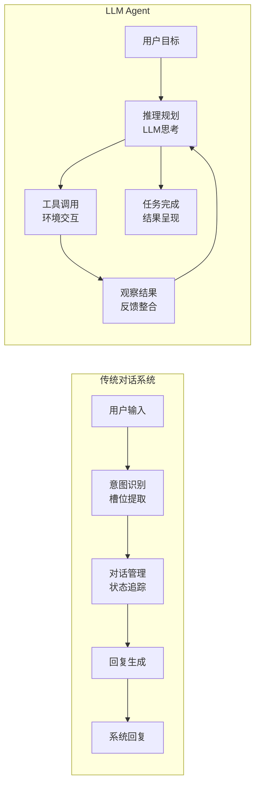

# 对话系统：从 ELIZA 到 GPT 前夜

## 引言

对话系统（Dialogue Systems）的历史几乎与 AI 本身一样悠久。从 1966 年的 ELIZA 到 2019 年的 GPT-2，对话系统经历了从简单模式匹配到深度学习的完整演进。然而，在 LLM Agent 出现之前，对话系统始终是"工具"而非"智能体"——它们能够回答问题、执行指令，但缺乏自主性、规划能力和工具使用能力。

理解这段历史，有助于我们认识 LLM Agent 相对于传统对话系统的本质飞跃：对话不再是目的本身，而是智能体与世界交互的媒介；语言模型不再只是生成回复的引擎，而是驱动自主行为的认知核心。

## ELIZA：对话 AI 的起点（1966）

### 模式匹配的魔力

1966 年，MIT 的 Joseph Weizenbaum 开发了 ELIZA [Weizenbaum, 1966]，这是最早的对话程序之一。ELIZA 最著名的脚本 DOCTOR 模拟了一位罗杰斯式心理治疗师（Rogerian Therapist），通过简单的模式匹配和转换规则与用户对话。

ELIZA 的工作原理极其简单：扫描用户输入中的关键词，根据关键词的优先级选择对应的转换规则，将用户的陈述转化为问题或反射性回复。例如：

- 用户："I am sad" -> ELIZA："How long have you been sad?"（模式：I am X -> How long have you been X?）
- 用户："My mother hates me" -> ELIZA："Tell me more about your family."（关键词：mother/father/family 触发家庭话题）
- 用户："I think you don't understand" -> ELIZA："What makes you think I don't understand?"（模式：I think X -> What makes you think X?）

当没有匹配的关键词时，ELIZA 会使用通用回复如"Please go on"或"That's very interesting"来维持对话。

### ELIZA 效应

令 Weizenbaum 震惊（甚至恐惧）的是，许多用户在明知 ELIZA 只是程序的情况下，仍然对它产生了情感依赖。他的秘书甚至要求他离开房间，以便"私下"与 ELIZA 交谈。这种现象后来被称为"ELIZA 效应"（ELIZA Effect）——人类倾向于将智能和理解归因于能够产生类人回复的系统，即使该系统实际上并不理解任何内容。

Weizenbaum 对此深感不安，后来写了 *Computer Power and Human Reason*（1976）一书，警告人们不要过度信任计算机系统。这一警告在今天的 LLM 时代更加值得深思：当 ChatGPT 产生流畅、有见地的回复时，我们是否也在经历某种形式的 ELIZA 效应？

### 技术遗产

尽管 ELIZA 的技术极其简单，它确立了对话系统的基本交互模式：用户输入文本，系统生成回复，循环往复。这个模式延续至今。ELIZA 也证明了一个重要观点：在对话场景中，"看起来智能"和"真正智能"之间的差距可能比我们想象的要小——至少在短时间交互中是如此。

## ALICE 与 AIML（1995-2000s）

Richard Wallace 开发的 ALICE（Artificial Linguistic Internet Computer Entity）和配套的 AIML（Artificial Intelligence Markup Language）代表了模式匹配方法的成熟形态 [Wallace, 2009]。AIML 允许开发者用 XML 格式定义大量的模式-回复对，支持通配符匹配、递归模板调用、上下文管理（topic 标签）和条件分支。

一个典型的 AIML 模式如下：

```xml
<category>
  <pattern>WHAT IS YOUR NAME</pattern>
  <template>My name is ALICE.</template>
</category>

<category>
  <pattern>DO YOU KNOW *</pattern>
  <template>
    <srai>WHO IS <star/></srai>
  </template>
</category>
```

ALICE 三次获得 Loebner 奖（图灵测试的年度竞赛），证明了精心设计的规则系统可以在短时间对话中产生相当自然的交互。到 2010 年代，ALICE 的知识库包含了超过 40,000 个 AIML 类别。

然而，AIML 系统的根本局限在于：所有知识必须手工编写，系统无法理解未预见的输入模式，也无法从对话中学习。每一个新的对话场景都需要人工添加新的模式-回复对。这与[专家系统时代](./symbolic-ai-era.md)的知识获取瓶颈本质上是同一个问题。

## 任务导向对话系统（1990s-2010s）

### 槽填充范式

任务导向对话系统（Task-Oriented Dialogue Systems）是对话 AI 在商业领域最成功的应用形态。其核心范式是槽填充（Slot Filling）：系统维护一组需要收集的信息槽（Slots），通过多轮对话逐步获取用户的需求信息，最终执行相应的操作（如预订餐厅、查询航班、设置闹钟）。

一个典型的任务导向对话系统包含以下组件：

**自然语言理解（NLU）**：将用户的自然语言输入转化为结构化的语义表示，包括意图识别（Intent Detection，如"预订餐厅"）和槽位提取（Slot Extraction，如"时间=明天晚上7点"、"人数=4"）。

**对话状态追踪（DST）**：维护当前对话的完整状态——哪些槽位已填充、哪些还缺失、用户的约束条件是什么。

**对话策略（Policy）**：决定系统在每一轮应该采取什么动作——是询问某个缺失的槽位、确认已有信息、还是执行最终操作。

**自然语言生成（NLG）**：将系统的动作转化为自然语言回复呈现给用户。

### 对话状态追踪的演进

对话状态追踪（Dialogue State Tracking, DST）是任务导向对话系统的核心技术挑战 [Williams et al., 2013]。系统需要在每一轮对话后准确更新对当前对话状态的估计，处理用户的修正（"不，我说的是意大利餐厅，不是法国餐厅"）、隐含信息（"那附近有没有？"——"附近"指的是之前提到的地点）和不确定性。

DSTC（Dialogue State Tracking Challenge）系列评测从 2013 年开始举办，推动了技术的快速演进：早期方法基于手工规则和条件随机场（CRF）；中期引入了循环神经网络（RNN）和注意力机制；后期使用预训练语言模型（BERT）进行端到端的状态预测。

### 对话策略学习

对话策略（Dialogue Policy）决定了系统在每一轮应该采取什么动作。早期系统使用手工规则（如"如果缺少时间槽，就询问时间"），但这种方法难以处理复杂的对话情况和用户行为的多样性。

后来研究者尝试用强化学习来优化对话策略 [Young et al., 2013]，将对话建模为 MDP：状态是当前的对话状态，动作是系统可以采取的对话行为（询问、确认、推荐等），奖励基于任务完成率和对话轮数。这种方法可以自动学习在不同情况下的最优策略，但需要大量的对话数据或用户模拟器来训练。

## 商业虚拟助手时代（2011-2020）

### Siri（2011）

Apple 的 Siri 是第一个大规模商业部署的智能语音助手，2011 年随 iPhone 4S 发布。它结合了语音识别（ASR）、自然语言理解（NLU）、对话管理和语音合成（TTS），能够处理设置闹钟、发送消息、查询天气、播放音乐等日常任务。

Siri 的技术架构本质上是一个大规模的任务导向对话系统，支持数十个预定义的"域"（Domain），每个域有自己的意图集合和槽位定义。用户的请求首先被路由到正确的域，然后在域内进行意图识别和槽填充。

### Amazon Alexa（2014）与 Google Assistant（2016）

Alexa 和 Google Assistant 进一步推广了语音助手的概念，并引入了重要的可扩展性机制：

**Alexa Skills**：第三方开发者可以为 Alexa 开发"技能"（Skills），每个技能处理特定领域的对话。用户通过唤醒词（"Alexa, open [skill name]"）来激活特定技能。到 2020 年，Alexa 平台上有超过 100,000 个第三方技能。

**Google Actions**：类似的扩展机制，允许第三方服务通过 Google Assistant 提供对话接口。

这种可扩展性的思想——通过插件/技能来扩展助手的能力——与今天 LLM Agent 的工具使用（Tool Use）和插件（Plugin）机制有着直接的传承关系。

### 商业助手的根本局限

尽管这些产品拥有数亿用户，它们的能力边界非常明确：

**意图封闭**：只能处理预定义的意图集合。面对"帮我想一个创意的生日礼物"这样的开放请求，系统要么无法理解，要么只能给出预设的通用回复。

**对话浅层**：难以进行多轮复杂推理。用户不能说"基于我上周的日程安排，帮我规划下周的会议"——系统缺乏这种跨会话的推理能力。

**无自主性**：只能被动响应用户指令，不能主动发起行动或在后台持续工作。

**技能隔离**：各个技能/域之间相互独立，无法组合使用。用户不能说"查一下明天的天气，如果下雨就帮我取消户外活动并通知参与者"——这需要跨域的推理和行动链。

## 神经网络对话模型的兴起

### Seq2Seq 模型（2014-2017）

序列到序列（Sequence-to-Sequence, Seq2Seq）模型 [Sutskever et al., 2014] 的出现为开放域对话带来了新的可能。Seq2Seq 使用编码器-解码器（Encoder-Decoder）架构：编码器将输入序列压缩为一个固定长度的向量表示，解码器从这个表示生成输出序列。

Vinyals 和 Le 在 2015 年展示了用 Seq2Seq 模型进行开放域对话的可行性 [Vinyals and Le, 2015]——在大量电影字幕和 IT 帮助台对话上训练后，模型能够生成语法正确且有时令人惊讶的回复。

然而，早期的 Seq2Seq 对话模型存在严重问题：倾向于生成通用的、无信息量的回复（如"I don't know"、"That's interesting"）；缺乏一致的人格和知识（同一个模型可能在不同对话中给出矛盾的自我描述）；无法进行长程连贯的对话（容易"忘记"之前说过的内容）。

### 注意力机制与 Transformer

注意力机制（Attention Mechanism）[Bahdanau et al., 2015] 解决了 Seq2Seq 模型的信息瓶颈问题——解码器在生成每个词时可以"关注"编码器输出的不同部分，而不是依赖单一的固定向量。

2017 年，Vaswani 等人提出的 Transformer 架构 [Vaswani et al., 2017] 彻底改变了 NLP 的格局。Transformer 完全基于自注意力机制（Self-Attention），抛弃了 RNN 的顺序处理方式，实现了高效的并行计算和对长距离依赖的有效建模。这一架构成为后来所有大型语言模型的基础。

### 预训练对话模型

在 Transformer 架构的基础上，一系列大规模预训练对话模型展示了规模化的威力：

**DialoGPT**（Microsoft, 2020）[Zhang et al., 2020]：在 1.47 亿条 Reddit 对话上微调 GPT-2，生成的回复在人类评估中接近真实人类回复的质量。

**Meena**（Google, 2020）[Adiwardana et al., 2020]：26 亿参数的端到端对话模型，在 341GB 的社交媒体对话上训练。Google 提出了 SSA（Sensibleness and Specificity Average）指标来评估对话质量。

**BlenderBot**（Meta, 2021）[Roller et al., 2021]：结合了多种对话能力——知识、共情、人格一致性，通过多任务训练实现。

这些模型能够产生更加自然、有趣、知识丰富的回复，但仍然缺乏真正的理解和推理能力——它们是优秀的"对话生成器"，但不是"智能体"。

## GPT 系列：涌现的对话能力（2018-2019）

### GPT-1（2018）

OpenAI 的 GPT-1（Generative Pre-trained Transformer）[Radford et al., 2018] 证明了一个重要的假设：通过在大规模文本上进行无监督预训练（语言建模），然后在特定任务上微调，可以获得强大的语言理解和生成能力。

GPT-1 有 1.17 亿参数，在 BooksCorpus（约 7000 本书）上预训练。尽管规模不大，它在 12 个 NLP 基准中的 9 个上取得了当时的最佳成绩，证明了"预训练 + 微调"范式的有效性。

### GPT-2（2019）

GPT-2 [Radford et al., 2019] 将参数量扩大到 15 亿（最大版本），在 WebText 数据集（约 800 万个网页，40GB 文本）上训练。它展示了令人惊讶的涌现能力（Emergent Capabilities）：

- **零样本任务完成**：无需微调，仅通过适当的提示（Prompt），GPT-2 就能进行文本摘要、翻译、问答等任务
- **连贯长文本生成**：能够生成数百词的连贯文章，保持主题一致性和逻辑连贯性
- **简单推理**：能够进行基本的常识推理和简单的数学计算

OpenAI 最初因担心滥用风险（生成虚假新闻、垃圾邮件等）而延迟发布完整模型，这本身就说明了模型能力的飞跃。

### 从 GPT-2 到 LLM Agent 的概念跳跃

GPT-2 的意义在于它暗示了一种新的可能性：足够大的语言模型可能不需要为每个任务单独训练，而是通过"提示"（Prompting）来引导其行为。这一洞察直接通向了 GPT-3（2020）的 few-shot learning 和后来的 LLM Agent 范式。

然而，从 GPT-2 到 LLM Agent 之间仍然缺少几个关键环节：指令遵循能力（通过 RLHF 实现）、工具使用能力（通过 function calling 实现）、以及将语言模型嵌入行动循环的框架设计（ReAct 等）。这些将在后续章节中详细讨论。

## 从对话系统到智能体：缺失的环节



传统对话系统与 LLM Agent 之间存在几个关键的质的差异：

**自主性（Autonomy）**：对话系统被动响应每一轮用户输入，等待用户驱动对话前进；Agent 可以自主决定下一步行动，在没有用户输入的情况下继续工作——搜索信息、调用 API、修改文件、验证结果。

**规划能力（Planning）**：对话系统通常只考虑当前轮次的最佳回复，其"规划"局限于槽填充的顺序；Agent 能够制定多步计划来达成复杂目标，并在执行过程中根据反馈调整计划。

**工具使用（Tool Use）**：对话系统的"能力"局限于其训练数据和预定义的少量 API 调用；Agent 可以动态选择和组合各种工具（搜索引擎、代码执行器、数据库、外部 API）来解决新问题。

**持续性（Persistence）**：对话系统的"记忆"通常局限于当前会话的上下文窗口；Agent 可以维护长期记忆、管理文件系统、更新知识库。

**目标导向（Goal-directedness）**：对话系统的目标是产生合适的回复——对话本身就是目的；Agent 的目标是完成用户交付的任务，对话只是与用户和环境交互的手段之一。

## 为 LLM Agent 铺路

回顾对话系统的历史，我们可以看到几条汇聚的技术路线如何共同为 LLM Agent 的出现创造了条件：

**自然语言理解的演进**：从 ELIZA 的模式匹配到 BERT 的深度语义理解，系统处理自然语言的能力持续提升。这使得 Agent 可以通过自然语言接收任务、理解上下文、与用户沟通。

**预训练语言模型的出现**：GPT 系列证明了通用语言能力可以从数据中学习，无需为每个任务单独设计。这为"一个模型，多种能力"的 Agent 范式奠定了基础。

**对话管理的经验积累**：任务导向对话系统积累了关于多轮交互、状态追踪和策略优化的丰富经验。这些经验在 Agent 的对话管理和上下文维护中得到了继承。

**商业验证**：Siri、Alexa 等产品验证了用户对"AI 助手"的需求和接受度，建立了用户与 AI 对话交互的习惯。

缺失的最后一块拼图是：一个足够强大的语言模型，能够同时具备理解、推理、规划和生成的能力，并且可以通过自然语言指令来引导其行为。GPT-3（2020）和后续模型的出现填补了这一空白，开启了 LLM Agent 的新时代。

## 本章小结

对话系统的发展历程（1966-2019）展示了人机对话从简单模式匹配到深度学习的完整演进。ELIZA 开创了对话 AI 的先河并揭示了 ELIZA 效应，AIML 将模式匹配方法推向极致，任务导向系统在商业领域取得了实际成功，Siri 等虚拟助手将对话 AI 带入了数亿用户的日常生活，Seq2Seq 和 Transformer 架构革新了对话生成技术，而 GPT 系列模型则展示了语言模型的涌现能力。

然而，在整个演进过程中，对话系统始终是"工具"而非"智能体"——它们缺乏自主性、规划能力和真正的目标导向行为。LLM Agent 的出现标志着一个质的飞跃：对话不再是目的，而是智能体与人类和环境交互的媒介；语言模型不再只是生成回复的引擎，而是驱动自主行为的认知核心。从对话系统到 LLM Agent 的跨越，本质上是从"回答问题"到"解决问题"的范式转换。

## 延伸阅读

- [Weizenbaum, 1966] ELIZA - A Computer Program for the Study of Natural Language Communication Between Man and Machine. *Communications of the ACM*, 9(1), 36-45.
- [Jurafsky and Martin, 2023] *Speech and Language Processing* (3rd Edition). Chapter 24: Dialogue Systems and Chatbots.
- [Radford et al., 2019] Language Models are Unsupervised Multitask Learners. OpenAI Technical Report.
- [Vaswani et al., 2017] Attention Is All You Need. *NeurIPS 2017*.
- [Young et al., 2013] POMDP-Based Statistical Spoken Dialogue Systems: A Review. *Proceedings of the IEEE*, 101(5), 1160-1179.
- [Gao et al., 2019] Neural Approaches to Conversational AI. *Foundations and Trends in Information Retrieval*, 13(2-3), 127-298.
- [Radford et al., 2018] Improving Language Understanding by Generative Pre-Training. OpenAI Technical Report.
