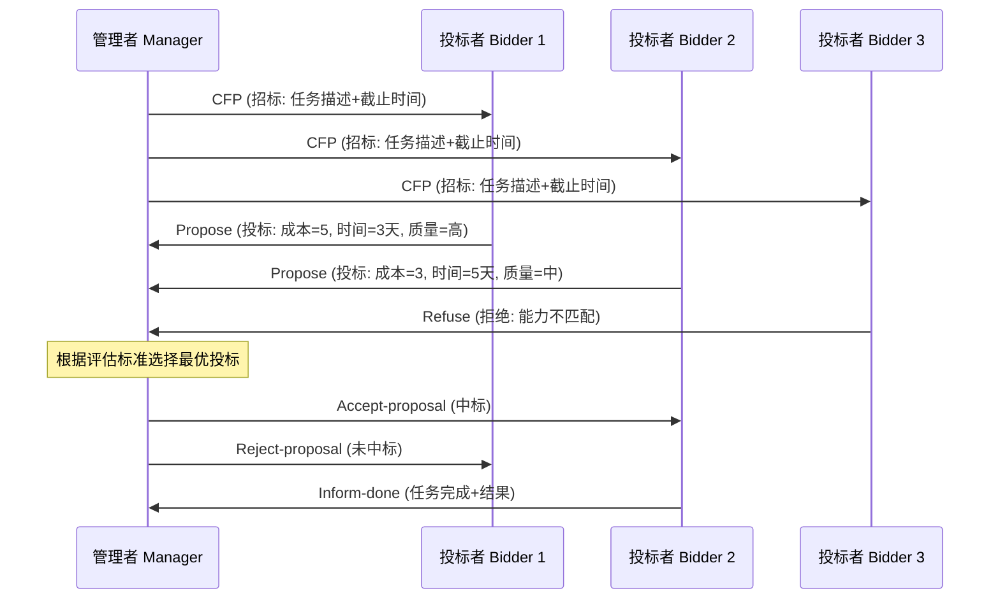

# 多智能体系统的兴起（1990s-2010s）

## 引言

当单个智能体的理论框架（如 [BDI 模型](./reactive-and-bdi.md)）逐渐成熟后，一个自然的问题浮现：多个智能体如何协作解决单个智能体无法独立完成的问题？多智能体系统（Multi-Agent Systems, MAS）研究在 1990 年代蓬勃发展，建立了通信标准、协商协议和开发平台，形成了一个完整的学术生态。然而，这些工作在很长时间内未能实现大规模商业落地。理解 MAS 的成就与局限，对于今天设计 LLM 多 Agent 系统具有重要的参考价值。

## 为什么需要多智能体？

多智能体系统的动机来自多个方面：

**分布式问题的本质需求**：许多现实问题天然是分布式的——供应链中的多个企业各自拥有私有信息和自主决策权，互联网上的多个服务需要协调工作，城市中的多个交通信号灯需要协同优化。这些场景中不存在一个全知全能的中央控制器，分布式的智能体模型是更自然的抽象。

**复杂性管理**：将一个复杂系统分解为多个自主交互的智能体，比构建一个单一的集中式系统更容易设计、理解和维护。每个智能体只需关注自己的局部目标和能力，全局行为从局部交互中涌现。

**鲁棒性与可扩展性**：分布式系统没有单点故障，个别智能体的失效不会导致整个系统崩溃。新的智能体可以动态加入系统，无需重新设计整体架构。

**自然建模**：许多领域（经济市场、社会系统、生态系统）本身就由多个自主实体组成，用多智能体模型来描述和模拟这些系统是最自然的方式。

## FIPA 标准与智能体通信语言

### FIPA 的建立与使命

智能体间通信（Agent Communication）是 MAS 的核心问题。如果智能体不能有效地交换信息、协调行动，多智能体系统就无法发挥其优势。1996 年成立的 FIPA（Foundation for Intelligent Physical Agents）致力于制定智能体互操作标准 [FIPA, 2002]，其目标是让不同开发者、不同平台上的智能体能够无缝通信。

### 从 KQML 到 FIPA-ACL

早期的智能体通信语言 KQML（Knowledge Query and Manipulation Language）由 DARPA 资助开发 [Finin et al., 1994]。KQML 定义了一组"表演词"（Performatives），如 tell、ask、achieve 等，用于描述消息的通信意图。

[FIPA-ACL](../../appendix/glossary.md#fipa-acl) 在 KQML 的基础上进行了改进和标准化，其理论基础是 Searle 的[言语行为理论（Speech Act Theory）](../../appendix/glossary.md#speech-act-theory)——通信不仅仅是信息传递，更是一种“行为”。

- **inform**：告知另一个智能体某个命题为真
- **request**：请求另一个智能体执行某个动作
- **query-if / query-ref**：询问命题真值或引用值
- **propose**：提出一个协议或方案
- **agree / refuse**：接受或拒绝请求
- **cfp (call for proposals)**：发起招标，请求投标
- **confirm / disconfirm**：确认或否认一个命题
- **subscribe**：订阅某类信息的更新通知

每条 ACL 消息是一个结构化的数据包，包含发送者（sender）、接收者（receiver）、通信行为类型（performative）、内容（content）、内容语言（content-language）、本体（ontology）、会话标识（conversation-id）等字段。

### 智能体管理架构

FIPA 还定义了智能体平台（Agent Platform）的标准架构，包含三个核心服务：

**智能体管理系统（Agent Management System, AMS）**：负责智能体的生命周期管理——创建、销毁、挂起、恢复。每个智能体在 AMS 中注册一个唯一标识符（Agent Identifier, AID）。

**目录服务（Directory Facilitator, DF）**：提供黄页（Yellow Pages）功能。智能体可以在 DF 中注册自己提供的服务，也可以查询 DF 来发现具有特定能力的其他智能体。这种服务发现机制与今天微服务架构中的服务注册与发现有着直接的对应关系。

**消息传输服务（Message Transport Service, MTS）**：负责消息的可靠投递，支持多种传输协议（HTTP、IIOP 等）。

### 交互协议

FIPA 定义了一系列标准交互协议（Interaction Protocols），规定了多轮通信的消息序列和状态转换。常用的协议包括：FIPA-Request（简单请求-响应）、FIPA-Query（查询协议）、FIPA-Contract-Net（合同网招标协议）、FIPA-Propose（提案协议）等。

## 协商与协调机制

### 合同网协议（Contract Net Protocol）

[合同网协议（Contract Net Protocol, CNP）](../../appendix/glossary.md#contract-net)是最经典的多智能体协调机制之一 [Smith, 1980]。它模拟了现实世界中的招标-投标过程：

合同网协议的优势在于去中心化的任务分配——没有全知的中央调度器，每个智能体根据自身能力和当前负载决定是否投标以及如何报价。这种机制天然支持动态环境：新的智能体可以随时加入竞标，失效的智能体会自动退出。

### 拍卖机制

博弈论（Game Theory）中的拍卖机制被广泛应用于多智能体资源分配。不同的拍卖形式适用于不同场景：英式拍卖（公开递增出价）适合单一物品分配；荷兰式拍卖（公开递减报价）适合快速成交；[Vickrey 拍卖](../../appendix/glossary.md#vickrey-auction)（密封第二价格）鼓励真实报价；[组合拍卖（Combinatorial Auction）](../../appendix/glossary.md#combinatorial-auction)处理多物品的捆绑分配。

这些机制为智能体在竞争环境中的理性决策提供了理论保证——在特定条件下，可以证明某种拍卖机制能够达到社会最优或[帕累托最优](../../appendix/glossary.md#pareto-optimal)的分配结果。

### 协作规划与联合意图

对于需要多个智能体共同完成的复杂任务，简单的任务分配不够——智能体需要形成共同目标、协调行动时序、处理依赖关系。

**联合意图理论（Joint Intentions）**[Cohen and Levesque, 1991]：扩展了单智能体的意图概念，定义了多个智能体共同承诺追求某个目标的条件和维持规则。当团队中的任何成员发现目标已达成或不可能达成时，有义务通知其他成员。

**共享计划理论（SharedPlans）**[Grosz and Kraus, 1996]：描述了智能体如何形成关于协作行动的共享心智状态，包括对子任务分配的共识、对彼此能力的信念、以及对协调约束的理解。

这些理论虽然高度抽象，但其核心思想——团队成员需要共享目标、相互了解能力、协调行动——在今天的多 LLM Agent 系统设计中仍然适用。

## 开发平台与工具

### JADE（Java Agent DEvelopment Framework）

JADE 是最广泛使用的 FIPA 兼容智能体开发平台 [Bellifemine et al., 2007]。它提供了：完整的 FIPA-ACL 通信实现、智能体生命周期管理（AMS）、黄页服务（DF）、图形化管理和调试工具、分布式部署支持（智能体可以在不同主机上运行）。

JADE 的设计理念是让开发者专注于智能体的行为逻辑（通过继承 Behaviour 类来定义），而不必关心底层通信和平台管理的细节。

### Jason

Jason 是 AgentSpeak(L) 语言的开源解释器 [Bordini et al., 2007]，专门用于开发 BDI 智能体。它提供了从 BDI 理论到实现的完整工具链，支持计划库管理、信念修正、意图选择等 BDI 核心机制。Jason 可以与 JADE 集成，让 BDI 智能体在 FIPA 兼容的平台上运行和通信。

### NetLogo

NetLogo 是一个多智能体建模和模拟环境 [Wilensky, 1999]，主要用于研究和教育。它特别适合探索[涌现行为（Emergent Behavior）](../../appendix/glossary.md#emergent-abilities)——大量简单智能体的局部交互如何产生复杂的全局模式。经典示例包括：鸟群飞行（Flocking）模型展示了简单的对齐、聚集、分离规则如何产生逼真的群体运动；Schelling 隔离模型展示了轻微的个体偏好如何导致严重的群体隔离。

### 其他重要平台

**JACK**：基于 BDI 的商业智能体平台，由 Agent Oriented Software 公司开发，在军事和工业领域有实际部署。

**Repast / MASON**：大规模社会模拟平台，支持数百万智能体的高效模拟。

**SPADE**：基于 Python 的现代智能体平台，使用 XMPP 协议进行通信。

## 应用领域

### 分布式问题求解

多智能体系统在需要分布式决策的领域有成功应用：电力网格中的分布式发电调度、传感器网络中的协作目标追踪、交通信号灯的自适应协调控制。这些应用的共同特点是：问题天然分布、集中式方案不可行或不经济、局部决策需要协调。

### 电子商务与自动化谈判

1990 年代末到 2000 年代初，智能体在电子商务中的应用是研究热点。自动化谈判（Automated Negotiation）让买卖双方的智能体代表各自利益进行价格和条款的协商；比价购物智能体（Shopping Agents）自动在多个网站间比较价格；供应链协调让上下游企业的智能体协商生产计划和库存策略。

虽然大多数停留在学术原型阶段，但其思想影响了后来的推荐系统、程序化广告交易和自动化做市商。

### 基于智能体的建模与社会模拟

基于智能体的建模（Agent-Based Modeling, ABM）在社会科学、经济学和流行病学中得到广泛应用。通过模拟大量异质智能体的交互，研究者可以探索复杂社会现象的涌现机制：经济市场中的泡沫和崩盘、传染病的传播动态、城市交通的拥堵模式、社会规范的形成与演化。

ABM 的核心价值在于它能够捕捉传统方程模型无法表达的异质性和局部交互效应。

### 语义 Web 智能体

2000 年代，Tim Berners-Lee 提出的语义 Web（Semantic Web）愿景中，智能体扮演重要角色——它们能够理解网页的语义标注（RDF、OWL），自动发现和组合 Web 服务（WSDL、UDDI），代表用户完成复杂的在线任务。

这一愿景虽未完全实现（语义标注的普及远低于预期），但其"智能体自主使用互联网服务"的思想在今天的 LLM Agent 中得到了新的诠释——只是 LLM 通过理解自然语言描述来使用 API，而非依赖形式化的语义标注。

### 软件智能体

Web 爬虫、邮件过滤器、个人信息管理助手等软件智能体（Software Agents）是 MAS 思想在实际产品中的体现。它们通常不需要复杂的多智能体协调，但体现了自主性（在后台持续运行）和代理性（代表用户执行任务）的核心特征。

## 为什么 MAS 未能进入主流？

尽管学术研究繁荣，传统 MAS 在商业应用中的影响力远不如预期。深入分析其原因，对今天的 LLM Agent 开发者有重要的警示意义：

**单体智能不足**：传统智能体的"智能"来自手工编写的规则或简单的学习算法，无法处理自然语言、理解复杂意图或在开放环境中灵活应对。没有足够的单体智能，多智能体协作的价值也就有限——协调一群"笨"智能体的收益往往不如直接构建一个更好的集中式系统。

**开发成本过高**：设计智能体的知识库、通信[本体（Ontology）](../../appendix/glossary.md#ontology)、协调策略需要大量领域专业知识和工程投入。对于大多数实际问题，传统的客户端-服务器架构或消息队列方案更简单、更可靠。

**标准过于学术化**：FIPA 标准虽然完善，但对于大多数实际应用来说过于复杂和重量级。开发者更倾向于使用简单的 REST API 或消息队列来实现服务间通信，而不是实现完整的 ACL 和交互协议。

**缺乏杀手级应用**：MAS 没有产生一个让普通用户或企业"必须使用"的应用场景。大多数成功案例局限于特定的工业或学术领域，缺乏广泛的商业吸引力。

**时机未到**：MAS 的许多愿景——智能体自主浏览互联网、代表用户谈判、协作完成复杂任务——需要更强大的基础智能能力。LLM 的出现恰好填补了这一空白，使得 20 年前的愿景终于有了实现的技术基础。

## 对今天 LLM 多 Agent 系统的启示

传统 MAS 研究为今天的 LLM 多 Agent 系统提供了丰富的理论资源和实践教训：

**通信设计仍然重要**：结构化消息、明确的通信意图、能力发现机制——这些原则在 AutoGen、CrewAI、LangGraph 等现代框架中以新的形式出现。虽然 LLM Agent 使用自然语言通信（而非形式化的 ACL），但消息的结构化（如角色标注、任务描述、结果格式）仍然是系统可靠性的关键。

**协调机制的理论基础仍然适用**：任务分配（谁做什么）、冲突解决（意见不一致时怎么办）、共识达成（如何确认团队目标）——这些问题不会因为底层技术的变化而消失。

**过度工程的教训**：FIPA 标准的过度复杂化是一个警示。今天的 LLM 多 Agent 框架也面临类似的风险——过于复杂的协调机制可能不如简单的"一个 Agent 调用另一个 Agent"模式有效。

**新的挑战**：LLM 多 Agent 系统也面临传统 MAS 未曾遇到的问题：LLM 的不确定性使得协议执行不可靠（Agent 可能"忘记"遵循协议）；自然语言通信虽然灵活但缺乏形式化保证；大规模 LLM 调用的成本和延迟问题。

## 本章小结

多智能体系统研究（1990s-2010s）建立了智能体间通信、协商和协调的理论与工程框架。FIPA 标准定义了通信语言和平台架构，合同网协议等机制解决了分布式任务分配问题，JADE 等平台降低了开发门槛，ABM 方法在社会模拟中取得了广泛应用。

然而，受限于单体智能的不足和过高的工程复杂度，传统 MAS 未能实现大规模商业落地。LLM 的出现为多智能体系统注入了新的生命力——强大的语言理解和生成能力使得智能体终于能够灵活地通信和协作，使得许多 20 年前的愿景终于有了实现的可能。

下一章将转向另一条技术路线——[强化学习智能体](./rl-agents.md)如何在封闭环境中展现出超人的决策能力。

## 延伸阅读

- [Wooldridge, 2009] *An Introduction to MultiAgent Systems* (2nd Edition). Wiley.
- [Weiss, 1999] *Multiagent Systems: A Modern Approach to Distributed Artificial Intelligence*. MIT Press.
- [Bellifemine et al., 2007] *Developing Multi-Agent Systems with JADE*. Wiley.
- [Shoham and Leyton-Brown, 2008] *Multiagent Systems: Algorithmic, Game-Theoretic, and Logical Foundations*. Cambridge University Press.
- [FIPA, 2002] FIPA ACL Message Structure Specification. http://www.fipa.org/specs/fipa00061/
- [Smith, 1980] The Contract Net Protocol: High-Level Communication and Control in a Distributed Problem Solver. *IEEE Transactions on Computers*, C-29(12).
- [Bordini et al., 2007] *Programming Multi-Agent Systems in AgentSpeak using Jason*. Wiley.
