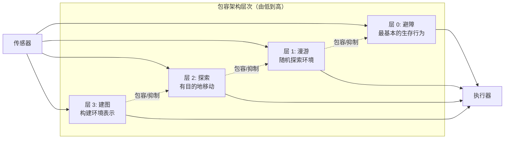
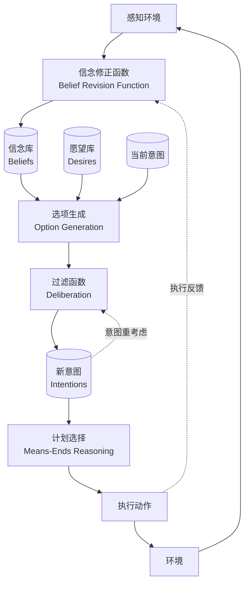

# 反应式架构与 BDI 模型（1980s-1990s）

## 引言

1980 年代中期，符号 AI 的局限性日益明显——[专家系统的脆弱性](./symbolic-ai-era.md)和规划系统在真实环境中的低效，引发了一场关于"智能体应该如何构建"的根本性辩论。一方面，Rodney Brooks 提出完全抛弃符号表示，让智能体直接对环境做出反应；另一方面，BDI（Belief-Desire-Intention）模型试图在哲学理性理论的基础上构建更优雅的审慎式智能体。这场辩论最终催生了混合架构，也为今天 LLM Agent 的设计提供了重要的理论参照。

这个时代的核心贡献不在于产生了实用的商业系统，而在于深入思考了"智能体应该如何做决策"这一根本问题。这些思考的成果——反应性与审慎性的平衡、意图的持续性、分层架构——在今天的 LLM Agent 设计中以新的形式重现。

## Brooks 的包容架构（1986）

### 对符号 AI 的反叛

1986 年，MIT 的 Rodney Brooks 发表了具有颠覆性的论文 *A Robust Layered Control System for a Mobile Robot*，随后在 1991 年的 *Intelligence without Representation* 中更明确地阐述了他的立场 [Brooks, 1991]。Brooks 的核心论点可以概括为几个激进的主张：

第一，传统 AI 犯了根本性错误：试图在机器内部建立世界的完整符号模型，然后基于这个模型进行推理。真实世界太复杂、变化太快，任何内部模型都会迅速过时。

第二，"世界本身就是它自己最好的模型"（The world is its own best model）。与其维护一个不完美的内部表示，不如让智能体直接感知和响应环境。

第三，智能不需要集中式的推理和规划。复杂的行为可以从简单行为的组合中涌现出来。

### 包容架构的设计原则

包容架构（Subsumption Architecture）将智能体组织为多个并行运行的行为层（Behavior Layers），每一层直接将感知映射到动作，无需经过中央处理器：



关键设计原则包括：

**无中央控制**：没有全局的决策模块，每一层都是独立的完整控制系统。

**无全局模型**：没有统一的世界表示，每一层维护自己需要的最少信息。

**层次包容**：高层行为可以"包容"（抑制或替代）低层行为的输出，但低层行为始终在运行，确保基本安全。

**增量构建**：可以逐层添加新的行为能力，而不需要修改已有的层。

### 成功案例

Brooks 的机器人展示了包容架构的实际效果。六足行走机器人 Genghis 仅用 57 个有限状态机（分布在各层中）就实现了在崎岖地形上的稳定行走、避障和目标追踪。相比之下，传统的规划方法需要复杂的运动学模型和路径规划算法。

Herbert 机器人能够在办公室环境中收集空饮料罐——它不需要"理解"什么是饮料罐，只需要对特定的视觉模式做出抓取反应。

### 局限性

纯反应式架构在需要以下能力的任务中表现不佳：长期规划（无法制定多步计划）、抽象推理（无法处理符号级别的问题）、复杂目标管理（无法权衡多个相互冲突的目标）、学习和适应（行为层通常是预先设计的）。一只昆虫可以用反应式行为生存，但人类的智能显然需要更多。

## 反应式 vs 审慎式：一场范式之争

这场辩论的核心问题是：智能体是否需要内部表示（Internal Representation）？

| 维度 | 审慎式（Deliberative） | 反应式（Reactive） |
|------|----------------------|-------------------|
| 世界模型 | 维护显式符号模型 | 无内部模型，直接感知 |
| 决策方式 | 搜索、推理、规划 | 情境-动作规则映射 |
| 响应速度 | 慢（需要推理时间） | 快（直接映射） |
| 环境适应 | 差（模型可能过时） | 好（直接感知当前环境） |
| 复杂任务 | 能处理多步规划 | 难以处理需要前瞻的任务 |
| 可预测性 | 高（推理过程可追踪） | 低（涌现行为难以预测） |
| 代表系统 | GPS, STRIPS, 专家系统 | 包容架构, 行为机器人 |

这场辩论没有绝对的赢家。实践证明，有效的智能体通常需要两种能力的结合——这直接导向了混合架构和 BDI 模型的发展。今天的 LLM Agent 实际上天然具有两种模式：直接回答简单问题时是"反应式"的，而进行多步推理和工具调用时是"审慎式"的。

## BDI 模型：理性智能体的哲学基础

### 从哲学到计算

BDI（Belief-Desire-Intention）模型源于哲学家 Michael Bratman 关于人类实践推理（Practical Reasoning）的理论 [Bratman, 1987]。Bratman 研究的核心问题是：人类如何在有限的认知资源下做出理性决策？他的答案是：通过形成和维持"意图"来约束未来的推理空间。

Anand Rao 和 Michael Georgeff 将这一哲学框架形式化为计算模型 [Rao and Georgeff, 1995]，使其可以被实现为软件系统。BDI 模型用三个核心心智态度来描述智能体的内部状态：

**信念（Belief）**：智能体对世界状态的认知。信念可能不完整（智能体不知道所有事实）或不正确（智能体的认知可能与现实不符）。信念会随着新的感知信息而更新。

**愿望（Desire）**：智能体希望达成的状态或目标。愿望可以相互矛盾——我可能既想减肥又想吃蛋糕。愿望代表了智能体的动机，但不一定都会被追求。

**意图（Intention）**：智能体承诺要执行的行动计划。意图是从愿望中经过审慎选择后形成的，代表了智能体的承诺。一旦形成意图，智能体会持续追求直到完成、确认不可能、或理由消失。

### BDI 的推理循环



BDI 智能体的核心推理循环包含以下步骤：感知环境并更新信念；基于信念和愿望生成可能的选项；通过审慎过程（考虑当前意图的约束）过滤选项形成新意图；为意图选择具体的执行计划；执行计划中的下一个动作；观察结果并回到第一步。

### 意图的特殊地位

BDI 模型中，意图（Intention）不仅仅是"决定要做的事"，它具有重要的计算属性：

**持续性（Persistence）**：一旦形成意图，智能体不会在每个推理周期都重新考虑。意图只在三种情况下被放弃：相信目标已达成、确信目标不可能达成、或形成意图的理由不再成立。这避免了"永远在思考、从不行动"的问题。

**约束性（Constraining）**：当前意图约束了未来的审慎过程和选项生成。如果我已经决定乘火车去北京，就不需要再考虑飞机方案（除非出现重要的新信息）。这大大减少了决策的计算复杂度。

**推理导向（Reasoning-directed）**：意图引导智能体进行手段-目的推理——"我打算做 X，那么我需要先做什么？"意图将高层目标分解为可执行的子目标。

这些属性与今天 LLM Agent 中的"计划执行与修正"机制有着深刻的对应关系。当一个 Agent 制定了多步计划后，它不会在每一步都重新规划整个任务（持续性），已确定的步骤会约束后续的选择（约束性），而高层目标会被分解为具体的工具调用序列（推理导向）。

### 承诺策略

BDI 理论中一个重要的设计选择是承诺策略（Commitment Strategy）——智能体应该多"固执"地坚持其意图？

**盲目承诺（Blind Commitment）**：永不放弃意图，直到相信目标已达成。适合确定性高的环境。

**单一思维（Single-minded Commitment）**：坚持意图直到相信目标已达成或确信不可能达成。最常用的策略。

**开放思维（Open-minded Commitment）**：只要形成意图的理由仍然成立就坚持。适合高度动态的环境，但计算开销大。

这个选择在今天的 Agent 设计中同样重要：Agent 应该多频繁地重新评估其计划？过于频繁会导致效率低下和行为不连贯，过于固执则可能在环境变化后继续执行已经不合适的计划。

## AgentSpeak 语言

AgentSpeak(L) 是 Rao 在 1996 年提出的一种基于 BDI 的智能体编程语言 [Rao, 1996]，后来由 Rafael Bordini 等人实现为 Jason 解释器 [Bordini et al., 2007]。AgentSpeak 的程序由初始信念和计划库组成：

```
// 初始信念
location(home).
battery(full).
time(morning).

// 计划：感知到垃圾且电量充足时，去处理
+garbage(X) : battery(full) & not(raining)
  <- !move_to(X);
     pick_up(X);
     !move_to(trash_bin);
     drop(X);
     .print("Cleaned up ", X).

// 计划：电量不足时，先充电再处理
+garbage(X) : battery(low)
  <- !move_to(charger);
     recharge;
     -battery(low);
     +battery(full);
     !handle_garbage(X).

// 子目标计划：移动到目标位置
+!move_to(Target) : location(Current) & path(Current, Target, Route)
  <- follow_path(Route);
     -location(Current);
     +location(Target).
```

AgentSpeak 的设计体现了 BDI 的核心思想：计划由触发事件（如 +garbage(X) 表示新增了"有垃圾"的信念）和上下文条件（信念查询，如 battery(full)）守卫。智能体根据当前信念选择适用的计划来响应事件。感叹号（!）表示子目标，系统会递归地为子目标选择计划。

## 混合架构

### 认识到单一范式的不足

到 1990 年代中期，研究者们普遍认识到纯反应式和纯审慎式架构各有不足。混合架构（Hybrid Architecture）试图结合两者的优势，通常采用分层设计，不同层次负责不同时间尺度的决策。

### InteRRaP

InteRRaP（Integration of Reactive behavior and Rational Planning）由 Jorg Muller 提出 [Muller, 1996]，采用三层架构：

- **反应层（Behavior-based Layer）**：处理紧急情况和常规行为，响应时间最短
- **规划层（Plan-based Layer）**：处理需要局部规划的任务，如路径规划
- **协作层（Cooperation Layer）**：处理与其他智能体的交互和社会行为

每一层都有自己的知识库（世界模型、心智模型、社会模型），控制流可以在层间上下传递。当高层无法处理时下放到低层，当低层遇到需要更多思考的情况时上报到高层。

### TouringMachines

Ferguson 的 TouringMachines [Ferguson, 1992] 同样采用三层设计（反应层、规划层、建模层），但引入了控制规则（Control Rules）来仲裁层间冲突。控制规则可以抑制某一层的输出、激活某一层、或在层间传递信息。这种显式的冲突解决机制比简单的优先级抑制更加灵活。

### 对现代 Agent 的映射

今天的 LLM Agent 架构中可以清晰地看到混合架构的影子：

- **反应层** 对应 LLM 的即时响应能力——直接回答简单问题，无需调用工具或进行多步推理
- **规划层** 对应 ReAct/Plan-and-Execute 中的推理步骤——分解复杂任务、选择工具、制定执行计划
- **协作层** 对应多 Agent 系统中的通信和协调——Agent 之间的消息传递、任务委托、结果汇总

## 关键人物

**Rodney Brooks**：MIT 教授，iRobot 联合创始人，Rethink Robotics 创始人。包容架构的提出者，行为机器人学（Behavior-based Robotics）的奠基人。他对符号 AI 的批判推动了整个领域的反思，其"快速、廉价、失控"（Fast, Cheap, and Out of Control）的机器人设计哲学影响深远。

**Michael Wooldridge**：牛津大学教授，智能体理论的核心贡献者。他与 Nick Jennings 合著的教材 *An Introduction to MultiAgent Systems* 定义了这个领域的教学框架。他对智能体的经典定义——自主性（Autonomy）、社会性（Social Ability）、反应性（Reactivity）、主动性（Pro-activeness）——至今仍被广泛引用 [Wooldridge and Jennings, 1995]。

**Nick Jennings**：帝国理工教授，英国皇家工程院院士。在多智能体系统的工程方法论和实际应用方面做出了重要贡献，特别是在电子商务和工业控制领域。

**Anand Rao 和 Michael Georgeff**：将 BDI 从哲学理论转化为可计算模型的关键人物。他们在澳大利亚人工智能研究所（AAII）的工作奠定了 BDI 实现的基础，其 PRS（Procedural Reasoning System）是第一个实用的 BDI 系统。

**Michael Bratman**：斯坦福大学哲学教授，BDI 理论的哲学源头。他关于意图在实践推理中的角色的分析，为整个 BDI 智能体研究提供了理论基础。

## 本章小结

1980-90 年代的智能体研究经历了一场深刻的范式转换。Brooks 的反应式架构挑战了符号 AI 的基本假设，证明了无需内部表示也能产生复杂行为；BDI 模型则从哲学出发，为理性智能体提供了优雅的理论框架，特别是关于意图的持续性和约束性的分析；混合架构最终调和了两种极端立场，提出了分层处理不同时间尺度决策的方案。

这个时代最重要的遗产是对"智能体应该如何做决策"的深入思考。BDI 模型中信念-愿望-意图的分离、意图的持续性和约束性、以及审慎与反应的平衡，这些概念在今天的 LLM Agent 设计中以新的形式重现。当我们讨论 Agent 是否应该"先想后做"（Plan-then-Execute）还是"边想边做"（ReAct），本质上是在延续这场 30 年前的辩论。

下一章将探讨当多个这样的智能体需要协作时会发生什么——[多智能体系统的兴起](./multi-agent-systems.md)。

## 延伸阅读

- [Brooks, 1991] Intelligence without Representation. *Artificial Intelligence*, 47(1-3), 139-159.
- [Bratman, 1987] *Intention, Plans, and Practical Reason*. Harvard University Press.
- [Rao and Georgeff, 1995] BDI Agents: From Theory to Practice. *Proceedings of ICMAS-95*.
- [Wooldridge and Jennings, 1995] Intelligent Agents: Theory and Practice. *The Knowledge Engineering Review*, 10(2), 115-152.
- [Wooldridge, 2009] *An Introduction to MultiAgent Systems* (2nd Edition). Wiley. Chapters 3-5.
- [Bordini et al., 2007] *Programming Multi-Agent Systems in AgentSpeak using Jason*. Wiley.
- [Muller, 1996] *The Design of Intelligent Agents: A Layered Approach*. Springer LNAI 1177.
