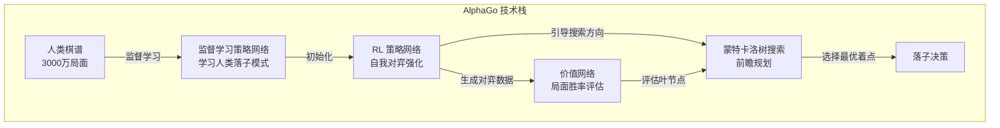
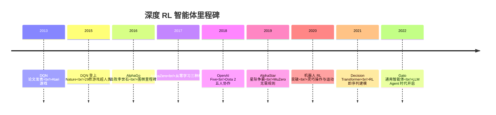

# 强化学习智能体时代（2013-2022）

## 引言

如果说[符号 AI 时代](./symbolic-ai-era.md)的智能体依靠人类编写的规则行动，[BDI 时代](./reactive-and-bdi.md)的智能体依靠哲学理论框架推理，那么强化学习（Reinforcement Learning, RL）时代的智能体则通过与环境的大量交互自主学习最优策略。2013 年 DeepMind 的 DQN 论文开启了深度强化学习的黄金时代，此后十年间，RL 智能体在 Atari 游戏、围棋、星际争霸等领域展现出超越人类的能力。

然而，这些成就也揭示了一个深刻的局限：在封闭、规则明确的环境中表现卓越的智能体，面对开放世界的复杂性时往往束手无策。理解这一局限，是理解为什么 LLM Agent 能够在 RL Agent 未能触及的领域取得突破的关键。

## 强化学习的基本框架

在深入具体系统之前，有必要简要回顾 RL 的基本框架。强化学习将智能体与环境的交互建模为马尔可夫决策过程（Markov Decision Process, MDP）：智能体在每个时间步观察环境状态（State），选择一个动作（Action），环境返回一个奖励（Reward）并转移到新状态。智能体的目标是学习一个策略（Policy），使得长期累积奖励最大化。

这个框架的优雅之处在于其通用性——任何可以被描述为"在环境中做决策以最大化某种目标"的问题，理论上都可以用 RL 来解决。但其局限也正在于此：它要求环境可以被形式化为 MDP，奖励信号可以被明确定义，且智能体有足够的交互机会来学习。

## DQN：深度学习遇见强化学习（2013/2015）

### 突破性工作

2013 年，DeepMind 团队发表了一篇改变 AI 格局的论文：*Playing Atari with Deep Reinforcement Learning* [Mnih et al., 2013]。2015 年，这项工作的完善版本登上了 *Nature* 杂志 [Mnih et al., 2015]。

DQN（Deep Q-Network）的核心创新在于用深度卷积神经网络（CNN）来近似 Q 函数——即在给定状态下采取某个动作的长期期望价值。智能体直接从原始像素输入（210x160 的游戏画面）学习玩 Atari 2600 游戏，无需任何人类先验知识或手工特征工程。

### 关键技术创新

在 DQN 之前，将深度学习与 RL 结合的尝试通常会导致训练不稳定甚至发散。DQN 引入了两个关键技术来解决这个问题：

**经验回放（Experience Replay）**：将智能体过去的交互经验（状态、动作、奖励、下一状态）存储在一个缓冲区中，训练时从中随机采样小批量数据。这打破了连续经验之间的时间相关性，使训练数据更接近独立同分布（i.i.d.）的假设，大大提高了训练稳定性。

**目标网络（Target Network）**：使用一个参数延迟更新的网络来计算目标 Q 值。主网络的参数持续更新，而目标网络每隔固定步数才同步一次。这避免了"追逐移动目标"导致的训练振荡。

### 成果与意义

DQN 在 49 款 Atari 游戏中的 29 款达到或超过了人类专业玩家的水平，使用的是完全相同的算法和超参数——没有针对任何特定游戏进行调整。这证明了一个通用的学习算法可以在多种不同的任务中达到高水平，而无需针对每个任务进行专门设计。

DQN 的成功也标志着 DeepMind 作为 AI 研究机构的崛起（2014 年被 Google 以约 5 亿美元收购），并引发了深度 RL 研究的爆发式增长。

## AlphaGo：征服围棋（2016）

### 历史性时刻

2016 年 3 月，DeepMind 的 AlphaGo 以 4:1 击败围棋世界冠军李世石 [Silver et al., 2016]。围棋的合法局面数约为 2.08 x 10^170（远超宇宙中原子数量约 10^80），每步平均有约 250 个合法着点（国际象棋约 35 个），一局棋平均约 150 手（国际象棋约 80 手）。这种组合爆炸使得暴力搜索完全不可行，围棋长期被认为是 AI 无法在近期攻克的堡垒。

### 技术架构

AlphaGo 的成功来自多种技术的精妙结合：

**策略网络（Policy Network）**：一个 13 层的 CNN，通过监督学习从 3000 万个人类棋谱中的落子位置学习。给定棋盘状态，输出每个位置的落子概率。这个网络的准确率约为 57%（随机猜测约 0.4%）。

**价值网络（Value Network）**：另一个 CNN，评估给定棋盘局面下当前玩家的胜率。通过自我对弈生成的 3000 万个局面进行训练。

**蒙特卡洛树搜索（Monte Carlo Tree Search, MCTS）**：在策略网络和价值网络的引导下进行前瞻搜索。MCTS 通过选择（Selection）、扩展（Expansion）、模拟（Simulation）、回传（Backpropagation）四个步骤，在有限的计算预算内找到最有希望的着点。

**自我对弈强化学习**：策略网络通过与自身的早期版本对弈来进一步提升，使用策略梯度方法以胜负作为奖励信号。

### 文化影响

AlphaGo 的胜利不仅是技术突破，更是一个文化事件。它让全世界认识到 AI 已经能够在需要"直觉"和"创造力"的领域超越人类。李世石赛后表示 AlphaGo 的某些着法"超出了人类的想象"。这极大地推动了 AI 研究的投资和公众关注，也引发了关于 AI 对人类社会影响的广泛讨论。

## AlphaZero 与 MuZero：从零开始的通用智能

### AlphaZero（2017）

AlphaZero 是 AlphaGo 的进化版本 [Silver et al., 2017]，它做出了一个大胆的简化：完全抛弃人类棋谱，仅通过自我对弈从零开始学习。在围棋上，AlphaZero 从随机落子开始，经过约 40 天的自我对弈训练（使用 5000 个 TPU），超越了使用人类知识训练的 AlphaGo Master 版本。

更令人印象深刻的是，同一个算法（无需任何修改）在国际象棋和将棋中也达到了超越所有前辈程序的水平。AlphaZero 在国际象棋中仅用 4 小时训练就超越了 Stockfish（当时最强的国际象棋引擎，凝聚了数十年的人类国际象棋知识）。

AlphaZero 的简洁性令人震撼：一个统一的算法框架（深度残差网络 + MCTS + 自我对弈），无需任何领域特定的知识、启发式规则或开局库，就能在多种棋类中达到超人水平。这强烈暗示了通用智能算法的可能性。

### MuZero（2019）

MuZero 更进一步 [Schrittwieser et al., 2020]：它甚至不需要知道游戏规则（环境的状态转移函数）。MuZero 学习一个环境的隐式模型（Learned Model），在这个学习到的模型中进行规划。

MuZero 的三个核心组件是：

- **表示函数（Representation Function）**：将原始观察映射到隐状态空间
- **动态函数（Dynamics Function）**：在隐状态空间中预测下一个状态和即时奖励
- **预测函数（Prediction Function）**：从隐状态预测策略（动作概率）和价值（期望回报）

这种"学习世界模型然后在模型中规划"的范式非常重要。它表明智能体不需要精确地重建环境的所有细节，只需要学习对决策有用的抽象表示。这一思想与今天讨论的 World Model Agent 有着深刻的联系。

## 大规模多人游戏

### OpenAI Five（2018-2019）

OpenAI Five 在 Dota 2 中击败了世界冠军队伍 OG [OpenAI, 2019]。Dota 2 的复杂度远超棋类游戏：

- **不完全信息**：战争迷雾限制了视野
- **连续动作空间**：每个时间步有约 170,000 种可能的动作
- **长时间跨度**：一局约 45 分钟，约 20,000 个决策时间步
- **多智能体协作**：五个英雄需要团队配合
- **高维状态空间**：约 20,000 维的观察向量

OpenAI Five 使用了大规模分布式 PPO（Proximal Policy Optimization）训练，在 256 个 GPU 和 128,000 个 CPU 核心上运行，每天消耗相当于人类 180 年的游戏经验。总训练时间约 10 个月。

它证明了 RL 可以扩展到极其复杂的多智能体协作环境，但也暴露了巨大的计算成本问题——这种规模的训练对于大多数研究机构和企业来说是不可承受的。

### AlphaStar（2019）

DeepMind 的 AlphaStar 在星际争霸 II 中达到了大师级水平（Grandmaster，前 0.2% 的玩家）[Vinyals et al., 2019]。星际争霸的独特挑战在于：实时决策（非回合制，需要每分钟数百次操作）、不完全信息（战争迷雾）、长期战略与短期微操的结合、三个完全不同的种族各有独特的策略空间。

AlphaStar 引入了多智能体联赛训练（League Training）——维护一个由不同策略组成的"联赛"，包含主智能体（Main Agents）、联赛利用者（League Exploiters）和主利用者（Main Exploiters）。新智能体需要在联赛中表现良好才能"毕业"。这种方法避免了纯自我对弈中常见的策略循环问题（A 克 B，B 克 C，C 克 A）。

## Decision Transformer：连接 RL 与序列模型（2021）

### 范式转换

2021 年，Chen 等人提出的 Decision Transformer [Chen et al., 2021] 标志着一个重要的概念转换：将强化学习问题重新表述为序列建模（Sequence Modeling）问题。

传统 RL 通过价值函数估计或策略梯度来学习最优行为，需要大量的在线交互和试错。Decision Transformer 则采用了完全不同的视角：将一条轨迹（trajectory）——即状态、动作、奖励的时间序列——视为一个"句子"，用 Transformer 架构来建模这个序列。

具体来说，Decision Transformer 的输入序列是：期望回报（Return-to-go）、状态、动作，按时间步交替排列。在推理时，给定一个期望的高回报值和当前状态，模型预测应该采取的动作。通过设定不同的期望回报，可以控制智能体的行为质量。

### 为什么这很重要

Decision Transformer 建立了 RL 和大型语言模型之间的概念桥梁：

**离线学习**：不需要与环境交互，只需要已有的轨迹数据。这与 LLM 从静态文本数据中学习的方式一致。

**条件生成**：通过指定期望回报来控制行为，类似于 LLM 通过 prompt 来控制输出。

**序列建模统一框架**：证明了 Transformer 架构不仅适用于语言，也适用于决策问题。

这一思想直接启发了后来将 LLM 作为决策引擎的研究方向——如果语言模型能够理解"好的行为轨迹"的模式，它就能在新情境中生成合理的行动。

### 后续发展

Decision Transformer 之后，一系列工作进一步探索了序列模型在决策中的应用：Trajectory Transformer [Janner et al., 2021] 将整个轨迹（包括状态转移）都用 Transformer 建模；Gato [Reed et al., 2022] 展示了一个单一的 Transformer 模型可以同时处理文本、图像和控制任务；RT-2 [Brohan et al., 2023] 将视觉-语言模型直接用于机器人控制。

## 机器人领域的 RL 智能体

### 灵巧操作

RL 在机器人灵巧操作（Dexterous Manipulation）领域取得了显著进展。OpenAI 的 Rubik's Cube 项目 [OpenAI, 2019] 展示了一只机械手通过 RL 学习用单手解魔方。训练完全在仿真中进行，使用了大规模的域随机化（Domain Randomization）——随机化物理参数（摩擦力、重力、物体大小等）和视觉参数（光照、颜色、纹理等），使得策略能够迁移到真实世界。

### 运动控制

四足机器人的运动控制是 RL 的另一个成功领域。ETH Zurich 的 ANYmal 机器人通过 RL 学习在崎岖地形上行走 [Lee et al., 2020]；UC Berkeley 的工作展示了 RL 训练的四足机器人可以在户外复杂环境中稳定运动。这些系统通常在仿真中训练数十亿步，然后通过 sim-to-real 技术迁移到真实硬件。

### Sim-to-Real 挑战

机器人 RL 面临的核心挑战是仿真到现实的迁移（Sim-to-Real Transfer）：仿真环境无论多么精细，都无法完美复制真实物理世界的所有细节。主要的应对策略包括：域随机化（在训练时随机化仿真参数，使策略对参数变化具有鲁棒性）、系统辨识（精确测量真实系统的物理参数并在仿真中复现）、以及少量真实数据微调。

## 时代总结

## 关键洞察：为什么 RL 智能体未能成为通用 Agent

深度 RL 智能体在封闭环境中取得了惊人成就，但它们有几个根本性的局限使其难以成为通用智能体：

**环境依赖（Environment-specific）**：每个 RL 智能体都是为特定环境训练的。AlphaGo 不能下象棋，OpenAI Five 不能玩其他游戏。迁移到新环境通常需要从头训练，因为策略是针对特定的状态空间和动作空间学习的。

**奖励设计困难（Reward Engineering）**：在现实世界的开放任务中，定义合适的奖励函数极其困难。"帮我写一封得体的邮件"、"整理这个代码库"这样的任务，如何量化奖励？奖励设计不当会导致奖励黑客（Reward Hacking）——智能体找到最大化奖励但不符合设计者意图的捷径。

**样本效率低（Sample Inefficiency）**：RL 智能体通常需要数百万甚至数十亿次交互才能学会一个任务。OpenAI Five 消耗了相当于 45,000 年的人类游戏经验。人类通过语言指令就能理解新任务，这种效率差距是巨大的。

**缺乏语言理解**：RL 智能体不理解自然语言，无法接受人类的口头指令（"把那个红色的杯子放到桌子上"），也无法用语言解释自己的行为或与人类协商。

**开放世界困境**：现实世界没有明确的状态空间边界、有限的动作集合和清晰的终止条件。RL 的数学框架（MDP）在开放环境中难以直接应用。真实世界是部分可观察的、非平稳的、连续的，且没有明确的"回合"概念。

**泛化能力有限**：即使在同一类任务中，RL 智能体对环境的微小变化也可能非常敏感。一个在特定 Atari 游戏上训练的 DQN，面对同一游戏的轻微视觉变化（如颜色调整）就可能性能大幅下降。

这些局限恰好是 LLM 的优势所在：语言理解使得任务可以用自然语言指定；预训练提供了广泛的世界知识；少样本/零样本学习避免了大量交互的需求；开放域推理能力使得 Agent 可以处理未预见的情况。这也解释了为什么 LLM Agent 能够在 RL Agent 未能触及的领域取得突破。

## 本章小结

深度强化学习时代（2013-2022）展示了智能体通过自主学习达到超人水平的可能性。从 DQN 的 Atari 游戏到 AlphaZero 的棋类统治，从 OpenAI Five 的团队协作到 MuZero 的模型学习，RL 智能体在封闭环境中的表现令人叹为观止。

Decision Transformer 则在概念上连接了 RL 和序列模型，证明了决策问题可以被重新表述为序列预测问题——这为 LLM Agent 的出现铺平了道路。如果一个足够强大的序列模型能够理解"好的行为"的模式，它就能在新情境中生成合理的行动，而不需要传统 RL 的大量试错。

然而，RL 智能体在开放世界中的局限性——环境依赖、奖励设计困难、缺乏语言能力——恰好指向了 LLM Agent 的核心价值。与此同时，另一条平行发展的技术路线——[对话系统](./dialogue-systems.md)——正在从另一个方向逼近通用智能体的愿景。

## 延伸阅读

- [Mnih et al., 2015] Human-level Control through Deep Reinforcement Learning. *Nature*, 518(7540), 529-533.
- [Silver et al., 2016] Mastering the Game of Go with Deep Neural Networks and Tree Search. *Nature*, 529(7587), 484-489.
- [Silver et al., 2017] Mastering Chess and Shogi by Self-Play with a General Reinforcement Learning Algorithm. *arXiv:1712.01815*.
- [Schrittwieser et al., 2020] Mastering Atari, Go, Chess and Shogi by Planning with a Learned Model. *Nature*, 588(7839), 604-609.
- [Chen et al., 2021] Decision Transformer: Reinforcement Learning via Sequence Modeling. *NeurIPS 2021*.
- [Vinyals et al., 2019] Grandmaster Level in StarCraft II using Multi-Agent Reinforcement Learning. *Nature*, 575(7782), 350-354.
- [Sutton and Barto, 2018] *Reinforcement Learning: An Introduction* (2nd Edition). MIT Press.
