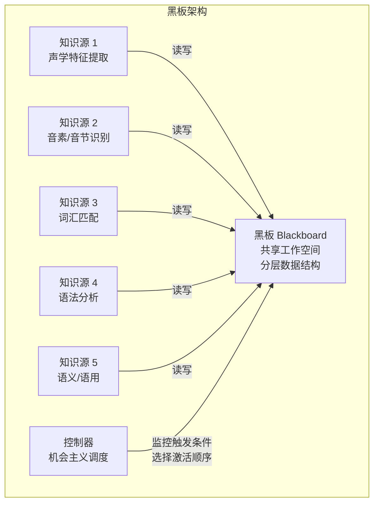
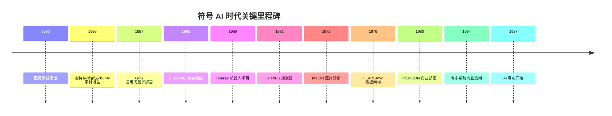

# 符号 AI 与早期智能体（1950s-1980s）

## 引言

人工智能（Artificial Intelligence）的诞生与"智能体"（Agent）的概念几乎同步出现。在这个时代，研究者们相信智能可以通过符号操作来实现——如果我们能用逻辑规则精确描述世界，机器就能像人一样推理和行动。这一信念催生了最早的智能体系统，也为今天的 LLM Agent 奠定了规划（Planning）和知识表示（Knowledge Representation）的理论基础。

理解符号 AI 时代的工作，不仅是为了回顾历史，更是因为这些早期系统所面对的核心问题——如何表示知识、如何规划行动、如何处理不确定性——在今天的 LLM Agent 开发中以新的形式重现。许多看似"全新"的 Agent 设计模式，实际上是对半个世纪前思想的重新诠释。

## 图灵测试与 AI 的诞生（1950）

1950 年，Alan Turing 在论文 *Computing Machinery and Intelligence* 中提出了著名的"模仿游戏"（Imitation Game），后被称为图灵测试（Turing Test）[Turing, 1950]。这篇论文的核心问题——"机器能思考吗？"——定义了此后半个世纪 AI 研究的方向。

图灵测试的设定本质上就是一个智能体交互场景：一个系统通过自然语言与人类对话，试图表现出不可区分于人类的智能行为。这与今天 LLM Agent 的对话交互形式惊人地一致，尽管实现路径完全不同。

值得注意的是，Turing 在同一篇论文中还讨论了机器学习的可能性。他提出了"儿童机器"（Child Machine）的概念——一个初始能力有限但可以通过教育和经验逐步提升的系统。这一思想预示了后来机器学习和强化学习的发展方向，也与今天通过微调和 RLHF 来改进 LLM 的做法遥相呼应。

## 达特茅斯会议（1956）

1956 年夏天，John McCarthy、Marvin Minsky、Nathaniel Rochester 和 Claude Shannon 在达特茅斯学院（Dartmouth College）组织了一场为期两个月的研讨会。这次会议正式确立了"人工智能"作为一个独立学科的地位 [McCarthy et al., 1956]。

会议提案中写道："学习的每一个方面或智能的任何其他特征，原则上都可以被精确描述，从而可以制造一台机器来模拟它。"这种乐观主义定义了符号 AI 时代的基调——智能是可以被工程化的。

达特茅斯会议的参与者后来成为 AI 领域的奠基人物：McCarthy 发明了 Lisp 语言和"人工智能"这个术语本身；Minsky 创建了 MIT AI 实验室；Newell 和 Simon（虽未出席但与会议密切相关）开发了 GPS 和物理符号系统假说。这些人的工作共同定义了符号 AI 的研究纲领。

## GPS：可以说是第一个智能体（1957）

### 手段-目的分析

Allen Newell 和 Herbert Simon 开发的通用问题求解器（General Problem Solver, GPS）是最早具有"智能体"特征的程序之一 [Newell and Simon, 1963]。GPS 的核心思想是手段-目的分析（Means-Ends Analysis）：

1. 识别当前状态与目标状态之间的差异（Difference）
2. 在算子表（Operator Table）中寻找能够减少这种差异的操作
3. 如果操作的前提条件不满足，递归地将满足前提条件设为子目标
4. 重复此过程直到目标达成或确认无解

### 物理符号系统假说

GPS 的理论基础是 Newell 和 Simon 提出的物理符号系统假说（Physical Symbol System Hypothesis）：一个物理符号系统具有充分且必要的手段来产生通用智能行为。换言之，智能的本质就是符号操作——感知世界产生符号，推理操作符号，行动将符号转化为物理效果。

这一假说在当时极具影响力，但后来受到了来自联结主义（Connectionism）和具身认知（Embodied Cognition）的严重挑战。今天的 LLM 在某种意义上同时体现了符号处理（操作语言符号）和亚符号处理（神经网络的分布式表示）的特征。

### GPS 的智能体特征

GPS 体现了智能体的核心特征：感知环境状态、设定目标、规划行动序列并执行。它的推理过程是透明的——每一步都有明确的理由（"为了减少差异 D，我选择算子 O"）。然而 GPS 只能处理形式化良好的问题（如汉诺塔、逻辑证明、简单的代数），无法应对现实世界的复杂性和不确定性。

## STRIPS 规划器（1971）

### Shakey 机器人

斯坦福研究所的 STRIPS（Stanford Research Institute Problem Solver）是自动规划（Automated Planning）领域的奠基之作 [Fikes and Nilsson, 1971]。它为机器人 Shakey 提供行动规划能力。Shakey 是世界上第一个能够推理自身行动的移动机器人——它可以在房间之间导航、推动物体、开关灯，所有这些行为都由 STRIPS 规划器自动生成。

### 动作形式化

STRIPS 引入了至今仍在使用的动作形式化框架。每个动作（Action）由三部分定义：

- **前提条件（Preconditions）**：执行动作前必须满足的世界状态条件
- **添加列表（Add List）**：动作执行后新增为真的命题
- **删除列表（Delete List）**：动作执行后不再为真的命题

以一个简单的机器人移动动作为例：

```
Action: Move(robot, from, to)
  Precondition: At(robot, from) AND Clear(to) AND Adjacent(from, to)
  Add: At(robot, to)
  Delete: At(robot, from)

Action: Push(robot, box, from, to)
  Precondition: At(robot, from) AND At(box, from) AND Clear(to)
  Add: At(robot, to), At(box, to)
  Delete: At(robot, from), At(box, from)
```

### 从 STRIPS 到 PDDL

STRIPS 的形式化方法直接影响了后来的 PDDL（Planning Domain Definition Language），后者成为自动规划领域的标准描述语言。PDDL 支持更丰富的表达能力，包括条件效果、量化前提、时间约束等。

### 与现代 Agent 的联系

STRIPS 的"前提-动作-效果"框架与今天 LLM Agent 中的工具调用（Tool Use）模式有着深刻的结构相似性。在 OpenAI 的 Function Calling 或 LangChain 的 Tool 定义中，每个工具都有：输入参数的类型约束（类似前提条件）、执行逻辑（动作本身）、返回值描述（类似效果）。LLM 在选择和调用工具时，本质上在进行一种非形式化的规划推理。

## 专家系统时代（1970s-1980s）

专家系统（Expert Systems）是符号 AI 最成功的商业应用，也是这个时代最接近"实用智能体"的系统。一个专家系统通常由知识库（Knowledge Base）、推理引擎（Inference Engine）和用户界面三部分组成。

### DENDRAL（1965-1983）

由 Edward Feigenbaum 和 Joshua Lederberg 在斯坦福开发，DENDRAL 是第一个成功的专家系统，用于根据质谱数据推断有机分子结构 [Buchanan and Feigenbaum, 1978]。DENDRAL 的成功证明了一个重要观点：AI 系统的能力主要来自其拥有的知识，而非通用的推理方法。这一"知识假说"（Knowledge Hypothesis）成为专家系统运动的理论基础。

### MYCIN（1972-1980）

MYCIN 是一个医疗诊断系统，用于识别引起严重感染的细菌并推荐抗生素治疗方案 [Shortliffe, 1976]。它引入了两个对后世影响深远的概念：

**确定性因子（Certainty Factors）**：MYCIN 认识到医学诊断中的不确定性无法用经典概率论简单处理，因此引入了确定性因子（-1 到 +1 的数值）来表示证据对假设的支持或反对程度。虽然这种方法后来被贝叶斯网络等更严格的框架取代，但它首次系统性地处理了 AI 系统中的不确定性推理问题。

**解释能力（Explanation）**：MYCIN 能够回答"为什么"（Why）和"怎么做"（How）的问题——解释为什么要询问某个信息，以及如何得出某个结论。这种透明性对于医疗领域至关重要，医生不会信任一个无法解释其推理过程的系统。MYCIN 的解释能力预示了今天对 AI 可解释性（Explainability）的追求。

在盲测中，MYCIN 的诊断准确率达到了 65%，超过了大多数非专科医生的水平。然而它从未被临床部署，部分原因是法律和伦理问题——谁为 AI 的误诊负责？

### R1/XCON（1980s）

Digital Equipment Corporation 的 R1（后更名为 XCON）用于配置 VAX 计算机系统，是第一个大规模商业部署的专家系统 [McDermott, 1982]。它包含约 2500 条规则，每年为公司节省约 4000 万美元。XCON 的成功引发了 1980 年代的"专家系统热潮"，大量企业投资开发自己的专家系统。

### 专家系统的兴衰与教训

专家系统的兴衰为今天的 Agent 开发提供了极其重要的教训：

**知识获取瓶颈（Knowledge Acquisition Bottleneck）**：将专家知识转化为规则极其耗时且困难。一个领域专家可能需要数月甚至数年才能将其知识完整地编码为规则。更糟糕的是，许多专家知识是隐性的（Tacit Knowledge），专家自己也难以明确表述。

**脆弱性（Brittleness）**：专家系统只能处理其规则库覆盖的情况。面对稍微超出预期的输入，系统要么给出错误答案，要么完全无法工作。它们缺乏"常识"来处理边界情况。

**维护困难**：随着规则数量增长，规则之间的交互变得难以预测和管理。修改一条规则可能导致意想不到的连锁反应。

**缺乏学习能力**：专家系统不能从使用经验中改进。每一次知识更新都需要人工干预。

这些教训在今天仍然高度相关。LLM 通过从海量文本中学习，绕过了知识获取瓶颈，但也引入了新的问题——幻觉（Hallucination）和知识时效性。而 RAG（Retrieval-Augmented Generation）等技术，本质上是在用新的方式解决"如何为 AI 系统提供准确、及时的知识"这个老问题。

## 黑板架构（Blackboard Architecture）

### HEARSAY-II 系统

黑板架构是 1970-80 年代发展起来的一种问题求解框架，最早应用于 HEARSAY-II 语音理解系统 [Erman et al., 1980]。语音理解是一个需要多层次知识协作的问题：声学特征、音素识别、词汇匹配、语法分析、语义理解——每个层次都有自己的专业知识，且需要相互配合。

### 架构设计



黑板架构的三个核心组件是：

**黑板（Blackboard）**：一个全局共享的数据结构，存储问题求解的中间结果。黑板通常按抽象层次分区，低层存储原始数据，高层存储抽象解释。

**知识源（Knowledge Sources）**：独立的专家模块，每个知识源监控黑板上的特定模式，当其触发条件满足时，读取相关数据、进行处理、将结果写回黑板。知识源之间不直接通信，只通过黑板间接交互。

**控制器（Controller）**：决定在任何时刻应该激活哪个知识源。控制策略可以是机会主义的（Opportunistic）——选择当前最有希望推进问题求解的知识源。

### 对现代架构的影响

黑板架构的设计思想在今天的多 Agent 系统中以新的形式出现。例如，LangGraph 中的共享状态（Shared State）机制、AutoGen 中的群聊（Group Chat）模式，都可以看作黑板架构的现代变体——多个专业化的 Agent 通过共享的上下文空间进行协作，由一个协调器决定下一步由谁行动。

## 时代脉络



## 对现代 Agent 的启示

符号 AI 时代的工作为今天的 LLM Agent 留下了深刻的理论遗产，这些遗产以新的形式在当代系统中重现。

**规划能力是智能体的核心**。从 GPS 到 STRIPS，这个时代确立了"目标-规划-执行"的基本范式。今天的 LLM Agent（如 ReAct、Plan-and-Execute 模式）本质上仍在这个框架内工作，只是用语言模型替代了手工编写的规则。STRIPS 的动作形式化直接对应于今天的工具定义（Tool Schema）。

**知识表示决定了系统的能力边界**。专家系统的失败告诉我们，手工编码知识是不可扩展的。LLM 通过从海量文本中学习，绕过了知识获取瓶颈，但也引入了新的问题——幻觉和知识时效性。RAG 技术本质上是在用检索替代手工编码来解决知识供给问题。

**可解释性从一开始就很重要**。MYCIN 的解释能力在 1970 年代就被认为是关键特性。今天的 LLM Agent 通过思维链（Chain-of-Thought）和中间推理步骤来提供类似的透明度。当 Agent 需要在高风险场景（医疗、金融、法律）中部署时，可解释性仍然是核心需求。

**模块化协作是处理复杂问题的有效方式**。黑板架构证明了多个专业化模块通过共享空间协作的可行性。今天的多 Agent 系统继承了这一思想，只是"知识源"变成了"LLM Agent"，"黑板"变成了"共享上下文"。

## 本章小结

符号 AI 时代（1950s-1980s）奠定了智能体研究的理论基础。图灵测试定义了智能的评判标准，达特茅斯会议确立了 AI 学科，GPS 确立了目标导向的问题求解范式，STRIPS 形式化了规划的基本框架，专家系统证明了领域知识的价值并暴露了手工知识工程的局限，黑板架构探索了多模块协作的可能性。

然而，这些系统共同的局限在于：它们依赖手工编码的知识，缺乏学习能力，无法处理开放世界的不确定性。当 AI 寒冬在 1980 年代末降临时，研究者们开始反思符号主义的根本假设。这些反思直接推动了下一个时代——[反应式架构与 BDI 模型](./reactive-and-bdi.md)的兴起，以及后来联结主义（神经网络）的复兴。

## 延伸阅读

- [Turing, 1950] Computing Machinery and Intelligence. *Mind*, 59(236), 433-460.
- [Newell and Simon, 1963] GPS: A Program that Simulates Human Thought. *Computers and Thought*, McGraw-Hill.
- [Fikes and Nilsson, 1971] STRIPS: A New Approach to the Application of Theorem Proving to Problem Solving. *Artificial Intelligence*, 2(3-4), 189-208.
- [Shortliffe, 1976] *Computer-Based Medical Consultations: MYCIN*. Elsevier.
- [Erman et al., 1980] The Hearsay-II Speech-Understanding System: Integrating Knowledge to Resolve Uncertainty. *ACM Computing Surveys*, 12(2).
- [Russell and Norvig, 2020] *Artificial Intelligence: A Modern Approach* (4th Edition). Chapters 2, 7, 11.
- [Nilsson, 2009] *The Quest for Artificial Intelligence: A History of Ideas and Achievements*. Cambridge University Press.
