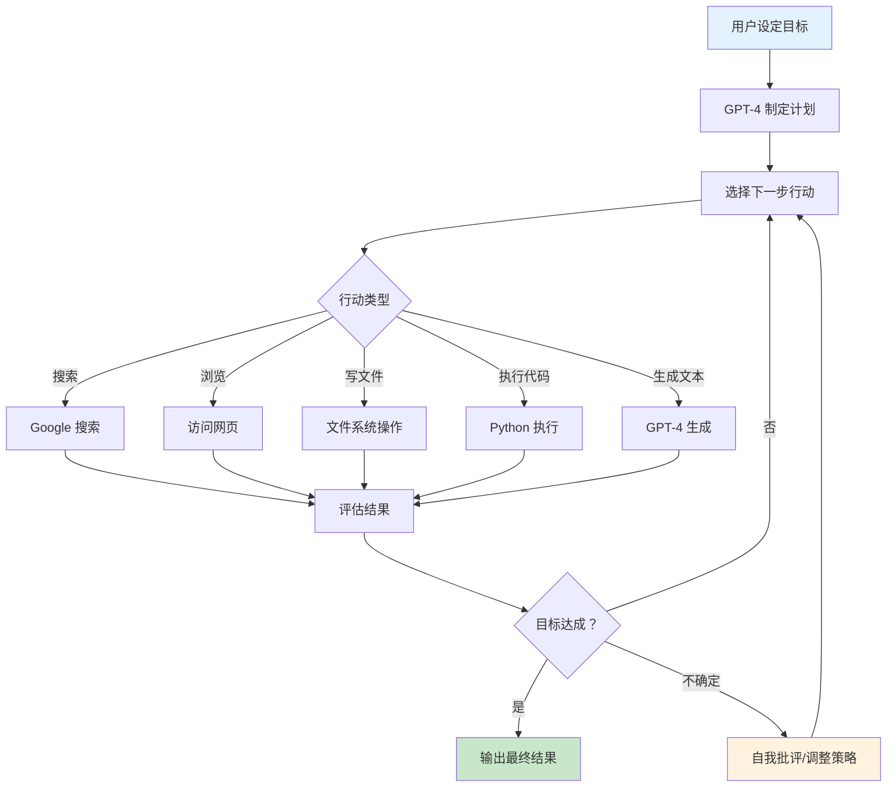

## AutoGPT 与 BabyAGI：自主 Agent 的狂热

2023 年 4 月，整个 AI 社区陷入了一种近乎狂热的兴奋中。GPT-4 发布仅一个月，两个开源项目——BabyAGI 和 AutoGPT——横空出世，向世界展示了一个诱人的愿景：**AI 可以自主设定目标、分解任务、执行操作，无需人类逐步指导**。AutoGPT 在不到一周内成为 GitHub 历史上增长最快的项目之一，峰值时每天新增数万 star。

这场狂热既是 Agent 生态爆发的催化剂，也是一堂关于"demo 与生产之间鸿沟"的深刻课程。

## BabyAGI：优雅的极简主义（2023 年 4 月 3 日）

2023 年 4 月 3 日，Yohei Nakajima 在 Twitter 上分享了 BabyAGI——一个仅有约 100 行 Python 代码的自主 Agent 系统。它的核心架构简洁到令人惊叹：

```python
# BabyAGI 核心循环（简化）
task_list = [initial_task]

while task_list:
    # 1. 取出优先级最高的任务
    current_task = task_list.pop(0)
    
    # 2. 执行任务（调用 LLM）
    result = execute_task(current_task, context)
    
    # 3. 将结果存入记忆
    store_result(result)
    
    # 4. 基于结果创建新任务
    new_tasks = create_new_tasks(objective, current_task, result)
    
    # 5. 重新排列优先级
    task_list = prioritize_tasks(task_list + new_tasks, objective)
```

BabyAGI 的设计直接受到了论文"Task-Driven Autonomous Agent" [Nakajima, 2023] 的启发。它使用三个 LLM 调用来完成每次循环：执行代理（execution agent）完成当前任务，任务创建代理（task creation agent）根据结果生成新任务，优先级排序代理（prioritization agent）对任务列表重新排序。

BabyAGI 的美在于它展示了自主 Agent 的本质结构：**目标 → 任务分解 → 执行 → 更新 → 循环**。它使用向量数据库（Pinecone/Chroma）存储执行结果作为记忆，让 Agent 能够利用之前的发现来指导后续行动。

## AutoGPT：万物皆可自动化（2023 年 4 月 7 日）

BabyAGI 发布仅四天后，Significant Gravitas（Toran Bruce Richards）发布了 AutoGPT。如果说 BabyAGI 是优雅的概念验证，AutoGPT 则是野心勃勃的"全能 Agent"——它配备了网络搜索、文件读写、代码执行、长期记忆等工具，宣称可以自主完成"任何"目标。

AutoGPT 的架构比 BabyAGI 更复杂：



AutoGPT 引入了几个有趣的设计：

**自我批评（Self-Criticism）**：每次行动后，Agent 会评估自己的行为是否有效，并提出改进建议。这是一种原始的反思机制。

**长期与短期记忆分离**：使用向量数据库作为长期记忆，对话历史作为短期记忆，解决上下文窗口有限的问题。

**持续运行模式**：Agent 可以无限循环运行，直到完成目标或被人类中断。

## 为什么它们捕获了集体想象力

AutoGPT 在发布后的两周内获得了超过 100,000 GitHub star（截至 2023 年 4 月底约 120,000 star），Twitter 上的讨论铺天盖地。这种狂热背后有几个原因：

**"AI 可以自己做事"的心理冲击**：之前的 AI 工具（包括 ChatGPT）都是"你问它答"的对话模式。AutoGPT 第一次展示了 AI 可以自主设定子目标、搜索信息、编写文件——看起来像是一个具有"主动性"的实体。

**视频演示的病毒式传播**：社交媒体上充斥着 AutoGPT 演示视频——Agent 自主研究市场、编写商业计划、开发网站。这些精心挑选的成功案例创造了"AI 无所不能"的错觉。

**开源与可访问性**：任何有 GPT-4 API key 的人都可以在几分钟内运行 AutoGPT。低门槛让大量人亲身体验了"自主 AI"的感觉。

**时代精神的共振**：GPT-4 刚刚发布，人们对 AI 的想象力处于历史高点。AutoGPT 恰好在这个窗口期出现，成为了所有 AI 兴奋情绪的具象载体。

## 残酷的现实检验

然而，当人们从演示转向实际使用时，自主 Agent 的局限很快暴露出来：

**无限循环问题**：Agent 经常在几步之后陷入循环——反复搜索相同的信息，或在两个方案之间来回切换，永远无法收敛。

**质量失控**：没有人类审核每一步输出，错误会层层累积。一个早期的错误判断可能导致整个后续执行方向偏离。这被称为"错误雪崩"（Error Cascading）效应。

**成本爆炸**：每一步都需要 GPT-4 API 调用，而一个看似简单的目标可能需要数十甚至数百次调用。有用户报告完成一个简单任务花费了 50+ 美元的 API 费用。

**缺乏停止标准**：Agent 很难判断何时"足够好"了。它可能无限追求完美，或过早宣称完成了一个实际未完成的任务。

**上下文遗忘**：虽然有长期记忆系统，但实际使用中 Agent 经常"忘记"之前的发现，或无法有效利用存储的信息。

一位早期测试者的总结精辟地概括了这些问题："AutoGPT 就像一个极其热情但毫无经验的实习生——它会不知疲倦地工作，但你需要全程盯着它，而这完全违背了'自主'的初衷。"

## Demo 与生产之间的鸿沟

AutoGPT 热潮揭示了 Agent 开发中一个核心张力：

| 维度 | Demo 场景 | 生产场景 |
|------|----------|----------|
| 容错率 | 偶尔成功即可 | 必须持续可靠 |
| 成本 | 不计代价 | 有严格预算 |
| 时间 | 可以等待 | 有时间约束 |
| 监督 | 有人盯着 | 需要无人值守 |
| 范围 | 精选简单任务 | 真实复杂场景 |
| 评判 | "看起来很酷" | "结果是否正确" |

这个鸿沟后来成为整个 Agent 领域 2023-2024 年的核心议题：如何让 Agent 从"偶尔惊艳"变为"持续可靠"？答案最终指向了更受控的架构设计——有限范围、人类监督、确定性工作流与 AI 灵活性的结合。

## 浪潮中的跟随者

AutoGPT 的成功激发了大量类似项目，形成了 2023 年 4-8 月间自主 Agent 项目的"寒武纪大爆发"：

**AgentGPT**（Reworkd，2023 年 4 月）：Web 界面版本的 AutoGPT，降低了使用门槛——用户无需配置本地环境，直接在浏览器中就能运行自主 Agent。这进一步扩大了接触自主 Agent 的人群。

**HuggingGPT** [Shen et al., 2023]：提出了一个引人入胜的架构——让 LLM 作为控制器，调度 Hugging Face 上的各种专业 AI 模型完成复杂任务。例如，面对"描述这张图片并生成语音"的请求，LLM 会依次调用图像描述模型、文本生成模型和语音合成模型。这展示了 LLM 作为"AI 操作系统"调度专业模型的可能性。

**GPT-Engineer**（2023 年 6 月）：专注于代码生成的自主 Agent，用户描述需求后自动生成完整代码库。它的特点是会先与用户进行需求确认的对话，然后一次性生成整个项目。

**MetaGPT** [Hong et al., 2023]（2023 年 8 月）：模拟软件公司的协作流程，多个 AI 角色（产品经理、架构师、程序员、测试工程师）按照标准操作流程（SOP）协作开发软件。这是多 Agent 协作方向的早期重要探索。

**CAMEL** [Li et al., 2023]：探索 AI-AI 对话中的自主行为，通过角色扮演让两个 Agent 在没有人类干预的情况下协作完成任务。这项研究揭示了 AI 之间对话的涌现特征和潜在风险。

**SuperAGI**（2023 年 5 月）：定位为 AutoGPT 的"生产级"替代品，提供了更好的 GUI、工具市场和运行管理功能。

这些项目各有侧重，但都共享同一个核心愿景：让 AI 自主完成复杂任务。它们共同构成了 2023 年上半年 AI 领域最热门的研究和工程方向。

## 历史遗产：证明市场需求，催生生态

尽管 AutoGPT 本身并未成为生产级工具，它的历史遗产是深远的：

**证明了 Agent 的市场需求**：数十万的 GitHub star 和无数的讨论文章证明，"AI 自主完成任务"有巨大的市场吸引力。这吸引了大量投资进入 Agent 赛道。

**定义了 Agent 的基本结构**：目标设定 → 任务分解 → 工具调用 → 结果评估 → 迭代改进。这个结构虽然在 AutoGPT 中执行得不够好，但成为了后续所有 Agent 框架的参考模板。

**暴露了核心挑战**：循环控制、错误恢复、成本管理、质量保证——这些在 AutoGPT 中暴露的问题成为了后续研究和工程的重点方向。

**普及了 Agent 概念**：在 AutoGPT 之前，"AI Agent"是一个学术术语。在 AutoGPT 之后，它成为了科技行业最热门的方向之一。

## 从狂热到理性

2023 年下半年，Agent 社区经历了从狂热到理性的转变。人们开始认识到：

完全自主的通用 Agent 在短期内不现实。更可行的路径是构建针对特定领域、有明确边界、可人类监督的 Agent 系统。这一认知转变催生了后续的"垂直 Agent"浪潮——编程 Agent（如 Devin）、数据分析 Agent、客服 Agent 等。

正如 Gartner 技术成熟度曲线所描述的：AutoGPT 代表了期望膨胀期的顶峰，2023 年下半年经历了幻灭低谷期，而 2024 年则进入了生产力爬升期。

## 本章小结

2023 年 4 月的自主 Agent 热潮是 Agent 发展史上浓墨重彩的一章。BabyAGI 用 100 行代码展示了自主 Agent 的本质结构，AutoGPT 将这一愿景推向公众视野并引爆了整个生态。虽然早期自主 Agent 在生产环境中表现不佳——无限循环、成本爆炸、质量失控——但它们完成了一个更重要的使命：证明了"AI Agent"的市场需求和技术方向，为后续的框架开发、学术研究和商业投资铺平了道路。

Agent 的未来不在于"完全自主"，而在于"恰到好处的自主性"——这个教训，正是 AutoGPT 用它的辉煌与失败教给我们的。

## 延伸阅读

- Richards, T.B. (2023). "Auto-GPT: An Autonomous GPT-4 Experiment." *GitHub Repository*.
- Nakajima, Y. (2023). "Task-Driven Autonomous Agent." *yoheinakajima.com, March 2023*.
- Shen, Y. et al. (2023). "HuggingGPT: Solving AI Tasks with ChatGPT and its Friends in Hugging Face." *NeurIPS 2023*.
- Hong, S. et al. (2023). "MetaGPT: Meta Programming for Multi-Agent Collaborative Framework." *arXiv:2308.00352*.
- Wang, L. et al. (2023). "A Survey on Large Language Model based Autonomous Agents." *arXiv:2308.11432*.
