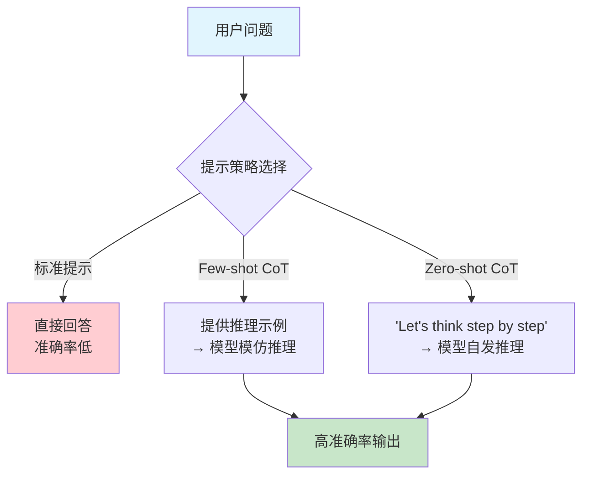
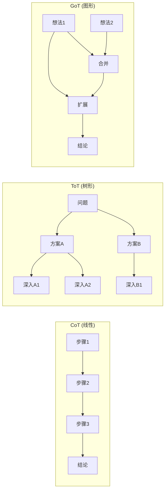
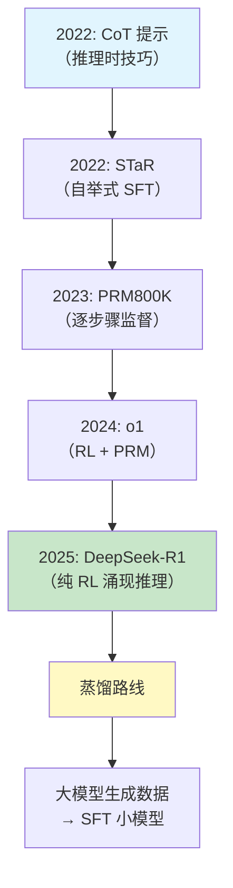
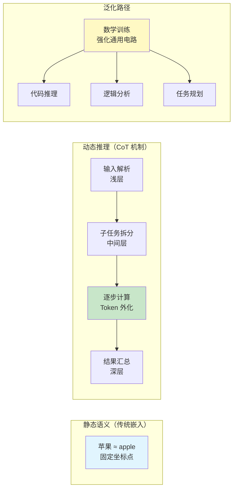

## 思维链的发现：让模型学会推理

在 Agent 的发展叙事中，如果说基座模型提供了"大脑"，那么思维链（Chain-of-Thought, CoT）就是教会这个大脑"如何思考"。2022 年，一系列关于推理的研究彻底改变了人们对大语言模型能力边界的认知：模型不仅能生成流畅文本，还能进行多步逻辑推理——只要你以正确的方式引导它。

这个发现对 Agent 的意义怎么强调都不为过。一个 Agent 要自主完成复杂任务，必须能够分析问题、分解步骤、评估选项、做出判断。CoT 证明了 LLM 具备这些能力，并为后来的 ReAct 范式和所有 Agent 推理模块奠定了理论基础。

## 一个改变一切的实验（2022 年 1 月）

2022 年 1 月，Google Brain 的 Jason Wei 等人提交了论文"Chain-of-Thought Prompting Elicits Reasoning in Large Language Models" [Wei et al., 2022]。这篇论文的核心发现简洁得令人惊讶：仅仅通过在少样本提示（Few-shot Prompt）中展示推理的中间步骤，就能大幅提升模型在复杂推理任务上的表现。

实验设计极其简洁：在少样本提示中，不仅展示问题和答案，还展示中间推理步骤。

标准提示：
```
Q: Roger有5个网球，他又买了2筒，每筒3个。他现在有多少网球？
A: 11
```

思维链提示：
```
Q: Roger有5个网球，他又买了2筒，每筒3个。他现在有多少网球？
A: Roger一开始有5个球。2筒各3个球就是6个球。5+6=11。答案是11。
```

结果令人震惊：在 GSM8K 数学推理基准上，标准提示的 PaLM-540B 准确率仅为 17.9%，而加入思维链后飙升至 58.1%。更重要的是，这种提升在小模型上几乎不存在——只有参数量超过约 1000 亿的模型才表现出 CoT 带来的显著增益。这暗示推理能力是一种**涌现能力**（Emergent Ability），只在模型规模跨过某个临界点后才会出现。

## "让我们一步一步思考"（2022 年 5 月）

如果说 Wei 等人的工作展示了"教"模型推理的方法，那么 Kojima 等人在 2022 年 5 月的发现则更加惊人：你甚至不需要提供推理示例，只需在提示末尾加上一句"Let's think step by step"（让我们一步一步思考），模型就会自发生成推理链 [Kojima et al., 2022]。

这就是零样本思维链（Zero-shot CoT）。一句看似平淡无奇的提示语，却能将模型在 MultiArith 数学基准上的准确率从 17.7% 提升到 78.7%。这个结果的冲击力在于：它暗示推理能力并非通过示例"注入"到模型中的，而是已经存在于模型内部——我们只是需要找到正确的"钥匙"来激活它。

这个发现对后来的 Agent 开发有直接的实践影响。几乎所有 Agent 的系统提示（System Prompt）中都包含某种形式的"请一步一步思考"指令。当你在 LangChain 或 AutoGen 的源码中看到"Think step by step before deciding on the next action"这样的提示时，其源头正是 Kojima 的这项工作。



## 自一致性：推理的可靠性保障（2022 年 3 月）

CoT 的一个问题是：单次推理可能出错。模型可能在某一步做出错误的推导，导致最终答案错误。Wang 等人提出了自一致性（Self-Consistency）方法 [Wang et al., 2022]：对同一问题生成多条推理路径（通过设置较高的 temperature），然后通过多数投票选择最终答案。

这个想法借鉴了人类的直觉——如果用多种方式思考同一个问题都得出相同结论，那这个结论更可能是正确的。在 GSM8K 上，自一致性将 CoT 的准确率从 58.1% 进一步提升到 74.4%。在更困难的 MATH 基准上，提升幅度更为显著。

对于 Agent 设计，自一致性提供了一个重要启示：**不要依赖单次推理结果**。当 Agent 面临关键决策时（例如选择执行哪个工具、决定任务是否完成），可以生成多个推理路径并交叉验证，以提高决策可靠性。这一思想后来演化为 Agent 中的反思（Reflection）和自我验证机制——例如 Reflexion [Shinn et al., 2023] 让 Agent 在失败后反思原因并调整策略。

## 思维树与思维图：推理的拓展

CoT 的成功激发了一系列后续工作，将线性推理拓展为更复杂的结构：

**思维树（Tree of Thoughts, ToT）**[Yao et al., 2023]：将推理组织为树形结构，每个节点是一个中间思考步骤，Agent 可以探索多个分支、回溯、剪枝。这直接映射了经典 AI 中的搜索问题。

**思维图（Graph of Thoughts, GoT）**[Besta et al., 2023]：进一步允许推理步骤之间形成任意图结构，支持思路的合并和聚合。

**推理链验证（Chain-of-Thought Verification）**：让模型在生成推理链后再检查每一步是否正确，实现自我纠错。



### 树形与图形推理的训练数据：结构如何体现在文本中？

上面的 mermaid 图展示了 ToT 和 GoT 的逻辑结构，但一个关键问题是：**树和图是拓扑结构，而训练数据是线性文本——这些结构在训练样本中到底长什么样？** 答案是：通过特定的文本标记（分支标记、回溯标记、合并标记）将拓扑信息编码在序列中。模型学会的不是"画一棵树"，而是"在文本中执行分支-评估-回溯-选择的行为模式"。

#### 思维树（ToT）训练数据：分支、评估、回溯

ToT 的核心操作是**探索多个方案 → 评估每个方案 → 选择最优 → 必要时回溯**。在训练数据中，这表现为显式的分支标签和评估打分：

```json
{
  "input": "24 点游戏：用 1, 5, 5, 5 四个数字，通过加减乘除得到 24。",
  "output": "<think>\n[分支1] 尝试思路：5 × 5 = 25，然后 25 - 1 = 24，但这只用了 3 个数字，还剩一个 5 没用。\n[评估] 分支1 失败：未使用全部数字。\n\n[分支2] 尝试思路：5 × (5 - 1) = 20，再加上剩余的 5 → 20 + 5 = 25 ≠ 24。\n[评估] 分支2 失败：结果不为 24。\n\n[分支3] 尝试思路：(5 - 1/5) × 5。先算 1/5 = 0.2，然后 5 - 0.2 = 4.8，最后 4.8 × 5 = 24 ✓\n[评估] 分支3 成功！使用了全部 4 个数字，结果为 24。\n\n[选择] 采纳分支3。\n</think>\n\n答案：(5 - 1/5) × 5 = 24"
}
```

更复杂的案例中会出现**深度回溯**——不只是平级分支的切换，而是回退到更早的决策点：

```json
{
  "input": "找到一条从 A 到 F 的最短路径。图的边：A-B(3), A-C(5), B-D(2), B-E(8), C-D(1), D-F(6), E-F(1)。",
  "output": "<think>\n[层级1-分支1] 从 A 出发，先走 A→B（代价 3）\n  [层级2-分支1] B→D（代价 3+2=5），然后 D→F（代价 5+6=11）\n  [层级2-分支2] B→E（代价 3+8=11），然后 E→F（代价 11+1=12）\n  [层级2-评估] B→D→F 总代价 11，B→E→F 总代价 12。层级2最优：B→D→F(11)\n\n[层级1-分支2] 从 A 出发，先走 A→C（代价 5）\n  [层级2-分支1] C→D（代价 5+1=6），然后 D→F（代价 6+6=12）\n  [层级2-评估] C→D→F 总代价 12。\n\n[回溯到层级1] 比较两条最优路径：A→B→D→F(11) vs A→C→D→F(12)\n[选择] A→B→D→F，总代价 11。\n</think>\n\n最短路径为 A→B→D→F，总距离 11。"
}
```

**训练数据中"树"的体现方式**：不是真的画一棵树的 ASCII art，而是通过**层级标签**（`[层级1-分支1]`）、**评估标签**（`[评估]`）和**回溯标签**（`[回溯到层级1]`）来编码搜索树的遍历过程。模型学到的行为模式是：遇到不确定性时展开多个候选方案、逐个评估、以及在死胡同时果断回退。

#### 思维图（GoT）训练数据：合并、聚合、交叉引用

GoT 与 ToT 的关键区别是：**多条独立推理链可以合并**。在 ToT 中，分支之间是独立的；在 GoT 中，不同分支的中间结果可以被组合成新的洞察。训练数据中通过显式的 `[合并]` 和 `[引用]` 标签来表达这种图结构：

```json
{
  "input": "评估公司 X 是否值得投资。已知信息：(1) 营收年增长 30%；(2) 净利润率 -5%；(3) 行业平均 PE 为 25；(4) 核心技术团队近期流失 40%。",
  "output": "<think>\n[节点A: 增长分析] 营收年增长 30% 表明强劲的市场需求和获客能力。高增长公司在早期阶段通常可以接受暂时亏损。\n\n[节点B: 盈利分析] 净利润率 -5% 意味着公司尚未盈利。需要评估亏损是战略性投入还是商业模式缺陷。\n\n[节点C: 估值分析] 行业平均 PE 为 25，但公司尚未盈利，传统 PE 不适用，需用 PS（市销率）或 DCF 估值。\n\n[节点D: 团队风险] 核心技术团队流失 40% 是严重的负面信号，可能影响产品迭代和技术壁垒。\n\n[合并 A+B] 将增长与盈利交叉分析：30% 增速但亏损，属于典型的 \"Growth-at-all-costs\" 模式。关键判断点：获客成本趋势是否改善？\n\n[合并 D+A] 将团队风险与增长交叉分析：技术团队流失可能导致增速不可持续——如果增长依赖产品技术优势，团队流失将侵蚀这一基础。\n\n[汇总: 引用 合并A+B, 合并D+A, 节点C] 综合判断：增长强劲但可持续性存疑（团队风险），亏损可接受但需验证边际改善，估值缺乏传统锚点。整体评级：短期观望，等待团队稳定信号和单位经济改善数据后再考虑入场。\n</think>\n\n投资建议：暂不建议投资。核心原因是团队稳定性风险可能动摇增长基础，建议在技术团队补充到位且连续两季度盈利改善后重新评估。"
}
```

**训练数据中"图"的体现方式**：通过 `[节点X]` 标签创建独立的分析单元，通过 `[合并 X+Y]` 标签显式地将两个节点的结论进行交叉组合产生新洞察，通过 `[汇总: 引用...]` 标签将多条分析链的结果聚合为最终判断。与 ToT 不同，GoT 的训练数据中同一个节点的结论会被**多次引用**——这正是"图"区别于"树"的地方：存在多入度节点。

#### 推理链验证（CoT Verification）训练数据：逐步自检与纠错

CoT Verification 的训练数据教模型一个关键行为：**生成推理链后回头检查每一步，发现错误时主动纠正**。这在训练格式中表现为两阶段结构——先做初始推理，再做逐步验证：

```json
{
  "input": "一辆汽车从 A 城出发以 60km/h 匀速行驶，同时一辆火车从 B 城出发以 120km/h 匀速行驶，A 与 B 相距 300km，两者相向而行。多久后相遇？",
  "output": "<think>\n[初始推理]\n步骤1: 两车相向而行，相对速度 = 60 + 120 = 180km/h\n步骤2: 相遇时间 = 总距离 / 相对速度 = 300 / 180 = 5/3 小时\n步骤3: 5/3 小时 = 1 小时 40 分钟\n\n[验证-步骤1] 相对速度计算：相向而行时相对速度为两速度之和 → 60+120=180 ✓\n[验证-步骤2] 时间计算：300÷180 = 5/3 ≈ 1.667 ✓\n[验证-步骤3] 单位转换：5/3 小时 = 1 小时 + 2/3 小时 = 1 小时 + 40 分钟 ✓\n[交叉验证] 相遇时汽车走了 60×(5/3)=100km，火车走了 120×(5/3)=200km，100+200=300km = AB距离 ✓\n[验证结论] 所有步骤正确，无需修正。\n</think>\n\n两车将在 1 小时 40 分钟后相遇。"
}
```

更重要的是"发现错误并纠正"的训练样本——这教会模型**自我纠错的能力**：

```json
{
  "input": "计算积分 ∫₀¹ x·eˣ dx",
  "output": "<think>\n[初始推理]\n步骤1: 使用分部积分法，令 u=x, dv=eˣdx\n步骤2: 则 du=dx, v=eˣ\n步骤3: ∫x·eˣdx = x·eˣ - ∫eˣdx = x·eˣ - eˣ + C\n步骤4: 代入上下限：[x·eˣ - eˣ]₀¹ = (1·e¹ - e¹) - (0·e⁰ - e⁰) = 0 - (-1) = 1\n\n[验证-步骤1] 分部积分选择：u=x（多项式，求导变简单），dv=eˣdx（指数函数，积分不变复杂） ✓ 选择合理\n[验证-步骤2] du=dx ✓，v=∫eˣdx=eˣ ✓\n[验证-步骤3] uv - ∫v·du = x·eˣ - ∫eˣ·dx = x·eˣ - eˣ + C ✓\n[验证-步骤4] 上限：1·e - e = 0 ✓；下限：0·1 - 1 = -1 ✓；结果：0-(-1) = 1 ✓\n[验证结论] 答案正确。\n</think>\n\n∫₀¹ x·eˣ dx = 1"
}
```

**训练数据中"验证"的体现方式**：通过两阶段结构 `[初始推理]` + `[验证-步骤N]` 让模型学会"做完后再检查"的元认知习惯。验证标签中用 ✓ 和 ✗ 标记每步的正确性，用 `[纠正]` 标签显式修改错误步骤。这种格式训练出的模型不会"一条路走到黑"，而是会自发地在关键步骤后停下来回检。

#### 三种结构的训练格式对比

| 结构类型 | 核心文本标记 | 编码的拓扑操作 | 模型学到的行为模式 |
|---------|------------|-------------|----------------|
| ToT（树形） | `[分支N]` `[评估]` `[回溯到...]` `[选择]` | 分叉、剪枝、回溯 | 遇到不确定性→展开候选→评估→回退→选最优 |
| GoT（图形） | `[节点X]` `[合并 X+Y]` `[引用...]` | 节点创建、边连接、多入度汇聚 | 独立分析→交叉组合产生新洞察→多源汇总 |
| CoT 验证 | `[初始推理]` `[验证-步骤N]` ✓/✗ `[纠正]` | 生成后反向遍历、错误检测 | 先做后查→逐步校验→发现错误主动纠正 |

需要注意的是，这些格式并非"标准答案"——不同研究团队和模型使用的标签名可能不同（比如 `[BRANCH]` vs `[分支]`，`[MERGE]` vs `[合并]`）。关键不是标签本身，而是**标签编码的行为语义**：分支意味着并行探索、回溯意味着放弃当前路径、合并意味着信息聚合。模型在大量此类数据上训练后，学到的是这些**结构化推理操作**，而不是特定的标签文本。

## 为什么 CoT 对 Agent 具有革命性意义

CoT 及其变体对 Agent 的影响远超"提高了数学题准确率"。它从根本上改变了 Agent 的设计理念：

**推理过程可见且可调试**：在 CoT 之前，模型的决策是黑箱的——你只能看到输入和输出。有了 CoT，Agent 的每一步思考都以文本形式展现，开发者可以追踪 Agent 为什么做出某个决策，在哪一步出了错。这种可解释性对于构建可信赖的 Agent 系统至关重要。想象一个 Agent 做出了错误的工具调用——如果没有 CoT，你只能看到"它调用了错误的工具"；有了 CoT，你可以看到"它误解了用户意图的哪个部分，导致选择了错误的工具"。

**推理过程可引导和修正**：既然推理是显式的文本，就可以通过系统提示（System Prompt）来引导推理方向，或在某一步出错时进行干预和修正。例如，你可以在系统提示中指定"在选择工具前，先列出所有可用工具并分析各自的适用场景"。这为 Agent 的"人在回路"（Human-in-the-Loop）模式提供了天然支持。

**复杂任务的分解成为可能**：一个复杂任务可以被分解为多个推理步骤，每个步骤对应一个子问题。这正是 Agent 进行任务规划（Task Planning）的基础。CoT 证明了 LLM 天然具备这种分解能力——你只需要引导它展示分解过程。

**推理质量可以持续改进**：通过分析推理链中的错误模式，可以系统性地改进 Agent 的推理能力——优化提示模板、增加领域知识、调整推理策略。这创造了一个可量化、可迭代的改进循环。

**Agent 间的推理共享**：在多 Agent 系统中，一个 Agent 的推理链可以作为另一个 Agent 的输入。例如，规划 Agent 的推理链可以传递给执行 Agent，让执行 Agent 理解为什么需要按照特定顺序执行任务。这种"推理的可传递性"是多 Agent 协作的基础之一。

## 从 CoT 到 Agent 推理：自然的演进

回顾 CoT 的发展脉络，我们可以清晰地看到它如何自然地演化为 Agent 的推理模块：

| CoT 概念 | Agent 中的对应 | 进化方向 |
|----------|---------------|----------|
| 思维链 | 推理模块 | 结构化推理框架 |
| 零样本 CoT | 系统提示中的推理指令 | 角色定义与推理引导 |
| 自一致性 | 多路径验证 | 反思与自我修正 |
| 思维树 | 规划搜索 | 任务分解与方案探索 |
| 推理步骤 | Thought 组件（ReAct） | 显式的思考-行动分离 |

这个演进是如此自然，以至于 ReAct 范式（将在下一节详述）几乎是 CoT 的必然延伸：既然模型能"思考"（CoT），那何不让它在思考后"行动"，在行动后"观察"，然后再"思考"——形成完整的推理-行动循环？

## 推理能力的持续进化

CoT 开创的推理研究方向在 2023-2024 年持续深化，形成了一条从提示技巧到模型内在能力的演化路线：

**过程奖励模型（Process Reward Model, PRM）**：2023 年 5 月，OpenAI 发表了"Let's Verify Step by Step" [Lightman et al., 2023]，提出不仅奖励最终答案的正确性，还对每一步推理的正确性进行评估和奖励。这解决了一个关键问题：传统的结果奖励模型（ORM）无法区分"过程正确但结论错误"和"过程错误但碰巧正确"的情况。对 Agent 而言，PRM 意味着我们可以在推理过程中实时检测错误，而不是等到最终结果出来才发现问题。

**推理与搜索的融合**：将推理过程建模为搜索问题，使用蒙特卡洛树搜索（MCTS）等方法来优化推理路径选择。这种方法在 AlphaGo 中取得了巨大成功，而将其应用于语言推理则代表了一种将经典 AI 智慧与现代 LLM 结合的趋势。

**推理专用模型**：2024 年 9 月，OpenAI 发布了 o1 模型，展示了通过强化学习直接训练模型进行深度推理的可能性——模型在回答前会"思考"数秒到数分钟，生成冗长的内部推理链。2025 年初的 DeepSeek-R1 则以开源方式复现了类似能力。这标志着 CoT 从"外部提示技巧"升华为"模型内在能力"——模型不再需要被告知"请一步一步思考"，它本身就会深入思考。

**对 Agent 的影响**：推理专用模型为 Agent 带来了新的架构可能性。一个使用 o1 或 R1 级别模型的 Agent，可以在每次决策前进行更深入的分析，减少"浅层推理导致的错误行动"问题。但同时也带来了延迟和成本的权衡——深度推理需要更多时间和计算。

这些进展表明，CoT 不是一个技术小窍门，而是通往更强 Agent 推理能力的一条主线。更多关于现代 Agent 推理模块的设计细节，可参见 [推理模块](../../02-technology/07-core-modules/reasoning.md)。

## CoT 与 Agent 开发的实践联系

为了更直观地理解 CoT 如何影响 Agent 开发，让我们看几个具体的实践映射：

在典型的 Agent 系统中，CoT 的影响体现在多个层面。在任务理解阶段，Agent 会先用 CoT 式的推理分析用户请求："用户说'帮我整理明天的会议议程'，这意味着我需要（1）查看明天的日历，（2）确定有哪些会议，（3）为每个会议准备议题"。在工具选择阶段，Agent 会推理："要获取日历信息，我应该使用 calendar_get 工具而不是 email_search 工具，因为用户要的是日程安排"。在结果验证阶段，Agent 会检查："我获取了 3 个会议，每个都有时间和参与者信息，这看起来完整了"。

这些"内心独白"式的推理过程直接源于 CoT 的启发。没有 CoT 的发现，Agent 的设计可能会走向完全不同的方向——可能更依赖硬编码的规则和流程图，而不是让模型自主推理决策。

## 本章小结

2022 年的思维链研究是 Agent 发展史上的关键转折点。Wei 等人的简单实验揭示了一个深刻的事实：大语言模型已经具备推理能力，我们需要做的只是正确地激活它。从 Few-shot CoT 到 Zero-shot CoT，从自一致性到思维树，这条研究路线将 LLM 从"文本生成器"转变为"推理引擎"。

对于 Agent 而言，CoT 的核心遗产是：推理过程应该是显式的、可追踪的、可改进的。这一原则贯穿了后续所有 Agent 框架的设计——从 ReAct 的 Thought 组件到现代 Agent 的规划模块，无不源于 CoT 开创的"让模型展示思考过程"这一简单而深刻的洞察。

可以毫不夸张地说：没有 CoT，就没有 ReAct；没有 ReAct，就没有现代 Agent。思维链是 Agent 能力大厦的第一块基石。

## 思维链的训练方法：从提示技巧到模型内在能力

前面所有的讨论都集中在"推理时"——通过精巧的 Prompt 激活模型已有的推理能力。但一个更根本的问题是：**推理能力能否通过训练直接植入模型？** 训练数据应该长什么样？推理过程应该以什么格式呈现？从 2022 年的 STaR 到 2025 年的 DeepSeek-R1，业界逐步找到了答案。

### 方法一：监督微调 (SFT) —— 直接教模型"怎么想"

最直接的训练方式是：构造包含推理过程的训练数据，让模型学习生成完整的思维链。

**数据格式：一个完整的推理 trace 作为训练目标**

CoT SFT 的训练数据本质上是一个 (输入, 输出) 对，其中输出不只是最终答案，而是包含完整推理步骤的长文本。典型格式如下：

```json
{
  "input": "一个书店有 4 箱书，每箱 12 本。卖出 15 本后还剩多少本？",
  "output": "<think>\n首先计算总书数：4 箱 × 12 本/箱 = 48 本。\n然后减去卖出的：48 - 15 = 33 本。\n验证：33 + 15 = 48 ✓\n</think>\n\n还剩 33 本。"
}
```

注意几个关键设计选择：

**推理过程是一段连续独白，而非多轮对话。** 训练时不是让模型在多轮问答中逐步给出推理步骤，而是在单次生成中一气呵成写出完整思维链。这意味着模型学到的是"先想完再说"的模式——内部推理完毕后才给出最终回答。

**推理标记的分隔方式。** 业界演化出了几种常见格式：

- 使用特殊标签包裹：`<think>...</think>` 或 `<reasoning>...</reasoning>`
- 使用自然语言标记：以"让我思考一下"开头，以"所以答案是"结尾
- 使用换行分隔：推理步骤用换行排列，最后一行是答案

DeepSeek-R1 选择了 `<think>...</think>` 标签，这也成为了后来推理模型的事实标准。这种设计让模型明确区分"思考"和"输出"——思考部分可以很长、可以试错、可以自我纠正，而最终输出需要简洁准确。

**训练数据的典型来源：**

- 人工标注：专业标注员为数学题写出解题过程（成本最高、质量最好）
- 大模型蒸馏：用 GPT-4 或 DeepSeek-R1 为大量题目生成推理过程，然后用来训练小模型
- 模型自我生成 + 过滤：让模型自己生成推理链，只保留最终答案正确的样本

**实际训练效果：** Google 的 FLAN 系列实验表明，在 SFT 数据中加入约 9 个 CoT 数据集（约 10 万条带推理步骤的样本），就能让 PaLM-540B 在未见过的推理任务上显著提升。更小规模的实验中，仅 1000 条高质量 CoT 数据就能让 7B 模型在 GSM8K 上提升 15-20 个百分点。

### 方法二：STaR —— 模型自学推理 (2022)

人工标注推理过程成本极高。2022 年，Zelikman 等人在"STaR: Bootstrapping Reasoning With Reasoning" [Zelikman et al., 2022, NeurIPS] 中提出了一种优雅的自举方法：让模型自己生成推理链，然后只用"答对了"的推理链来训练自己。

**STaR 的训练循环：**

```
第 1 轮：
  1. 给模型一道题 + 少量 CoT 示例 → 模型生成推理链 + 答案
  2. 检查答案是否正确
  3. 正确 → 把这条 (题目, 推理链+答案) 加入训练集
     错误 → 给模型看正确答案，让它"事后推理"(rationalization) 为什么是这个答案
  4. 用筛选后的数据微调模型
  
第 2 轮：用更强的模型重复上述过程...
第 N 轮：模型逐渐学会更复杂的推理...
```

STaR 的核心洞察是：模型不需要人类手把手教它每一步怎么想，它只需要知道"答案对不对"这个信号，就能通过自我迭代学会推理。这个思想后来直接影响了 DeepSeek-R1 的设计。

### 方法三：过程奖励模型 (PRM) —— 逐步骤打分训练

OpenAI 在 2023 年发表的"Let's Verify Step by Step" [Lightman et al., 2023] 提出了一种更精细的训练信号：不是只对最终答案打分，而是对**推理链中的每一步**进行正确性标注。

**PRM800K 数据集的标注格式：**

```
问题: 求 x² + 5x + 6 = 0 的解
步骤 1: 我需要对二次方程进行因式分解         [+1 正确]
步骤 2: 寻找两个乘积为 6、和为 5 的数       [+1 正确]  
步骤 3: 这两个数是 2 和 3                    [+1 正确]
步骤 4: 所以 (x+2)(x+3) = 0                 [+1 正确]
步骤 5: x = 2 或 x = 3                      [-1 错误！应为 x=-2 或 x=-3]
```

每一步被标为 +1（正确）、0（中性/无实质进展）或 -1（错误）。标注在第一个错误步骤处停止。OpenAI 发布了包含 80 万个步骤级标签的 PRM800K 数据集。

**训练流程：用 PRM 指导推理模型**

PRM 不是直接训练推理模型本身，而是训练一个"裁判模型"来为推理过程打分。然后用这个裁判来：

- 在推理时选择最佳路径（Best-of-N 采样：生成 N 条推理链，用 PRM 选最好的）
- 作为强化学习的奖励信号（PRM 给出中间步骤的奖励，比仅看最终答案更精准）

实验结果表明，过程监督（PRM）在数学推理任务上显著优于结果监督（ORM），在 MATH 数据集上正确率从 72.4%（ORM best-of-1860）提升到 78.2%（PRM best-of-1860）。

### 方法四：强化学习训练推理 —— o1 与 DeepSeek-R1 的路线

2024-2025 年最重大的突破是：不再依赖人工标注的推理链，而是通过强化学习让模型**自主发展**出推理能力。

**OpenAI o1 的技术路线（推测性分析，官方未完全公开）：**

o1 是在大规模 RL 框架中训练的。核心思路是：

1. 基座模型先用 CoT SFT 数据做初步微调（冷启动）
2. 用过程奖励模型（PRM）提供逐步骤的奖励信号
3. 通过 PPO 或类似 RL 算法优化策略：鼓励模型生成更长、更深入的推理链
4. 训练模型学会"花更多时间思考"（inference-time compute scaling）

**DeepSeek-R1 的公开训练流程（四阶段，完全可复现）：**

DeepSeek-R1 是第一个完整公开训练方法的推理模型，其四阶段流程极具教育价值：

```
阶段 1: 冷启动 SFT
  - 收集少量（数千条）高质量长推理链样本
  - 格式：<think>详细推理过程</think> + 简洁回答
  - 目的：教会模型推理链的基本格式和风格
  
阶段 2: 面向推理的强化学习
  - 使用 GRPO（Group Relative Policy Optimization）算法
  - 奖励信号：数学题看答案对不对，代码题看能不能通过测试
  - 关键发现：纯 RL 训练（不用人工推理链）也能让模型涌现出
    自我反思、验算、回溯等高级推理行为
    
阶段 3: 拒绝采样 + 监督微调
  - 用阶段 2 的模型生成大量推理数据
  - 过滤：只保留答案正确的样本
  - 同时混入非推理任务（写作、翻译等）数据，防止模型"只会推理"
  
阶段 4: 第二轮强化学习
  - 针对全场景（推理 + 通用任务）做最终 RL 对齐
  - 平衡推理深度与回答效率
```

**GRPO 的核心思想：** 传统 RL（PPO）需要一个单独的 Critic 模型估计价值函数。GRPO 简化了这一点：对同一个问题采样一组回答（如 16 条），用组内的相对排序作为奖励信号。答案正确的推理链获得正奖励，错误的获得负奖励。这避免了训练额外的 Critic 模型，大幅降低了训练成本。

**DeepSeek-R1-Zero 的惊人发现：** 在完全没有人工推理链数据的情况下，仅通过纯 RL 训练（只给"答案对不对"的奖励），模型自发涌现出了：
- 自我反思（"等等，让我重新检查一下"）
- 多方案尝试（"方法一行不通，试试方法二"）
- 验算（"带入原式验证：3² + 5×3 + 6 = 30 ≠ 0，有误"）
- 策略切换（"这个方程分解不了，改用求根公式"）

这证明推理能力可以通过恰当的奖励信号从模型中"激发"出来，而不需要显式教授。

### 方法五：知识蒸馏 —— 大模型教小模型推理

对于无法承受大规模 RL 训练成本的团队，蒸馏（Distillation）是更实际的选择：用强大的推理模型（如 DeepSeek-R1、GPT-4o）生成推理链数据，然后微调小模型。

**蒸馏的数据构造流程：**

```python
# 伪代码：从 DeepSeek-R1 蒸馏推理能力到 7B 模型
for problem in math_problems:
    # 1. 用教师模型生成多条推理链
    responses = teacher_model.generate(problem, n=16, temperature=0.7)
    
    # 2. 过滤：只保留答案正确的
    correct_responses = [r for r in responses if verify_answer(r, problem.answer)]
    
    # 3. 选择最优：取推理链最短且正确的（避免冗余）
    best = min(correct_responses, key=lambda r: len(r))
    
    # 4. 构造训练样本
    training_data.append({"input": problem.text, "output": best})

# 5. 微调学生模型
student_model.fine_tune(training_data, epochs=3)
```

**蒸馏效果实证：** DeepSeek 团队用 R1 作为教师模型生成 80 万条训练样本，微调 Qwen-1.5B 模型后，该 1.5B 小模型在 AIME 数学竞赛题上达到 28.9%，在 MATH 上达到 83.9%——超越了 GPT-4o 和 Claude-3.5-Sonnet。这证明推理能力可以高效地从大模型"压缩"到小模型中。

### 训练方法演进总览



| 方法 | 数据需求 | 训练成本 | 效果上限 | 适用场景 |
|------|---------|---------|---------|---------|
| CoT SFT | 人工标注推理链 | 低 | 中等 | 快速给模型加推理能力 |
| STaR | 少量种子 + 自生成 | 中 | 中高 | 标注预算有限时 |
| PRM + Best-of-N | 步骤级标注 | 中高 | 高 | 需要精确推理的数学/逻辑任务 |
| RL (GRPO/PPO) | 仅需验证器 | 高 | 最高 | 追求极限推理能力 |
| 蒸馏 | 教师模型生成 | 低 | 受限于教师 | 部署小模型、控制成本 |

### 思维链在向量空间中如何运作：从"静态语义"到"动态计算"

前面我们讨论了思维链的训练方法——数据长什么样、奖励信号怎么设计。但一个更根本的问题是：**推理过程在模型的高维向量空间中究竟是如何"发生"的？**

我们知道"苹果"和"apple"在嵌入空间中距离很近——这是静态的语义相似性，容易理解。但当模型处理"有 3 个箱子，每个箱子有 2 个红球，小明拿走 1 个，还剩几个？"时，涉及具体数字的加减、特定个体绑定动作——这些**动态的逻辑关系**如何在向量空间中产生？

2024-2025 年的机械可解释性（Mechanistic Interpretability）研究揭示了答案：思维链并不是让一整句话在空间中找到一个"逻辑坐标点"，而是通过三层嵌套的动态机制来实现推理。

#### 第一层：多维空间的叠加编码

当"有 3 个箱子，每个箱子有 2 个红球"进入模型时，它不是作为一个整体向量存在，而是在残差流（Residual Stream）的不同维度子空间中被分层编码：

- **实体维度**：负责表征"箱子"、"红球"等概念类别——类似"苹果≈apple"的静态语义
- **数量维度**：专门编码数值信息，"3"和"2"在这些维度上有特定坐标
- **绑定维度**：负责将实体和属性动态关联——"箱子←→3（数量）"、"红球←→2（每箱数量）"
- **角色维度**："小明"在此处不需要丰富语义，只作为一个临时"指针"绑定到"拿走"这个动作

关键发现来自 Anthropic 2025 年 3 月的 Circuit Tracing 研究：模型内部存在**跨领域共享的概念空间**（"Language of Thought"）。不同语言中的同一概念激活相同的内部 features；类似地，不同领域中的同一推理模式（如"先乘后减"）也复用相同的计算电路（Circuit）。这就是**推理能力跨领域泛化的物理基础**——被强化的不是"数学题怎么做"，而是一组通用的"分解-计算-汇总"电路。

#### 第二层：注意力头作为向量代数算子

具体到数字运算，Transformer 的注意力头（Attention Head）充当了"数据搬运工 + 计算器"的角色：

当模型在思维链中写下"总共有 3 × 2 = 6 个红球"时，向量空间中发生的操作是：

1. **提取**：专门的注意力头同时"注视"（attend to）"3"和"2"的 Token 位置，将它们的数量维度特征提取出来
2. **运算**：这些特征通过 MLP 层的权重矩阵进行非线性变换——在几何上表现为特定方向的投影和平移
3. **写回**：计算结果被写入下一个 Token 位置的残差流中，此时该位置的数量维度坐标恰好落在"6"的区域

Yang et al. (2025, EMNLP) 在 Internal Chain-of-Thought 论文中证实了这一点：**模型的不同网络层负责不同的推理子步骤**。浅层处理实体识别和数值提取，中间层执行关系绑定和运算，深层完成结果汇总和答案格式化。这是一种"逐层流水线"式的推理调度。

#### 第三层：CoT 的核心机制——用时间换空间

这是最关键的洞察，也解释了"为什么多写几步中间过程，模型反而更准了"。

**不使用 CoT 时**：模型必须在有限的网络深度（通常 32-80 层）内，一次前向传播完成所有计算。"3×2"、"减去 1"、"单位匹配"等所有推理子步骤必须被压缩在同一次信号传播中完成。这要求向量空间在有限维度内进行极度复杂的非线性扭曲——当问题稍微复杂一点，空间的几何容量就不够了，坐标会"飘"到错误答案。

**使用 CoT 时**：模型把计算压力从"空间维度"卸载到了"时间维度（Token 序列）"上：

```
第 1 步生成 "3 × 2 = 6"：
  → 向量空间只需处理一步乘法
  → "6" 作为 Token 被写入序列

第 2 步生成 "6 - 1 = 5"：
  → 注意力机制直接 attend 到上一步的 "6"
  → 向量空间只需处理一步减法
  → 每步的几何变换都足够简单，不会"飘"
```

一个物理比喻：

- **无 CoT** = 杂技演员同时抛接 5 个盘子（乘法、减法、绑定、验证全在空中），复杂时必然失手
- **有 CoT** = 人类在草稿纸上逐行计算，每次只处理一个简单算式，把中间结果"钉"在纸上供下一步使用

所以，思维链在向量空间中不是一个静止的点或区域，而是一条**随 Token 逐步展开的动态轨迹**——每生成一个 Token，向量坐标都在无数个微小特征维度上进行精准的跳跃。RL 训练（如 GRPO）的本质，就是把这条轨迹上所有多余的晃动（冗余步骤、错误直觉、无效回溯）剪除，让它变成一条尽可能笔直地指向正确答案的逻辑通路。

#### 泛化的机制：为什么数学训练能迁移到其他领域

理解了上述机制，"泛化"就不再神秘了：

- CoT 训练强化的不是"做数学题的知识"，而是一组**通用的计算电路**——"分解子问题 → 逐步求解 → 中间结果外化 → 汇总答案"
- 这些电路存在于模型的概念层（而非特定领域层），就像 Anthropic 发现的跨语言共享 features 一样
- 当模型遇到代码调试、逻辑推理、甚至复杂的规划任务时，同样的"分步执行 + 中间状态外化"电路会被激活
- Nathan Lambert (2025) 将此总结为：RL 训练推理模型时，奖励信号虽然是特定领域的（数学答案对不对），但模型习得的是**元认知模式**（回溯、自检、分支探索）——这些模式天然跨域



| 对比维度 | 静态语义表征 | 动态推理表征（CoT） |
|---------|------------|-------------------|
| 本质 | 概念在空间中的坐标 | 计算在时间轴上的轨迹 |
| 典型例子 | "苹果" ≈ "apple" | "3×2=6, 6-1=5" |
| 编码方式 | 嵌入层一次性产生 | 逐层 + 逐 Token 动态计算 |
| 网络参与 | 主要是嵌入层 | 注意力头 + MLP + 多层协作 |
| 可迁移性 | 语义相似的词天然靠近 | 推理模式跨领域复用电路 |
| 对应人类认知 | "知道一个概念" | "会做一类题" |

### 对 Agent 工程的实践启示

理解这些训练方法对 Agent 开发者有直接的指导意义：

**选择基座模型时**，优先选择经过 RL 推理训练的模型（如 o1、R1 系列）用于 Agent 的规划和决策环节。这些模型在面对复杂决策时会"自动"进行深度思考，而不需要开发者在 Prompt 中反复提示"请一步一步思考"。

**构建推理数据时**，采用"单次生成完整推理链"的格式（而非多轮对话式），因为这与模型的训练方式一致。Agent 的 System Prompt 应该鼓励模型先在 `<think>` 标签中完成全部推理，再给出最终行动决策。

**成本控制上**，对于简单任务用蒸馏后的小模型（速度快、成本低），只在复杂决策节点调用推理模型。这就是"模型路由"策略的理论基础：小模型处理常规动作，大推理模型处理关键规划。

## 延伸阅读

- Wei, J. et al. (2022). "Chain-of-Thought Prompting Elicits Reasoning in Large Language Models." *NeurIPS 2022*.
- Kojima, T. et al. (2022). "Large Language Models are Zero-Shot Reasoners." *NeurIPS 2022*.
- Wang, X. et al. (2022). "Self-Consistency Improves Chain of Thought Reasoning in Language Models." *ICLR 2023*.
- Zelikman, E. et al. (2022). "STaR: Bootstrapping Reasoning With Reasoning." *NeurIPS 2022*.
- Yao, S. et al. (2023). "Tree of Thoughts: Deliberate Problem Solving with Large Language Models." *NeurIPS 2023*.
- Besta, M. et al. (2023). "Graph of Thoughts: Solving Elaborate Problems with Large Language Models." *arXiv:2308.09687*.
- Lightman, H. et al. (2023). "Let's Verify Step by Step." *ICLR 2024*. [数据集: github.com/openai/prm800k]
- DeepSeek-AI. (2025). "DeepSeek-R1: Incentivizing Reasoning Capability in LLMs via Reinforcement Learning." *Nature*. [代码: github.com/deepseek-ai/DeepSeek-R1]
- Li, H. et al. (2023). "Symbolic Chain-of-Thought Distillation: Small Models Can Also Think Step-by-Step." *ACL 2023*. *arXiv:2306.14050*.
- Yang, Z. et al. (2025). "Internal Chain-of-Thought: Empirical Evidence for Layer-wise Subtask Scheduling in LLMs." *EMNLP 2025*. *arXiv:2505.14530*.
- Anthropic. (2025). "Tracing the Thoughts of a Large Language Model." *Anthropic Research Blog*. [Circuit Tracing 工具已开源]
- Lambert, N. (2025). "Why Reasoning Models Will Generalize." *Interconnects (Substack)*.
