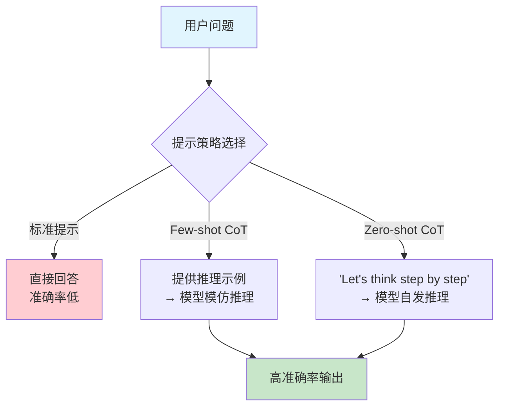
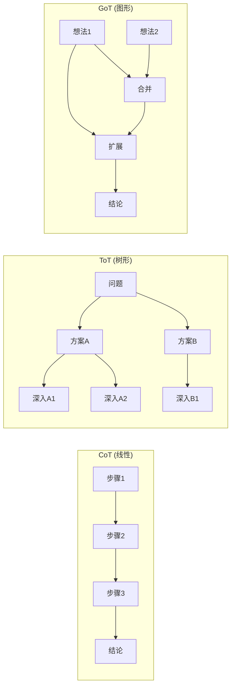

## 思维链的发现：让模型学会推理

在 Agent 的发展叙事中，如果说基座模型提供了"大脑"，那么思维链（Chain-of-Thought, CoT）就是教会这个大脑"如何思考"。2022 年，一系列关于推理的研究彻底改变了人们对大语言模型能力边界的认知：模型不仅能生成流畅文本，还能进行多步逻辑推理——只要你以正确的方式引导它。

这个发现对 Agent 的意义怎么强调都不为过。一个 Agent 要自主完成复杂任务，必须能够分析问题、分解步骤、评估选项、做出判断。CoT 证明了 LLM 具备这些能力，并为后来的 ReAct 范式和所有 Agent 推理模块奠定了理论基础。

## 一个改变一切的实验（2022 年 1 月）

2022 年 1 月，Google Brain 的 Jason Wei 等人提交了论文"Chain-of-Thought Prompting Elicits Reasoning in Large Language Models" [Wei et al., 2022]。这篇论文的核心发现简洁得令人惊讶：仅仅通过在少样本提示（Few-shot Prompt）中展示推理的中间步骤，就能大幅提升模型在复杂推理任务上的表现。

实验设计极其简洁：在少样本提示中，不仅展示问题和答案，还展示中间推理步骤。

标准提示：
```
Q: Roger有5个网球，他又买了2筒，每筒3个。他现在有多少网球？
A: 11
```

思维链提示：
```
Q: Roger有5个网球，他又买了2筒，每筒3个。他现在有多少网球？
A: Roger一开始有5个球。2筒各3个球就是6个球。5+6=11。答案是11。
```

结果令人震惊：在 GSM8K 数学推理基准上，标准提示的 PaLM-540B 准确率仅为 17.9%，而加入思维链后飙升至 58.1%。更重要的是，这种提升在小模型上几乎不存在——只有参数量超过约 1000 亿的模型才表现出 CoT 带来的显著增益。这暗示推理能力是一种**涌现能力**（Emergent Ability），只在模型规模跨过某个临界点后才会出现。

## "让我们一步一步思考"（2022 年 5 月）

如果说 Wei 等人的工作展示了"教"模型推理的方法，那么 Kojima 等人在 2022 年 5 月的发现则更加惊人：你甚至不需要提供推理示例，只需在提示末尾加上一句"Let's think step by step"（让我们一步一步思考），模型就会自发生成推理链 [Kojima et al., 2022]。

这就是零样本思维链（Zero-shot CoT）。一句看似平淡无奇的提示语，却能将模型在 MultiArith 数学基准上的准确率从 17.7% 提升到 78.7%。这个结果的冲击力在于：它暗示推理能力并非通过示例"注入"到模型中的，而是已经存在于模型内部——我们只是需要找到正确的"钥匙"来激活它。

这个发现对后来的 Agent 开发有直接的实践影响。几乎所有 Agent 的系统提示（System Prompt）中都包含某种形式的"请一步一步思考"指令。当你在 LangChain 或 AutoGen 的源码中看到"Think step by step before deciding on the next action"这样的提示时，其源头正是 Kojima 的这项工作。



## 自一致性：推理的可靠性保障（2022 年 3 月）

CoT 的一个问题是：单次推理可能出错。模型可能在某一步做出错误的推导，导致最终答案错误。Wang 等人提出了自一致性（Self-Consistency）方法 [Wang et al., 2022]：对同一问题生成多条推理路径（通过设置较高的 temperature），然后通过多数投票选择最终答案。

这个想法借鉴了人类的直觉——如果用多种方式思考同一个问题都得出相同结论，那这个结论更可能是正确的。在 GSM8K 上，自一致性将 CoT 的准确率从 58.1% 进一步提升到 74.4%。在更困难的 MATH 基准上，提升幅度更为显著。

对于 Agent 设计，自一致性提供了一个重要启示：**不要依赖单次推理结果**。当 Agent 面临关键决策时（例如选择执行哪个工具、决定任务是否完成），可以生成多个推理路径并交叉验证，以提高决策可靠性。这一思想后来演化为 Agent 中的反思（Reflection）和自我验证机制——例如 Reflexion [Shinn et al., 2023] 让 Agent 在失败后反思原因并调整策略。

## 思维树与思维图：推理的拓展

CoT 的成功激发了一系列后续工作，将线性推理拓展为更复杂的结构：

**思维树（Tree of Thoughts, ToT）**[Yao et al., 2023]：将推理组织为树形结构，每个节点是一个中间思考步骤，Agent 可以探索多个分支、回溯、剪枝。这直接映射了经典 AI 中的搜索问题。

**思维图（Graph of Thoughts, GoT）**[Besta et al., 2023]：进一步允许推理步骤之间形成任意图结构，支持思路的合并和聚合。

**推理链验证（Chain-of-Thought Verification）**：让模型在生成推理链后再检查每一步是否正确，实现自我纠错。



## 为什么 CoT 对 Agent 具有革命性意义

CoT 及其变体对 Agent 的影响远超"提高了数学题准确率"。它从根本上改变了 Agent 的设计理念：

**推理过程可见且可调试**：在 CoT 之前，模型的决策是黑箱的——你只能看到输入和输出。有了 CoT，Agent 的每一步思考都以文本形式展现，开发者可以追踪 Agent 为什么做出某个决策，在哪一步出了错。这种可解释性对于构建可信赖的 Agent 系统至关重要。想象一个 Agent 做出了错误的工具调用——如果没有 CoT，你只能看到"它调用了错误的工具"；有了 CoT，你可以看到"它误解了用户意图的哪个部分，导致选择了错误的工具"。

**推理过程可引导和修正**：既然推理是显式的文本，就可以通过系统提示（System Prompt）来引导推理方向，或在某一步出错时进行干预和修正。例如，你可以在系统提示中指定"在选择工具前，先列出所有可用工具并分析各自的适用场景"。这为 Agent 的"人在回路"（Human-in-the-Loop）模式提供了天然支持。

**复杂任务的分解成为可能**：一个复杂任务可以被分解为多个推理步骤，每个步骤对应一个子问题。这正是 Agent 进行任务规划（Task Planning）的基础。CoT 证明了 LLM 天然具备这种分解能力——你只需要引导它展示分解过程。

**推理质量可以持续改进**：通过分析推理链中的错误模式，可以系统性地改进 Agent 的推理能力——优化提示模板、增加领域知识、调整推理策略。这创造了一个可量化、可迭代的改进循环。

**Agent 间的推理共享**：在多 Agent 系统中，一个 Agent 的推理链可以作为另一个 Agent 的输入。例如，规划 Agent 的推理链可以传递给执行 Agent，让执行 Agent 理解为什么需要按照特定顺序执行任务。这种"推理的可传递性"是多 Agent 协作的基础之一。

## 从 CoT 到 Agent 推理：自然的演进

回顾 CoT 的发展脉络，我们可以清晰地看到它如何自然地演化为 Agent 的推理模块：

| CoT 概念 | Agent 中的对应 | 进化方向 |
|----------|---------------|----------|
| 思维链 | 推理模块 | 结构化推理框架 |
| 零样本 CoT | 系统提示中的推理指令 | 角色定义与推理引导 |
| 自一致性 | 多路径验证 | 反思与自我修正 |
| 思维树 | 规划搜索 | 任务分解与方案探索 |
| 推理步骤 | Thought 组件（ReAct） | 显式的思考-行动分离 |

这个演进是如此自然，以至于 ReAct 范式（将在下一节详述）几乎是 CoT 的必然延伸：既然模型能"思考"（CoT），那何不让它在思考后"行动"，在行动后"观察"，然后再"思考"——形成完整的推理-行动循环？

## 推理能力的持续进化

CoT 开创的推理研究方向在 2023-2024 年持续深化，形成了一条从提示技巧到模型内在能力的演化路线：

**过程奖励模型（Process Reward Model, PRM）**：2023 年 5 月，OpenAI 发表了"Let's Verify Step by Step" [Lightman et al., 2023]，提出不仅奖励最终答案的正确性，还对每一步推理的正确性进行评估和奖励。这解决了一个关键问题：传统的结果奖励模型（ORM）无法区分"过程正确但结论错误"和"过程错误但碰巧正确"的情况。对 Agent 而言，PRM 意味着我们可以在推理过程中实时检测错误，而不是等到最终结果出来才发现问题。

**推理与搜索的融合**：将推理过程建模为搜索问题，使用蒙特卡洛树搜索（MCTS）等方法来优化推理路径选择。这种方法在 AlphaGo 中取得了巨大成功，而将其应用于语言推理则代表了一种将经典 AI 智慧与现代 LLM 结合的趋势。

**推理专用模型**：2024 年 9 月，OpenAI 发布了 o1 模型，展示了通过强化学习直接训练模型进行深度推理的可能性——模型在回答前会"思考"数秒到数分钟，生成冗长的内部推理链。2025 年初的 DeepSeek-R1 则以开源方式复现了类似能力。这标志着 CoT 从"外部提示技巧"升华为"模型内在能力"——模型不再需要被告知"请一步一步思考"，它本身就会深入思考。

**对 Agent 的影响**：推理专用模型为 Agent 带来了新的架构可能性。一个使用 o1 或 R1 级别模型的 Agent，可以在每次决策前进行更深入的分析，减少"浅层推理导致的错误行动"问题。但同时也带来了延迟和成本的权衡——深度推理需要更多时间和计算。

这些进展表明，CoT 不是一个技术小窍门，而是通往更强 Agent 推理能力的一条主线。更多关于现代 Agent 推理模块的设计细节，可参见 [推理模块](../../02-technology/07-core-modules/reasoning.md)。

## CoT 与 Agent 开发的实践联系

为了更直观地理解 CoT 如何影响 Agent 开发，让我们看几个具体的实践映射：

在典型的 Agent 系统中，CoT 的影响体现在多个层面。在任务理解阶段，Agent 会先用 CoT 式的推理分析用户请求："用户说'帮我整理明天的会议议程'，这意味着我需要（1）查看明天的日历，（2）确定有哪些会议，（3）为每个会议准备议题"。在工具选择阶段，Agent 会推理："要获取日历信息，我应该使用 calendar_get 工具而不是 email_search 工具，因为用户要的是日程安排"。在结果验证阶段，Agent 会检查："我获取了 3 个会议，每个都有时间和参与者信息，这看起来完整了"。

这些"内心独白"式的推理过程直接源于 CoT 的启发。没有 CoT 的发现，Agent 的设计可能会走向完全不同的方向——可能更依赖硬编码的规则和流程图，而不是让模型自主推理决策。

## 本章小结

2022 年的思维链研究是 Agent 发展史上的关键转折点。Wei 等人的简单实验揭示了一个深刻的事实：大语言模型已经具备推理能力，我们需要做的只是正确地激活它。从 Few-shot CoT 到 Zero-shot CoT，从自一致性到思维树，这条研究路线将 LLM 从"文本生成器"转变为"推理引擎"。

对于 Agent 而言，CoT 的核心遗产是：推理过程应该是显式的、可追踪的、可改进的。这一原则贯穿了后续所有 Agent 框架的设计——从 ReAct 的 Thought 组件到现代 Agent 的规划模块，无不源于 CoT 开创的"让模型展示思考过程"这一简单而深刻的洞察。

可以毫不夸张地说：没有 CoT，就没有 ReAct；没有 ReAct，就没有现代 Agent。思维链是 Agent 能力大厦的第一块基石。

## 延伸阅读

- Wei, J. et al. (2022). "Chain-of-Thought Prompting Elicits Reasoning in Large Language Models." *NeurIPS 2022*.
- Kojima, T. et al. (2022). "Large Language Models are Zero-Shot Reasoners." *NeurIPS 2022*.
- Wang, X. et al. (2022). "Self-Consistency Improves Chain of Thought Reasoning in Language Models." *ICLR 2023*.
- Yao, S. et al. (2023). "Tree of Thoughts: Deliberate Problem Solving with Large Language Models." *NeurIPS 2023*.
- Besta, M. et al. (2023). "Graph of Thoughts: Solving Elaborate Problems with Large Language Models." *arXiv:2308.09687*.
- Lightman, H. et al. (2023). "Let's Verify Step by Step." *arXiv:2305.20050*.
