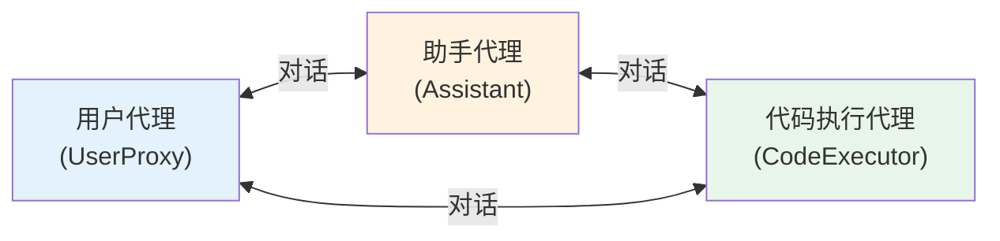
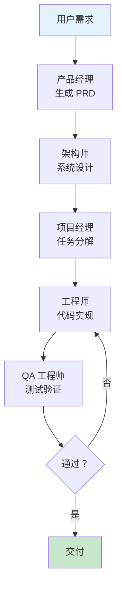

## 早期框架的涌现：LangChain、AutoGen 与 CrewAI

如果说基座模型是 Agent 的大脑，CoT 是思考方式，ReAct 是行动范式，工具使用是手脚——那么框架就是将这一切组装起来的"骨架"。2022 年底到 2024 年初，Agent 框架经历了爆发式增长，从 LangChain 的链式抽象到 AutoGen 的多 Agent 对话，再到 LangGraph 的状态图编排，每个框架都代表了一种关于"Agent 应该如何构建"的哲学主张。

这段框架演化的历史不仅是技术史，更是思想史——它记录了开发者社区对 Agent 本质的理解如何从简单的"LLM + 工具"逐步深化为复杂的"状态管理 + 流程编排 + 多 Agent 协作"。

## LangChain：Agent 框架的开拓者（2022 年 10 月）

2022 年 10 月，Harrison Chase 发布了 LangChain 的第一个版本。它的诞生几乎与 ChatGPT 同步，精准地踩中了时代需求：开发者需要一种方式来将 LLM 与外部数据和工具连接起来。

LangChain 的核心抽象在当时极具开创性：

**链（Chain）**：将多个 LLM 调用和操作串联为一个流水线。例如，"总结文档"链可能包含：加载文档 → 分块 → 逐块总结 → 合并总结。

**Agent**：实现了 ReAct 模式的 LLM，能够动态选择和调用工具。LangChain 的 `AgentExecutor` 是 ReAct 循环的第一个广泛使用的工程实现。

**工具（Tool）**：标准化的外部能力封装，包括搜索引擎、计算器、数据库查询等。

**记忆（Memory）**：对话历史的管理，从简单的缓冲记忆到基于摘要的压缩记忆。

```python
# LangChain 早期 Agent 的典型使用方式（简化）
from langchain.agents import initialize_agent, Tool
from langchain.llms import OpenAI

tools = [
    Tool(name="Search", func=search, description="搜索互联网"),
    Tool(name="Calculator", func=calculator, description="数学计算"),
]

agent = initialize_agent(tools, OpenAI(), agent="zero-shot-react-description")
agent.run("北京到上海的距离是多少公里？如果开车时速120km/h需要多少小时？")
```

LangChain 的成功来自几个因素：极低的入门门槛、丰富的集成（数据库、搜索引擎、各种 API）、活跃的社区和快速的迭代。到 2023 年底，LangChain 的 GitHub star 超过 70,000，成为 LLM 应用开发的事实标准。

然而，LangChain 也因过度抽象和频繁的 API 变动受到批评。早期版本试图用 `Chain` 抽象统一所有模式，导致简单的事情变得复杂、调试困难、"Magic"过多。这些问题最终推动了 LangGraph 的诞生。

## LlamaIndex：知识检索的专家（2022 年 11 月）

几乎与 LangChain 同期，Jerry Liu 发布了 GPT Index（后更名为 LlamaIndex）。与 LangChain 的通用性不同，LlamaIndex 专注于一个核心问题：**如何让 LLM 高效地利用外部知识**。

LlamaIndex 的核心贡献是 RAG（Retrieval-Augmented Generation）工程化：文档加载 → 索引构建 → 查询引擎。它提供了丰富的索引结构（向量索引、树索引、关键词索引等），让开发者可以根据数据特点选择最优的检索策略。

在 Agent 生态中，LlamaIndex 定位为"知识层"——Agent 的记忆和知识检索能力往往依赖 LlamaIndex 提供的 RAG 管道。后来 LlamaIndex 也推出了自己的 Agent 框架，但其核心竞争力始终在知识管理领域。

## AutoGen：多 Agent 对话的先驱（2023 年 9 月）

2023 年 9 月，微软研究院发布了 AutoGen [Wu et al., 2023]，提出了一个全新的视角：**Agent 之间的交互可以建模为对话**。



AutoGen 的设计哲学是：复杂任务可以通过多个专门化 Agent 之间的对话来完成。每个 Agent 有自己的角色（如助手、用户代理、代码执行器），它们通过消息传递来协作。这种设计有几个优势：

**模块化**：每个 Agent 专注于一个方面，易于开发和调试。

**灵活性**：通过改变对话模式（一对一、群聊、层级等），可以适应不同的任务结构。

**人类参与**：`UserProxyAgent` 可以在任何时候代入人类，实现人在回路模式。

AutoGen 的典型应用场景是复杂的代码生成和数据分析任务：用户提出需求 → 助手 Agent 编写代码 → 代码执行 Agent 运行代码 → 如果有错误则助手 Agent 修复 → 循环直到任务完成。

## CrewAI：角色驱动的多 Agent 编排（2023 年 12 月）

2023 年 12 月，Joao Moura 发布了 CrewAI，它借鉴了现实世界团队协作的隐喻：每个 Agent 是一个"船员"（Crew Member），有明确的角色（Role）、目标（Goal）、背景故事（Backstory）和工具。

```python
# CrewAI 的核心概念
researcher = Agent(
    role="高级研究分析师",
    goal="发现AI领域的最新突破性进展",
    backstory="你是一位经验丰富的AI研究员...",
    tools=[search_tool, paper_tool]
)

writer = Agent(
    role="技术内容作家",
    goal="将复杂研究转化为通俗易懂的文章",
    backstory="你是一位善于技术传播的作家...",
    tools=[write_tool]
)

crew = Crew(agents=[researcher, writer], tasks=[research_task, write_task])
crew.kickoff()
```

CrewAI 的哲学是：Agent 的行为很大程度上由其"角色定义"决定。通过精心设计角色的背景和目标，可以引导 Agent 产生高质量的专业化输出。这种方法特别适合内容创作、研究分析等需要多角色协作的场景。

## MetaGPT：软件工程的多 Agent 模拟（2023 年 8 月）

2023 年 8 月，MetaGPT [Hong et al., 2023] 将多 Agent 协作推向了一个具体而引人注目的应用：模拟软件开发团队。

MetaGPT 定义了产品经理、架构师、项目经理、工程师、QA 工程师等角色，它们遵循标准化的软件开发流程（标准操作程序，SOP）协作：



MetaGPT 的关键创新是引入了"标准化输出"（Standardized Output）——每个角色必须产出符合特定格式的文档（如 PRD、设计文档、代码等），下游角色基于这些标准化文档工作。这减少了 Agent 间通信的歧义，提高了协作效率。

## 框架战争：不同的哲学主张

到 2023 年底，Agent 框架领域形成了几种鲜明的设计哲学：

| 框架 | 核心抽象 | 哲学 | 优势场景 |
|------|----------|------|----------|
| LangChain | Chain/Agent | 链式组合 | 通用LLM应用 |
| AutoGen | Conversation | 多 Agent 对话 | 复杂推理/编程 |
| CrewAI | Role/Crew | 角色协作 | 内容创作/研究 |
| MetaGPT | SOP/Role | 流程驱动 | 软件开发模拟 |
| LlamaIndex | Index/Query | 知识检索 | RAG 应用 |

这些框架的分歧反映了一个根本问题：**Agent 的本质是什么？**是一条处理管道（Chain）？是一场对话（Conversation）？是一个角色（Role）？还是一个流程（Workflow）？答案是：取决于任务。这也是后来 LangGraph 尝试用更底层的"图"抽象来统一所有模式的原因。

## LangGraph：图编排的统一（2024 年 1 月）

2024 年 1 月，LangChain 团队发布了 LangGraph，这标志着 Agent 框架进入了新的阶段。LangGraph 的核心思想是：**Agent 的执行流程可以表示为一个状态图（State Graph）**。

```python
# LangGraph 核心概念（简化）
from langgraph.graph import StateGraph

graph = StateGraph(AgentState)
graph.add_node("reason", reasoning_node)     # 推理节点
graph.add_node("act", action_node)           # 行动节点
graph.add_node("reflect", reflection_node)   # 反思节点

graph.add_edge("reason", "act")              # 推理后行动
graph.add_conditional_edges("act", should_continue, {
    "continue": "reason",                    # 继续循环
    "reflect": "reflect",                    # 需要反思
    "end": END                               # 任务完成
})
```

LangGraph 解决了 LangChain 早期 `AgentExecutor` 的核心问题：

**可控性**：开发者可以精确定义 Agent 的状态转移逻辑，不再是不透明的 ReAct 循环。

**灵活性**：任何 Agent 模式（ReAct、Plan-and-Execute、多 Agent、人在回路）都可以用图来表达。

**持久化**：状态可以被检查点保存，支持长时间运行的任务和人类审批。

**可观测性**：图结构天然支持状态追踪和执行可视化。

LangGraph 的出现反映了 Agent 框架发展的一个趋势：从高层抽象向底层原语回归。早期框架试图提供"开箱即用"的 Agent（如 LangChain 的 `create_react_agent`），但实际生产中每个 Agent 都需要定制化的控制流。LangGraph 的图抽象提供了足够的灵活性来满足各种需求，同时保持了结构化和可维护性。

## 框架如何塑造了 Agent 认知

框架不仅是工具，它们还深刻地塑造了开发者对 Agent 的认知方式：

**LangChain 时期**（2022Q4-2023Q2）：Agent = LLM + Tools + Memory。人们把 Agent 理解为一个"增强版 ChatGPT"，通过挂载工具来扩展能力。

**AutoGen/CrewAI 时期**（2023Q3-2023Q4）：Agent = 多角色 + 对话 + 协作。人们开始思考"一群 Agent"如何协作完成复杂任务。

**LangGraph 时期**（2024Q1-）：Agent = 状态 + 流程 + 控制。人们认识到生产级 Agent 需要精确的流程控制和状态管理，不能完全依赖 LLM 的"自主性"。

这种认知演进——从信任 LLM 的自主性到重视确定性控制——是 Agent 领域从"研究"走向"生产"的重要标志。

## 框架演进的教训

回顾这段框架竞争的历史，几个教训值得铭记：

**抽象层级要恰当**：过高的抽象（如 LangChain 早期的 Chain）隐藏了太多细节，导致调试困难。过低的抽象（如直接调 API）则效率低下。LangGraph 的"图"抽象似乎找到了一个甜蜜点。

**生产需求驱动演进**：几乎所有框架的演化都是被生产需求推动的——可靠性、可观测性、人类监督、错误恢复。这些在 demo 中不重要的特性在生产中至关重要。

**一种框架难以统一所有场景**：不同的任务类型（对话、分析、编程、创作）可能需要不同的 Agent 架构。灵活的底层原语比固定的高层模式更有生命力。

关于各框架的详细技术分析和选型建议，可参见 [Agent 框架](../../02-technology/06-frameworks/) 章节。

## 本章小结

2022 年底到 2024 年初，Agent 框架经历了从探索到成熟的快速演化。LangChain 开创了 LLM 应用开发的范式，LlamaIndex 专注于知识检索，AutoGen 引入了多 Agent 对话，CrewAI 强调角色协作，MetaGPT 模拟了软件工程流程，LangGraph 则用图编排统一了各种模式。

这场"框架战争"的本质是对"Agent 应该如何构建"的不同回答。每种框架都代表了一种有价值的视角，而行业的共识正在向"灵活的底层原语 + 可组合的高层模式"收敛。框架不仅是开发工具，更是塑造人们对 Agent 认知的思想载体——它们定义了开发者"看到"Agent 的方式，进而影响了整个领域的发展方向。

## 延伸阅读

- Chase, H. (2022). "LangChain: Building applications with LLMs through composability." *GitHub Repository*.
- Wu, Q. et al. (2023). "AutoGen: Enabling Next-Gen LLM Applications via Multi-Agent Conversation." *arXiv:2308.08155*.
- Hong, S. et al. (2023). "MetaGPT: Meta Programming for Multi-Agent Collaborative Framework." *arXiv:2308.00352*.
- LangGraph Documentation. (2024). "Introduction to LangGraph." *langchain-ai.github.io/langgraph*.
- Liu, J. (2022). "LlamaIndex: A Data Framework for LLM Applications." *GitHub Repository*.
- Moura, J. (2023). "CrewAI: Framework for orchestrating role-playing AI agents." *GitHub Repository*.
