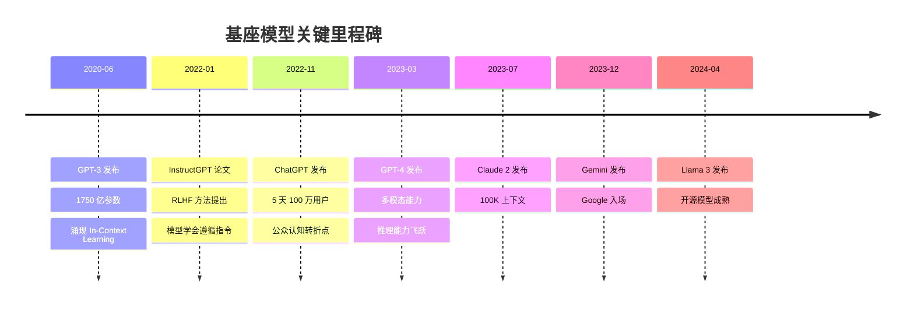

## 基座模型的突破：从 GPT-3 到 GPT-4

2020 年到 2023 年，大语言模型（Large Language Model, LLM）经历了一场前所未有的能力跃迁。这段历程不仅重新定义了自然语言处理的边界，更为 Agent 时代的到来铺设了根基。

如果说传统 AI Agent 受限于窄领域和规则系统，那么基座模型的突破则赋予了 Agent 真正的"通用智能"——理解指令、推理规划、调用工具的能力。

## GPT-3：涌现能力的初现（2020 年 6 月）

2020 年 6 月，OpenAI 发布了 GPT-3，一个拥有 1750 亿参数的语言模型 [Brown et al., 2020]。GPT-3 最令人震惊的不是它的规模，而是一种被称为"[上下文学习](../../appendix/glossary.md#in-context-learning)"（In-Context Learning, ICL）的[涌现能力](../../appendix/glossary.md#emergent-abilities)：无需微调，仅通过在提示中给出几个示例（[Few-shot Learning](../../appendix/glossary.md#few-zero-shot)），模型就能完成从未见过的任务。

这种能力颠覆了传统机器学习的范式。以往，每个新任务都需要收集数据、训练模型、部署上线。GPT-3 告诉世界：一个足够大的模型，通过纯文本交互就能适应各种任务。

这一发现的影响是深远的。

```text
传统范式：任务定义 → 数据收集 → 模型训练 → 部署
GPT-3 范式：任务定义 → 编写 Prompt → 直接使用
```

这意味着什么？在 Agent 的语境下，这意味着一个通用的"大脑"第一次成为可能。传统 Agent 系统（如对话机器人）需要为每个意图训练专门的分类器、为每个实体训练专门的抽取器。GPT-3 的上下文学习能力暗示了另一条路径：一个统一的模型，通过提示工程就能适应各种 Agent 任务——理解用户意图、选择合适工具、生成执行计划。

然而，GPT-3 时代的模型仍有明显局限：它是一个"文本补全机器"，不是一个"指令执行者"。你需要精心设计提示才能得到想要的输出，模型常常偏离意图，生成不相关的内容，甚至输出有害信息。模型擅长"续写"但不擅长"遵循指令"——这两者之间的差距，正是 RLHF 需要弥合的鸿沟。

## InstructGPT 与 RLHF：让模型听懂人话（2022 年 1 月）

2022 年 1 月，OpenAI 发表了 InstructGPT 论文 [Ouyang et al., 2022]，提出了基于人类反馈的强化学习（[RLHF](../../appendix/glossary.md#rlhf)）方法。

这项技术的核心思想是：通过人类标注者的偏好反馈来训练奖励模型，再用强化学习优化语言模型的输出。

RLHF 解决了一个关键问题——**对齐（Alignment）**。经过 RLHF 训练的模型不再只是预测下一个 token，而是学会了"遵循指令"。这个看似简单的转变，对 Agent 的发展具有决定性意义（参见[对齐](../../appendix/glossary.md#alignment)）：

- **指令遵循**（Instruction Following）：Agent 需要模型可靠地执行指定操作
- **输出格式控制**：Agent 需要模型按照特定格式（如 JSON）返回结果
- **安全约束**：Agent 需要模型拒绝执行危险操作

InstructGPT 虽然仅有 13 亿参数，但在人类偏好评估中击败了 1750 亿参数的 GPT-3。这证明了一个重要原则：能力（Capability）和对齐（Alignment）可以分别优化，且对齐显著提升了模型的实用性。

## ChatGPT：公众认知的转折点（2022 年 11 月）

2022 年 11 月 30 日，OpenAI 发布了 ChatGPT。虽然在技术上它只是 InstructGPT 的对话版本（基于 GPT-3.5），但它引发的社会冲击波远超技术本身：5 天内用户突破 100 万，2 个月内达到 1 亿用户，成为人类历史上增长最快的消费级应用。

ChatGPT 的真正意义不在于技术突破，而在于它让全世界第一次亲身体验到了"与 AI 对话解决问题"的可能性。突然间，每个人都有了一个可以帮忙写邮件、解释代码、头脑风暴的"助手"。这种认知转变释放了巨大的想象力和投资热情。

从 Agent 发展的角度看，ChatGPT 带来了三个关键效应。第一，它证明了"对话"可以成为人与 AI 的通用交互接口——这为后来的 Agent 都采用自然语言作为输入输出格式奠定了基础。第二，它吸引了海量开发者进入 LLM 应用领域——LangChain、AutoGPT 等项目正是这波开发者涌入的产物。第三，它释放了数十亿美元的风险投资进入 AI 赛道——为 Agent 创业公司和开源项目提供了充足的资金支持。

2023 年初的 AI 投资热潮几乎可以直接追溯到 ChatGPT 的发布。微软向 OpenAI 追加投资 100 亿美元，Google 紧急发布 Bard（后更名 Gemini），Anthropic、Mistral 等公司获得巨额融资。整个行业处于一种"FOMO（Fear of Missing Out）"状态，这为 2023 年 Agent 生态的爆发提供了资本和人才的双重支撑。



## GPT-4：Agent 的"iPhone 时刻"（2023 年 3 月）

2023 年 3 月 14 日，OpenAI 发布了 GPT-4 [OpenAI, 2023]。如果说之前的模型让人看到了 Agent 的可能性，GPT-4 则让 Agent 成为了现实。它带来了几个对 Agent 至关重要的能力突破：

**推理能力的质变**：GPT-4 在各类推理基准测试中大幅超越 GPT-3.5。它能够处理多步推理、理解复杂指令、进行规划和分解任务。对于 Agent 而言，这意味着模型终于能够胜任"大脑"的角色——接收目标、制定计划、逐步执行。

**多模态理解**：GPT-4 支持图像输入，能够"看见"世界。这为 Agent 与视觉环境的交互打开了大门，无论是浏览网页、分析图表还是操作 GUI。

**更长的上下文窗口**：从 4K 到 8K 再到 32K token，更长的上下文使 Agent 能够维持更复杂的任务状态、处理更多工具调用的结果、保持更长的对话历史。

**更可靠的格式输出**：GPT-4 能够更稳定地输出 JSON、代码和结构化文本，这对于 Agent 与外部工具的交互至关重要。

为什么将 GPT-4 称为 Agent 的"iPhone 时刻"？正如 iPhone 不是第一款智能手机，但它是第一款让智能手机真正好用的产品一样——GPT-4 不是第一个可以用于 Agent 的模型，但它是第一个让 Agent 真正可靠运行的模型。AutoGPT 之所以在 GPT-4 发布后的一个月内爆红，正是因为 GPT-4 的能力终于跨过了自主 Agent 的可用性门槛。

## 群雄并起：多元模型生态的形成

GPT-4 之后，基座模型的竞争进入白热化阶段：

**Anthropic Claude 系列**：Claude 1（2023 年 3 月）和 Claude 2（2023 年 7 月）以更长的上下文窗口（100K token）和更强的安全性著称。Claude 的"Constitutional AI"方法为 Agent 的安全运行提供了新思路——通过让模型自我评估和修正来确保输出的安全性。到 2024 年，Claude 3 系列在多项基准上与 GPT-4 持平甚至超越，Claude 3.5 Sonnet 更是在编程和推理任务上表现出色。

**Google Gemini**：2023 年 12 月发布的 Gemini 是 Google 押注 AI 未来的核心产品。原生多模态设计意味着 Gemini 从一开始就能处理文本、图像、音频和视频。超长上下文（后来扩展到 100 万 token）为 Agent 的信息处理能力带来了新的可能——一个 Agent 可以一次性阅读整本书或整个代码库。

**Meta Llama 系列**：Llama 1（2023 年 2 月）、Llama 2（2023 年 7 月）和 Llama 3（2024 年 4 月）的发布推动了开源模型生态的繁荣。开源模型让更多开发者能够构建自定义 Agent，不受 API 调用限制和成本约束。特别重要的是，开源模型可以在本地运行，适合对数据隐私有严格要求的 Agent 应用场景。

**中国模型生态**：智谱 GLM-4、百川、Qwen（通义千问）、DeepSeek 等模型的快速迭代，为中文环境下的 Agent 开发提供了本土化选择。这些模型在中文理解和生成方面往往表现更优，对于面向中国用户的 Agent 产品具有重要价值。

## 关键能力解锁：Agent 的六大基石

回望这段历史，基座模型为 Agent 解锁了六项关键能力：

| 能力 | 解锁时间 | 代表模型/技术 | 对 Agent 的意义 |
|------|----------|---------------|----------------|
| 上下文学习 | 2020 | GPT-3 | 无需训练即可适应新任务 |
| 指令遵循 | 2022 | InstructGPT | 可靠执行用户意图 |
| 对话交互 | 2022 | ChatGPT | 自然语言作为统一接口 |
| 复杂推理 | 2023 | GPT-4 | 多步规划与任务分解 |
| 工具调用 | 2023 | Function Calling | 与外部世界交互 |
| 长上下文 | 2023 | Claude 100K | 维持复杂任务状态 |

这些能力的叠加效应是超线性的：单独的指令遵循只是一个好用的助手，但指令遵循 + 复杂推理 + 工具调用 = 一个能够自主完成任务的 Agent。

值得注意的是这些能力的解锁顺序。上下文学习是第一个出现的——它让模型具备了"通用性"。但仅有通用性还不够，模型需要能"听懂指令"（RLHF）才能被可靠地使用。当模型既通用又听话之后，下一步是让它能"思考"（复杂推理）和"行动"（工具调用）。最后，长上下文解决了一个实际工程问题：Agent 执行复杂任务需要维持大量中间状态。

这个解锁顺序不是偶然的——它反映了从"能力"到"可控性"再到"实用性"的递进需求。每一层能力都以前一层为前提。

## 规模定律与能力涌现

理解基座模型的突破还需要理解两个关键概念：

**[规模定律](../../appendix/glossary.md#scaling-laws)（Scaling Laws）**：Kaplan 等人在 2020 年发现，模型性能与参数量、数据量和计算量之间存在幂律关系 [Kaplan et al., 2020]。这意味着只要持续增加规模，模型性能就会持续提升——这为"更大的模型 = 更好的 Agent"提供了理论支撑。

**[能力涌现](../../appendix/glossary.md#emergent-abilities)（Emergent Abilities）**：Wei 等人在 2022 年的研究表明，某些能力只有在模型规模超过特定阈值后才会突然出现 [Wei et al., 2022a]。[上下文学习](../../appendix/glossary.md#in-context-learning)、思维链推理、指令遵循等能力都属于涌现能力。这解释了为什么 GPT-2 时代还看不到 Agent 的可能性，而 GPT-3/4 时代突然一切都变了——能力不是线性积累的，而是在临界点突然爆发的。

对于 Agent 的发展者而言，涌现能力带来了希望也带来了不确定性：我们无法精确预测下一代模型会涌现出什么新能力，但可以合理期待"只要规模继续增长，会有更多能力解锁"。

## 从"能力具备"到"Agent 爆发"

基座模型的突破为 Agent 提供了必要条件，但并非充分条件。从 GPT-4 到真正可用的 Agent，还需要：

- 推理框架（如 ReAct 范式）来组织模型的思考与行动
- 工具生态（如 Function Calling）来连接外部能力
- 记忆系统来维持长期任务状态
- 编排框架（如 LangChain）来简化开发流程

这些正是本章后续各节将要展开讨论的内容。

## 本章小结

从 GPT-3 到 GPT-4，基座模型在三年间完成了从"文本补全工具"到"通用任务引擎"的蜕变。RLHF 让模型学会了遵循指令，ChatGPT 点燃了公众想象力，GPT-4 跨过了 Agent 可用性的门槛。多元模型生态的形成则确保了这个方向的竞争活力和持续创新。

这段历史告诉我们：Agent 的爆发不是偶然事件，而是基座模型能力积累达到临界点后的必然结果。当模型同时具备了指令遵循、复杂推理和工具调用能力时，构建自主 Agent 从理论愿景变成了工程实践。

## 延伸阅读

- Brown, T. et al. (2020). "Language Models are Few-Shot Learners." *NeurIPS 2020*.
- Ouyang, L. et al. (2022). "Training language models to follow instructions with human feedback." *NeurIPS 2022*.
- OpenAI. (2023). "GPT-4 Technical Report." *arXiv:2303.08774*.
- Bubeck, S. et al. (2023). "Sparks of Artificial General Intelligence: Early experiments with GPT-4." *arXiv:2303.12712*.
- Touvron, H. et al. (2023). "LLaMA: Open and Efficient Foundation Language Models." *arXiv:2302.13971*.
- Kaplan, J. et al. (2020). "Scaling Laws for Neural Language Models." *arXiv:2001.08361*.
- Wei, J. et al. (2022). "Emergent Abilities of Large Language Models." *TMLR 2022*.
