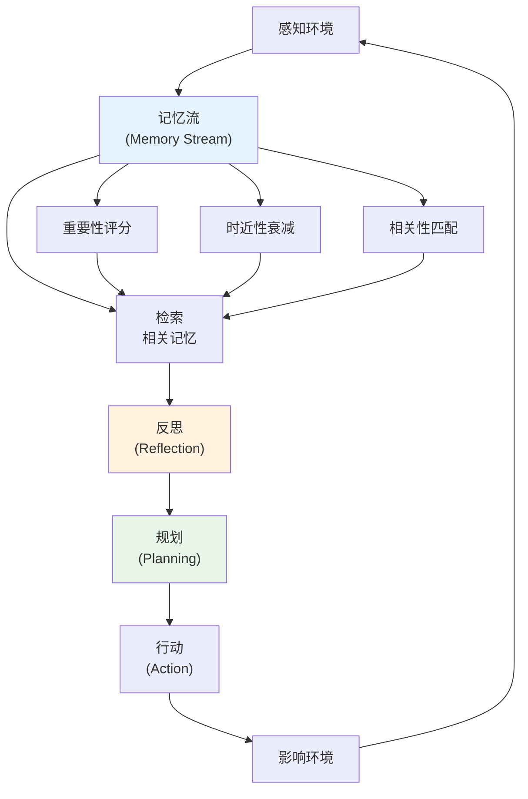

## 生成式智能体：AI 小镇实验

2023 年 4 月 7 日，斯坦福大学和 Google Research 联合发表了一篇令人着迷的论文："Generative Agents: Interactive Simulacra of Human Behavior" [Park et al., 2023]。研究者构建了一个类似《模拟人生》的虚拟小镇，让 25 个由 LLM 驱动的 NPC 在其中"生活"——它们起床、做早餐、去工作、社交聊天、计划派对，甚至传播八卦。

这篇论文的震撼不在于技术的复杂性，而在于涌现行为的丰富性：没有人显式编程让 Agent 组织情人节派对，但当一个 Agent 想到这个主意并开始邀请朋友时，信息通过社交网络自发传播，最终真的有一群 Agent 聚集在一起"庆祝"。

对于 Agent 的发展，这篇论文的贡献在于：它设计了一套精巧的记忆架构，证明了 LLM Agent 可以具备长期一致的行为和社交能力——这远超当时大多数人对 AI 能力的想象。

## 小镇 Smallville：实验设计

Smallville 是一个简单的 2D 沙盒世界，视觉风格类似经典的 RPG 游戏。小镇中包含住宅区、Hobbs 咖啡馆、Harvey Oak 供应店、Johnson 公园、Willow Market、学校和图书馆等场所。25 个 Agent 各有自己的身份背景：Isabella Rodriguez 经营 Hobbs 咖啡馆、Sam Moore 是药剂师、Tom Moreno 开杂货店、Klaus Mueller 是研究员……每个 Agent 都有用一段自然语言描述的"人设"（约一段话），定义了他们的性格、职业、关系网络和近期目标。

实验持续运行了两天（游戏内时间，实际运行数小时），研究者观察 Agent 的行为是否展现出"类人"的特征。结果令人惊叹：

- Isabella 主动计划了情人节派对，逐个邀请朋友，确认时间地点，并在当天装饰了咖啡馆
- Agent 之间形成了新的友谊和关系变化——两个此前不认识的 Agent 因为在咖啡馆偶遇而成为朋友
- 信息通过社交网络自发传播——Sam 告诉 Tom 他准备参选市长，这个消息在一天之内通过口口相传扩散到了小镇大部分居民
- Agent 会协调时间来同时出现在某个地点，展现出集体行为的涌现
- Klaus Mueller 会在截止日期临近时更频繁地出现在图书馆，展现出目标驱动的行为调整

## 核心架构：记忆流、反思与规划

论文提出的架构包含三个核心模块，它们共同赋予 Agent 类人的行为连贯性：



### 记忆流（Memory Stream）

每个 Agent 维护一个按时间排列的记忆列表。每条记忆都是一个自然语言描述的观察或事件：

```
[2023-02-12 07:00] Isabella Rodriguez 醒来，在卧室里伸了个懒腰
[2023-02-12 07:15] Isabella Rodriguez 在浴室洗漱
[2023-02-12 08:00] Isabella Rodriguez 走进咖啡馆开始准备
[2023-02-12 08:30] Isabella Rodriguez 看到 Maria Lopez 走进咖啡馆
[2023-02-12 08:32] Isabella Rodriguez 和 Maria 聊了情人节派对的事
```

记忆不仅仅是简单的日志。每条记忆有三个关键属性用于检索排序：

**重要性评分（Importance Score）**：由 LLM 在记忆创建时打分（1-10）。"Isabella 计划了情人节派对"比"Isabella 看了一眼窗外"更重要。这确保了关键事件在检索时优先出现。

**时近性（Recency）**：最近的记忆权重更高，通过指数衰减实现。这模拟了人类对近期事件记忆更清晰的特点。

**相关性（Relevance）**：通过嵌入向量的余弦相似度计算当前情境与历史记忆的相关程度。当 Agent 在咖啡馆时，与咖啡馆相关的记忆权重更高。

最终的检索分数是三者的加权组合：`score = α × recency + β × importance + γ × relevance`

### 反思（Reflection）

反思是这篇论文最精彩的创新之一。当 Agent 积累了足够多的新记忆（重要性分数之和超过阈值）时，它会停下来"反思"——用 LLM 从最近的经历中提炼出更高层次的抽象洞察。

例如，经过多次与 Klaus Mueller 的互动后，Isabella 可能生成反思："Klaus Mueller 对研究非常投入，经常忘记休息。我应该在他来咖啡馆时提醒他放松一下。"

反思具有递归性——反思本身也被存入记忆流，可以作为更高层反思的输入。这形成了一个从具体观察到抽象认知的知识层次。

### 规划（Planning）

每天早晨，Agent 会制定当天的计划——一个粗粒度的时间表。计划会根据新信息动态调整：如果 Agent 被邀请参加派对，它会重新安排原定计划来腾出时间。

规划的层次结构：日计划 → 小时级子计划 → 具体行动。这种自顶向下的分解与 Agent 系统中的任务规划思路一致。

## 涌现的社交行为

论文中最令人印象深刻的不是架构本身，而是由这个架构涌现出的复杂社交行为：

**信息扩散**：Sam 告诉 Tom 他要竞选市长。在接下来的一天里，这个消息通过各种社交互动在小镇中传播，最终大多数 Agent 都知道了这件事——尽管没有人编程实现"消息广播"。

**协作组织**：Isabella 决定举办情人节派对。她需要邀请人、准备装饰、确定时间。这些都是通过一对一的对话和自主规划完成的，展现了去中心化的协作能力。

**关系演化**：Agent 之间的关系不是静态的。随着互动增多，有些 Agent 变得更亲密，有些则疏远。一个 Agent 可能因为另一个 Agent 多次帮助而发展出"感激"的态度。

**生活节律**：Agent 展现出类人的日常节律——起床、工作、午餐、社交、睡觉。这种规律性来自规划模块，但具体时间和活动会根据情境灵活调整。

## 评估：图灵测试式验证

研究者设计了一个巧妙的评估方法：让人类评估者判断某段行为描述来自"AI Agent"还是"人类玩家"。结果显示，完整架构（记忆+反思+规划）生成的行为最接近人类，移除任何一个模块都会降低"类人性"。

消融实验的结果：

| 架构变体 | 类人评分 |
|----------|----------|
| 完整架构 | 最高 |
| 去除反思 | 行为缺乏一致性和深度 |
| 去除规划 | 行为随机、缺乏目的性 |
| 去除重要性评分 | 关键事件被遗忘，行为不连贯 |

## 对 Agent 记忆系统设计的深远影响

Generative Agents 论文最持久的遗产是它为 Agent 记忆系统提供了一个参考架构。此后的 Agent 记忆设计或多或少都能看到它的影子：

**分层记忆**：短期工作记忆（当前上下文）+ 长期记忆（持久存储）+ 反思/总结（高层抽象）的三层结构，在后来的 MemGPT [Packer et al., 2023] 等工作中被进一步发展。MemGPT 将这个思路推向极致，让 LLM 像操作系统管理内存一样管理自己的上下文——在"主存"（当前上下文）和"外存"（向量数据库）之间主动进行数据交换。

**主动遗忘与优先检索**：不是所有记忆都平等对待。通过重要性评分和时间衰减实现"主动遗忘"，确保有限的上下文窗口被最相关的信息填充。这比简单的"截断最早的对话"要精细得多——一个三天前的重要决策可能比一小时前的闲聊更值得保留。

**记忆作为行为塑造器**：记忆不仅是"知识库"，更是塑造 Agent 个性和行为模式的关键。一个有"失败记忆"的 Agent 会表现得更谨慎，一个记得"用户偏好简洁回答"的 Agent 会自动调整输出风格。这个洞察后来在个性化 Agent 和角色 AI 中得到了广泛应用。

**反思作为元认知**：定期的反思机制让 Agent 能够从具体经验中抽象出一般性的认知。这在实际的 Agent 系统中表现为"经验总结"——Agent 完成一系列任务后，总结出"什么策略有效、什么策略无效"，用于指导未来的决策。

关于现代 Agent 记忆模块的详细设计，可参见 [记忆模块](../../02-technology/07-core-modules/memory.md)。

## 对更广泛领域的影响

Generative Agents 的影响远超 Agent 开发社区：

**角色扮演 AI**：Character.AI、Replika 等产品背后的技术思路与 Generative Agents 高度相关——赋予 AI 角色持久的记忆和一致的人格。

**游戏 AI**：传统游戏 NPC 依赖状态机和脚本。Generative Agents 展示了用 LLM 驱动的 NPC 可以产生多么丰富和不可预测的行为，这激发了游戏行业对"AI NPC"的大量探索。

**社会模拟**：经济学家、社会学家和政策研究者开始探索用 LLM Agent 进行社会模拟——研究信息传播、集体决策、社会规范的形成等课题。

**多 Agent 系统**：论文展示了多个 Agent 在共享环境中协作和竞争的可能性，直接影响了后来的多 Agent 框架（如 AutoGen、CrewAI）的设计。

## 局限与未来方向

论文也坦承了一些局限，这些局限也指明了后续的研究方向：

**计算成本**：运行 25 个 Agent 两天（游戏时间），产生了数千次 LLM 调用（主要使用 GPT-3.5-turbo）。每次 Agent 需要做出决策、进行对话或反思时都需要一次 API 调用。大规模模拟（数百甚至数千 Agent）的成本仍是显著瓶颈，这推动了后续关于"高效 Agent 模拟"的研究。

**行为深度有限**：尽管涌现行为令人印象深刻，Agent 的"思考深度"仍不及人类。它们不会真正"焦虑"或"兴奋"，只是产生了看起来像这些情绪的文本输出。Agent 的决策往往基于表面模式匹配而非深层因果推理。

**长期一致性**：随着时间推移，Agent 的行为可能出现微妙的不一致——性格漂移（Character Drift）问题在角色扮演 AI 中至今仍是挑战。一个"内向"的 Agent 可能在积累了足够多的社交记忆后表现得越来越外向，因为记忆检索可能偏向近期的社交互动。

**评估困难**：如何客观评估 Agent 行为的"类人程度"仍是开放问题。论文使用了人类评估者的主观判断，但这种方法难以规模化，且不同评估者之间的一致性有限。

## 本章小结

Generative Agents 论文以一个迷人的实验展示了 LLM Agent 的潜力边界：具备记忆、反思和社交能力的 Agent 可以产生令人信服的类人行为。它提出的记忆流-反思-规划架构成为了 Agent 记忆系统设计的经典参考，其多 Agent 社交模拟的范式影响了从游戏到社会科学的多个领域。

这篇论文也传达了一个重要信息：Agent 的行为复杂性不仅来自模型能力，更来自架构设计。通过精心设计的记忆检索、反思机制和规划层次，即使基于相同的底层 LLM，也能涌现出远超预期的丰富行为。

## 延伸阅读

- Park, J.S. et al. (2023). "Generative Agents: Interactive Simulacra of Human Behavior." *UIST 2023*.
- Packer, C. et al. (2023). "MemGPT: Towards LLMs as Operating Systems." *arXiv:2310.08560*.
- Li, G. et al. (2023). "CAMEL: Communicative Agents for 'Mind' Exploration of Large Language Model Society." *NeurIPS 2023*.
- Gao, C. et al. (2023). "S3: Social-network Simulation System with Large Language Model-Empowered Agents." *arXiv:2307.14984*.
- Lin, J. et al. (2023). "AgentSims: An Open-Source Sandbox for Large Language Model Evaluation." *arXiv:2308.04026*.
