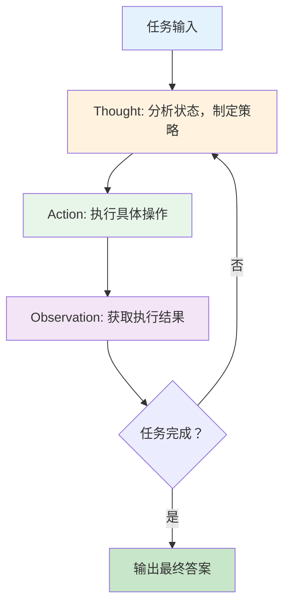
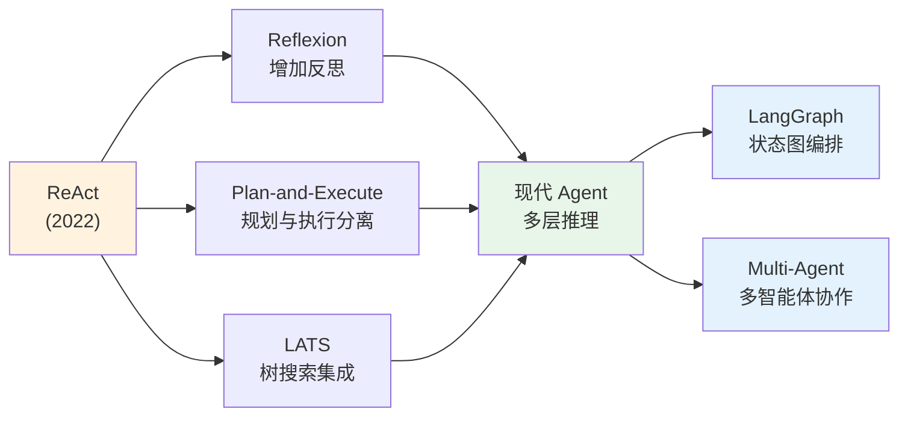

## ReAct 范式：推理与行动的统一

如果说思维链让模型学会了"思考"，那么 ReAct 则教会了模型"思考后行动，行动后观察，观察后再思考"。2022 年 10 月，Shunyu Yao 等人发表的 ReAct 论文 [Yao et al., 2023] 为 LLM Agent 提供了第一个原则性框架。这不是又一个提示技巧，而是一种全新的范式——它定义了 Agent 如何将内部推理与外部交互交织在一起，成为此后几乎所有 Agent 系统的设计蓝图。

## 一个优雅的统一

在 ReAct 之前，研究者面临一个两难选择：

**纯推理方案（Reasoning Only）**：让模型通过 CoT 一路思考到底，不与外部世界交互。问题在于模型的知识可能过时、不准确，且对于需要实际操作的任务（如搜索、计算、文件操作）无能为力。

**纯行动方案（Action Only）**：让模型直接输出动作序列，如 WebGPT [Nakano et al., 2021] 让模型直接执行搜索和浏览操作。问题在于缺乏中间推理，模型容易迷失方向，无法进行策略调整。

ReAct 的洞察是：**推理和行动不应该是二选一，而应该交替进行**。人类解决问题时也是如此——我们思考下一步该做什么（推理），然后去做（行动），看到结果（观察），再决定下一步（推理）。



## ReAct 的核心机制

论文定义了三个核心组件，它们在每一轮循环中交替出现：

**Thought（思考）**：Agent 用自然语言表达当前的推理过程——分析已知信息、识别缺失信息、制定下一步策略。这直接继承了 CoT 的精神，但不再是一次性的长链推理，而是**每一步行动前的局部推理**。

**Action（行动）**：Agent 选择并执行一个具体操作。在论文的实验中，操作包括搜索（Search）、查找（Lookup）等；在后续的 Agent 框架中，这扩展到了任意工具调用。

**Observation（观察）**：环境对 Agent 行动的反馈。这是模型从外部世界获取新信息的通道。

一个典型的 ReAct 交互看起来像这样：

```
Question: 除了苹果遥控器，还有什么设备可以控制苹果遥控器最初设计来交互的程序？

Thought 1: 我需要搜索苹果遥控器，找到它最初设计来交互的程序。
Action 1: Search[Apple Remote]
Observation 1: The Apple Remote is a remote control device... 
              designed to control the Front Row media program...

Thought 2: 苹果遥控器最初设计来控制 Front Row 程序。
           我现在需要搜索还有什么其他设备可以控制 Front Row。
Action 2: Search[Front Row software]
Observation 2: Front Row is a discontinued media center software...
              It could also be controlled by keyboard function keys...

Thought 3: 根据搜索结果，除了苹果遥控器，键盘功能键也可以控制 Front Row。
Action 3: Finish[keyboard function keys]
```

## 为什么 ReAct 是分水岭

ReAct 论文发表的时间（2022 年 10 月，预印本）恰好在 ChatGPT 发布之前。它的学术贡献远超出实验结果本身：

**第一个原则性的 Agent 框架**：ReAct 不是一个工程项目或演示 demo，而是一个有严格实验验证的学术框架。它在 HotpotQA（多跳问答）、FEVER（事实验证）和 ALFWorld、WebShop（交互环境）等多个基准上证明了推理-行动交替的优越性。

**统一了两个研究方向**：在 ReAct 之前，"推理"和"行动"是两个相对独立的研究方向。ReAct 证明了它们的互补性——推理帮助 Agent 制定行动计划，行动获取的新信息又支撑更好的推理。

**定义了 Agent 的基本循环**：Thought-Action-Observation 循环成为了后续所有 Agent 框架的基本构建模块。无论是 LangChain 的 AgentExecutor、AutoGPT 的主循环，还是后来的 LangGraph 状态机，底层都是这个循环的变体。

## 与早期方法的比较

ReAct 论文中的消融实验清晰地展示了推理-行动统一的价值：

| 方法 | HotpotQA (EM) | FEVER (Acc) | 特点 |
|------|---------------|-------------|------|
| Standard (CoT) | 29.4 | 56.3 | 纯推理，无外部交互 |
| Act-only | 25.7 | 58.9 | 纯行动，无推理 |
| **ReAct** | **27.4** | **60.9** | 推理+行动交替 |
| ReAct + CoT-SC | **35.1** | **64.6** | 最佳组合 |

纯推理方案的问题在于"幻觉"（Hallucination）：模型会编造不存在的事实来完成推理链。ReAct 通过引入外部观察来"接地"（Ground）推理过程，显著减少了幻觉。

纯行动方案的问题在于"盲目执行"：模型不断搜索、点击，却没有在中间停下来思考"我找到了什么？还缺什么？应该换个策略吗？"这导致大量无效操作。

## ReAct 在早期框架中的实现

ReAct 论文发表后迅速被 LangChain 等框架采用，成为 Agent 实现的标准模式：

```python
# LangChain 中 ReAct Agent 的简化表示
REACT_PROMPT = """Answer the question using the following format:

Thought: [your reasoning about what to do next]
Action: [tool name]
Action Input: [input to the tool]
Observation: [tool output - filled by system]
... (repeat Thought/Action/Observation)
Thought: I now know the final answer
Final Answer: [your answer]
"""
```

LangChain 的 `AgentExecutor`（2022 年底至 2023 年初）本质上就是 ReAct 循环的工程实现：解析模型输出中的 Action，调用对应工具，将 Observation 拼接回提示，让模型继续推理。

## 实践中发现的局限

随着 ReAct 在实际项目中的广泛应用，开发者们也发现了一些重要的局限性。这些发现不是对 ReAct 的否定，而是推动了后续架构改进的动力：

**循环困局（Loop Stuck）**：Agent 有时会陷入重复相同 Thought-Action 的死循环，无法跳出来寻找新策略。尤其当工具返回的 Observation 不包含有用信息时，Agent 可能反复尝试同一类操作——例如用略微不同的关键词反复搜索，永远找不到想要的信息。实践中，开发者通常需要设置最大循环次数作为安全阀。

**观察信息过载（Observation Overload）**：当工具返回大量文本时（如搜索结果返回数千字、文档读取返回整个文件内容），模型可能被细节淹没，忽略关键信息，或者因上下文窗口塞满而丢失早期的推理历史。这促使开发者设计了"Observation 摘要"机制——在将工具结果传回模型前先进行压缩。

**推理深度不足**：原始 ReAct 中的 Thought 通常较短（一两句话）且偏表面。对于需要深度分析的任务——如比较多个方案的利弊、综合多个信息源的矛盾内容——单句 Thought 难以承载复杂的推理逻辑。后来的框架通过引入"深度思考"节点来解决这个问题。

**缺乏全局规划**：ReAct 是逐步反应式的（Reactive），Agent 在每一步只考虑"下一步做什么"，而不会预先制定完整的计划。对于需要长期规划的复杂任务（如"写一篇研究报告"需要先确定大纲、再逐节调研和写作），这种"走一步看一步"的方式效率不高，且容易偏离最终目标。

**缺乏失败恢复机制**：当某条执行路径失败时（如搜索无结果、工具报错），原始 ReAct 没有系统性的回退和重试策略。Agent 可能尝试修复，也可能彻底迷失。

这些局限催生了后续的改进工作：Reflexion [Shinn et al., 2023] 增加了失败后的自我反思机制，让 Agent 从错误中学习；Plan-and-Execute 架构将规划和执行分离，先制定完整计划再逐步执行；LATS [Zhou et al., 2023] 将 ReAct 与树搜索结合，允许回溯和探索多条路径。

## ReAct 的深远影响

尽管有局限，ReAct 的核心思想——推理与行动的交替——已经深深嵌入了整个 Agent 生态的 DNA：

**框架层面**：LangChain Agent、AutoGen、CrewAI 等框架的核心循环都是 ReAct 的变体。即便是后来的 LangGraph 用状态图替代了简单循环，其节点中的"推理→工具调用→结果处理"模式依然是 ReAct 的回声。

**产品层面**：ChatGPT Plugins、Microsoft Copilot、Google Gemini 的 Agent 功能，底层都采用了推理-工具调用-观察的模式。

**研究层面**：ReAct 定义的评估范式和基准测试（特别是在交互环境中的表现）成为后续 Agent 研究的标准评测方案。

关于 ReAct 及其后续演化出的 Agent 设计模式的系统性分析，可参见 [Agent 设计模式](../../02-technology/05-fundamentals/agentic-patterns.md)。

## 从 ReAct 到现代 Agent 架构的演化

ReAct 开创的范式经历了多次演化：



每一次演化都保留了 ReAct 的核心直觉：Agent 需要在思考与行动之间建立紧密的反馈回路。差异在于如何组织这个回路——是简单循环、是带反思的循环、是预规划后执行、还是图结构化的状态流转。

## 本章小结

ReAct 论文虽然只有短短十几页，但它为整个 LLM Agent 领域定义了基本范式。"推理与行动的交替"这个简洁的思想，将 CoT 的推理能力和工具使用的行动能力统一在同一个框架中，解决了纯推理方案的"幻觉"问题和纯行动方案的"盲目"问题。

ReAct 之后，构建 Agent 不再是一个开放性的设计问题——至少有了一个可靠的起点和被验证的模式。这为后续 AutoGPT 的自主 Agent 热潮、LangChain 的工程化落地，以及整个 Agent 生态的爆发提供了理论基础。

## 延伸阅读

- Yao, S. et al. (2023). "ReAct: Synergizing Reasoning and Acting in Language Models." *ICLR 2023*.
- Shinn, N. et al. (2023). "Reflexion: Language Agents with Verbal Reinforcement Learning." *NeurIPS 2023*.
- Zhou, A. et al. (2023). "Language Agent Tree Search Unifies Reasoning Acting and Planning in Language Models." *arXiv:2310.04406*.
- Nakano, R. et al. (2021). "WebGPT: Browser-assisted question-answering with human feedback." *arXiv:2112.09332*.
- Huang, W. et al. (2022). "Inner Monologue: Embodied Reasoning through Planning with Language Models." *CoRL 2022*.
