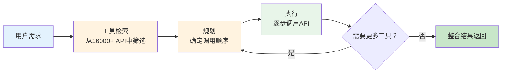
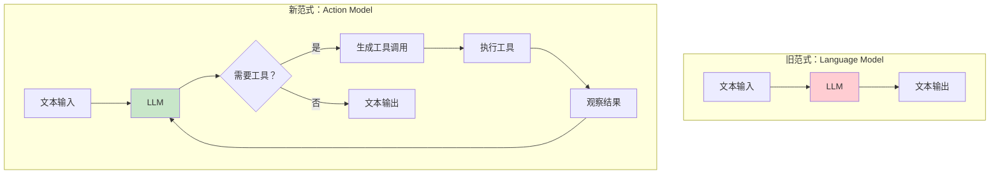

## 工具使用的突破：从 Toolformer 到 Function Calling

语言模型天生的局限在于：它只能生成文本。无论模型多么强大，它不能执行计算、不能访问实时信息、不能操作文件、不能发送邮件。如果 Agent 的"大脑"只能思考而不能行动，那它就永远只是一个"顾问"而非"执行者"。

2023 年，工具使用（Tool Use）能力的突破改变了这一切。从 Toolformer 的学术开创，到 ChatGPT Plugins 的商业尝试，再到 Function Calling 的标准化接口，LLM 在短短几个月内从"只能说"进化为"能做事"。这是 Agent 能力拼图中最关键的一块——赋予模型与外部世界交互的能力。

## Toolformer：自我学习使用工具（2023 年 2 月）

2023 年 2 月，Meta AI 发表了 Toolformer 论文 [Schick et al., 2023]，展示了一个令人激动的想法：**让语言模型自己学会何时以及如何使用工具**。这个想法的哲学意义深远——它暗示工具使用不需要人类逐条编程，模型可以"自悟"什么时候需要外部帮助。

Toolformer 的核心思路是自监督学习：

1. 给模型提供几个工具调用的示例，展示调用格式
2. 让模型在大量文本中自动标注"在哪里插入工具调用会有帮助"
3. 实际执行这些工具调用，保留确实改善了后续 token 预测效果的调用
4. 用标注后的数据微调模型，使其自然学会在合适的位置发起工具调用

实验中 Toolformer 学会使用了五种工具：计算器（用于数学运算）、问答系统（用于事实查询）、搜索引擎（用于开放领域信息获取）、翻译器（用于跨语言任务）和日历（用于日期计算）。一个 6.7B 参数的模型通过工具增强后，在多项任务上超越了更大的 GPT-3（175B）模型——这意味着工具使用可以作为模型规模的高效替代。

Toolformer 的学术意义在于证明了两点：工具使用可以被自主学习（而非需要人类为每种工具编写调用规则），小模型加工具可以超越大模型（能力的乘数效应，而非仅靠参数规模取胜）。但它的方法需要对模型进行微调，在 API 驱动的商业环境（用户只能通过 API 访问模型而无法修改模型权重）中不易推广。这个局限最终由 Function Calling 通过纯提示方式解决。

## ChatGPT Plugins：第一次商业化尝试（2023 年 3 月）

2023 年 3 月 23 日，OpenAI 发布了 ChatGPT Plugins，这是将工具使用能力商业化的第一次大规模尝试。Plugins 允许第三方开发者为 ChatGPT 编写插件，模型可以在对话中自动决定是否调用插件以及如何调用。

首批插件包括 Expedia（旅行预订）、Wolfram Alpha（计算）、Zapier（自动化）等。OpenAI 还发布了一个 Web 浏览插件和一个代码解释器，分别赋予 ChatGPT 实时搜索和代码执行能力。

Plugins 的设计理念是优雅的：每个插件通过 OpenAPI 规范描述自己的能力，模型通过阅读描述来决定调用哪个插件。这本质上是一个"工具选择"问题——模型需要理解用户意图，匹配最合适的工具，生成正确的调用参数。

然而 Plugins 也暴露了早期工具使用的问题：模型经常选错工具、生成错误参数、或者忽略应该调用工具的场景。2024 年初，OpenAI 正式关闭了 Plugins，将其功能整合到了 GPTs 中。尽管如此，Plugins 验证了一个市场需求：用户需要 AI 不仅能说，还能做事。

## Function Calling：结构化的工具交互（2023 年 6 月）

2023 年 6 月 13 日，OpenAI 发布了 Function Calling API，这是工具使用发展中最重要的转折点之一。与 Plugins 的"模型自由发挥"不同，Function Calling 提供了结构化的工具交互接口：

```json
{
  "name": "get_weather",
  "description": "获取指定城市的天气信息",
  "parameters": {
    "type": "object",
    "properties": {
      "city": {"type": "string", "description": "城市名称"},
      "unit": {"type": "string", "enum": ["celsius", "fahrenheit"]}
    },
    "required": ["city"]
  }
}
```

开发者将工具定义（名称、描述、参数 schema）传给 API，模型在需要时生成结构化的工具调用请求，系统执行工具并将结果返回给模型。这种设计的优势在于：

**可靠性**：模型输出的是结构化 JSON 而非自由文本，参数类型和格式有 schema 约束，大幅减少了格式错误。

**灵活性**：开发者可以定义任意工具，不限于预设的插件商店。这使得 Agent 可以与任意后端系统集成。

**可控性**：开发者完全控制工具的执行逻辑，模型只负责决定"调用什么"和"传什么参数"，不直接接触执行细节。

Function Calling 迅速成为构建 Agent 的标准接口。LangChain、AutoGen 等框架的工具调用层都构建在此 API 之上。

## 多家厂商的跟进

Function Calling 的成功引发了多家模型厂商的快速跟进，工具使用在几个月内从 OpenAI 的独家特性变成了行业标配：

**Anthropic Claude**：2023 年底推出 Tool Use API，设计理念与 OpenAI 类似，但在工具选择的推理过程更加透明——Claude 会在选择工具前显式地说明为什么选择这个工具。Anthropic 还特别强调了工具使用的安全性，在执行危险操作前要求人类确认。

**Google Gemini**：支持 Function Calling，并在 Vertex AI 中集成了更丰富的工具生态。Google 的独特优势在于其庞大的第一方服务（Gmail、Calendar、Drive、Maps），使得 Gemini Agent 天然具备丰富的工具生态。

**开源模型**：UC Berkeley 的 Gorilla [Patil et al., 2023] 专门训练模型进行 API 调用，通过检索增强的方式从数千个 API 文档中选择正确的调用，在 API 选择准确率上超越了 GPT-4。这证明了通过专门训练，即使较小的模型也能在工具使用方面表现出色。Qwen（通义千问）、GLM（智谱）等中国开源模型也纷纷支持 Function Calling，使得中文 Agent 生态能够获得同等的工具调用能力。

这种多厂商支持意味着工具使用已经成为 LLM 的"标配"能力，而非某一家的独有特性。对 Agent 开发者而言，这也意味着可以在不同模型之间切换而不需要重写工具集成逻辑——工具调用的 schema 格式正在走向事实标准化。

## ToolLLM：大规模工具使用（2023 年 7 月）

2023 年 7 月，清华大学联合团队发表了 ToolLLM 论文 [Qin et al., 2023]，将工具使用的研究推向了新的规模。ToolLLM 构建了一个包含 16000+ 真实 API（来自 RapidAPI Hub）的工具集，并训练模型在复杂场景中进行多工具、多步骤的调用。



ToolLLM 的贡献在于：证明了 LLM 可以在开放域中处理大规模工具选择问题；提出了 DFSDT（Depth First Search-based Decision Tree）方法来优化工具调用路径；构建了 ToolBench 基准来标准化评估。

## 范式转变：从"语言模型"到"行动模型"

回顾 2023 年工具使用的发展，我们见证了一个根本性的范式转变：



这个转变的意义怎么强调都不为过：

**能力的无限扩展**：模型不再受限于训练时的知识。通过工具，它可以获取实时信息（搜索引擎）、执行精确计算（计算器/代码解释器）、操作外部系统（API 调用）、甚至控制物理设备。

**Agent 的可行性**：没有工具使用能力，Agent 就只能"纸上谈兵"。工具使用让 Agent 能够真正执行任务——发邮件、写代码、操作数据库、预订航班。这是从"AI 助手"到"AI Agent"的关键跨越。

**生态系统的建立**：工具使用创建了一个双边市场——工具提供者和 Agent 开发者。工具越多，Agent 越强；Agent 越多，工具的价值越大。这种飞轮效应推动了整个生态的快速增长。

## 工具使用的挑战与演进

早期工具使用面临的挑战包括：

**工具选择的准确性**：当可用工具数量增多时（从几个到几十个甚至上百个），模型选择正确工具的准确率会显著下降。模型可能选择一个名字相似但功能不同的工具，或者在多个相关工具之间犹豫不决。这催生了工具检索（Tool Retrieval）技术——先用语义搜索从大型工具库中筛选出相关工具，再让模型从小候选集中选择。

**参数生成的可靠性**：模型有时会"幻觉"出不存在的参数值。例如，当调用搜索 API 时，模型可能编造一个不存在的筛选条件；调用数据库查询时，可能引用一个不存在的字段名。Schema 验证和类型约束只能捕获格式错误，无法捕获语义错误。

**多步调用的规划**：复杂任务通常需要多个工具的协调调用，且存在数据依赖——工具 B 的输入需要工具 A 的输出。模型需要理解工具之间的依赖关系和数据流，制定合理的调用顺序。这本质上是一个规划问题。

**错误处理与恢复**：当工具调用失败时（API 超时、权限不足、参数无效），Agent 需要能够理解错误原因并采取恢复策略——是重试、换一种方式调用、还是放弃当前路径。许多早期 Agent 在遇到工具调用错误时会完全卡住或陷入无限重试循环。

**安全与权限控制**：当 Agent 能够调用外部工具时，安全问题变得突出。一个恶意的提示注入可能让 Agent 执行未经授权的操作（如删除数据、发送邮件）。这推动了工具调用的权限分级和人类确认机制的发展。

这些挑战推动了工具使用技术的持续演进，从简单的单次调用发展为复杂的工具编排、并行调用和动态工具发现。2024 年，Model Context Protocol (MCP) 等标准化协议的出现进一步统一了工具接入方式。关于现代 Agent 工具使用模块的设计细节，可参见 [工具使用模块](../../02-technology/07-core-modules/tool-use.md)。

## 本章小结

2023 年是 LLM 工具使用能力从学术研究走向工程实践的关键一年。Toolformer 证明了工具使用可以被自主学习，ChatGPT Plugins 验证了市场需求，Function Calling 提供了标准化接口，ToolLLM 将能力推向大规模。

工具使用赋予了 LLM 从"思考者"到"行动者"的身份转变，这是 Agent 能力拼图中不可或缺的关键一块。与推理能力（CoT）和行动框架（ReAct）相结合，工具使用让"AI 可以自主完成任务"从理论走向现实。

## 延伸阅读

- Schick, T. et al. (2023). "Toolformer: Language Models Can Teach Themselves to Use Tools." *NeurIPS 2023*.
- Qin, Y. et al. (2023). "ToolLLM: Facilitating Large Language Models to Master 16000+ Real-world APIs." *arXiv:2307.16789*.
- Patil, S. et al. (2023). "Gorilla: Large Language Model Connected with Massive APIs." *arXiv:2305.15334*.
- Shen, Y. et al. (2023). "HuggingGPT: Solving AI Tasks with ChatGPT and its Friends in Hugging Face." *NeurIPS 2023*.
- OpenAI. (2023). "Function calling and other API updates." *OpenAI Blog, June 2023*.
