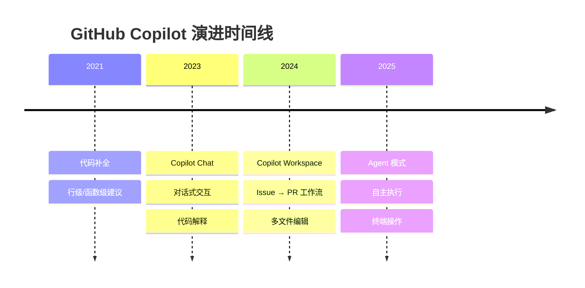
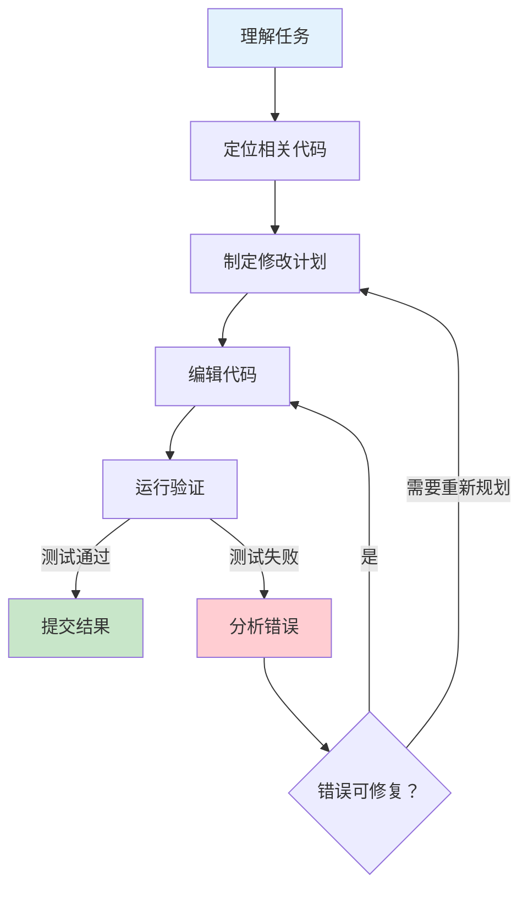

## Coding Agent：最成功的 Agent 应用类别

在所有 Agent 应用类别中，编程（Coding）是迄今为止最成功的一个。从 GitHub Copilot 的自动补全到 Cursor 的 Agent 模式，从 SWE-agent 的学术基准到 Devin 的"AI 软件工程师"宣言，编程领域见证了 Agent 能力最快速的进步和最广泛的实际采纳。

这不是偶然。编程领域具备 Agent 成功所需的几乎所有条件：明确的反馈信号、自动化的验证机制、丰富的训练数据、以及对效率提升的强烈需求。本文追溯 Coding Agent 从辅助工具到自主开发者的演进历程。

## 为什么编程是 Agent 的理想领域

### 反馈信号的确定性

大多数 Agent 应用面临一个根本困难：如何判断 Agent 的输出是否正确？在写作、设计、决策等领域，"正确"本身就是模糊的。但在编程中，代码要么通过编译，要么不通过；测试要么通过，要么失败；程序要么产生预期输出，要么不产生。

这种确定性的反馈信号使 Agent 可以进行**自主迭代**——写代码、运行测试、根据错误修改、再次运行，直到通过。这个循环不需要人类介入就能持续改进。

### 自动化验证的基础设施

软件工程几十年来积累的基础设施——编译器、类型检查器、单元测试、集成测试、linter——天然地为 Agent 提供了验证工具。Agent 不需要"理解"代码是否正确，它只需要运行已有的验证工具并根据结果调整。

### 丰富的训练数据

GitHub 上数十亿行开源代码、Stack Overflow 上数百万个问答、技术博客和文档——编程领域拥有互联网上最丰富、最结构化的训练数据。这使得 LLM 在代码生成方面的能力远超其他专业领域。

## 演进历程

### GitHub Copilot：从补全到 Agent

GitHub Copilot 的演进是 Coding Agent 发展的缩影：

**2021 年 6 月**：Copilot 技术预览发布，基于 OpenAI Codex，提供行级和函数级代码补全。这是"AI 辅助编程"的起点，但本质上只是一个智能的自动补全工具。

**2023 年 3 月**：Copilot Chat 发布，引入对话式交互。开发者可以用自然语言提问、请求解释代码、生成测试。这标志着从"被动补全"到"主动对话"的转变。

**2024 年**：Copilot Workspace 发布，支持从 Issue 到 PR 的端到端工作流。给定一个 GitHub Issue，Copilot 可以分析需求、制定计划、修改多个文件、生成测试。这是 Copilot 向 Agent 模式的关键一步。

**2025 年**：Copilot 进入全面 Agent 模式，支持自主执行多步骤开发任务，包括运行终端命令、调试错误、迭代修复。

### Cursor：AI 原生 IDE

2024 年，Cursor 成为 AI 编程工具领域的现象级产品。与 Copilot 作为 VS Code 插件不同，Cursor 从底层重新设计了 IDE 体验，将 AI 作为核心交互范式而非附加功能。

Cursor 的关键创新包括：

**Agent 模式**：用户描述需求，Cursor 自主规划修改方案、编辑多个文件、运行命令、根据结果迭代。整个过程中用户可以观察和干预，但不需要逐步指导。

**上下文感知**：Cursor 深度理解项目结构、依赖关系、代码风格，使其生成的代码与项目整体保持一致。

**MCP 集成**：通过 MCP 协议，Cursor 可以连接外部工具和数据源，扩展 Agent 的能力边界。

Cursor 的成功证明了一个重要观点：AI 编程工具不应该是"在传统 IDE 上加 AI"，而应该是"围绕 AI 重新设计开发体验"。

### SWE-agent：学术基准

2024 年 4 月，普林斯顿大学发布了 SWE-agent [Yang et al., 2024]，这是第一个系统性地将 LLM Agent 应用于真实软件工程任务的研究。SWE-agent 的设计包含一个精心设计的 Agent-Computer Interface（ACI），使 LLM 能够浏览代码库、编辑文件、运行测试。

SWE-agent 的重要贡献不仅在于其本身的性能，更在于它与 SWE-bench [Jimenez et al., 2024] 基准的结合，为整个领域提供了一个标准化的评估框架。SWE-bench 包含来自真实 GitHub 仓库的 2294 个 Issue，每个都需要 Agent 理解问题、定位代码、实现修复。

### Devin：第一个"AI 软件工程师"

2024 年 3 月 12 日，Cognition Labs 发布了 Devin，将其定位为"世界上第一个 AI 软件工程师"。Devin 的演示展示了一个能够独立完成复杂开发任务的 Agent：从理解需求、搜索文档、编写代码、调试错误到部署应用。

Devin 的发布引发了巨大的关注和争议。支持者认为它代表了 Agent 自主性的重大突破；批评者则指出其演示经过精心挑选，实际能力远未达到"软件工程师"的水平。

无论如何，Devin 的意义在于它改变了行业的想象力边界——人们开始认真讨论"AI 能否替代程序员"这个问题，而不仅仅是"AI 能否帮助程序员"。

### OpenAI Codex Agent（2025 年）

2025 年，OpenAI 推出了 Codex 的 Agent 模式，将其强大的代码生成能力与 Agent 架构结合。Codex Agent 能够在沙箱环境中自主执行多步骤编程任务，包括克隆仓库、安装依赖、编写代码、运行测试、提交 PR。

Codex Agent 的特点是其对安全性的重视——所有操作都在隔离的沙箱中执行，用户可以审查每一步操作后再决定是否应用到真实环境。

### Claude Code（Anthropic，2025 年）

2025 年，Anthropic 发布了 Claude Code，一个终端原生（Terminal-native）的编码 Agent。与 IDE 集成的方案不同，Claude Code 直接在命令行中运行，通过自然语言对话驱动开发工作流。

Claude Code 的设计哲学体现了 Anthropic 一贯的极简主义：不需要复杂的 IDE 配置，不需要学习新的界面，只需要在终端中与 Agent 对话。它可以读写文件、执行命令、搜索代码库、运行测试，所有操作都在用户的真实开发环境中进行。

## 架构模式

经过两年的演进，Coding Agent 的架构模式已经趋于成熟。核心是一个**编辑-测试-迭代循环**（Edit-Test-Iterate Loop）：

**仓库级上下文（Repo-level Context）**：成功的 Coding Agent 需要理解整个代码库的结构，而不仅仅是当前文件。这包括依赖关系、架构模式、代码风格约定、测试策略等。

**多文件推理（Multi-file Reasoning）**：真实的开发任务几乎总是涉及多个文件的协调修改。Agent 需要理解修改一个文件如何影响其他文件，并保持整体一致性。

**工具使用**：Coding Agent 的工具集通常包括文件读写、终端命令执行、代码搜索（grep/语义搜索）、浏览器访问（查阅文档）等。

## SWE-bench 上的能力进步

SWE-bench 成为衡量 Coding Agent 能力的标准基准。从 2024 年初到 2025 年中，各系统在 SWE-bench 上的表现呈现了惊人的进步：

2024 年初，最好的系统（SWE-agent + GPT-4）在 SWE-bench 完整集上的解决率约为 12%。到 2024 年底，领先系统已达到 40% 以上。2025 年中，领先模型在 SWE-bench Verified 上的得分已超过 70%。

这种快速进步来自多个方面的改进：更强的基础模型、更好的 Agent 架构设计、更精细的工具接口、以及更有效的搜索和规划策略。

## 商业化验证

Coding Agent 领域也产生了最具说服力的商业化数据。Cognition AI 的 Devin 从 2024 年 9 月的约 100 万美元 ARR，增长至 2025 年 6 月的 7300 万美元，收购 Windsurf 后合并 ARR 超过 1.5 亿美元。这种爆发式增长证明了 Coding Agent 的真实商业价值。

在推理性能层面，Cognition 与 Cerebras 合作推出的 SWE-1.5 模型实现了 950 tokens/sec 的推理速度，展示了专用推理芯片对 Agent 性能的提升潜力。Cursor 的 Composer-1 模型则达到约 250 tok/s，比 Claude Sonnet 4.5（约 63 tok/s）快约 4 倍。推理速度的提升直接影响了 Coding Agent 的用户体验和成本结构。

**定价模式演进**：Devin 采用标准化的"Agent Compute Units"定价，使成本更可预测；Windsurf 使用基于请求的订阅模式。不同定价策略反映了对"Agent 即服务"商业模型的不同理解。

## 未来展望：从辅助到自主

Coding Agent 的发展轨迹清晰地指向一个方向：从辅助（Assistance）到委托（Delegation）再到自主（Autonomy）。

**当前阶段（2025）**：Agent 可以独立完成中等复杂度的任务（bug 修复、功能添加、重构），但仍需要人类审查结果和处理边界情况。这是"结对编程"模式——AI 写代码，人类审查。

**近期未来**：Agent 将能够处理更复杂的任务（架构设计、性能优化、跨系统集成），人类的角色从"逐行审查"转变为"方向指导和最终验收"。

**远期愿景**：Agent 能够独立完成从需求理解到部署上线的完整开发流程，人类只需要定义"做什么"而非"怎么做"。

这个愿景是否能实现、何时实现，仍是开放问题。但 Coding Agent 在过去两年的进步速度表明，这个方向的进展可能比大多数人预期的更快。

## 本章小结

编程领域之所以成为 Agent 最成功的应用类别，根本原因在于其独特的问题结构：确定性的反馈、自动化的验证、丰富的数据、以及清晰的成功标准。从 Copilot 的代码补全到 Claude Code 的终端 Agent，Coding Agent 在短短四年内完成了从"智能自动补全"到"自主软件工程师"的跨越。

这段历程也为其他领域的 Agent 应用提供了重要启示：Agent 成功的关键不仅在于模型能力，更在于领域本身是否具备支持自主迭代的基础设施。

## 延伸阅读

- [Yang et al., 2024] "SWE-agent: Agent-Computer Interfaces Enable Automated Software Engineering"
- [Jimenez et al., 2024] "SWE-bench: Can Language Models Resolve Real-World GitHub Issues?"
- [GitHub, 2024] "GitHub Copilot Workspace" 技术博客
- [Cognition Labs, 2024] "Introducing Devin, the first AI software engineer"
- [Anthropic, 2025] "Introducing Claude Code" 发布博客
- 本书 [Agent 设计模式](../../02-design-patterns/) 中的工具使用模式章节
