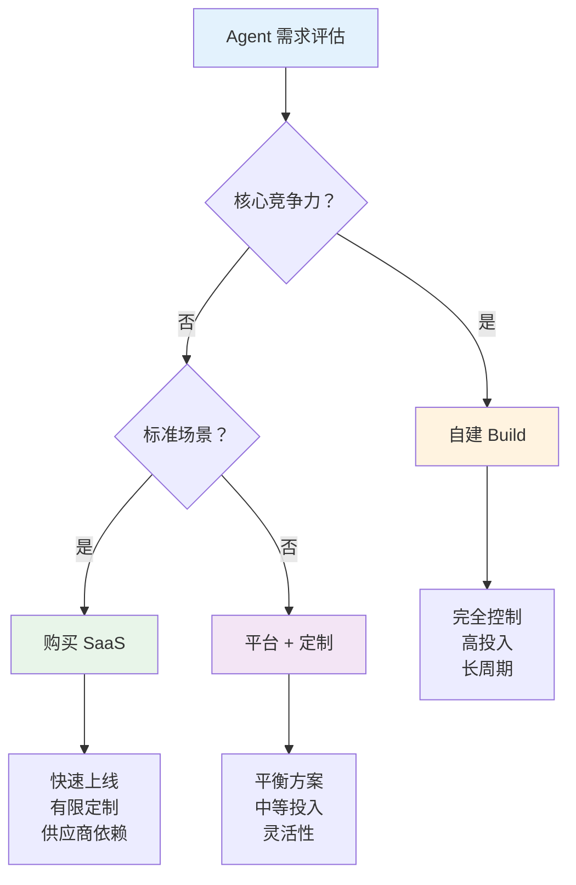

## 企业落地：Agent 在组织中的采纳

如果说 2023 年是开发者和创业公司探索 Agent 可能性的一年，那么 2024-2025 年则是大型企业认真评估和采纳 Agent 技术的时期。从 Microsoft 将 Copilot 嵌入整个 Office 生态，到 Salesforce 推出 AgentForce 平台，再到无数企业内部的 Agent 试点项目，Agent 技术正在从技术前沿走向企业主流。

但企业采纳 Agent 的路径远比创业公司复杂。数据隐私、合规要求、系统集成、组织变革——这些企业特有的挑战决定了 Agent 在组织中的落地方式。

## 企业级 Agent 的典型场景

### 客户支持

客户支持是企业 Agent 最成熟的应用场景。Agent 可以处理常见问题（FAQ）、执行标准操作（查询订单、修改地址）、以及在复杂情况下智能路由到人工客服。

这个场景的优势在于：交互模式相对标准化、成功标准明确（解决率、满意度）、失败的代价可控（最坏情况是转人工）、且有大量历史数据可用于训练和评估。

### 数据分析

企业内部的数据分析是另一个高价值场景。Agent 可以接受自然语言查询（"上个季度华东区的销售趋势如何？"），自动生成 SQL、执行查询、可视化结果、并提供洞察。

这个场景的价值在于它**民主化了数据访问**——不再需要每个分析需求都经过数据团队，业务人员可以直接与数据对话。

### 工作流自动化

企业中存在大量重复性的跨系统工作流：审批流程、报告生成、数据同步、合规检查。Agent 可以理解这些工作流的意图，自动执行跨系统的操作，并在需要人类判断时暂停等待。

## 平台级产品

### Microsoft Copilot 生态

Microsoft 是将 Agent 技术最全面地嵌入企业产品的公司。其 Copilot 品牌覆盖了企业工作的几乎所有场景：

**Microsoft 365 Copilot**：嵌入 Word、Excel、PowerPoint、Outlook、Teams 等办公应用，帮助用户起草文档、分析数据、制作演示、管理邮件和会议。

**GitHub Copilot**：面向开发者的编码助手（详见 [Coding Agent](./coding-agents.md) 章节）。

**Azure AI Agent Service**：面向企业开发者的 Agent 构建平台，提供模型托管、工具集成、安全管控等基础设施。

**Copilot Studio**：低代码/无代码的 Agent 构建工具，使业务人员也能创建自定义 Agent。

Microsoft 的策略是**无处不在**——让 Copilot 成为用户在每个工作场景中的默认助手。这种深度集成的优势在于上下文的连续性：Copilot 可以跨应用理解用户的工作上下文。

### Salesforce AgentForce

2024 年 9 月，Salesforce 在 Dreamforce 大会上发布了 AgentForce，将其定位为"自主 AI Agent 平台"。AgentForce 的核心理念是让企业能够部署能够自主完成业务任务的 Agent，而不仅仅是回答问题的聊天机器人。

AgentForce 的 Agent 可以：主动联系潜在客户、处理服务请求、执行营销活动、管理销售流程。它们基于 Salesforce 的 CRM 数据运行，能够访问客户历史、业务规则和企业知识库。

### ServiceNow AI Agents

ServiceNow 将 Agent 技术应用于 IT 服务管理（ITSM）和企业服务管理（ESM）。其 AI Agent 可以自动处理 IT 工单（密码重置、权限申请）、诊断系统问题、执行标准变更流程。

ServiceNow 的优势在于其已有的工作流引擎——Agent 不需要从零构建自动化能力，而是在已有的流程自动化基础上增加"理解意图"和"动态决策"的能力。

## 企业核心关切

### 数据隐私与安全

企业最大的顾虑是数据安全。Agent 需要访问企业内部数据才能有效工作，但这些数据往往包含商业机密、客户信息、财务数据等敏感内容。

企业的典型要求包括：数据不出境（不发送到外部 API）、访问控制（Agent 只能看到用户有权限的数据）、数据脱敏（敏感字段在传递给模型前被遮蔽）、以及审计日志（记录 Agent 访问了哪些数据）。

这些要求催生了"私有化部署"的需求——企业希望在自己的基础设施上运行模型和 Agent，而非依赖外部 SaaS 服务。

### 合规与审计

受监管行业（金融、医疗、法律）对 Agent 有额外的合规要求：决策过程必须可解释、操作必须可追溯、输出必须符合行业规范。

这意味着 Agent 系统需要内置完整的审计能力：记录每次决策的输入、推理过程和输出；支持事后回溯和审查；能够证明决策符合相关法规。

### 可审计性

与传统软件不同，Agent 的行为具有不确定性。企业需要能够回答"Agent 为什么做了这个决定？"这个问题。这要求 Agent 系统提供详细的执行追踪（Trace），包括每一步的输入、模型的推理、工具的调用和结果。

## Build vs Buy 决策

企业在采纳 Agent 技术时面临一个关键决策：自建还是购买？

**自建（Build）** 适合：Agent 能力是核心竞争力、有独特的数据和流程、对安全和控制有极高要求、有足够的技术团队。

**购买（Buy）** 适合：标准化场景（客服、数据分析）、希望快速上线、缺乏 AI 工程团队、可以接受一定程度的供应商锁定。

**平台 + 定制** 是最常见的选择：使用 Azure AI、AWS Bedrock 等平台提供的基础设施，在其上构建定制化的 Agent 逻辑。

## 内部开发者平台

大型企业越来越多地构建内部的 Agent 开发平台（Internal Developer Platform），为各业务团队提供统一的 Agent 构建能力：

- 统一的模型网关：管理多个模型的访问、计费和限流
- 工具注册中心：企业内部工具的标准化注册和发现
- 安全层：统一的认证、授权和数据脱敏
- 评估框架：标准化的 Agent 质量评估和监控
- 部署管道：从开发到生产的标准化流程

这种平台化的方式使企业能够在保持安全和治理的同时，让各团队快速构建和迭代自己的 Agent 应用。

## ROI 衡量

企业采纳 Agent 技术需要明确的投资回报。常见的 ROI 衡量维度包括：

**成本节约**：Agent 处理的请求量 × 人工处理的平均成本 - Agent 运行成本。客服场景中，Agent 处理一个请求的成本通常是人工的 1/10 到 1/5。

**速度提升**：任务完成时间的缩短。数据分析场景中，Agent 可以将"提需求 → 排队 → 分析 → 交付"的周期从天级缩短到分钟级。

**质量提升**：错误率的降低、一致性的提高。合规检查场景中，Agent 可以实现 100% 覆盖率，而人工抽检通常只能覆盖 10-20%。

**员工满意度**：将重复性工作交给 Agent 后，员工可以专注于更有创造性和价值的工作。

## 采纳障碍

### 信任

企业决策者对 AI 的不确定性天然持谨慎态度。"如果 Agent 犯了错误，谁负责？"这个问题在企业环境中尤为敏感。建立信任需要时间、透明度和可验证的成功案例。

### 变革管理

Agent 的引入不仅是技术变革，更是组织变革。员工可能担心被替代、管理者需要重新定义角色和流程、IT 部门需要建立新的运维能力。成功的 Agent 采纳需要配套的变革管理策略。

### 集成复杂性

企业的 IT 环境通常是数十年积累的复杂系统。Agent 需要与 ERP、CRM、HR 系统、内部工具等众多系统集成。每个集成点都是潜在的故障点和安全风险。

### 数据质量

Agent 的效果高度依赖数据质量。许多企业的内部数据存在不一致、不完整、过时等问题。在部署 Agent 之前，往往需要先进行数据治理。

## 中间件机会

Agent 在企业中的落地催生了一个新的中间件层——介于 Agent 应用和企业基础设施之间的服务：

**监控与可观测性**：追踪 Agent 的每次执行、监控成功率和延迟、检测异常行为。LangSmith、Arize、Braintrust 等工具服务于这一需求。

**安全与治理**：输入/输出过滤、敏感数据检测、访问控制、合规审计。这是企业 Agent 部署中最关键的中间件层。

**成本管理**：token 使用追踪、模型路由优化、缓存策略、预算控制。帮助企业在质量和成本之间找到最优平衡。

## 本章小结

Agent 在企业中的落地是一个系统工程，涉及技术、组织和商业三个维度。技术上需要解决安全、集成和可靠性问题；组织上需要管理变革和建立信任；商业上需要证明 ROI 和可持续性。

Microsoft、Salesforce、ServiceNow 等平台厂商通过将 Agent 嵌入已有产品来降低采纳门槛；企业则通过内部平台化来平衡创新速度和治理要求。这个过程仍在早期，但方向已经明确：Agent 将成为企业软件的标准组成部分，就像数据库和 API 一样基础。

## 延伸阅读

- [Microsoft, 2024] "Microsoft Copilot for Microsoft 365" 企业部署指南
- [Salesforce, 2024] "AgentForce: Autonomous AI Agents for Enterprise" Dreamforce 发布
- [McKinsey, 2024] "The State of AI in 2024" — 企业 AI 采纳调研报告
- [Gartner, 2025] "Market Guide for AI Agent Platforms"
- 本书 [Agent 可靠性工程](../04-lessons-learned/reliability-engineering.md) 章节
- 本书 [成本与延迟](../04-lessons-learned/cost-and-latency.md) 章节探讨企业级优化策略
