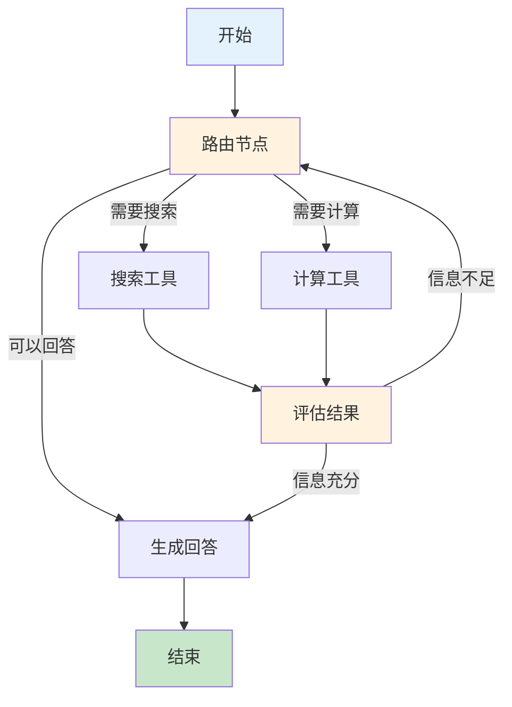
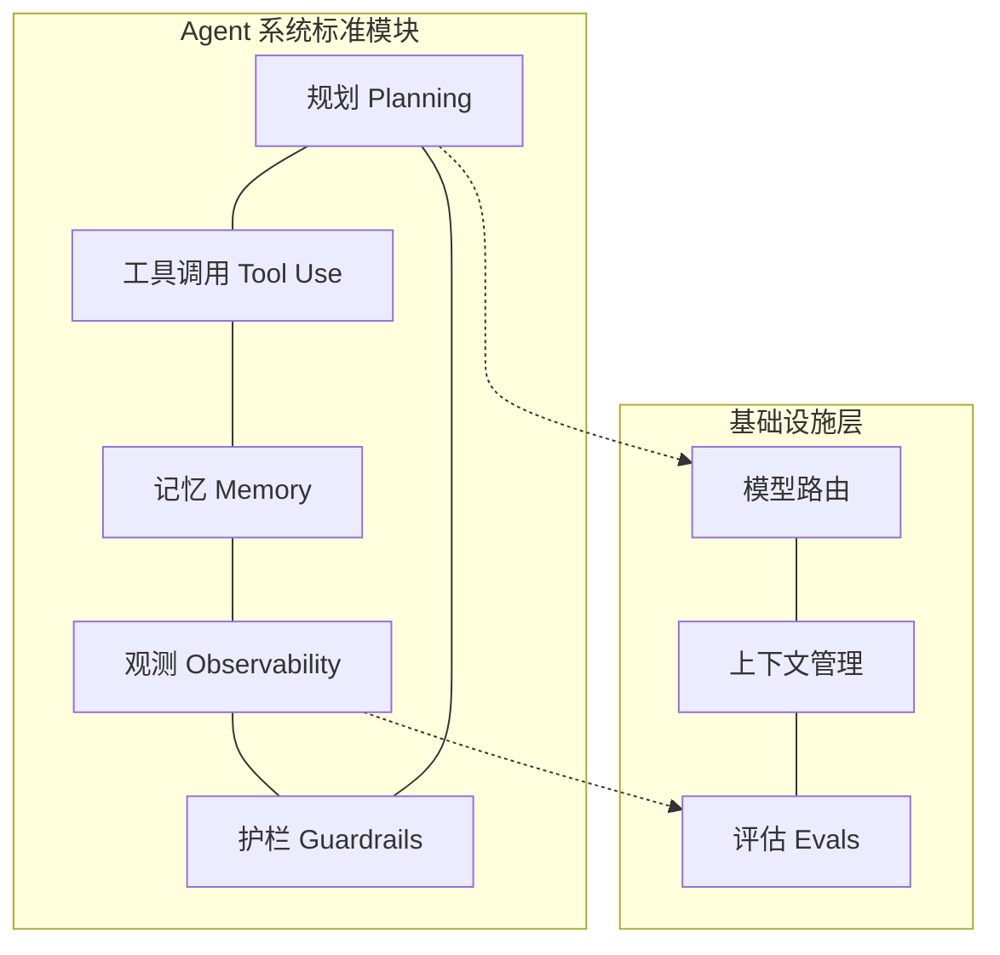

## 框架大爆发：从百花齐放到范式收敛

2024 年是 Agent 框架的"寒武纪大爆发"。如果说 2023 年是概念验证的一年——AutoGPT 和 BabyAGI 证明了 LLM 可以自主行动——那么 2024 年则是工程化的一年。数十个框架涌现，各自提出不同的抽象层次和编程范式，试图回答一个核心问题：**构建可靠 Agent 的正确抽象是什么？**

到 2025 年初，这场混战开始收敛。几个关键范式浮出水面，社区也逐渐形成了关于"什么是好的 Agent 框架"的共识。本文梳理这段从百花齐放到范式收敛的历程。

## 2024：框架井喷之年

### 早期框架的局限

2023 年的第一代框架（参见 [早期框架](../02-llm-agent-rise/early-frameworks.md)）暴露了明显的问题：LangChain 的链式抽象过于僵化，AutoGPT 的无限循环缺乏可控性，BabyAGI 的任务分解过于理想化。开发者需要的不是"自主运行的 AI"，而是"可预测、可调试、可控制的 AI 工作流"。

这一认知转变催生了 2024 年的框架浪潮。

### LangGraph：图范式的崛起

2024 年 1 月，LangChain 团队发布了 LangGraph，这标志着 Agent 框架设计思路的重大转向。LangGraph 的核心洞察是：**Agent 的行为本质上是一个状态图（State Graph）**。

与 LangChain 的线性链（Chain）不同，LangGraph 允许开发者显式定义节点（Node）、边（Edge）和条件路由（Conditional Edge）。这带来了几个关键优势：循环和分支成为一等公民，状态管理变得显式可控，执行路径可以被可视化和调试。

LangGraph 的设计哲学是"低层次但可组合"——它不假设 Agent 应该如何工作，而是提供构建任意工作流的原语。这种灵活性使其迅速成为生产环境中最受欢迎的 Agent 框架之一。

### Microsoft AutoGen：多 Agent 对话

2023 年 10 月微软发布的 AutoGen 在 2024 年持续演进。AutoGen 的核心范式是**多 Agent 对话**——将复杂任务分解为多个专业化 Agent 之间的协作对话。一个典型的 AutoGen 应用可能包含一个"规划者"Agent、一个"执行者"Agent 和一个"评审者"Agent，它们通过消息传递协作完成任务。

2024 年 10 月，微软发布了 AutoGen 0.4 重大重构版本，引入了事件驱动架构和更灵活的 Agent 通信模式，反映了社区对多 Agent 系统工程化的深入理解。

### CrewAI：角色扮演范式

CrewAI（2024 年初发布）提出了一个直觉性很强的抽象：将 Agent 组织为一个"团队"（Crew），每个 Agent 扮演特定角色（Role），拥有明确的目标（Goal）和背景故事（Backstory）。这种拟人化的设计降低了入门门槛，使非技术用户也能理解和配置 Agent 系统。

CrewAI 的流行反映了一个重要趋势：Agent 框架不仅要服务于开发者，还要服务于产品经理和业务人员。

## 2025 年初：巨头入场

### OpenAI Agents SDK（2025 年 3 月）

2025 年 3 月，OpenAI 发布了 Agents SDK，这是其对"Agent 应该如何构建"的明确表态。SDK 的设计极为精简，核心概念只有四个：

- **Agent**：一个配置了指令、工具和模型的实体
- **Handoff**：Agent 之间的任务转交机制
- **Guardrails**：输入/输出验证层
- **Tracing**：内置的可观测性支持

OpenAI 的设计哲学是"足够少的抽象，足够多的约定"。它没有引入复杂的图结构或状态机，而是通过 Handoff 机制实现 Agent 间的协作——当一个 Agent 判断任务超出自己能力范围时，它可以将控制权转交给另一个更合适的 Agent。

这种设计的优势在于简单性：开发者不需要学习新的编程范式，只需要理解"Agent 可以调用工具，也可以把任务交给其他 Agent"这一直觉。

### Anthropic 的极简主义宣言（2024 年 12 月）

2024 年 12 月，Anthropic 发布了影响深远的博客文章"Building Effective Agents"。这篇文章没有发布任何框架，但它对 Agent 工程化的影响可能超过了任何具体的代码库。

Anthropic 的核心论点是：**大多数成功的 Agent 系统并不需要复杂的框架**。他们将 Agent 系统分为两类：

- **工作流（Workflows）**：预定义的 LLM 调用编排，流程确定
- **Agent**：LLM 自主决定控制流，流程动态

文章提出了一个关键建议："从最简单的方案开始，只在确实需要时才增加复杂性。"他们展示了仅用基础的提示链（Prompt Chaining）、路由（Routing）和工具使用（Tool Use）就能构建大多数生产级 Agent 系统。

这篇文章在社区引发了广泛讨论，许多开发者开始反思：自己是否在用过度复杂的框架解决本可以简单解决的问题？

## 核心辩论：重框架 vs 轻编排

2024-2025 年 Agent 社区最激烈的辩论围绕一个问题展开：**Agent 需要多重的框架？**

### 重框架阵营

支持者认为，Agent 系统的复杂性需要强大的抽象来管理。状态管理、错误恢复、并发控制、可观测性——这些都是分布式系统的经典问题，需要成熟的框架支持。LangGraph 和 AutoGen 代表了这一路线。

### 轻编排阵营

反对者认为，过度抽象带来的认知负担和调试困难超过了其收益。Anthropic 的博客、OpenAI 的 Agents SDK，以及许多独立开发者的实践都表明：用 Python 原生代码 + 模型 API + 少量工具定义，就能构建出可靠的 Agent 系统。

### 实践中的平衡

到 2025 年中，社区逐渐达成了一个务实的共识：**框架的选择取决于问题的复杂度**。简单的单 Agent 工具调用场景不需要框架；复杂的多 Agent 协作、需要持久化状态和人机交互的场景则受益于 LangGraph 这样的结构化方案。

## 范式收敛：共识模块

尽管框架各异，到 2025 年初，社区对 Agent 系统的核心模块已形成共识：

**工具调用（Tool Use）** 已成为所有框架的标配。无论是 LangGraph 的 ToolNode、AutoGen 的 FunctionCall，还是 OpenAI 的 function calling，工具调用的模式已经标准化。

**记忆（Memory）** 分为短期记忆（对话上下文）和长期记忆（跨会话持久化），几乎所有框架都提供了相应的抽象。

**规划（Planning）** 从早期的"让 LLM 自由规划"演变为更受控的方案：预定义的工作流 + 有限的动态决策。

**护栏（Guardrails）** 和**可观测性（Observability）** 是 2024 年新增的共识模块，反映了从"能跑"到"可靠"的工程化转向。

## "框架疲劳"现象

2024 年下半年，社区出现了明显的"框架疲劳"（Framework Fatigue）。新框架每周都在发布，每个都声称解决了前一个的问题，但开发者发现自己花在学习框架上的时间超过了构建产品的时间。

这种疲劳催生了两个趋势：一是回归基础——越来越多的开发者选择直接使用模型 API 而非框架；二是框架整合——小型框架被收购或停止维护，市场开始向少数几个成熟方案集中。

## 经验教训：有益的抽象与有害的抽象

回顾这段历程，哪些抽象经受住了时间的考验？

**有益的抽象**包括：工具定义的标准化格式（JSON Schema）、结构化输出（Structured Output）、流式响应处理、重试和错误恢复机制、执行追踪和日志。

**有害的抽象**包括：过度封装模型 API 导致调试困难、隐式的状态管理让行为不可预测、过于"智能"的默认行为掩盖了问题、强制的继承层次限制了灵活性。

一个简单的判断标准是：**好的抽象让你在需要时能"看穿"它，坏的抽象则在你需要理解底层行为时成为障碍。**

## 本章小结

2024-2025 年的框架大爆发是 Agent 技术从研究走向工程的必经之路。这段历程的核心教训是：Agent 框架的价值不在于提供最多的功能，而在于提供恰到好处的抽象——既能降低常见场景的开发成本，又不会在复杂场景中成为障碍。

LangGraph 的图范式、OpenAI 的极简 SDK、Anthropic 的"无框架"哲学，代表了三种不同但各有价值的设计取向。最终，框架的选择应该由问题的复杂度驱动，而非由技术时尚驱动。

## 延伸阅读

- [Anthropic, 2024] "Building Effective Agents" — Anthropic 官方博客
- [LangGraph Documentation] LangGraph 官方文档与设计哲学
- [OpenAI, 2025] "Agents SDK" 发布博客与 API 参考
- [Microsoft, 2024] "AutoGen: Enabling Next-Gen LLM Applications via Multi-Agent Conversation"
- [Harrison Chase, 2024] "What is an Agent?" — LangChain 创始人对 Agent 定义的思考
- 本书第二部分 [Agent 设计模式](../../02-design-patterns/) 将深入探讨这些框架背后的通用模式
