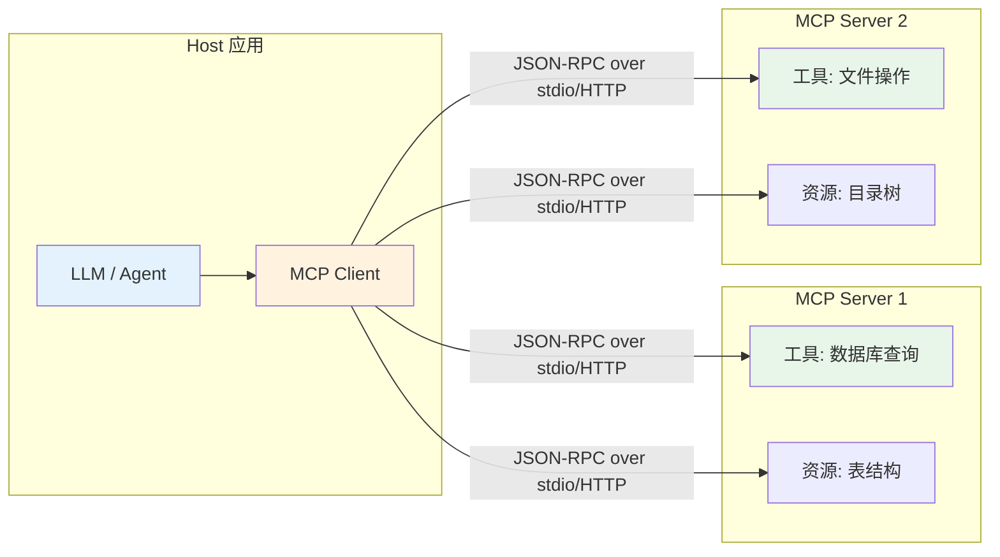
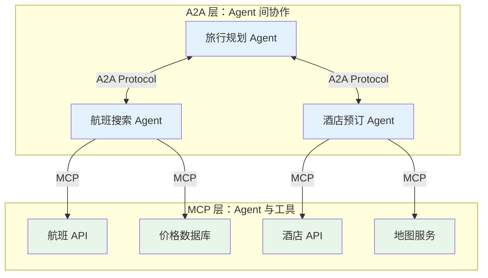

## MCP 与 Agent 协议：走向标准化

每一次技术浪潮的成熟都伴随着标准化的进程。Web 有 HTTP，容器有 OCI，微服务有 gRPC。2024 年末到 2025 年初，Agent 生态迎来了自己的标准化时刻：Anthropic 的 Model Context Protocol（MCP）和 Google 的 Agent-to-Agent（A2A）协议相继发布，标志着 Agent 技术从"各自为战"走向"互联互通"。

## 为什么需要协议？

在 MCP 出现之前，每个 Agent 框架都有自己的工具集成方式。LangChain 有 Tool 类，AutoGen 有 FunctionCall，OpenAI 有 function calling API。如果你开发了一个数据库查询工具，想让它同时在 Cursor、Claude Desktop 和自定义 Agent 中使用，你需要为每个平台分别适配。

这种碎片化带来了三个问题：工具开发者的重复劳动、用户被锁定在特定生态、Agent 之间无法互操作。标准协议的价值正在于此——它定义了一个通用的"插头"，让任何工具都能接入任何 Agent。

## Model Context Protocol（MCP）

### 设计目标与发布

2024 年 11 月 25 日，Anthropic 发布了 Model Context Protocol（MCP），将其定位为"AI 应用的 USB-C 接口"。MCP 的设计目标是：为 LLM 应用提供一个标准化的方式来连接外部数据源和工具，无论底层使用哪个模型或框架。

MCP 采用开放规范的形式发布，任何人都可以实现兼容的客户端或服务器。这一决策反映了 Anthropic 的战略判断：协议的价值来自网络效应，开放才能赢得生态。

### 架构设计

MCP 采用客户端-服务器架构（Client-Server Architecture），遵循 JSON-RPC 2.0 消息格式：



**Host** 是运行 LLM 的应用程序（如 Claude Desktop、Cursor），它内嵌一个或多个 MCP Client。**MCP Server** 是提供工具和数据的外部进程，可以是本地进程也可以是远程服务。Client 和 Server 之间通过标准化的消息协议通信。

### 传输层

MCP 定义了三种传输方式，适应不同的部署场景：

**stdio（标准输入输出）**：Client 启动 Server 作为子进程，通过 stdin/stdout 通信。这是本地开发最简单的方式，无需网络配置。

**HTTP + SSE（Server-Sent Events）**：Server 作为 HTTP 服务运行，Client 通过 HTTP POST 发送请求，通过 SSE 接收流式响应。适合远程部署场景。

**Streamable HTTP**：2025 年初引入的新传输方式，统一了请求-响应和流式通信，简化了远程 MCP Server 的实现。

### 核心原语

MCP 定义了四种核心原语（Primitives），覆盖了 Agent 与外部世界交互的主要模式：

**Tools（工具）**：模型可以调用的函数，如"执行 SQL 查询"、"发送邮件"。工具由 Server 暴露，由模型决定何时调用。这是 MCP 最核心的原语。

**Resources（资源）**：结构化的上下文数据，如文件内容、数据库 schema、API 文档。资源由应用程序（而非模型）决定何时读取，用于丰富模型的上下文。

**Prompts（提示模板）**：预定义的交互模板，如"总结这段代码"、"解释这个错误"。提示模板由用户显式选择触发。

**Sampling（采样）**：允许 Server 反向请求 Client 的 LLM 进行推理。这是一个高级特性，使 MCP Server 本身也能利用 AI 能力。

### 能力协商

MCP 的一个精妙设计是**能力协商（Capability Negotiation）**。在连接建立时，Client 和 Server 交换各自支持的能力集合。这意味着协议可以渐进式演进——新版本添加新能力时，旧版本的实现不会中断。

## Google A2A 协议（2025 年 4 月）

### 不同的问题域

2025 年 4 月，Google 发布了 Agent-to-Agent（A2A）协议。与 MCP 解决"模型如何调用工具"不同，A2A 解决的是"Agent 如何与 Agent 协作"。

这是一个关键的区分：MCP 是**垂直的**——连接模型与底层工具和数据；A2A 是**水平的**——连接同层级的 Agent 实体。

### A2A 的核心概念

A2A 定义了 Agent 之间协作的标准方式：

**Agent Card**：每个 Agent 的"名片"，描述其能力、接口和元数据。其他 Agent 通过读取 Agent Card 来发现和理解潜在的协作伙伴。

**Task**：Agent 之间协作的基本单位。一个 Agent 可以向另一个 Agent 发起 Task，包含输入、期望输出和约束条件。

**Message 和 Artifact**：Task 执行过程中的通信载体。Message 用于对话式交互，Artifact 用于传递结构化产出物。

### MCP vs A2A：互补而非竞争



两个协议解决不同层次的问题：MCP 让 Agent 能够使用工具（model↔tool），A2A 让 Agent 能够委托任务给其他 Agent（agent↔agent）。在一个完整的多 Agent 系统中，两者可以共存——Agent 通过 A2A 协作，每个 Agent 内部通过 MCP 调用工具。

## 生态采纳

MCP 发布后的生态采纳速度令人瞩目。到 2025 年中，主要的 AI 开发工具几乎都已集成 MCP 支持：

**IDE 和编辑器**：Cursor（2024 年 12 月集成）、Windsurf、Zed、Continue、Replit 等 AI 编程工具率先支持 MCP，使开发者可以通过统一协议为编码 Agent 添加自定义工具。

**AI 应用**：Claude Desktop 作为 MCP 的参考实现，从发布之初就支持本地 MCP Server。随后 ChatGPT Desktop、各类 AI 助手也开始跟进。

**企业平台**：Cloudflare、Atlassian、Stripe 等公司发布了官方 MCP Server，使其服务可以被任何 MCP 兼容的 Agent 直接调用。

**社区生态**：开源社区贡献了数千个 MCP Server 实现，覆盖数据库、文件系统、API 集成、开发工具等各个领域。

## 标准化的价值

### 互操作性

标准协议最直接的价值是互操作性。一个为 Cursor 开发的 MCP Server 可以无修改地在 Claude Desktop 中使用；一个企业内部的 MCP Server 可以同时服务于多个不同的 Agent 应用。这大大降低了工具生态的碎片化。

### 市场与组合性

标准化催生了 MCP Server 的"市场"（Marketplace）。开发者可以发布通用的 MCP Server，用户可以像安装插件一样为自己的 Agent 添加新能力。这种组合性使 Agent 的能力可以模块化地扩展。

### 降低迁移成本

当工具集成遵循标准协议时，用户可以自由切换底层模型或 Agent 框架，而不需要重新实现所有工具集成。这降低了供应商锁定的风险。

## OAuth 2.1：生产级 Agent 安全的基石

随着 MCP Server 从本地 stdio 部署走向远程 HTTP 服务，安全认证成为不可回避的核心问题。早期实践中常见的静态 API 密钥被证明极不安全——2025 年的行业调查显示，高达 53% 的 MCP 服务器仍在使用不安全的静态长生命周期密钥，而只有约 8.5% 采用了 OAuth。OAuth 2.1 标准正在成为解决这一问题的行业共识。

### OAuth 2.1 为 Agent 带来的价值

**用户授权与同意**：将授权决策交还给最终用户。用户可以明确同意某个 Agent 在特定范围内（scopes）访问其数据或调用某个工具，而不是将凭证完全交给 Agent。

**凭证解耦**：Agent 本身不存储用户的长期凭证，而是通过标准 OAuth 流程获取短期访问令牌（Access Token）来与 MCP Server 交互。

**PKCE 强制化**：OAuth 2.1 强制使用 PKCE（Proof Key for Code Exchange），有效防止授权码拦截攻击，提升移动和 Web 场景的安全性。

**动态客户端注册（DCR）**：允许新的 Agent 或工具自动、安全地在授权服务器上注册，简化大规模 Agent 生态系统的管理。

### 典型 MCP OAuth 2.1 流程

```
用户指示 Agent 使用工具
    → Agent（OAuth 客户端）将用户重定向到授权服务器
    → 用户登录并授权特定 scope
    → 授权服务器返回授权码给 Agent
    → Agent 用授权码 + PKCE 验证换取访问令牌
    → Agent 使用访问令牌向 MCP Server（资源服务器）发起工具调用
```

## 动态发现与令牌管理：生产环境架构模式

在高可用性的生产环境中，动态 Agent 发现和令牌管理是两个关键的工程挑战。

### 动态代理发现

A2A 协议通过定义标准 URI 路径（如 `/.well-known/a2a-capabilities`）实现动态发现。Agent 可以通过查询目标 Agent 的该端点获取其"Agent Card"——包含能力描述、公钥、支持的认证方法等元数据。

在更大规模的部署中，可以采用中心化注册中心（所有 Agent 启动时注册身份和能力，便于管理但需保障高可用）或去中心化模式（P2P 发现，韧性更强但审计更复杂）。

### 令牌刷新与高可用管理

OAuth 2.1 的访问令牌通常是短期的，当令牌过期时 Agent 必须无缝刷新。在高并发部署中（如 Kubernetes 多 Pod），存在三种主要架构模式：

**模式一：Agent 内置令牌管理 + 分布式缓存。** 每个 Agent 实例内部包含完整的 OAuth 客户端逻辑，通过 Redis 等分布式缓存共享令牌。优点是扩展性好、符合微服务理念；缺点是存在并发刷新的"惊群效应"，需要分布式锁协调。

**模式二：集中式令牌服务 / 安全网关。** 引入专门的内部"令牌服务"，所有 Agent 向其请求令牌而非直接与外部授权服务器通信。该服务统一管理获取、缓存和刷新。优点是安全逻辑集中化、易于审计；缺点是新增中心化组件，自身必须高可用。

**模式三：事件驱动刷新（推荐与模式二结合）。** 令牌服务不等待过期后被动刷新，而是根据令牌 `expires_in` 字段提前注册"预刷新"事件到消息队列。令牌总是在过期前被刷新，Agent 请求时几乎总能拿到有效令牌，最小化延迟。

对于生产级高可用部署，"集中式令牌服务 + 事件驱动刷新"的组合被认为是当前最佳实践——集中化安全复杂性，同时通过主动刷新确保低延迟和高成功率。

## 开放问题与行业现状

尽管 MCP 和 A2A 描绘了美好的蓝图，协议标准化仍面临诸多挑战：

**安全迁移任重道远**：前述 53% 的 MCP 服务器仍用静态密钥的数据表明，从传统模式向 OAuth 2.1 的迁移进展缓慢。需要更好的工具链和开发者教育来加速这一过渡。

**版本管理**：当 MCP Server 的工具接口发生变更时，如何保证向后兼容？如何处理 Client 和 Server 版本不匹配的情况？

**发现机制**：用户如何找到适合自己需求的 MCP Server？目前主要依赖手动配置和社区列表，缺乏自动化的服务发现机制。

**信任与审计**：在企业环境中，如何审计 Agent 通过 MCP 执行了哪些操作？如何建立对第三方 MCP Server 的信任？

**性能与可靠性**：协议层面的超时预算分配、结构化错误恢复和能力协商，仍需在实践中不断完善。

## 本章小结

MCP 和 A2A 的发布标志着 Agent 技术从"各自为战"走向"互联互通"的转折点。MCP 解决了模型与工具之间的标准化连接问题，A2A 则为 Agent 间的协作提供了通用语言。

这两个协议的意义不仅在于技术层面——它们代表了一种生态思维的转变：Agent 的价值不仅来自单个系统的能力，更来自整个生态的互操作性和组合性。正如 HTTP 使 Web 成为可能，MCP 和 A2A 可能成为 Agent 互联网的基础协议。

当然，标准化是一个漫长的过程。安全、版本管理、发现机制等问题仍需解决，协议本身也将随着实践的深入而演进。但方向已经明确：Agent 的未来是开放和互联的。

## 延伸阅读

- [Anthropic, 2024] "Introducing the Model Context Protocol" — MCP 发布博客
- [Model Context Protocol Specification] https://spec.modelcontextprotocol.io — MCP 官方规范
- [Google, 2025] "Announcing the Agent-to-Agent Protocol" — A2A 发布博客
- [MCP GitHub Repository] https://github.com/modelcontextprotocol — 官方实现和示例
- 本书 [工具使用](../../03-tool-use/) 章节将深入探讨 MCP 的实践应用
