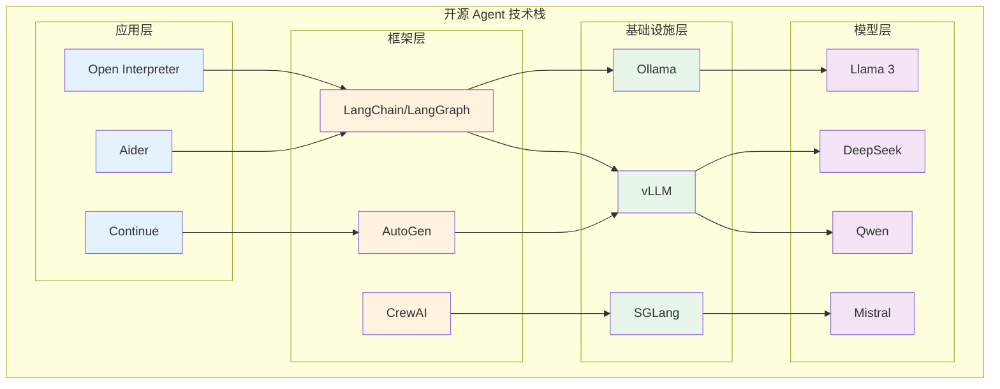

## 开源生态：社区驱动的 Agent 创新

Agent 技术的发展不仅是闭源巨头的竞赛，更是一场广泛的社区运动。从 Meta 开放 Llama 系列模型，到 DeepSeek 震动行业的开源策略，从 LangChain 的社区贡献到 Ollama 让本地部署触手可及——开源生态在 Agent 技术的民主化中扮演了不可替代的角色。

本文梳理开源 Agent 生态的全景：模型层、框架层、基础设施层和应用层，以及中国开源力量在其中的独特贡献。

## 开源模型：Agent 能力的基座

### 从"不可能"到"接近"

2023 年初，开源模型与 GPT-4 之间存在巨大的能力鸿沟，尤其在工具调用、多步推理等 Agent 核心能力上。到 2025 年中，这个差距已经大幅缩小，某些场景下开源模型甚至可以与闭源模型匹敌。

### Meta Llama 系列

Meta 的 Llama 系列是开源 LLM 生态的基石：

**Llama 2（2023 年 7 月）**：首次以开放许可证发布的高质量大模型，虽然在 Agent 任务上能力有限，但开启了开源大模型的时代。

**Llama 3（2024 年 4 月）**：性能大幅提升，8B 和 70B 版本在多项基准上接近 GPT-3.5 水平。更重要的是，Llama 3 的工具调用能力显著增强，使其可以作为 Agent 的基座模型。

**Llama 3.1（2024 年 7 月）**：405B 版本首次让开源模型在某些任务上接近 GPT-4 水平。同时发布的 128K 上下文窗口版本使长文档处理和复杂 Agent 任务成为可能。

### Mistral

法国公司 Mistral AI 以"小而精"的策略在开源模型领域占据了独特位置。Mistral 7B（2023 年 9 月）证明了精心训练的小模型可以超越大得多的竞争对手。后续的 Mixtral 8x7B（MoE 架构）和 Mistral Large 进一步扩展了其产品线。

Mistral 的模型以推理效率著称，特别适合需要快速响应的 Agent 场景。

### DeepSeek：中国开源的突破

2024-2025 年，DeepSeek 成为全球开源 AI 领域最引人注目的力量：

**DeepSeek-V2（2024 年 5 月）**：引入 MLA（Multi-head Latent Attention）架构，在保持高性能的同时大幅降低推理成本。

**DeepSeek-V3（2024 年 12 月）**：671B 参数的 MoE 模型，在多项基准上达到 GPT-4 级别，且训练成本仅为同级别模型的一小部分。

**DeepSeek-R1（2025 年 1 月）**：专注于推理能力的模型，在数学、编程和复杂推理任务上表现卓越。其开源发布震动了整个行业，证明了开源模型可以在最前沿的能力上与闭源模型竞争。

DeepSeek 的意义不仅在于模型本身，更在于它证明了一种新的研发范式：通过架构创新和训练效率优化，以远低于行业平均水平的成本达到顶尖性能。

### Qwen（通义千问）

阿里巴巴的 Qwen 系列是中国开源模型生态的另一支重要力量：

**Qwen2（2024 年）**：覆盖 0.5B 到 72B 的完整规模线，在中英文任务上表现优异。

**Qwen2.5（2024 年底）**：进一步提升了代码生成和工具调用能力，专门优化了 Agent 场景的表现。

**Qwen-Agent 框架**：阿里同时开源了配套的 Agent 框架，提供了工具调用、代码解释器、RAG 等开箱即用的 Agent 能力。

## 开源 Agent 框架

### LangChain / LangGraph

LangChain 是开源 Agent 框架中影响力最大的项目。从 2022 年 10 月发布至今，它已经从一个简单的 LLM 调用封装库发展为一个完整的 Agent 开发生态：

- **LangChain Core**：基础抽象和接口定义
- **LangGraph**：图结构的 Agent 编排框架
- **LangSmith**：Agent 的追踪、评估和监控平台
- **LangServe**：Agent 的部署和服务化工具

LangChain 的开源社区贡献了数百个集成（Integrations），覆盖各种模型、向量数据库、工具和数据源。

### Microsoft AutoGen

AutoGen 是微软开源的多 Agent 对话框架。其核心设计理念是通过 Agent 之间的对话来完成复杂任务。AutoGen 的开源社区活跃，贡献了大量的 Agent 模式和应用示例。

2024 年的 AutoGen 0.4 重构引入了更灵活的架构，支持事件驱动和异步通信，使其更适合生产环境。

### CrewAI

CrewAI 以其直觉性强的"团队"抽象获得了快速增长。它的开源版本提供了完整的多 Agent 协作能力，而商业版本则添加了企业级的监控和管理功能。

CrewAI 的社区贡献了大量的"Crew 模板"——预定义的 Agent 团队配置，覆盖内容创作、研究分析、代码开发等常见场景。

## 开源基础设施

### 本地推理引擎

**Ollama**：让本地运行大模型变得像 `docker pull` 一样简单。Ollama 提供了一键下载和运行开源模型的能力，使开发者可以在笔记本电脑上实验 Agent 系统，无需 GPU 集群或 API 密钥。

**vLLM**：高性能的 LLM 推理引擎，通过 PagedAttention 等技术优化了内存使用和吞吐量。vLLM 是生产环境中部署开源模型的首选方案。

**SGLang**：专注于结构化生成的推理引擎，通过 RadixAttention 和前缀缓存等技术，特别优化了 Agent 场景中频繁的工具调用和结构化输出。

### 向量数据库

Agent 的长期记忆通常依赖向量数据库。开源选项包括：Chroma（轻量级，适合原型）、Milvus（高性能，适合生产）、Qdrant（Rust 实现，高效率）、Weaviate（功能丰富，支持混合搜索）。

## 关键开源 Agent 应用

### Open Interpreter

Open Interpreter 是一个让 LLM 在本地执行代码的开源项目。用户可以用自然语言描述任务，Open Interpreter 会生成并执行 Python、Shell、JavaScript 等代码来完成任务。它是"AI 操作系统"理念的早期实践者。

### Aider

Aider 是一个终端中的 AI 结对编程工具。它可以理解整个代码库的上下文，根据自然语言指令修改代码，并自动生成 git commit。Aider 的设计哲学是"AI 作为结对程序员"——它在你的真实开发环境中工作，而非隔离的沙箱。

### Continue

Continue 是一个开源的 AI 代码助手，可以作为 VS Code 和 JetBrains 的插件使用。它支持连接任何 LLM（包括本地模型），提供代码补全、对话、编辑等功能。Continue 的价值在于它让开发者可以使用开源模型获得类似 Copilot 的体验。

## 开源 vs 闭源：能力差距的缩小

2024-2025 年，开源模型与闭源模型之间的能力差距呈现加速缩小的趋势：

**代码生成**：DeepSeek-Coder-V2 和 Qwen2.5-Coder 在多项编程基准上接近甚至超越 GPT-4。

**工具调用**：经过专门微调的开源模型（如 Gorilla、ToolLlama）在工具调用准确率上已经可以与闭源模型竞争。

**推理能力**：DeepSeek-R1 在数学和逻辑推理任务上达到了 o1 级别的表现。

**多语言能力**：Qwen 和 DeepSeek 在中文任务上的表现已经超越了大多数闭源模型。

当然，差距仍然存在，特别是在最复杂的多步推理、长上下文理解和指令遵循方面。但趋势是明确的：开源正在快速追赶。

## 社区贡献

开源社区的贡献不仅限于代码，还包括：

**基准测试（Benchmarks）**：SWE-bench、GAIA、AgentBench 等评估基准大多由学术社区开源，为整个领域提供了标准化的能力衡量工具。

**数据集（Datasets）**：工具调用数据集、Agent 轨迹数据集、指令微调数据集等，使开源模型能够针对 Agent 场景进行优化。

**评估工具（Evaluations）**：开源的评估框架使任何人都可以系统性地测试和比较不同 Agent 系统的能力。

## 中国开源 Agent 生态

中国在开源 Agent 生态中的贡献日益显著：

**DeepSeek**：如前所述，DeepSeek 的开源模型在全球范围内产生了巨大影响，其训练效率和架构创新为整个行业提供了新的思路。

**Qwen-Agent**：阿里巴巴不仅开源了模型，还开源了完整的 Agent 框架，包括工具调用、代码解释器、浏览器操作等能力。

**ModelScope**：阿里巴巴的模型开源平台，提供了模型托管、微调、部署的一站式服务，是中国开源 AI 生态的重要基础设施。

**智谱 AI（GLM 系列）**：智谱的 ChatGLM 系列模型以开源形式发布，在中文 Agent 场景中有广泛应用。

**书生（InternLM）**：上海 AI 实验室的 InternLM 系列，特别是 InternLM2 在 Agent 任务上进行了专门优化。

## Agent 技术的民主化

开源生态最深远的影响是 Agent 技术的**民主化**（Democratization）：

**降低门槛**：有了 Ollama + 开源模型 + LangChain，一个独立开发者就可以在笔记本电脑上构建和实验 Agent 系统，无需 API 密钥或云服务费用。

**促进创新**：开源使得任何人都可以在已有工作的基础上创新。许多重要的 Agent 技术突破（如 RAG、ReAct 的各种变体）都首先在开源社区中出现。

**避免锁定**：开源提供了供应商中立的选择。企业可以基于开源技术构建 Agent 系统，避免被单一供应商锁定。

**教育价值**：开源代码是最好的学习材料。开发者可以通过阅读 LangGraph 的源码理解 Agent 编排的实现细节，通过研究 vLLM 的代码理解推理优化的技术。

## 本章小结

开源生态是 Agent 技术发展的重要推动力。从模型层（Llama、DeepSeek、Qwen）到框架层（LangChain、AutoGen、CrewAI）再到基础设施层（Ollama、vLLM、SGLang），开源社区构建了一个完整的 Agent 技术栈。

中国的开源力量——特别是 DeepSeek 和 Qwen——在这个生态中扮演了越来越重要的角色，不仅贡献了高质量的模型，还推动了训练效率和架构设计的创新。

开源与闭源之间的能力差距正在快速缩小，这对整个 Agent 生态是积极的：它促进了竞争、降低了门槛、加速了创新。未来的 Agent 技术发展将继续是开源与闭源共同推动的结果。

## 延伸阅读

- [Meta, 2024] "Llama 3: Open Foundation Models" 技术报告
- [DeepSeek, 2025] "DeepSeek-R1: Incentivizing Reasoning Capability in LLMs via Reinforcement Learning"
- [Qwen Team, 2024] "Qwen2.5 Technical Report"
- [vLLM Project] https://github.com/vllm-project/vllm — 高性能推理引擎
- [Ollama] https://ollama.ai — 本地模型运行工具
- 本书 [模型能力](../../02-design-patterns/) 章节将深入探讨开源模型在 Agent 中的应用
