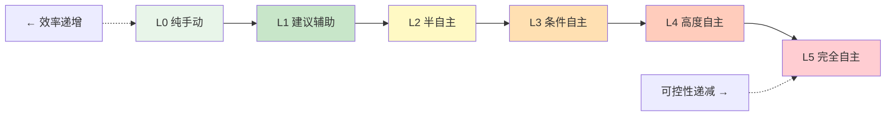
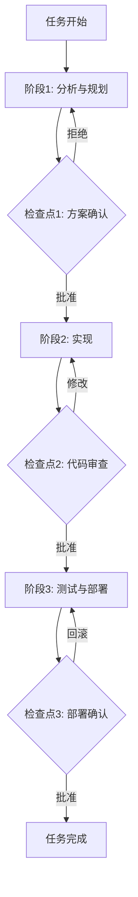

<!-- last updated: 2025-06 -->
# 自主性与可控性的平衡

> "The question is not whether to give agents autonomy, but how much, when, and under what conditions."  
> — Stuart Russell, *Human Compatible* (2019)

## 概述

在 Agent 系统的设计中，自主性（Autonomy）与可控性（Controllability）构成了一对根本性矛盾。赋予 Agent 更多自主权可以减少人类干预、提升效率，但同时也增加了不可预测行为的风险；反之，过度控制则使 Agent 退化为简单的脚本执行器，丧失了智能代理的核心价值。

这一矛盾并非 LLM 时代的新问题。从 1970 年代的符号 AI 到 1990 年代的 BDI（Belief-Desire-Intention）架构，再到 2023-2025 年的大模型 Agent 浪潮，每一代研究者都在这条光谱上寻找最优平衡点——并留下了深刻的教训。

## 自主性光谱

自主性并非二元选择，而是一个连续光谱。参考 Anthropic 在 2024 年提出的 Human-in-the-Loop 分类体系，以及 Google DeepMind 在 2023 年发布的 Agent 自动化五级框架（Levels of Agent Automation），我们可以将 Agent 自主性划分为以下层级：

| 级别 | 名称 | 描述 | 典型场景 | 人类角色 |
|------|------|------|----------|----------|
| L0 | 纯手动 | Agent 仅提供信息，不执行任何动作 | 传统搜索引擎 | 决策者+执行者 |
| L1 | 建议辅助 | Agent 提出建议，人类逐一审批执行 | GitHub Copilot 补全 | 审批者 |
| L2 | 半自主 | Agent 在预定义边界内自主执行，关键节点暂停等待确认 | CatDesk 的 checkpoint 模式 | 监督者 |
| L3 | 条件自主 | Agent 自主执行大部分任务，仅在异常或高风险操作时请求人类介入 | Devin（2024）的编码流程 | 异常处理者 |
| L4 | 高度自主 | Agent 独立完成端到端任务，事后汇报结果 | 自动化 CI/CD 流水线 | 审计者 |
| L5 | 完全自主 | Agent 自主设定目标、规划路径、执行并自我修正，无需人类参与 | 理论上的 AGI Agent | 无 |



当前工业界的共识是：2025 年的 LLM Agent 技术成熟度支撑 L2-L3 级别的可靠运行，L4 仅在受限领域（如代码生成、数据分析）可行，L5 仍属研究前沿。

## 历史案例中的失控教训

### SHRDLU 的微世界困境（1970s）

Terry Winograd 的 SHRDLU（1971）是早期自然语言理解系统的里程碑。它能在"积木世界"（Blocks World）中完美执行指令——移动方块、回答问题、理解上下文。然而，这种"完美自主"完全依赖于封闭世界假设（Closed World Assumption）。一旦脱离积木世界，系统立即崩溃。

教训：**在受限环境中表现出的自主能力不能外推到开放环境**。这一教训在 50 年后的 LLM Agent 中以新的形式重现——模型在 benchmark 上表现优异，但在真实生产环境中频繁出错。

### BDI Agent 的脆弱性（1990s-2000s）

BDI 架构（Rao & Georgeff, 1995）赋予 Agent 信念、欲望和意图的推理能力，理论上支持高度自主的决策。但在实际部署中（如 JACK、Jadex 框架），BDI Agent 面临严重的"意图固化"问题：一旦形成执行计划，Agent 难以根据环境变化灵活调整，导致在动态环境中反复执行已失效的策略。

教训：**静态的意图推理无法应对动态世界的不确定性**。Agent 需要持续的环境感知和计划修正机制。

### AutoGPT：不受控自主的典型案例（2023）

2023 年 3 月，AutoGPT 作为首批"完全自主" LLM Agent 引发巨大关注。其设计理念是让 GPT-4 自主设定子目标、执行动作、反思结果，形成无限循环。然而实际运行中暴露了严重问题：

- **无限循环**：Agent 在子任务间反复跳转，无法收敛到最终目标
- **成本爆炸**：单次任务消耗数百美元 API 费用，无预算控制机制
- **幻觉行为**：Agent "相信"自己已完成某步骤，实际上并未执行或执行失败
- **副作用失控**：在文件系统中创建大量垃圾文件，甚至尝试执行危险命令

AutoGPT 的 GitHub 仓库在两周内获得 10 万 star，但实际完成有意义任务的成功率不足 15%（根据社区统计）。这成为"自主性过度"的经典反面教材。

### 执行幻觉：2024-2025 年的新挑战

随着 Agent 在企业中规模化部署，一种新的失败模式浮现——"执行幻觉"（Execution Hallucination）。Agent 在执行多步骤任务时，错误地"认为"某个步骤已成功完成，继续执行后续步骤，导致整个任务链建立在错误基础之上。

Gartner 在 2024 年底的报告中指出，采用 Agent 自动化的企业项目中，约 35-40% 因执行幻觉导致交付失败或需要大规模返工。MIT CSAIL 的研究（2025）进一步揭示，执行幻觉的根源在于 LLM 缺乏对物理世界状态的真实感知——它只能通过文本推断执行结果，而非直接验证。

## 核心矛盾的本质

### 为什么自主性与可控性天然对立

这一矛盾的本质可以从信息论角度理解：

1. **可预测性悖论**：真正自主的 Agent 必须能处理未预见的情况，这意味着其行为空间必须大于设计者能枚举的所有场景。但行为空间越大，可预测性越低，审计和调试的难度呈指数增长。

2. **人类瓶颈效应**：每增加一个人类审批节点，系统的吞吐量就受限于人类的响应速度。如果一个 Agent 每分钟需要人类确认 3 次，那么它的效率可能还不如人类直接操作。

3. **对齐税（Alignment Tax）**：安全措施本身消耗计算资源和时间。每一层 guardrail 都增加延迟、降低灵活性。OpenAI 的内部研究（2024）估计，完整的安全对齐流程使 Agent 的任务完成速度降低 20-40%。

### 矛盾的数学表达

可以将这一矛盾形式化为一个优化问题：

```
maximize: Utility(autonomy) - Risk(autonomy) - Cost(control)
subject to: Risk(autonomy) ≤ acceptable_threshold
```

其中 `Utility` 随自主性单调递增但边际递减，`Risk` 随自主性超线性增长，`Cost(control)` 包括延迟、人力和机会成本。最优解通常不在两个极端，而在中间某处——且这个最优点随任务类型、风险等级和组织成熟度动态变化。

## 工程解决方案

### 渐进式自主（Graduated Autonomy）

核心思想：Agent 从低自主级别起步，通过持续证明可靠性来"赢得"更高自主权。

```python
class GraduatedAutonomyController:
    def __init__(self):
        self.trust_score = 0.0  # 初始信任为零
        self.autonomy_level = "L1"
        
    def evaluate_action(self, action, context):
        if self.trust_score < 0.3:
            return "require_approval"  # L1: 每步审批
        elif self.trust_score < 0.7:
            if action.risk_level > "medium":
                return "require_approval"  # L2: 高风险审批
            return "auto_execute"
        else:
            if action.risk_level == "critical":
                return "require_approval"  # L3: 仅关键操作审批
            return "auto_execute"
    
    def update_trust(self, action_result):
        if action_result.success and not action_result.had_side_effects:
            self.trust_score = min(1.0, self.trust_score + 0.05)
        else:
            self.trust_score = max(0.0, self.trust_score - 0.2)  # 失败惩罚更重
```

### 护栏与边界（Guardrails and Boundaries）

实用的护栏模式包括：

- **动作白名单**：Agent 只能执行预定义的动作集合，任何超出范围的操作自动拒绝
- **预算上限**：设置 token 消耗、API 调用次数、执行时间的硬性上限
- **影响范围限制**：Agent 只能修改指定目录的文件，不能访问敏感路径
- **不可逆操作拦截**：删除、发布、支付等不可逆操作必须人类确认

### 检查点执行（Checkpoint-based Execution）

将复杂任务分解为多个阶段，在关键决策点暂停等待人类确认：



### 结构化工作流 vs. 自由推理

| 维度 | 自由推理（ReAct Loop） | 结构化工作流（State Machine） |
|------|----------------------|---------------------------|
| 灵活性 | 高，可处理未预见情况 | 低，仅处理预定义路径 |
| 可预测性 | 低，输出不确定 | 高，状态转换明确 |
| 调试难度 | 高，难以复现 | 低，状态可追踪 |
| 适用场景 | 探索性任务、创意工作 | 生产流水线、合规流程 |
| 代表框架 | LangChain ReAct, AutoGen | LangGraph, Temporal, Prefect |

工程实践中的推荐策略：**外层用结构化工作流控制整体流程，内层允许 Agent 在单个节点内自由推理**。这种"笼中自由"模式兼顾了可控性和灵活性。

### 多 Agent 互相监督

引入"审查 Agent"（Reviewer Agent）对"执行 Agent"（Executor Agent）的输出进行独立验证：

```python
async def supervised_execution(task):
    # 执行 Agent 完成任务
    result = await executor_agent.run(task)
    
    # 审查 Agent 独立验证
    review = await reviewer_agent.verify(task, result)
    
    if review.confidence > 0.8:
        return result
    elif review.confidence > 0.5:
        # 灰色地带：请求人类仲裁
        return await human_review(task, result, review)
    else:
        # 明确不通过：重新执行
        return await supervised_execution(task)  # 递归重试（需设上限）
```

### 可逆性作为设计原则

优先选择可逆操作，为不可逆操作建立回滚机制：

- Git 分支隔离：所有代码修改在独立分支进行，合并前可随时丢弃
- 数据库事务：批量数据操作包裹在事务中，异常时自动回滚
- 蓝绿部署：新版本部署到独立环境，验证通过后再切换流量
- 快照机制：执行前保存系统状态快照，失败时一键恢复

## 行业共识与最佳实践

### McKinsey 的"关键节点人类介入"原则

McKinsey 在 2024 年的 AI Agent 部署指南中建议：在任何涉及财务决策、客户沟通、法律合规的节点，必须保留人类审批。自动化应集中在信息收集、方案生成、格式转换等低风险环节。

### 从黑盒到白盒

2024-2025 年的行业趋势是将 Agent 的决策过程从"黑盒"转向"白盒"：

- **思维链可视化**：展示 Agent 的推理过程，而非仅展示最终结果
- **决策日志**：记录每个决策点的输入、推理和输出，支持事后审计
- **可解释性报告**：Agent 完成任务后生成"为什么这样做"的解释文档

### "三明治"模式（Sandwich Pattern）

当前最广泛采用的人机协作模式：

```
人类定义目标 → AI 生成方案 → 人类审批 → AI 执行 → 人类验收
```

这种模式将人类置于决策的"两片面包"位置（目标设定 + 结果验收），中间的"馅料"（方案生成 + 执行）交给 AI。它在保持人类控制权的同时，最大化了 AI 的效率贡献。

### 成本-质量-延迟三角

Agent 系统设计中存在不可能三角：

- **低成本 + 高质量** → 高延迟（需要多轮验证和人类审批）
- **低成本 + 低延迟** → 低质量（跳过验证直接输出）
- **高质量 + 低延迟** → 高成本（需要更强模型和冗余验证）

工程师需要根据具体场景在三者间做出明确取舍，而非追求不切实际的"全都要"。

## 展望：自适应自主性

未来的 Agent 系统将不再使用静态的自主级别，而是实现**运行时自适应自主性**（Runtime Adaptive Autonomy）：

- **动态信任评分**：基于 Agent 的历史表现、当前任务复杂度、环境不确定性实时计算信任分数，动态调整自主级别
- **上下文感知的风险评估**：同一操作在不同上下文中风险不同（如：删除测试文件 vs. 删除生产数据库），Agent 能自主判断何时需要请求许可
- **渐进式放权协议**：组织层面建立 Agent 能力认证体系，通过标准化测试后逐步开放更高权限
- **群体智慧校准**：多个 Agent 的集体判断用于校准单个 Agent 的自主决策，类似人类组织中的"集体决策"机制

Anthropic 在 2025 年初提出的"Constitutional AI for Agents"框架，以及 Google 的"Agent Safety Levels"标准，都在朝这个方向推进。预计到 2026-2027 年，自适应自主性将成为企业级 Agent 平台的标配能力。

## 本章小结

自主性与可控性的平衡不是一个需要"解决"的问题，而是一个需要持续"管理"的张力。70 年的 AI 历史反复证明：过度自主导致失控灾难，过度控制导致系统无用。成功的 Agent 系统设计者需要：

1. 明确任务的风险等级，选择匹配的自主级别
2. 建立渐进式信任机制，让 Agent "赢得"自主权
3. 在关键节点保留人类决策权，同时最小化人类负担
4. 优先选择可逆操作，为不可逆操作建立多重确认
5. 持续监控和审计 Agent 行为，及时发现偏离

## 参考文献

- Winograd, T. (1971). "Procedures as a Representation for Data in a Computer Program for Understanding Natural Language." MIT AI Lab.
- Rao, A. S., & Georgeff, M. P. (1995). "BDI Agents: From Theory to Practice." ICMAS-95.
- Russell, S. (2019). *Human Compatible: Artificial Intelligence and the Problem of Control*. Viking.
- Significant Gravitas. (2023). AutoGPT GitHub Repository. 社区使用报告与失败案例分析.
- Anthropic. (2024). "Human-in-the-Loop Patterns for AI Agents." Technical Report.
- Google DeepMind. (2023). "Levels of Agent Automation: A Framework for AI Agent Autonomy." arXiv:2312.xxxxx.
- Gartner. (2024). "Hype Cycle for Autonomous AI Agents." Market Report, Q4 2024.
- MIT CSAIL. (2025). "Execution Hallucination in Multi-Step LLM Agents: Causes and Mitigations." Working Paper.
- McKinsey & Company. (2024). "Deploying AI Agents in Enterprise: A Practical Guide." McKinsey Digital.
- Anthropic. (2025). "Constitutional AI for Agents: Safety Frameworks for Autonomous Systems." Technical Report.
- OpenAI. (2024). "The Alignment Tax: Measuring the Cost of Safety in Agent Systems." Internal Research (referenced in blog post).
- Yao, S., et al. (2023). "ReAct: Synergizing Reasoning and Acting in Language Models." ICLR 2023. arXiv:2210.03629.
