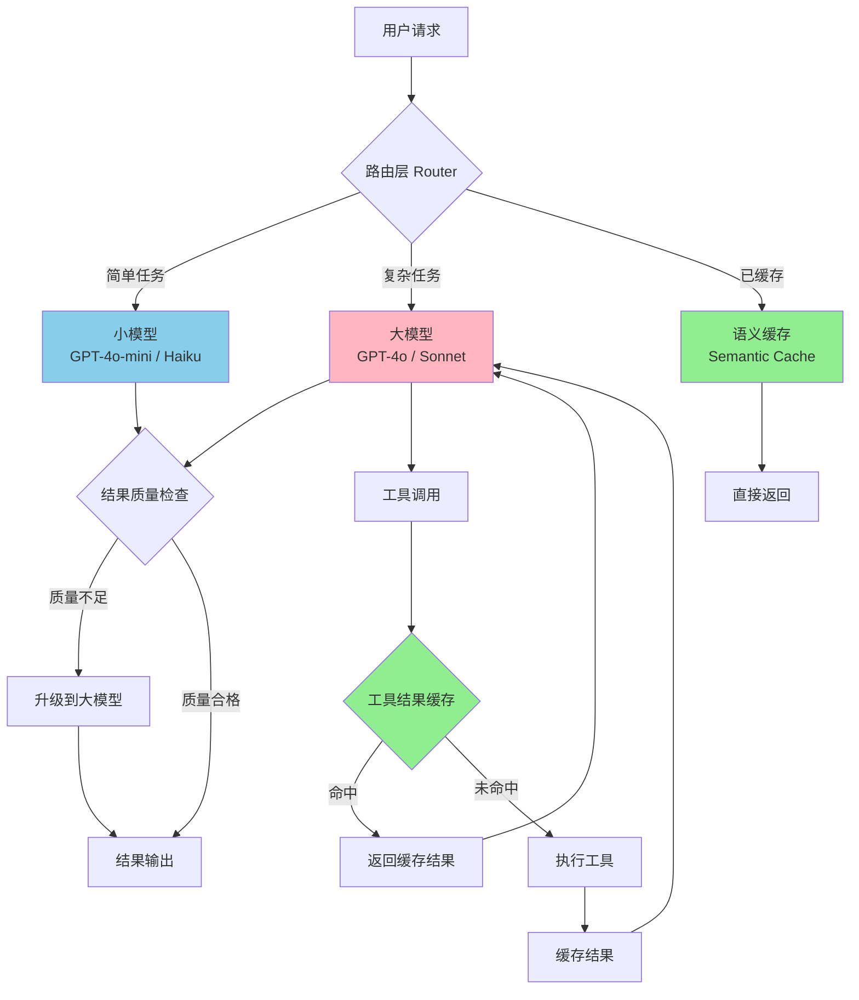

<!-- last updated: 2025-06 -->
# 成本与延迟的工程权衡

> "The most expensive token is the one that didn't need to be sent."  
> — 匿名 Agent 工程师

在 Agent 系统的工程实践中，开发者很快会发现一个残酷的现实：让 Agent 变得更聪明、更可靠的每一步努力，都在推高成本和延迟。本节系统分析 Agent 系统中成本与延迟的结构性矛盾，回顾历史教训，并给出经过验证的工程优化策略。

## 1. Agent 的"不可能三角"

Agent 系统设计中存在一个类似分布式系统 CAP 定理的基本约束，我们称之为 Agent 的"不可能三角"（Impossible Triangle）：

```
         质量 (Quality)
          /\
         /  \
        /    \
       / 选二  \
      /________\
  成本           延迟
 (Cost)       (Latency)
```

三个顶点分别代表：

- **质量**（Quality）：输出的准确性、完整性、可靠性
- **成本**（Cost）：Token 消耗、API 调用次数、计算资源
- **延迟**（Latency）：从请求到最终结果的端到端响应时间

核心权衡逻辑如下：

| 优化组合 | 牺牲项 | 典型场景 |
|----------|--------|----------|
| 高质量 + 低成本 | 延迟 | 批量离线任务，使用多轮 self-reflection 但不急于响应 |
| 高质量 + 低延迟 | 成本 | 实时编码助手，并行调用多个模型取最优 |
| 低成本 + 低延迟 | 质量 | 简单分类/路由任务，使用小模型单次推理 |

理解这个三角约束是所有优化工作的起点——你需要明确你的场景优先级，而不是试图同时满足三者。

## 2. 成本结构解析

### 2.1 Token 消费的不对称性

大模型 API 的定价结构存在输入/输出不对称（Input/Output Pricing Asymmetry）：

| 模型 | 输入价格 ($/1M tokens) | 输出价格 ($/1M tokens) | 输出/输入比 |
|------|----------------------|----------------------|------------|
| GPT-4 (2023-03) | $30.00 | $60.00 | 2x |
| GPT-4o (2024-05) | $5.00 | $15.00 | 3x |
| Claude 3.5 Sonnet (2024-06) | $3.00 | $15.00 | 5x |
| GPT-4o-mini (2024-07) | $0.15 | $0.60 | 4x |
| Claude 3.5 Haiku (2024-11) | $0.80 | $4.00 | 5x |
| DeepSeek-V3 (2025-01) | $0.27 | $1.10 | 4x |

这意味着：Agent 生成的冗长推理链条（Chain-of-Thought）比长 prompt 更贵。一个产生 2000 token 输出的 Agent 步骤，其输出成本可能是输入的等价物的 3-5 倍。

### 2.2 多轮放大效应

Agent 的核心特征是多步执行（Multi-step Execution），这带来了严重的成本放大：

```python
# 单次调用的成本模型
single_call_cost = (input_tokens * input_price) + (output_tokens * output_price)

# Agent 多轮调用的实际成本（上下文累积）
def agent_total_cost(steps, avg_input, avg_output, context_growth_rate=1.5):
    total = 0
    context = avg_input
    for step in range(steps):
        step_cost = (context * input_price) + (avg_output * output_price)
        total += step_cost
        context += avg_output * context_growth_rate  # 上下文逐步增长
    return total
```

实际测量数据表明，一个 10 步 Agent 任务的 token 消耗通常是等价单次调用的 **10-50 倍**，而非直觉中的 10 倍。这是因为每一步都需要携带之前的上下文（Context Window Tax），导致成本呈超线性增长。

### 2.3 工具调用开销

每次工具调用（Tool Call）引入的额外成本包括：

- **序列化开销**：工具描述（schema）占用 input tokens，通常 500-2000 tokens/tool
- **往返延迟**：网络 RTT + 工具执行时间，典型值 200ms-5s
- **结果注入**：工具返回值注入上下文，进一步膨胀后续步骤的输入
- **错误重试**：工具调用失败后的重试消耗（实测约 15-30% 的工具调用需要重试）

### 2.4 隐性成本

常被忽视的成本来源包括：

- **重试与错误恢复**：模型产生格式错误的输出、幻觉工具名、参数类型不匹配
- **冗余上下文**：将完整对话历史每轮发送，其中大部分与当前步骤无关
- **防御性 prompting**：为防止各种边界情况添加的冗长指令
- **观察性开销**：日志记录、trace 数据的存储与传输

### 2.5 真实成本数据

基于 2025 年初的行业观测数据：

| Agent 类型 | 典型任务成本 | Token 消耗 | 步骤数 |
|-----------|------------|-----------|--------|
| 编码助手（单文件修改） | $0.05-0.30 | 10K-50K | 3-8 |
| 编码 Agent（跨文件重构） | $0.50-5.00 | 100K-1M | 10-50 |
| 研究 Agent（深度报告） | $1.00-20.00 | 200K-5M | 20-100+ |
| 数据分析 Agent | $0.20-2.00 | 50K-500K | 5-30 |
| 客服对话 Agent（单次会话） | $0.01-0.10 | 2K-20K | 3-10 |

## 3. 历史教训：成本失控案例

### 3.1 AutoGPT 的"自主烧钱"（2023）

AutoGPT 于 2023 年 3 月开源后迅速获得 10 万+ GitHub stars，但随之而来的是大量用户报告惊人的 API 账单：

- 用户在 Reddit 报告一夜之间产生 $50-100 的 OpenAI 账单，而 Agent 实际上陷入了无限循环
- 核心问题：缺乏终止条件（Termination Condition）和预算上限（Budget Cap）
- Agent 在"思考如何思考"的元认知循环中消耗了大量 token 却无实质进展
- 教训：**自主性（Autonomy）必须配合约束机制**，无限制的自主 Agent 是成本黑洞

### 3.2 早期 Devin 定价争议（2024）

Cognition Labs 的 Devin 以 $500/月的定价推出，且限制了每月可执行的任务数量：

- 按每月约 100 个任务计算，单任务成本约 $5，看似合理
- 但用户发现复杂任务可能消耗多个"任务配额"，实际单位成本远超预期
- 这反映了 Agent 产品定价的核心难题：**任务复杂度方差极大**，固定定价模式难以覆盖

### 3.3 企业 Chatbot 部署的成本超支

多个企业在 2023-2024 年部署 LLM 客服系统时遭遇成本失控：

- 某金融机构预计月成本 $10K，实际产生 $100K+（10 倍超支）
- 根本原因：用户对话轮次远超预期（平均 15 轮 vs 预估 5 轮），且每轮携带完整历史
- 解决方案：引入对话摘要（Conversation Summarization）后成本降至原来的 30%

### 3.4 "上下文窗口税"

最普遍的成本陷阱是将完整对话历史作为每次请求的输入：

```
第 1 轮：input = system_prompt (1000 tokens)
第 5 轮：input = system_prompt + 4轮历史 (5000 tokens)  
第 10 轮：input = system_prompt + 9轮历史 (12000 tokens)
第 20 轮：input = system_prompt + 19轮历史 (30000 tokens)
```

这种 O(n²) 的 token 消耗增长模式，是绝大多数 Agent 成本问题的根源。

## 4. 延迟的用户体验影响

### 4.1 延迟感知阈值

用户体验研究给出的延迟感知分级：

| 延迟范围 | 用户感知 | 适用场景 |
|---------|---------|---------|
| < 100ms | 即时响应 | 自动补全、输入提示 |
| 100ms-1s | 流畅 | 对话式交互，单步操作 |
| 1-3s | 可接受 | 工具调用结果返回 |
| 3-10s | 感到等待 | 需要进度指示器 |
| 10s-1min | 需要解释 | 复杂计算，需要明确告知"正在处理" |
| > 1min | 后台任务 | 需要异步通知机制 |

Jakob Nielsen 在 1993 年提出的响应时间研究至今仍适用：超过 10 秒，用户开始转移注意力。但 Agent 场景有一个重要区别——**如果用户能看到 Agent 正在"做事"（而非空转），容忍度大幅提升**。

### 4.2 流式输出与进度反馈

流式输出（Streaming）是解决延迟感知问题的关键技术：

- **Token 级流式**：逐 token 显示推理过程，适用于文本生成
- **步骤级进度**：显示"正在搜索文件... 正在分析代码... 正在生成修改方案..."
- **中间产物展示**：在最终结果出来前，展示已完成的子任务成果

实测数据表明，相同的 30 秒总延迟：
- 无进度反馈：60% 用户认为"出了问题"
- 有步骤进度：仅 5% 用户表达不满

### 4.3 思考时间 vs. 空闲时间

用户对延迟的容忍度高度依赖于对"Agent 在做什么"的理解：

- **感知为"思考"**：用户看到 Agent 在分析、推理、执行操作 → 高容忍度
- **感知为"卡住"**：无输出、无进度、无解释 → 极低容忍度

这解释了为什么 ChatGPT 的"typing indicator" 和 Cursor 的实时代码流动对用户满意度如此关键。

## 5. 工程优化策略

### 5.1 架构级优化

以下 Mermaid 图展示了一个成本优化的 Agent 架构：



### 5.2 具体优化技术

#### Prompt 压缩（Prompt Compression）

```python
# 反模式：发送完整历史
messages = system_prompt + all_previous_messages  # O(n²) 增长

# 正确做法：滑动窗口 + 摘要
def compress_context(messages, max_tokens=4000):
    recent = messages[-3:]  # 保留最近 3 轮
    if token_count(messages) > max_tokens:
        old_messages = messages[:-3]
        summary = summarize(old_messages)  # 用小模型生成摘要
        return [summary_message(summary)] + recent
    return messages
```

#### 模型路由（Model Routing）

根据任务复杂度动态选择模型：

```python
def route_to_model(task):
    complexity = estimate_complexity(task)  # 基于关键词/历史数据
    if complexity < 0.3:
        return "gpt-4o-mini"      # $0.15/$0.60 per 1M tokens
    elif complexity < 0.7:
        return "claude-3.5-haiku"  # $0.80/$4.00 per 1M tokens
    else:
        return "claude-3.5-sonnet" # $3.00/$15.00 per 1M tokens
```

实测表明，70-80% 的 Agent 子任务（如格式解析、简单分类、参数提取）可以由小模型胜任，仅 20-30% 需要大模型。这一策略可降低 50-70% 的总成本。

#### 语义缓存（Semantic Cache）

```python
import numpy as np
from functools import lru_cache

class SemanticCache:
    def __init__(self, similarity_threshold=0.95):
        self.cache = {}  # embedding -> response
        self.threshold = similarity_threshold
    
    def get(self, query_embedding):
        for cached_emb, response in self.cache.items():
            similarity = cosine_similarity(query_embedding, cached_emb)
            if similarity > self.threshold:
                return response  # 缓存命中
        return None  # 缓存未命中
    
    def set(self, query_embedding, response):
        self.cache[tuple(query_embedding)] = response
```

#### 并行执行（Parallel Execution）

```python
import asyncio

async def parallel_tool_calls(independent_calls):
    """并行执行无依赖关系的工具调用"""
    tasks = [execute_tool(call) for call in independent_calls]
    results = await asyncio.gather(*tasks)
    return results

# 示例：同时搜索多个文件，而非串行
calls = [
    search_file("src/auth.py"),
    search_file("src/config.py"),
    search_file("tests/test_auth.py")
]
results = await parallel_tool_calls(calls)  # 延迟 = max(单个) 而非 sum(所有)
```

#### Token 预算控制（Token Budget）

```python
class TokenBudget:
    def __init__(self, per_step_limit=5000, total_limit=50000):
        self.per_step = per_step_limit
        self.total = total_limit
        self.consumed = 0
    
    def check(self, estimated_tokens):
        if estimated_tokens > self.per_step:
            raise StepBudgetExceeded(f"单步预计 {estimated_tokens} tokens，超出限制 {self.per_step}")
        if self.consumed + estimated_tokens > self.total:
            raise TotalBudgetExceeded(f"总预算即将耗尽：已用 {self.consumed}/{self.total}")
        return True
    
    def record(self, actual_tokens):
        self.consumed += actual_tokens
```

#### 提前终止（Early Termination）

```python
def should_terminate(state):
    """检测任务是否已完成，避免不必要的额外步骤"""
    if state.goal_achieved:
        return True
    if state.steps_without_progress > 3:  # 连续 3 步无进展
        return True
    if state.confidence > 0.95:  # 置信度已足够高
        return True
    return False
```

## 6. 成本监控与治理

### 6.1 可观测性框架

有效的成本治理需要细粒度的可观测性：

```python
# 每步成本追踪
@trace_cost
def agent_step(step_id, model, input_tokens, output_tokens):
    cost = calculate_cost(model, input_tokens, output_tokens)
    metrics.record({
        "step_id": step_id,
        "model": model,
        "input_tokens": input_tokens,
        "output_tokens": output_tokens,
        "cost_usd": cost,
        "latency_ms": elapsed_ms,
        "tool_calls": tool_call_count
    })
    return cost
```

### 6.2 预算熔断器（Circuit Breaker）

```python
class CostCircuitBreaker:
    def __init__(self, warning_threshold=5.0, hard_limit=20.0):
        self.warning = warning_threshold  # 告警阈值（美元）
        self.limit = hard_limit           # 硬性上限
    
    def check(self, current_cost):
        if current_cost > self.limit:
            raise CostLimitExceeded("任务成本超出硬性上限，强制终止")
        if current_cost > self.warning:
            logger.warning(f"成本告警：当前 ${current_cost:.2f}，接近上限 ${self.limit:.2f}")
```

### 6.3 ROI 计算

Agent 成本的合理性取决于其替代的人力成本：

| 任务类型 | Agent 成本 | 人力成本（按 $50/h） | ROI |
|---------|-----------|-------------------|-----|
| 代码审查（单 PR） | $0.50 | $25 (30min) | 50x |
| 文档生成 | $2.00 | $100 (2h) | 50x |
| 数据分析报告 | $5.00 | $200 (4h) | 40x |
| 复杂重构 | $10.00 | $400 (8h) | 40x |
| 研究综述 | $15.00 | $500 (10h) | 33x |

即便在当前成本水平下，大多数 Agent 任务的 ROI 仍然极为可观。核心问题不是"Agent 是否值得"，而是"如何避免成本不可预测地爆炸"。

## 7. 趋势与展望

### 7.1 模型价格的摩尔定律

自 2023 年以来，模型推理成本呈指数级下降：

| 时间 | 模型 | 百万 token 价格 | 相对成本 |
|------|------|---------------|---------|
| 2023-03 | GPT-4 | $30/$60 | 100% (基准) |
| 2024-05 | GPT-4o | $5/$15 | 17% |
| 2024-07 | GPT-4o-mini | $0.15/$0.60 | 0.5% |
| 2025-01 | DeepSeek-V3 | $0.27/$1.10 | 0.9% |
| 2025-02 | Gemini 2.0 Flash | $0.10/$0.40 | 0.3% |

在不到两年时间内，同等能力的推理成本下降了 **100-300 倍**。这一趋势仍在继续。

### 7.2 专用小模型

越来越多的实践表明，针对特定子任务训练或微调的小模型可以在该任务上媲美通用大模型：

- **路由判断**：1B 参数模型即可实现 95%+ 的路由准确率
- **格式解析**：小模型处理 JSON/XML 提取比大模型更快且同样准确
- **意图分类**：fine-tuned 小模型在窄领域超越通用大模型

### 7.3 蒸馏（Distillation）

用大模型 Agent 的执行轨迹训练小模型，是降低生产成本的关键路径：

1. 收集大模型 Agent 成功完成任务的完整 trace
2. 将 trace 转化为训练数据（input → ideal output）
3. fine-tune 小模型复现大模型行为
4. 在验证集上确认质量无显著下降后，替换生产环境模型

OpenAI 的研究（2024）表明，经过蒸馏的 GPT-4o-mini 在特定任务上可以达到 GPT-4 原始表现的 90%+，而成本仅为其 3%。

### 7.4 端侧推理（Edge Inference）

对于延迟敏感的子任务，将推理移至终端设备是一个正在兴起的方向：

- Apple Intelligence（2024）展示了端侧小模型 + 云端大模型的混合架构
- 简单的意图识别、格式校验、参数提取等步骤可在设备端完成（<10ms 延迟）
- 仅将真正需要大模型能力的步骤发送到云端

## 小结

成本与延迟的工程权衡是 Agent 系统从原型到生产的核心挑战。历史教训告诉我们：不设约束的自主 Agent 必然导致成本爆炸；而过度压缩成本又会牺牲用户体验和任务质量。成功的 Agent 系统需要在"不可能三角"中找到适合自身场景的平衡点，并通过模型路由、语义缓存、Token 预算、熔断机制等工程手段实现精细化的成本治理。

好消息是，随着模型价格以每年 10 倍的速度下降，今天看似昂贵的 Agent 方案在一两年后将变得平易近人。工程师的任务是：在成本降低之前，用架构智慧弥补算力的不足。

## 参考文献

1. Nielsen, J. (1993). "Response Times: The 3 Important Limits." Nielsen Norman Group.
2. Significant Gravitas. (2023). "AutoGPT - An Autonomous GPT-4 Experiment." GitHub. https://github.com/Significant-Gravitas/AutoGPT
3. OpenAI. (2024). "GPT-4o mini: advancing cost-efficient intelligence." OpenAI Blog, 2024-07-18.
4. Anthropic. (2024). "Claude 3.5 Sonnet Model Card." Anthropic, 2024-06-20.
5. DeepSeek. (2025). "DeepSeek-V3 Technical Report." arXiv:2412.19437.
6. Cognition Labs. (2024). "Introducing Devin." https://www.cognition.ai/blog/introducing-devin
7. Chen, L. et al. (2023). "FrugalGPT: How to Use Large Language Models While Reducing Cost and Improving Performance." arXiv:2305.05176.
8. Xu, C. et al. (2024). "Knowledge Distillation of Large Language Models." arXiv:2306.08543.
9. Apple. (2024). "Apple Intelligence Foundation Language Models." Apple Machine Learning Research, 2024-06.
10. Zhu, B. et al. (2024). "RouteLLM: Learning to Route LLMs with Preference Data." arXiv:2406.18665.
11. Bang, J. et al. (2023). "GPTCache: An Open-Source Semantic Cache for LLM Applications." arXiv:2311.07972.
12. Wang, L. et al. (2024). "A Survey on Large Language Model based Autonomous Agents." Frontiers of Computer Science, 18(6).
