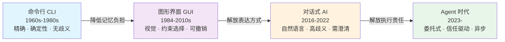
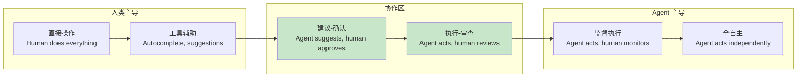

<!-- last updated: 2025-06 -->
# 人机交互模式的演进

> 从命令行到对话式代理，人与计算系统的交互方式经历了根本性变革。每一次范式跃迁都伴随着信任模型的重构、失败模式的突变，以及对"谁在掌控"这一核心问题的重新回答。本节从历史视角梳理这些演进，提取可指导 Agent 设计的经验教训。

## 1. 从命令行到对话：交互范式的变迁

### 1.1 四代交互范式

人机交互的发展可以划分为四个明确阶段，每一阶段都改变了用户的心智模型（Mental Model）和系统的失败特征：

**命令行时代（CLI Era, 1960s-1980s）**：用户必须精确知道命令语法，系统行为完全确定。`rm -rf /` 不会询问"你确定吗？"——它假定用户知道自己在做什么。这一时期的失败模式是"用户犯错"，系统本身无歧义。

**图形界面时代（GUI Era, 1984-2010s）**：Apple Macintosh 和 Windows 引入了视觉隐喻——文件夹、回收站、拖拽。交互从"记忆命令"变为"识别选项"。关键创新是**渐进式披露**（Progressive Disclosure）：只展示当前语境下相关的操作。失败模式变为"选错了选项"，但至少有 Undo。

**对话式 AI 时代（Conversational AI, 2016-2022）**：Siri、Alexa、ChatGPT 让自然语言成为输入方式。歧义性陡然上升——"帮我订个餐厅"可以有无数种解释。系统需要主动澄清（Clarification），失败模式变为"误解用户意图"。

**Agent 时代（Agentic Era, 2023-）**：用户不再逐步指导，而是委托（Delegate）整个任务。"帮我把这个 PR 的所有 lint 错误修好"意味着 Agent 需要自主规划、执行、验证。失败模式演变为"自主行为偏离预期"——更隐蔽，也更危险。

### 1.2 交互范式演进图



### 1.3 关键转变

每次范式跃迁的核心差异在于**控制权的转移方向**：

| 维度 | CLI | GUI | 对话式 AI | Agent |
|------|-----|-----|-----------|-------|
| 用户角色 | 操作者 | 选择者 | 指导者 | 委托人 |
| 系统角色 | 执行器 | 向导 | 对话者 | 代理人 |
| 歧义处理 | 报错退出 | 灰色禁用 | 主动提问 | 自主推理 |
| 失败模式 | 用户语法错 | 选错选项 | 意图误解 | 行为偏离 |
| 可逆性 | 低（无内建 undo） | 高（Ctrl+Z） | 中（重新对话） | 视情况（可能已执行外部动作） |
| 信任需求 | 低（可预测） | 低-中 | 中 | 高（必须信任自主决策） |

## 2. 信任的建立与崩塌

### 2.1 自动化信任理论

Lee & See (2004) 在经典综述《Trust in Automation》中提出了信任校准（Trust Calibration）框架：当用户对系统能力的信任与系统实际能力匹配时，交互最有效。两种失配都有害：

- **过度信任（Over-trust）**：用户将超出系统能力的任务委托给它，导致严重失败
- **信任不足（Under-trust）**：用户拒绝使用实际可靠的功能，浪费系统能力

### 2.2 Agent 能力的"恐怖谷"

一个反直觉的现象是：**90% 的准确率有时比 60% 更危险**。当系统大多数时候正确时，用户会降低警惕（Vigilance Decrement），形成"它一般都对"的心理预设。此时那 10% 的错误因不可预测而造成更大伤害。

这类似于机器人领域的"恐怖谷效应"（Uncanny Valley）——接近但不完美比明显不完美更令人不安。在 Agent 语境中：

```
信任风险 = f(能力水平, 失败可预测性)

- 能力 60% + 失败可预测 → 用户保持警惕，风险可控
- 能力 90% + 失败随机 → 用户放松警惕，灾难性失败
- 能力 99% + 失败可预测 → 理想状态，用户知道何时需要介入
```

### 2.3 信任恢复的困难

实证研究表明信任的建立和崩塌存在严重不对称性。Dzindolet et al. (2003) 发现，自动化系统犯一次错误后，用户需要经历多次正确表现才能恢复到之前的信任水平。在 Agent 场景中，这意味着：

- 一次严重的自主行为失误（如 Agent 错误删除了用户文件）可能导致用户完全放弃使用该 Agent
- 信任恢复策略必须是主动的：道歉 + 解释原因 + 展示改进措施 + 渐进恢复权限

### 2.4 透明度作为信任机制

Mercado et al. (2016) 的研究表明，展示推理过程（Reasoning Transparency）能显著提高用户对自动化系统的信任校准。在 Agent 设计中：

```python
# 不好的做法：黑盒执行
def refactor_code(file_path):
    # Agent 直接修改文件，用户只看到最终结果
    result = agent.execute(f"refactor {file_path}")
    return result

# 好的做法：透明推理
def refactor_code(file_path):
    # Step 1: 展示分析
    analysis = agent.analyze(file_path)
    print(f"发现 {len(analysis.issues)} 个可优化点：")
    for issue in analysis.issues:
        print(f"  - {issue.description} (置信度: {issue.confidence:.0%})")
    
    # Step 2: 展示计划
    plan = agent.plan_refactoring(analysis)
    print(f"\n建议的修改方案：")
    print(plan.diff_preview)
    
    # Step 3: 请求确认
    if user_confirms(plan):
        return agent.apply(plan)
```

## 3. 历史教训：过度自动化的代价

### 3.1 航空领域：技能退化与模式混淆

航空业提供了自动化失败最深刻的案例集：

**技能退化（Skill Degradation）**：FAA 在 2013 年的报告中指出，飞行员因过度依赖自动驾驶系统，手动飞行技能显著下降。法航 447 事故（2009）的调查表明，当自动化系统因传感器故障脱离时，飞行员无法正确执行手动操作。

**模式混淆（Mode Confusion）**：现代飞机自动驾驶系统有数十种模式。飞行员有时不清楚系统处于哪种模式，导致预期行为与实际行为不符。这直接映射到 Agent 场景——当 Agent 有多种"工作模式"时，用户可能不清楚它当前的行为逻辑。

### 3.2 特斯拉 Autopilot：命名即承诺

特斯拉将辅助驾驶系统命名为"Autopilot"和"Full Self-Driving"，暗示了远超实际能力的自主性。NTSB 多次调查（2016-2023）发现，用户基于名称形成了过高期待，在系统未设计处理的场景中放松了注意力。

**教训**：系统名称和营销语言直接塑造用户的信任校准。Agent 产品命名应保守而非激进。

### 3.3 早期聊天机器人：过度信任有害建议

2023 年初，多起事件揭示了 LLM 聊天机器人的信任风险：

- 某航空公司的客服机器人承诺了不存在的退票政策，法院判决公司需兑现（Air Canada, 2024）
- 用户向心理健康聊天机器人寻求建议，获得了不适当的回应

### 3.4 Agent 时代特有的问题

Agent 引入了一种新型风险——"它看起来很自信，所以我没有检查"（The Confidence Trap）。当 Agent 以流畅、自信的语言输出结果时，用户天然倾向于相信其正确性，即使内容存在事实错误或逻辑缺陷。

```
传统软件失败: 崩溃 / 报错 → 用户知道出了问题
Agent 失败: 生成看似合理但错误的输出 → 用户可能永远不知道
```

这是根本性的变化：**失败从"显式"变为"隐式"**。

## 4. 交互模式分类学

### 4.1 四维度分类框架

| 维度 | 模式 A | 模式 B | Agent 时代典型 |
|------|--------|--------|----------------|
| 时间性 | 同步（实时对话） | 异步（后台执行） | 混合：启动同步，执行异步 |
| 操作方式 | 直接操作（用户执行） | 委托（Agent 执行） | 渐进委托 |
| 控制模型 | 监督式（人监控 Agent） | 协作式（双方合作） | 视任务复杂度切换 |
| 权责分配 | 人类全责 | 共担责任 | 模糊地带（待规范） |

### 4.2 "驾驶座"模型

最被广泛接受的 Agent 交互隐喻是"人在驾驶座"（Human in the Driver's Seat）：

- **人类是方向盘**：决定目标和方向
- **Agent 是引擎**：提供动力和加速
- **护栏是约束系统**：防止偏离安全区域
- **仪表盘是状态通信**：让人类了解系统状态

这一模型的核心洞察是：即使 Agent 完成了大部分"工作"，人类仍需保持对方向的把控感。一旦人类感到"我不知道它在做什么"或"我无法停止它"，信任就会崩溃。

### 4.3 干预光谱



当前最成功的 Agent 产品大多位于"协作区"——Agent 提供建议或先执行再让人审查。完全自主的模式仅适用于低风险、可逆的任务。

## 5. 设计原则

从历史失败中提取的六条核心设计原则：

### 5.1 渐进式披露能力

不要一开始就展示 Agent 的全部能力。让用户在低风险场景中建立信任后，再逐步解锁更高自主性的功能。

```python
# 能力渐进解锁示例
class AgentCapabilityManager:
    LEVELS = {
        "beginner": ["suggest_edits", "answer_questions"],
        "intermediate": ["auto_fix_lint", "generate_tests"],
        "advanced": ["refactor_modules", "create_pr"],
        "expert": ["deploy_staging", "modify_infra"]
    }
    
    def get_available_actions(self, user_trust_level: str) -> list:
        """根据用户信任等级返回可用操作"""
        return self.LEVELS.get(user_trust_level, self.LEVELS["beginner"])
```

### 5.2 优雅升级到人类

Agent 必须知道自己能力的边界，并在必要时平滑地将控制权交还人类。关键在于交接时提供充分的上下文：

- 我尝试了什么
- 为什么失败了
- 我建议人类接下来做什么
- 相关的文件和状态信息

### 5.3 状态通信

Agent 在执行过程中应持续告知用户：

- **正在做什么**（"正在分析 15 个文件的依赖关系..."）
- **不确定什么**（"这个类的职责边界不太清晰，我按照 X 假设处理"）
- **预计还需多久**（"预计还需 3-5 分钟完成所有修改"）

### 5.4 撤销与回滚

每一个 Agent 的自主操作都应该是可逆的，或者在不可逆操作前要求明确确认：

| 操作类型 | 可逆性 | 设计策略 |
|----------|--------|----------|
| 修改本地文件 | 高 | 自动创建 git commit，可一键回滚 |
| 发送消息 | 不可逆 | 必须预览 + 确认 |
| 部署代码 | 部分可逆 | 展示 diff + 确认 + 保留回滚方案 |
| 删除数据 | 不可逆 | 二次确认 + 冷静期 |

### 5.5 期望管理

不承诺超出能力的事。具体做法包括：

- 明确说明局限性（"我无法保证生成的代码没有 bug"）
- 使用概率性语言而非确定性语言（"这大概率是正确的"而非"这是对的"）
- 在不确定时主动标记（"⚠️ 这部分我不太确定，建议你验证一下"）

### 5.6 反馈回路

让用户能够纠正 Agent 的行为，并且这种纠正能被学习：

```
用户纠正 → Agent 确认理解 → 更新行为偏好 → 后续行为改进
```

## 6. 最佳实践案例

### 6.1 GitHub Copilot：建议模型

Copilot 的核心交互设计决策是**永远只建议，从不自动执行**。用户看到灰色的内联建议，按 Tab 接受或忽略继续输入。这一模式成功的原因：

- 人类始终在控制循环中
- 接受建议是显式行为（需要按键）
- 拒绝建议是零成本的（只需继续输入）
- 不会打断用户的思考流

### 6.2 Cursor：Diff 审查模式

Cursor 在 Agent 模式下修改代码后，以 diff 形式展示变更，用户明确批准后才写入文件。这一设计解决了"Agent 改了什么"的透明度问题，让用户在接受前有完整的审查机会。

### 6.3 Claude Artifacts：交互式预览

Anthropic 的 Claude Artifacts 让用户在对话中即时预览生成的代码、文档或可视化效果，用户确认满意后再导出。这是"执行前预览"原则的优秀实现。

### 6.4 Linear/Notion AI：领域限定

这些工具将 AI 能力严格限定在特定领域内（项目管理、文档编辑），不试图"什么都能做"。明确的边界让用户形成准确的能力预期，避免了通用 Agent 常见的"期望落差"问题。

### 6.5 对比总结

| 产品 | 交互模式 | 人类控制点 | 信任建立方式 |
|------|----------|------------|-------------|
| GitHub Copilot | 建议-接受 | 每次补全 | 渐进体验 |
| Cursor | 执行-审查 | 每次文件修改 | Diff 可视化 |
| Claude Artifacts | 预览-确认 | 每次内容生成 | 实时预览 |
| Linear AI | 领域限定 | 功能边界 | 明确承诺 |
| Devin | 异步委托 | 计划审查点 | 过程透明 |

## 7. 未来方向

### 7.1 自适应界面

未来的 Agent 交互界面可能根据用户的信任水平和任务风险动态调整：

- 新用户或高风险操作：更多确认步骤、更详细的解释
- 老用户或低风险操作：减少打断、提高自主性
- 检测到用户犹豫或错误增多时：主动降低自主程度

### 7.2 多模态交互

Agent 交互正在突破纯文本限制：

- **语音 + 文本**：在编码时用语音给出高层指令，Agent 理解上下文后执行
- **视觉反馈**：通过屏幕标注、高亮、动画展示 Agent 正在"看"什么
- **混合输入**：用户可以圈选代码区域 + 语音描述意图

### 7.3 Agent 团队与人类"管理者"

随着多 Agent 协作系统（Multi-Agent Systems）的成熟，人类的角色可能从"操作员"进一步演变为"管理者"：

- 人类制定目标和约束
- 一个"主管 Agent"负责任务分解和分配
- 多个"执行 Agent"并行工作
- 人类在关键节点审查和决策

这一模型的核心挑战是：如何在不直接操作的情况下保持对整体方向的掌控，同时不成为瓶颈。

### 7.4 交互标准化

目前 Agent 交互缺乏统一标准。未来可能出现的标准化方向包括：

- Agent 能力声明格式（类似 API Schema）
- 统一的权限授予和撤回协议
- 标准化的状态通信格式
- 跨 Agent 的交互历史可移植性

## 参考文献

1. Lee, J. D., & See, K. A. (2004). Trust in automation: Designing for appropriate reliance. *Human Factors*, 46(1), 50-80.
2. Dzindolet, M. T., Peterson, S. A., Pomranky, R. A., Pierce, L. G., & Beck, H. P. (2003). The role of trust in automation reliance. *International Journal of Human-Computer Studies*, 58(6), 697-718.
3. Mercado, J. E., Rupp, M. A., Chen, J. Y., Barnes, M. J., Barber, D., & Proctor, K. (2016). Intelligent agent transparency in human-agent teaming for multi-UxV management. *Human Factors*, 58(3), 401-415.
4. Parasuraman, R., & Riley, V. (1997). Humans and automation: Use, misuse, disuse, abuse. *Human Factors*, 39(2), 230-253.
5. FAA (2013). *Operational Use of Flight Path Management Systems*. Federal Aviation Administration.
6. NTSB (2020). *Collision Between a Sport Utility Vehicle Operating with Partial Driving Automation and a Crash Attenuator*. National Transportation Safety Board.
7. Amershi, S., Weld, D., Vorvoreanu, M., et al. (2019). Guidelines for human-AI interaction. *Proceedings of the 2019 CHI Conference on Human Factors in Computing Systems*.
8. Bansal, G., Nushi, B., Kamar, E., Weld, D., Lasecki, W., & Horvitz, E. (2019). Updates in human-AI teams: Understanding and addressing the performance/compatibility tradeoff. *Proceedings of AAAI 2019*.
9. Shneiderman, B. (2022). *Human-Centered AI*. Oxford University Press.
10. Air Canada v. Moffatt (2024). Civil Resolution Tribunal, British Columbia, Canada.
11. Yang, Q., Steinfeld, A., Rosé, C., & Zimmerman, J. (2020). Re-examining whether, why, and how human-AI interaction needs explanation. *Proceedings of CHI 2020*.
12. Xu, W. (2019). Toward human-centered AI: A perspective from human-computer interaction. *Interactions*, 26(4), 42-46. arXiv:1901.01613.
