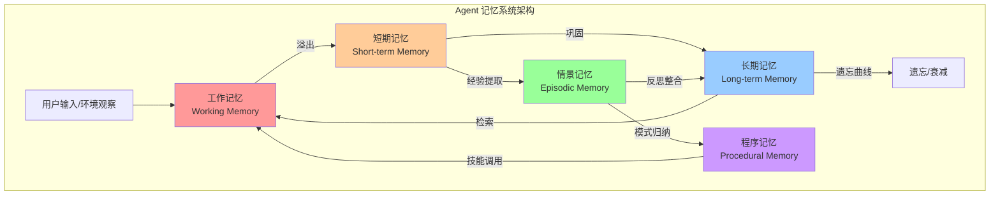

<!-- last updated: 2025-06 -->
# 记忆系统的设计困境

> "An agent without memory is condemned to repeat itself — and an agent with too much memory is condemned to drown in its own past."

## 为什么记忆是 Agent 的阿喀琉斯之踵

人类认知高度依赖记忆。我们通过记忆维持身份连续性、积累经验教训、建立世界模型。一个失去记忆的人无法学习、无法维持关系、无法完成多步骤任务——这恰恰是当前 AI Agent 面临的核心困境。

传统软件系统使用数据库（Database）来管理状态，这是一个被充分理解的工程领域：关系型数据库提供 ACID 事务保证，键值存储提供高性能读写，搜索引擎提供全文检索。开发者对数据的生命周期、一致性、查询模式有清晰的控制。

Agent 的记忆系统则处于一个尴尬的中间地带。它既不是纯粹的数据库查询（需要语义理解），也不是简单的上下文拼接（需要主动筛选）。一个有效的 Agent 记忆系统需要同时具备：语义检索（Semantic Retrieval）能力、时间排序（Temporal Ordering）逻辑、相关性评分（Relevance Scoring）机制，以及——或许最反直觉的——遗忘（Forgetting）策略。

这种复杂性使得记忆系统成为 Agent 工程中失败率最高的子系统之一。根据 2024 年多项行业调研，超过 60% 的 Agent 项目在长期运行后出现性能退化，其根本原因都可追溯到记忆管理的失败。

## 记忆系统的分类

借鉴认知科学的经典分类框架，我们可以将 Agent 记忆系统划分为以下五种类型：



### 1. 工作记忆（Working Memory）—— 上下文窗口

对应 LLM 的上下文窗口（Context Window），是 Agent 当前"正在思考"的信息。类比计算机的 RAM，容量有限且昂贵。GPT-4 Turbo 的 128K token 窗口看似宽裕，但在复杂任务中仍然捉襟见肘——一个中等规模代码仓库的相关上下文就可能超过 200K token。

关键限制：注意力稀释（Attention Dilution）。研究表明，当上下文超过一定长度后，模型对中间位置信息的关注度显著下降（"Lost in the Middle" 现象，Liu et al., 2023, arXiv:2307.03172）。

### 2. 短期记忆（Short-term Memory）—— 对话历史

当前会话的完整交互记录。随对话进行线性增长，最终超出上下文窗口容量。常见处理策略是滑动窗口截断或摘要压缩，但两者都会造成信息损失。

核心矛盾：对话第 3 轮提到的关键约束可能在第 50 轮时才变得相关，而此时该信息可能已被截断或摘要丢失。

### 3. 长期记忆（Long-term Memory）—— 向量存储与知识库

跨会话持久化的信息，通常存储在向量数据库（Vector Database）或知识图谱中。包括用户偏好、历史决策、领域知识等。

核心挑战：检索质量（Retrieval Quality）随数据量增长而退化。当存储了数万条记忆片段后，语义相似度搜索的精度（Precision）和召回率（Recall）之间的权衡变得极为棘手。

### 4. 情景记忆（Episodic Memory）—— 具体经历

对特定事件的记录，包含时间、地点、参与者、结果等结构化信息。对应人类"我记得那次做 X 时发生了 Y"的能力。这是 Agent 从失败中学习的关键机制。

示例：Agent 记得"上周三尝试用方法 A 部署服务失败了，错误是端口冲突，最后用方法 B 解决"。

### 5. 程序记忆（Procedural Memory）—— 技能与模式

类似人类的"肌肉记忆"，是从重复经验中归纳出的操作模式和技能。不是记住"发生了什么"，而是记住"应该怎么做"。

示例：Agent 从多次代码审查经验中归纳出"该团队偏好函数式风格，避免可变状态"的编码模式。

## 历史教训

### SOAR/ACT-R 认知架构（1980s-2000s）

认知科学领域最早尝试为人工智能构建完整记忆系统的是 SOAR（Laird et al., 1987）和 ACT-R（Anderson, 1993）架构。它们定义了精细的记忆类型（声明性记忆、程序性记忆、工作记忆），并通过手工编码的产生式规则（Production Rules）管理记忆的存取。

**教训**：这些系统过度依赖人工知识工程（Knowledge Engineering）。每增加一个领域的能力，都需要专家花费数月手动编码规则。系统的知识获取瓶颈（Knowledge Acquisition Bottleneck）始终未能解决。这告诉我们：记忆系统的可扩展性不能依赖人工标注。

### 早期聊天机器人的无记忆困境（2010s）

从 Siri 到早期的客服机器人，大多数对话系统缺乏有效的跨轮次记忆。用户每次对话都从零开始，反复提供相同信息。这导致：用户体验极差、无法处理多步骤任务、无法建立个性化关系。

**教训**：无记忆的 Agent 无法建立信任，也无法胜任任何需要持续交互的场景。

### 2023 年 RAG 的"垃圾进垃圾出"

检索增强生成（Retrieval-Augmented Generation, RAG）在 2023 年成为主流记忆方案。然而，大量团队在实践中发现：

- **分块策略（Chunking）的脆弱性**：固定长度切分破坏语义完整性，语义切分成本高且不稳定
- **嵌入质量退化**：当向量库中积累了数万条不同主题的文档片段后，语义空间变得拥挤，检索精度显著下降
- **"针在干草堆中"问题**：真正相关的记忆被大量"看起来相关但实际无用"的片段淹没

**教训**：简单地把所有信息塞入向量库，然后期望语义搜索总能找到正确答案，是一种工程上的天真。记忆的写入策略和读取策略同样重要。

### MemGPT（2023）：创造性的妥协

Packer et al.（2023, arXiv:2310.08560）提出的 MemGPT 将操作系统的虚拟内存概念引入 LLM Agent。Agent 被赋予显式的内存管理能力：可以主动将信息从"主存"（上下文窗口）移入"磁盘"（外部存储），也可以主动检索。

这是一个优雅的架构创新，但实践中暴露了关键问题：

- Agent 何时决定存储/检索？这本身需要智能判断，形成了递归依赖
- 检索到的信息质量仍然受限于底层向量搜索的能力
- 在长时间运行后，存储的信息量增长，检索延迟和噪声同步上升

**教训**：将记忆管理的责任交给 Agent 本身是正确方向，但 Agent 的记忆管理能力不能超越其底层推理能力。

### "90 天死亡谷"的根因分析

业界观察到一个普遍现象：许多 Agent 系统在部署后前几周表现良好，但在运行 2-3 个月后性能急剧退化。这被非正式地称为"90 天死亡谷"（90-Day Death Valley）。

根因分析揭示了以下链式失败：
1. 记忆积累 → 检索噪声增加 → 上下文污染
2. 过时信息未清理 → 基于错误前提做决策
3. 矛盾记忆并存 → Agent 行为不一致
4. 记忆系统延迟增加 → 用户体验退化 → 使用量下降

## 核心困境

### 困境一：容量 vs 相关性

```
存储一切 → 检索时噪声爆炸 → 决策质量下降
选择性存储 → 可能遗漏关键上下文 → 决策信息不足
```

这是信息论中经典的精度-召回（Precision-Recall）权衡在 Agent 领域的具体体现。人类大脑通过注意力机制和情感标记自然地解决了这个问题——重要的事情"印象深刻"，琐碎的事情自然淡忘。但当前的 Agent 系统缺乏等价的重要性评估机制。

### 困境二：一致性 vs 效率

保持所有记忆副本之间的一致性代价高昂。当 Agent 从向量库中检索到与当前上下文矛盾的信息时，应该相信哪一个？如果采用"最新优先"策略，则早期的正确信息可能被后来的错误信息覆盖。如果采用"置信度加权"策略，则需要为每条记忆维护元数据——这本身又是一个工程负担。

### 困境三：遗忘的必要性

人类遗忘不是缺陷，而是特性。遗忘帮助我们：泛化而非过拟合到具体细节、释放认知资源给当前任务、从创伤性经历中恢复。

Agent 如果"记住一切"会导致：过拟合到早期交互模式、无法适应用户偏好的变化、在矛盾信息中困惑。但如何设计"优雅的遗忘"——保留抽象教训的同时丢弃具体细节——仍是未解难题。

### 困境四：隐私 vs 个性化

丰富的用户记忆使 Agent 能提供高度个性化的服务。但这些记忆也构成隐私风险：记忆可能泄露、被提取（Prompt Injection 攻击）、或被不当使用。GDPR 的"被遗忘权"在 Agent 记忆系统中如何实现？如何确保记忆不会跨越用户预期的使用边界？

### 困境五：跨会话共享 vs 隔离

在同一 Agent 的不同会话间共享记忆可以实现持续学习，但也引入了语境污染风险——为 A 项目学习的偏好可能不适用于 B 项目。完全隔离则丧失了学习能力。

## 当前工程实践（2024-2025）

| 方案 | 原理 | 优势 | 劣势 | 适用场景 |
|------|------|------|------|----------|
| 滑动窗口 + 摘要 | 保留最近 N 轮原文，更早内容压缩为摘要 | 实现简单，成本可控 | 摘要有损，关键细节可能丢失 | 单轮对话为主的助手 |
| 分层记忆（Hot/Warm/Cold） | 按访问频率分层存储，热数据保持高可用 | 平衡成本与性能 | 分层策略设计困难，冷数据检索慢 | 长期运行的企业 Agent |
| 记忆即工具（Memory-as-Tool） | Agent 显式调用 store/retrieve API | Agent 自主决策何时读写 | 增加推理负担，可能遗忘存储 | MemGPT 类系统 |
| 反思式整合（Reflection） | 定期对记忆进行反思和归纳，生成高层洞察 | 支持抽象学习，减少噪声 | 反思本身消耗算力，可能引入幻觉 | 需要学习能力的 Agent |
| 知识图谱 | 以实体-关系-实体三元组存储结构化记忆 | 支持推理和关联查询 | 构建和维护成本高，覆盖度有限 | 领域专用 Agent |

### 滑动窗口 + 摘要

这是当前最普遍的方案。典型实现：

```python
class ConversationMemory:
    def __init__(self, window_size=10, model="gpt-4"):
        self.recent_messages = []  # 保留最近 N 轮完整对话
        self.summary = ""          # 更早内容的摘要
        self.window_size = window_size
    
    def add_message(self, role, content):
        self.recent_messages.append({"role": role, "content": content})
        if len(self.recent_messages) > self.window_size * 2:
            # 将溢出部分压缩为摘要
            overflow = self.recent_messages[:self.window_size]
            self.summary = self._summarize(self.summary, overflow)
            self.recent_messages = self.recent_messages[self.window_size:]
    
    def get_context(self):
        return {
            "summary": self.summary,
            "recent": self.recent_messages
        }
    
    def _summarize(self, existing_summary, new_messages):
        # 调用 LLM 将已有摘要与新消息整合
        prompt = f"已有摘要：{existing_summary}\n新对话：{new_messages}\n请更新摘要，保留关键信息。"
        return llm_call(prompt)
```

**已知问题**：摘要是有损压缩。在实际案例中，用户在第 5 轮提到的"不要用 TypeScript"可能在第 30 轮被摘要遗漏，导致 Agent 生成了 TypeScript 代码。

### 反思式整合（Generative Agents 方案）

Park et al.（2023, arXiv:2304.03442）的 Generative Agents 论文提出了一种受心理学启发的记忆架构：Agent 定期"反思"自己的经历，从具体事件中归纳出高层观察（Observations → Reflections）。

```
原始记忆: "2024-01-15 用户要求用 Go 重写 Python 服务"
原始记忆: "2024-01-20 用户抱怨 Python 服务性能太差"  
原始记忆: "2024-02-01 用户选择了 Rust 而非 Go"
    ↓ 反思整合
归纳记忆: "该用户重视性能，愿意为性能采用学习曲线更陡的语言"
```

这种方法的优势在于产生了超越具体事实的"理解"，但风险在于归纳可能错误——如果 Agent 基于有限证据得出了错误的归纳结论，这个结论会持续影响后续行为。

### 知识图谱作为结构化长期记忆

2024-2025 年，越来越多的团队尝试用知识图谱（Knowledge Graph）补充或替代向量存储：

```
[用户-A] --偏好--> [函数式编程]
[用户-A] --负责--> [支付服务]
[支付服务] --使用--> [Go 语言]
[支付服务] --依赖--> [用户服务]
[上次部署] --导致--> [内存泄漏]
[内存泄漏] --根因--> [未关闭数据库连接]
```

优势：支持关系推理（"用户 A 的服务依赖了什么？"），自然支持更新和修正（修改边即可），可解释性强。劣势：图的构建需要实体识别和关系抽取，覆盖度受限于抽取质量。

## 未解决的问题

**如何评估记忆质量？** 当前缺乏标准化的记忆系统评测基准（Benchmark）。检索准确率只是一个维度——Agent 记忆系统还需要评估：时效性（是否返回过时信息）、完整性（是否遗漏关键记忆）、一致性（不同检索是否矛盾）。

**如何处理矛盾记忆？** 当用户在不同时期表达了相反的偏好（"我喜欢简洁的代码" vs "请加上详细注释"），Agent 应该如何裁决？简单的"最新优先"策略忽略了语境差异——也许两个偏好分别适用于不同场景。

**如何实现真正的"学习"？** 当前大多数记忆系统只是"记录"和"检索"，而非"学习"。真正的学习意味着从经验中提取可泛化的规则，并在新情境中灵活应用。这需要超越当前 RAG 范式的根本性突破。

**记忆与身份** 如果一个 Agent 拥有完整的、持续的记忆——记得所有交互、所有决策、所有"经历"——这是否构成某种形式的"身份"（Identity）？这不仅是哲学问题，也有工程影响：具有身份连续性的 Agent 是否应该有权"拒绝"记忆被删除？这些问题在 Agent 技术成熟之前就需要开始思考。

**规模化路径** 当一个 Agent 服务百万用户，每个用户拥有独立的记忆空间时，存储和检索的成本如何控制？分布式记忆系统如何保证一致性？这些工程挑战目前缺乏成熟解决方案。

## 小结

记忆系统是 Agent 工程中最具挑战性的子系统，因为它同时触及了计算机科学（信息检索、数据管理）、认知科学（人类记忆模型）和哲学（身份与学习的本质）的边界。历史教训告诉我们：过于简单的方案（无记忆、全存储）必然失败，而过于复杂的方案（手工知识工程）无法扩展。当前的工程实践是在这两个极端之间寻找实用的折中，但根本性的突破仍有待出现。

对于工程师而言，最重要的认知是：记忆系统不是一个"配置好就忘记"的基础设施，而是需要持续监控、调优和演进的核心组件。Agent 的长期可靠性，在很大程度上取决于其记忆系统的设计质量。

## 参考文献

- Laird, J. E., Newell, A., & Rosenbloom, P. S. (1987). "SOAR: An Architecture for General Intelligence." *Artificial Intelligence*, 33(1), 1-64.
- Anderson, J. R. (1993). *Rules of the Mind*. Lawrence Erlbaum Associates. (ACT-R 认知架构的奠基著作)
- Liu, N. F., Lin, K., Hewitt, J., et al. (2023). "Lost in the Middle: How Language Models Use Long Contexts." arXiv:2307.03172.
- Park, J. S., O'Brien, J. C., Cai, C. J., et al. (2023). "Generative Agents: Interactive Simulacra of Human Behavior." arXiv:2304.03442.
- Packer, C., Wooders, S., Lin, K., et al. (2023). "MemGPT: Towards LLMs as Operating Systems." arXiv:2310.08560.
- Lewis, P., Perez, E., Piktus, A., et al. (2020). "Retrieval-Augmented Generation for Knowledge-Intensive NLP Tasks." arXiv:2005.11401. (RAG 原始论文)
- Zhang, Z., Bo, X., Ma, C., et al. (2024). "A Survey on the Memory Mechanism of Large Language Model based Agents." arXiv:2404.13501.
- Wang, L., Ma, C., Feng, X., et al. (2024). "A Survey on Large Language Model based Autonomous Agents." arXiv:2308.11432.
- Shinn, N., Cassano, F., Gopinath, A., et al. (2023). "Reflexion: Language Agents with Verbal Reinforcement Learning." arXiv:2303.11366.
- Hu, C., Fu, J., Du, C., et al. (2024). "ChatDB: Augmenting LLMs with Databases as Their Symbolic Memory." arXiv:2306.03901.
