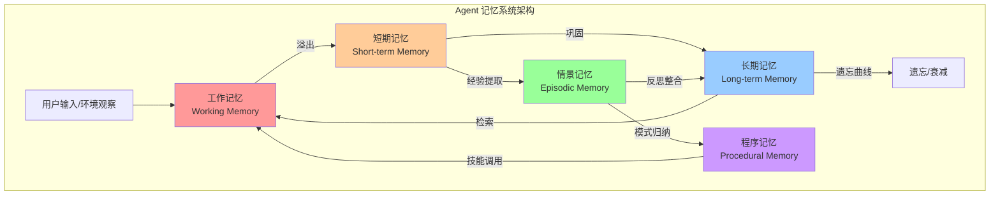

<!-- last updated: 2025-06 -->
# 记忆系统的设计困境

> "An agent without memory is condemned to repeat itself — and an agent with too much memory is condemned to drown in its own past."

## 为什么记忆是 Agent 的阿喀琉斯之踵

人类认知高度依赖记忆。我们通过记忆维持身份连续性、积累经验教训、建立[世界模型](../../appendix/glossary.md#world-model)。一个失去记忆的人无法学习、无法维持关系、无法完成多步骤任务——这恰恰是当前 AI Agent 面临的核心困境。

传统软件系统使用数据库（Database）来管理状态，这是一个被充分理解的工程领域：关系型数据库提供 ACID 事务保证，键值存储提供高性能读写，搜索引擎提供全文检索。开发者对数据的生命周期、一致性、查询模式有清晰的控制。

Agent 的记忆系统则处于一个尴尬的中间地带。它既不是纯粹的数据库查询（需要语义理解），也不是简单的上下文拼接（需要主动筛选）。一个有效的 Agent 记忆系统需要同时具备：语义检索（Semantic Retrieval）能力、时间排序（Temporal Ordering）逻辑、相关性评分（Relevance Scoring）机制，以及——或许最反直觉的——遗忘（Forgetting）策略。

这种复杂性使得记忆系统成为 Agent 工程中失败率最高的子系统之一。多项研究和行业数据佐证了这一判断：RAND Corporation 2024 年研究发现超过 80% 的 AI 项目最终失败，是非 AI IT 项目失败率的两倍<sup>[RAND 2024]</sup>；ICLR 2026 杰出论文"LLMs Get Lost In Multi-Turn Conversation"（Shi et al., arXiv:2505.06120）实测 15 个前沿 LLM 在多轮对话中平均性能下降 39%，且退化主要源于可靠性崩塌而非能力丧失；LangChain 2024 年"State of AI Agents"报告则指出记忆管理是开发者反馈中排名前三的工程痛点<sup>[LangChain 2024]</sup>。综合来看，Agent 项目在长期运行后出现的性能退化，其根本原因大多可追溯到记忆管理的失败。

## 记忆系统的分类

借鉴认知科学的经典分类框架，我们可以将 Agent 记忆系统划分为以下五种类型：



### 1. 工作记忆（Working Memory）—— 上下文窗口

对应 LLM 的[上下文窗口](../../appendix/glossary.md#context-window)（Context Window），是 Agent 当前"正在思考"的信息。类比计算机的 RAM，容量有限且昂贵。GPT-4 Turbo 的 128K [token](../../appendix/glossary.md#token) 窗口看似宽裕，但在复杂任务中仍然捉襟见肘——一个中等规模代码仓库的相关上下文就可能超过 200K token。

**产品实例**：Hermes Agent 使用"冻结快照"（Frozen Snapshot）机制管理工作记忆——在会话开始时将持久记忆一次性注入系统提示，会话期间不再修改这个快照。这种设计有意牺牲了实时性，换取了 LLM 的前缀缓存（Prefix Cache）性能优化。

> **128K token 能装多少中文？** 按照 GPT-4 的 cl100k_base 分词器，大多数常用汉字被编码为 1 个 token，少数生僻字或特殊符号为 2-3 个 token。加上标点和格式字符的消耗，128K token 大约相当于 **6-9 万个中文字**——约等于一本 200 页左右的书。听起来不少，但考虑到 Agent 实际运行中上下文窗口需要同时容纳系统指令、对话历史、检索到的参考文档、以及模型生成的输出，真正留给"有效信息"的空间远小于理论上限。

关键限制：注意力稀释（Attention Dilution）。研究表明，当上下文超过一定长度后，模型对中间位置信息的关注度显著下降（"Lost in the Middle" 现象，Liu et al., 2023, arXiv:2307.03172）。

### 2. 短期记忆（Short-term Memory）—— 对话历史

当前会话（Session）的完整交互记录。随对话进行线性增长，最终超出上下文窗口容量。常见处理策略是滑动窗口截断或摘要压缩，但两者都会造成信息损失。

核心矛盾：对话第 3 轮提到的关键约束可能在第 50 轮时才变得相关，而此时该信息可能已被截断或摘要丢失。

**产品实例**：OpenClaw 的"Compaction"机制——当工作记忆接近上限时，系统自动将旧对话压缩为摘要，保留要点但丢弃细节。Hermes Agent 则采用"头尾保护"策略：保留对话开头（系统人格 + 任务目标）和末尾（最近几轮）的完整内容，中间部分进行动态压缩。

### 3. 长期记忆（Long-term Memory）—— 向量存储与知识库

跨会话（Session）持久化的信息，通常存储在向量数据库（Vector Database）或知识图谱中。包括用户偏好、历史决策、领域知识等。

核心挑战：检索质量（Retrieval Quality）随数据量增长而退化。当存储了数万条记忆片段后，语义相似度搜索的精度（Precision）和召回率（Recall）之间的权衡变得极为棘手。

**产品实例对比**：不同产品对长期记忆的实现哲学截然不同：

- **OpenClaw** 采用纯文件方案：一个 `MEMORY.md` 文件存储持久事实和偏好（有字符上限），配合 `memory/YYYY-MM-DD.md` 每日文件存储详细笔记和会话摘要。每日文件被索引用于全文搜索，但不会在每次会话启动时注入提示词。系统通过"Dreaming"后台流程定期从每日笔记中提炼有价值内容到 `MEMORY.md`，保持长期记忆的高信噪比。
- **Hermes Agent** 采用文件 + 数据库双轨持久化：`MEMORY.md`（Agent 视角的自我认知）和 `USER.md`（对用户的认知建模）存储核心记忆，SQLite + FTS5 全文搜索数据库存储完整的会话历史，支持跨会话的精确检索。值得注意的是，Hermes 有意避免使用向量检索——其设计者认为 FTS5 的精确匹配比向量近似搜索更适合 Agent 的记忆场景，避免了语义检索的"幻觉"问题。
- **Mem0** 则走向量优先路线，采用"写入时智能"（Intelligence at Write Time）策略，在信息存入时就完成实体提取、分类和关联建立。

### 4. [情景记忆](../../appendix/glossary.md#episodic-memory)（Episodic Memory）—— 具体经历

对特定事件的记录，包含时间、地点、参与者、结果等结构化信息。对应人类"我记得那次做 X 时发生了 Y"的能力。这是 Agent 从失败中学习的关键机制。

示例：Agent 记得"上周三尝试用方法 A 部署服务失败了，错误是端口冲突，最后用方法 B 解决"。

### 5. 程序记忆（Procedural Memory）—— 技能与模式

类似人类的"肌肉记忆"，是从重复经验中归纳出的操作模式和技能。不是记住"发生了什么"，而是记住"应该怎么做"。

示例：Agent 从多次代码审查经验中归纳出"该团队偏好函数式风格，避免可变状态"的编码模式。

## 历史教训

### SOAR/ACT-R 认知架构（1980s-2000s）

认知科学领域最早尝试为人工智能构建完整记忆系统的是 SOAR（Laird et al., 1987）和 ACT-R（Anderson, 1993）架构。它们定义了精细的记忆类型（声明性记忆、程序性记忆、工作记忆），并通过手工编码的产生式规则（Production Rules）管理记忆的存取。

**教训**：这些系统过度依赖人工知识工程（Knowledge Engineering）。每增加一个领域的能力，都需要专家花费数月手动编码规则。系统的知识获取瓶颈（Knowledge Acquisition Bottleneck）始终未能解决。这告诉我们：记忆系统的可扩展性不能依赖人工标注。

### 早期聊天机器人的无记忆困境（2010s）

从 Siri 到早期的客服机器人，大多数对话系统缺乏有效的跨轮次记忆。用户每次对话都从零开始，反复提供相同信息。这导致：用户体验极差、无法处理多步骤任务、无法建立个性化关系。

**教训**：无记忆的 Agent 无法建立信任，也无法胜任任何需要持续交互的场景。

### 2023 年 RAG 的"垃圾进垃圾出"

检索增强生成（Retrieval-Augmented Generation, RAG）在 2023 年成为主流记忆方案。然而，大量团队在实践中发现：

- **分块策略（Chunking）的脆弱性**：固定长度切分破坏语义完整性，语义切分成本高且不稳定
- **嵌入质量退化**：当向量库中积累了数万条不同主题的文档片段后，语义空间变得拥挤，检索精度显著下降
- **"针在干草堆中"问题**：真正相关的记忆被大量"看起来相关但实际无用"的片段淹没

**教训**：简单地把所有信息塞入向量库，然后期望语义搜索总能找到正确答案，是一种工程上的天真。记忆的写入策略和读取策略同样重要。

> 📌 **深入了解 RAG 技术选型**：关于向量数据库选型（Chroma / Qdrant / Milvus / pgvector）、索引算法（HNSW / IVF）、混合检索策略、以及完整的 RAG 工程实现代码，请参考本书的专门章节 [**记忆系统：让 Agent 拥有持久上下文**](../../02-technology/07-core-modules/memory.md)。该章节提供了从 Embedding 模型到生产部署的完整技术路径，包括 Letta（MemGPT）、Mem0、Zep 三大方案的深度对比。

### MemGPT（2023）：创造性的妥协

Packer et al.（2023, arXiv:2310.08560）提出的 MemGPT 将操作系统的虚拟内存概念引入 LLM Agent。Agent 被赋予显式的内存管理能力：可以主动将信息从"主存"（上下文窗口）移入"磁盘"（外部存储），也可以主动检索。

这是一个优雅的架构创新，但实践中暴露了关键问题：

- Agent 何时决定存储/检索？这本身需要智能判断，形成了递归依赖
- 检索到的信息质量仍然受限于底层向量搜索的能力
- 在长时间运行后，存储的信息量增长，检索延迟和噪声同步上升

**教训**：将记忆管理的责任交给 Agent 本身是正确方向，但 Agent 的记忆管理能力不能超越其底层推理能力。

### "90 天死亡谷"的根因分析

业界观察到一个普遍现象：许多 Agent 系统在部署后前几周表现良好，但在运行 2-3 个月后性能急剧退化。这被非正式地称为"90 天死亡谷"（90-Day Death Valley）。

根因分析揭示了以下链式失败：
1. 记忆积累 → 检索噪声增加 → 上下文污染
2. 过时信息未清理 → 基于错误前提做决策
3. 矛盾记忆并存 → Agent 行为不一致
4. 记忆系统延迟增加 → 用户体验退化 → 使用量下降

## 核心困境

### 困境一：容量 vs 相关性

```
存储一切 → 检索时噪声爆炸 → 决策质量下降
选择性存储 → 可能遗漏关键上下文 → 决策信息不足
```

这是信息论中经典的精度-召回（Precision-Recall）权衡在 Agent 领域的具体体现。人类大脑通过注意力机制和情感标记自然地解决了这个问题——重要的事情"印象深刻"，琐碎的事情自然淡忘。但当前的 Agent 系统缺乏等价的重要性评估机制。

### 困境二：一致性 vs 效率

保持所有记忆副本之间的一致性代价高昂。当 Agent 从向量库中检索到与当前上下文矛盾的信息时，应该相信哪一个？如果采用"最新优先"策略，则早期的正确信息可能被后来的错误信息覆盖。如果采用"置信度加权"策略，则需要为每条记忆维护元数据——这本身又是一个工程负担。

### 困境三：遗忘的必要性

人类遗忘不是缺陷，而是特性。遗忘帮助我们：泛化而非过拟合到具体细节、释放认知资源给当前任务、从创伤性经历中恢复。

Agent 如果"记住一切"会导致：过拟合到早期交互模式、无法适应用户偏好的变化、在矛盾信息中困惑。但如何设计"优雅的遗忘"——保留抽象教训的同时丢弃具体细节——仍是未解难题。

### 困境四：隐私 vs 个性化

丰富的用户记忆使 Agent 能提供高度个性化的服务。但这些记忆也构成隐私风险：记忆可能泄露、被提取（Prompt Injection 攻击）、或被不当使用。GDPR 的"被遗忘权"在 Agent 记忆系统中如何实现？如何确保记忆不会跨越用户预期的使用边界？

### 困境五：跨会话（Session）共享 vs 隔离

> **什么是会话（Session）？** 在 Agent 工程中，“会话”的含义比 Web 开发中的 HTTP Session 更为丰富。一个 Agent Session 代表一段有界限的、具有特定目标和上下文的交互周期。它包含：完整的对话历史（用户消息 + Agent 回复 + 工具调用记录）、当前任务的状态机（进行中/完成/失败）、累计的中间结果，以及本次交互产生的新记忆。会话的生命周期通常由用户显式开启（如打开新对话窗口）或系统隐式创建（如超时后自动新建）。

在同一 Agent 的不同会话间共享记忆可以实现持续学习，但也引入了语境污染风险——为 A 项目学习的偏好可能不适用于 B 项目。完全隔离则丧失了学习能力。

**Session 的设计哲学与技术实现**

当前主流 Agent 系统对 Session 的处理分为三种流派：

**完全隔离派**：每个 Session 是一个独立的“岛屿”，会话结束后所有上下文消失。这是最简单的实现，也是早期聊天机器人的默认模式。优势是完全消除了语境污染风险，但用户体验极差——每次都要重新“教育”Agent。

**分层共享派**（当前主流）：区分“全局记忆”和“会话记忆”，前者跨 Session 持久化，后者随会话结束而消亡。典型实现如 OpenClaw 的双层模型：`MEMORY.md` 存储跨会话的持久事实（“用户偏好 TypeScript”“用户是后端工程师”），`memory/YYYY-MM-DD.md` 存储会话级别的临时笔记。每个 Session 启动时，只加载全局记忆；需要时通过检索访问历史会话内容。

**智能融合派**（前沿探索）：让 Agent 自主决定将哪些会话级信息“提升”为全局记忆。Hermes Agent 的 Curator（策展人）后台学习器是这一派的代表——它在后台异步运行，分析已完成的会话，提取可复用的模式并将其固化为 Skill（技能）。这种设计让 Agent 真正实现了“越用越强”，但也引入了“错误归纳”的风险——从有限的会话中归纳出错误的通用规则。

关于 Session 设计的更深入讨论（包括 Session ID 策略、Session 生命周期管理、多设备同步等），请参考 [**上下文管理**](../../02-technology/07-core-modules/context-management.md)。

## 当前工程实践（2024-2025）

| 方案 | 原理 | 优势 | 劣势 | 适用场景 |
|------|------|------|------|----------|
| 滑动窗口 + 摘要 | 保留最近 N 轮原文，更早内容压缩为摘要 | 实现简单，成本可控 | 摘要有损，关键细节可能丢失 | 单轮对话为主的助手 |
| 分层记忆（Hot/Warm/Cold） | 按访问频率分层存储，热数据保持高可用 | 平衡成本与性能 | 分层策略设计困难，冷数据检索慢 | 长期运行的企业 Agent |
| 记忆即工具（Memory-as-Tool） | Agent 显式调用 store/retrieve API | Agent 自主决策何时读写 | 增加推理负担，可能遗忘存储 | MemGPT 类系统 |
| 反思式整合（Reflection） | 定期对记忆进行反思和归纳，生成高层洞察 | 支持抽象学习，减少噪声 | 反思本身消耗算力，可能引入幻觉 | 需要学习能力的 Agent |
| 知识图谱 | 以实体-关系-实体三元组存储结构化记忆 | 支持推理和关联查询 | 构建和维护成本高，覆盖度有限 | 领域专用 Agent |

### 滑动窗口 + 摘要

这是当前最普遍的方案。典型实现：

```python
class ConversationMemory:
    def __init__(self, window_size=10, model="gpt-4"):
        self.recent_messages = []  # 保留最近 N 轮完整对话
        self.summary = ""          # 更早内容的摘要
        self.window_size = window_size
    
    def add_message(self, role, content):
        self.recent_messages.append({"role": role, "content": content})
        if len(self.recent_messages) > self.window_size * 2:
            # 将溢出部分压缩为摘要
            overflow = self.recent_messages[:self.window_size]
            self.summary = self._summarize(self.summary, overflow)
            self.recent_messages = self.recent_messages[self.window_size:]
    
    def get_context(self):
        return {
            "summary": self.summary,
            "recent": self.recent_messages
        }
    
    def _summarize(self, existing_summary, new_messages):
        # 调用 LLM 将已有摘要与新消息整合
        prompt = f"已有摘要：{existing_summary}\n新对话：{new_messages}\n请更新摘要，保留关键信息。"
        return llm_call(prompt)
```

**已知问题**：摘要是有损压缩。在实际案例中，用户在第 5 轮提到的"不要用 TypeScript"可能在第 30 轮被摘要遗漏，导致 Agent 生成了 TypeScript 代码。

### 反思式整合（Generative Agents 方案）

Park et al.（2023, arXiv:2304.03442）的 Generative Agents 论文提出了一种受心理学启发的记忆架构：Agent 定期"反思"自己的经历，从具体事件中归纳出高层观察（Observations → Reflections）。

```
原始记忆: "2024-01-15 用户要求用 Go 重写 Python 服务"
原始记忆: "2024-01-20 用户抱怨 Python 服务性能太差"  
原始记忆: "2024-02-01 用户选择了 Rust 而非 Go"
    ↓ 反思整合
归纳记忆: "该用户重视性能，愿意为性能采用学习曲线更陡的语言"
```

这种方法的优势在于产生了超越具体事实的"理解"，但风险在于归纳可能错误——如果 Agent 基于有限证据得出了错误的归纳结论，这个结论会持续影响后续行为。

### 知识图谱作为结构化长期记忆

2024-2025 年，越来越多的团队尝试用知识图谱（Knowledge Graph）补充或替代向量存储：

```
[用户-A] --偏好--> [函数式编程]
[用户-A] --负责--> [支付服务]
[支付服务] --使用--> [Go 语言]
[支付服务] --依赖--> [用户服务]
[上次部署] --导致--> [内存泄漏]
[内存泄漏] --根因--> [未关闭数据库连接]
```

优势：支持关系推理（"用户 A 的服务依赖了什么？"），自然支持更新和修正（修改边即可），可解释性强。劣势：图的构建需要实体识别和关系抽取，覆盖度受限于抽取质量。

## 最新记忆解决方案（2025-2026）

在上述传统方案之上，2025-2026 年涌现了一批以"自进化"和"文件优先"为特征的新一代记忆架构，它们代表了 Agent 记忆工程的最新思考。

### Hermes Agent：有界策展式记忆 + 自学习闭环

[Hermes Agent](https://github.com/NousResearch/hermes-agent)（Nous Research, 2026）是一个以"自我进化"为核心理念的开源 Agent 框架，上线数月即获得 61K+ Stars。其记忆系统设计围绕三个关键词：**有界**（Bounded）、**策展式**（Curated）、**缓存友好**（Cache-Friendly）。

**四层记忆架构**：

```
┌────────────────────────────────────────────────────┐
│  Layer 1: 冻结快照 (Frozen Snapshot)               │ ← 会话启动时注入，不可变
│  内容: MEMORY.md + USER.md 的完整文本               │    利用 LLM Prefix Cache
├────────────────────────────────────────────────────┤
│  Layer 2: 活跃对话 (Active Conversation)           │ ← 当前会话的消息链
│  管理: 头尾保护 + 中间动态压缩                      │    有严格字符上限
├────────────────────────────────────────────────────┤
│  Layer 3: SQLite FTS5 会话搜索                     │ ← 跨会话的精确检索
│  内容: 所有历史会话的完整记录                        │    按关键词而非向量搜索
├────────────────────────────────────────────────────┤
│  Layer 4: 外部记忆插件 (Honcho/Mem0/自定义)         │ ← 可选扩展层
│  对接: Memory Provider 插件接口                     │    按需增强
└────────────────────────────────────────────────────┘
```

**核心创新——Curator（策展人）自学习器**：Hermes 的 Curator 是一个后台异步进程，它在会话结束后分析交互轨迹，将成功的操作模式自动提取为可复用的 Skill（技能文件）。这意味着 Agent 不仅"记住"了做过什么，还"学会"了怎么做。Curator 产出的 Skill 被存入技能库，后续会话中可直接调用，实现了真正的"越用越强"。

**设计哲学启示**：Hermes 选择 FTS5 全文搜索而非向量检索，理由是 Agent 记忆场景更需要"精确召回"而非"语义近似"——当 Agent 想找"用户上次提到的数据库密码配置"时，精确关键词匹配比语义相似度更可靠。这一反主流的技术选择值得深思。

### OpenClaw：文件优先的透明记忆系统

[OpenClaw](https://github.com/openclaw/openclaw) 的记忆设计体现了"简单即力量"的工程哲学。与 Hermes 的数据库方案不同，OpenClaw 将所有记忆以 Markdown 文件形式存储在本地文件系统中，用户可以直接阅读和编辑 Agent 的"大脑"。

**双层文件模型**：

- **`MEMORY.md`（长期记忆）**：存储持久事实、用户偏好、重大决策。有严格的字符上限（通常 2000-4000 字符），迫使 Agent 只保留真正重要的信息。这个文件在每个会话启动时被完整注入系统提示。
- **`memory/YYYY-MM-DD.md`（每日记忆）**：存储当天的详细笔记、会话摘要、原始上下文。这些文件被索引用于 `memory_search`，但不会自动注入提示——只在需要时通过检索获取。

**Dreaming（做梦）机制**：OpenClaw 设计了一个可选的后台整合流程，模仿人类睡眠时的记忆巩固。它收集短期信号，对候选项目进行评分，只将合格内容提升到 `MEMORY.md`。这保持了长期记忆的高信噪比。

**Heartbeat 防遗忘机制**：当会话接近自动压缩阈值时，系统触发一个隐式的"心跳"轮次，提醒 Agent 在上下文被压缩前将重要信息写入持久记忆。用户不会看到这个轮次——它是系统级的安全网。

**设计哲学启示**：OpenClaw 的文件优先策略带来了极高的透明性和可调试性。当 Agent 行为异常时，工程师可以直接打开 `MEMORY.md` 检查它"记住了什么"。这种可观察性（Observability）在向量数据库方案中几乎不可能实现。

### 两大方案对比

| 维度 | Hermes Agent | OpenClaw |
|------|-------------|----------|
| 记忆存储 | 文件 + SQLite 双轨 | 纯 Markdown 文件 |
| 检索方式 | SQLite FTS5 全文搜索 | 文件索引 + memory_search |
| 长期记忆管理 | Agent 自主管理（memory 工具） | Agent 自主 + Dreaming 后台 |
| 自学习能力 | Curator 自动提取 Skill | 无内建自学习（依赖外部） |
| 用户可见性 | 文件可读，DB 需工具 | 完全可读可编辑 |
| 扩展性 | 插件化 Memory Provider | MCP 工具扩展 |
| 适用场景 | 长期运行、需要自进化的个人助手 | 开发者工具、需要透明可控的场景 |

> 📌 关于 Letta（MemGPT 演进版）、Mem0、Zep 等生产级记忆方案的深度对比和代码实现，请参考 [**记忆系统：让 Agent 拥有持久上下文**](../../02-technology/07-core-modules/memory.md#主流记忆架构深度对比)。

## 未解决的问题

**如何评估记忆质量？** 当前缺乏标准化的记忆系统评测基准（Benchmark）。检索准确率只是一个维度——Agent 记忆系统还需要评估：时效性（是否返回过时信息）、完整性（是否遗漏关键记忆）、一致性（不同检索是否矛盾）。

**如何处理矛盾记忆？** 当用户在不同时期表达了相反的偏好（"我喜欢简洁的代码" vs "请加上详细注释"），Agent 应该如何裁决？简单的"最新优先"策略忽略了语境差异——也许两个偏好分别适用于不同场景。

**如何实现真正的"学习"？** 当前大多数记忆系统只是"记录"和"检索"，而非"学习"。真正的学习意味着从经验中提取可泛化的规则，并在新情境中灵活应用。这需要超越当前 RAG 范式的根本性突破。

**记忆与身份** 如果一个 Agent 拥有完整的、持续的记忆——记得所有交互、所有决策、所有"经历"——这是否构成某种形式的"身份"（Identity）？这不仅是哲学问题，也有工程影响：具有身份连续性的 Agent 是否应该有权"拒绝"记忆被删除？这些问题在 Agent 技术成熟之前就需要开始思考。

**规模化路径** 当一个 Agent 服务百万用户，每个用户拥有独立的记忆空间时，存储和检索的成本如何控制？分布式记忆系统如何保证一致性？这些工程挑战目前缺乏成熟解决方案。

## 小结

记忆系统是 Agent 工程中最具挑战性的子系统，因为它同时触及了计算机科学（信息检索、数据管理）、认知科学（人类记忆模型）和哲学（身份与学习的本质）的边界。历史教训告诉我们：过于简单的方案（无记忆、全存储）必然失败，而过于复杂的方案（手工知识工程）无法扩展。当前的工程实践是在这两个极端之间寻找实用的折中，但根本性的突破仍有待出现。

对于工程师而言，最重要的认知是：记忆系统不是一个"配置好就忘记"的基础设施，而是需要持续监控、调优和演进的核心组件。Agent 的长期可靠性，在很大程度上取决于其记忆系统的设计质量。

## 参考文献

- Laird, J. E., Newell, A., & Rosenbloom, P. S. (1987). "SOAR: An Architecture for General Intelligence." *Artificial Intelligence*, 33(1), 1-64.
- Anderson, J. R. (1993). *Rules of the Mind*. Lawrence Erlbaum Associates. (ACT-R 认知架构的奠基著作)
- Liu, N. F., Lin, K., Hewitt, J., et al. (2023). "Lost in the Middle: How Language Models Use Long Contexts." arXiv:2307.03172.
- Park, J. S., O'Brien, J. C., Cai, C. J., et al. (2023). "Generative Agents: Interactive Simulacra of Human Behavior." arXiv:2304.03442.
- Packer, C., Wooders, S., Lin, K., et al. (2023). "MemGPT: Towards LLMs as Operating Systems." arXiv:2310.08560.
- Lewis, P., Perez, E., Piktus, A., et al. (2020). "Retrieval-Augmented Generation for Knowledge-Intensive NLP Tasks." arXiv:2005.11401. (RAG 原始论文)
- Shi, F., et al. (2025). "LLMs Get Lost In Multi-Turn Conversation." arXiv:2505.06120. (ICLR 2026 Outstanding Paper，实测多轮对话平均 39% 性能下降)
- Zhang, Z., Bo, X., Ma, C., et al. (2024). "A Survey on the Memory Mechanism of Large Language Model based Agents." arXiv:2404.13501.
- Wang, L., Ma, C., Feng, X., et al. (2024). "A Survey on Large Language Model based Autonomous Agents." arXiv:2308.11432.
- Shinn, N., Cassano, F., Gopinath, A., et al. (2023). "Reflexion: Language Agents with Verbal Reinforcement Learning." arXiv:2303.11366.
- Hu, C., Fu, J., Du, C., et al. (2024). "ChatDB: Augmenting LLMs with Databases as Their Symbolic Memory." arXiv:2306.03901.
- RAND Corporation (2024). "AI Project Failure Rates." (研究发现超过 80% 的 AI 项目失败)
- LangChain (2024). "State of AI Agents Report." https://www.langchain.com/stateofaiagents
- Nous Research (2026). Hermes Agent. https://github.com/NousResearch/hermes-agent
- OpenClaw (2025). OpenClaw Memory Documentation. https://docs.openclaw.ai/concepts/memory
