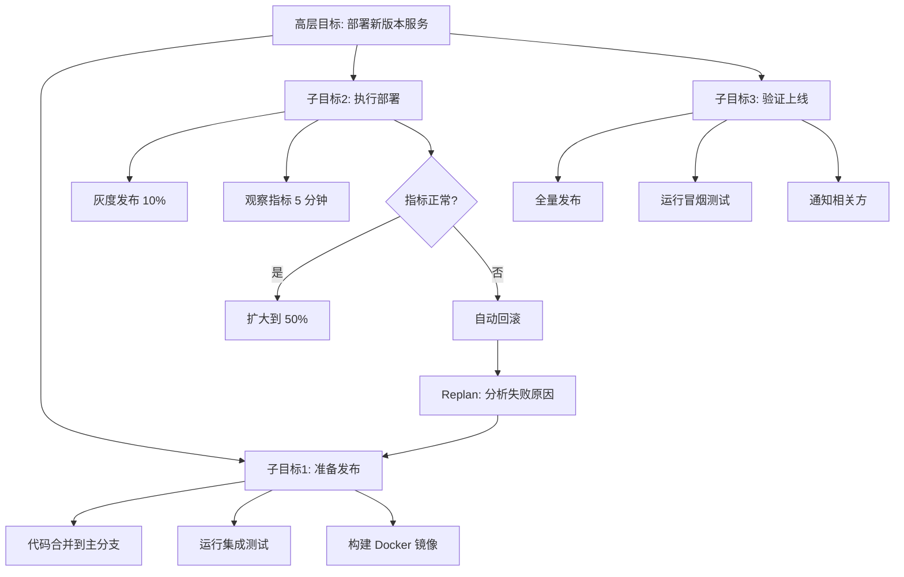

<!-- last updated: 2025-06 -->
# 规划能力的局限与突破

> "Plans are worthless, but planning is everything." —— Dwight D. Eisenhower

规划（Planning）是智能体研究的核心能力之一，也是从经典 AI 到现代 LLM Agent 始终未被真正攻克的难题。本节回顾规划问题的计算本质、历史上的关键失败案例，以及 LLM Agent 时代暴露出的新困境，最终总结工程实践中的突破方向。

## 1. 规划问题的计算复杂性

### 1.1 经典 AI 规划的形式化

经典 AI 规划的研究始于 [STRIPS](../../appendix/glossary.md#strips)（Stanford Research Institute Problem Solver, 1971），后发展为标准化的 [PDDL](../../appendix/glossary.md#pddl)（Planning Domain Definition Language）表示。其核心形式化为：给定初始状态 S₀、目标状态 G、以及一组动作（Action）集合 A，求解一个动作序列 a₁, a₂, ..., aₙ 使系统从 S₀ 到达满足 G 的状态。

这个看似简单的问题在计算复杂性上极其困难：

- **STRIPS 规划**的一般情况是 [PSPACE-complete](../../appendix/glossary.md#pspace-complete)（Bylander, 1994）
- **最优规划**（找到最短动作序列）在多数限制下仍是 [NP-hard](../../appendix/glossary.md#np-hard)
- **条件规划**（Contingent Planning）在不确定性环境下是 [2-EXPTIME](../../appendix/glossary.md#2-exptime)

### 1.2 框架问题（Frame Problem）

McCarthy 和 Hayes（1969）提出的[框架问题](../../appendix/glossary.md#frame-problem)是规划的根本困难之一：当一个动作执行后，如何形式化表示"哪些状态没有改变"？在真实世界中，一个动作的副作用是无限的——推开一扇门不仅改变了门的位置，还影响了空气流动、光线分布、噪音传播等无数维度。

这导致了所谓的"资格问题"（Qualification Problem）：要完整描述一个动作的前置条件，需要列举无限多的"正常情况假设"。

### 1.3 组合爆炸

即使在简化的规划空间中，状态空间的[组合爆炸](../../appendix/glossary.md#combinatorial-explosion)也使得穷举搜索不可行。一个有 N 个布尔状态变量的问题拥有 2^N 个可能状态；一个有 K 个可选动作、规划长度为 L 的问题拥有 K^L 个候选方案。现实世界的规划空间远超这些玩具模型的规模。

### 1.4 LLM 为什么不能"真正"规划

LLM 的核心机制是自回归的下一个 token 预测（Next-Token Prediction），而非在动作空间上的系统搜索。这意味着：

- LLM 生成计划时本质上是在做**模式匹配**，而非**约束求解**
- 没有内建的回溯（Backtracking）机制来纠正错误路径
- 无法保证生成序列满足全局约束（如资源有限、时序依赖）

正如 Valmeekam 等人（arXiv:2206.10498, 2022）的研究所示，GPT-4 在经典规划基准（Blocksworld）上的成功率远低于专用规划器，尤其在问题规模增长时急剧退化。

## 2. 历史上的规划失败

### 2.1 Shakey the Robot（1966-1972）

斯坦福研究所的 Shakey 是第一个试图将感知、规划和执行整合在一起的机器人。它使用 STRIPS 规划器，能够在精心布置的实验室中推箱子、开关灯。然而：

- 在"干净房间"之外完全失效——地板上的一条裂缝就能让它迷失
- 规划时间极长（简单任务需要数分钟甚至数小时）
- 对环境变化零容忍——有人移动了一个箱子，整个计划就失效了

**教训**：脱离真实世界复杂性的规划看似成功，但缺乏鲁棒性。

### 2.2 专家系统时代（1980s）

XCON（R1）等专家系统能在特定领域（如计算机配置）进行有效规划，但暴露了严重的脆弱性：

- 规则之间的交互难以预测——新增一条规则可能破坏已有计划
- 无法处理"计划外"的情况——遇到知识库外的场景直接崩溃
- 维护成本指数增长——DEC 的 XCON 最终膨胀到 10,000+ 条规则

**教训**：基于规则的刚性规划无法应对开放世界的不确定性。

### 2.3 经典规划器的玩具问题困境

GraphPlan（1997）、FF Planner（2001）等经典规划器在竞赛问题上表现出色，但面临"玩具到现实"的鸿沟：

- 要求完美的领域模型——现实中几乎不可能获得
- 假设确定性执行——动作总是按预期产生效果
- 不支持持续动作、时间约束、并发等现实需求

### 2.4 博弈 AI：封闭世界的成功与开放世界的失败

AlphaGo（2016）和 AlphaZero（2017）在围棋和国际象棋等完全信息博弈中展现了超人类的规划能力。但它们的成功依赖于极其特殊的条件：

| 条件 | 棋类博弈 | 真实世界 |
|------|----------|----------|
| 状态空间 | 有限且可枚举 | 无限且连续 |
| 规则 | 完全已知且不变 | 部分已知且动态 |
| 动作效果 | 确定性 | 随机性 |
| 观测 | 完美信息 | 部分可观测 |
| 对手模型 | 理性博弈 | 多 Agent 不确定性 |

**教训**：封闭世界的规划成功不能简单迁移到开放世界。

## 3. LLM Agent 的规划困境（2023-2025）

### 3.1 AutoGPT 的递归陷阱

2023 年 3 月，AutoGPT 作为首个广泛传播的 LLM Agent 框架引发巨大关注，但很快暴露出严重的规划缺陷：

- **无限递归**：Agent 不断生成"改进自身"的子任务，陷入自我引用循环
- **目标漂移**：从"写一篇文章"逐步偏移为"搜索更多参考"→"整理搜索结果"→"优化搜索策略"→ 永远不写文章
- **资源耗尽**：无限制的 API 调用快速消耗 token 预算而无实际产出

### 3.2 规划幻觉（Planning Hallucination）

LLM 生成的计划往往"看起来合理"但实际上不可执行：

```python
# LLM 生成的"计划"示例——看似合理但隐含问题
plan = [
    "1. 连接数据库获取用户列表",          # 前置条件未验证：数据库是否可达？
    "2. 对每个用户发送通知邮件",          # 规模问题：100万用户？并发限制？
    "3. 记录发送结果到日志表",            # 依赖：日志表是否存在？schema是否匹配？
    "4. 生成汇总报告发送给管理员",        # 时序问题：上一步未完成就生成报告？
    "5. 标记任务完成并清理临时数据"       # 错误处理：如果第2步部分失败怎么办？
]
# 每一步都缺少错误处理、前置条件检查、回退策略
```

### 3.3 "首步正确，随后漂移"模式

研究表明 LLM Agent 的规划准确性随步骤数呈指数级衰减。以下数据综合了多项研究的观察结果（Huang et al., 2024; Valmeekam et al., 2023; Liu et al., 2023）：

| 规划步骤数 | 近似成功率 | 错误类型 |
|-----------|-----------|---------|
| 1-2 步 | ~80% | 偶发的前置条件遗漏 |
| 3-4 步 | ~55% | 依赖关系错误、顺序不当 |
| 5-6 步 | ~35% | 目标漂移、约束遗忘 |
| 7-8 步 | ~20% | 与现实严重脱节 |
| 10+ 步 | <15% | 计划基本不可执行 |

这种指数退化的根本原因在于：每一步的小概率错误会在后续步骤中级联放大（Error Cascading）。如果每步的正确率为 p，则 N 步计划整体正确的概率约为 p^N。

### 3.4 生成计划 ≠ 可靠执行

即便 LLM 生成了一个"正确"的计划，从计划到执行之间仍存在巨大鸿沟：

- **环境状态变化**：执行过程中外部世界可能发生改变
- **动作粒度不匹配**：高层计划（"部署服务"）与底层操作（具体命令序列）之间缺少映射
- **异常处理缺失**：计划通常只描述"正常路径"，不包含错误恢复策略

## 4. 为什么 LLM 不善于长期规划

### 4.1 自回归生成 ≠ 搜索

经典规划器通过在状态空间中进行系统搜索（[BFS](../../appendix/glossary.md#bfs-dfs)、[A*](../../appendix/glossary.md#a-star)、[启发式搜索](../../appendix/glossary.md#heuristic)）来找到解，可以保证完备性和最优性。LLM 的自回归生成本质上是贪心解码（即使使用 beam search 也只是局部优化），无法实现全局最优搜索。

### 4.2 缺乏世界模型

LLM 没有显式的世界模型（World Model）来模拟动作的后果。它不能在"心理上"执行一个动作并观察结果状态，然后决定是否采纳这个动作。这与人类的心理模拟（Mental Simulation）形成鲜明对比——人类可以"在脑中"预演一个计划的效果。

### 4.3 无内建回溯机制

当 LLM 生成计划的第 5 步时发现与第 2 步矛盾，它无法自动回到第 2 步修改。自回归生成是单向的——除非通过外部设计（如让 LLM 重新审视并修改整个计划），否则不具备回溯能力。

### 4.4 上下文窗口作为规划视野的硬约束

Context Window 的物理限制直接约束了规划能力：

- 长计划的早期步骤可能在生成后期步骤时"滑出"有效注意力范围
- 复杂项目的完整状态描述可能超出窗口容量
- 多轮交互中历史信息的损失导致规划的连贯性下降

### 4.5 位置偏差（Positional Bias）

研究表明 Transformer 对输入序列存在位置偏差——位于序列开头和结尾的信息获得更多注意力，中间部分容易被忽略（"Lost in the Middle", Liu et al., arXiv:2307.03172, 2023）。对于规划而言，这意味着计划的中间步骤最容易出现质量退化。

## 5. 突破方向与工程解法

### 5.1 分层规划（Hierarchical Planning）

将复杂任务分解为多层次的子目标，每层独立规划：



代表性工作包括：

- **HuggingGPT**（Shen et al., arXiv:2303.17580, 2023）：LLM 作为控制器分解任务，调用专用模型执行子任务
- **Plan-and-Solve Prompting**（Wang et al., arXiv:2305.04091, 2023）：先生成高层计划，再逐步展开执行

### 5.2 思维树与思维图

**Tree-of-Thought（ToT）**（Yao et al., arXiv:2305.10601, 2023）将线性的思维链扩展为树状搜索结构，允许在多个规划分支间进行评估和选择：

```python
# Tree-of-Thought 规划的简化伪代码
def tree_of_thought_plan(problem, max_depth=5, branch_factor=3):
    root = generate_initial_thoughts(problem, n=branch_factor)
    
    for depth in range(max_depth):
        # 对每个当前节点生成多个后续步骤
        candidates = []
        for node in current_frontier:
            next_steps = generate_next_steps(node, n=branch_factor)
            candidates.extend(next_steps)
        
        # 使用评估函数筛选最有前途的节点
        scores = evaluate_candidates(candidates, problem)
        current_frontier = select_top_k(candidates, scores, k=branch_factor)
        
        # 检查是否有节点达到目标
        if any(is_solution(node) for node in current_frontier):
            return extract_plan(best_solution_node)
    
    return best_partial_plan(current_frontier)
```

**Graph-of-Thought（GoT）**（Besta et al., arXiv:2308.09687, 2023）进一步允许节点间的合并和反馈，形成有向无环图结构。

### 5.3 Plan → Execute → Replan 循环

最实用的工程解法是放弃"一次规划完美执行"的幻想，转而采用自适应的重规划循环：

```python
def adaptive_planning_loop(goal, max_iterations=10):
    plan = generate_initial_plan(goal)
    
    for i in range(max_iterations):
        # 只执行计划的下一步（或少数几步）
        next_action = plan.get_next_action()
        result = execute_action(next_action)
        
        # 观察执行结果
        observation = observe_environment()
        
        if goal_achieved(observation):
            return SUCCESS
        
        if result.failed or environment_changed(observation):
            # 重新规划：基于当前状态和剩余目标
            plan = replan(
                current_state=observation,
                remaining_goal=goal - completed_subgoals,
                failure_info=result.error if result.failed else None
            )
    
    return TIMEOUT
```

### 5.4 外部验证器

在执行前使用独立的验证机制检查计划的可行性：

- **约束检查器**：验证计划是否满足资源约束、时序约束
- **模拟执行**：在沙盒环境中预演计划步骤
- **交叉验证**：让不同的 LLM 实例互相审查计划

### 5.5 混合方法：LLM + 经典规划器

最前沿的方向是将 LLM 的创造性与经典规划器的严谨性结合：

- LLM 生成高层策略和候选动作
- 经典规划器（如 Fast Downward）验证可行性并优化执行顺序
- LLM 处理自然语言接口和异常情况的灵活应对

代表性工作包括 LLM+P（Liu et al., arXiv:2304.11477, 2023），将 LLM 作为 PDDL 问题描述的翻译器，由经典规划器求解。

### 5.6 MCTS + LLM

借鉴 AlphaGo 的[蒙特卡洛树搜索（MCTS）](../../appendix/glossary.md#mcts)思路，用 LLM 替代策略网络来指导搜索方向。RAP（Reasoning via Planning, Hao et al., arXiv:2305.14992, 2023）将 LLM 同时用作世界模型和推理 Agent，通过 MCTS 在推理路径上进行结构化搜索。

## 6. 核心教训总结

经过从 Shakey 到 AutoGPT 的六十年演进，规划能力的研究积累了以下核心教训：

**教训一：永远不要信任单次生成的计划。** 无论 LLM 多强大，单次自回归生成的长计划必然包含累积误差。工程实践中必须引入验证、迭代和重规划机制。

**教训二：规划粒度是关键的设计决策。** 过粗的计划（"完成项目"）无法执行，过细的计划（"移动光标到第 3 行第 7 列"）则脆弱且难以维护。正确的粒度应该使每步可独立验证、失败可独立恢复。

**教训三：规划与执行必须解耦。** 将"规划 Agent"和"执行 Agent"分离，允许执行层反馈真实结果，规划层据此调整后续步骤。这是 ReAct（Yao et al., 2022）和类似框架成功的关键原因。

**教训四：始终构建重规划能力。** 在系统设计之初就假设"计划会失败"，预留重规划的接口和触发条件。一个能快速重规划的系统远胜于一个追求"完美首次规划"的系统。

**教训五：用现实约束锚定计划。** 每一步规划都应包含可执行性检查——前置条件是否满足、资源是否可用、时间是否充裕。脱离现实约束的计划只是幻想（[Hallucination](../../appendix/glossary.md#hallucination)）。

**教训六：分层是管理复杂性的唯一出路。** 人类处理复杂任务也依赖分层——先定战略、再定战术、最后执行细节。Agent 系统同样需要多层规划架构，每层有适当的抽象粒度和独立的失败恢复机制。

## 参考文献

- Fikes, R.E., & Nilsson, N.J. (1971). "STRIPS: A New Approach to the Application of Theorem Proving to Problem Solving." *Artificial Intelligence*, 2(3-4), 189-208.
- McCarthy, J., & Hayes, P.J. (1969). "Some Philosophical Problems from the Standpoint of Artificial Intelligence." *Machine Intelligence*, 4, 463-502.
- Bylander, T. (1994). "The Computational Complexity of Propositional STRIPS Planning." *Artificial Intelligence*, 69(1-2), 165-204.
- Valmeekam, K., et al. (2022). "Large Language Models Still Can't Plan." arXiv:2206.10498.
- Yao, S., et al. (2023). "Tree of Thoughts: Deliberate Problem Solving with Large Language Models." arXiv:2305.10601.
- Wang, L., et al. (2023). "Plan-and-Solve Prompting." arXiv:2305.04091.
- Shen, Y., et al. (2023). "HuggingGPT: Solving AI Tasks with ChatGPT and its Friends in Hugging Face." arXiv:2303.17580.
- Liu, B., et al. (2023). "LLM+P: Empowering Large Language Models with Optimal Planning Proficiency." arXiv:2304.11477.
- Hao, S., et al. (2023). "Reasoning with Language Model is Planning with World Model." arXiv:2305.14992.
- Besta, M., et al. (2023). "Graph of Thoughts: Solving Elaborate Problems with Large Language Models." arXiv:2308.09687.
- Liu, N.F., et al. (2023). "Lost in the Middle: How Language Models Use Long Contexts." arXiv:2307.03172.
- Huang, W., et al. (2024). "Understanding the Planning of LLM Agents: A Survey." arXiv:2402.02716.
- Yao, S., et al. (2022). "ReAct: Synergizing Reasoning and Acting in Language Models." arXiv:2210.03629.
