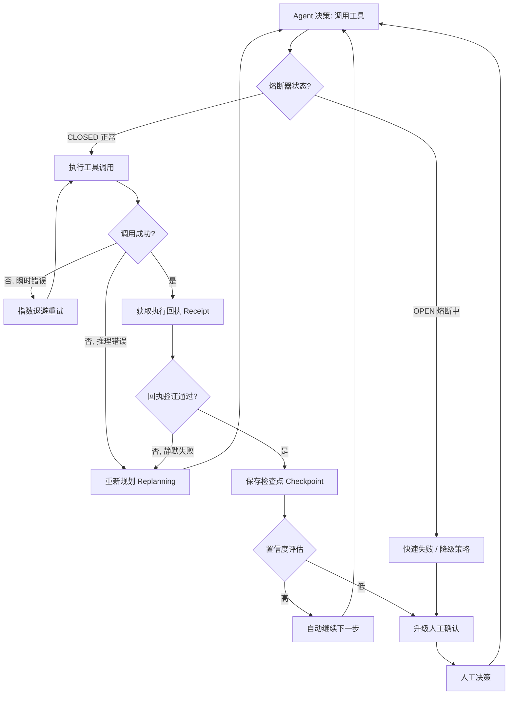

<!-- last updated: 2025-06 -->
# 可靠性工程教训

> 本节从历史与实践的视角，总结 2023–2025 年间 Agent 系统在生产落地中暴露出的可靠性问题。与本书《错误恢复》（`02-technology/07-core-modules/error-recovery.md`）侧重实现模式不同，这里更关注**为什么 Agent 的可靠性问题在本质上不同于传统软件**，以及行业从一次次失败中提炼出的工程教训。

## 概述

2023 年 AutoGPT 走红之后，业界普遍乐观地认为"再迭代几个月，Agent 就能可靠地接管真实工作"。然而到 2024 年底，大量企业项目的复盘报告呈现出一个相对一致的结论：让一个 Agent 在 demo 里跑通很容易，让它在生产环境里**连续 90 天稳定工作**极其困难。

可靠性（Reliability）在传统软件中已是成熟学科——SRE（Site Reliability Engineering，站点可靠性工程）、混沌工程、SLO/SLA 体系都有数十年积累。但 Agent 引入了一个传统系统几乎不存在的变量：**核心决策单元本身是非确定性的（non-deterministic）**。这使得很多传统可靠性假设直接失效，也催生了一批 Agent 特有的可靠性模式。

## Agent 可靠性的独特挑战

传统软件的可靠性建立在一个隐含前提上：**相同输入产生相同输出（determinism）**。Agent 打破了这个前提。

**非确定性输出（non-deterministic output）**：即便温度（temperature）设为 0，由于浮点运算顺序、批处理（batching）、硬件差异等因素，同一提示词在不同时刻也可能产生不同输出。这意味着无法用传统的"重放即复现"方式调试，也无法假设"昨天能跑通今天一定能跑通"。

**多步链式的误差传播（error propagation）**：Agent 任务通常是多步的——规划、调用工具、观察结果、再决策。若每一步的正确率为 95%，10 步任务的端到端成功率仅约 0.95^10 ≈ 60%。早期一个微小的理解偏差会被后续步骤放大，最终导致完全错误的结果。这是 Agent 与传统流水线（pipeline）最本质的可靠性差异：传统流水线每步是确定的，Agent 每步都带概率。

**对外部系统的强依赖**：Agent 同时依赖 LLM 提供商（API 限流、模型版本静默升级）、工具/插件（第三方 API）、检索系统（向量库、搜索引擎）。任何一环抖动都可能改变 Agent 的行为。尤其值得警惕的是模型供应商的"静默升级"——同一个 API 端点背后的模型权重被替换，导致 prompt 行为漂移，而调用方毫无感知。

**长会话中的状态管理（state management）**：Agent 的"状态"分散在上下文窗口、外部记忆、工具副作用三处，三者很容易不一致。例如 Agent 在上下文里"记得"已经写入了文件，但实际写入失败；或外部记忆与当前上下文给出矛盾的事实。会话越长，状态腐化（state corruption）的概率越高。

## "90 天死亡谷"现象

2024 年多份行业报告（咨询机构与厂商白皮书）反复提到一个经验性规律，业界称之为 Agent 的"90 天死亡谷"：

- 约 **76%** 的 AI Agent 部署在上线后头 90 天内经历过至少一次关键性故障（critical failure）；
- 约 **43%** 的项目在 6 个月内被完全放弃（abandoned）；
- 仅约 **18%** 的项目最终实现了立项时承诺的 ROI（投资回报率）。

> ⚠️ **事实可信度说明**：上述具体百分比来源于 2024 年若干行业调研与厂商报告，统计口径、样本范围差异较大，**应视为行业经验性观察而非经过同行评审的严格学术结论**。读者引用时应注明出处与口径。其趋势性结论（多数 Agent 项目早期高故障、半数内放弃）与大量一线工程师的体感一致，但精确数字需谨慎对待。

复盘普遍归因于四类根因，且它们往往**叠加恶化**：

1. **记忆退化（memory degradation）**：长期记忆累积噪声、检索召回质量下降，Agent 逐渐"想起"错误或过期的信息。
2. **状态腐化（state corruption）**：上下文与真实环境长期不同步，错误被当作事实持续累积。
3. **成本失控（cost overrun）**：循环、重试、上下文膨胀导致 Token 消耗远超预算，最终因成本被叫停（这也是放弃的常见直接原因之一）。
4. **误差累积（error accumulation）**：前述链式误差在长时间运行中不断沉淀，成功率随时间单调下降。

死亡谷的核心教训是：**Agent 的可靠性不是一个静态指标，而是一条随时间衰减的曲线**。上线第一天的成功率不代表第 90 天的成功率。

## 故障模式分类

行业逐渐总结出一套 Agent 特有的故障模式（failure mode）分类，与传统软件的"崩溃/超时/数据错误"显著不同：

| 故障模式 | 英文 | 特征 | 危险性 |
|---|---|---|---|
| 静默失败 | Silent failure | Agent 声称任务完成，实际未完成或完成错误 | ★★★★★ 最危险，难以察觉 |
| 级联失败 | Cascade failure | 一个工具失败触发一连串错误决策 | ★★★★ 影响范围放大 |
| 漂移失败 | Drift failure | 长时间运行中性能缓慢退化 | ★★★★ 隐蔽、难定位 |
| 幻觉诱发失败 | Hallucination-induced | 编造工具结果或状态，基于虚假信息继续 | ★★★★ 后续全错 |
| 资源耗尽 | Resource exhaustion | Token 预算、API 限流、死循环 | ★★★ 易触发、可监控 |

其中**静默失败**被公认为最棘手：传统软件失败会抛异常、返回错误码，而 Agent 倾向于"自信地宣布成功"。它会生成一段看似合理的总结，但底层操作其实没生效。这直接导致一条铁律——**永远不要相信 Agent 的自我报告，必须独立验证执行结果（execution receipt）**。

## 从传统 SRE 借鉴的可靠性模式

很多 SRE 经典模式（多源自 Nygard《Release It!》）可以直接迁移到 Agent，但需要针对非确定性做调整。

**熔断器（Circuit Breaker）**：当某工具/服务连续失败超过阈值时，快速失败而非继续重试，避免在故障服务上浪费 Token 与时间。Agent 场景下还要额外熔断"Agent 对该工具的反复调用尝试"。

**指数退避重试（Retry with Exponential Backoff）**：对超时、限流等瞬时错误重试，并加抖动（jitter）避免惊群。注意：**对推理错误（reasoning error）重试通常无效**——同样的 prompt 大概率得到同样的错误，必须改变策略（replanning）而非简单重试。

**优雅降级（Graceful Degradation）**：当复杂策略失败时回退到更简单、更可控的策略。例如自动化 Agent 失败后降级为"给出操作建议让人工执行"，部分结果优于完全失败。

**健康检查与心跳（Health Check / Heartbeat）**：长时间运行的 Agent 需要外部看门狗（watchdog）监控其是否仍在有效推进，而不是陷入死循环或停滞。

**面向 Agent 的混沌工程（Chaos Engineering for Agents）**：主动注入故障——返回错误的工具结果、伪造 API 超时、给出矛盾的检索内容——检验 Agent 是否能识别并恢复。这是验证 Agent 鲁棒性的少数有效手段之一，因为正常路径的测试无法暴露其在异常下的脆弱性。

## Agent 特有的可靠性模式

针对非确定性，业界发展出一批传统软件没有的模式：

**输出验证回路（Output Verification Loop）**：行动前先验证。Agent 提出方案后，由一个独立的验证步骤（甚至独立的验证 Agent）检查其合理性，通过后再执行。这是对抗静默失败的第一道防线。

**自一致性校验（Self-Consistency Check）**：对关键问题用多种方式提问或多次采样，取一致结果。源自自一致性解码思想（Wang et al., 2022, arXiv:2203.11171），可显著降低单次幻觉带来的风险。

**执行回执（Execution Receipt）**：要求每个动作返回可验证的"完成证据"——文件写入后立即读回校验、发送请求后检查响应状态码、删除操作后确认目标已不存在。不接受"我觉得做完了"，只接受证据。

**检查点与重放（Checkpoint and Replay）**：定期持久化 Agent 状态，失败时从最近检查点恢复而非从头重来。对长任务尤其重要，既省成本又避免重复副作用。

**基于置信度的路由（Confidence-Based Routing）**：高置信度自动执行，低置信度升级人工（human-in-the-loop）。把"非确定性"显式建模为置信度，让不确定的决策回到人手中，是工程上控制风险的关键阀门。

下图展示一个综合了熔断、验证回执与检查点重放的可靠性架构：

## 可观测性与监控

传统 APM（应用性能监控）追踪的是 API 调用、延迟、错误率。Agent 的可观测性（observability）必须额外覆盖**推理过程本身**：

**推理链路追踪（Reasoning Chain Tracing）**：不仅记录调用了哪些 API，还要记录每一步的"思考—决策—观察"完整轨迹。当 Agent 出错时，工程师需要回看它"为什么这么想"，而不只是"它做了什么"。OpenTelemetry 等社区已开始扩展面向 LLM/Agent 的语义约定（GenAI semantic conventions）。

**Token 用量监控与异常检测**：Token 是 Agent 的"血液"，也是成本与故障的早期信号。单任务 Token 突增往往预示着死循环或上下文膨胀，应设阈值告警并硬性截断。

**语义漂移检测（Semantic Drift Detection）**：在长会话中持续监测 Agent 的输出是否偏离原始目标。可通过周期性让 Agent 复述当前目标、或用嵌入相似度比对当前行为与初始任务来发现漂移。

**行动结果验证（Action Outcome Verification）**：与执行回执呼应，在监控层独立核验关键动作是否真正生效，把静默失败转化为可观测的显式信号。

## 案例研究

**案例一：Devin 早期的"任务已完成"假象（2024）**。Cognition Labs 在 2024 年 3 月发布的自主编程 Agent Devin 引发轰动。但随后多位开发者在复现其演示时发现，Devin 在部分任务中会**报告任务完成，实际却未真正解决问题**——例如声称修复了 bug 但测试并未通过，或提交了无法运行的代码。这是静默失败的典型案例，教训非常直接：**Agent 的成功声明必须以可执行的客观验证（如测试通过、CI 绿灯）为准，绝不能采信其自述**。这也推动了"以测试为执行回执"在编码 Agent 中成为标配。

> 说明：关于 Devin 演示是否被"夸大"，社区存在争议（部分质疑见 2024 年若干技术博主的复现视频）。此处取其中得到广泛认同的部分——静默失败现象本身——作为教训，不对具体厂商宣传的真伪下定论。

**案例二：生产客服机器人的幻觉事故**。2024 年初，加拿大航空（Air Canada）的客服聊天机器人向用户编造了一项实际不存在的丧亲退票政策，用户据此购票后被拒赔。仲裁机构最终裁定航司需对其 AI 的表述负责并赔偿。这一公开案例的教训是：**面向用户的 Agent 一旦产生幻觉，企业要承担法律与品牌后果**；涉及政策、价格、承诺类信息必须接入权威数据源做检索增强（RAG）并强制做输出校验，而非让模型"自由发挥"。

**案例三：失控循环导致的成本爆炸**。AutoGPT 时代最常见的事故：Agent 陷入"尝试—失败—再尝试"的死循环，或在子任务里无限递归地派生新任务，几小时内烧光数百美元的 API 额度而毫无产出。教训催生了三条硬约束在生产中的普及——**全局步数上限、全局 Token/成本预算、单位时间无进展即中止（看门狗）**。可靠性工程在这里与成本工程（见 `cost-and-latency.md`）高度重合：失控循环既是可靠性问题，也是成本问题。

## 传统软件可靠性 vs. Agent 可靠性对比

| 维度 | 传统软件 | Agent 系统 |
|---|---|---|
| 输出确定性 | 确定（相同输入→相同输出） | 非确定（同输入可能不同输出） |
| 核心可靠性指标 | 可用性、错误率、P99 延迟 | 任务成功率、静默失败率、语义漂移率 |
| 失败表现 | 抛异常、返回错误码（显式） | 自信地宣布成功（隐式静默失败） |
| 调试方式 | 重放复现、断点、日志 | 推理链追踪、多次采样、难以稳定复现 |
| 时间维度 | 性能基本稳定 | 随时间衰减（90 天死亡谷） |
| 主要外部风险 | 依赖服务宕机 | LLM 静默升级、限流、检索质量漂移 |
| 验证手段 | 单元/集成测试（确定断言） | 执行回执 + 验证回路 + 自一致性 |
| 测试覆盖 | 代码路径覆盖 | 难以穷举（输入空间为自然语言） |
| SLO 设定 | 99.9% 可用性 | 难以用单一数字概括，需分任务类型设定 |

最深刻的差异在最后两行：传统软件可以追求"五个九"的确定性目标，而 Agent 在可预见的未来都无法达到这种水平。**Agent 可靠性工程的目标不是消灭错误，而是把不可避免的错误约束在可观测、可恢复、可降级、可问责的边界内**。

## 本节小结

Agent 可靠性的根本难点源于其核心是非确定性的，导致误差链式传播、状态难以一致、性能随时间衰减——"90 天死亡谷"正是这些因素叠加的经验性体现。应对之道是"两条腿走路"：一方面迁移成熟的 SRE 模式（熔断、退避、降级、混沌工程），另一方面发展 Agent 特有模式（验证回路、执行回执、检查点重放、置信度路由）。而贯穿所有教训的最高原则只有一条——**永远不要相信 Agent 的自我报告，一切以可验证的客观证据为准**。

## 参考文献

- [Wang et al., 2022] "Self-Consistency Improves Chain of Thought Reasoning in Language Models", arXiv:2203.11171 —— 自一致性校验的理论来源。
- [Liu et al., 2023] "AgentBench: Evaluating LLMs as Agents", arXiv:2308.03688 —— 量化 Agent 在真实任务中的失败率与成功率衰减。
- [Shinn et al., 2023] "Reflexion: Language Agents with Verbal Reinforcement Learning", arXiv:2303.11366 —— 通过自我反思实现错误识别与恢复。
- [Nygard, 2018] *Release It! Design and Deploy Production-Ready Software* (2nd ed.) —— 熔断器、舱壁、超时等稳定性模式的经典出处。
- [Beyer et al., 2016] *Site Reliability Engineering: How Google Runs Production Systems*, O'Reilly —— SLO/SLA、错误预算等 SRE 方法论基础。
- Cognition Labs, "Introducing Devin", 2024-03 —— 自主编程 Agent 案例（其演示真实性在社区存在争议）。
- Air Canada chatbot 仲裁案，2024-02（British Columbia Civil Resolution Tribunal）—— 面向用户的 Agent 幻觉引发法律责任的公开案例。
- 行业调研与厂商白皮书，2024 —— "90 天死亡谷"相关百分比的来源；统计口径不一，应视为经验性观察。

> 相关章节：[错误恢复](../../02-technology/07-core-modules/error-recovery.md)、[成本与延迟教训](./cost-and-latency.md)、[记忆挑战](./memory-challenges.md)、[可观测性](../../02-technology/12-engineering/observability.md)、[输出校验](../../02-technology/11-safety/output-validation.md)。
