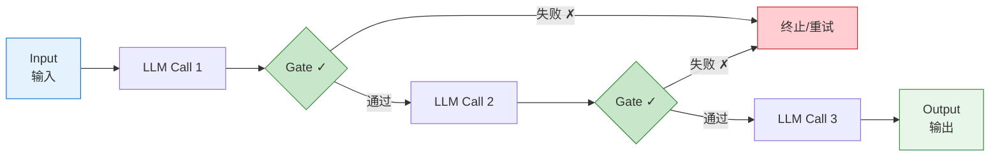
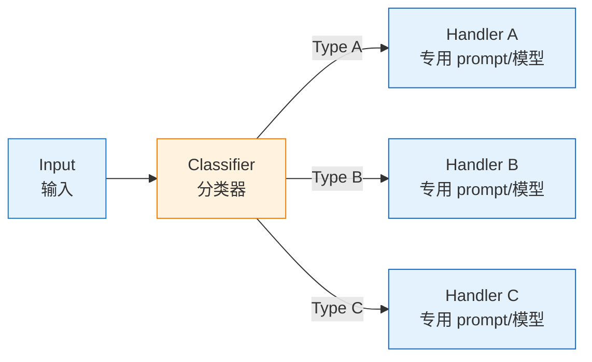
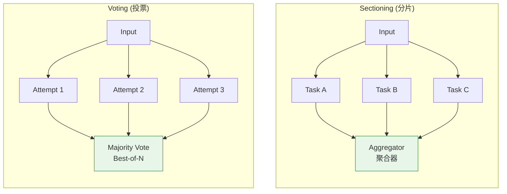
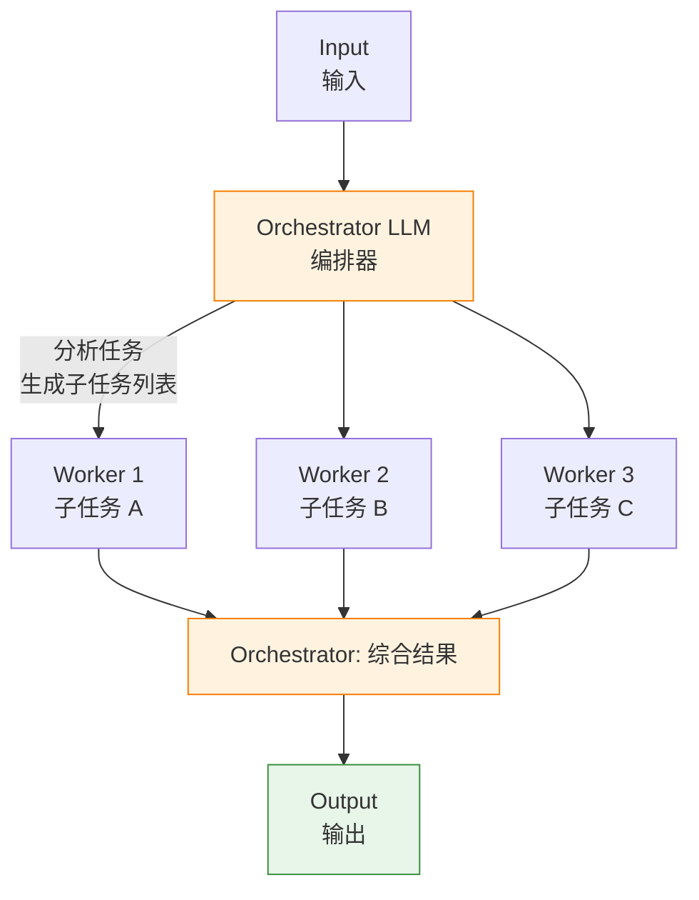
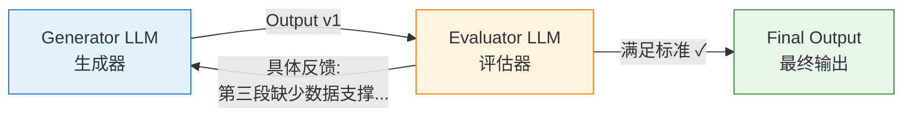
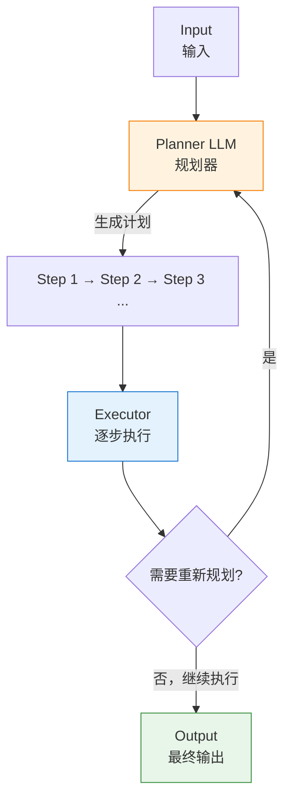
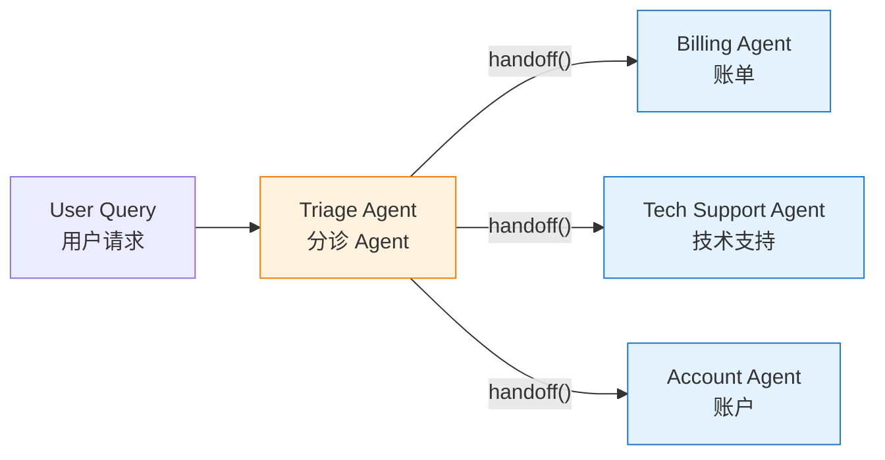
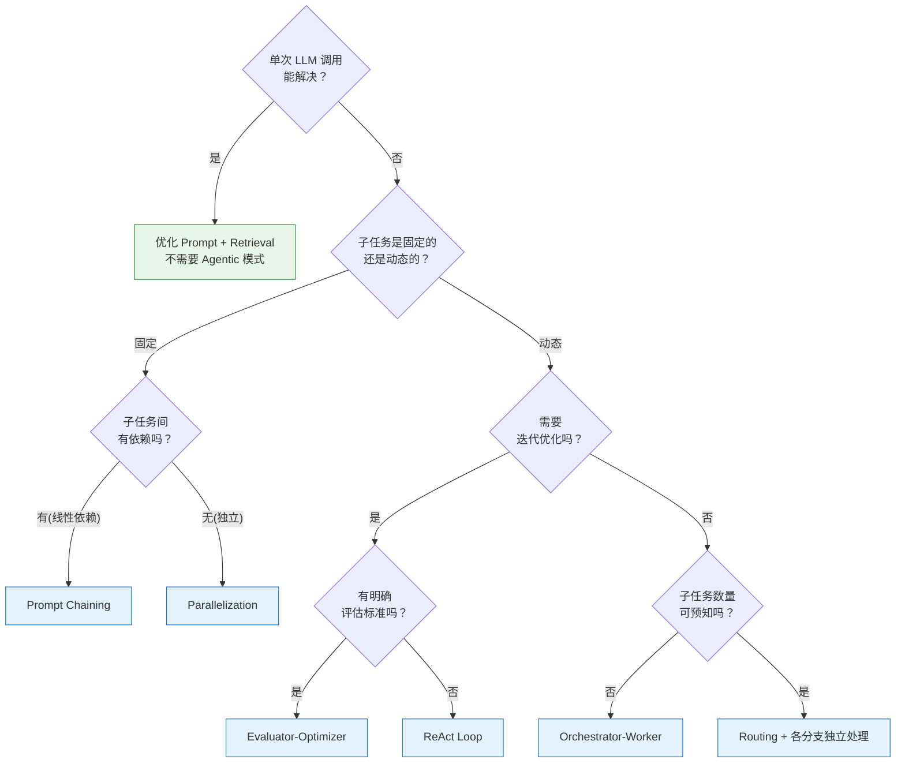

<!-- last updated: 2025-06 -->
# Agentic 模式总论

> 从"调用一次 LLM"到"构建 Agent 系统"，中间的关键桥梁是**模式（Pattern）**——一组可复用、可组合的架构方案。本文系统梳理当前主流的 Agentic 模式谱系，覆盖从最简单的 Prompt Chaining 到复杂的 Multi-Agent Collaboration，为工程师提供选型与实现的全景参考。

---

## 1. 什么是 Agentic 模式

### 1.1 Agentic：一个程度问题

Andrew Ng 在 2024 年 3 月 Sequoia Capital AI Ascent 演讲中明确指出：**Agentic 不是二元判断，而是一个程度（spectrum）问题**。一个系统从"零次迭代的单轮 LLM 调用"到"完全自主的多步循环执行"，其间存在大量中间形态。我们不必争论一个系统"是不是 Agent"，而应该问"它有多 Agentic"。

判断 Agentic 程度的几个维度包括：是否有迭代循环、是否能调用外部工具、是否能自主规划步骤、是否有多个 LLM 协同。这些维度的叠加构成了从简单到复杂的连续谱系。

### 1.2 模式的含义

"模式（Pattern）"借鉴自软件工程中的"设计模式"概念——它是在特定上下文中反复出现的问题及其解决方案的抽象描述。Agentic 模式回答的核心问题是：**当我需要用 LLM 完成一个超出单次调用能力的任务时，应该如何组织多次调用之间的关系？**

正如 GoF 设计模式让面向对象编程有了共同语言，Agentic 模式让 Agent 工程师有了共同的架构词汇。

### 1.3 为什么模式重要

Anthropic 在 2024 年 12 月发布的《Building Effective Agents》中开篇就强调：**"最成功的实现都使用了简单、可组合的模式，而非复杂的框架。"** 模式的意义在于：

- **降低复杂度**：将 Agent 系统分解为可理解的积木块
- **指导选型**：不同任务特征对应不同模式，避免过度工程
- **支持组合**：模式可以像乐高一样嵌套组合，构建复杂系统
- **促进沟通**：团队有了共同的架构语言

---

## 2. 模式谱系总览

从简单到复杂，Agentic 模式的演进可以用以下层次结构来描述：

```mermaid
graph LR
    subgraph basic["基础模式 Basic"]
        PC["Prompt Chaining<br/>提示链"]
        RT["Routing<br/>路由"]
        PL["Parallelization<br/>并行化"]
    end
    subgraph advanced["进阶模式 Advanced"]
        OW["Orchestrator-Worker<br/>编排-执行"]
        EO["Evaluator-Optimizer<br/>评估-优化"]
    end
    subgraph autonomous["自主模式 Autonomous"]
        RL["ReAct Loop<br/>推理-行动循环"]
        PE["Plan-and-Execute<br/>规划-执行"]
        RF["Reflexion<br/>反思"]
    end
    subgraph collab["协作模式 Collaboration"]
        DB["Debate/Discussion<br/>辩论"]
        RP["Role-Playing<br/>角色扮演"]
        HO["Handoff<br/>移交"]
    end

    basic -.->|"复杂度递增"| advanced
    advanced -.->|"复杂度递增"| autonomous
    autonomous -.->|"复杂度递增"| collab

    style basic fill:#E3F2FD,stroke:#1976D2
    style advanced fill:#FFF3E0,stroke:#F57C00
    style autonomous fill:#E8F5E9,stroke:#388E3C
    style collab fill:#FCE4EC,stroke:#C2185B
```



> 📌 所有模式都建立在 **Augmented LLM**（LLM + Retrieval + Tools + Memory）基础之上。复杂度从左到右递增——基础模式为预定义 Workflow，自主模式将控制权交给 LLM。

**演进逻辑**：基础模式是预定义的线性或并行 Workflow，控制流由代码决定；进阶模式引入动态分解和迭代优化；自主模式将控制权交给 LLM 自身；协作模式让多个 Agent 相互协作。

Anthropic 将前五种（Prompt Chaining、Routing、Parallelization、Orchestrator-Worker、Evaluator-Optimizer）归为 **Workflow**（预定义代码路径编排 LLM），将自主循环归为 **Agent**（LLM 动态指导自身流程）。这是一个关键的架构分界线。

---

## 3. 基础模式详解

### 3.1 Prompt Chaining（提示链）

**是什么**：将一个复杂任务分解为多个线性的 LLM 调用序列，每个调用处理前一个的输出。步骤之间可以插入程序化检查（Gate），确保中间结果符合预期后再继续。

**为什么**：单次 LLM 调用处理复杂任务时容易出错或遗漏。将任务拆成多个简单子任务，每次调用只需完成一个明确的小任务，准确率显著提升。本质上是**用延迟换准确性**。

**什么时候用**：

- 任务可以明确地分解为固定的线性步骤
- 前一步的输出是后一步的必要输入
- 每个子任务的边界清晰，不需要动态判断
- 需要在步骤间加入验证逻辑

**怎么实现**：



核心实现要点：每个步骤定义清晰的输入/输出 Schema；Gate 可以是简单的格式检查、关键词匹配，也可以是另一个 LLM 调用；失败时的策略（重试、回退、终止）需要预先定义。

**工程类比**：Unix Pipeline（`cat file | grep pattern | sort | uniq`）、函数组合（`compose(f, g, h)`）、ETL 数据处理流水线。

**典型示例**：生成营销文案 → 翻译为目标语言 → 质量审核；生成文档大纲 → 检查大纲是否满足标准 → 基于大纲生成全文。

### 3.2 Routing（路由）

**是什么**：对输入进行分类，然后将其导向不同的专门化处理分支。每个分支可以有独立的 Prompt、Tools、甚至不同的模型。

**为什么**：不同类型的输入往往需要完全不同的处理策略。将所有情况塞进一个 Prompt 会导致"关注点耦合"——优化一种输入的处理效果时，可能伤害其他输入类型的效果。Routing 实现了关注点分离。

**什么时候用**：

- 输入存在明确可区分的类型
- 不同类型需要截然不同的处理逻辑（不同 Prompt、不同工具集、甚至不同模型）
- 分类准确率可以做到足够高（无论用 LLM 还是传统分类器）

**怎么实现**：



分类器可以是：LLM 做 few-shot classification、fine-tuned 小模型、基于规则的分类器、甚至简单的关键词匹配。关键是分类逻辑要快、准、成本低。

**工程类比**：API Gateway 的路由机制、消息队列中的 Topic Routing、微服务架构中的服务发现与分发。

**典型示例**：客服系统将查询分为"常规问题/退款请求/技术支持"走不同流程；将简单问题路由到 Haiku 等小模型、复杂问题路由到 Sonnet/Opus 等大模型以优化成本。

### 3.3 Parallelization（并行化）

**是什么**：多个 LLM 调用同时执行，结果通过程序化方式聚合。有两种核心变体：

- **Sectioning（分片）**：将任务拆为多个独立子任务并行执行，每个子任务处理不同方面
- **Voting（投票）**：同一任务用相同或不同 Prompt 执行多次，通过投票/聚合选出最优结果

**为什么**：对于 Sectioning，独立子任务并行执行可以大幅降低延迟；对于 Voting，多次独立执行可以降低单次调用的随机性风险，提高结果可靠性。Anthropic 特别指出：对于多维度判断任务，让每个 LLM 调用聚焦单一维度通常比一个调用同时处理多个维度效果更好。

**什么时候用**：

- Sectioning：子任务之间没有数据依赖，可以独立执行
- Voting：任务的正确性至关重要，单次调用的置信度不够高
- 需要多角度/多维度评估时

**怎么实现**：



Aggregator 的策略：简单拼接、加权合并、取交集/并集等。Voting 的判断策略：多数投票、置信度加权、任一触发（用于安全审核）。

**工程类比**：MapReduce 中的 Map 阶段、并发 HTTP 请求扇出（Fan-out）、分布式系统中的 Quorum 读。

**典型示例**：

- Sectioning：内容生成与内容审核并行；多个 Eval 维度（准确性、流畅性、完整性）分别评估
- Voting：代码安全审查用多个不同角度的 Prompt 分别检查，任一发现问题即标记；内容是否违规用多个评判器投票

---

## 4. 进阶模式详解

### 4.1 Orchestrator-Worker（编排-执行）

**是什么**：一个中央 Orchestrator LLM 接收任务后，动态分析并分解为若干子任务，分配给多个 Worker LLM 执行，最后综合 Worker 的结果生成最终输出。

**为什么**：与 Parallelization 的关键区别在于——子任务不是预先定义的，而是由 Orchestrator 根据输入动态生成的。现实中很多复杂任务的分解方式无法提前预知：修改一个 Bug 可能涉及 2 个文件也可能涉及 20 个文件；一次信息搜集可能需要查 3 个源也可能需要查 10 个源。

**什么时候用**：

- 任务复杂度和子任务数量不可预知
- 需要根据输入内容灵活决定分解策略
- 子任务之间相对独立，可以并行或串行分配给 Worker
- 需要一个中央节点做全局协调和结果综合

**怎么实现**：



实现要点：Orchestrator 的 Prompt 要明确说明如何分解任务、如何描述子任务；Worker 可以是相同配置也可以针对不同子任务类型使用不同配置；Orchestrator 最终需要能够判断所有 Worker 结果是否充分回答了原始问题。

**工程类比**：分布式计算中的 Master-Worker 模式、Job Scheduler（如 Airflow 动态生成 DAG）、微服务中的 Saga 编排器。

**典型示例**：编码 Agent 接收"重构认证模块"的指令，Orchestrator 分析后决定修改 auth.py、tests/test_auth.py、config.yaml 三个文件，分别分配给 Worker；多源信息搜集，Orchestrator 决定需要查哪些数据源，分配给 Worker 分别检索。

### 4.2 Evaluator-Optimizer（评估-优化）

**是什么**：一个 Generator LLM 生成内容，另一个 Evaluator LLM 对生成结果进行评估并提供具体反馈，Generator 根据反馈改进输出。这个过程循环迭代直到满足质量标准或达到最大迭代次数。

**为什么**：很多任务的输出质量需要迭代打磨——第一版往往不够好，但在明确反馈下可以持续改进。这模拟了人类"写作-审稿-修改"的工作模式。关键前提是：必须有明确的评估标准，且 LLM 能够基于这些标准给出有建设性的反馈。

**什么时候用**：

- 有清晰的、可表述的质量评估标准
- 迭代改进能产生可衡量的质量提升
- 人类审稿人能清晰表达反馈时，LLM 也能模拟这种反馈
- 对输出质量要求高，可以接受额外延迟

**怎么实现**：



> 终止条件：Evaluator 判断"满足标准" OR 达到最大迭代次数 N

实现要点：Evaluator 的 Prompt 中要包含明确的评估维度和标准；反馈要具体、可操作（不是"不好"而是"第三段缺少数据支撑"）；设置合理的最大迭代次数（通常 3-5 轮）防止无限循环。

**工程类比**：编译器优化的多 Pass 架构、CI/CD 中的代码审查循环、A/B 测试的迭代优化。

**典型示例**：文学翻译（翻译 → 评审信达雅 → 修改 → 再评审）；代码生成（生成代码 → 运行测试 → 根据失败用例修改）；复杂搜索（搜索 → 评估结果是否充分 → 补充搜索）。

---

## 5. 自主模式详解

自主模式的标志性特征是：**控制流由 LLM 自身驱动**，而非由预定义的代码路径决定。LLM 在循环中自主决定下一步做什么、何时停止。

### 5.1 ReAct Loop（推理-行动循环）

**是什么**：ReAct（Reasoning + Acting）模式让 LLM 交替进行推理和行动。每一步中，LLM 先生成一段思维过程（Thought），然后决定执行一个动作（Action），观察动作结果（Observation），再基于观察进行下一轮思考。

**核心公式**：`Thought → Action → Observation → Thought → Action → Observation → ... → Final Answer`

**来源**：[Yao et al., 2023] ReAct: Synergizing Reasoning and Acting in Language Models. ICLR 2023.

**为什么**：纯推理（Chain-of-Thought）缺乏与外部世界的交互，容易产生幻觉；纯行动（直接调用工具）缺乏高层规划能力。ReAct 将两者结合：推理帮助 Agent 规划和解释行动，行动帮助 Agent 获取真实信息来支撑推理。

**什么时候用**：

- 需要多步推理且中间需要获取外部信息
- 任务无法一步完成，需要工具调用来获取环境反馈
- 步骤数量不确定，需要根据中间结果动态决定
- 目前绝大多数 Agent 框架的默认模式

**怎么实现**：

```python
while not done:
    thought = llm.generate(context + "Thought:")    # 推理当前状态
    action = llm.generate(context + "Action:")      # 决定下一步动作
    observation = execute(action)                    # 执行并观察结果
    context += thought + action + observation       # 更新上下文
    if is_final_answer(thought):
        done = True
```

**关键设计考量**：工具集的设计和文档质量直接决定 Agent 效果；需要设置最大迭代次数防止无限循环；每步获取"真实信息"（如工具返回值、代码执行结果）是 Agent 保持正确的关键。

### 5.2 Plan-and-Execute（规划-执行）

**是什么**：Agent 先生成一个完整的多步计划（Plan），然后逐步执行计划中的每个步骤。执行过程中可以根据实际情况修正（Re-plan）原始计划。

**与 ReAct 的区别**：ReAct 是"走一步看一步"的增量式推进；Plan-and-Execute 是"先规划全局，再分步落实"。后者更适合需要全局视角的复杂任务。

**来源**：受 Plan-and-Solve [Wang et al., 2023] 论文和 Baby-AGI 项目启发，在 LangGraph 框架中有成熟的参考实现。

**什么时候用**：

- 任务步骤间有复杂依赖关系，需要全局规划
- 任务较长，纯 ReAct 模式容易在中途迷失方向
- 可以用强模型做规划、弱模型做执行以优化成本
- 需要向用户展示执行计划以获取确认

**怎么实现**：



**关键设计考量**：规划粒度要适中——太粗则执行时仍需大量判断，太细则规划本身容易出错；Re-plan 的触发条件要明确定义；Planning 和 Execution 可以使用不同大小的模型。

### 5.3 Reflexion（反思）

**是什么**：Agent 执行任务后进行自我评估，将失败经验以自然语言形式总结并存入记忆（Episodic Memory），在下次尝试时将这些经验作为额外上下文，指导更好的决策。核心理念是**将环境反馈转化为可复用的语言化经验**。

**来源**：[Shinn et al., 2023] Reflexion: Language Agents with Verbal Reinforcement Learning. NeurIPS 2023.

**为什么**：传统 RL 通过更新模型权重来学习，但 LLM 的权重在推理时是冻结的。Reflexion 提出了一种"不更新权重"的学习方式——通过维护一个反思记忆缓冲区，让 Agent 在多次尝试中积累经验。这相当于给 LLM 一个可持续积累的"错题本"。

**什么时候用**：

- 允许多次尝试的任务（如代码生成可以多次提交直到通过测试）
- 有明确的成功/失败信号（如测试通过/失败、答案正确/错误）
- 失败原因可以通过语言来表述和传递
- 单次尝试的成功率不够高，但多次迭代可以显著提升

**怎么实现**：

```
Memory = []
for episode in range(max_attempts):
    result = agent.execute(task, memory=Memory)
    if success(result):
        return result
    reflection = agent.reflect(task, result, feedback)  # "上次失败因为..."
    Memory.append(reflection)
```

**与 Evaluator-Optimizer 的区别**：Evaluator-Optimizer 在单次任务内迭代，由外部 Evaluator 提供反馈；Reflexion 跨多次独立尝试积累经验，由 Agent 自身进行反思。两者可以结合使用。

---

## 6. 协作模式详解

### 6.1 Debate / Discussion（辩论）

**是什么**：多个 Agent 实例持不同立场或角色，对同一问题展开辩论或讨论，通过多轮交互逐步收敛到更高质量的共识结论。

**为什么**：单一 LLM 调用容易受 Prompt 措辞影响产生偏见。让多个"思维角度"相互质疑和补充，可以发现单一视角的盲区，得到更平衡、更全面的结论。这模拟了学术界的同行评议和法庭的对抗辩论机制。

**什么时候用**：

- 需要多角度分析的决策问题
- 单一 LLM 输出容易有偏差或遗漏
- 问题没有标准答案，需要权衡多种观点
- 对结论的可靠性要求高

**怎么实现**：定义多个 Agent 各持不同立场或关注不同方面；设置辩论规则（如轮流发言、必须回应对方观点）；设置收敛条件（达成共识、固定轮数、由仲裁者判定）。

### 6.2 Role-Playing（角色扮演）

**是什么**：多个 Agent 扮演不同的专业角色（如产品经理、架构师、开发工程师、测试工程师），按照预定义的协作流程共同完成复杂任务。每个 Agent 有明确的职责边界和输出规范。

**代表工作**：

- [Hong et al., 2023] MetaGPT: Meta Programming for Multi-Agent Collaborative Framework。让多个 Agent 扮演软件公司的不同角色，通过结构化的 SOP 协作完成软件开发。
- [Li et al., 2023] CAMEL: Communicative Agents for "Mind" Exploration of Large Language Model Society. NeurIPS 2023。通过 inception prompting 引导角色扮演 Agent 自主协作。

**什么时候用**：

- 任务涉及多个专业领域的知识
- 存在成熟的人类协作流程可以模拟
- 需要模拟完整的工作流水线（如需求→设计→编码→测试）
- 希望通过角色约束来提高输出的专业性

**怎么实现**：每个 Agent 定义角色描述、能力范围、输出格式；定义角色间的通信协议和工作流顺序；使用结构化的 SOP（Standard Operating Procedure）约束协作过程。

### 6.3 Handoff（移交）

**是什么**：一个 Agent 在执行过程中识别到当前任务超出自身能力或不属于自身职责范围时，将对话上下文和任务控制权移交给另一个更合适的 Agent。

**代表实现**：OpenAI Agents SDK（2025 年 3 月发布）将 Handoff 作为三大核心原语之一（Agent、Handoff、Guardrail）。Handoff 在 LLM 视角被表示为一个工具调用（如 `transfer_to_refund_agent`），使得移交决策由模型自主做出。

**什么时候用**：

- 系统需要覆盖多个专业领域（如客服系统的不同部门）
- 单个 Agent 的 Prompt 和工具集无法覆盖所有场景
- 需要细粒度的权限控制（不同 Agent 可访问不同工具）
- 需要在运行时动态决定由谁来处理

**怎么实现**：



每个 Agent 定义自己的 handoff 目标列表；Handoff 时传递完整的对话历史；接收方 Agent 基于上下文无缝接续服务。

**与 Routing 的区别**：Routing 在一开始就分发，且分发逻辑固定；Handoff 可以在对话的任何环节发生，由当前 Agent 自主判断是否需要移交。

---

## 7. 模式选择决策框架

### 7.1 核心原则：从简单开始

Anthropic 的建议非常明确：**先寻找最简单的解决方案，只在有证据表明更复杂方案确实带来改进时才增加复杂度。** 很多场景下，一个优化良好的单次 LLM 调用（配合 Retrieval 和 Few-shot Examples）就足够了。

### 7.2 决策矩阵

根据任务的两个核心维度——**结构确定性**和**复杂度**——可以构建如下决策矩阵：

| | 低复杂度 | 中等复杂度 | 高复杂度 |
|---|---|---|---|
| **高确定性**（步骤已知） | Prompt Chaining | Parallelization + Chaining | Orchestrator-Worker |
| **中等确定性**（类型已知） | Routing | Routing + Evaluator-Optimizer | Plan-and-Execute |
| **低确定性**（开放式） | 单次调用 + 工具 | ReAct Loop | ReAct + Reflexion + Multi-Agent |

### 7.3 决策树



### 7.4 模式组合

现实系统几乎从不只用单一模式。模式的组合方式包括：

- **嵌套**：Routing 的某个分支内部使用 Prompt Chaining
- **层叠**：Orchestrator-Worker 的 Worker 内部各自运行 ReAct Loop
- **包裹**：整个系统外层套 Evaluator-Optimizer 做质量把关

---

## 8. 模式组合实例

### 8.1 Devin（AI 软件工程师）

Devin 是 Cognition AI 推出的自主编码 Agent，其架构可以分析为多种模式的组合：

- **Plan-and-Execute**：接收编码任务后先生成实施计划，然后逐步执行
- **ReAct Loop**：每个执行步骤中，通过工具调用（编辑器、终端、浏览器）获取环境反馈，决定下一步
- **Reflexion**：测试失败后分析错误原因，积累调试经验指导后续修改
- **Evaluator-Optimizer**：代码生成后运行测试，根据测试结果迭代修改

这种组合的效果：Plan-and-Execute 提供全局方向，ReAct 提供灵活的逐步执行，Reflexion 让 Agent 从错误中学习，Evaluator-Optimizer 确保输出质量。

### 8.2 智能客服系统

一个典型的企业级智能客服系统的模式组合：

- **Routing**：首先对用户查询分类（售前咨询/售后服务/技术支持/投诉建议）
- **Handoff**：各分支由专门的 Agent 处理，发现超出能力范围时移交
- **Prompt Chaining**：在每个分支内，按"理解问题→查询知识库→生成回复→格式化输出"的链式流程处理
- **Human-in-the-loop**：Agent 置信度低于阈值时，升级到人工坐席

这种组合保证了：不同类型问题得到专业化处理，处理流程可控且可追踪，复杂情况能平滑升级。

### 8.3 代码审查系统

一个自动化 Code Review 系统的模式组合：

- **Parallelization (Sectioning)**：将代码变更分别从安全性、性能、可维护性、业务逻辑等维度并行审查
- **Parallelization (Voting)**：对安全相关的发现使用多个 Prompt 交叉验证，减少误报
- **Evaluator-Optimizer**：初步审查结果经过一轮"自审"，过滤掉低质量评论
- **Orchestrator-Worker**：对于大型 PR，先由 Orchestrator 分析变更结构，决定哪些文件需要重点审查

这种组合兼顾了审查的全面性（多维度并行）、可靠性（投票减少误报）和效率（动态分配注意力）。

---

## 9. 参考文献

- [Anthropic, 2024] Building Effective Agents. https://www.anthropic.com/research/building-effective-agents
- [Andrew Ng, 2024] Agentic Design Patterns. Sequoia Capital AI Ascent Keynote, March 2024. https://www.deeplearning.ai/courses/agentic-ai
- [Yao et al., 2023] ReAct: Synergizing Reasoning and Acting in Language Models. ICLR 2023. https://arxiv.org/abs/2210.03629
- [Shinn et al., 2023] Reflexion: Language Agents with Verbal Reinforcement Learning. NeurIPS 2023. https://arxiv.org/abs/2303.11366
- [OpenAI, 2025] A Practical Guide to Building Agents. https://cdn.openai.com/business/a-practical-guide-to-building-agents.pdf
- [Hong et al., 2023] MetaGPT: Meta Programming for Multi-Agent Collaborative Framework. https://arxiv.org/abs/2308.00352
- [Li et al., 2023] CAMEL: Communicative Agents for "Mind" Exploration of Large Language Model Society. NeurIPS 2023. https://arxiv.org/abs/2303.17760
- [Wang et al., 2023] Plan-and-Solve Prompting: Improving Zero-Shot Chain-of-Thought Reasoning by Large Language Models. ACL 2023. https://arxiv.org/abs/2305.04091
- [LangGraph] Plan-and-Execute Agents. https://www.langchain.com/blog/planning-agents
- [OpenAI, 2025] OpenAI Agents SDK. https://github.com/openai/openai-agents-python
