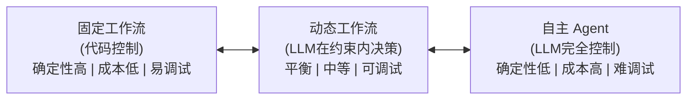
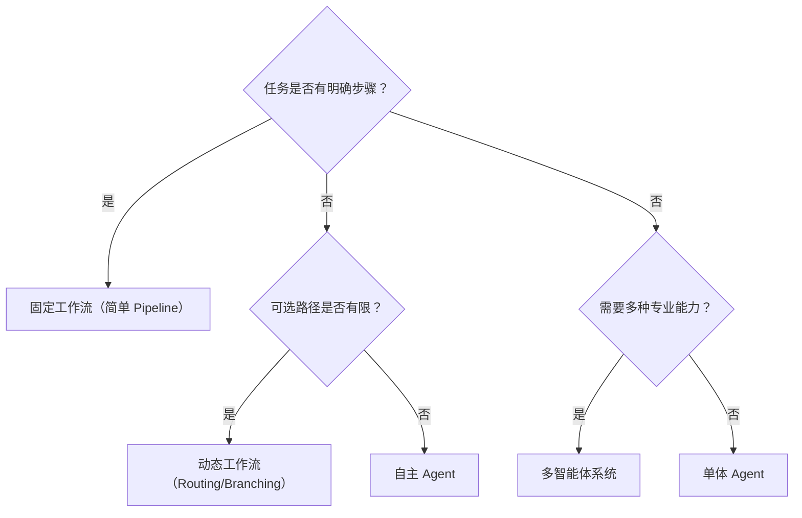

<!-- last updated: 2025-06 -->
# Agent 分类学

> 对 Agent 进行系统性分类，帮助工程师在面对具体需求时快速定位所需的 Agent 类型和架构选型。

## 1. 为什么需要分类

Agent 领域概念繁多、命名混乱。同一类系统在不同论文和产品中可能叫不同名字，不同类系统有时又共用相似的名称。建立一套多维度的分类体系，有助于：
- 在设计阶段快速做架构决策
- 理解不同框架的设计哲学差异
- 在论文和产品文档之间建立概念映射

需要强调：**分类不是互斥的**。一个实际的 Agent 系统往往同时属于多个类别——比如一个"多智能体协作的代码生成 Agent"同时涉及应用领域分类、组织结构分类和自主程度分类。

## 2. 按自主程度分类

这是最核心的分类维度，对应前文讨论的"自主性光谱"。

### 2.1 固定工作流（Fixed Workflow）

LLM 嵌入在预定义的代码流程中，执行路径在编写时已确定。LLM 的作用是在固定节点上完成文本生成、摘要、分类等子任务，但不控制整体流程走向。

特征：确定性强、可预测、易测试、成本可控。

典型示例：RAG Pipeline、Prompt Chain、传统 NLP Pipeline 中嵌入 LLM 节点。

### 2.2 动态工作流（Dynamic Workflow / Agentic Workflow）

流程结构预先设计，但执行路径由 LLM 在运行时动态选择。LLM 在预设的决策点上做出路由选择，但可选的路径是有限的、预定义的。

特征：半确定性、灵活但受控、适合业务流程自动化。

典型示例：Anthropic 所说的 "Workflow"（Routing、Parallelization、Evaluator-Optimizer 等模式）。

### 2.3 自主 Agent（Autonomous Agent）

LLM 完全掌控执行流程——自主决定下一步做什么、使用什么工具、何时停止。没有预定义的路径，Agent 根据当前状态和目标动态生成执行计划。

特征：高灵活性、不可预测路径、高成本、需要安全护栏。

典型示例：AutoGPT、Devin、Claude Computer Use。

### 2.4 光谱总结

## 3. 按组织结构分类

### 3.1 单体 Agent（Single Agent）

一个 LLM 实例承担所有角色——规划、执行、反思、纠错。通过一个统一的 System Prompt 定义其行为。

优势：简单、延迟低、无通信开销。
局限：Prompt 过长时能力下降、难以处理需要多种专业能力的复杂任务。

### 3.2 多智能体系统（Multi-Agent System）

多个 Agent 实例协作完成任务，每个 Agent 有独立的角色定义、专业能力和记忆空间。

子分类：
- **层级式（Hierarchical）**：有 Orchestrator/Manager Agent 负责分配和协调
- **对等式（Peer-to-Peer）**：Agent 之间平等协作、通过消息传递沟通
- **辩论式（Debate/Discussion）**：多个 Agent 对同一问题提出不同观点，通过辩论收敛
- **流水线式（Pipeline）**：Agent 按顺序处理，前一个的输出是后一个的输入

详见 [08. Multi-Agent 系统](../08-multi-agent/_index.md)。

### 3.3 Agent 集群/群体（Swarm）

大量 Agent 通过简单规则涌现出复杂行为，类似自然界中的蚁群或鸟群。OpenAI 的 Swarm 框架即探索了这一方向。

特征：去中心化、涌现行为、适合高并发任务分配。

## 4. 按应用领域分类

### 4.1 代码 Agent（Coding Agent）

专注于软件开发任务：代码生成、Bug 修复、重构、测试编写、PR 审核等。

代表：Devin、GitHub Copilot Workspace、Cursor Agent、Replit Agent、SWE-agent。

### 4.2 研究 Agent（Research Agent）

执行信息搜索、文献综述、数据分析、报告撰写等知识密集型任务。

代表：GPT-Researcher、Perplexity（广义）、Deep Research（OpenAI/Google）。

### 4.3 数据分析 Agent（Data Agent）

处理数据探索、SQL 生成、可视化、统计分析等数据相关任务。

代表：Code Interpreter（ChatGPT）、各类 Text-to-SQL Agent。

### 4.4 自动化 Agent（Automation Agent）

执行 Web 操作、表单填写、工作流自动化等 RPA 类任务。

代表：Browser Use、Claude Computer Use、各类 Web Agent。

### 4.5 对话 Agent（Conversational Agent）

以对话交互为主要形态，处理客服、销售、咨询等场景。

代表：各类客服 Agent、销售 SDR Agent。

### 4.6 创意 Agent（Creative Agent）

生成文案、图片、视频、音乐等创意内容。

代表：各类内容生成 Agent、设计 Agent。

### 4.7 具身 Agent（Embodied Agent）

有物理载体（机器人）或虚拟世界载体（游戏 NPC），能感知和操作物理/虚拟环境。

代表：Figure（机器人）、游戏 NPC Agent、Minecraft Agent（Voyager）。

## 5. 按决策机制分类

这一分类源自经典 AI 理论，在 LLM Agent 语境中依然适用。

### 5.1 反应式 Agent（Reactive Agent）

基于当前输入直接产生行动，不维护内部状态或进行规划。

LLM 语境类比：单轮 Prompt → Response，无记忆、无多步推理。

### 5.2 审议式 Agent（Deliberative Agent）

维护世界模型，通过推理和规划来决定行动。先思考、后行动。

LLM 语境类比：CoT 推理 + 多步规划 + 执行前验证。

### 5.3 混合式 Agent（Hybrid Agent）

结合反应层和审议层——快速反应处理简单情况，复杂情况触发深度推理。

LLM 语境类比：Router 先做快速分类，复杂查询走深度规划路径。这也是当下生产环境中最常见的模式。

## 6. 按执行时间跨度分类

### 6.1 即时型（Real-time / Single-session）

在一次会话中完成任务，通常秒级到分钟级。

示例：回答问题、生成代码片段、执行单个工具调用。

### 6.2 任务型（Task-oriented / Multi-step）

需要多步执行，通常分钟级到小时级，在单次会话中完成。

示例：SWE-bench 任务（修复一个 Bug）、深度研究报告。

### 6.3 长期型（Long-running / Persistent）

跨多个会话持续运行，维护长期记忆和状态，可能持续数天或更长。

示例：个人助理 Agent、项目管理 Agent、持续监控 Agent。

## 7. 按知识来源分类

### 7.1 参数知识型（Parametric Knowledge）

主要依赖 LLM 预训练参数中的知识。

### 7.2 检索增强型（Retrieval-Augmented）

通过检索外部知识库来补充和更新知识。

### 7.3 工具增强型（Tool-Augmented）

通过调用外部工具（搜索引擎、计算器、数据库等）获取实时信息。

### 7.4 学习增强型（Learning-Augmented）

能够从交互中学习、更新自身策略或知识库。

## 8. 分类维度交叉矩阵

实际的 Agent 系统是多维度的组合。以下是几个典型案例的多维定位：

| Agent 示例 | 自主程度 | 组织结构 | 应用领域 | 决策机制 | 时间跨度 |
|-----------|---------|---------|---------|---------|---------|
| Cursor Agent | 动态工作流 | 单体 | 代码 | 混合式 | 任务型 |
| Devin | 自主 Agent | 单体 | 代码 | 审议式 | 任务型 |
| MetaGPT | 自主 Agent | 多智能体(层级) | 代码 | 审议式 | 任务型 |
| GPT-Researcher | 动态工作流 | 单体 | 研究 | 审议式 | 任务型 |
| Claude Computer Use | 自主 Agent | 单体 | 自动化 | 混合式 | 任务型 |
| CatDesk | 动态工作流 | 多智能体(子Agent) | 通用 | 混合式 | 即时/任务型 |
| AutoGPT | 自主 Agent | 单体 | 通用 | 审议式 | 长期型 |

## 9. 选型决策参考

面对一个具体需求，如何选择合适的 Agent 类型：

核心原则（引用 Anthropic）：**找到最简单的可行方案，只在确实需要时才增加复杂性。**

## 参考文献

- [Anthropic, 2024] Building Effective Agents. https://www.anthropic.com/research/building-effective-agents
- [OpenAI, 2025] A Practical Guide to Building Agents.
- [Russell & Norvig, 2020] Artificial Intelligence: A Modern Approach, 4th Edition.
- [Wang et al., 2024] A Survey on Large Language Model based Autonomous Agents.
- [Talebirad & Nadiri, 2023] Multi-Agent Collaboration: Harnessing the Power of Intelligent LLM Agents.
- [Wooldridge, 2009] An Introduction to MultiAgent Systems, 2nd Edition.
- [Kapoor et al., 2024] AI Agents That Matter. arXiv.
