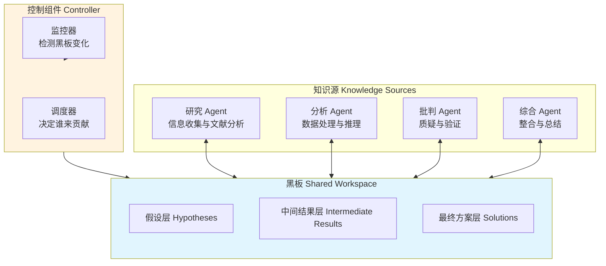

# 黑板架构：共享知识空间的协作

## 引言

黑板架构（Blackboard Architecture）是人工智能领域最经典的协作架构之一，最早由 Erman 等人在 1980 年代的 HEARSAY-II 语音理解系统中提出 [Erman et al., 1980]。其核心思想是：多个独立的专家围绕一块共享的"黑板"工作——每个专家观察黑板上的当前状态，在自己有能力贡献时写入新的知识或修改已有内容，通过渐进式的协作逐步解决复杂问题。

在 LLM Agent 时代，黑板架构获得了新的生命力。将多个 Agent 视为知识源，将共享的状态存储视为黑板，可以实现一种去中心化的、增量式的问题求解方式。

## 架构组成

黑板架构由三个核心组件构成：



**黑板（Blackboard）**：中心化的共享数据结构，所有 Agent 通过读写黑板进行间接通信。黑板通常分为多个层次，从原始输入到中间假设再到最终方案。

**知识源（Knowledge Sources）**：独立的 Agent 或处理模块，各自具备不同的专业能力。知识源之间不直接通信，完全通过黑板进行间接协作。

**控制组件（Controller）**：监控黑板状态变化，决定哪个知识源应该在什么时候被激活。控制策略可以是基于规则的，也可以是 LLM 驱动的。

## 现代实现：共享状态 + Agent 工作者

```python
import asyncio
from dataclasses import dataclass, field
from typing import Any
from datetime import datetime

@dataclass
class BlackboardEntry:
    """黑板上的一条记录"""
    key: str
    value: Any
    author: str              # 写入者
    timestamp: datetime
    confidence: float = 1.0  # 置信度
    layer: str = "intermediate"  # hypothesis / intermediate / solution

class Blackboard:
    """共享黑板：Agent 间的协作空间"""
    
    def __init__(self):
        self.entries: dict[str, BlackboardEntry] = {}
        self.history: list[BlackboardEntry] = []
        self.subscribers: list = []
    
    def read(self, key: str = None, layer: str = None) -> dict:
        """读取黑板内容"""
        if key:
            return self.entries.get(key)
        if layer:
            return {k: v for k, v in self.entries.items() if v.layer == layer}
        return self.entries
    
    def write(self, key: str, value: Any, author: str, 
              confidence: float = 1.0, layer: str = "intermediate"):
        """写入黑板"""
        entry = BlackboardEntry(
            key=key, value=value, author=author,
            timestamp=datetime.now(), confidence=confidence, layer=layer
        )
        self.entries[key] = entry
        self.history.append(entry)
        # 通知控制器有新的写入
        self._notify_change(entry)
    
    def _notify_change(self, entry: BlackboardEntry):
        for subscriber in self.subscribers:
            subscriber.on_blackboard_change(entry)

class KnowledgeSource:
    """知识源基类：特定领域的 Agent"""
    
    def __init__(self, name: str, llm, expertise: str):
        self.name = name
        self.llm = llm
        self.expertise = expertise
    
    def can_contribute(self, blackboard: Blackboard) -> bool:
        """判断当前黑板状态下自己能否做出贡献"""
        raise NotImplementedError
    
    async def contribute(self, blackboard: Blackboard):
        """向黑板写入自己的贡献"""
        raise NotImplementedError

class ResearchAgent(KnowledgeSource):
    """研究型知识源：收集和整理信息"""
    
    def can_contribute(self, blackboard: Blackboard) -> bool:
        # 当黑板上有问题定义但缺少相关资料时可以贡献
        has_question = blackboard.read("question") is not None
        has_research = blackboard.read("research_findings") is not None
        return has_question and not has_research
    
    async def contribute(self, blackboard: Blackboard):
        question = blackboard.read("question").value
        findings = await self.llm.chat(
            system="你是一个研究助手，请针对以下问题搜集关键信息。",
            user=question
        )
        blackboard.write(
            key="research_findings",
            value=findings.content,
            author=self.name,
            layer="intermediate"
        )

class CriticAgent(KnowledgeSource):
    """批判型知识源：质疑和验证现有内容"""
    
    def can_contribute(self, blackboard: Blackboard) -> bool:
        # 当有中间结果但尚未被验证时可以贡献
        intermediates = blackboard.read(layer="intermediate")
        return len(intermediates) > 0 and not blackboard.read("critique")
    
    async def contribute(self, blackboard: Blackboard):
        intermediates = blackboard.read(layer="intermediate")
        content = "\n".join(f"{k}: {v.value}" for k, v in intermediates.items())
        
        critique = await self.llm.chat(
            system="你是一个批判性思考者。审视以下内容，指出逻辑漏洞和不足。",
            user=content
        )
        blackboard.write(
            key="critique",
            value=critique.content,
            author=self.name,
            confidence=0.8,
            layer="intermediate"
        )
```

## 控制策略

控制组件决定了黑板架构的运行方式。常见的控制策略有：

**轮询策略**：依次询问每个知识源是否能贡献，简单但效率较低。

**优先级策略**：为知识源分配优先级，高优先级的知识源优先被激活。

**事件驱动策略**：当黑板发生特定变化时，触发相应的知识源。

**LLM 驱动策略**：用 LLM 观察黑板状态，智能决定下一步由谁贡献：

```python
class LLMController:
    """LLM 驱动的控制器"""
    
    def __init__(self, llm, knowledge_sources: list[KnowledgeSource]):
        self.llm = llm
        self.knowledge_sources = knowledge_sources
    
    async def select_next(self, blackboard: Blackboard) -> KnowledgeSource:
        """用 LLM 判断接下来该由谁贡献"""
        state_summary = self._summarize_blackboard(blackboard)
        ks_descriptions = "\n".join(
            f"- {ks.name}: {ks.expertise}" for ks in self.knowledge_sources
        )
        
        decision = await self.llm.chat(
            system=f"""根据黑板当前状态，选择最适合下一步贡献的知识源。
可用知识源：
{ks_descriptions}""",
            user=f"黑板状态：\n{state_summary}"
        )
        
        chosen_name = decision.content.strip()
        return next(
            (ks for ks in self.knowledge_sources if ks.name == chosen_name),
            self.knowledge_sources[0]  # 默认回退
        )
```

## 应用场景

**协作文档撰写**：研究 Agent 收集资料写入黑板，写作 Agent 基于资料撰写初稿，编辑 Agent 润色文字，事实核查 Agent 验证准确性。所有 Agent 通过黑板间接协作，无需显式编排。

**复杂问题分析**：面对一个需要多学科知识的复杂问题，不同领域的专家 Agent 各自从自己的角度贡献分析，批判 Agent 指出矛盾，综合 Agent 最终整合形成结论。

**软件设计评审**：架构 Agent 写入设计方案，安全 Agent 评估安全风险，性能 Agent 分析性能瓶颈，最终由综合 Agent 汇总所有反馈。

## 优势与劣势

**优势**：

- 松耦合：知识源之间完全独立，通过黑板间接通信
- 增量式求解：复杂问题通过多次贡献逐步解决
- 灵活扩展：新增知识源不影响现有系统
- 适合不确定性高的问题：多个假设可以共存，逐步收敛

**劣势**：

- 协调开销：需要控制器管理激活顺序
- 冲突解决：多个知识源对同一问题给出矛盾结论时需要仲裁机制
- 收敛性不保证：可能出现知识源互相推翻、无法收敛的情况
- 实现复杂度：黑板的数据结构设计和版本管理有挑战

## 与其他架构的比较

与路由架构相比，黑板架构没有中心化的分发器——知识源自主判断何时贡献。与 DAG 工作流相比，黑板架构不预定义执行顺序——贡献的次序由运行时状态动态决定。与事件驱动相比，黑板是结构化的共享状态而非离散的事件流。

在实践中，黑板架构适合那些问题结构不确定、需要多视角分析、解决方案需要渐进式构建的场景。对于流程明确的任务，DAG 或状态机可能是更简单的选择。

## 本章小结

黑板架构通过共享知识空间实现了多 Agent 的松耦合协作。这种经典架构在 LLM Agent 时代焕发了新生：每个 Agent 作为知识源贡献自己的专业分析，通过黑板上的信息积累和迭代逐步逼近问题的解决方案。控制策略的选择决定了系统的运行效率和收敛性。虽然实现复杂度较高，但对于需要多角度分析和增量求解的复杂问题，黑板架构是一种强大且优雅的解决方案。

## 延伸阅读

- [Erman et al., 1980] "The HEARSAY-II Speech Understanding System"
- [Nii, 1986] "Blackboard Systems: The Blackboard Model of Problem Solving"
- [Corkill, 1991] "Blackboard Systems" - AI Magazine
- [CrewAI] 开源框架中的共享状态与协作模式
