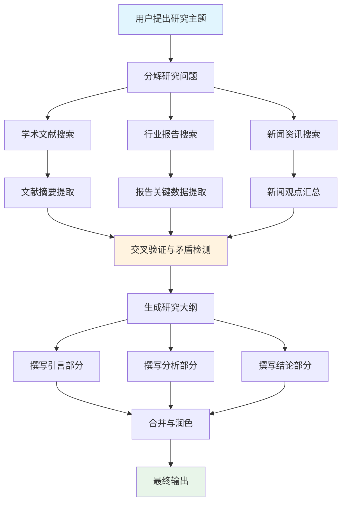
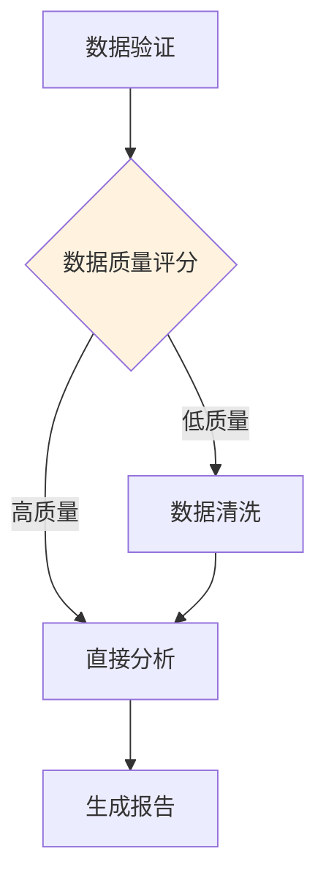

# DAG 工作流：结构化的任务编排

## 引言

当一个复杂任务可以被分解为多个子任务，且这些子任务之间存在明确的依赖关系时，有向无环图（Directed Acyclic Graph, DAG）是最自然的编排模型。DAG 工作流将任务表示为图中的节点，依赖关系表示为有向边，确保每个子任务在其所有前置依赖完成后才开始执行。

这一模式借鉴了数据工程领域的成熟实践。Apache Airflow、Prefect、Dagster 等工具数十年来一直使用 DAG 来编排 ETL 管线。将相同的理念应用于 Agent 系统，可以实现子任务的并行执行、清晰的依赖管理和高效的资源利用。

## DAG 的核心概念

DAG 工作流的三个核心要素：

- **节点（Node）**：代表一个可独立执行的任务单元，可以是 LLM 调用、工具调用或子 Agent 执行
- **边（Edge）**：代表任务间的依赖关系，有方向性（A 到 B 表示 A 完成后 B 才能开始）
- **无环约束（Acyclic）**：图中不存在循环，保证工作流一定能终止



上图展示了一个研究助手 Agent 的 DAG 工作流。注意 C1/C2/C3 三个搜索任务可以并行执行，G1/G2/G3 三个撰写任务也可以并行执行，这是 DAG 带来的天然并行化优势。

## 何时使用 DAG

DAG 工作流最适合以下场景：

- 任务可以被清晰地分解为多个子任务
- 子任务之间的依赖关系是静态的或可以在执行前确定
- 存在可以并行执行的独立子任务分支
- 任务流程不需要循环（不需要回到前面重试）
- 整体流程是确定的，不需要根据中间结果动态重构流程

不适合 DAG 的场景：需要循环重试的迭代任务（用[状态机](./state-machine.md)）、需要实时响应外部事件的场景（用[事件驱动](./event-driven.md)）、流程完全不可预测的探索性任务（用[单 Agent 循环](./single-agent-loop.md)）。

## 实现：DAG 执行引擎

```python
import asyncio
from dataclasses import dataclass, field
from typing import Callable, Any
from enum import Enum

class TaskStatus(Enum):
    PENDING = "pending"
    RUNNING = "running"
    COMPLETED = "completed"
    FAILED = "failed"

@dataclass
class DAGNode:
    """DAG 中的任务节点"""
    name: str
    execute_fn: Callable
    dependencies: list = field(default_factory=list)
    status: TaskStatus = TaskStatus.PENDING
    result: Any = None

class DAGWorkflow:
    """DAG 工作流执行引擎"""
    
    def __init__(self):
        self.nodes: dict[str, DAGNode] = {}
    
    def add_node(self, name: str, fn: Callable, deps: list = None):
        self.nodes[name] = DAGNode(name=name, execute_fn=fn, dependencies=deps or [])
    
    async def run(self, initial_input: dict) -> dict:
        """执行 DAG：并行调度所有就绪的任务"""
        context = {"input": initial_input, "results": {}}
        
        while not self._all_completed():
            # 找出所有依赖已满足且尚未执行的节点
            ready_nodes = [
                node for node in self.nodes.values()
                if node.status == TaskStatus.PENDING
                and self._deps_satisfied(node)
            ]
            
            if not ready_nodes:
                # 没有可执行节点但未全部完成，说明有失败的依赖
                break
            
            # 并行执行所有就绪节点
            tasks = [
                self._execute_node(node, context) for node in ready_nodes
            ]
            await asyncio.gather(*tasks)
        
        return context["results"]
    
    async def _execute_node(self, node: DAGNode, context: dict):
        """执行单个节点"""
        node.status = TaskStatus.RUNNING
        try:
            # 收集依赖节点的结果作为输入
            dep_results = {
                dep: context["results"][dep] 
                for dep in node.dependencies
            }
            node.result = await node.execute_fn(dep_results, context["input"])
            context["results"][node.name] = node.result
            node.status = TaskStatus.COMPLETED
        except Exception as e:
            node.status = TaskStatus.FAILED
            node.result = str(e)
    
    def _deps_satisfied(self, node: DAGNode) -> bool:
        return all(
            self.nodes[dep].status == TaskStatus.COMPLETED
            for dep in node.dependencies
        )
    
    def _all_completed(self) -> bool:
        return all(
            node.status in (TaskStatus.COMPLETED, TaskStatus.FAILED)
            for node in self.nodes.values()
        )
```

## 使用示例

```python
# 构建研究助手 DAG
workflow = DAGWorkflow()

async def search_academic(deps, input_data):
    """搜索学术文献"""
    query = input_data["research_topic"]
    return await academic_search_tool.search(query)

async def search_industry(deps, input_data):
    """搜索行业报告"""
    query = input_data["research_topic"]
    return await industry_search_tool.search(query)

async def synthesize(deps, input_data):
    """综合分析所有搜索结果"""
    all_results = list(deps.values())
    return await llm.synthesize(results=all_results, topic=input_data["research_topic"])

# 注册节点与依赖
workflow.add_node("academic_search", search_academic)
workflow.add_node("industry_search", search_industry)
workflow.add_node("synthesis", synthesize, deps=["academic_search", "industry_search"])

# 执行
results = await workflow.run({"research_topic": "LLM Agent 架构演进"})
```

## 条件分支

现实中的 DAG 往往需要条件分支：根据某个节点的输出决定后续走哪条路径。



条件分支通过路由节点实现：

```python
async def quality_router(deps, input_data):
    """根据数据质量评分决定后续路径"""
    quality_score = deps["data_validation"]["score"]
    if quality_score > 0.8:
        return {"route": "direct_analysis"}
    else:
        return {"route": "data_cleaning"}
```

## Prompt Chaining：最简单的 DAG

Prompt Chaining（提示链）是 DAG 的一种退化形式——所有节点串联，没有并行分支。虽然简单，但在很多场景下已经足够：


每一步的输出作为下一步的输入，形成流水线。这种模式适合线性、无分支的任务，实现上甚至不需要完整的 DAG 引擎。

## 与状态机的区别

| 维度 | DAG 工作流 | 状态机 |
|-----|-----------|-------|
| 循环 | 不允许（无环） | 允许循环转换 |
| 结构 | 执行前确定 | 可运行时动态转换 |
| 并行 | 天然支持 | 通常是顺序的 |
| 适用场景 | 确定性管线 | 需要重试/回退的交互 |
| 实现复杂度 | 中等 | 中等 |
| 可组合性 | 高（子 DAG） | 中（嵌套状态机） |

实践中两者可以结合：状态机的某个状态内部运行一个 DAG，或者 DAG 的某个节点内部是一个状态机驱动的子 Agent。

## DAG 的局限性

当 DAG 变得不够用时，通常表现为以下需求：

- 需要根据结果回到某个之前的节点重新执行（需要循环，转向状态机）
- 需要动态添加新的节点（需要运行时图修改能力）
- 节点间有复杂的交互通信而非单纯的数据传递（转向[黑板架构](./blackboard-architecture.md)）

## 本章小结

DAG 工作流将任务编排为有向无环图，通过并行执行独立分支来提高效率，通过依赖管理保证执行顺序的正确性。它是处理结构化多步任务的强大工具，特别适合有明确输入输出关系的管线式任务。理解 DAG 的适用边界很重要：当需要循环或动态流程时，应该考虑状态机或混合架构。

## 延伸阅读

- [Anthropic, 2024] "Building Effective Agents" - Prompt Chaining 与 Parallelization 模式
- Apache Airflow 官方文档：DAG 编排最佳实践
- Prefect 官方文档：现代数据工作流编排
- [Wu et al., 2023] "AutoGen: Enabling Next-Gen LLM Applications via Multi-Agent Conversation"
