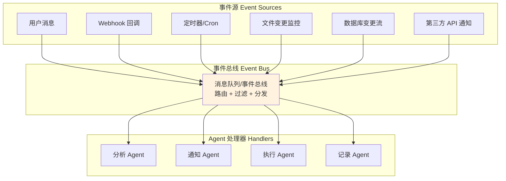
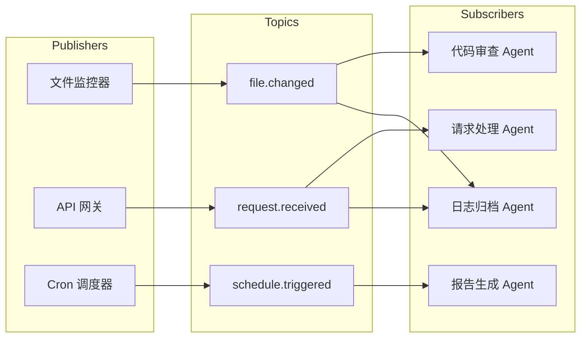

# 事件驱动架构：响应式 Agent 系统

## 引言

前面介绍的架构模式——单 Agent 循环、状态机、DAG——本质上都是"请求-响应"式的：接收一个任务，处理完成后返回结果。但很多真实场景要求 Agent 能够持续运行，对外部世界的变化做出实时响应。事件驱动架构（Event-Driven Architecture, EDA）正是为这类场景而设计的。

在事件驱动的 Agent 系统中，Agent 不再是被动等待调用的函数，而是一个持续监听环境变化的活跃实体。当特定事件发生时，Agent 被触发并做出响应。这种模式特别适合监控类 Agent、实时助手和自动化工作流。

## 事件驱动的核心范式



事件驱动架构的三个核心组件：

- **事件源（Event Sources）**：产生事件的来源，可以是用户操作、系统状态变更、外部服务回调等
- **事件总线（Event Bus）**：接收、路由和分发事件的中间件，负责将事件传递给合适的处理器
- **事件处理器（Event Handlers）**：接收特定类型的事件并做出响应的 Agent 组件

## 事件源的类型

一个完整的事件驱动 Agent 系统可能同时监听多种事件源：

**用户交互事件**：用户发送消息、点击按钮、上传文件等直接交互。这是最常见的事件源，也是请求-响应模式的自然延伸。

**系统事件**：文件系统变更、数据库记录更新、服务健康状态变化等。适合构建监控类 Agent。

**定时事件**：Cron 调度或间隔触发的周期性事件。适合构建巡检、报告生成等定时任务 Agent。

**外部回调**：Webhook、API 回调、第三方服务通知等。适合集成外部系统的自动化 Agent。

## 实现：异步事件处理框架

```python
import asyncio
from dataclasses import dataclass
from typing import Callable
from collections import defaultdict

@dataclass
class Event:
    """事件基类"""
    event_type: str
    payload: dict
    timestamp: float
    source: str

class EventBus:
    """事件总线：注册处理器、分发事件"""
    
    def __init__(self):
        self.handlers: dict[str, list[Callable]] = defaultdict(list)
        self.queue: asyncio.Queue = asyncio.Queue()
    
    def subscribe(self, event_type: str, handler: Callable):
        """订阅某类事件"""
        self.handlers[event_type].append(handler)
    
    async def publish(self, event: Event):
        """发布事件到队列"""
        await self.queue.put(event)
    
    async def start(self):
        """启动事件分发循环"""
        while True:
            event = await self.queue.get()
            handlers = self.handlers.get(event.event_type, [])
            # 并行调用所有订阅者
            tasks = [handler(event) for handler in handlers]
            await asyncio.gather(*tasks, return_exceptions=True)

class MonitoringAgent:
    """监控 Agent：监听系统事件并做出响应"""
    
    def __init__(self, llm, event_bus: EventBus, alert_tool):
        self.llm = llm
        self.event_bus = event_bus
        self.alert_tool = alert_tool
        self.event_history = []
        
        # 订阅感兴趣的事件
        event_bus.subscribe("metric_anomaly", self.handle_anomaly)
        event_bus.subscribe("error_spike", self.handle_error_spike)
        event_bus.subscribe("deployment_complete", self.handle_deployment)
    
    async def handle_anomaly(self, event: Event):
        """处理指标异常事件"""
        self.event_history.append(event)
        
        # 用 LLM 分析异常
        analysis = await self.llm.chat(
            system="你是一个系统监控专家，分析以下指标异常并给出诊断。",
            user=f"异常详情：{event.payload}"
        )
        
        # 根据严重程度决定行动
        if analysis.severity == "critical":
            await self.alert_tool.send_alert(
                channel="oncall",
                message=analysis.summary
            )
        else:
            await self.alert_tool.log_warning(analysis.summary)
    
    async def handle_error_spike(self, event: Event):
        """处理错误激增事件"""
        # 结合历史上下文分析
        recent_events = self.event_history[-10:]
        context = f"最近事件：{recent_events}\n当前：{event.payload}"
        
        diagnosis = await self.llm.chat(
            system="分析错误激增的根因，判断是否与最近部署有关。",
            user=context
        )
        
        await self.alert_tool.send_report(diagnosis.content)
```

## 发布-订阅模式（Pub/Sub）

发布-订阅是事件驱动架构中最核心的通信模式。与直接调用不同，事件的发布者不需要知道谁会处理事件，处理器也不需要知道事件来自哪里。这种解耦让系统更易于扩展。



多个 Agent 可以订阅同一类事件（如 S1 和 S4 都关注 file.changed），一个 Agent 也可以订阅多种事件。这种灵活的多对多关系是事件驱动架构的强大之处。

## 异步处理与流式响应

事件驱动架构天然要求异步处理能力。Agent 在等待工具调用返回时不应该阻塞事件循环，这样才能同时处理多个事件。

```python
class AsyncToolExecutor:
    """非阻塞的工具执行器"""
    
    async def execute_with_callback(self, tool_name: str, args: dict, 
                                      on_complete: Callable):
        """异步执行工具，完成后回调"""
        # 非阻塞执行
        result = await self._async_tool_call(tool_name, args)
        # 通过事件通知完成
        await on_complete(result)
    
    async def execute_streaming(self, tool_name: str, args: dict):
        """流式执行，逐步返回中间结果"""
        async for chunk in self._stream_tool_call(tool_name, args):
            yield chunk
```

## 典型应用场景

**代码仓库监控 Agent**：监听 Git push 事件，自动触发代码审查、测试运行和部署流程。

**实时客服助手**：监听用户消息事件，同时关注订单状态变更事件，在用户询问时能即时提供最新信息。

**数据管线监控**：监听数据任务完成/失败事件，自动诊断失败原因并尝试恢复或通知相关人员。

**智能通知 Agent**：订阅多种信息源（邮件、消息、日历），根据用户偏好和当前上下文决定是否打扰用户以及如何摘要通知。

## 权衡取舍

| 优势 | 劣势 |
|------|------|
| 高响应性，实时反应 | 调试困难，事件流难追踪 |
| 松耦合，易扩展 | 事件顺序不保证 |
| 天然支持并发 | 错误处理复杂 |
| 适合长时间运行的系统 | 需要完善的监控和可观测性 |
| 可以灵活增减处理器 | 可能出现事件风暴 |

关键的工程考量：事件幂等性（同一事件被处理多次不应产生副作用）、背压处理（事件产生速度超过处理速度时的策略）、死信队列（处理失败的事件如何重试或告警）。

## 本章小结

事件驱动架构让 Agent 从被动的请求处理器转变为主动的环境响应者。通过事件总线的解耦设计和异步处理能力，可以构建出高响应性、可扩展的 Agent 系统。这种架构特别适合需要持续运行、监听多种信号源的场景。在实践中，事件驱动通常不会单独使用，而是与其他模式结合——例如事件触发后启动一个 DAG 工作流，或者状态机中的某些状态等待特定事件才转换。

## 延伸阅读

- [Richards, 2015] "Software Architecture Patterns" - 事件驱动架构章节
- [Kleppmann, 2017] "Designing Data-Intensive Applications" - 流处理与事件溯源
- Python asyncio 官方文档：异步编程模型
- [Google, 2024] "Agent-as-a-Service: Event-Driven Agent Architectures"
