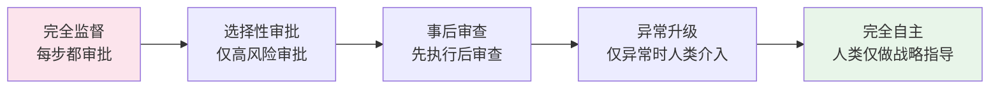
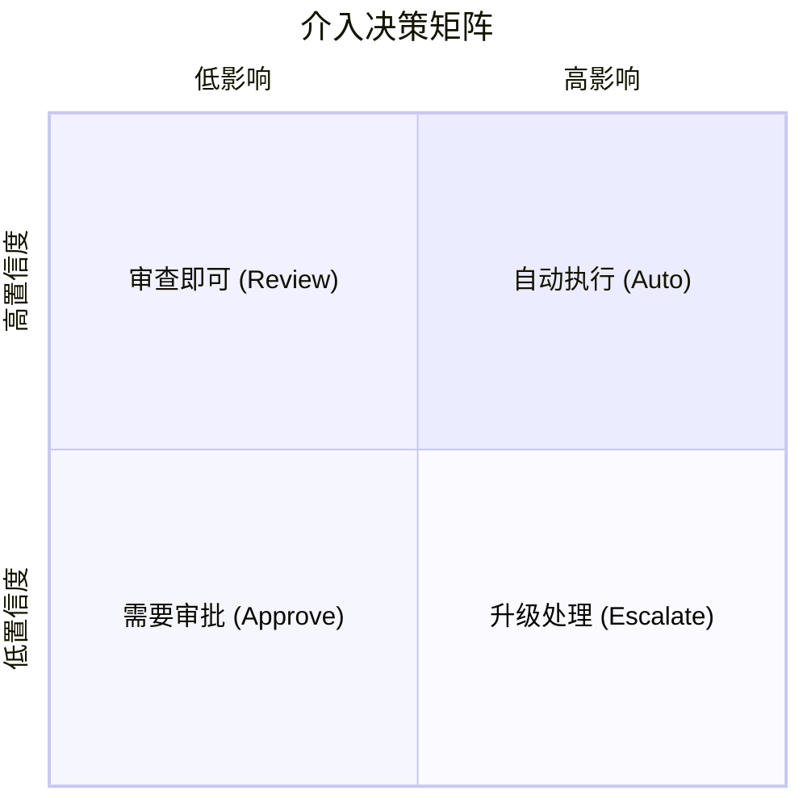
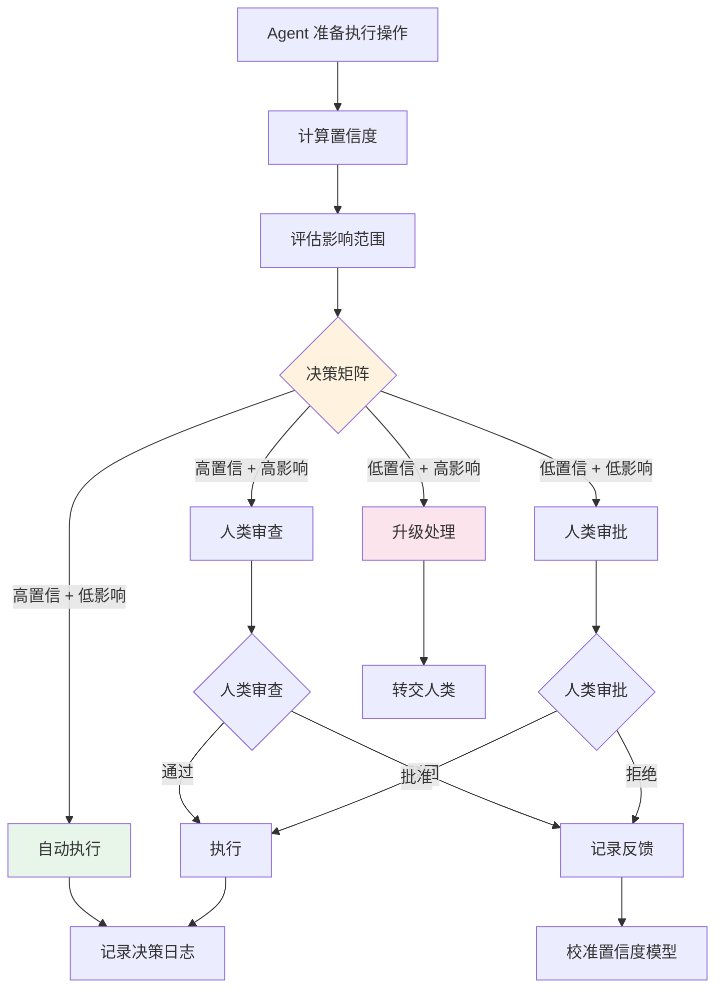

# Human-in-the-Loop：人机协作架构

## 引言

一个完全自主的 Agent 系统听起来很美好，但在生产环境中，完全信任 AI 的判断往往是不现实的——也是不负责任的。Human-in-the-Loop（HITL，人在回路中）架构承认了这一现实：在 Agent 的自主执行流程中，有策略地引入人类参与节点，让人类在关键时刻提供判断、确认或纠正。

HITL 不是对 Agent 能力的否定，而是工程上的务实选择。它建立了信任的桥梁，让 Agent 系统能够在安全可控的前提下逐步获得更大的自主权。正如 Anthropic 所指出的："让人类参与循环是让 Agent 系统在生产中安全运行的基本要求" [Anthropic, 2024]。

## 为什么 HITL 是生产必需

在 Agent 系统中引入人类参与的核心原因：

**安全性**：LLM 可能产生幻觉或做出错误决策。对于高风险操作（如发送邮件、执行交易、修改数据库），人类审批是最后的安全网。

**合规性**：许多业务场景有监管要求，关键决策需要人类审计和确认。

**质量保证**：Agent 的输出可能不完全符合业务上下文或用户期望，人类审查确保输出质量。

**信任建设**：用户和组织需要时间来建立对 Agent 系统的信任。HITL 提供了一个渐进式建立信任的机制。

## HITL 决策流程


## 核心设计模式

### 模式一：确认后执行（Confirm-Before-Execute）

最常见的 HITL 模式。Agent 在执行高影响操作前暂停，向用户展示即将执行的操作及其预期影响，等待确认。

```python
class ConfirmBeforeExecute:
    """确认后执行模式"""
    
    def __init__(self, agent, ui_bridge):
        self.agent = agent
        self.ui = ui_bridge
        self.risk_assessor = RiskAssessor()
    
    async def execute_with_confirmation(self, action: dict) -> dict:
        """评估风险，必要时请求确认"""
        risk_level = self.risk_assessor.assess(action)
        
        if risk_level == "low":
            # 低风险：直接执行
            return await self.agent.execute(action)
        
        elif risk_level == "medium":
            # 中风险：展示计划，允许修改
            user_decision = await self.ui.show_plan(
                title="Agent 计划执行以下操作",
                actions=[action],
                impact_summary=self._describe_impact(action),
                options=["approve", "modify", "reject"]
            )
            
            if user_decision.choice == "approve":
                return await self.agent.execute(action)
            elif user_decision.choice == "modify":
                modified = await self.agent.revise(action, user_decision.feedback)
                return await self.execute_with_confirmation(modified)
            else:
                return {"status": "rejected"}
        
        else:  # high risk
            # 高风险：需要明确审批，附带风险说明
            approval = await self.ui.request_approval(
                title="高风险操作需要审批",
                action=action,
                risks=self._list_risks(action),
                reversible=self._check_reversibility(action)
            )
            
            if approval.granted:
                result = await self.agent.execute(action)
                await self.ui.notify_completion(result)
                return result
            return {"status": "denied"}
```

### 模式二：审查后发送（Review-Before-Send）

适用于 Agent 生成内容（邮件、文档、代码）的场景。Agent 生成初稿，人类审查修改后再最终发送。

```python
class ReviewBeforeSend:
    """审查后发送模式"""
    
    async def generate_and_review(self, task: str) -> str:
        # Agent 生成初稿
        draft = await self.agent.generate(task)
        
        # 进入审查循环
        while True:
            review = await self.ui.present_for_review(
                content=draft,
                metadata={"task": task, "model": self.agent.model_name}
            )
            
            if review.action == "approve":
                return draft
            elif review.action == "edit":
                # 用户直接编辑
                return review.edited_content
            elif review.action == "regenerate":
                # 根据反馈重新生成
                draft = await self.agent.regenerate(task, feedback=review.feedback)
            elif review.action == "cancel":
                return None
```

### 模式三：辅助模式（Assist Mode）

Agent 不独立行动，而是为人类提供建议和辅助。人类始终保持控制权，Agent 的角色是提供信息、建议和自动化辅助。

### 模式四：升级路径（Escalation Path）

Agent 识别出自己无法处理的情况时，主动将任务升级给人类。关键是 Agent 需要具备"知道自己不知道"的能力。

```python
class EscalationHandler:
    """升级处理器"""
    
    def __init__(self, confidence_threshold: float = 0.7):
        self.confidence_threshold = confidence_threshold
    
    async def handle_with_escalation(self, query: str) -> dict:
        """处理任务，必要时升级"""
        # Agent 尝试处理并评估置信度
        result = await self.agent.process(query)
        
        if result.confidence < self.confidence_threshold:
            # 置信度不足，升级给人类
            return await self.escalate(
                query=query,
                agent_attempt=result,
                reason=f"置信度 {result.confidence:.0%} 低于阈值"
            )
        
        return result
```

## 置信度与风险评估

HITL 系统的核心挑战是判断何时需要人类介入。这通常基于两个维度：

**操作风险**：操作的影响范围和可逆性。删除数据比读取数据风险高，发送外部邮件比内部通知风险高。

**Agent 置信度**：Agent 对自己决策的确信程度。可以通过 LLM 的概率分布、一致性检查或自我评估来量化。

```python
class RiskAssessor:
    """风险评估器"""
    
    RISK_MATRIX = {
        # (影响范围, 可逆性) -> 风险等级
        ("internal", "reversible"): "low",
        ("internal", "irreversible"): "medium",
        ("external", "reversible"): "medium",
        ("external", "irreversible"): "high",
    }
    
    def assess(self, action: dict) -> str:
        scope = "external" if action.get("sends_externally") else "internal"
        reversibility = "reversible" if action.get("can_undo") else "irreversible"
        return self.RISK_MATRIX.get((scope, reversibility), "high")
```

## 渐进自主：从监督到独立

HITL 不是静态的。随着系统运行和人类反馈的积累，Agent 应该能够逐步获得更大的自主权：



实现渐进自主的关键机制：

- 跟踪 Agent 决策的准确率，当准确率持续高于阈值时提升自主级别
- 记录人类修改的模式，让 Agent 学习何时需要谨慎
- 允许回退——如果 Agent 在某个自主级别上出现问题，可以降级回去

## UX 设计考量

好的 HITL 设计需要考虑用户体验：

**最小化打扰**：不要让每个小决策都需要人类确认，这会导致用户疲劳（Alarm Fatigue）。只在真正重要的节点请求介入。

**提供充足上下文**：当请求人类审批时，要清楚展示 Agent 为什么做出这个决策、预期影响是什么、有哪些替代方案。

**尊重响应时间**：人类不总是立即可用。设计异步审批机制，允许任务在等待审批时暂停而非阻塞整个系统。

**批量审批**：对于同类型的低风险操作，允许人类一次性批准多个，而非逐个确认。

## 介入时机的自动化判断

前面我们讨论了 HITL 的模式和流程，但有一个关键问题没有回答：Agent 如何自主判断"何时需要人类介入"？这不应该是硬编码的规则，而应该是一个动态的、可学习的决策系统。

### 置信度阈值模型

Agent 对自身决策的置信度是判断是否需要人类介入的第一信号。置信度可以来自多个来源：

- **LLM 输出概率**：基于 token logprob 计算的生成确定性
- **自评估（Self-Evaluation）**：让 Agent 额外评估自己的输出质量
- **一致性检查**：多次采样的结果一致性
- **历史校准**：基于过去相似任务的实际准确率校准

### 影响范围评估

即使 Agent 很有信心，如果操作的潜在影响巨大，仍然应该请求人类介入。影响评估考虑三个维度：

- **不可逆性（Irreversibility）**：操作能否撤回？删除数据库 vs 发送内部消息
- **影响范围（Blast Radius）**：影响多少用户？单用户 vs 全量用户
- **数据敏感性（Sensitivity）**：涉及的数据敏感程度？公开信息 vs 用户隐私

### 综合决策矩阵

将置信度和影响范围组合，形成四象限决策：



决策流程的完整路径：



### 代码实现

```python
from dataclasses import dataclass
from enum import Enum
from typing import Optional
import math


class InterventionLevel(Enum):
    AUTO = "auto"          # 自动执行，仅记录日志
    REVIEW = "review"      # 人类审查，展示计划
    APPROVE = "approve"    # 人类审批，需明确确认
    ESCALATE = "escalate"  # 升级，转交人类完全处理


@dataclass
class ImpactAssessment:
    """影响评估结果"""
    irreversibility: float    # 0.0=完全可逆, 1.0=完全不可逆
    blast_radius: float       # 0.0=无影响, 1.0=全量用户
    data_sensitivity: float   # 0.0=公开数据, 1.0=高度敏感
    
    @property
    def composite_score(self) -> float:
        """加权综合影响分，不可逆性权重最高"""
        return (
            self.irreversibility * 0.5 +
            self.blast_radius * 0.3 +
            self.data_sensitivity * 0.2
        )


@dataclass
class ConfidenceEstimate:
    """置信度估计"""
    llm_logprob: Optional[float]       # 基于 token logprob 的确定性
    self_eval_score: Optional[float]    # 自评估分数 (0~1)
    consistency_score: Optional[float]  # 多次采样一致性 (0~1)
    historical_accuracy: Optional[float] # 历史同类任务准确率
    
    @property
    def composite_score(self) -> float:
        """加权综合置信度，优先使用可用的信号"""
        scores = []
        weights = []
        
        if self.historical_accuracy is not None:
            scores.append(self.historical_accuracy)
            weights.append(0.35)  # 历史数据最可靠
        if self.consistency_score is not None:
            scores.append(self.consistency_score)
            weights.append(0.25)
        if self.self_eval_score is not None:
            scores.append(self.self_eval_score)
            weights.append(0.25)
        if self.llm_logprob is not None:
            scores.append(self.llm_logprob)
            weights.append(0.15)
        
        if not scores:
            return 0.0  # 无信号时默认最低置信度
        
        total_weight = sum(weights)
        return sum(s * w for s, w in zip(scores, weights)) / total_weight


class InterventionDecider:
    """
    介入决策器：基于置信度和影响评估，
    自动决定操作应该自动执行还是需要人类介入。
    """
    
    # 决策阈值配置
    CONFIDENCE_THRESHOLD_HIGH = 0.85
    CONFIDENCE_THRESHOLD_LOW = 0.5
    IMPACT_THRESHOLD_HIGH = 0.7
    IMPACT_THRESHOLD_LOW = 0.3
    
    def __init__(self, action_registry: dict = None):
        # 操作类型 -> 预定义影响参数
        self.action_registry = action_registry or self._default_registry()
        self.decision_log = []
    
    def decide(
        self,
        action: dict,
        confidence: ConfidenceEstimate,
        context: dict = None
    ) -> InterventionLevel:
        """
        核心决策方法：基于置信度和影响评估决定介入级别。
        
        Args:
            action: 待执行的操作描述
            confidence: 置信度估计
            context: 额外上下文（用户偏好、时间等）
        
        Returns:
            InterventionLevel: 建议的介入级别
        """
        # 1. 评估影响
        impact = self._assess_impact(action)
        
        # 2. 计算综合分数
        conf_score = confidence.composite_score
        impact_score = impact.composite_score
        
        # 3. 矩阵决策
        level = self._apply_matrix(conf_score, impact_score)
        
        # 4. 上下文修正
        level = self._apply_context_adjustments(level, context)
        
        # 5. 记录决策
        self.decision_log.append({
            "action": action.get("type"),
            "confidence": conf_score,
            "impact": impact_score,
            "decision": level.value,
        })
        
        return level
    
    def _assess_impact(self, action: dict) -> ImpactAssessment:
        """基于操作类型和参数评估影响"""
        action_type = action.get("type", "unknown")
        
        # 从注册表获取基础影响参数
        base = self.action_registry.get(action_type, {
            "irreversibility": 0.8,
            "blast_radius": 0.5,
            "data_sensitivity": 0.5,
        })
        
        # 根据操作参数动态调整
        irreversibility = base["irreversibility"]
        blast_radius = base["blast_radius"]
        sensitivity = base["data_sensitivity"]
        
        # 如果操作有 undo 方法，降低不可逆性
        if action.get("has_undo"):
            irreversibility *= 0.3
        
        # 根据影响用户数调整 blast_radius
        affected_users = action.get("affected_users", 1)
        if affected_users > 1000:
            blast_radius = min(1.0, blast_radius + 0.3)
        elif affected_users > 100:
            blast_radius = min(1.0, blast_radius + 0.15)
        
        return ImpactAssessment(
            irreversibility=irreversibility,
            blast_radius=blast_radius,
            data_sensitivity=sensitivity,
        )
    
    def _apply_matrix(
        self, confidence: float, impact: float
    ) -> InterventionLevel:
        """四象限决策矩阵"""
        high_conf = confidence >= self.CONFIDENCE_THRESHOLD_HIGH
        low_conf = confidence < self.CONFIDENCE_THRESHOLD_LOW
        high_impact = impact >= self.IMPACT_THRESHOLD_HIGH
        low_impact = impact < self.IMPACT_THRESHOLD_LOW
        
        if high_conf and low_impact:
            return InterventionLevel.AUTO
        elif high_conf and not low_impact:
            return InterventionLevel.REVIEW
        elif not high_conf and not high_impact:
            return InterventionLevel.APPROVE
        else:
            # 低置信度 + 高影响 = 升级
            return InterventionLevel.ESCALATE
    
    def _apply_context_adjustments(
        self, level: InterventionLevel, context: dict = None
    ) -> InterventionLevel:
        """基于上下文微调决策"""
        if not context:
            return level
        
        # 如果用户明确设置了宽松模式，可以降级
        if context.get("user_mode") == "autonomous":
            if level == InterventionLevel.REVIEW:
                return InterventionLevel.AUTO
        
        # 如果在非工作时间，升级（因为人类响应慢）
        if context.get("off_hours") and level == InterventionLevel.APPROVE:
            return InterventionLevel.ESCALATE
        
        return level
    
    def _default_registry(self) -> dict:
        """默认操作影响注册表"""
        return {
            "read_file": {"irreversibility": 0.0, "blast_radius": 0.0, "data_sensitivity": 0.2},
            "write_file": {"irreversibility": 0.3, "blast_radius": 0.1, "data_sensitivity": 0.3},
            "send_email": {"irreversibility": 1.0, "blast_radius": 0.4, "data_sensitivity": 0.6},
            "delete_record": {"irreversibility": 0.9, "blast_radius": 0.3, "data_sensitivity": 0.7},
            "deploy_service": {"irreversibility": 0.4, "blast_radius": 0.9, "data_sensitivity": 0.3},
            "modify_permissions": {"irreversibility": 0.6, "blast_radius": 0.7, "data_sensitivity": 0.9},
            "execute_payment": {"irreversibility": 0.95, "blast_radius": 0.5, "data_sensitivity": 0.9},
        }
```

## 异步审批流工程模式

在现实系统中，人类不总是在线。当 Agent 需要人类审批时，不能无限期阻塞等待——这会导致任务堆积、用户体验下降。异步审批模式解决了这个核心矛盾：Agent 可以暂停当前任务，释放资源去做其他事情，等到人类审批后再恢复执行。

### 任务暂停与恢复

异步审批的核心是将任务状态持久化。当 Agent 遇到需要审批的操作时，它会：

1. 将当前任务状态序列化并存储
2. 发送审批请求到消息队列
3. 释放执行资源，处理其他任务
4. 审批完成后恢复任务状态并继续执行

### 审批超时策略

审批请求不能永远悬挂。系统需要定义超时后的处理策略：

- **自动降级**：超时后使用保守方案替代原方案执行
- **自动通过**：对于低风险操作，超时后默认批准
- **通知升级**：超时后通知上级审批人
- **任务取消**：超时后取消任务并通知相关方

### 多审批人路由

复杂操作可能需要多个角色的审批（如技术审批 + 业务审批）。路由策略包括：

- **串行审批**：A 通过后才发给 B，适合有依赖关系的审批
- **并行审批**：同时发给 A 和 B，适合独立的审批维度
- **多数通过**：N 个审批人中 M 个通过即可，适合委员会决策

### 代码实现

```python
import asyncio
import time
import json
from dataclasses import dataclass, field
from enum import Enum
from typing import Callable, Optional
from uuid import uuid4


class ApprovalStatus(Enum):
    PENDING = "pending"
    APPROVED = "approved"
    REJECTED = "rejected"
    TIMEOUT = "timeout"
    ESCALATED = "escalated"


class TimeoutPolicy(Enum):
    AUTO_APPROVE = "auto_approve"       # 超时自动通过
    AUTO_DEGRADE = "auto_degrade"       # 超时自动降级
    ESCALATE = "escalate"               # 超时升级
    CANCEL = "cancel"                   # 超时取消


class RoutingStrategy(Enum):
    SEQUENTIAL = "sequential"     # 串行审批
    PARALLEL = "parallel"         # 并行审批
    MAJORITY = "majority"         # 多数通过


@dataclass
class ApprovalRequest:
    """审批请求"""
    id: str = field(default_factory=lambda: str(uuid4()))
    task_id: str = ""
    action: dict = field(default_factory=dict)
    approvers: list = field(default_factory=list)
    routing: RoutingStrategy = RoutingStrategy.SEQUENTIAL
    timeout_seconds: int = 3600        # 默认 1 小时超时
    timeout_policy: TimeoutPolicy = TimeoutPolicy.ESCALATE
    created_at: float = field(default_factory=time.time)
    status: ApprovalStatus = ApprovalStatus.PENDING
    responses: dict = field(default_factory=dict)  # approver_id -> decision
    degraded_action: Optional[dict] = None  # 降级方案


@dataclass
class SuspendedTask:
    """被暂停的任务状态"""
    task_id: str
    agent_state: dict            # Agent 执行到的状态快照
    pending_action: dict         # 等待审批的操作
    approval_request_id: str     # 关联的审批请求
    suspended_at: float = field(default_factory=time.time)
    resume_callback: Optional[str] = None  # 恢复后的回调标识


class AsyncApprovalManager:
    """
    异步审批管理器：处理任务暂停、审批路由、超时策略和任务恢复。
    """
    
    def __init__(self, message_bus, state_store, notifier):
        self.message_bus = message_bus      # 消息系统（Slack/DingTalk/大象）
        self.state_store = state_store      # 状态持久化存储
        self.notifier = notifier            # 通知服务
        self.timeout_handlers = {
            TimeoutPolicy.AUTO_APPROVE: self._handle_auto_approve,
            TimeoutPolicy.AUTO_DEGRADE: self._handle_auto_degrade,
            TimeoutPolicy.ESCALATE: self._handle_escalate,
            TimeoutPolicy.CANCEL: self._handle_cancel,
        }
    
    async def request_approval(
        self,
        task_id: str,
        action: dict,
        agent_state: dict,
        approvers: list[str],
        routing: RoutingStrategy = RoutingStrategy.SEQUENTIAL,
        timeout_seconds: int = 3600,
        timeout_policy: TimeoutPolicy = TimeoutPolicy.ESCALATE,
        degraded_action: dict = None,
    ) -> str:
        """
        发起异步审批请求，暂停当前任务。
        
        Returns:
            approval_request_id: 审批请求 ID，用于后续查询和恢复
        """
        # 1. 创建审批请求
        request = ApprovalRequest(
            task_id=task_id,
            action=action,
            approvers=approvers,
            routing=routing,
            timeout_seconds=timeout_seconds,
            timeout_policy=timeout_policy,
            degraded_action=degraded_action,
        )
        
        # 2. 暂停任务，持久化状态
        suspended = SuspendedTask(
            task_id=task_id,
            agent_state=agent_state,
            pending_action=action,
            approval_request_id=request.id,
        )
        await self.state_store.save_suspended_task(suspended)
        await self.state_store.save_approval_request(request)
        
        # 3. 发送审批通知
        await self._route_approval(request)
        
        # 4. 注册超时检查
        asyncio.create_task(self._watch_timeout(request.id))
        
        return request.id
    
    async def receive_decision(
        self, request_id: str, approver_id: str, decision: str, comment: str = ""
    ) -> Optional[dict]:
        """
        接收审批人的决定。根据路由策略判断是否可以恢复任务。
        
        Returns:
            如果审批完成，返回恢复任务所需的信息；否则返回 None
        """
        request = await self.state_store.get_approval_request(request_id)
        if request.status != ApprovalStatus.PENDING:
            return None  # 已经处理过了
        
        # 记录审批响应
        request.responses[approver_id] = {
            "decision": decision,
            "comment": comment,
            "timestamp": time.time(),
        }
        
        # 根据路由策略判断是否完成
        final_decision = self._evaluate_routing(request)
        
        if final_decision is None:
            # 还需要更多审批人响应
            await self.state_store.save_approval_request(request)
            if request.routing == RoutingStrategy.SEQUENTIAL:
                # 串行模式：通知下一个审批人
                await self._notify_next_approver(request)
            return None
        
        # 审批完成，更新状态
        request.status = (
            ApprovalStatus.APPROVED if final_decision == "approved"
            else ApprovalStatus.REJECTED
        )
        await self.state_store.save_approval_request(request)
        
        # 恢复任务
        return await self._resume_task(request)
    
    def _evaluate_routing(self, request: ApprovalRequest) -> Optional[str]:
        """根据路由策略评估审批是否完成"""
        responses = request.responses
        approvers = request.approvers
        
        if request.routing == RoutingStrategy.SEQUENTIAL:
            # 串行：按顺序检查，遇到拒绝立即终止
            for approver in approvers:
                if approver not in responses:
                    return None  # 等待当前审批人
                if responses[approver]["decision"] == "rejected":
                    return "rejected"
            return "approved"  # 所有人都通过了
        
        elif request.routing == RoutingStrategy.PARALLEL:
            # 并行：所有人都响应后才决定
            if len(responses) < len(approvers):
                return None
            rejected = any(r["decision"] == "rejected" for r in responses.values())
            return "rejected" if rejected else "approved"
        
        elif request.routing == RoutingStrategy.MAJORITY:
            # 多数通过：超过半数通过即可
            approve_count = sum(
                1 for r in responses.values() if r["decision"] == "approved"
            )
            reject_count = sum(
                1 for r in responses.values() if r["decision"] == "rejected"
            )
            majority = len(approvers) // 2 + 1
            
            if approve_count >= majority:
                return "approved"
            elif reject_count >= majority:
                return "rejected"
            return None  # 还没达到多数
    
    async def _route_approval(self, request: ApprovalRequest):
        """根据路由策略发送审批通知"""
        if request.routing == RoutingStrategy.SEQUENTIAL:
            # 串行：只通知第一个审批人
            await self.notifier.send_approval_request(
                approver=request.approvers[0],
                request=request,
            )
        else:
            # 并行/多数：同时通知所有审批人
            for approver in request.approvers:
                await self.notifier.send_approval_request(
                    approver=approver,
                    request=request,
                )
    
    async def _notify_next_approver(self, request: ApprovalRequest):
        """串行模式下通知下一个审批人"""
        for approver in request.approvers:
            if approver not in request.responses:
                await self.notifier.send_approval_request(
                    approver=approver,
                    request=request,
                )
                break
    
    async def _watch_timeout(self, request_id: str):
        """监控审批超时"""
        request = await self.state_store.get_approval_request(request_id)
        remaining = request.timeout_seconds - (time.time() - request.created_at)
        
        if remaining > 0:
            await asyncio.sleep(remaining)
        
        # 重新获取状态，可能已经被处理了
        request = await self.state_store.get_approval_request(request_id)
        if request.status == ApprovalStatus.PENDING:
            # 超时了，执行超时策略
            handler = self.timeout_handlers[request.timeout_policy]
            await handler(request)
    
    async def _handle_auto_approve(self, request: ApprovalRequest):
        """超时自动通过"""
        request.status = ApprovalStatus.APPROVED
        await self.state_store.save_approval_request(request)
        await self.notifier.notify_timeout_auto_approved(request)
        await self._resume_task(request)
    
    async def _handle_auto_degrade(self, request: ApprovalRequest):
        """超时自动降级：使用保守替代方案"""
        request.status = ApprovalStatus.TIMEOUT
        await self.state_store.save_approval_request(request)
        
        if request.degraded_action:
            # 用降级方案替代原方案恢复任务
            await self._resume_task(request, override_action=request.degraded_action)
            await self.notifier.notify_degraded_execution(request)
        else:
            await self._handle_cancel(request)
    
    async def _handle_escalate(self, request: ApprovalRequest):
        """超时升级：通知上级"""
        request.status = ApprovalStatus.ESCALATED
        await self.state_store.save_approval_request(request)
        await self.notifier.escalate_to_supervisor(request)
    
    async def _handle_cancel(self, request: ApprovalRequest):
        """超时取消"""
        request.status = ApprovalStatus.TIMEOUT
        await self.state_store.save_approval_request(request)
        await self.notifier.notify_task_cancelled(request)
    
    async def _resume_task(
        self, request: ApprovalRequest, override_action: dict = None
    ) -> dict:
        """恢复被暂停的任务"""
        suspended = await self.state_store.get_suspended_task(request.task_id)
        action = override_action or suspended.pending_action
        
        return {
            "task_id": request.task_id,
            "agent_state": suspended.agent_state,
            "action": action,
            "approval_status": request.status.value,
            "responses": request.responses,
        }
```

### 与消息系统的集成

审批通知需要送达人类实际使用的沟通工具。以下是通用的通知抽象和具体实现模式：

```python
from abc import ABC, abstractmethod


class ApprovalNotifier(ABC):
    """审批通知抽象接口"""
    
    @abstractmethod
    async def send_approval_request(self, approver: str, request: ApprovalRequest):
        """发送审批请求"""
        ...
    
    @abstractmethod
    async def notify_timeout_auto_approved(self, request: ApprovalRequest):
        """通知超时自动通过"""
        ...


class DaxiangNotifier(ApprovalNotifier):
    """大象（美团内部 IM）通知实现"""
    
    def __init__(self, daxiang_client, callback_url: str):
        self.client = daxiang_client
        self.callback_url = callback_url
    
    async def send_approval_request(self, approver: str, request: ApprovalRequest):
        """通过大象发送审批卡片消息"""
        card = {
            "title": f"🔔 Agent 操作审批请求",
            "content": self._format_action_description(request.action),
            "actions": [
                {"label": "✅ 批准", "url": f"{self.callback_url}/approve/{request.id}"},
                {"label": "❌ 拒绝", "url": f"{self.callback_url}/reject/{request.id}"},
                {"label": "📋 详情", "url": f"{self.callback_url}/detail/{request.id}"},
            ],
            "metadata": {
                "timeout": f"{request.timeout_seconds // 60} 分钟",
                "timeout_policy": request.timeout_policy.value,
            },
        }
        await self.client.send_card(to_user=approver, card=card)
    
    async def notify_timeout_auto_approved(self, request: ApprovalRequest):
        for approver in request.approvers:
            await self.client.send_text(
                to_user=approver,
                text=f"⏰ 审批请求 [{request.id[:8]}] 已超时自动通过",
            )
    
    def _format_action_description(self, action: dict) -> str:
        return (
            f"操作类型: {action.get('type', 'unknown')}\n"
            f"描述: {action.get('description', 'N/A')}\n"
            f"影响范围: {action.get('affected_users', 'unknown')} 用户"
        )
```

## 自适应信任等级

固定的 HITL 策略会导致两个问题：对于表现良好的 Agent 过度约束（浪费人类时间），对于出错率高的 Agent 约束不足（放过风险）。自适应信任等级机制通过持续观测 Agent 的实际表现，动态调整审批门槛——表现好的 Agent 逐步获得更大自主权，出错时自动收紧控制。

### 信任度量指标

信任等级的调整基于以下核心指标：

- **修改率（Override Rate）**：Agent 的决策被人类修改的比率——这是最直接的信任信号
- **错误率（Error Rate）**：Agent 执行后需要人工回滚的比率
- **升级率（Escalation Rate）**：Agent 主动升级给人类的比率——过低可能意味着过度自信

### 滑动窗口统计

使用滑动窗口而非全量历史来计算信任指标，确保系统能对 Agent 的近期表现变化做出及时响应。窗口大小的选择是一个权衡：太短会导致信任等级频繁波动，太长则对退化反应迟钝。

### 代码实现

```python
import time
from collections import deque
from dataclasses import dataclass, field
from enum import IntEnum
from typing import Optional


class TrustLevel(IntEnum):
    """信任等级，数值越高自主权越大"""
    SUPERVISED = 1       # 完全监督：所有操作需审批
    CAUTIOUS = 2         # 谨慎：中高风险操作需审批
    STANDARD = 3         # 标准：仅高风险操作需审批
    TRUSTED = 4          # 受信任：仅关键操作需审批
    AUTONOMOUS = 5       # 自主：仅异常时人类介入


@dataclass
class DecisionRecord:
    """单次决策记录"""
    timestamp: float
    action_type: str
    agent_decision: dict      # Agent 的原始决策
    human_override: bool      # 人类是否修改了决策
    error_occurred: bool      # 执行后是否出错
    was_escalated: bool       # 是否被升级


class TrustLevelManager:
    """
    自适应信任等级管理器：基于 Agent 的历史表现
    动态调整 HITL 的介入强度。
    """
    
    # 升级/降级阈值
    UPGRADE_THRESHOLD = 0.90    # 准确率高于此值时考虑升级
    DOWNGRADE_THRESHOLD = 0.70  # 准确率低于此值时立即降级
    CRITICAL_ERROR_RATE = 0.05  # 错误率高于此值时紧急降级
    
    # 升级需要持续观察的最小窗口
    MIN_OBSERVATIONS_FOR_UPGRADE = 50
    # 降级只需少量观察
    MIN_OBSERVATIONS_FOR_DOWNGRADE = 10
    
    # 滑动窗口大小
    WINDOW_SIZE = 200
    
    def __init__(
        self,
        initial_level: TrustLevel = TrustLevel.CAUTIOUS,
        window_size: int = WINDOW_SIZE,
    ):
        self.current_level = initial_level
        self.window_size = window_size
        self.history: deque[DecisionRecord] = deque(maxlen=window_size)
        self.level_change_log = []
        self._consecutive_good_windows = 0
        self._last_evaluation_time = time.time()
    
    def record_decision(self, record: DecisionRecord):
        """记录一次决策结果"""
        self.history.append(record)
        
        # 实时检查：严重错误立即降级
        if record.error_occurred:
            recent_errors = sum(
                1 for r in list(self.history)[-self.MIN_OBSERVATIONS_FOR_DOWNGRADE:]
                if r.error_occurred
            )
            recent_total = min(len(self.history), self.MIN_OBSERVATIONS_FOR_DOWNGRADE)
            if recent_total > 0 and recent_errors / recent_total > self.CRITICAL_ERROR_RATE:
                self._downgrade("紧急降级：近期错误率过高")
    
    def evaluate_and_adjust(self) -> TrustLevel:
        """
        定期评估，决定是否调整信任等级。
        建议每 N 次决策或每隔固定时间调用一次。
        """
        if len(self.history) < self.MIN_OBSERVATIONS_FOR_DOWNGRADE:
            return self.current_level  # 样本不足，不调整
        
        metrics = self._compute_metrics()
        
        # 降级检查（优先级高于升级）
        if metrics["accuracy"] < self.DOWNGRADE_THRESHOLD:
            self._downgrade(
                f"准确率 {metrics['accuracy']:.1%} 低于阈值 "
                f"{self.DOWNGRADE_THRESHOLD:.1%}"
            )
        elif metrics["error_rate"] > self.CRITICAL_ERROR_RATE:
            self._downgrade(
                f"错误率 {metrics['error_rate']:.1%} 高于安全阈值 "
                f"{self.CRITICAL_ERROR_RATE:.1%}"
            )
        # 升级检查（需要更多样本和持续好表现）
        elif (
            len(self.history) >= self.MIN_OBSERVATIONS_FOR_UPGRADE
            and metrics["accuracy"] >= self.UPGRADE_THRESHOLD
            and metrics["error_rate"] == 0
        ):
            self._consecutive_good_windows += 1
            # 连续 3 个评估周期都表现良好才升级
            if self._consecutive_good_windows >= 3:
                self._upgrade(
                    f"连续 {self._consecutive_good_windows} 个周期表现优秀，"
                    f"准确率 {metrics['accuracy']:.1%}"
                )
                self._consecutive_good_windows = 0
        else:
            # 表现正常但未达到升级标准，重置连续计数
            self._consecutive_good_windows = 0
        
        self._last_evaluation_time = time.time()
        return self.current_level
    
    def get_intervention_config(self) -> dict:
        """
        根据当前信任等级返回介入配置。
        用于传递给 InterventionDecider 动态调整阈值。
        """
        configs = {
            TrustLevel.SUPERVISED: {
                "confidence_threshold_high": 0.99,  # 几乎不自动执行
                "impact_threshold_low": 0.0,        # 所有操作都要审查
                "require_approval_for": ["all"],
            },
            TrustLevel.CAUTIOUS: {
                "confidence_threshold_high": 0.90,
                "impact_threshold_low": 0.2,
                "require_approval_for": ["medium", "high", "critical"],
            },
            TrustLevel.STANDARD: {
                "confidence_threshold_high": 0.85,
                "impact_threshold_low": 0.3,
                "require_approval_for": ["high", "critical"],
            },
            TrustLevel.TRUSTED: {
                "confidence_threshold_high": 0.75,
                "impact_threshold_low": 0.5,
                "require_approval_for": ["critical"],
            },
            TrustLevel.AUTONOMOUS: {
                "confidence_threshold_high": 0.60,
                "impact_threshold_low": 0.7,
                "require_approval_for": ["critical"],  # 仅关键操作
            },
        }
        return configs[self.current_level]
    
    def _compute_metrics(self) -> dict:
        """计算当前窗口的性能指标"""
        records = list(self.history)
        total = len(records)
        
        if total == 0:
            return {"accuracy": 1.0, "error_rate": 0.0, "override_rate": 0.0}
        
        overrides = sum(1 for r in records if r.human_override)
        errors = sum(1 for r in records if r.error_occurred)
        
        return {
            "accuracy": 1.0 - (overrides / total),
            "error_rate": errors / total,
            "override_rate": overrides / total,
            "total_observations": total,
        }
    
    def _upgrade(self, reason: str):
        """提升信任等级"""
        if self.current_level < TrustLevel.AUTONOMOUS:
            old_level = self.current_level
            self.current_level = TrustLevel(self.current_level + 1)
            self._log_change(old_level, self.current_level, reason)
    
    def _downgrade(self, reason: str):
        """降低信任等级"""
        if self.current_level > TrustLevel.SUPERVISED:
            old_level = self.current_level
            self.current_level = TrustLevel(self.current_level - 1)
            self._log_change(old_level, self.current_level, reason)
            self._consecutive_good_windows = 0  # 重置升级计数
    
    def _log_change(self, old: TrustLevel, new: TrustLevel, reason: str):
        """记录信任等级变更"""
        self.level_change_log.append({
            "timestamp": time.time(),
            "from": old.name,
            "to": new.name,
            "reason": reason,
            "metrics": self._compute_metrics(),
        })
```

### 信任等级与介入决策的集成

`TrustLevelManager` 与前面的 `InterventionDecider` 配合使用，形成完整的自适应 HITL 系统：

```python
class AdaptiveHITLController:
    """自适应 HITL 控制器：将信任管理与介入决策整合"""
    
    def __init__(self, agent_id: str):
        self.agent_id = agent_id
        self.trust_manager = TrustLevelManager(initial_level=TrustLevel.CAUTIOUS)
        self.intervention_decider = InterventionDecider()
        self.approval_manager = None  # 注入 AsyncApprovalManager
    
    async def should_intervene(self, action: dict, confidence: ConfidenceEstimate) -> InterventionLevel:
        """综合信任等级和操作风险，决定是否需要人类介入"""
        # 获取当前信任等级对应的配置
        config = self.trust_manager.get_intervention_config()
        
        # 动态更新决策器的阈值
        self.intervention_decider.CONFIDENCE_THRESHOLD_HIGH = config["confidence_threshold_high"]
        self.intervention_decider.IMPACT_THRESHOLD_LOW = config["impact_threshold_low"]
        
        # 执行决策
        level = self.intervention_decider.decide(action, confidence)
        return level
    
    def record_outcome(self, action: dict, was_overridden: bool, had_error: bool):
        """记录执行结果，用于信任等级调整"""
        record = DecisionRecord(
            timestamp=time.time(),
            action_type=action.get("type", "unknown"),
            agent_decision=action,
            human_override=was_overridden,
            error_occurred=had_error,
            was_escalated=False,
        )
        self.trust_manager.record_decision(record)
        
        # 每 20 次决策评估一次信任等级
        if len(self.trust_manager.history) % 20 == 0:
            self.trust_manager.evaluate_and_adjust()
```

这三个机制——自动化介入判断、异步审批流、自适应信任等级——共同构成了生产级 HITL 系统的工程骨架。它们让人机协作不再是简单的"确认/拒绝"对话框，而是一个能够自我优化、适应变化的动态系统。

## 本章小结

Human-in-the-Loop 是生产级 Agent 系统的必要组成部分。通过在关键节点引入人类判断，HITL 架构在 Agent 的自主性和系统的安全性之间建立了平衡。四种核心模式（确认后执行、审查后发送、辅助模式、升级路径）覆盖了大部分业务场景。渐进自主的设计让系统能够随着信任的建立而不断提升效率。好的 HITL 设计不是限制 Agent，而是为 Agent 的可靠运行提供保障。

更多关于 HITL 在开发流程中的应用，参见 [开发工作流](../12-engineering/development-workflow.md)。

## 延伸阅读

- [Anthropic, 2024] "Building Effective Agents" - Human-in-the-Loop 最佳实践
- [OpenAI, 2024] "Practices for Governing Agentic AI Systems"
- [Google DeepMind, 2024] "Scalable AI Safety via Doubly-Efficient Debate"
- [Microsoft, 2024] "AutoGen - Human-in-the-Loop Conversational AI"
