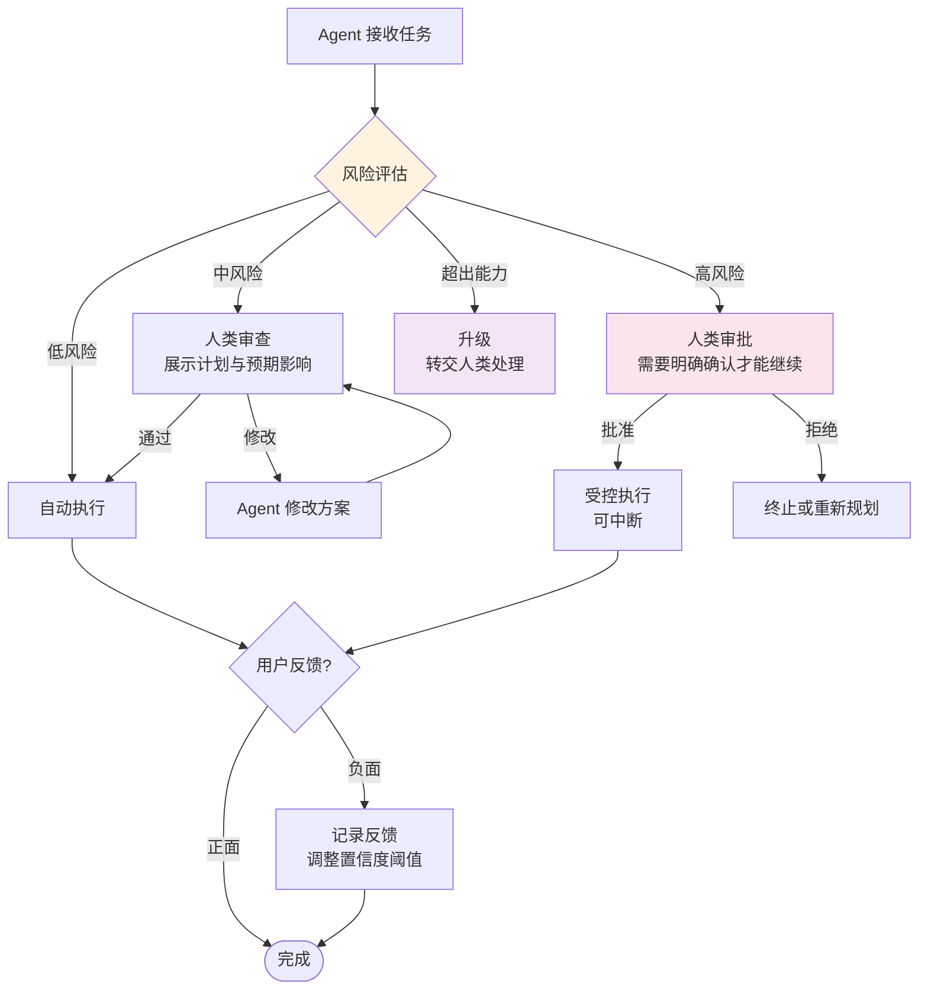
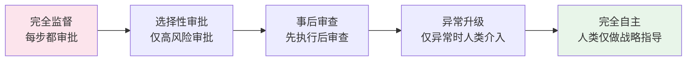

# Human-in-the-Loop：人机协作架构

## 引言

一个完全自主的 Agent 系统听起来很美好，但在生产环境中，完全信任 AI 的判断往往是不现实的——也是不负责任的。Human-in-the-Loop（HITL，人在回路中）架构承认了这一现实：在 Agent 的自主执行流程中，有策略地引入人类参与节点，让人类在关键时刻提供判断、确认或纠正。

HITL 不是对 Agent 能力的否定，而是工程上的务实选择。它建立了信任的桥梁，让 Agent 系统能够在安全可控的前提下逐步获得更大的自主权。正如 Anthropic 所指出的："让人类参与循环是让 Agent 系统在生产中安全运行的基本要求" [Anthropic, 2024]。

## 为什么 HITL 是生产必需

在 Agent 系统中引入人类参与的核心原因：

**安全性**：LLM 可能产生幻觉或做出错误决策。对于高风险操作（如发送邮件、执行交易、修改数据库），人类审批是最后的安全网。

**合规性**：许多业务场景有监管要求，关键决策需要人类审计和确认。

**质量保证**：Agent 的输出可能不完全符合业务上下文或用户期望，人类审查确保输出质量。

**信任建设**：用户和组织需要时间来建立对 Agent 系统的信任。HITL 提供了一个渐进式建立信任的机制。

## HITL 决策流程



## 核心设计模式

### 模式一：确认后执行（Confirm-Before-Execute）

最常见的 HITL 模式。Agent 在执行高影响操作前暂停，向用户展示即将执行的操作及其预期影响，等待确认。

```python
class ConfirmBeforeExecute:
    """确认后执行模式"""
    
    def __init__(self, agent, ui_bridge):
        self.agent = agent
        self.ui = ui_bridge
        self.risk_assessor = RiskAssessor()
    
    async def execute_with_confirmation(self, action: dict) -> dict:
        """评估风险，必要时请求确认"""
        risk_level = self.risk_assessor.assess(action)
        
        if risk_level == "low":
            # 低风险：直接执行
            return await self.agent.execute(action)
        
        elif risk_level == "medium":
            # 中风险：展示计划，允许修改
            user_decision = await self.ui.show_plan(
                title="Agent 计划执行以下操作",
                actions=[action],
                impact_summary=self._describe_impact(action),
                options=["approve", "modify", "reject"]
            )
            
            if user_decision.choice == "approve":
                return await self.agent.execute(action)
            elif user_decision.choice == "modify":
                modified = await self.agent.revise(action, user_decision.feedback)
                return await self.execute_with_confirmation(modified)
            else:
                return {"status": "rejected"}
        
        else:  # high risk
            # 高风险：需要明确审批，附带风险说明
            approval = await self.ui.request_approval(
                title="高风险操作需要审批",
                action=action,
                risks=self._list_risks(action),
                reversible=self._check_reversibility(action)
            )
            
            if approval.granted:
                result = await self.agent.execute(action)
                await self.ui.notify_completion(result)
                return result
            return {"status": "denied"}
```

### 模式二：审查后发送（Review-Before-Send）

适用于 Agent 生成内容（邮件、文档、代码）的场景。Agent 生成初稿，人类审查修改后再最终发送。

```python
class ReviewBeforeSend:
    """审查后发送模式"""
    
    async def generate_and_review(self, task: str) -> str:
        # Agent 生成初稿
        draft = await self.agent.generate(task)
        
        # 进入审查循环
        while True:
            review = await self.ui.present_for_review(
                content=draft,
                metadata={"task": task, "model": self.agent.model_name}
            )
            
            if review.action == "approve":
                return draft
            elif review.action == "edit":
                # 用户直接编辑
                return review.edited_content
            elif review.action == "regenerate":
                # 根据反馈重新生成
                draft = await self.agent.regenerate(task, feedback=review.feedback)
            elif review.action == "cancel":
                return None
```

### 模式三：辅助模式（Assist Mode）

Agent 不独立行动，而是为人类提供建议和辅助。人类始终保持控制权，Agent 的角色是提供信息、建议和自动化辅助。

### 模式四：升级路径（Escalation Path）

Agent 识别出自己无法处理的情况时，主动将任务升级给人类。关键是 Agent 需要具备"知道自己不知道"的能力。

```python
class EscalationHandler:
    """升级处理器"""
    
    def __init__(self, confidence_threshold: float = 0.7):
        self.confidence_threshold = confidence_threshold
    
    async def handle_with_escalation(self, query: str) -> dict:
        """处理任务，必要时升级"""
        # Agent 尝试处理并评估置信度
        result = await self.agent.process(query)
        
        if result.confidence < self.confidence_threshold:
            # 置信度不足，升级给人类
            return await self.escalate(
                query=query,
                agent_attempt=result,
                reason=f"置信度 {result.confidence:.0%} 低于阈值"
            )
        
        return result
```

## 置信度与风险评估

HITL 系统的核心挑战是判断何时需要人类介入。这通常基于两个维度：

**操作风险**：操作的影响范围和可逆性。删除数据比读取数据风险高，发送外部邮件比内部通知风险高。

**Agent 置信度**：Agent 对自己决策的确信程度。可以通过 LLM 的概率分布、一致性检查或自我评估来量化。

```python
class RiskAssessor:
    """风险评估器"""
    
    RISK_MATRIX = {
        # (影响范围, 可逆性) -> 风险等级
        ("internal", "reversible"): "low",
        ("internal", "irreversible"): "medium",
        ("external", "reversible"): "medium",
        ("external", "irreversible"): "high",
    }
    
    def assess(self, action: dict) -> str:
        scope = "external" if action.get("sends_externally") else "internal"
        reversibility = "reversible" if action.get("can_undo") else "irreversible"
        return self.RISK_MATRIX.get((scope, reversibility), "high")
```

## 渐进自主：从监督到独立

HITL 不是静态的。随着系统运行和人类反馈的积累，Agent 应该能够逐步获得更大的自主权：



实现渐进自主的关键机制：

- 跟踪 Agent 决策的准确率，当准确率持续高于阈值时提升自主级别
- 记录人类修改的模式，让 Agent 学习何时需要谨慎
- 允许回退——如果 Agent 在某个自主级别上出现问题，可以降级回去

## UX 设计考量

好的 HITL 设计需要考虑用户体验：

**最小化打扰**：不要让每个小决策都需要人类确认，这会导致用户疲劳（Alarm Fatigue）。只在真正重要的节点请求介入。

**提供充足上下文**：当请求人类审批时，要清楚展示 Agent 为什么做出这个决策、预期影响是什么、有哪些替代方案。

**尊重响应时间**：人类不总是立即可用。设计异步审批机制，允许任务在等待审批时暂停而非阻塞整个系统。

**批量审批**：对于同类型的低风险操作，允许人类一次性批准多个，而非逐个确认。

## 本章小结

Human-in-the-Loop 是生产级 Agent 系统的必要组成部分。通过在关键节点引入人类判断，HITL 架构在 Agent 的自主性和系统的安全性之间建立了平衡。四种核心模式（确认后执行、审查后发送、辅助模式、升级路径）覆盖了大部分业务场景。渐进自主的设计让系统能够随着信任的建立而不断提升效率。好的 HITL 设计不是限制 Agent，而是为 Agent 的可靠运行提供保障。

更多关于 HITL 在开发流程中的应用，参见 [开发工作流](../12-engineering/development-workflow.md)。

## 延伸阅读

- [Anthropic, 2024] "Building Effective Agents" - Human-in-the-Loop 最佳实践
- [OpenAI, 2024] "Practices for Governing Agentic AI Systems"
- [Google DeepMind, 2024] "Scalable AI Safety via Doubly-Efficient Debate"
- [Microsoft, 2024] "AutoGen - Human-in-the-Loop Conversational AI"
