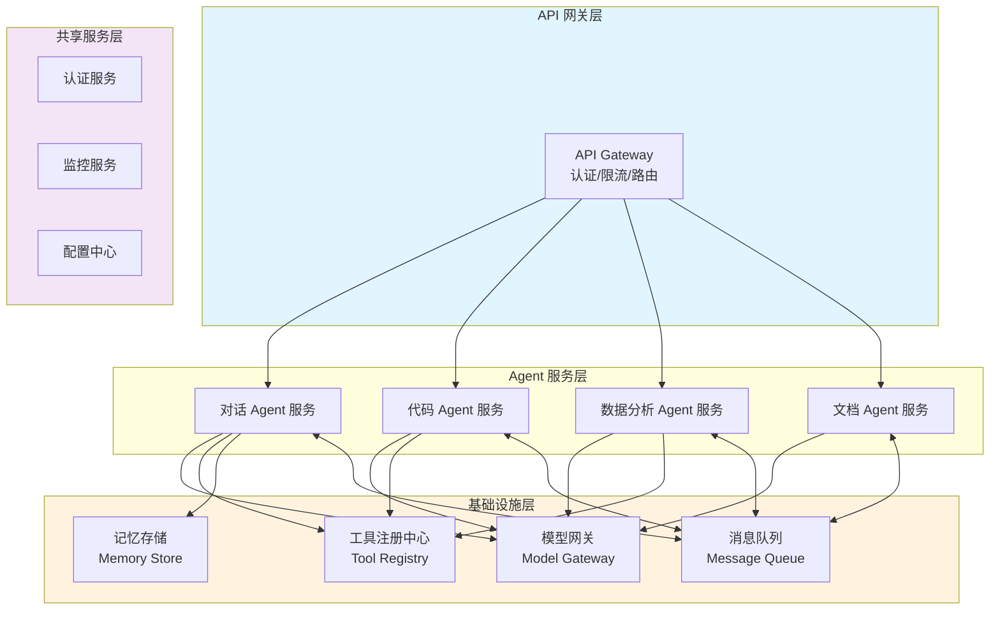

# 微服务化 Agent：大规模系统设计

## 引言

当 Agent 系统从单人项目的原型走向服务数百万用户的生产系统时，单体架构（Monolithic Architecture）将面临扩展性、可维护性和可靠性的瓶颈。微服务化 Agent 架构将系统拆分为多个独立部署、独立扩展的服务，每个服务承担一个明确的职责，通过网络通信协作完成复杂任务。

这不是所有团队都需要的架构。微服务带来的分布式系统复杂度不容小觑。但对于大规模、多团队、高可用性要求的企业级 Agent 系统，微服务化是一条经过验证的路径。

## 微服务化 Agent 架构总览



## Agent-as-a-Service

微服务化的核心思想是将每个 Agent 封装为独立的服务（Agent-as-a-Service）。每个 Agent 服务具备以下特征：

- **独立部署**：有自己的代码仓库、CI/CD 管线和部署配置
- **独立扩展**：根据负载独立进行水平扩展
- **明确边界**：有清晰的 API 契约，对外隐藏内部实现
- **自主技术选择**：可以使用不同的模型、框架和工具

```python
# Agent 服务的标准接口定义
from fastapi import FastAPI, HTTPException
from pydantic import BaseModel

app = FastAPI(title="Code Agent Service")

class AgentRequest(BaseModel):
    session_id: str
    message: str
    context: dict = {}
    
class AgentResponse(BaseModel):
    session_id: str
    response: str
    tool_calls: list = []
    metadata: dict = {}

@app.post("/v1/chat", response_model=AgentResponse)
async def chat(request: AgentRequest):
    """Agent 服务的标准入口"""
    # 从外部状态存储恢复会话
    session = await state_store.get_session(request.session_id)
    
    # 执行 Agent 逻辑
    agent = CodeAgent(
        model_client=model_gateway.get_client("claude-sonnet"),
        tools=tool_registry.get_tools("code_agent"),
        memory=memory_store.get_memory(request.session_id)
    )
    
    result = await agent.run(request.message, session=session)
    
    # 持久化状态
    await state_store.save_session(request.session_id, session)
    
    return AgentResponse(
        session_id=request.session_id,
        response=result.content,
        tool_calls=result.tool_calls,
        metadata=result.metadata
    )
```

## 服务间通信

Agent 服务之间的通信有多种模式：

### 同步通信：REST/gRPC

适合实时性要求高、调用链短的场景。例如路由器服务将请求转发给具体的 Agent 服务。

### 异步通信：消息队列

适合长时间运行的任务、需要解耦的场景。Agent 服务通过消息队列异步协作。

### A2A 协议（Agent-to-Agent）

Google 在 2024 年提出的 A2A 协议定义了 Agent 服务之间的标准通信协议，包括能力发现、任务委托和结果返回：

```python
class A2AClient:
    """Agent-to-Agent 通信客户端"""
    
    async def discover(self, capability: str) -> list:
        """发现具有特定能力的 Agent 服务"""
        return await self.registry.find_agents(capability=capability)
    
    async def delegate(self, agent_url: str, task: dict) -> dict:
        """将任务委托给另一个 Agent 服务"""
        response = await self.http_client.post(
            f"{agent_url}/v1/tasks",
            json={"task": task, "caller": self.agent_id}
        )
        return response.json()
    
    async def stream_results(self, task_id: str):
        """流式接收委托任务的结果"""
        async for chunk in self.http_client.stream(f"/v1/tasks/{task_id}/stream"):
            yield chunk
```

## 基础设施层

### 模型网关（Model Gateway）

统一管理所有 LLM API 调用，提供负载均衡、速率限制、故障转移和成本追踪：

```python
class ModelGateway:
    """模型网关：统一的 LLM 访问层"""
    
    def __init__(self):
        self.providers = {
            "openai": OpenAIProvider(),
            "anthropic": AnthropicProvider(),
            "local": LocalModelProvider(),
        }
        self.router = ModelRouter()  # 基于成本/延迟/能力路由
    
    async def chat(self, request: ChatRequest) -> ChatResponse:
        """统一的 chat 接口"""
        # 选择最优 provider
        provider = self.router.select(
            model=request.model,
            priority=request.priority
        )
        
        # 速率限制
        await self.rate_limiter.acquire(provider.name)
        
        # 执行调用，带重试和故障转移
        try:
            response = await provider.chat(request)
            self.metrics.record(provider.name, response.usage)
            return response
        except ProviderError:
            # 故障转移到备选 provider
            fallback = self.router.get_fallback(provider.name)
            return await fallback.chat(request)
```

### 工具注册中心（Tool Registry）

集中管理所有可用工具的元数据、权限和版本：

### 记忆存储（Memory Store）

外部化的状态存储，支持多种存储后端（Redis 用于短期状态，PostgreSQL 用于长期记忆，向量数据库用于语义检索）。

## 弹性伸缩

微服务化让每个 Agent 服务可以根据自身负载独立扩展：

**无状态 Agent Worker**：将所有状态外部化到 Redis/数据库后，Agent 服务本身变为无状态，可以水平扩展到任意数量的实例。

**基于队列的伸缩**：监控消息队列深度，当待处理任务积压时自动增加 Worker 实例。

**Serverless Agent Functions**：对于调用频率低但偶尔需要大量计算的 Agent，可以使用 Serverless 部署，按需启动，用完释放。

## 可观测性

分布式 Agent 系统的可观测性至关重要：

**分布式追踪**：使用 OpenTelemetry 追踪一个用户请求在多个 Agent 服务间的完整调用链。

**Agent 级别指标**：每个 Agent 服务暴露标准指标——请求量、延迟分布、LLM token 消耗、工具调用成功率、任务完成率。

**业务级别指标**：用户满意度、任务完成质量、人类升级率等高层指标。

```python
from opentelemetry import trace

tracer = trace.get_tracer("agent-service")

async def handle_request(request):
    with tracer.start_as_current_span("agent.handle_request") as span:
        span.set_attribute("agent.name", "code_agent")
        span.set_attribute("session.id", request.session_id)
        
        # LLM 调用追踪
        with tracer.start_as_current_span("llm.chat"):
            response = await model_gateway.chat(...)
            span.set_attribute("llm.model", response.model)
            span.set_attribute("llm.tokens.total", response.usage.total_tokens)
        
        # 工具调用追踪
        with tracer.start_as_current_span("tool.execute"):
            tool_result = await tool.execute(...)
            span.set_attribute("tool.name", tool.name)
            span.set_attribute("tool.success", tool_result.success)
```

## 部署模式

**容器化部署**：每个 Agent 服务打包为 Docker 容器，通过 Kubernetes 编排。适合大规模、多团队的场景。

**Serverless 函数**：简单的 Agent 逻辑部署为云函数（AWS Lambda、Google Cloud Functions），按调用计费，免运维。

**混合部署**：核心 Agent 服务使用容器化部署保证性能和可控性，低频辅助功能使用 Serverless 降低成本。

## 何时需要微服务化

微服务化带来的复杂度不容忽视——网络延迟、分布式一致性、服务发现、熔断限流等都是额外的工程负担。只有在以下条件满足时，微服务化才是合理的选择：

- 系统需要服务大量并发用户（千级以上 QPS）
- 多个团队需要独立开发和部署各自的 Agent
- 不同 Agent 有显著不同的扩展需求
- 需要高可用性和故障隔离
- 组织已有微服务基础设施和运维经验

对于小团队和早期产品，单体 Agent 应用配合进程内的模块化设计通常是更明智的起点。

## 本章小结

微服务化 Agent 架构将 Agent 系统拆分为独立服务，通过标准化的通信协议协作。模型网关、工具注册中心和外部化状态存储构成了共享基础设施层。这种架构支持大规模水平扩展和多团队并行开发，但也带来了显著的分布式系统复杂度。在选择微服务化之前，务必评估团队的工程能力和实际的规模需求——过早的微服务化是一种常见的过度工程。

## 延伸阅读

- [Google, 2024] "Agent2Agent (A2A) Protocol" 开放规范
- [Newman, 2021] "Building Microservices" 第二版
- [Burns et al., 2016] "Design Patterns for Container-Based Distributed Systems"
- [OpenTelemetry] 官方文档：分布式追踪与可观测性
- [Anthropic, 2024] "Scaling Agent Infrastructure at Enterprise Level"
