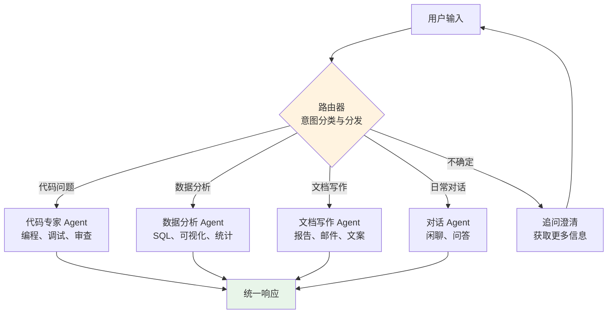

# 路由架构：智能分发与专家委派

## 引言

当一个 Agent 系统需要处理多种不同类型的任务时，用单一 Agent 覆盖所有场景往往不是最优选择。路由架构（Router Architecture）引入了一个关键的设计理念：让一个轻量级的路由器（Router）负责理解用户意图，然后将任务分发给最合适的专家 Agent 处理。

这种模式在现实世界中无处不在：医院的分诊台、公司的前台接待、电话客服的 IVR 系统，都是路由的体现。在 Agent 系统中，路由架构实现了关注点分离、成本优化和模块化扩展。

## 路由架构的核心结构



路由架构的三个核心组件：

- **路由器（Router）**：接收用户输入，判断任务类型，决定分发目标
- **专家 Agent（Specialist）**：各自专注于特定领域，拥有专属的工具集和系统提示
- **响应聚合器（Aggregator）**：可选组件，整合多个专家的输出

## 路由策略

### 语义路由（Semantic Routing）

使用 LLM 或嵌入模型对用户输入进行语义理解，匹配最合适的处理器：

```python
class SemanticRouter:
    """基于语义理解的路由器"""
    
    def __init__(self, llm, specialists: dict):
        self.llm = llm
        self.specialists = specialists
    
    async def route(self, user_input: str, context: dict = None) -> str:
        """根据用户输入语义决定路由目标"""
        specialist_descriptions = "\n".join(
            f"- {name}: {spec.description}"
            for name, spec in self.specialists.items()
        )
        
        response = await self.llm.chat(
            system=f"""你是一个任务路由器。根据用户输入，选择最合适的处理专家。
可用专家：
{specialist_descriptions}

只返回专家名称，不要解释。如果不确定，返回 "clarify"。""",
            user=user_input
        )
        
        chosen = response.content.strip()
        if chosen in self.specialists:
            return chosen
        return "clarify"
    
    async def dispatch(self, user_input: str) -> str:
        """路由并执行"""
        target = await self.route(user_input)
        if target == "clarify":
            return "能否更具体地描述一下您的需求？"
        
        specialist = self.specialists[target]
        return await specialist.handle(user_input)
```

### 多模型路由（Multi-Model Routing）

一种成本优化策略：用便宜的小模型做路由分类，只有在需要高质量推理时才调用昂贵的大模型。

```python
class CostOptimizedRouter:
    """成本优化的多模型路由"""
    
    def __init__(self):
        self.classifier = SmallModel("gpt-4o-mini")  # 低成本分类
        self.models = {
            "simple": SmallModel("gpt-4o-mini"),       # 简单任务
            "complex": LargeModel("gpt-4o"),           # 复杂推理
            "code": CodeModel("claude-sonnet"),        # 代码生成
        }
    
    async def route_and_execute(self, query: str) -> str:
        # 第一步：低成本分类
        complexity = await self.classifier.classify(
            query, 
            categories=["simple", "complex", "code"]
        )
        
        # 第二步：调用对应模型
        model = self.models[complexity]
        return await model.generate(query)
```

这种策略可以显著降低 API 成本。根据实际经验，大约 60-70% 的用户请求可以用小模型处理，只有 30-40% 需要大模型 [Anthropic, 2024]。

### 技能匹配路由（Skill-Based Routing）

将路由视为用户意图到 Agent 技能的匹配过程。每个专家 Agent 注册自己的能力描述，路由器在运行时动态匹配：

```python
@dataclass
class AgentCapability:
    """Agent 能力描述"""
    name: str
    description: str
    examples: list[str]       # 示例输入
    embedding: list[float]    # 能力描述的向量嵌入

class SkillRouter:
    """基于技能匹配的路由"""
    
    def __init__(self, embedding_model):
        self.embedding_model = embedding_model
        self.capabilities: list[AgentCapability] = []
    
    def register(self, capability: AgentCapability):
        """注册新的 Agent 能力"""
        self.capabilities.append(capability)
    
    async def route(self, query: str) -> str:
        """通过向量相似度匹配最佳 Agent"""
        query_embedding = await self.embedding_model.embed(query)
        
        best_match = max(
            self.capabilities,
            key=lambda cap: cosine_similarity(query_embedding, cap.embedding)
        )
        
        return best_match.name
```

## OpenAI 的 Handoff 模式

OpenAI 在其 Agent SDK 中提出了 "Agents as Tools" 的 Handoff 模式：Agent 可以将控制权移交（Handoff）给另一个 Agent，就像客服电话中的"转接"：

```python
class HandoffOrchestrator:
    """Handoff 模式：Agent 间的控制权转移"""
    
    def __init__(self, agents: dict):
        self.agents = agents
        self.current_agent = "triage"  # 初始为分诊 Agent
    
    async def run(self, user_input: str) -> str:
        """运行当前 Agent，处理可能的 Handoff"""
        while True:
            agent = self.agents[self.current_agent]
            result = await agent.handle(user_input)
            
            if result.handoff_to:
                # Agent 请求转移控制权
                self.current_agent = result.handoff_to
                user_input = result.handoff_context  # 传递上下文
                continue
            else:
                # 当前 Agent 直接返回结果
                return result.response
```

Handoff 模式的核心优势在于：每个 Agent 可以自主判断何时需要转移，而不仅仅依赖一个中心路由器的决策。这让系统更灵活，也更贴近真实的协作场景。

## 路由架构的优势

**模块化**：每个专家 Agent 独立开发、测试和部署，互不干扰。新增能力只需注册新的专家 Agent。

**成本优化**：不同复杂度的任务使用不同成本的模型，避免所有请求都走最贵的模型。

**关注点分离**：路由逻辑和业务逻辑解耦。路由器只负责分发，不负责具体执行。

**可观测性**：路由决策提供了清晰的日志——每个请求走了哪条路径一目了然。

**渐进式扩展**：系统初期可以只有少量专家 Agent，后续按需增加，无需重构整体架构。

## 设计注意事项

**路由错误处理**：当路由器分类错误时，专家 Agent 应能识别"这不是我的领域"并触发重新路由或升级。

**上下文传递**：路由时需要将足够的上下文传递给目标 Agent，避免信息丢失。多轮对话中还需处理对话历史的传递。

**路由一致性**：同一类型的请求应该始终路由到同一个专家，避免用户体验的不一致。

**回退策略**：当所有专家都不适合时需要有通用的回退 Agent，确保用户始终能得到响应。

## 与其他模式的关系

路由架构可以与其他架构模式自由组合。路由器内部可以是简单的分类逻辑，也可以是一个完整的状态机。被路由到的专家 Agent 内部可以运行单 Agent 循环或 DAG 工作流。多层路由（先路由到领域，再路由到具体能力）形成树状结构。这种灵活的组合性是路由架构的重要特性。

更多关于路由模式的讨论，参见 [Agentic 设计模式](../05-fundamentals/agentic-patterns.md)。

## 本章小结

路由架构通过引入智能分发层，实现了 Agent 系统的模块化和可扩展性。它特别适合需要处理多种类型任务的系统，能够有效降低成本、提高专业度和简化维护。语义路由、多模型路由和技能匹配是三种主要的路由策略，Handoff 模式则提供了更灵活的 Agent 间协作方式。在实践中，路由架构几乎总是与其他模式结合使用——它本身不解决具体问题，而是将问题交给最合适的解决者。

## 延伸阅读

- [OpenAI, 2025] "Agents SDK - Handoffs" 官方文档
- [Anthropic, 2024] "Building Effective Agents" - Routing 模式
- [Semantic Router] 开源项目：基于语义的快速路由库
- [AWS, 2024] "Multi-Agent Orchestration with Bedrock" - 企业级路由实践
