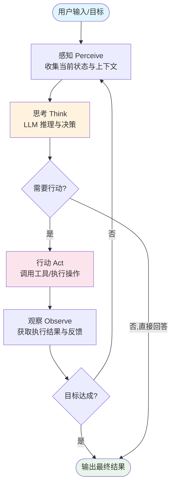
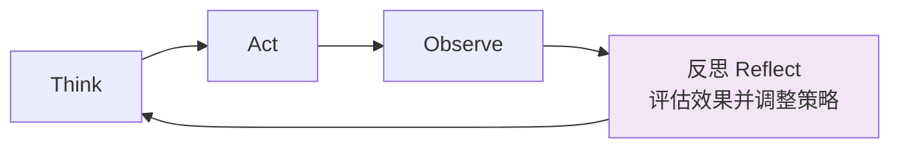

# 单 Agent 循环：最基础的架构模式

## 引言

单 Agent 循环（Single Agent Loop）是所有 Agent 系统中最基础、最核心的架构模式。无论后续的多 Agent 系统、状态机架构还是微服务化设计多么复杂，其底层的每一个 Agent 单元，本质上都是一个循环结构。理解这个基础循环，是掌握所有高级架构的前提。

这一模式的核心思想源自经典的控制论（Cybernetics）：系统通过不断地感知环境、做出决策、执行动作、观察反馈来逐步逼近目标 [Russell & Norvig, 2020]。在 LLM Agent 的语境下，这个循环由大语言模型驱动，赋予了系统前所未有的灵活性。

## 基本循环：Perceive - Think - Act - Observe

单 Agent 循环的四个阶段构成了一个闭环反馈系统：



每个阶段的职责如下：

- **感知（Perceive）**：整合用户输入、历史对话、环境状态、工具返回结果等信息，构建当前上下文
- **思考（Think）**：将上下文提交给 LLM，由模型进行推理，决定下一步行动策略
- **行动（Act）**：根据 LLM 的决策调用外部工具、执行代码或产生输出
- **观察（Observe）**：收集行动的结果，更新系统状态，为下一轮循环提供新的信息

## ReAct：典范的单 Agent 架构

ReAct（Reasoning + Acting）[Yao et al., 2023] 是单 Agent 循环最具代表性的实现范式。它将推理过程（Thought）和行动过程（Action）交织在一起，形成 Thought - Action - Observation 的迭代序列。

```python
class ReActAgent:
    """ReAct 模式的最小实现"""
    
    def __init__(self, llm, tools, max_iterations=10):
        self.llm = llm
        self.tools = {tool.name: tool for tool in tools}
        self.max_iterations = max_iterations
    
    def run(self, user_query: str) -> str:
        """主循环：持续推理和行动直到完成"""
        messages = [
            {"role": "system", "content": self._build_system_prompt()},
            {"role": "user", "content": user_query}
        ]
        
        for iteration in range(self.max_iterations):
            # Think: LLM 推理
            response = self.llm.chat(messages)
            
            # 判断是否需要行动
            if response.has_tool_call:
                # Act: 执行工具调用
                tool_name = response.tool_call.name
                tool_args = response.tool_call.arguments
                
                # Observe: 获取工具执行结果
                observation = self.tools[tool_name].execute(**tool_args)
                
                # 将行动和观察加入上下文
                messages.append({"role": "assistant", "content": response.content})
                messages.append({"role": "tool", "content": observation})
            else:
                # 无需行动，返回最终答案
                return response.content
        
        return "达到最大迭代次数，未能完成任务"
    
    def _build_system_prompt(self) -> str:
        tool_descriptions = "\n".join(
            f"- {name}: {tool.description}" 
            for name, tool in self.tools.items()
        )
        return f"""你是一个能使用工具的智能助手。
可用工具：
{tool_descriptions}

请逐步思考，必要时调用工具获取信息，最终给出完整回答。"""
```

## 状态管理

单 Agent 循环中的状态管理是保证系统正确运行的关键。状态通常包含以下几个维度：

**对话状态（Conversation State）**：完整的消息历史，是 LLM 推理的上下文基础。随着循环迭代，消息列表持续增长，需要考虑上下文窗口限制。

**任务状态（Task State）**：当前任务的进度信息，包括已完成的子步骤、收集到的中间结果、待处理的子目标等。

**环境状态（Environment State）**：外部环境的快照，如文件系统状态、数据库内容、API 返回值等。

```python
from dataclasses import dataclass, field
from typing import Any

@dataclass
class AgentState:
    """Agent 循环的状态容器"""
    messages: list = field(default_factory=list)
    iteration: int = 0
    intermediate_results: dict = field(default_factory=dict)
    goal_achieved: bool = False
    metadata: dict = field(default_factory=dict)
    
    def add_message(self, role: str, content: str):
        self.messages.append({"role": role, "content": content})
        self.iteration += 1
    
    def get_context_window(self, max_tokens: int = 8000) -> list:
        """智能截断：保留系统提示和最近的消息"""
        if self._estimate_tokens() <= max_tokens:
            return self.messages
        # 保留第一条系统提示和最近N条消息
        return [self.messages[0]] + self.messages[-20:]
```

## 终止条件

合理的终止条件设计是防止 Agent 陷入无限循环的关键防线：

| 终止条件 | 触发场景 | 实现方式 |
|---------|---------|---------|
| 目标达成 | LLM 判断任务已完成 | 模型输出 final_answer |
| 最大迭代 | 防止无限循环 | 计数器大于等于 max_iterations |
| 用户中断 | 用户主动取消 | 信号处理或中断标志 |
| 超时限制 | 单次执行时间过长 | wall-clock timeout |
| 错误累积 | 连续失败次数过多 | 错误计数器阈值 |
| 资源耗尽 | token 预算或 API 配额用完 | 资源监控 |

```python
import time

def should_terminate(state: AgentState, config: dict) -> tuple:
    """综合判断是否应该终止循环"""
    if state.goal_achieved:
        return True, "goal_achieved"
    if state.iteration >= config["max_iterations"]:
        return True, "max_iterations_reached"
    if state.metadata.get("consecutive_errors", 0) >= config["max_errors"]:
        return True, "too_many_errors"
    if time.time() - state.metadata.get("start_time", 0) > config["timeout_seconds"]:
        return True, "timeout"
    return False, ""
```

## 循环变体

基础循环可以根据需求扩展出多种变体：

### 带记忆的循环（With Memory）

在每次循环结束时将关键信息写入长期记忆，下次循环开始时从记忆中检索相关信息。适用于需要跨会话保持上下文的场景。

### 带反思的循环（With Reflection）

在行动后增加一个反思步骤，让 LLM 评估自己的行为是否有效，是否需要调整策略。这对应 Reflexion [Shinn et al., 2023] 等方法。



### 带规划的循环（With Planning）

在循环开始前先制定一个多步计划，循环过程中逐步执行计划中的步骤。当某步失败时可以动态修改计划。参见 [规划模块](../07-core-modules/planning.md)。

## 何时足够，何时需要更复杂的架构

单 Agent 循环适用的场景：

- 任务可以由单个角色独立完成
- 不需要并行处理多个独立子任务
- 工具调用是顺序的，无需复杂编排
- 对话轮次有限（通常少于 20 轮工具调用）

需要升级到更复杂架构的信号：

- 任务需要多种专业角色协作（参考 [路由架构](./router-architecture.md)）
- 流程有明确的状态转换逻辑（参考 [状态机架构](./state-machine.md)）
- 存在可并行的独立子任务（参考 [DAG 工作流](./dag-workflow.md)）
- 需要响应外部事件而非纯请求-响应（参考 [事件驱动架构](./event-driven.md)）

## 本章小结

单 Agent 循环是 Agent 架构的原子单元。它的核心是一个由 LLM 驱动的 Perceive-Think-Act-Observe 闭环，通过持续迭代来完成目标。ReAct 模式是这一循环最经典的实现。理解状态管理、终止条件设计以及各种循环变体，能帮助你在实践中构建可靠的单 Agent 系统。当单循环不再满足需求时，可以将其作为构建块嵌入更复杂的架构中。

## 延伸阅读

- [Yao et al., 2023] "ReAct: Synergizing Reasoning and Acting in Language Models"
- [Shinn et al., 2023] "Reflexion: Language Agents with Verbal Reinforcement Learning"
- [Russell & Norvig, 2020] "Artificial Intelligence: A Modern Approach" - 第 2 章 Agent 概念
- [Sumers et al., 2024] "Cognitive Architectures for Language Agents: A Survey"
