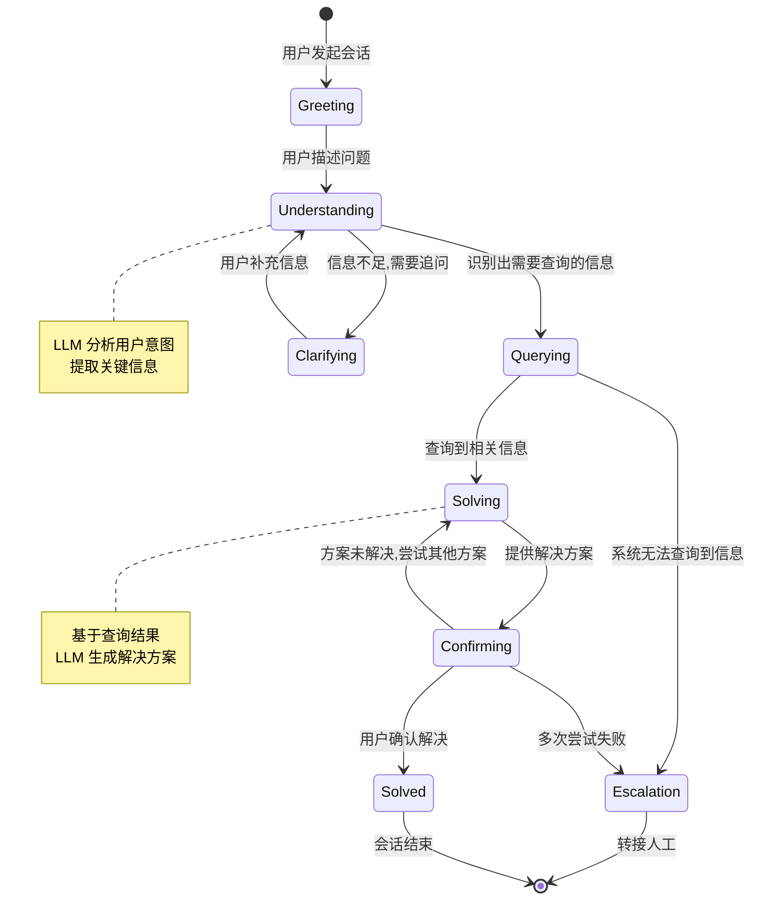

# 状态机架构：确定性与灵活性的平衡

## 引言

自由循环（Free-form Loop）赋予 Agent 最大的灵活性，但也带来了不可预测性——你很难精确控制 Agent 在什么时候做什么事。状态机架构（State Machine Architecture）通过引入明确的状态定义和转换规则，在 Agent 的灵活性和系统的可预测性之间找到了一个工程化的平衡点。

有限状态机（Finite State Machine, FSM）是计算机科学中最基础的计算模型之一。将其应用于 Agent 编排时，Agent 在任何时刻都处于一个明确的"状态"中，状态之间的转换由 LLM 的决策或外部事件触发。这种设计让系统既保留了 LLM 的智能决策能力，又具备了工程系统所需的可观测性和可调试性。

## 为什么状态机适合 Agent

Agent 系统本质上是在处理具有多个阶段的复杂任务。以一个客服 Agent 为例，它需要经历理解问题、查询信息、提供方案、确认解决等不同阶段。这些阶段之间的转换逻辑是相对固定的——你不会在还没理解问题时就给出解决方案。

状态机的优势在于：

- **可预测性**：每个状态有明确的行为定义，转换条件清晰可查
- **可观测性**：系统当前状态一目了然，便于监控和日志记录
- **可测试性**：可以针对每个状态和每个转换编写单元测试
- **可恢复性**：系统崩溃后可以从最后已知状态恢复
- **可审计性**：完整的状态转换历史提供了审计轨迹

## 状态机核心概念



上图展示了一个客服 Agent 的状态机设计。每个状态代表 Agent 的一种"工作模式"：

| 状态 | Agent 行为 | 可用工具 |
|-----|-----------|---------|
| Greeting | 问候用户，引导描述问题 | 无 |
| Understanding | 分析用户意图，提取关键实体 | 意图分类器 |
| Clarifying | 生成追问问题 | 无 |
| Querying | 查询知识库/数据库 | 搜索工具、数据库 |
| Solving | 基于信息生成解决方案 | 知识库、模板 |
| Confirming | 确认方案是否有效 | 无 |
| Escalation | 转接人工客服 | 工单系统 |

## 实现：基于 LangGraph 的状态图

LangGraph 是目前最流行的 Agent 状态机框架，它将状态图概念和 LLM 调用自然结合：

```python
from typing import TypedDict, Literal
from langgraph.graph import StateGraph, END

# 定义共享状态结构
class CustomerServiceState(TypedDict):
    messages: list              # 对话历史
    current_state: str          # 当前状态名
    user_intent: str            # 识别出的用户意图
    query_results: list         # 查询结果
    solution: str               # 当前解决方案
    attempt_count: int          # 尝试次数
    resolved: bool              # 是否解决

# 定义各状态的处理节点
def understanding_node(state: CustomerServiceState) -> dict:
    """理解用户问题"""
    response = llm.chat(
        system="分析用户问题，提取意图和关键信息。",
        messages=state["messages"]
    )
    return {
        "user_intent": response.intent,
        "current_state": "understanding"
    }

def querying_node(state: CustomerServiceState) -> dict:
    """查询相关信息"""
    results = knowledge_base.search(
        intent=state["user_intent"],
        context=state["messages"][-1]["content"]
    )
    return {"query_results": results}

def solving_node(state: CustomerServiceState) -> dict:
    """生成解决方案"""
    solution = llm.chat(
        system="基于以下信息生成解决方案",
        context=state["query_results"],
        messages=state["messages"]
    )
    return {
        "solution": solution.content,
        "attempt_count": state["attempt_count"] + 1
    }

# 定义路由函数（状态转换逻辑）
def route_after_understanding(state: CustomerServiceState) -> str:
    """理解后的路由决策"""
    if state["user_intent"] == "unclear":
        return "clarifying"
    return "querying"

def route_after_confirming(state: CustomerServiceState) -> str:
    """确认后的路由决策"""
    if state["resolved"]:
        return END
    if state["attempt_count"] >= 3:
        return "escalation"
    return "solving"

# 构建状态图
graph = StateGraph(CustomerServiceState)

# 添加节点
graph.add_node("understanding", understanding_node)
graph.add_node("clarifying", clarifying_node)
graph.add_node("querying", querying_node)
graph.add_node("solving", solving_node)
graph.add_node("confirming", confirming_node)
graph.add_node("escalation", escalation_node)

# 添加边（状态转换）
graph.set_entry_point("understanding")
graph.add_conditional_edges("understanding", route_after_understanding)
graph.add_edge("clarifying", "understanding")
graph.add_edge("querying", "solving")
graph.add_edge("solving", "confirming")
graph.add_conditional_edges("confirming", route_after_confirming)
graph.add_edge("escalation", END)

# 编译并运行
app = graph.compile()
```

## 状态转换的决策方式

状态之间的转换可以由不同的机制驱动：

**LLM 决策型**：由大模型分析当前状态和上下文，决定转换到哪个状态。灵活性最高但可预测性较低。

**规则型**：基于确定性条件（如 `attempt_count >= 3`）进行转换。完全可预测，适合业务规则明确的场景。

**混合型**：关键路径使用规则保证安全性，非关键路径使用 LLM 提供灵活性。这是生产环境中最常见的做法。

```python
def hybrid_router(state: dict) -> str:
    """混合路由：规则优先，LLM 兜底"""
    # 规则层：硬性约束
    if state["error_count"] >= 5:
        return "error_recovery"
    if state["budget_exceeded"]:
        return "terminate"
    
    # LLM 层：智能决策
    decision = llm.classify(
        prompt=f"当前状态：{state['current_phase']}，应该转到哪个阶段？",
        options=["continue", "pivot", "complete"]
    )
    return decision
```

## 优势与劣势

**优势**：

- 系统行为可预测，适合需要合规审计的场景
- 每个状态可以独立开发和测试
- 状态转换历史提供完整的执行轨迹
- 崩溃恢复简单：重新进入最后已知状态
- 便于团队协作：不同工程师负责不同状态

**劣势**：

- 状态空间设计需要提前规划，难以处理完全未预期的情况
- 复杂任务可能导致状态爆炸（State Explosion）
- 修改流程需要重新设计状态图
- 对于高度创造性的任务，预定义的状态可能过于僵硬

## 与自由循环的对比

| 维度 | 自由循环 | 状态机 |
|-----|---------|-------|
| 灵活性 | 极高 | 中等 |
| 可预测性 | 低 | 高 |
| 调试难度 | 高 | 低 |
| 适用任务 | 开放式探索 | 流程化任务 |
| 开发成本 | 低（快速原型） | 中（需设计状态图） |
| 运维成本 | 高（难以监控） | 低（状态可观测） |

实践建议：在原型阶段使用自由循环快速验证可行性，在产品化阶段将验证有效的流程固化为状态机。两者并非互斥——状态机中的每个节点内部可以运行一个小型的自由循环。

## 本章小结

状态机架构通过将 Agent 的行为组织为有限个明确状态和状态间的转换规则，在灵活性和可控性之间取得了工程化的平衡。LangGraph 等框架让状态机设计变得实用且优雅。对于具有明确流程的业务场景（客服、审批、数据处理管线等），状态机是首选架构。但要注意其对未预期情况的处理能力有限，必要时可以结合自由循环或[事件驱动架构](./event-driven.md)来增强灵活性。

## 延伸阅读

- LangGraph 官方文档：State Graph 设计模式
- [Hopcroft et al., 2006] "Introduction to Automata Theory, Languages, and Computation"
- [Brooks, 1986] "A Robust Layered Control System for a Mobile Robot" — 行为状态机的经典论文
- [Anthropic, 2024] "Building Effective Agents" — Workflow 模式与状态管理
