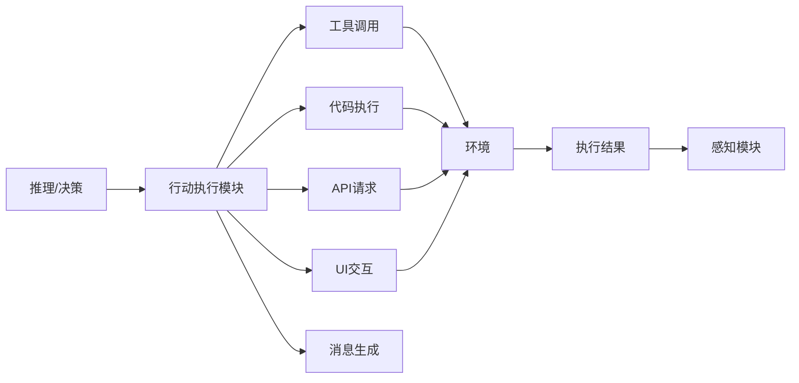
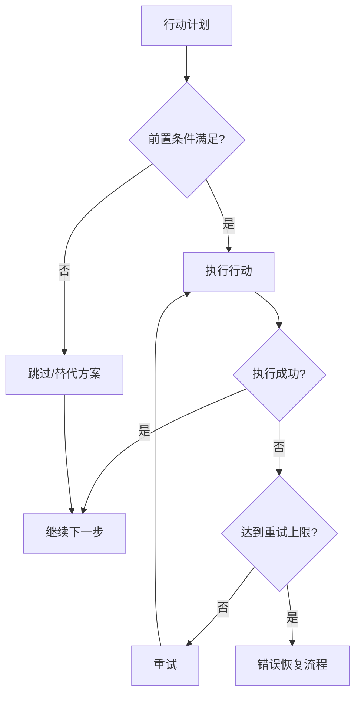
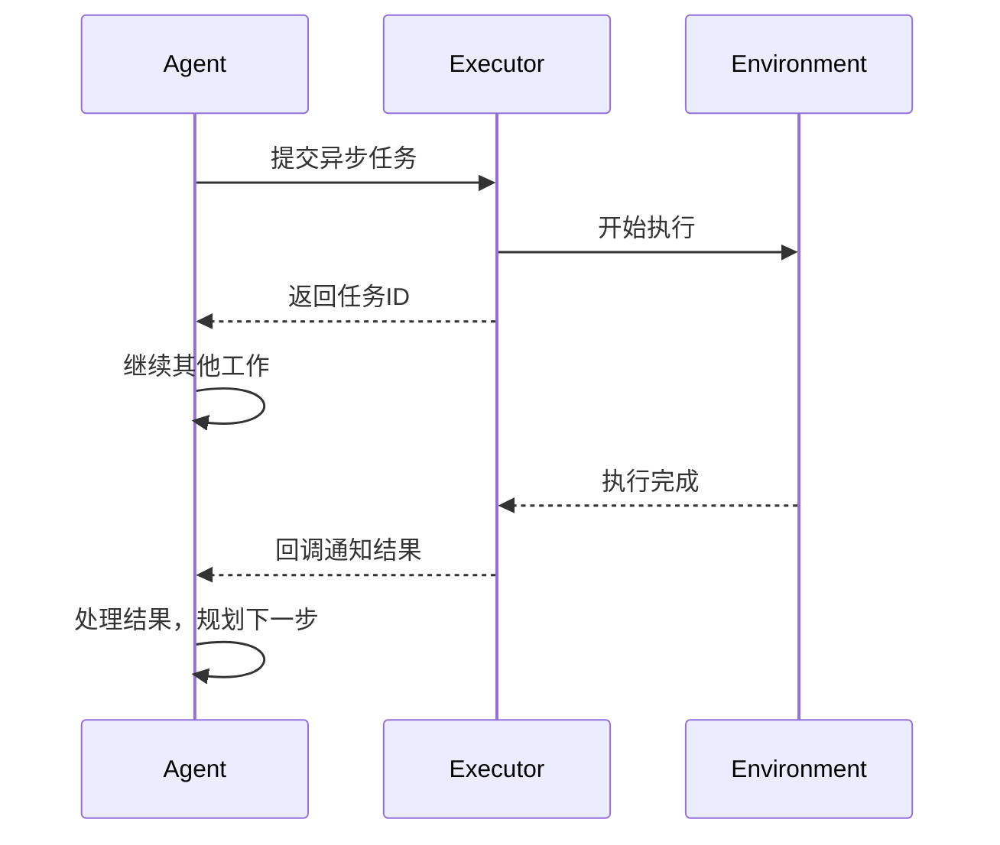

# 行动执行：从决策到实际操作

## 概述

行动执行模块（Action Execution Module）是 Agent 将"想法"变为"现实"的关键环节。推理模块决定"做什么"，而行动执行模块负责"怎么做"——将抽象的决策转化为具体的系统调用、API 请求或环境交互。

这一层的设计质量直接影响 Agent 的可靠性和安全性。一个设计不当的执行层可能导致数据丢失、系统崩溃，甚至安全事故。



## 行动类型分类

### 工具调用（Tool Calls）

工具调用是 Agent 最常见的行动形式，通过预定义接口与外部系统交互：

- **文件操作**：读写文件、创建目录、搜索文件
- **搜索工具**：代码搜索（grep）、语义搜索、Web 搜索
- **系统命令**：终端命令执行、进程管理
- **外部服务**：数据库查询、HTTP API 调用

### 代码执行（Code Execution）

Agent 生成并执行代码以完成复杂计算或数据处理：Python/JavaScript 脚本执行、Shell 命令序列、数据分析和可视化、自动化测试运行等。

### API 请求

与外部服务的程序化交互，包括 REST API 调用、GraphQL 查询、RPC 服务调用和 Webhook 触发。

### UI 交互

通过图形界面进行操作：浏览器自动化（点击、填写表单、导航）、桌面应用操作、移动端模拟操作。

### 消息生成

向用户或其他系统输出信息：回复用户提问、生成报告和文档、发送通知和告警。

## 执行策略

### 顺序执行（Sequential Execution）

最简单也最安全的策略，按序执行每个行动并等待结果：

```python
class SequentialExecutor:
    """顺序执行器：一次执行一个动作"""
    
    async def execute(self, actions: list[Action]) -> list[ActionResult]:
        results = []
        for action in actions:
            result = await self._execute_single(action)
            results.append(result)
            
            # 如果某步失败，决定是否继续
            if result.failed and action.stop_on_failure:
                break
                
        return results
    
    async def _execute_single(self, action: Action) -> ActionResult:
        """执行单个动作，带超时和重试"""
        for attempt in range(action.max_retries + 1):
            try:
                result = await asyncio.wait_for(
                    action.execute(),
                    timeout=action.timeout
                )
                return ActionResult(success=True, data=result)
            except TimeoutError:
                if attempt == action.max_retries:
                    return ActionResult(success=False, error="Timeout")
            except Exception as e:
                if attempt == action.max_retries:
                    return ActionResult(success=False, error=str(e))
                await asyncio.sleep(2 ** attempt)  # 指数退避
```

### 并行执行（Parallel Execution）

当多个行动之间无依赖关系时，可以并行执行以提高效率：

```python
class ParallelExecutor:
    """并行执行器：同时执行独立的动作"""
    
    async def execute(self, actions: list[Action], 
                     max_concurrency: int = 5) -> list[ActionResult]:
        semaphore = asyncio.Semaphore(max_concurrency)
        
        async def _bounded_execute(action):
            async with semaphore:
                return await self._execute_single(action)
        
        tasks = [_bounded_execute(action) for action in actions]
        results = await asyncio.gather(*tasks, return_exceptions=True)
        
        return [
            r if isinstance(r, ActionResult) 
            else ActionResult(success=False, error=str(r))
            for r in results
        ]
```

### Agent 并发编程模型深入

Agent 系统的并发复杂度远超普通 Web 服务，因为它需要在"LLM 推理"和"工具执行"两种异步操作之间协调，且存在动态的依赖关系（后续步骤依赖前序结果）。

**依赖图解析——自动识别可并行任务：**

当 Agent 规划器生成一组待执行任务时，不是所有任务都能并行。需要分析任务间的依赖关系，将独立任务并行化：

```python
from dataclasses import dataclass, field
import asyncio

@dataclass
class TaskNode:
    id: str
    action: Action
    dependencies: list[str] = field(default_factory=list)  # 依赖的任务 ID
    result: ActionResult | None = None

class DependencyGraphExecutor:
    """基于依赖图的并行执行器"""
    
    async def execute(self, tasks: list[TaskNode]) -> dict[str, ActionResult]:
        completed: dict[str, ActionResult] = {}
        pending = {t.id: t for t in tasks}
        
        while pending:
            # 找出所有依赖已满足的任务（可并行执行）
            ready = [
                t for t in pending.values()
                if all(dep in completed for dep in t.dependencies)
            ]
            
            if not ready:
                raise RuntimeError("循环依赖或死锁")
            
            # 并行执行所有就绪任务
            results = await asyncio.gather(*[
                self._execute_with_context(t, completed) for t in ready
            ])
            
            for task, result in zip(ready, results):
                completed[task.id] = result
                del pending[task.id]
        
        return completed
    
    async def _execute_with_context(self, task: TaskNode, 
                                      prior_results: dict) -> ActionResult:
        """执行任务，注入前序任务的结果作为上下文"""
        context = {dep: prior_results[dep] for dep in task.dependencies}
        return await self._execute_single(task.action, context=context)
```

**并发 LLM 调用的 Rate Limit 协调：**

当多个 Agent 或子任务并发调用同一 LLM API 时，需要全局协调以避免触发 rate limit。关键设计是共享一个进程级（或分布式）的限流器实例：

```python
# 全局单例限流器，所有并发 Agent 共享
_global_rate_limiter = None

def get_rate_limiter() -> RateLimiter:
    global _global_rate_limiter
    if _global_rate_limiter is None:
        _global_rate_limiter = RateLimiter(
            requests_per_minute=500,   # 按 API plan 的 80% 设置
            tokens_per_minute=150000
        )
    return _global_rate_limiter

class ConcurrentAgentPool:
    """并发 Agent 池，共享 rate limit 预算"""
    
    def __init__(self, max_agents: int = 10):
        self.semaphore = asyncio.Semaphore(max_agents)
        self.limiter = get_rate_limiter()
    
    async def run_agent(self, agent, task: str) -> str:
        async with self.semaphore:
            # 每次 LLM 调用前获取许可
            await self.limiter.acquire(estimated_tokens=2000)
            return await agent.execute(task)
    
    async def run_batch(self, agents_and_tasks: list[tuple]) -> list:
        """批量并发执行多个 Agent 任务"""
        return await asyncio.gather(*[
            self.run_agent(agent, task) 
            for agent, task in agents_and_tasks
        ])
```

**多 Agent 并发的资源竞争：**

当多个 Agent 同时操作共享资源（如同一个文件系统、同一个数据库）时，需要协调机制防止冲突：

```python
class ResourceLockManager:
    """Agent 级别的资源锁管理（乐观锁 + 冲突检测）"""
    
    def __init__(self):
        self._locks: dict[str, asyncio.Lock] = {}
    
    async def acquire(self, resource_id: str, agent_id: str, timeout: float = 30):
        """获取资源的排他访问权"""
        if resource_id not in self._locks:
            self._locks[resource_id] = asyncio.Lock()
        
        try:
            await asyncio.wait_for(
                self._locks[resource_id].acquire(), timeout=timeout
            )
        except asyncio.TimeoutError:
            raise ResourceConflictError(
                f"Agent {agent_id} 无法获取资源 {resource_id} 的锁，"
                f"可能被其他 Agent 长期占用"
            )
    
    def release(self, resource_id: str):
        if resource_id in self._locks:
            self._locks[resource_id].release()
```

### 条件执行（Conditional Execution）

根据前置条件或前一步结果决定是否执行：



## 沙箱与安全

### 代码执行沙箱

Agent 生成的代码必须在受限环境中执行，防止意外或恶意操作：

```python
class SandboxedExecutor:
    """沙箱化的代码执行环境"""
    
    def __init__(self):
        self.allowed_imports = {"os", "json", "re", "math", "datetime"}
        self.blocked_operations = {"rm -rf", "DROP TABLE", "format c:"}
        self.resource_limits = {
            "max_memory_mb": 512,
            "max_cpu_seconds": 30,
            "max_file_size_mb": 100,
            "max_network_requests": 10,
        }
    
    def validate_before_execution(self, code: str) -> ValidationResult:
        """执行前安全检查"""
        issues = []
        
        # 检查危险操作
        for blocked in self.blocked_operations:
            if blocked in code:
                issues.append(f"检测到危险操作: {blocked}")
        
        # 检查导入白名单
        imports = extract_imports(code)
        unauthorized = imports - self.allowed_imports
        if unauthorized:
            issues.append(f"未授权的导入: {unauthorized}")
        
        # 检查文件系统访问范围
        file_paths = extract_file_paths(code)
        for path in file_paths:
            if not self._is_within_workspace(path):
                issues.append(f"超出工作区范围: {path}")
        
        return ValidationResult(safe=len(issues) == 0, issues=issues)
```

### 安全层级模型

不同类型的操作需要不同的安全审查级别：

| 风险等级 | 操作类型 | 审查方式 |
|---------|---------|---------|
| 低 | 读文件、搜索 | 自动执行 |
| 中 | 写文件、API调用 | 自动执行+日志 |
| 高 | 删除文件、系统命令 | 需用户确认 |
| 极高 | 生产部署、数据库修改 | 多重确认+审批 |

## 回滚与撤销

### 设计可逆操作

优秀的 Agent 系统需要支持操作回滚：

```python
class ReversibleAction:
    """可逆操作的基类"""
    
    def __init__(self):
        self.undo_stack: list = []
    
    async def execute(self) -> ActionResult:
        """执行操作并记录撤销信息"""
        snapshot = await self._capture_state()
        self.undo_stack.append(snapshot)
        result = await self._do_execute()
        return result
    
    async def undo(self) -> bool:
        """撤销上一次操作"""
        if not self.undo_stack:
            return False
        snapshot = self.undo_stack.pop()
        await self._restore_state(snapshot)
        return True


class FileWriteAction(ReversibleAction):
    """可撤销的文件写入操作"""
    
    async def _capture_state(self):
        if os.path.exists(self.target_path):
            return {"existed": True, "content": read_file(self.target_path)}
        return {"existed": False}
    
    async def _restore_state(self, snapshot):
        if snapshot["existed"]:
            write_file(self.target_path, snapshot["content"])
        else:
            os.remove(self.target_path)
```

### 事务性执行

将多个相关操作包装为事务，保证原子性：

```python
class TransactionalExecutor:
    """事务性执行：要么全部成功，要么全部回滚"""
    
    async def execute_transaction(self, actions: list[ReversibleAction]):
        completed = []
        try:
            for action in actions:
                result = await action.execute()
                if result.failed:
                    raise ExecutionError(f"Action failed: {result.error}")
                completed.append(action)
            return TransactionResult(success=True)
        except ExecutionError as e:
            # 按逆序回滚已完成的操作
            for action in reversed(completed):
                await action.undo()
            return TransactionResult(success=False, error=str(e))
```

## 行动验证

### 执行前检查（Pre-execution Validation）

在实际执行前验证行动的合理性：参数验证（检查工具参数是否完整且类型正确）、前置条件检查（文件是否存在、服务是否可达）、安全审查（操作是否可能造成不可逆损害）、资源检查（是否有足够的磁盘空间和内存）。

### Dry-run 模式

允许 Agent "试运行"操作，查看预期效果而不实际执行：

```python
class DryRunExecutor:
    """Dry-run模式：预览操作效果"""
    
    async def dry_run(self, action: Action) -> DryRunResult:
        return DryRunResult(
            would_modify=action.list_affected_resources(),
            expected_output=action.predict_output(),
            side_effects=action.list_side_effects(),
            reversible=action.is_reversible(),
            risk_level=action.assess_risk()
        )
```

## 异步执行

### 长时间运行的任务

某些操作可能耗时较长（编译、测试、部署），需要异步处理：

```python
class AsyncActionManager:
    """管理异步执行的长时间任务"""
    
    def __init__(self):
        self.running_tasks: dict[str, AsyncTask] = {}
    
    async def submit(self, action: Action) -> str:
        """提交异步任务，返回任务ID"""
        task_id = generate_id()
        task = AsyncTask(action=action, id=task_id)
        self.running_tasks[task_id] = task
        asyncio.create_task(self._run_and_track(task))
        return task_id
    
    async def poll_status(self, task_id: str) -> TaskStatus:
        """轮询任务状态"""
        task = self.running_tasks.get(task_id)
        if not task:
            return TaskStatus.NOT_FOUND
        return task.status
    
    async def wait_for_completion(self, task_id: str, 
                                  timeout: float = 300) -> ActionResult:
        """等待任务完成，支持超时"""
        task = self.running_tasks[task_id]
        return await asyncio.wait_for(task.wait(), timeout=timeout)
```

### 回调与事件驱动



## 行动调度器模式

### 中间件架构

参考 Web 框架的中间件模式，行动执行可以设计为管道：

```python
class ActionDispatcher:
    """行动调度器：中间件管道模式"""
    
    def __init__(self):
        self.middlewares: list[Middleware] = [
            LoggingMiddleware(),       # 记录所有操作
            ValidationMiddleware(),    # 参数验证
            SecurityMiddleware(),      # 安全检查
            RateLimitMiddleware(),     # 频率限制
            RetryMiddleware(),         # 自动重试
            MetricsMiddleware(),       # 性能指标
        ]
        self.handlers: dict[str, ActionHandler] = {}
    
    async def dispatch(self, action: Action) -> ActionResult:
        """通过中间件管道分发行动"""
        context = ActionContext(action=action)
        
        # 依次通过中间件
        for middleware in self.middlewares:
            should_continue = await middleware.before(context)
            if not should_continue:
                return context.early_return
        
        # 执行实际处理
        handler = self.handlers[action.type]
        result = await handler.handle(action)
        context.result = result
        
        # 反向通过中间件（后处理）
        for middleware in reversed(self.middlewares):
            await middleware.after(context)
        
        return context.result
```

## 行动类别详解

### 浏览器自动化

Web Agent 通过浏览器执行操作时的关键考量：

- **元素定位策略**：优先使用语义化选择器（aria-label, role）而非脆弱的 CSS 路径
- **等待策略**：显式等待元素可交互，避免竞态条件
- **错误恢复**：页面加载失败时自动重试，弹窗处理
- **状态验证**：操作后验证页面状态是否符合预期

### 终端命令执行

- **环境隔离**：在干净的 shell 环境中执行
- **输出捕获**：同时捕获 stdout 和 stderr
- **交互处理**：自动处理 yes/no 提示，避免阻塞
- **超时控制**：为每个命令设置合理超时

### 文件操作

- **原子写入**：先写临时文件，成功后重命名
- **编码处理**：正确检测和处理文件编码
- **大文件策略**：流式处理，避免内存溢出
- **并发安全**：文件锁防止同时写入冲突

## 本章小结

行动执行模块是 Agent 架构中连接"思考"与"世界"的桥梁。其核心设计原则包括：安全第一（沙箱隔离与权限控制）、可逆性（支持回滚的操作设计）、鲁棒性（超时、重试、降级）和可观测性（完整的日志与监控）。通过中间件管道模式，可以灵活地组合验证、安全、重试等横切关注点，构建出既强大又安全的执行层。

## 延伸阅读

- [Schick et al., 2023] "Toolformer: Language Models Can Teach Themselves to Use Tools" — 工具使用的基础范式
- [Wang et al., 2024] "Executable Code Actions Elicit Better LLM Agents" — 代码执行作为行动方式
- [Anthropic, 2024] "Computer Use" — 浏览器和桌面自动化实践
- [OpenAI, 2024] "Function Calling Best Practices" — 工具调用的最佳实践
- 相关章节：[工具使用](./tool-use.md)、[错误恢复](./error-recovery.md)
