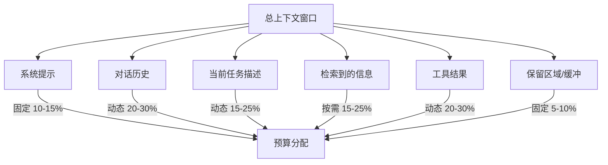
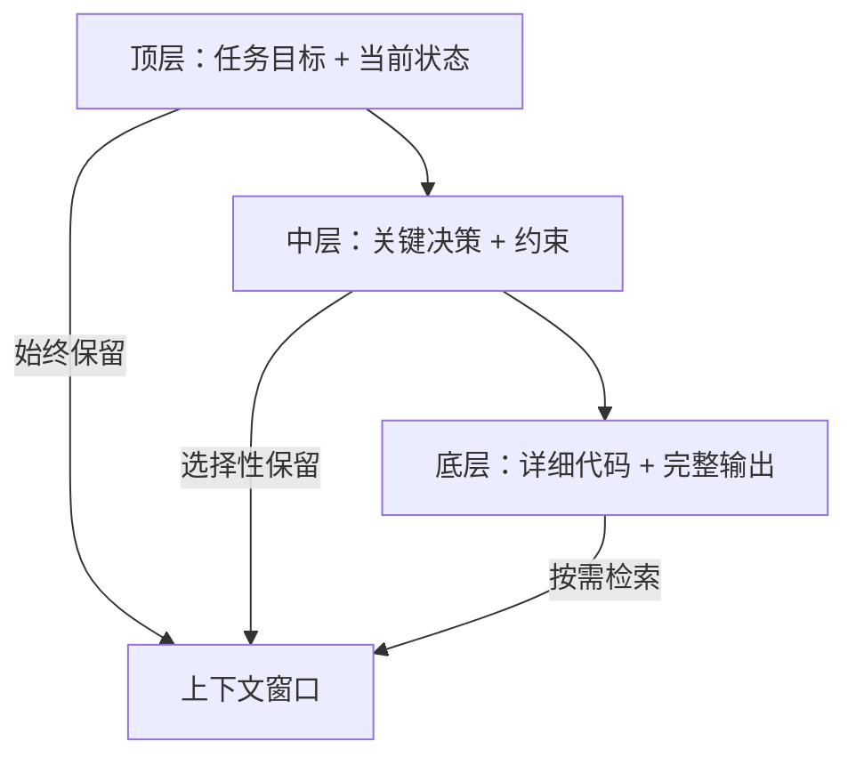
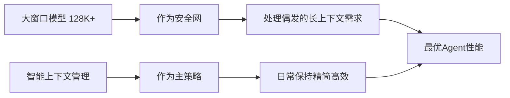

# 上下文管理：有限窗口的无限可能

## 概述

上下文窗口（Context Window）是 LLM-based Agent 面临的最根本约束之一。无论模型的上下文窗口有多大——4K、32K、128K 甚至 1M tokens——在足够复杂的任务面前，它总是有限的。上下文管理模块的职责是在这个有限空间内，最大化 Agent 的"工作记忆"效率。

这个问题类似人类的短期记忆容量：我们无法同时记住所有事情，但通过笔记、索引和选择性注意力，仍然能处理极其复杂的任务。Agent 的上下文管理正是这一认知过程的工程化实现。



## 基本约束：有限的上下文窗口

### Token 预算的现实意义

一个典型的 Agent 对话轮次需要包含：

- **系统提示**（System Prompt）：角色定义、工具说明、规则约束（通常 2000-5000 tokens）
- **对话历史**：之前的用户输入和 Agent 回复
- **当前轮的工具调用结果**：文件内容、搜索结果、命令输出
- **推理空间**：留给模型思考和生成回复的空间

即使拥有 128K 的上下文窗口，一个读取了十几个文件、执行了数十次工具调用的 Agent 也很容易耗尽预算。

### 上下文溢出的后果

当上下文接近或超出窗口限制时：

- **信息丢失**：早期的关键信息被截断
- **注意力稀释**：模型在过多信息中迷失重点 [Liu et al., 2024]
- **性能下降**：延迟增加、成本上升
- **推理质量降低**：研究表明中间位置的信息最容易被忽视（"Lost in the Middle"现象）

## 上下文预算分配

### 预算管理器

```python
class ContextBudgetManager:
    """上下文预算管理器"""
    
    def __init__(self, max_tokens: int = 128000):
        self.max_tokens = max_tokens
        self.allocation = {
            "system_prompt": 0.12,      # 系统提示：12%
            "conversation_history": 0.25, # 对话历史：25%
            "current_task": 0.20,        # 当前任务：20%
            "retrieved_context": 0.20,   # 检索内容：20%
            "tool_results": 0.18,        # 工具结果：18%
            "buffer": 0.05,              # 缓冲区：5%
        }
    
    def get_budget(self, category: str) -> int:
        """获取某个类别的token预算"""
        return int(self.max_tokens * self.allocation[category])
    
    def allocate_dynamically(self, current_usage: dict) -> dict:
        """根据实际使用情况动态调整预算"""
        # 如果某个类别用得少，将多余预算分配给需要更多的类别
        total_unused = 0
        over_budget = {}
        
        for category, used in current_usage.items():
            budget = self.get_budget(category)
            if used < budget:
                total_unused += budget - used
            elif used > budget:
                over_budget[category] = used - budget
        
        # 重新分配未使用的预算
        redistributed = {}
        for category, excess in over_budget.items():
            grant = min(excess, total_unused * 0.8)
            redistributed[category] = self.get_budget(category) + grant
            total_unused -= grant
        
        return redistributed
```

### 优先级排序

并非所有上下文信息同等重要，优先级从高到低：

1. **系统提示和安全规则**：不可压缩，始终保留
2. **当前步骤的直接相关信息**：正在处理的文件、错误信息
3. **最近的用户指令**：最新的意图和约束
4. **最近的行动结果**：刚完成的操作及其输出
5. **早期对话历史**：可压缩为摘要
6. **背景信息**：项目结构、通用知识等

## 管理策略

### 滑动窗口（Sliding Window）

最简单的策略——保留最近的 N 条消息，丢弃更早的：

```python
class SlidingWindowStrategy:
    """滑动窗口策略"""
    
    def __init__(self, max_messages: int = 20):
        self.max_messages = max_messages
    
    def apply(self, messages: list[Message]) -> list[Message]:
        """保留最近的N条消息"""
        if len(messages) <= self.max_messages:
            return messages
        
        # 始终保留系统消息
        system_messages = [m for m in messages if m.role == "system"]
        non_system = [m for m in messages if m.role != "system"]
        
        # 保留最近的消息
        kept = non_system[-(self.max_messages - len(system_messages)):]
        
        return system_messages + kept
```

优点：实现简单，延迟低。缺点：可能丢失早期的重要决策和上下文。

### 摘要压缩（Summarization）

将长对话历史压缩为摘要：

```python
class SummarizationStrategy:
    """摘要压缩策略"""
    
    def __init__(self, llm_client, summary_threshold: int = 10000):
        self.llm = llm_client
        self.summary_threshold = summary_threshold
        self.running_summary = ""
    
    async def compress(self, messages: list[Message]) -> list[Message]:
        """将旧消息压缩为摘要"""
        total_tokens = sum(count_tokens(m.content) for m in messages)
        
        if total_tokens <= self.summary_threshold:
            return messages
        
        # 确定需要压缩的部分（保留最近的消息不压缩）
        keep_recent = 5  # 保留最近5轮不压缩
        to_compress = messages[:-keep_recent]
        to_keep = messages[-keep_recent:]
        
        # 生成摘要
        summary = await self._generate_summary(to_compress)
        
        # 用摘要消息替代旧消息
        summary_message = Message(
            role="system",
            content=f"[对话摘要]\n{summary}"
        )
        
        return [summary_message] + to_keep
    
    async def _generate_summary(self, messages: list[Message]) -> str:
        """使用LLM生成对话摘要"""
        prompt = f"""请将以下对话历史压缩为简洁的摘要，保留：
        1. 用户的核心目标和约束
        2. 已完成的关键步骤和结果
        3. 重要的决策和原因
        4. 当前的进展状态
        
        对话内容：
        {self._format_messages(messages)}
        """
        return await self.llm.generate(prompt)
```

### 选择性检索（Selective Retrieval）

只在需要时检索相关信息，而非将所有内容都放入上下文：

```python
class SelectiveRetrievalStrategy:
    """选择性检索：按需加载相关上下文"""
    
    def __init__(self, vector_store, relevance_threshold: float = 0.7):
        self.vector_store = vector_store
        self.relevance_threshold = relevance_threshold
    
    async def retrieve_relevant(self, current_query: str, 
                                 budget_tokens: int) -> list[str]:
        """检索与当前任务相关的上下文"""
        # 语义搜索相关内容
        results = await self.vector_store.search(
            query=current_query,
            top_k=20
        )
        
        # 过滤低相关性结果
        relevant = [r for r in results if r.score >= self.relevance_threshold]
        
        # 在预算内选择最相关的内容
        selected = []
        used_tokens = 0
        for result in relevant:
            result_tokens = count_tokens(result.content)
            if used_tokens + result_tokens <= budget_tokens:
                selected.append(result.content)
                used_tokens += result_tokens
            else:
                break
        
        return selected
```

### 层次化上下文（Hierarchical Context）

将信息组织为多层结构，按需展开：



```python
class HierarchicalContext:
    """层次化上下文管理"""
    
    def __init__(self):
        self.layers = {
            "critical": [],    # 关键层：始终保留
            "important": [],   # 重要层：优先保留
            "detailed": [],    # 详细层：按需加载
            "background": [],  # 背景层：必要时检索
        }
    
    def add(self, content: str, layer: str, metadata: dict = None):
        """添加内容到指定层"""
        self.layers[layer].append({
            "content": content,
            "metadata": metadata or {},
            "timestamp": time.time()
        })
    
    def build_context(self, available_tokens: int) -> str:
        """根据预算构建最优上下文"""
        context_parts = []
        remaining = available_tokens
        
        # 按层级优先级加载
        for layer_name in ["critical", "important", "detailed", "background"]:
            for item in self.layers[layer_name]:
                item_tokens = count_tokens(item["content"])
                if item_tokens <= remaining:
                    context_parts.append(item["content"])
                    remaining -= item_tokens
                else:
                    # 当前层已超预算，停止加载更低层
                    break
            if remaining < 100:  # 预算基本用尽
                break
        
        return "\n\n".join(context_parts)
```

## RAG 集成

### 检索增强生成（Retrieval-Augmented Generation）

[RAG](../../appendix/glossary.md#rag) 是上下文管理的重要补充，允许 Agent 动态访问大规模知识库而不需要全部载入上下文：

```python
class RAGContextManager:
    """RAG集成的上下文管理器"""
    
    def __init__(self, vector_store, chunk_size: int = 500):
        self.vector_store = vector_store
        self.chunk_size = chunk_size
    
    async def enrich_context(self, query: str, 
                             existing_context: str,
                             budget: int) -> str:
        """通过RAG丰富当前上下文"""
        # 判断是否需要额外信息
        if self._context_sufficient(existing_context, query):
            return existing_context
        
        # 检索相关文档片段
        chunks = await self.vector_store.search(query, top_k=5)
        
        # 去重和排序
        unique_chunks = self._deduplicate(chunks)
        ranked_chunks = self._rank_by_relevance(unique_chunks, query)
        
        # 在预算内组装上下文
        enriched = existing_context
        for chunk in ranked_chunks:
            chunk_tokens = count_tokens(chunk.text)
            if count_tokens(enriched) + chunk_tokens <= budget:
                enriched += f"\n\n[参考信息]\n{chunk.text}"
            else:
                break
        
        return enriched
```

### RAG 工程细节：从检索到生成的关键技术选型

**文档分块（Chunking）策略对比：**

分块是 RAG 管道的第一步，直接决定检索质量。核心权衡是：块太大则包含噪声信息稀释相关性，块太小则丢失上下文导致语义不完整。

| 策略 | 块大小 | 优势 | 劣势 | 适用场景 |
|------|--------|------|------|---------|
| 固定大小分块 | 256-512 tokens | 实现简单，效率高 | 可能在句中切断 | 通用文本，快速原型 |
| 递归分块（LangChain 默认） | 200-1000 tokens | 按段落/句子边界切分 | 块大小不均匀 | 结构化文档 |
| 语义分块 | 动态 | 按主题语义切分 | 计算成本高（需 embedding） | 长篇混合主题文档 |
| 父子文档分块 | 小块检索 + 大块返回 | 检索精确且上下文完整 | 存储翻倍 | 需要精确定位又要上下文 |

```python
# 父子文档分块示例：小块用于检索，大块用于返回
class ParentChildChunker:
    def chunk(self, document: str) -> list[dict]:
        # 大块：按段落切分（~1000 tokens）
        parent_chunks = split_by_paragraphs(document, max_tokens=1000)
        
        all_chunks = []
        for parent in parent_chunks:
            # 小块：在大块内按句子切分（~200 tokens）
            children = split_by_sentences(parent.text, max_tokens=200)
            for child in children:
                all_chunks.append({
                    "text": child,
                    "parent_text": parent.text,  # 检索命中时返回完整父块
                    "embedding": embed(child)     # 只对小块做 embedding
                })
        return all_chunks
```

**Embedding 模型选型指南：**

| 模型 | 维度 | MTEB 得分 | 延迟 | 成本 | 推荐场景 |
|------|------|-----------|------|------|---------|
| OpenAI text-embedding-3-large | 3072 | ~65 | 中 | $0.13/1M tokens | 英文为主，追求质量 |
| OpenAI text-embedding-3-small | 1536 | ~62 | 低 | $0.02/1M tokens | 成本敏感，快速原型 |
| Cohere embed-v3 | 1024 | ~66 | 中 | $0.1/1M tokens | 多语言，支持检索/分类模式切换 |
| BGE-M3（开源） | 1024 | ~64 | 自控 | 自部署成本 | 自主可控，中英文混合 |
| GTE-Qwen2（开源） | 1536 | ~67 | 自控 | 自部署成本 | 中文场景最优开源选择 |

维度选择的工程影响：高维度带来更丰富的语义表达，但存储和检索成本线性增长。OpenAI 的 `text-embedding-3` 支持 `dimensions` 参数降维（如 3072→256），可在质量和成本间灵活权衡。

**Reranking（精排）——提升检索质量的关键一步：**

向量检索（ANN）的召回率虽高，但排序精度有限（余弦相似度是"近似"相关性）。Cross-encoder Reranker 对 query-document 对做精细的注意力交互，能显著提升 top-K 排序质量：

```python
class RAGPipelineWithReranker:
    """检索 → 精排 → 生成 的完整 RAG 管道"""
    
    async def retrieve_and_rank(self, query: str, top_k: int = 5) -> list[str]:
        # 第1步：向量检索 — 粗召回（fast，候选集大）
        candidates = await self.vector_store.search(query, top_k=20)
        
        # 第2步：Cross-encoder 精排（slow，但精确）
        # Reranker 模型：Cohere rerank-v3、BGE-reranker-v2、ms-marco-MiniLM
        scored = self.reranker.rank(query, [c.text for c in candidates])
        
        # 第3步：取 top-K 高分结果
        top_results = sorted(scored, key=lambda x: x.score, reverse=True)[:top_k]
        return [r.text for r in top_results]
```

Reranking 的典型收益：在 top-5 的 NDCG@5 指标上提升 10-25%。代价是增加 50-200ms 延迟（取决于候选集大小和模型）。

**多路召回融合（Hybrid Search）：**

单纯的向量检索对精确关键词匹配（如错误码、函数名）效果差；单纯的关键词检索又无法理解语义同义。生产系统通常采用混合检索：

```python
class HybridRetriever:
    """Dense + Sparse 混合检索"""
    
    async def search(self, query: str, top_k: int = 10) -> list:
        # Dense 检索（语义相似度）
        dense_results = await self.vector_store.search(query, top_k=top_k * 2)
        
        # Sparse 检索（BM25 关键词匹配）
        sparse_results = await self.bm25_index.search(query, top_k=top_k * 2)
        
        # 融合排序（Reciprocal Rank Fusion）
        return self._rrf_merge(dense_results, sparse_results, top_k=top_k)
    
    def _rrf_merge(self, *result_lists, top_k: int, k: int = 60) -> list:
        """RRF 融合：对每个结果在各检索路中的排名取倒数加权"""
        scores = {}
        for results in result_lists:
            for rank, doc in enumerate(results):
                scores[doc.id] = scores.get(doc.id, 0) + 1 / (k + rank + 1)
        sorted_docs = sorted(scores.items(), key=lambda x: x[1], reverse=True)
        return [doc_id for doc_id, _ in sorted_docs[:top_k]]
```

### RAG 与直接上下文的权衡

| 方式 | 优势 | 劣势 |
|------|------|------|
| 全部放入上下文 | 信息完整，无检索延迟 | 占用大量 token，成本高 |
| RAG 按需检索 | token 效率高，可扩展 | 检索可能遗漏，增加延迟 |
| 混合策略 | 平衡效率和完整性 | 实现复杂度高 |

## 多轮对话管理

### 何时保留，何时遗忘

```python
class ConversationManager:
    """多轮对话的上下文管理"""
    
    def __init__(self):
        self.importance_scorer = ImportanceScorer()
    
    def manage_history(self, messages: list[Message], 
                       budget: int) -> list[Message]:
        """管理对话历史，决定保留什么"""
        
        # 为每条消息计算重要性分数
        scored = []
        for msg in messages:
            score = self.importance_scorer.score(msg)
            scored.append((msg, score))
        
        # 始终保留的内容
        always_keep = [
            m for m, s in scored 
            if m.role == "system" or self._is_decision_point(m)
        ]
        
        # 按重要性排序其余消息
        candidates = [
            (m, s) for m, s in scored 
            if m not in always_keep
        ]
        candidates.sort(key=lambda x: x[1], reverse=True)
        
        # 在预算内选择
        kept = list(always_keep)
        used = sum(count_tokens(m.content) for m in kept)
        
        for msg, score in candidates:
            msg_tokens = count_tokens(msg.content)
            if used + msg_tokens <= budget:
                kept.append(msg)
                used += msg_tokens
        
        # 按时间顺序重新排列
        kept.sort(key=lambda m: m.timestamp)
        return kept
    
    def _is_decision_point(self, msg: Message) -> bool:
        """判断消息是否包含关键决策"""
        decision_indicators = [
            "决定", "选择", "确认", "方案是",
            "decided", "chose", "confirmed"
        ]
        return any(ind in msg.content for ind in decision_indicators)
```

## 长上下文模型 vs 智能管理

### 能用更大窗口解决吗？

随着 100K+、1M token 模型的出现，一种观点认为上下文管理将不再必要。但实践表明这种看法过于乐观：

- **成本问题**：128K tokens 的请求成本约为 4K 的 32 倍
- **延迟问题**：上下文越长，首 token 延迟越大
- **注意力衰减**：模型对长上下文中间部分的注意力明显下降 [Liu et al., 2024]
- **噪声问题**：无关信息可能干扰推理质量

### 最佳实践：长上下文 + 智能管理



## Token 计算与成本

### 实现 Token 计数

```python
import tiktoken

class TokenCounter:
    """Token计数器"""
    
    def __init__(self, model: str = "gpt-4"):
        self.encoding = tiktoken.encoding_for_model(model)
    
    def count(self, text: str) -> int:
        """计算文本的token数"""
        return len(self.encoding.encode(text))
    
    def count_messages(self, messages: list[dict]) -> int:
        """计算消息列表的总token数"""
        total = 0
        for msg in messages:
            total += 4  # 消息开销
            total += self.count(msg.get("role", ""))
            total += self.count(msg.get("content", ""))
        total += 2  # 回复开头
        return total
    
    def estimate_cost(self, input_tokens: int, 
                       output_tokens: int,
                       model: str) -> float:
        """估算API调用成本"""
        pricing = {
            "gpt-4-turbo": {"input": 0.01, "output": 0.03},
            "gpt-4o": {"input": 0.005, "output": 0.015},
            "claude-3-opus": {"input": 0.015, "output": 0.075},
            "claude-3.5-sonnet": {"input": 0.003, "output": 0.015},
        }
        rates = pricing.get(model, {"input": 0.01, "output": 0.03})
        return (input_tokens / 1000 * rates["input"] + 
                output_tokens / 1000 * rates["output"])
```

## 本章小结

上下文管理是 Agent 系统中最需要精细工程的模块之一。核心原则包括：预算意识（始终追踪 token 使用）、优先级分层（关键信息不可牺牲）、动态适应（根据任务阶段调整策略）和成本效率（避免不必要的长上下文）。好的上下文管理让 Agent 即使在 4K 窗口中也能高效工作，而差的管理即使有 128K 窗口也会迷失方向。

## 延伸阅读

- [Liu et al., 2024] "Lost in the Middle: How Language Models Use Long Contexts" — 长上下文注意力分布研究
- [Lewis et al., 2020] "Retrieval-Augmented Generation for Knowledge-Intensive NLP Tasks" — RAG 原始论文
- [Xu et al., 2024] "Retrieval meets Long Context Large Language Models" — RAG 与长上下文模型的比较
- [Anthropic, 2024] "Long Context Window Prompting Guide" — 长上下文使用实践指南
- 相关章节：[记忆模块](./memory.md)、[Prompt 工程](./prompt-engineering.md)
