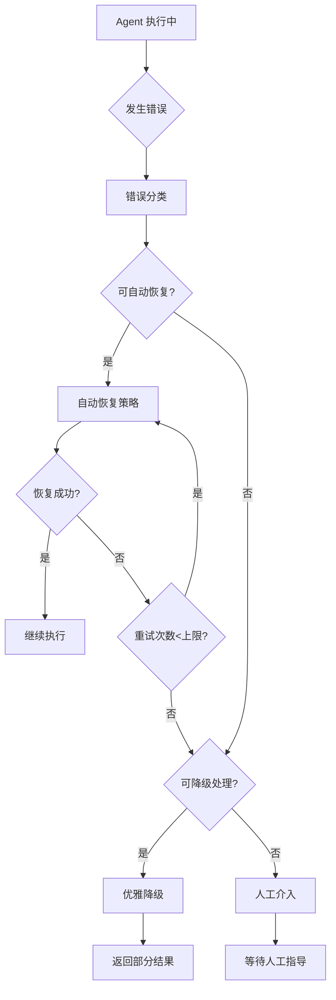
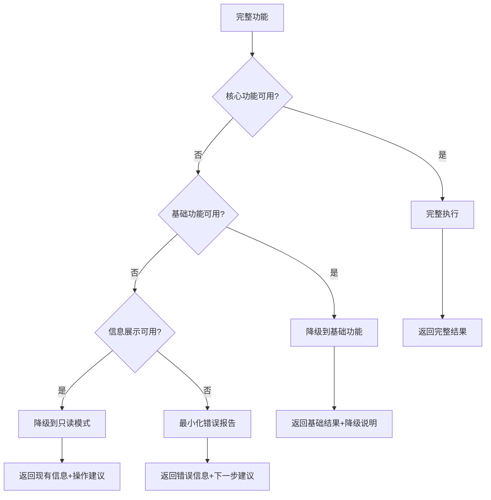

# 错误恢复：构建鲁棒的 Agent 系统

## 概述

在生产环境中，Agent 系统面临的错误率远超传统软件。研究表明，即便是最先进的 Agent 在复杂任务中的成功率也往往只有 30-60% [Liu et al., 2024]。工具可能返回意外结果，推理过程可能偏离正轨，环境可能在操作中途发生变化。因此，错误恢复（Error Recovery）不是锦上添花的功能，而是 Agent 系统的核心生存能力。

一个没有良好错误恢复机制的 Agent，就像一个遇到任何意外就彻底瘫痪的机器人——在实验室或许可以工作，但在真实世界中毫无用处。



## 错误分类（Error Taxonomy）

### 工具执行失败

最常见的错误类型，包括：

- **API 超时**：外部服务响应过慢或无响应
- **认证失败**：Token 过期、权限不足
- **参数错误**：传入了无效的参数格式或值
- **资源不存在**：文件已删除、URL 失效、数据库记录不存在
- **速率限制（Rate Limiting）**：请求过于频繁被拒绝

### 推理错误

LLM 自身的推理偏差：

- **幻觉**：生成了不存在的函数名、文件路径或 API
- **逻辑错误**：推理步骤正确但结论错误
- **理解偏差**：误解了用户意图或任务要求
- **循环推理**：陷入重复的思考-行动循环
- **遗忘**：在长任务中忘记关键约束或早期决策

### 环境变化

执行过程中外部环境的非预期变化：

- **并发修改**：其他进程修改了 Agent 正在操作的文件
- **服务状态变化**：依赖的服务从可用变为不可用
- **权限变更**：执行过程中权限被撤销
- **资源耗尽**：磁盘空间、内存或配额用尽

### 系统级错误

基础设施层面的问题：

- **网络中断**：连接丢失
- **模型服务异常**：LLM API 返回错误或退化
- **容器崩溃**：执行环境异常终止
- **超时**：整体任务执行时间超过限制

## 恢复策略

### 重试与退避（Retry with Backoff）

最基础也最常用的恢复策略：

```python
class RetryStrategy:
    """带指数退避的重试策略"""
    
    def __init__(self, max_retries: int = 3, 
                 base_delay: float = 1.0,
                 max_delay: float = 60.0,
                 exponential_base: float = 2.0):
        self.max_retries = max_retries
        self.base_delay = base_delay
        self.max_delay = max_delay
        self.exponential_base = exponential_base
    
    async def execute_with_retry(self, action, 
                                  retryable_errors: set) -> ActionResult:
        """带智能重试的执行"""
        last_error = None
        
        for attempt in range(self.max_retries + 1):
            try:
                result = await action.execute()
                if result.success:
                    return result
                    
                # 判断错误是否值得重试
                if result.error_type not in retryable_errors:
                    return result  # 不可重试的错误，直接返回
                    
                last_error = result.error
                
            except Exception as e:
                last_error = e
            
            if attempt < self.max_retries:
                delay = min(
                    self.base_delay * (self.exponential_base ** attempt),
                    self.max_delay
                )
                # 添加抖动避免惊群效应
                jittered_delay = delay * (0.5 + random.random())
                await asyncio.sleep(jittered_delay)
        
        return ActionResult(
            success=False, 
            error=f"Max retries exceeded. Last error: {last_error}"
        )
```

### 替代工具策略

当一个工具持续失败时，尝试使用替代方式：

```python
class FallbackStrategy:
    """工具降级策略：当首选工具失败时尝试替代方案"""
    
    def __init__(self):
        self.fallback_chains = {
            "web_search": ["google_search", "bing_search", "duckduckgo"],
            "file_read": ["direct_read", "grep_extract", "cat_command"],
            "code_execute": ["python_sandbox", "node_sandbox", "shell_exec"],
        }
    
    async def execute_with_fallback(self, action_type: str, 
                                     params: dict) -> ActionResult:
        """依次尝试工具链中的替代方案"""
        chain = self.fallback_chains.get(action_type, [action_type])
        errors = []
        
        for tool_name in chain:
            try:
                result = await execute_tool(tool_name, params)
                if result.success:
                    return result
                errors.append(f"{tool_name}: {result.error}")
            except Exception as e:
                errors.append(f"{tool_name}: {str(e)}")
        
        return ActionResult(
            success=False,
            error=f"All fallbacks failed: {errors}"
        )
```

### 重新规划（Replanning）

当当前计划因错误无法继续时，Agent 需要重新制定策略：

```python
class ReplanningStrategy:
    """重新规划策略：调整执行计划以适应新情况"""
    
    async def replan(self, original_plan: Plan, 
                     failure_context: FailureContext) -> Plan:
        """基于失败信息重新规划"""
        replan_prompt = f"""
        原始计划: {original_plan.describe()}
        失败步骤: {failure_context.failed_step}
        错误信息: {failure_context.error}
        已完成步骤: {failure_context.completed_steps}
        当前环境状态: {failure_context.current_state}
        
        请制定新的执行计划，绕过失败点完成原始目标。
        如果原始目标无法完成，请说明可以达成的最接近的结果。
        """
        
        new_plan = await self.llm.generate_plan(replan_prompt)
        return new_plan
```

## 优雅降级（Graceful Degradation）

### 部分结果优于完全失败

当 Agent 无法完成全部任务时，应该返回已完成的部分结果：

```python
class GracefulDegradation:
    """优雅降级：尽可能返回有用的部分结果"""
    
    async def execute_with_degradation(self, tasks: list[Task]) -> DegradedResult:
        completed_results = []
        failed_tasks = []
        
        for task in tasks:
            try:
                result = await task.execute()
                if result.success:
                    completed_results.append(result)
                else:
                    failed_tasks.append((task, result.error))
            except Exception as e:
                failed_tasks.append((task, str(e)))
        
        # 评估部分结果的可用性
        completeness = len(completed_results) / len(tasks)
        
        return DegradedResult(
            partial_results=completed_results,
            failed_tasks=failed_tasks,
            completeness_ratio=completeness,
            usable=completeness >= 0.5,  # 超过50%视为可用
            summary=self._generate_summary(completed_results, failed_tasks)
        )
```

### 降级层级



## 熔断器模式（Circuit Breaker）

### 防止级联失败

当某个工具或服务持续失败时，熔断器可以快速失败，避免浪费资源和时间：

```python
class CircuitBreaker:
    """熔断器：防止对持续失败的服务进行无意义重试"""
    
    CLOSED = "closed"      # 正常状态，允许请求通过
    OPEN = "open"          # 熔断状态，拒绝所有请求
    HALF_OPEN = "half_open"  # 半开状态，允许探测请求
    
    def __init__(self, failure_threshold: int = 5,
                 recovery_timeout: float = 60.0,
                 success_threshold: int = 3):
        self.state = self.CLOSED
        self.failure_count = 0
        self.success_count = 0
        self.failure_threshold = failure_threshold
        self.recovery_timeout = recovery_timeout
        self.success_threshold = success_threshold
        self.last_failure_time = None
    
    async def execute(self, action) -> ActionResult:
        """通过熔断器执行操作"""
        if self.state == self.OPEN:
            if self._should_attempt_recovery():
                self.state = self.HALF_OPEN
            else:
                return ActionResult(
                    success=False,
                    error="Circuit breaker is OPEN - service unavailable"
                )
        
        try:
            result = await action.execute()
            self._on_success()
            return result
        except Exception as e:
            self._on_failure()
            raise
    
    def _on_failure(self):
        self.failure_count += 1
        self.last_failure_time = time.time()
        if self.failure_count >= self.failure_threshold:
            self.state = self.OPEN
    
    def _on_success(self):
        if self.state == self.HALF_OPEN:
            self.success_count += 1
            if self.success_count >= self.success_threshold:
                self.state = self.CLOSED
                self.failure_count = 0
                self.success_count = 0
    
    def _should_attempt_recovery(self) -> bool:
        elapsed = time.time() - self.last_failure_time
        return elapsed >= self.recovery_timeout
```

## 人机协作升级（Human-in-the-Loop Escalation）

### 何时请求人工介入

Agent 应该在以下情况主动寻求帮助：

- **不可逆操作前**：删除数据、发送邮件、部署上线
- **置信度过低**：对多个同样可能的方案无法抉择
- **权限不足**：需要更高权限才能继续
- **信息缺失**：需要用户提供业务背景或偏好
- **重复失败**：多次尝试同一策略均告失败

### 升级策略设计

```python
class EscalationManager:
    """人工介入升级管理"""
    
    def __init__(self):
        self.escalation_rules = [
            # (条件, 严重等级, 消息模板)
            (lambda ctx: ctx.retry_count >= 3, "warning",
             "已尝试{retry_count}次仍然失败，需要您的帮助"),
            (lambda ctx: ctx.involves_deletion, "critical",
             "即将执行删除操作，请确认：{action_desc}"),
            (lambda ctx: ctx.confidence < 0.3, "info",
             "对以下选择不够确定，请指导：{options}"),
        ]
    
    def should_escalate(self, context: ExecutionContext) -> EscalationDecision:
        """判断是否需要升级到人工"""
        for condition, severity, template in self.escalation_rules:
            if condition(context):
                return EscalationDecision(
                    should_escalate=True,
                    severity=severity,
                    message=template.format(**context.__dict__),
                    options=self._generate_options(context)
                )
        return EscalationDecision(should_escalate=False)
    
    def _generate_options(self, context) -> list:
        """为用户生成可选的操作建议"""
        return [
            "继续当前策略",
            "尝试替代方案",
            "跳过此步骤",
            "中止整个任务",
            "提供额外信息",
        ]
```

## 状态检查点（State Checkpointing）

### 保存进度以支持恢复

对于长时间运行的任务，定期保存进度可以避免全部重做：

```python
class CheckpointManager:
    """状态检查点管理器"""
    
    def __init__(self, checkpoint_dir: str = ".agent_checkpoints"):
        self.checkpoint_dir = checkpoint_dir
        os.makedirs(checkpoint_dir, exist_ok=True)
    
    def save_checkpoint(self, task_id: str, state: TaskState):
        """保存检查点"""
        checkpoint = {
            "task_id": task_id,
            "timestamp": time.time(),
            "completed_steps": state.completed_steps,
            "current_step": state.current_step,
            "intermediate_results": state.results,
            "environment_snapshot": state.env_snapshot,
        }
        path = os.path.join(self.checkpoint_dir, f"{task_id}_latest.json")
        with open(path, 'w') as f:
            json.dump(checkpoint, f)
    
    def restore_from_checkpoint(self, task_id: str) -> TaskState:
        """从最近的检查点恢复"""
        path = os.path.join(self.checkpoint_dir, f"{task_id}_latest.json")
        if not os.path.exists(path):
            return None
        
        with open(path, 'r') as f:
            checkpoint = json.load(f)
        
        return TaskState(
            completed_steps=checkpoint["completed_steps"],
            current_step=checkpoint["current_step"],
            results=checkpoint["intermediate_results"],
        )
    
    def should_checkpoint(self, step_index: int, 
                          step_cost: float) -> bool:
        """决定是否需要创建检查点"""
        # 每完成一个耗时步骤后保存
        if step_cost > 10.0:  # 超过10秒的步骤
            return True
        # 每5步保存一次
        if step_index % 5 == 0:
            return True
        return False
```

## 错误处理中间件

### 统一的错误处理管道

```python
class ErrorHandlerMiddleware:
    """错误处理中间件：统一的错误分类和策略选择"""
    
    def __init__(self):
        self.strategies = {
            ErrorType.TIMEOUT: RetryStrategy(max_retries=2),
            ErrorType.RATE_LIMIT: RetryStrategy(base_delay=30),
            ErrorType.AUTH_FAILURE: ReauthStrategy(),
            ErrorType.NOT_FOUND: FallbackStrategy(),
            ErrorType.REASONING_ERROR: ReplanningStrategy(),
            ErrorType.ENVIRONMENT_CHANGE: RefreshAndRetryStrategy(),
        }
        self.circuit_breakers: dict[str, CircuitBreaker] = {}
    
    async def handle(self, error: AgentError, 
                     context: ExecutionContext) -> RecoveryResult:
        """根据错误类型选择恢复策略"""
        error_type = self._classify_error(error)
        
        # 检查熔断器
        service = error.source_service
        if service in self.circuit_breakers:
            if self.circuit_breakers[service].state == CircuitBreaker.OPEN:
                return RecoveryResult(
                    action="skip",
                    reason="Service circuit breaker is open"
                )
        
        # 选择恢复策略
        strategy = self.strategies.get(error_type)
        if strategy:
            return await strategy.recover(error, context)
        
        # 无已知策略，升级到人工
        return RecoveryResult(action="escalate", reason="Unknown error type")
```

## 生产环境中的真实失败模式

### 典型失败场景

根据实际 Agent 系统运行经验，以下是最常见的失败模式：

- **Token 超限循环**：Agent 的上下文不断增长直到超出限制，导致关键信息被截断，进而产生错误，形成恶性循环
- **工具幻觉**：Agent 调用不存在的工具或使用错误的参数格式
- **状态不同步**：Agent 认为文件已修改但实际写入失败
- **无限循环**：Agent 反复执行相同的失败操作而不改变策略
- **部分成功误判**：操作只完成了一部分但 Agent 认为已全部完成

### 防御性编程原则

- **验证每次操作结果**：不要假设操作成功
- **设置全局超时**：防止任务无限制运行
- **限制循环次数**：硬性限制重试和规划次数
- **保持状态一致性**：操作前后验证环境状态

## 本章小结

错误恢复是 Agent 系统从"实验室玩具"进化为"生产工具"的关键能力。核心设计原则包括：错误分类（不同类型不同策略）、层级化恢复（重试→替代→降级→人工）、防止级联（熔断器模式）、进度保护（检查点机制）。优秀的 Agent 不是"从不犯错"的 Agent，而是"犯错后能优雅恢复"的 Agent。

## 延伸阅读

- [Liu et al., 2024] "AgentBench: Evaluating LLMs as Agents" — Agent 在真实任务中的失败率分析
- [Shinn et al., 2023] "Reflexion: Language Agents with Verbal Reinforcement Learning" — 通过反思实现错误恢复
- [Madaan et al., 2023] "Self-Refine: Iterative Refinement with Self-Feedback" — 自我修正机制
- [Nygard, 2018] "Release It!: Design and Deploy Production-Ready Software" — 熔断器等稳定性模式的经典参考
- 相关章节：[反思模块](./reflection.md)、[行动执行](./action-execution.md)
