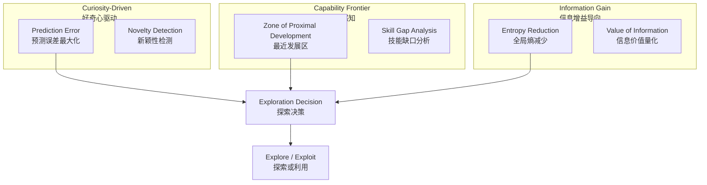
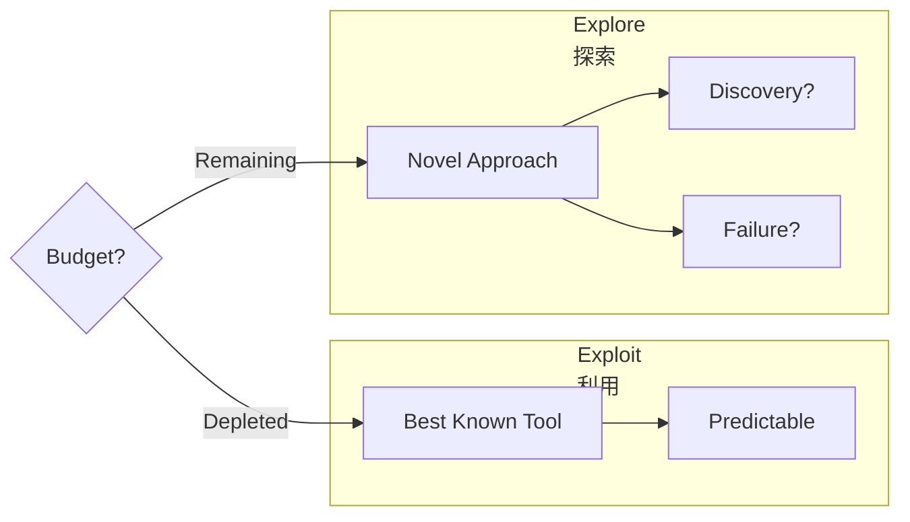

## 概述

传统 Agent 的工作模式是**被动的**——用户给出指令，Agent 在预定义工具集中选择合适的工具去执行。这种模式的上限由人类的预见性决定：设计者没有预想到某个工具组合、没有注册某个 API，Agent 就永远不会去尝试。

但真正具备"智能"的 Agent 应该是**主动探索者**——正如人类工程师不会等老板告诉"去试试 Redis"，而是自己在遇到缓存瓶颈时主动调研。这种从"被动执行"到"主动发现"的范式转变，是 Agent 走向自主性的关键一步。

## 探索动机模型

Agent 为什么要探索？不是漫无目的地随机尝试，而是需要一套**内在动机（Intrinsic Motivation）**系统来指导探索方向。借鉴强化学习中的内在奖励理论，我们定义三类核心动机：



好奇心驱动让 Agent 优先关注那些它"看不懂"的领域；能力前沿感知让 Agent 聚焦于"差一点就够得着"的挑战；信息增益导向则确保每次探索都为全局理解做出最大贡献。三者协同，形成既不保守也不冒进的探索策略。

## 能力自评估 (Capability Self-Assessment)

Agent 在探索之前需要回答一个根本问题：**"我现在能做什么？"** 这不是静态配置，而是从历史交互中动态推断的能力画像。

```python
import numpy as np
from dataclasses import dataclass
from typing import Dict, List, Optional
from collections import defaultdict


@dataclass
class TaskAttempt:
    """Record of a single task execution attempt."""
    task_type: str
    difficulty: float          # 0.0 - 1.0
    success: bool
    confidence_before: float   # Agent's predicted success probability
    tools_used: List[str]
    error_type: Optional[str] = None


class CapabilityAssessor:
    """
    Dynamic capability profile using Bayesian updating.
    Tracks success probability per task type via Beta distribution.
    """

    def __init__(self, prior_alpha: float = 1.0, prior_beta: float = 1.0):
        self._alpha: Dict[str, float] = defaultdict(lambda: prior_alpha)
        self._beta: Dict[str, float] = defaultdict(lambda: prior_beta)
        self._history: List[TaskAttempt] = []
        self._calibration_pairs: List[tuple] = []

    def record_attempt(self, attempt: TaskAttempt) -> None:
        """Update capability model with a new task attempt."""
        if attempt.success:
            self._alpha[attempt.task_type] += 1
        else:
            self._beta[attempt.task_type] += 1
        self._history.append(attempt)
        self._calibration_pairs.append(
            (attempt.confidence_before, float(attempt.success))
        )

    def success_probability(self, task_type: str) -> float:
        """Posterior mean of Beta(alpha, beta)."""
        a, b = self._alpha[task_type], self._beta[task_type]
        return a / (a + b)

    def uncertainty(self, task_type: str) -> float:
        """Posterior variance — higher means less certainty."""
        a, b = self._alpha[task_type], self._beta[task_type]
        return (a * b) / ((a + b) ** 2 * (a + b + 1))

    def capability_frontier(self, threshold: float = 0.4) -> List[str]:
        """
        Identify tasks in the 'Zone of Proximal Development':
        success rate between threshold and (1-threshold).
        """
        frontier = []
        for task_type in self._alpha:
            p = self.success_probability(task_type)
            if threshold <= p <= (1 - threshold):
                frontier.append(task_type)
        return sorted(frontier, key=lambda t: self.uncertainty(t), reverse=True)

    def discover_capabilities(self) -> Dict[str, dict]:
        """
        Automated Capability Discovery (ACD):
        Infer latent capabilities from tool co-occurrence patterns.
        """
        tool_combos: Dict[tuple, List[bool]] = defaultdict(list)
        for attempt in self._history:
            if len(attempt.tools_used) >= 2:
                combo = tuple(sorted(attempt.tools_used))
                tool_combos[combo].append(attempt.success)

        discovered = {}
        for combo, outcomes in tool_combos.items():
            if len(outcomes) >= 3 and np.mean(outcomes) > 0.6:
                name = f"composite_{'_'.join(combo)}"
                discovered[name] = {
                    "tools": list(combo),
                    "evidence_count": len(outcomes),
                    "success_rate": float(np.mean(outcomes)),
                }
        return discovered
```

核心思路：用 Beta 分布追踪成功率，`capability_frontier` 定位"最近发展区"（成功率 40%-60%），`discover_capabilities` 通过工具共现模式自动发现未被显式注册但已验证有效的复合能力。

## 工具与环境发现 (Tool & Environment Discovery)

Agent 不应只使用预先注册的工具集。新的 MCP Server 上线、新 API 可用——Agent 需要能主动发现并验证这些新能力。

```python
import json
from dataclasses import dataclass, field
from typing import Any, Callable, Dict, List
from enum import Enum


class ToolStatus(Enum):
    DISCOVERED = "discovered"
    TESTING = "testing"
    VERIFIED = "verified"
    UNRELIABLE = "unreliable"


@dataclass
class DiscoveredTool:
    name: str
    source: str              # e.g., "mcp://server-name", "openapi://url"
    schema: Dict[str, Any]
    status: ToolStatus = ToolStatus.DISCOVERED
    test_results: List[Dict] = field(default_factory=list)
    safety_score: float = 0.0
    usefulness_score: float = 0.0


class ToolDiscoveryAgent:
    """
    Staged pipeline: Discovery -> Testing -> Verification -> Integration.
    """

    def __init__(self, sandbox_executor: Callable, llm_client: Any):
        self._known_tools: Dict[str, DiscoveredTool] = {}
        self._sandbox = sandbox_executor
        self._llm = llm_client

    async def scan_for_tools(self, sources: List[Dict]) -> List[DiscoveredTool]:
        """Scan registered sources for new tools."""
        newly_discovered = []
        for source in sources:
            tools = await self._scan_source(source)
            for tool in tools:
                if tool.name not in self._known_tools:
                    self._known_tools[tool.name] = tool
                    newly_discovered.append(tool)
        return newly_discovered

    async def validate_tool(self, tool: DiscoveredTool) -> bool:
        """Three-stage validation: Schema -> Sandbox -> Usefulness."""
        tool.status = ToolStatus.TESTING

        # Stage 1: Schema sanity check via LLM
        assessment = await self._llm.assess(
            prompt=f"Rate this tool schema for safety and completeness:\n"
                   f"{json.dumps(tool.schema, indent=2)}",
            response_format={"safety": "float", "completeness": "float"}
        )
        if assessment["safety"] < 0.7:
            tool.status = ToolStatus.UNRELIABLE
            return False

        # Stage 2: Sandboxed execution with synthetic inputs
        test_inputs = await self._llm.generate(
            prompt=f"Generate 3 safe test inputs for: {tool.name}\n"
                   f"Schema: {json.dumps(tool.schema)}",
            response_format="json_list"
        )
        for test_input in test_inputs:
            result = await self._sandbox(
                tool_name=tool.name, arguments=test_input,
                timeout_seconds=30,
                resource_limits={"memory_mb": 256, "network": "restricted"}
            )
            tool.test_results.append(result)

        # Stage 3: Compute scores
        success_count = sum(1 for r in tool.test_results if not r.get("error"))
        tool.safety_score = assessment["safety"]
        tool.usefulness_score = success_count / max(len(tool.test_results), 1)

        tool.status = (ToolStatus.VERIFIED
                       if tool.usefulness_score >= 0.6 else ToolStatus.UNRELIABLE)
        return tool.status == ToolStatus.VERIFIED
```

关键设计：三阶段验证（Schema 检查 → 沙箱试运行 → 有效性评估），通过全部验证才进入可用工具集，避免"发现即信任"的安全隐患。

## 探索-利用权衡 (Exploration-Exploitation Trade-off)

经典的多臂老虎机问题在 Agent 场景下：使用已知最佳策略（Exploit），还是尝试新方法以获得更优解（Explore）？



```python
import math
import random
from typing import Dict, List


class ExplorationBudgetManager:
    """UCB1 + Thompson Sampling with decaying exploration budget."""

    def __init__(self, decay_rate: float = 0.995, min_ratio: float = 0.05):
        self._decay_rate = decay_rate
        self._min_ratio = min_ratio
        self._step = 0
        self._counts: Dict[str, int] = {}
        self._rewards: Dict[str, List[float]] = {}
        self._ts_alpha: Dict[str, float] = {}
        self._ts_beta: Dict[str, float] = {}

    def select_action_ucb(self, actions: List[str]) -> str:
        """UCB1: mean reward + confidence bonus sqrt(2*ln(t)/n)."""
        self._step += 1
        best_action, best_score = None, -float("inf")
        for action in actions:
            n = self._counts.get(action, 0)
            if n == 0:
                return action
            mean = sum(self._rewards[action]) / n
            score = mean + math.sqrt(2 * math.log(self._step) / n)
            if score > best_score:
                best_score, best_action = score, action
        return best_action

    def select_action_thompson(self, actions: List[str]) -> str:
        """Thompson Sampling: sample Beta posterior, pick highest."""
        samples = {
            a: random.betavariate(
                self._ts_alpha.get(a, 1.0), self._ts_beta.get(a, 1.0)
            ) for a in actions
        }
        return max(samples, key=samples.get)

    def update(self, action: str, reward: float) -> None:
        self._counts[action] = self._counts.get(action, 0) + 1
        self._rewards.setdefault(action, []).append(reward)
        if reward > 0.5:
            self._ts_alpha[action] = self._ts_alpha.get(action, 1.0) + reward
        else:
            self._ts_beta[action] = self._ts_beta.get(action, 1.0) + (1 - reward)

    def should_explore(self) -> bool:
        """Decaying exploration probability with minimum floor."""
        ratio = max(self._decay_rate ** self._step, self._min_ratio)
        return random.random() < ratio
```

UCB1 通过置信上界公式显式平衡均值与不确定性；Thompson Sampling 从后验采样隐式实现平衡，通常表现更优。

## 安全探索 (Safe Exploration)

探索的最大风险是不可逆操作——删除文件、发送消息、修改数据库。安全探索机制必须在 Agent 触碰真实环境前建立保护屏障。

```python
from dataclasses import dataclass
from typing import Any, Callable, Dict, List, Set
from enum import Enum


class RiskLevel(Enum):
    SAFE = "safe"                # Read-only, no side effects
    REVERSIBLE = "reversible"    # Can be undone
    IRREVERSIBLE = "irreversible"


@dataclass
class ExplorationAction:
    tool_name: str
    arguments: Dict[str, Any]
    rationale: str


class SafeExplorer:
    """Safety layers: boundary check -> risk classification -> execution strategy."""

    def __init__(self, sandbox_fn: Callable, rollback_fn: Callable):
        self._sandbox = sandbox_fn
        self._rollback = rollback_fn
        self._hard_boundaries: Set[str] = set()
        self._reversible_tools: Dict[str, Callable] = {}

    def set_hard_boundaries(self, patterns: List[str]) -> None:
        """Actions that MUST NEVER be taken: 'rm -rf', 'DROP TABLE', etc."""
        self._hard_boundaries.update(patterns)

    def assess_risk(self, action: ExplorationAction) -> RiskLevel:
        """Classify: boundary -> read-only heuristic -> reversibility lookup."""
        sig = f"{action.tool_name}({action.arguments})"
        if any(p in sig for p in self._hard_boundaries):
            return RiskLevel.IRREVERSIBLE
        read_only = {"get_", "list_", "search_", "read_", "fetch_"}
        if any(action.tool_name.startswith(p) for p in read_only):
            return RiskLevel.SAFE
        if action.tool_name in self._reversible_tools:
            return RiskLevel.REVERSIBLE
        return RiskLevel.IRREVERSIBLE

    async def explore_safely(self, action: ExplorationAction) -> Dict[str, Any]:
        """Execute with safety level matching assessed risk."""
        risk = self.assess_risk(action)
        if risk == RiskLevel.SAFE:
            return await self._execute(action)
        elif risk == RiskLevel.REVERSIBLE:
            checkpoint = await self._create_checkpoint(action)
            result = await self._execute(action)
            if not result.get("success"):
                await self._rollback(checkpoint)
                result["rolled_back"] = True
            return result
        else:  # IRREVERSIBLE: sandbox only
            result = await self._sandbox(
                tool_name=action.tool_name, arguments=action.arguments,
                isolation_level="full")
            result["sandboxed"] = True
            return result
```

分层策略：安全操作直接执行；可逆操作带快照（失败回滚）；不可逆操作**永远只在沙箱中运行**。

## 实际应用模式

| 应用场景 | 主要动机 | 探索预算 | 安全约束 | 典型策略 |
|---------|---------|---------|---------|---------|
| IDE 编程助手 | Capability Frontier | 低 (5-10%) | 高（文件系统保护） | 保守 UCB，仅空闲时探索 |
| 数据分析 Agent | Information Gain | 中 (15-25%) | 中（只读数据源） | Thompson Sampling |
| 游戏 NPC / Voyager | Curiosity-Driven | 高 (40-60%) | 低（虚拟环境） | ICM + Progressive Difficulty |
| 自动化运维 | Information Gain | 极低 (3-5%) | 极高（生产环境） | 仅沙箱探索 |
| 研究型 Agent | Curiosity + Frontier | 高 (50%+) | 中（资源限制） | UCB + 新颖性奖励 |
| 客服对话 Agent | Capability Frontier | 极低 (1-3%) | 高（合规要求） | 标注验证后扩展 |

## 参考

**好奇心与内在动机**：ICM（Pathak et al. 2017）用预测误差作为内在奖励，是好奇心驱动探索的奠基之作。CDALN 将好奇心引入长程任务的注意力分配。

**Agent 能力发现**：Voyager（Wang et al. 2023）展示了 Agent 通过自动课程不断发现和积累新技能，是该领域最具影响力的工作。ACD 系统性探讨了如何让 Agent 自动发现自身隐含能力边界。

**探索前沿**：AgentFrontier 将"能力前沿"形式化；SEAgent 专注于约束环境中的安全探索；Auto Skills 让 Agent 将探索结果封装为可复用技能，形成"探索 → 发现 → 固化"的正循环。
