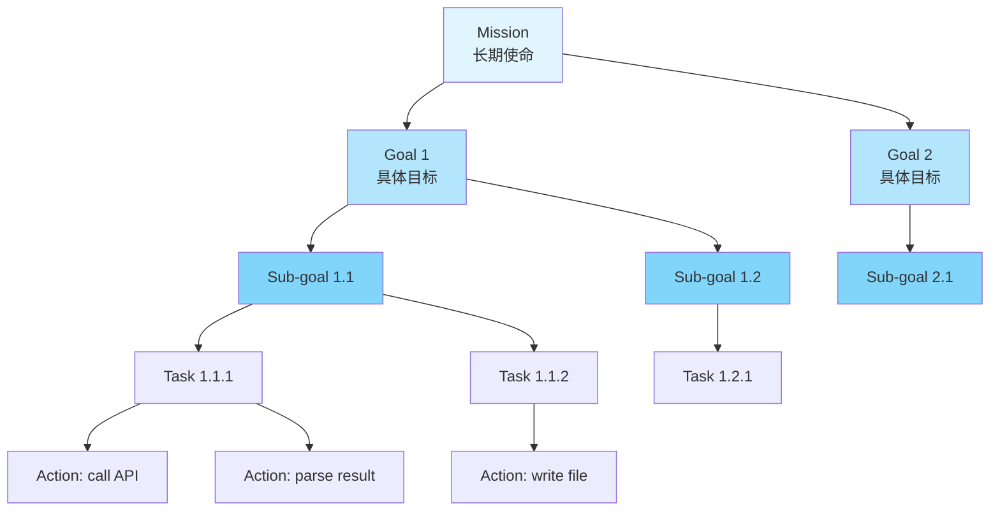
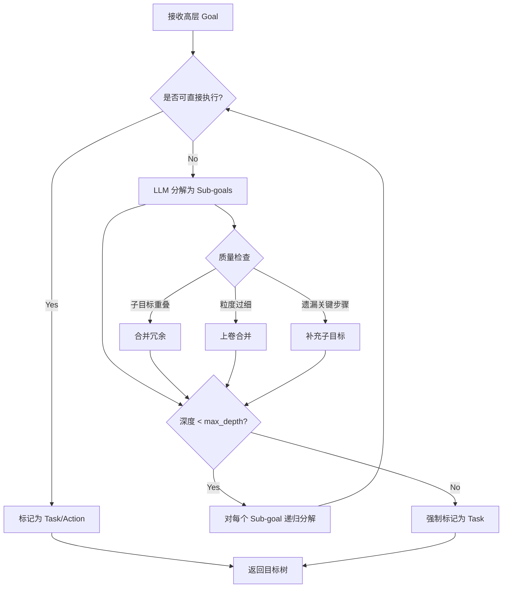
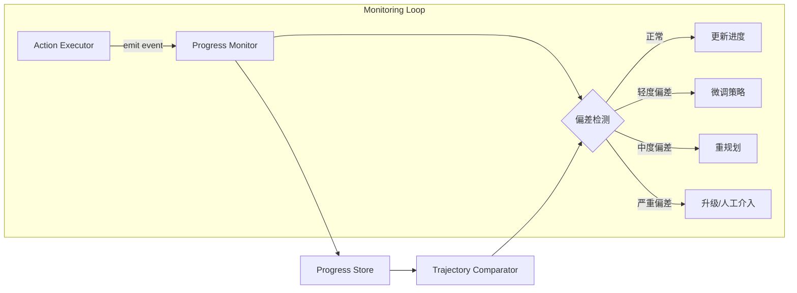
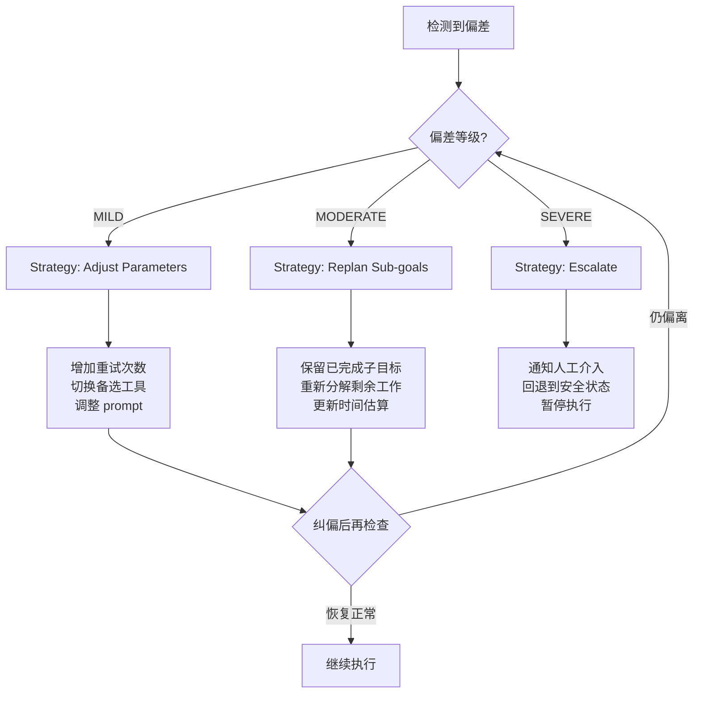
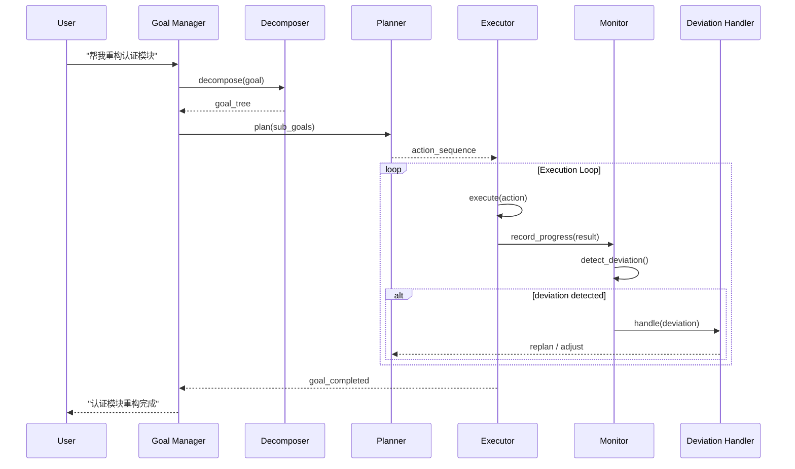

# 目标设定与运行时监控 (Goal Setting and Monitoring)

## 概述

传统的任务执行系统接收一条指令、执行、返回结果——这是"无状态"的。而真正的 Agent 需要对目标有**持续的意识**：知道自己为什么要做当前这件事、做到了什么程度、是否在正确的轨道上。这就是显式目标管理（Explicit Goal Management）的核心价值。

没有目标管理的 Agent 类似于一个没有导航的司机——可以执行"左转""右转"等指令，但无法判断自己是否在靠近目的地。目标管理模块赋予 Agent 三种关键能力：

1. **方向感**：将模糊的用户意图结构化为可衡量的目标层次
2. **自省力**：实时对比预期进度与实际进度，检测偏差
3. **纠偏能力**：当偏离轨道时，自动选择恰当的修正策略

本章从目标建模、分解引擎、进度监控到自动纠偏，完整呈现一个生产级目标管理系统的工程实现。

## 目标层次模型

Agent 的目标不是扁平的 TODO 列表，而是一棵有层次的树。我们采用五层架构来建模：



各层的职责和粒度：

| 层级 | 时间跨度 | 可变性 | 示例 |
|------|---------|--------|------|
| Mission | 长期/永久 | 极低 | "成为用户的可靠研发助手" |
| Goal | 会话/天级 | 低 | "完成用户认证模块重构" |
| Sub-goal | 小时级 | 中 | "设计新的 token 刷新机制" |
| Task | 分钟级 | 高 | "编写 refresh_token 函数" |
| Action | 秒级 | 极高 | "调用 LLM 生成代码" |

### SMART 原则在 Agent 中的应用

每个 Goal 和 Sub-goal 都应满足 SMART 标准，以下是数据结构定义：

```python
from dataclasses import dataclass, field
from enum import Enum
from typing import Optional
import time
import uuid


class GoalStatus(Enum):
    PENDING = "pending"
    ACTIVE = "active"
    COMPLETED = "completed"
    FAILED = "failed"
    BLOCKED = "blocked"
    CANCELLED = "cancelled"


class GoalLevel(Enum):
    MISSION = "mission"
    GOAL = "goal"
    SUBGOAL = "subgoal"
    TASK = "task"
    ACTION = "action"


@dataclass
class SuccessCriteria:
    """SMART success criteria for a goal."""
    metric: str              # What to measure, e.g. "test_pass_rate"
    target_value: float      # Target threshold, e.g. 0.95
    comparator: str          # ">=", "<=", "==", etc.
    time_limit: Optional[float] = None  # Max seconds allowed
    
    def evaluate(self, actual_value: float, elapsed: float) -> bool:
        """Check if the goal criteria is met."""
        if self.time_limit and elapsed > self.time_limit:
            return False
        ops = {">=": lambda a, b: a >= b,
               "<=": lambda a, b: a <= b,
               "==": lambda a, b: abs(a - b) < 1e-6}
        return ops.get(self.comparator, lambda a, b: False)(actual_value, self.target_value)


@dataclass
class Goal:
    """A node in the goal hierarchy tree."""
    id: str = field(default_factory=lambda: str(uuid.uuid4())[:8])
    name: str = ""
    description: str = ""
    level: GoalLevel = GoalLevel.GOAL
    status: GoalStatus = GoalStatus.PENDING
    parent_id: Optional[str] = None
    children_ids: list[str] = field(default_factory=list)
    success_criteria: Optional[SuccessCriteria] = None
    priority: float = 0.5
    progress: float = 0.0          # 0.0 ~ 1.0
    created_at: float = field(default_factory=time.time)
    deadline: Optional[float] = None
    metadata: dict = field(default_factory=dict)
    
    @property
    def is_terminal(self) -> bool:
        return len(self.children_ids) == 0
    
    @property
    def is_overdue(self) -> bool:
        if self.deadline is None:
            return False
        return time.time() > self.deadline
```

## 目标分解引擎

目标分解是将抽象目标递归拆解为可执行子目标的过程。一个优秀的分解引擎需要解决三个核心问题：分解到什么粒度？如何避免过度分解？新信息出现时如何动态调整？

### 分解流程



### 代码实现

```python
from typing import Protocol


class LLMClient(Protocol):
    """Protocol for LLM interaction."""
    def generate(self, prompt: str, format: str = "text") -> any: ...


class GoalDecomposer:
    """
    Recursive goal decomposition engine.
    
    Controls decomposition depth, validates sub-goal quality,
    and supports dynamic re-decomposition when new information arrives.
    """
    
    def __init__(self, llm: LLMClient, max_depth: int = 4,
                 max_children: int = 7, min_children: int = 2):
        self.llm = llm
        self.max_depth = max_depth
        self.max_children = max_children
        self.min_children = min_children
        self.goal_registry: dict[str, Goal] = {}
    
    def decompose(self, goal: Goal, depth: int = 0) -> Goal:
        """
        Recursively decompose a goal into sub-goals.
        Returns the goal with populated children.
        """
        self.goal_registry[goal.id] = goal
        
        # Depth guard: prevent over-decomposition
        if depth >= self.max_depth:
            goal.level = GoalLevel.TASK
            return goal
        
        # Check if goal is already actionable
        if self._is_actionable(goal):
            goal.level = GoalLevel.TASK if depth < self.max_depth - 1 else GoalLevel.ACTION
            return goal
        
        # LLM-driven decomposition
        sub_goals = self._generate_sub_goals(goal, depth)
        
        # Quality validation
        sub_goals = self._validate_and_fix(goal, sub_goals)
        
        # Recursive descent
        for sg in sub_goals:
            sg.parent_id = goal.id
            goal.children_ids.append(sg.id)
            self.decompose(sg, depth + 1)
        
        return goal
    
    def _is_actionable(self, goal: Goal) -> bool:
        """Determine if a goal can be directly executed without decomposition."""
        prompt = f"""Evaluate whether this goal can be accomplished in a single 
        tool call or LLM generation without further decomposition.
        
        Goal: {goal.name}
        Description: {goal.description}
        
        Respond with JSON: {{"actionable": true/false, "reason": "..."}}"""
        
        result = self.llm.generate(prompt, format="json")
        return result.get("actionable", False)
    
    def _generate_sub_goals(self, parent: Goal, depth: int) -> list[Goal]:
        """Use LLM to decompose a goal into sub-goals."""
        level_map = {0: GoalLevel.GOAL, 1: GoalLevel.SUBGOAL,
                     2: GoalLevel.TASK, 3: GoalLevel.ACTION}
        child_level = level_map.get(depth + 1, GoalLevel.ACTION)
        
        prompt = f"""Decompose this goal into {self.min_children}-{self.max_children} 
        ordered sub-goals.
        
        Parent Goal: {parent.name}
        Description: {parent.description}
        Context: Current depth={depth}, max_depth={self.max_depth}
        
        Requirements:
        - Each sub-goal must be independently verifiable
        - Sub-goals should be ordered by dependency (earlier ones first)
        - No overlap between sub-goals
        - Each sub-goal needs a measurable success criterion
        
        Output JSON list: [
            {{"name": "...", "description": "...", 
              "metric": "...", "target_value": ..., "comparator": ">="}}
        ]"""
        
        raw_goals = self.llm.generate(prompt, format="json")
        
        sub_goals = []
        for item in raw_goals:
            criteria = SuccessCriteria(
                metric=item.get("metric", "completion"),
                target_value=item.get("target_value", 1.0),
                comparator=item.get("comparator", ">=")
            )
            sg = Goal(
                name=item["name"],
                description=item.get("description", ""),
                level=child_level,
                success_criteria=criteria,
                priority=parent.priority
            )
            sub_goals.append(sg)
            self.goal_registry[sg.id] = sg
        
        return sub_goals
    
    def _validate_and_fix(self, parent: Goal, sub_goals: list[Goal]) -> list[Goal]:
        """Validate sub-goal quality: check for overlap, gaps, and granularity."""
        prompt = f"""Review these sub-goals for quality issues:
        
        Parent: {parent.name}
        Sub-goals: {[sg.name for sg in sub_goals]}
        
        Check for:
        1. Redundancy/overlap between sub-goals
        2. Missing critical steps
        3. Incorrect ordering
        
        Output JSON: {{"issues": [...], "fixed_goals": [...]}}"""
        
        result = self.llm.generate(prompt, format="json")
        
        if not result.get("issues"):
            return sub_goals
        
        # If issues found, use the fixed version
        fixed = result.get("fixed_goals", [])
        if fixed:
            return [Goal(name=g["name"], description=g.get("description", ""),
                        level=sub_goals[0].level if sub_goals else GoalLevel.TASK)
                    for g in fixed]
        return sub_goals
    
    def dynamic_redecompose(self, goal_id: str, new_context: str) -> Goal:
        """
        Re-decompose a goal when new information invalidates existing sub-goals.
        Preserves completed children and re-plans remaining work.
        """
        goal = self.goal_registry[goal_id]
        
        # Separate completed vs pending children
        completed = [self.goal_registry[cid] for cid in goal.children_ids
                     if self.goal_registry[cid].status == GoalStatus.COMPLETED]
        
        # Clear pending children
        goal.children_ids = [c.id for c in completed]
        
        # Re-decompose with new context injected
        goal.metadata["redecompose_context"] = new_context
        goal.metadata["completed_steps"] = [c.name for c in completed]
        
        return self.decompose(goal, depth=self._get_depth(goal))
    
    def _get_depth(self, goal: Goal) -> int:
        """Calculate current depth of a goal in the tree."""
        depth = 0
        current = goal
        while current.parent_id:
            depth += 1
            current = self.goal_registry.get(current.parent_id, goal)
            if current == goal:
                break
        return depth
```

## 进度追踪与偏差检测

进度追踪不是简单的"完成了几个子任务"的计数，而是对预期轨迹（Expected Trajectory）和实际轨迹（Actual Trajectory）的持续对比。

### 进度监控架构



### 代码实现

```python
from dataclasses import dataclass
from collections import deque
import statistics


@dataclass
class ProgressSnapshot:
    """A single point in the progress trajectory."""
    timestamp: float
    goal_id: str
    progress: float          # 0.0 ~ 1.0
    expected_progress: float # Where we should be by now
    tokens_consumed: int = 0
    actions_taken: int = 0
    errors_encountered: int = 0


class DeviationLevel(Enum):
    NONE = "none"
    MILD = "mild"           # < 15% behind expected
    MODERATE = "moderate"   # 15-40% behind expected
    SEVERE = "severe"       # > 40% behind or regression


class ProgressMonitor:
    """
    Tracks goal progress against expected trajectory,
    detects deviations, and triggers appropriate responses.
    """
    
    def __init__(self, goal_registry: dict[str, Goal],
                 mild_threshold: float = 0.15,
                 moderate_threshold: float = 0.40,
                 window_size: int = 10):
        self.goal_registry = goal_registry
        self.mild_threshold = mild_threshold
        self.moderate_threshold = moderate_threshold
        self.window_size = window_size
        self.trajectories: dict[str, deque[ProgressSnapshot]] = {}
        self.deviation_callbacks: dict[DeviationLevel, list] = {
            DeviationLevel.MILD: [],
            DeviationLevel.MODERATE: [],
            DeviationLevel.SEVERE: [],
        }
    
    def register_callback(self, level: DeviationLevel, callback):
        """Register a handler for a specific deviation level."""
        self.deviation_callbacks[level].append(callback)
    
    def record_progress(self, goal_id: str, actual_progress: float,
                        tokens: int = 0, actions: int = 0, errors: int = 0):
        """Record a progress observation and check for deviations."""
        goal = self.goal_registry[goal_id]
        expected = self._compute_expected_progress(goal)
        
        snapshot = ProgressSnapshot(
            timestamp=time.time(),
            goal_id=goal_id,
            progress=actual_progress,
            expected_progress=expected,
            tokens_consumed=tokens,
            actions_taken=actions,
            errors_encountered=errors
        )
        
        if goal_id not in self.trajectories:
            self.trajectories[goal_id] = deque(maxlen=100)
        self.trajectories[goal_id].append(snapshot)
        
        # Update goal progress
        goal.progress = actual_progress
        
        # Detect deviation
        deviation = self._detect_deviation(goal_id)
        if deviation != DeviationLevel.NONE:
            self._trigger_callbacks(deviation, goal_id, snapshot)
        
        return deviation
    
    def _compute_expected_progress(self, goal: Goal) -> float:
        """
        Compute expected progress based on elapsed time vs deadline.
        If no deadline, uses a linear estimate from historical velocity.
        """
        if goal.deadline:
            total_duration = goal.deadline - goal.created_at
            elapsed = time.time() - goal.created_at
            if total_duration <= 0:
                return 1.0
            return min(1.0, elapsed / total_duration)
        
        # Fallback: estimate from velocity of recent snapshots
        trajectory = self.trajectories.get(goal.id)
        if not trajectory or len(trajectory) < 2:
            return 0.0
        
        # Linear extrapolation from recent velocity
        recent = list(trajectory)[-self.window_size:]
        if len(recent) < 2:
            return recent[-1].progress
        
        velocities = [(recent[i].progress - recent[i-1].progress) /
                      max(0.001, recent[i].timestamp - recent[i-1].timestamp)
                      for i in range(1, len(recent))]
        avg_velocity = statistics.mean(velocities) if velocities else 0
        
        dt = time.time() - recent[-1].timestamp
        return min(1.0, recent[-1].progress + avg_velocity * dt)
    
    def _detect_deviation(self, goal_id: str) -> DeviationLevel:
        """Compare actual vs expected trajectory over a sliding window."""
        trajectory = self.trajectories.get(goal_id)
        if not trajectory or len(trajectory) < 2:
            return DeviationLevel.NONE
        
        recent = list(trajectory)[-self.window_size:]
        
        # Calculate average gap over the window
        gaps = [s.expected_progress - s.progress for s in recent]
        avg_gap = statistics.mean(gaps)
        
        # Detect regression (progress going backward)
        if len(recent) >= 3:
            last_three = [s.progress for s in recent[-3:]]
            if last_three[-1] < last_three[0] - 0.05:
                return DeviationLevel.SEVERE
        
        # Threshold-based classification
        if avg_gap > self.moderate_threshold:
            return DeviationLevel.SEVERE
        elif avg_gap > self.mild_threshold:
            return DeviationLevel.MODERATE
        elif avg_gap > 0.05:
            return DeviationLevel.MILD
        
        return DeviationLevel.NONE
    
    def _trigger_callbacks(self, level: DeviationLevel,
                           goal_id: str, snapshot: ProgressSnapshot):
        """Invoke registered callbacks for the detected deviation level."""
        for callback in self.deviation_callbacks[level]:
            callback(goal_id=goal_id, level=level, snapshot=snapshot)
    
    def get_health_report(self, goal_id: str) -> dict:
        """Generate a health summary for a goal's progress."""
        trajectory = self.trajectories.get(goal_id, deque())
        if not trajectory:
            return {"status": "no_data"}
        
        recent = list(trajectory)[-self.window_size:]
        goal = self.goal_registry[goal_id]
        
        return {
            "goal_id": goal_id,
            "goal_name": goal.name,
            "current_progress": goal.progress,
            "expected_progress": recent[-1].expected_progress,
            "deviation": self._detect_deviation(goal_id).value,
            "velocity": self._compute_velocity(recent),
            "total_tokens": sum(s.tokens_consumed for s in trajectory),
            "total_errors": sum(s.errors_encountered for s in trajectory),
            "eta_seconds": self._estimate_completion_time(recent, goal),
        }
    
    def _compute_velocity(self, snapshots: list[ProgressSnapshot]) -> float:
        """Progress units per second over recent window."""
        if len(snapshots) < 2:
            return 0.0
        dt = snapshots[-1].timestamp - snapshots[0].timestamp
        dp = snapshots[-1].progress - snapshots[0].progress
        return dp / max(dt, 0.001)
    
    def _estimate_completion_time(self, recent: list[ProgressSnapshot],
                                  goal: Goal) -> Optional[float]:
        """Estimate seconds until goal completion at current velocity."""
        velocity = self._compute_velocity(recent)
        if velocity <= 0:
            return None  # Stalled or regressing
        remaining = 1.0 - goal.progress
        return remaining / velocity
```

## 自动纠偏策略

偏差检测只是第一步，真正有价值的是系统能自动选择并执行纠偏策略。我们采用分级响应机制：



### 代码实现

```python
from abc import ABC, abstractmethod


class CorrectionStrategy(ABC):
    """Base class for deviation correction strategies."""
    
    @abstractmethod
    def apply(self, goal_id: str, context: dict) -> dict:
        """Apply the correction and return the action taken."""
        ...


class AdjustParametersStrategy(CorrectionStrategy):
    """Mild deviation: tweak execution parameters without replanning."""
    
    def __init__(self, llm: LLMClient):
        self.llm = llm
    
    def apply(self, goal_id: str, context: dict) -> dict:
        current_params = context.get("execution_params", {})
        prompt = f"""The current task is falling slightly behind schedule.
        
        Goal: {context['goal_name']}
        Current progress: {context['progress']:.1%}
        Expected progress: {context['expected_progress']:.1%}
        Gap: {context['expected_progress'] - context['progress']:.1%}
        
        Current parameters: {current_params}
        
        Suggest parameter adjustments to get back on track.
        Options: increase max_retries, switch to faster tool, simplify prompt.
        Output JSON: {{"adjustments": {{...}}, "rationale": "..."}}"""
        
        result = self.llm.generate(prompt, format="json")
        return {"strategy": "adjust_params", "actions": result}


class ReplanStrategy(CorrectionStrategy):
    """Moderate deviation: keep completed work, replan remaining sub-goals."""
    
    def __init__(self, decomposer: GoalDecomposer):
        self.decomposer = decomposer
    
    def apply(self, goal_id: str, context: dict) -> dict:
        new_context = (f"Original plan fell behind. "
                       f"Progress: {context['progress']:.1%}. "
                       f"Errors encountered: {context.get('errors', 0)}. "
                       f"Need to replan remaining work.")
        
        updated_goal = self.decomposer.dynamic_redecompose(goal_id, new_context)
        
        return {
            "strategy": "replan",
            "new_children": [self.decomposer.goal_registry[cid].name 
                           for cid in updated_goal.children_ids],
            "preserved_completed": context.get("completed_steps", [])
        }


class EscalateStrategy(CorrectionStrategy):
    """Severe deviation: halt execution and escalate to human or upper goal."""
    
    def apply(self, goal_id: str, context: dict) -> dict:
        return {
            "strategy": "escalate",
            "reason": f"Goal '{context['goal_name']}' severely off-track. "
                      f"Progress {context['progress']:.1%} vs "
                      f"expected {context['expected_progress']:.1%}.",
            "action": "pause_and_notify",
            "rollback_to": context.get("last_safe_state"),
            "human_input_needed": True
        }


class DeviationHandler:
    """
    Orchestrates deviation response by selecting and applying
    the appropriate correction strategy based on severity.
    """
    
    def __init__(self, llm: LLMClient, decomposer: GoalDecomposer,
                 monitor: ProgressMonitor, max_corrections: int = 3):
        self.strategies: dict[DeviationLevel, CorrectionStrategy] = {
            DeviationLevel.MILD: AdjustParametersStrategy(llm),
            DeviationLevel.MODERATE: ReplanStrategy(decomposer),
            DeviationLevel.SEVERE: EscalateStrategy(),
        }
        self.monitor = monitor
        self.max_corrections = max_corrections
        self.correction_count: dict[str, int] = {}
    
    def handle(self, goal_id: str, level: DeviationLevel,
               snapshot: ProgressSnapshot) -> dict:
        """Handle a detected deviation with escalation logic."""
        # Track correction attempts to prevent infinite loops
        self.correction_count[goal_id] = self.correction_count.get(goal_id, 0) + 1
        
        # Escalate if too many corrections attempted
        if self.correction_count[goal_id] > self.max_corrections:
            level = DeviationLevel.SEVERE
        
        context = self.monitor.get_health_report(goal_id)
        strategy = self.strategies[level]
        result = strategy.apply(goal_id, context)
        
        result["correction_attempt"] = self.correction_count[goal_id]
        result["escalated"] = self.correction_count[goal_id] > self.max_corrections
        
        return result
    
    def reset_corrections(self, goal_id: str):
        """Reset correction counter when goal returns to healthy state."""
        self.correction_count.pop(goal_id, None)
```

## 目标冲突解决

当 Agent 同时追踪多个目标时，冲突不可避免。例如"快速完成"与"确保质量"之间的张力，或两个目标竞争同一稀缺资源（如 API 调用配额）。

### 冲突检测与解决

```python
@dataclass
class ConflictReport:
    """Describes a detected conflict between goals."""
    goal_a_id: str
    goal_b_id: str
    conflict_type: str   # "resource", "temporal", "logical"
    severity: float      # 0.0 ~ 1.0
    description: str
    suggested_resolution: str


class GoalConflictResolver:
    """
    Detects and resolves conflicts between concurrent goals.
    Uses priority-based arbitration with Pareto-optimal compromises.
    """
    
    def __init__(self, llm: LLMClient, goal_registry: dict[str, Goal]):
        self.llm = llm
        self.goal_registry = goal_registry
    
    def detect_conflicts(self, active_goals: list[str]) -> list[ConflictReport]:
        """Identify conflicts among active goals using pairwise analysis."""
        conflicts = []
        goals = [self.goal_registry[gid] for gid in active_goals]
        
        for i in range(len(goals)):
            for j in range(i + 1, len(goals)):
                conflict = self._check_pair(goals[i], goals[j])
                if conflict:
                    conflicts.append(conflict)
        
        return sorted(conflicts, key=lambda c: c.severity, reverse=True)
    
    def _check_pair(self, a: Goal, b: Goal) -> Optional[ConflictReport]:
        """Use LLM to assess if two goals conflict."""
        prompt = f"""Analyze whether these two goals conflict:
        
        Goal A: {a.name} (priority: {a.priority})
          Description: {a.description}
        Goal B: {b.name} (priority: {b.priority})
          Description: {b.description}
        
        Conflict types: resource (compete for same resource),
        temporal (incompatible timelines), logical (contradictory outcomes).
        
        Output JSON: {{"has_conflict": bool, "type": "...", 
                       "severity": 0.0-1.0, "description": "...",
                       "resolution": "..."}}"""
        
        result = self.llm.generate(prompt, format="json")
        
        if not result.get("has_conflict"):
            return None
        
        return ConflictReport(
            goal_a_id=a.id, goal_b_id=b.id,
            conflict_type=result["type"],
            severity=result["severity"],
            description=result["description"],
            suggested_resolution=result["resolution"]
        )
    
    def resolve(self, conflict: ConflictReport) -> dict:
        """
        Resolve a conflict using priority-weighted strategy.
        Higher-priority goal gets preference; compromise when priorities are close.
        """
        goal_a = self.goal_registry[conflict.goal_a_id]
        goal_b = self.goal_registry[conflict.goal_b_id]
        
        priority_gap = abs(goal_a.priority - goal_b.priority)
        
        if priority_gap > 0.3:
            # Clear winner: defer the lower-priority goal
            winner = goal_a if goal_a.priority > goal_b.priority else goal_b
            loser = goal_b if winner == goal_a else goal_a
            return {
                "resolution": "defer",
                "winner_id": winner.id,
                "deferred_id": loser.id,
                "action": f"Pause '{loser.name}' until '{winner.name}' completes"
            }
        else:
            # Close priorities: negotiate a Pareto compromise
            return self._negotiate_compromise(goal_a, goal_b, conflict)
    
    def _negotiate_compromise(self, a: Goal, b: Goal,
                              conflict: ConflictReport) -> dict:
        """Find a Pareto-optimal compromise between similarly-prioritized goals."""
        prompt = f"""Two goals of similar priority are in conflict:
        
        Goal A: {a.name} (priority: {a.priority:.2f})
        Goal B: {b.name} (priority: {b.priority:.2f})
        Conflict: {conflict.description}
        
        Propose a compromise that partially satisfies both goals.
        Consider: time-sharing resources, reducing scope of one goal,
        finding an alternative approach that avoids the conflict.
        
        Output JSON: {{"compromise": "...", 
                       "a_satisfaction": 0.0-1.0, 
                       "b_satisfaction": 0.0-1.0,
                       "actions": [...]}}"""
        
        return self.llm.generate(prompt, format="json")
```

## 与其他模块的集成

目标管理模块不是孤立存在的，它是 Agent 架构中的"脊梁"，与其他核心模块深度协作：

| 模块 | 集成点 | 数据流向 |
|------|--------|---------|
| Planning | Goal 分解产出 Plan；Plan 执行反馈更新 Goal 进度 | Goal → Plan（分解）；Plan → Goal（进度回写） |
| Memory | 历史目标的成功/失败经验指导新目标的分解策略 | Memory → GoalDecomposer（经验检索）；Goal → Memory（结果存档） |
| Prioritization | 多目标并存时，Prioritization 决定执行顺序 | Goal.priority → PriorityQueue；冲突解决结果 → Goal.status |
| Execution | 执行层产出 Action 级别的完成事件 | Action → ProgressMonitor（事件流）；DeviationHandler → Executor（参数调整） |
| Reflection | 目标完成后触发反思，提炼经验 | Goal(completed) → ReflectionModule → Memory |

### 完整生命周期



## 参考

本章的设计思路受以下工作启发：

- Yao et al., "Tree of Thoughts: Deliberate Problem Solving with Large Language Models" (NeurIPS 2023) — 启发了目标树的层次化分解思路
- Wang et al., "Plan-and-Solve Prompting" (ACL 2023) — Plan-and-Execute 范式的理论基础
- Nakajima, "BabyAGI" (2023) — 任务创建、执行、优先级排序的三 Agent 协作模式
- Significant-Gravitas, "AutoGPT" (2023) — 自主目标追踪与执行循环的早期实践
- Zhou et al., "LATS: Language Agent Tree Search" (2023) — 将搜索算法引入 Agent 规划，与目标监控结合实现自适应探索
- Russell & Norvig, "Artificial Intelligence: A Modern Approach" — 经典目标导向 Agent（Goal-based Agent）的形式化定义
