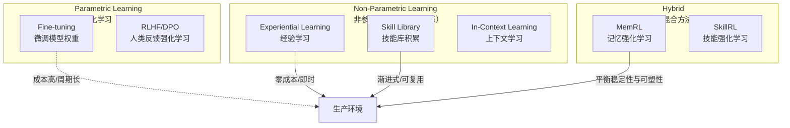
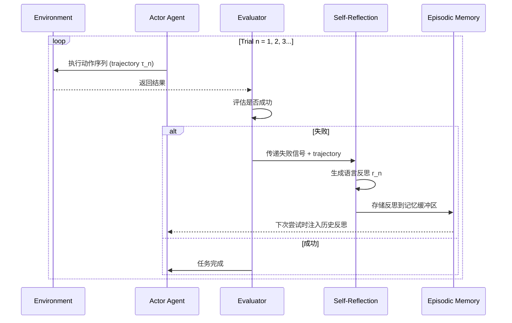
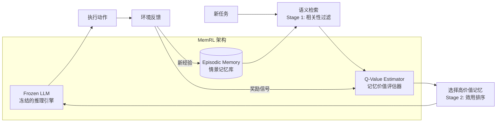
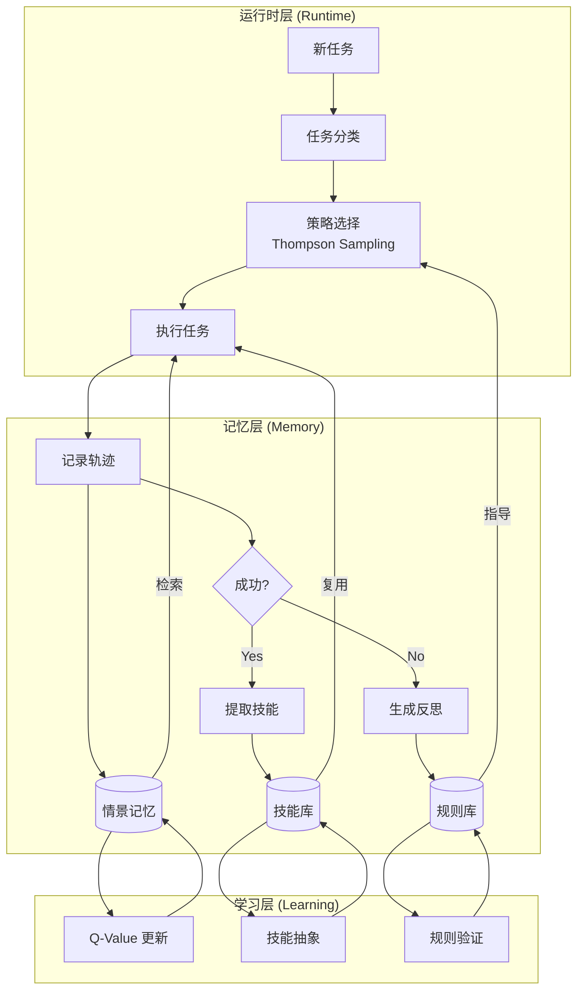

# 学习与自适应 (Learning and Adaptation)

## 概述

传统的 LLM Agent 是"无状态"的——每次对话结束后，Agent 的能力不会因为上一次的成功或失败而有任何变化。但真正智能的 Agent 应该具备**自我进化**能力：从经验中提取规律，在后续任务中表现得越来越好，无需人工干预或重新训练模型权重。

这是 Agent 从"工具"向"伙伴"跃迁的关键分水岭。

本章介绍三大学习范式及其工程实现：经验学习（从试错中提取知识）、技能积累（将成功经验沉淀为可复用能力）、策略适应（根据环境反馈动态调整行为策略）。

## 学习范式全景



对于生产级 Agent 系统，**非参数化学习**是最实用的路径——不需要修改 LLM 权重，通过外部记忆和检索机制实现能力增长。

## 经验学习 (Experiential Learning)

### Reflexion：语言强化学习

Reflexion（NeurIPS 2023）提出了一个开创性的理念：**用自然语言代替标量奖励信号进行强化学习**。Agent 在每次尝试失败后，不是简单地获得一个 -1 奖励，而是生成一段结构化的文字反思，描述"哪里出了错"和"下次应该怎么做"。



核心实现：

```python
from dataclasses import dataclass
from typing import Optional

@dataclass
class ReflexionMemory:
    """Reflexion 的情景记忆缓冲区"""
    trial_number: int
    trajectory: str       # 执行过程的完整记录
    outcome: str          # 成功/失败
    reflection: str       # LLM 生成的自然语言反思
    key_insight: str      # 提炼的核心教训

class ReflexionAgent:
    """
    Reflexion Agent: 通过语言反思实现无权重更新的强化学习。
    
    核心思想：
    - 失败不是终点，而是学习素材
    - 将失败经验转化为自然语言的"教训"
    - 下次尝试时将教训注入 prompt，避免重复犯错
    """
    
    REFLECTION_PROMPT = """You just attempted a task and failed. Analyze what went wrong.

Task: {task}
Your actions: {trajectory}
Result: {outcome}
Error/Feedback: {feedback}

Previous reflections (lessons learned so far):
{past_reflections}

Generate a concise reflection that:
1. Identifies the specific mistake or misconception
2. Explains WHY it was wrong (root cause)
3. Proposes a concrete alternative strategy for next time
4. States what you should AVOID doing

Format your reflection as a single paragraph focused on actionable insight."""

    ACTION_PROMPT = """You are solving the following task. Learn from your past mistakes.

Task: {task}

IMPORTANT - Lessons from previous attempts (DO NOT repeat these mistakes):
{reflections}

Now solve the task step by step, applying the lessons above."""
    
    def __init__(self, llm_client, max_trials: int = 5):
        self.llm = llm_client
        self.max_trials = max_trials
        self.memory: list[ReflexionMemory] = []
    
    async def solve_with_reflection(self, task: str) -> Optional[str]:
        """通过反复尝试和反思来解决任务"""
        
        for trial in range(1, self.max_trials + 1):
            # 1. 将历史反思注入 prompt
            reflections_text = "\n".join(
                f"- Trial {m.trial_number}: {m.reflection}" 
                for m in self.memory
            ) or "No previous attempts."
            
            # 2. 执行任务
            action_prompt = self.ACTION_PROMPT.format(
                task=task, reflections=reflections_text
            )
            trajectory = await self.llm.generate(action_prompt)
            
            # 3. 评估结果
            success, feedback = await self._evaluate(task, trajectory)
            
            if success:
                return trajectory
            
            # 4. 失败则生成反思
            reflection = await self._reflect(task, trajectory, feedback)
            self.memory.append(ReflexionMemory(
                trial_number=trial,
                trajectory=trajectory,
                outcome="failed",
                reflection=reflection,
                key_insight=self._extract_insight(reflection)
            ))
        
        return None  # 超过最大尝试次数
    
    async def _reflect(self, task: str, trajectory: str, feedback: str) -> str:
        """生成自然语言反思"""
        past = "\n".join(m.reflection for m in self.memory) or "None"
        prompt = self.REFLECTION_PROMPT.format(
            task=task, trajectory=trajectory,
            outcome="Failed", feedback=feedback,
            past_reflections=past
        )
        return await self.llm.generate(prompt)
    
    async def _evaluate(self, task: str, result: str) -> tuple[bool, str]:
        """评估执行结果（可以是程序化验证或 LLM 判断）"""
        raise NotImplementedError
    
    def _extract_insight(self, reflection: str) -> str:
        """从反思中提取一句话核心教训"""
        # 简化实现，实际可用 LLM 提取
        return reflection.split(".")[0]
```

### ExpeL：经验提炼为规则

ExpeL（AAAI 2024）在 Reflexion 基础上更进一步——不仅记住具体经历，还**自动从多次经验中提炼出通用规则**（Insights），形成可迁移的知识：

```python
class ExperientialLearner:
    """
    ExpeL: 从经验中自主提炼可迁移知识。
    
    三阶段学习流程：
    1. Exploration: 在训练任务上尝试（允许失败）
    2. Extraction: 对比成功/失败轨迹，提炼通用规则
    3. Application: 将规则作为经验注入新任务的 prompt
    """
    
    EXTRACTION_PROMPT = """Analyze these task execution experiences and extract general rules.

Successful trajectories:
{successes}

Failed trajectories:
{failures}

Extract 3-5 general rules/insights that explain:
- What patterns led to success?
- What common mistakes caused failures?
- What strategies should always be applied?

Rules should be:
- General (applicable beyond these specific tasks)
- Actionable (can be directly used as guidelines)
- Concise (one sentence each)

Output as a JSON array: [{{"rule": "...", "confidence": 0.0-1.0, "source_tasks": [...]}}]"""
    
    def __init__(self, llm_client):
        self.llm = llm_client
        self.experience_pool: list[dict] = []  # 原始经验
        self.insights: list[dict] = []          # 提炼的规则
    
    async def learn_from_batch(self, experiences: list[dict]) -> list[dict]:
        """从一批经验中提炼通用规则"""
        successes = [e for e in experiences if e["success"]]
        failures = [e for e in experiences if not e["success"]]
        
        if not successes or not failures:
            return []  # 需要正反两面的经验才能提炼
        
        prompt = self.EXTRACTION_PROMPT.format(
            successes=self._format_experiences(successes[:5]),
            failures=self._format_experiences(failures[:5])
        )
        
        response = await self.llm.generate(prompt, json_mode=True)
        new_insights = self._parse_insights(response)
        
        # 与已有规则去重和合并
        self.insights = self._merge_insights(self.insights, new_insights)
        return new_insights
    
    async def apply_to_task(self, task: str) -> str:
        """将积累的知识应用到新任务"""
        relevant_insights = self._retrieve_relevant(task, top_k=5)
        
        insights_text = "\n".join(
            f"- [{ins['confidence']:.1f}] {ins['rule']}"
            for ins in relevant_insights
        )
        
        prompt = f"""Task: {task}

Apply these learned insights from past experience:
{insights_text}

Solve the task, explicitly applying the relevant insights."""
        
        return await self.llm.generate(prompt)
    
    def _retrieve_relevant(self, task: str, top_k: int) -> list[dict]:
        """检索与当前任务最相关的规则（基于嵌入相似度）"""
        # 实际实现中使用向量检索
        return sorted(self.insights, key=lambda x: x["confidence"], reverse=True)[:top_k]
    
    def _merge_insights(self, existing: list, new: list) -> list:
        """合并规则：相似规则取高置信度，矛盾规则保留两者待验证"""
        # 简化实现
        merged = existing.copy()
        for rule in new:
            if not any(self._is_similar(rule, e) for e in existing):
                merged.append(rule)
        return merged
    
    def _is_similar(self, r1: dict, r2: dict) -> bool:
        """判断两条规则是否语义相似"""
        return False  # 实际实现用嵌入余弦相似度
    
    def _format_experiences(self, exps: list) -> str:
        return "\n---\n".join(
            f"Task: {e['task']}\nActions: {e['trajectory']}\nResult: {e['outcome']}"
            for e in exps
        )
    
    def _parse_insights(self, response: str) -> list[dict]:
        import json
        try:
            return json.loads(response)
        except json.JSONDecodeError:
            return []
```

## MemRL：记忆强化学习

MemRL（2025，上海交大）提出了一个优雅的解决方案来调和**稳定性-可塑性困境**：LLM 的权重保持冻结（稳定性），而外部情景记忆持续进化（可塑性）。核心创新在于用 Q-learning 对记忆条目进行价值评估：



关键设计：

```python
import numpy as np
from typing import NamedTuple

class MemoryEntry(NamedTuple):
    """MemRL 的记忆条目"""
    state: str        # 任务上下文
    action: str       # 采取的行动
    outcome: str      # 结果
    embedding: np.ndarray  # 语义嵌入
    q_value: float    # 学习到的效用值

class MemRLAgent:
    """
    MemRL: 通过情景记忆上的非参数强化学习实现自我进化。
    
    两阶段检索：
    1. 语义相关性过滤（embedding cosine similarity）
    2. 效用排序（learned Q-value）
    
    Q-value 更新规则（TD-learning 变体）：
    Q(m) ← Q(m) + α * (r + γ * max Q(m') - Q(m))
    """
    
    def __init__(
        self,
        llm_client,
        embedding_model,
        alpha: float = 0.1,      # 学习率
        gamma: float = 0.9,      # 折扣因子
        top_k_semantic: int = 20, # 语义过滤保留数
        top_k_utility: int = 5,   # 最终选择数
    ):
        self.llm = llm_client
        self.embedder = embedding_model
        self.alpha = alpha
        self.gamma = gamma
        self.top_k_semantic = top_k_semantic
        self.top_k_utility = top_k_utility
        self.memory: list[MemoryEntry] = []
    
    async def act(self, task: str) -> str:
        """基于记忆增强的决策"""
        # Stage 1: 语义检索
        task_emb = await self.embedder.encode(task)
        candidates = self._semantic_retrieve(task_emb, self.top_k_semantic)
        
        # Stage 2: Q-value 排序
        selected = sorted(candidates, key=lambda m: m.q_value, reverse=True)
        selected = selected[:self.top_k_utility]
        
        # 将高价值记忆注入 prompt
        memory_context = "\n".join(
            f"[Utility={m.q_value:.2f}] Context: {m.state} → Action: {m.action} → Result: {m.outcome}"
            for m in selected
        )
        
        prompt = f"""Task: {task}

Relevant past experiences (sorted by effectiveness):
{memory_context}

Based on these experiences, decide your action."""
        
        return await self.llm.generate(prompt)
    
    def update_from_feedback(self, task: str, action: str, reward: float) -> None:
        """根据环境反馈更新 Q-values（TD-learning）"""
        task_emb = self.embedder.encode_sync(task)
        
        # 找到本次使用的记忆条目并更新其 Q-value
        for i, mem in enumerate(self.memory):
            similarity = np.dot(task_emb, mem.embedding)
            if similarity > 0.8:  # 相关记忆
                # TD-update
                max_future_q = max(
                    (m.q_value for m in self.memory if m != mem),
                    default=0.0
                )
                td_target = reward + self.gamma * max_future_q
                td_error = td_target - mem.q_value
                new_q = mem.q_value + self.alpha * td_error
                
                # 更新记忆条目的 Q-value
                self.memory[i] = mem._replace(q_value=new_q)
        
        # 存储新经验
        new_entry = MemoryEntry(
            state=task, action=action,
            outcome=f"reward={reward}",
            embedding=task_emb,
            q_value=reward  # 初始 Q-value = 即时奖励
        )
        self.memory.append(new_entry)
    
    def _semantic_retrieve(self, query_emb: np.ndarray, top_k: int) -> list[MemoryEntry]:
        """基于余弦相似度的语义检索"""
        if not self.memory:
            return []
        
        similarities = [
            (np.dot(query_emb, m.embedding), m)
            for m in self.memory
        ]
        similarities.sort(key=lambda x: x[0], reverse=True)
        return [m for _, m in similarities[:top_k]]
```

## 技能库：渐进式能力积累

### Voyager 模式：代码即技能

Voyager（NVIDIA + MIT, 2023）在 Minecraft 中展示了 LLM Agent 如何通过渐进式课程学习，自动构建一个不断增长的**可执行技能库**：

```python
import json
from typing import Optional
from dataclasses import dataclass, field

@dataclass
class Skill:
    """一个可复用的 Agent 技能"""
    name: str
    description: str       # 自然语言描述，用于检索
    code: str              # 可执行代码
    dependencies: list[str] = field(default_factory=list)  # 依赖的其他技能
    success_count: int = 0
    failure_count: int = 0
    
    @property
    def reliability(self) -> float:
        total = self.success_count + self.failure_count
        return self.success_count / total if total > 0 else 0.5

class SkillLibrary:
    """
    Voyager 风格的渐进式技能库。
    
    核心特性：
    - 技能以可执行代码形式存储（而非纯文本描述）
    - 通过自然语言描述的 embedding 索引技能
    - 支持技能组合：复杂技能可调用简单技能
    - 成功率跟踪：低可靠性技能被标记和修正
    """
    
    def __init__(self, embedding_model, vector_store):
        self.embedder = embedding_model
        self.store = vector_store
        self.skills: dict[str, Skill] = {}
    
    async def add_skill(self, skill: Skill) -> None:
        """添加新技能到库中"""
        # 检查是否已有类似技能
        similar = await self.retrieve(skill.description, top_k=3)
        for existing in similar:
            if existing.name == skill.name:
                # 更新已有技能的代码
                self.skills[skill.name] = skill
                return
        
        # 存储新技能
        self.skills[skill.name] = skill
        embedding = await self.embedder.encode(skill.description)
        await self.store.upsert(
            id=skill.name,
            embedding=embedding,
            metadata={"description": skill.description, "code": skill.code}
        )
    
    async def retrieve(self, query: str, top_k: int = 5) -> list[Skill]:
        """根据任务描述检索相关技能"""
        query_emb = await self.embedder.encode(query)
        results = await self.store.search(query_emb, top_k=top_k)
        return [self.skills[r["id"]] for r in results if r["id"] in self.skills]
    
    async def compose_skills(self, task: str, llm_client) -> str:
        """
        组合已有技能来解决新任务。
        这是 Voyager 的核心创新：技能可以像函数一样被组合调用。
        """
        relevant_skills = await self.retrieve(task, top_k=10)
        
        skills_context = "\n".join(
            f"### {s.name} (reliability: {s.reliability:.0%})\n"
            f"Description: {s.description}\n"
            f"Code:\n```python\n{s.code}\n```"
            for s in relevant_skills
        )
        
        prompt = f"""You have access to these existing skills:

{skills_context}

New task: {task}

Write a new skill that solves this task. You can call existing skills as functions.
If no existing skill is directly useful, write the solution from scratch.

Output ONLY the Python function code."""
        
        new_code = await llm_client.generate(prompt)
        return new_code
    
    def record_outcome(self, skill_name: str, success: bool) -> None:
        """记录技能执行结果，更新可靠性指标"""
        if skill_name in self.skills:
            if success:
                self.skills[skill_name].success_count += 1
            else:
                self.skills[skill_name].failure_count += 1


class AutomaticCurriculum:
    """
    自动课程设计：从简单到复杂的渐进式学习。
    Voyager 的创新之一——让 Agent 自主选择下一步学什么。
    """
    
    CURRICULUM_PROMPT = """You are a curriculum designer for an AI agent.

The agent has already mastered these skills:
{mastered_skills}

The agent's current capabilities allow it to:
{current_capabilities}

Recent exploration results:
{recent_results}

Suggest the next task for the agent to learn. The task should be:
1. Slightly beyond current capabilities (zone of proximal development)
2. Buildable on existing skills
3. Useful for the agent's long-term growth

Output a single task description."""
    
    def __init__(self, skill_library: SkillLibrary, llm_client):
        self.library = skill_library
        self.llm = llm_client
    
    async def suggest_next_task(self) -> str:
        """建议下一个学习任务（维果茨基最近发展区原则）"""
        mastered = [
            f"- {s.name}: {s.description}" 
            for s in self.library.skills.values() 
            if s.reliability > 0.8
        ]
        
        prompt = self.CURRICULUM_PROMPT.format(
            mastered_skills="\n".join(mastered) or "None yet",
            current_capabilities=self._summarize_capabilities(),
            recent_results=self._get_recent_results()
        )
        
        return await self.llm.generate(prompt)
    
    def _summarize_capabilities(self) -> str:
        """总结当前能力等级"""
        total = len(self.library.skills)
        reliable = sum(1 for s in self.library.skills.values() if s.reliability > 0.8)
        return f"{reliable}/{total} skills mastered with >80% reliability"
    
    def _get_recent_results(self) -> str:
        """获取最近的学习尝试结果"""
        return "Recent attempts logged in memory"
```

### SkillRL：强化学习驱动的技能抽象

SkillRL（2025）在 Voyager 的基础上引入了**层次化技能抽象**——不只是存储和复用技能，还能从大量低级操作中自动归纳出高级行为模式：

```python
class HierarchicalSkillAbstractor:
    """
    从执行轨迹中自动抽象出高层技能模式。
    
    低层操作 → 识别重复模式 → 抽象为可参数化的高层技能
    
    例如：多次观察到 "搜索文档 → 提取信息 → 格式化输出" 序列后，
    抽象为一个 "research_and_summarize(topic, format)" 高层技能。
    """
    
    ABSTRACTION_PROMPT = """Analyze these execution traces and identify recurring patterns:

Traces:
{traces}

For each pattern found:
1. Give it a descriptive name
2. Identify the variable parts (parameters)
3. Write a generalized implementation
4. Estimate when this pattern should be applied

Output as JSON array of skill abstractions."""
    
    def __init__(self, llm_client, min_occurrences: int = 3):
        self.llm = llm_client
        self.min_occurrences = min_occurrences
        self.trajectory_buffer: list[list[str]] = []
    
    def record_trajectory(self, actions: list[str]) -> None:
        """记录一条完整的执行轨迹"""
        self.trajectory_buffer.append(actions)
    
    async def abstract_skills(self) -> list[Skill]:
        """从轨迹缓冲区中提取通用技能"""
        if len(self.trajectory_buffer) < self.min_occurrences:
            return []
        
        traces_text = "\n---\n".join(
            " → ".join(t) for t in self.trajectory_buffer[-20:]
        )
        
        prompt = self.ABSTRACTION_PROMPT.format(traces=traces_text)
        response = await self.llm.generate(prompt, json_mode=True)
        
        skills = []
        for item in json.loads(response):
            skills.append(Skill(
                name=item["name"],
                description=item["description"],
                code=item["implementation"],
                dependencies=item.get("dependencies", [])
            ))
        
        return skills
```

## 策略适应 (Strategy Adaptation)

### 多臂赌博机模型

当 Agent 面对多种可选策略时，如何在"利用已知最优"和"探索可能更好"之间平衡？这本质是一个 Multi-Armed Bandit 问题：

```python
import numpy as np
from collections import defaultdict

class StrategySelector:
    """
    基于 Thompson Sampling 的策略选择器。
    
    Agent 维护多种行为策略（如不同的推理方式、不同的工具组合），
    通过 Thompson Sampling 在探索和利用之间平衡。
    """
    
    def __init__(self, strategies: list[str]):
        self.strategies = strategies
        # Beta 分布参数（初始先验均匀）
        self.alpha = defaultdict(lambda: 1.0)  # 成功次数 + 1
        self.beta = defaultdict(lambda: 1.0)   # 失败次数 + 1
    
    def select_strategy(self) -> str:
        """Thompson Sampling: 从后验分布中采样来选择策略"""
        samples = {
            s: np.random.beta(self.alpha[s], self.beta[s])
            for s in self.strategies
        }
        return max(samples, key=samples.get)
    
    def update(self, strategy: str, reward: float) -> None:
        """根据反馈更新信念"""
        if reward > 0.5:
            self.alpha[strategy] += reward
        else:
            self.beta[strategy] += (1 - reward)
    
    def get_stats(self) -> dict:
        """返回每个策略的估计成功率"""
        return {
            s: self.alpha[s] / (self.alpha[s] + self.beta[s])
            for s in self.strategies
        }


class AdaptiveAgent:
    """
    自适应 Agent：根据任务类型和历史效果动态选择最佳策略。
    
    策略维度：
    - 推理策略：CoT / ToT / Direct / Decompose
    - 工具选择策略：single-tool / multi-tool / tool-chain
    - 交互策略：autonomous / ask-for-clarification / phased-delivery
    """
    
    def __init__(self, llm_client):
        self.llm = llm_client
        
        # 为不同任务类型维护独立的策略选择器
        self.selectors: dict[str, StrategySelector] = {
            "reasoning": StrategySelector(["cot", "tot", "direct", "decompose"]),
            "tool_use": StrategySelector(["single", "multi", "chain"]),
            "interaction": StrategySelector(["autonomous", "clarify", "phased"]),
        }
        
        # 任务类型分类器的历史数据
        self.task_type_history: list[dict] = []
    
    async def execute_adaptively(self, task: str) -> dict:
        """自适应执行：选择策略 → 执行 → 学习"""
        
        # 1. 选择各维度的策略
        selected = {
            dim: selector.select_strategy()
            for dim, selector in self.selectors.items()
        }
        
        # 2. 按选定策略执行
        result = await self._execute_with_strategy(task, selected)
        
        # 3. 评估效果并更新
        reward = await self._evaluate_result(task, result)
        for dim, strategy in selected.items():
            self.selectors[dim].update(strategy, reward)
        
        return {
            "result": result,
            "strategy_used": selected,
            "reward": reward,
            "updated_stats": {
                dim: sel.get_stats() for dim, sel in self.selectors.items()
            }
        }
    
    async def _execute_with_strategy(self, task: str, strategies: dict) -> str:
        """按指定策略组合执行任务"""
        # 根据推理策略选择不同的 prompt 模板
        reasoning = strategies["reasoning"]
        if reasoning == "cot":
            prompt = f"Think step by step.\n\nTask: {task}"
        elif reasoning == "tot":
            prompt = f"Consider multiple approaches, evaluate each.\n\nTask: {task}"
        elif reasoning == "decompose":
            prompt = f"Break this into subtasks first.\n\nTask: {task}"
        else:
            prompt = f"Task: {task}"
        
        return await self.llm.generate(prompt)
    
    async def _evaluate_result(self, task: str, result: str) -> float:
        """评估执行结果质量（0-1）"""
        # 实际实现可以是程序化验证、LLM 判断或用户反馈
        return 0.5  # 占位
```

## 学习系统的工程架构

将上述组件整合为一个完整的学习系统：



## 生产环境注意事项

### 稳定性-可塑性困境

Agent 需要同时满足两个矛盾需求：**稳定性**（不因为一次偶然错误就改变行为）和**可塑性**（能快速适应新环境）。

| 策略 | 侧重 | 适用场景 |
|------|------|---------|
| 高学习率 + 短记忆窗口 | 可塑性 | 环境变化频繁，旧经验快速过时 |
| 低学习率 + 长记忆 + 置信度阈值 | 稳定性 | 高风险场景，宁可保守也不能出错 |
| 分层学习率 | 平衡 | 低层操作稳定 + 高层策略灵活 |
| MemRL 式解耦 | 最优平衡 | LLM 冻结保稳定，记忆模块保可塑 |

### 灾难性遗忘防护

```python
class ForgettingProtection:
    """防止学习新知识时丢失已有能力"""
    
    def __init__(self, skill_library: SkillLibrary, min_reliability: float = 0.7):
        self.library = skill_library
        self.min_reliability = min_reliability
        self._baseline_performance: dict[str, float] = {}
    
    async def checkpoint(self) -> None:
        """保存当前能力基线快照"""
        self._baseline_performance = {
            name: skill.reliability
            for name, skill in self.library.skills.items()
        }
    
    async def detect_regression(self) -> list[str]:
        """检测能力退化：哪些技能的可靠性下降了？"""
        regressions = []
        for name, baseline in self._baseline_performance.items():
            if name in self.library.skills:
                current = self.library.skills[name].reliability
                if current < baseline - 0.1:  # 下降超过 10%
                    regressions.append(name)
        return regressions
    
    async def rollback_if_needed(self, regressions: list[str]) -> None:
        """对退化的技能进行回滚或重新强化"""
        for skill_name in regressions:
            # 回滚到上一个可靠版本，或触发重新验证
            pass
```

### 学习效果度量

| 指标 | 含义 | 目标 |
|------|------|------|
| 首次成功率 (First-Try Success) | 无需重试即成功的比例 | 随时间递增 |
| 平均尝试次数 (Mean Trials) | 完成任务的平均尝试次数 | 随时间递减 |
| 技能复用率 (Skill Reuse Ratio) | 使用已有技能解决新任务的比例 | 30-60% 为健康范围 |
| 知识迁移成功率 (Transfer Rate) | 从一类任务学到的经验在另一类生效的比例 | 随规则库增长递增 |
| 能力退化率 (Regression Rate) | 已掌握技能退化的比例 | < 5% |

## 技术选型建议

| 场景 | 推荐方案 | 理由 |
|------|---------|------|
| 短期任务，允许多次重试 | Reflexion | 实现简单，单任务内快速收敛 |
| 跨任务知识积累 | ExpeL | 自动提炼通用规则，支持迁移 |
| 长期运行的生产系统 | MemRL | 无需训练，平衡稳定性与可塑性 |
| 具身 Agent / 工具密集型 | Voyager + Skill Library | 技能以代码形式沉淀和复用 |
| 多策略选择场景 | Thompson Sampling | 在探索和利用间动态平衡 |

## 参考

- Reflexion (NeurIPS 2023, Shinn et al.) — Language Agents with Verbal Reinforcement Learning
- ExpeL (AAAI 2024, Zhao et al.) — LLM Agents Are Experiential Learners
- MemRL (2025, 上海交大) — Self-Evolving Agents via Runtime Reinforcement Learning on Episodic Memory
- Voyager (2023, NVIDIA) — An Open-Ended Embodied Agent with Large Language Models
- SkillRL (2025) — Evolving Agents via Recursive Skill Reinforcement Learning
- Agent Skills Survey (2025, arXiv:2602.12430) — Architecture, Acquisition and Composition
- H-EPM (2024) — Experience-Evolving Multi-Turn Tool-Use Agent with Hybrid Episodic-Procedural Memory
