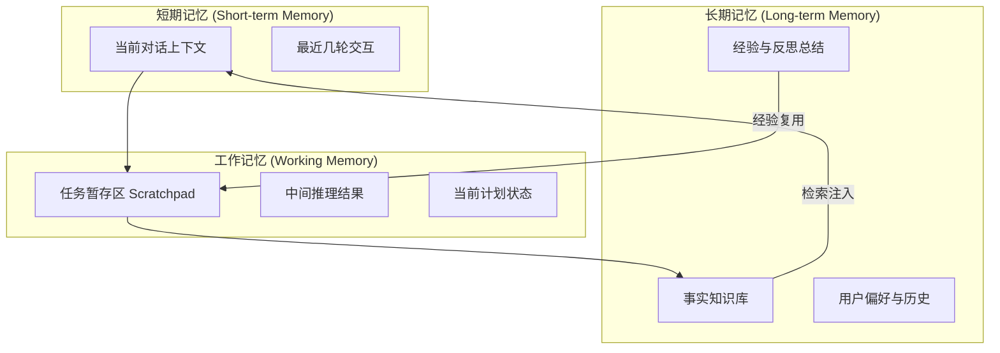
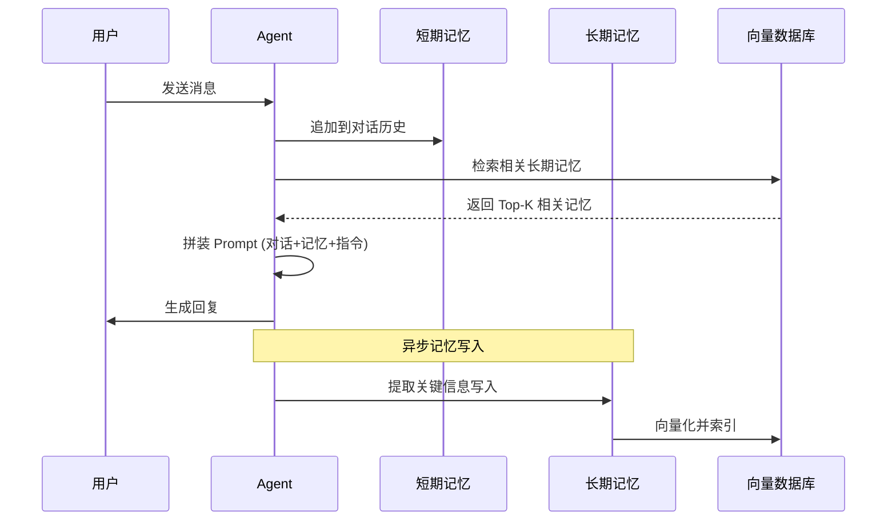

## 概述

记忆（Memory）是 Agent 从"无状态工具"进化为"有经验伙伴"的核心能力。没有记忆的 Agent 就像每次见面都会失忆的同事——无论之前讨论了什么，下次都要从头开始。

LLM 的上下文窗口（Context Window）虽然在不断增长（从 4K 到 128K 甚至更长），但它本质上是"短期记忆"——会话结束即消失，且受限于固定的 Token 上限。真正的 Agent 记忆系统需要解决三个核心问题：跨会话的持久性、海量信息的高效检索、以及信息的动态更新与遗忘。

## 记忆的三层架构

借鉴认知科学中人类记忆的分类，Agent 的记忆系统通常采用三层架构：



### 短期记忆

即 LLM 的上下文窗口本身。它保存当前会话的完整对话历史，是 Agent "当下意识"的承载体。主要挑战是窗口长度限制——当对话过长时需要截断或压缩。

### 工作记忆

类似人类的"心理白板"，用于存储当前任务执行过程中的临时信息。例如：正在执行的计划步骤、已收集的中间结果、待验证的假设。工作记忆不需要跨会话持久化，但在单次任务执行中需要随时读写。

### 长期记忆

跨会话持久化的知识存储，包含用户偏好、历史交互总结、学到的事实和经验。长期记忆是使 Agent 能够"成长"和"个性化"的关键组件。

## 记忆的读写流程

一个完整的记忆系统包含"写入"和"读取"两条路径：



## 向量检索：长期记忆的核心引擎

长期记忆的检索通常基于向量相似度搜索。核心流程是：将记忆文本通过 Embedding 模型转化为高维向量，存储在向量数据库中；查询时将当前上下文也向量化，通过近似最近邻（ANN）搜索找到最相关的记忆片段。

### 关键技术组件

**Embedding 模型**：将文本转为固定维度的语义向量。常用模型包括 OpenAI text-embedding-3-small、BGE、GTE 等。选择时需权衡维度（影响存储和计算）与语义质量。

**索引结构**：

- **HNSW**（Hierarchical Navigable Small World）：基于图的索引，查询速度快，内存占用较高，适合中小规模数据
- **IVF**（Inverted File Index）：基于聚类的索引，适合大规模数据，需要训练阶段
- **量化压缩**（PQ/SQ）：通过量化降低存储开销，适合超大规模场景

### 检索增强策略

单纯的向量相似度检索往往不够精确，实践中常组合以下策略：

- **混合检索**：结合向量搜索与关键词搜索（BM25），取长补短
- **时间衰减**：对记忆施加时间权重，近期记忆优先
- **重要性加权**：结合记忆的"重要性评分"调整排序
- **多轮检索**：先粗检索再精排序（two-stage retrieval）

## 实现模式

### RAG 式记忆

最直接的实现方式是将记忆系统视为一个 RAG（Retrieval-Augmented Generation）管道：

```python
class RAGMemory:
    """基于 RAG 的 Agent 记忆系统"""
    
    def __init__(self, embedding_model, vector_store, llm):
        self.embedder = embedding_model
        self.store = vector_store
        self.llm = llm
    
    def remember(self, content: str, metadata: dict = None):
        """写入记忆"""
        # 1. 提取关键信息
        key_facts = self.llm.extract_facts(content)
        
        # 2. 重要性评分
        importance = self.llm.score_importance(
            content, 
            criteria="对未来交互的潜在价值"
        )
        
        # 3. 矛盾检测——检查是否与已有记忆冲突
        existing = self.store.search(content, top_k=5)
        contradictions = self.llm.detect_contradictions(key_facts, existing)
        
        if contradictions:
            # 更新而非新增
            self.store.update(contradictions, key_facts)
        else:
            # 向量化并存储
            vector = self.embedder.encode(content)
            self.store.insert(
                vector=vector,
                content=content,
                metadata={**metadata, "importance": importance}
            )
    
    def recall(self, query: str, top_k: int = 5) -> list[str]:
        """检索记忆"""
        # 1. 向量检索
        vector_results = self.store.search(
            self.embedder.encode(query), top_k=top_k * 2
        )
        
        # 2. 时间衰减加权
        scored_results = []
        for r in vector_results:
            time_weight = exponential_decay(r.timestamp, half_life_days=30)
            final_score = r.similarity * 0.7 + r.importance * 0.2 + time_weight * 0.1
            scored_results.append((r, final_score))
        
        # 3. 重排序并返回
        scored_results.sort(key=lambda x: x[1], reverse=True)
        return [r.content for r, _ in scored_results[:top_k]]
```

### MemGPT 分页式记忆

MemGPT [Packer et al., 2023] 提出了一种受操作系统虚拟内存启发的记忆管理方案。其核心思想是将 LLM 的上下文窗口类比为"主存"，长期记忆类比为"磁盘"，通过显式的 "页面调入/调出" 操作管理有限的上下文空间。

MemGPT 的关键设计：

- **主上下文**（Main Context）：LLM 可直接访问的当前窗口内容
- **归档记忆**（Archival Memory）：持久化的外部存储，通过搜索访问
- **回忆记忆**（Recall Memory）：最近的对话历史数据库
- **自主管理**：Agent 自己决定何时"换页"——将不活跃内容移出主上下文，将需要的内容检索进来

这种设计使 Agent 能在有限窗口内处理无限长的交互历史。

## 记忆写入策略

### 重要性评分

并非所有信息都值得记住。重要性评分帮助 Agent 过滤噪声：

- **显式标记**：用户明确说"记住这个"
- **LLM 评估**：让模型判断信息的长期价值（1-10 分）
- **频率信号**：反复出现的信息更可能重要
- **情感强度**：带有强烈情感色彩的内容更值得保留

### 矛盾检测与更新

当新信息与已有记忆冲突时（如用户更换了工作），系统需要决策是"新增"还是"替换"。通常采用 LLM 进行语义级别的矛盾检测，对确认过时的记忆进行标记或替换。

### 记忆压缩

长期积累的记忆需要定期压缩，避免存储膨胀。常见策略包括：将多条相关记忆合并为一条摘要、删除被后续信息覆盖的旧记忆、对低重要性记忆进行定期清理。

## 遗忘与衰减

如同人类会自然遗忘不重要的信息，Agent 的记忆系统也需要"遗忘"机制来保持信息的时效性和存储的可控性。

### 时间衰减

记忆的"新鲜度"随时间指数衰减：

$$score_{final} = score_{relevance} \times e^{-\lambda \cdot \Delta t}$$

其中 $\lambda$ 控制衰减速度，$\Delta t$ 是距上次访问的时间间隔。

### LRU 淘汰

当存储空间有限时，采用类似缓存系统的 LRU（Least Recently Used）策略淘汰最久未被访问的记忆。

### 主动遗忘

用户可以显式要求 Agent "忘记"某些信息，这在隐私保护场景中尤为重要。

## 工程考量

### 延迟

记忆检索增加了响应延迟（通常 50-200ms），需要通过以下方式优化：预检索（在用户输入时即开始检索）、缓存热门记忆、控制检索条目数。

### 成本

Embedding 计算和向量存储都有成本。大规模记忆系统需要在"记忆覆盖度"和"运营成本"之间取得平衡。

### 一致性

分布式环境下多个 Agent 实例共享记忆时，需要处理并发写入和一致性问题。

## 主流记忆架构深度对比

2024-2026 年，三种代表性的记忆管理架构形成了鲜明的设计哲学分野。选择哪种方案，取决于应用对记忆深度、响应速度和工程复杂度的权衡。

### MemGPT / Letta：操作系统启发的层次化状态管理

Letta（MemGPT 的演进版本）从操作系统的内存管理机制中汲取灵感，构建了一个三层记忆架构：核心记忆（类似内核空间，存储 Agent 人格和关键指令，始终加载到上下文中）、回忆记忆（类似主存 RAM，存储当前和近期对话完整历史）、存档记忆（类似硬盘，采用向量索引进行长期持久化存储）。

其最核心的创新是**虚拟上下文分页**——借鉴操作系统虚拟内存的"换入/换出"机制，当上下文窗口即将溢出时，Agent 自主决策将不重要的信息"换出"到存档记忆，需要时再"换入"。Agent 被赋予了管理自身记忆的函数调用能力，能够显式地读取、写入和修改不同层次的记忆。

Letta 还引入了 Git 风格的版本控制用于记忆的追溯和冲突解决，以及异步后台合并来优化性能。这使其在长上下文场景和需要精细追踪情感演变的复杂任务中表现卓越。然而代价是极高的系统复杂性——Letta 更像一个完整的 Agent 平台而非简单的插件，部署和维护难度远高于其他方案。

### Mem0：轻量级"写入时智能"记忆层

Mem0 的设计哲学与 Letta 截然相反：提供一个轻量级、高性能、可插拔的记忆层，方便嵌入到任何现有的 LLM 应用中。

其核心理念是**写入时智能（Intelligence at Write Time）**——传统记忆系统在读取时进行大量计算来找到相关信息，Mem0 反其道行之，在信息存入时就进行自动提取、分类、摘要和关联建立。这使得后续检索极为快速，特别适合高频检索场景。

Mem0 的突出应用是自动从对话中提取用户偏好并支持跨会话使用，它能将记忆表示为实体-关系图，适合跨时间和会话进行推理。相较于 Letta，Mem0 具有更高的生产成熟度和更低的集成门槛，是为现有应用"加装"记忆能力的理想选择。其权衡在于记忆精度——主要依赖向量相似度检索，在需要复杂逻辑推理或精细情感追踪时可能表现较弱。

### Zep：基于时间知识图谱的结构化记忆

Zep 利用**时间知识图谱（Temporal Knowledge Graph）**来组织记忆，不单纯依赖层次结构或向量检索。其核心优势在于时间感知查询——允许 Agent 进行"上周我们讨论了什么？"或"在提到项目A之后又谈了哪些相关主题？"这类时序推理。

Zep 将对话中的实体、事实和关系结构化地存储在图中，支持冲突解决（自动检测记忆中的矛盾信息）和社区检测（识别反复出现的主题群组）。适用于对时间序列、事实关联有强需求的场景，如复杂项目管理或用户行为演变追踪。其权衡是知识图谱的构建和维护成本较高。

### 横向对比矩阵

| 维度 | Letta (MemGPT) | Mem0 | Zep |
|------|----------------|------|-----|
| 设计哲学 | OS 级状态管理 | 轻量可插拔层 | 时间知识图谱 |
| 写入机制 | Agent 自主管理（函数调用） | 写入时智能提取 | 图结构化存储 |
| 检索特点 | 分层分页 + 语义搜索 | 高速向量检索 | 时间感知 + 关系推理 |
| 写入延迟 | 较高（复杂逻辑） | 较低（追加式） | 中等（图构建） |
| 检索延迟 | 中等 | 极低 | 中等 |
| 记忆精度 | 极高（精细状态追踪） | 中等（向量相似度） | 高（结构化关系） |
| 工程复杂度 | 极高（平台级） | 低（SDK 集成） | 中高（图数据库） |
| 版本控制 | 支持（Git 风格） | 不支持 | 部分支持 |
| 最佳场景 | 从零构建长期自主 Agent | 为现有应用加装记忆 | 时序推理和事实关联 |

### 前沿探索：混合分层记忆架构

将 Mem0 的快速检索能力与 Letta 的深度状态管理相结合，是一种理论上极具吸引力的混合模式：

**L0 - 快速暂存层（Mem0 驱动）**：充当记忆系统的"L1/L2 缓存"。所有新信息首先进入此层，利用写入时智能进行实体提取和初步分类，满足高频、低延迟的检索需求。

**L1 - 情景工作记忆层（Letta 回忆记忆驱动）**：充当"主存"，维护当前任务的完整情景记忆。Mem0 中的信息经过后台批处理后，被结构化整理并推送到此层。

**L2 - 长期归档层（Letta 存档+核心记忆驱动）**：充当"硬盘"和"BIOS"。Letta 的自主记忆管理定期将回忆记忆中不再活跃的信息分页到存档中，关键知识固化到核心记忆。Git 版本控制在此层保障可追溯性。

这种混合架构面临的核心挑战包括：数据同步带来的性能开销、两套系统的运维复杂性、以及分布式一致性问题（信息从 Mem0 流向 Letta 的时间窗口内可能出现数据不一致）。对于大多数标准应用，选择单一方案更为务实；混合架构适合对响应速度、记忆深度和状态精度都有极致要求的旗舰级应用。

## 工具与框架

当前主流的 Agent 记忆方案：

- **Letta (MemGPT)**：OS 级 Agent 记忆平台，支持分层管理和版本控制
- **Mem0**：轻量级个性化记忆层，写入时智能提取，易于集成
- **Zep**：基于时间知识图谱的结构化记忆服务，支持时序推理
- **LangChain Memory**：提供多种记忆实现（Buffer、Summary、Entity 等）
- **LlamaIndex**：将记忆与知识库检索统一在同一框架下

关于记忆系统在 Agent 能力模型中的层级定位，可参考 [../05-fundamentals/capability-model.md](../05-fundamentals/capability-model.md) 中第三层的讨论。

## 本章小结

记忆系统是 Agent 实现"个性化"和"持续学习"的基础设施。从短期的对话缓冲，到工作记忆的任务暂存，再到长期记忆的持久化知识管理，三层架构各司其职。向量检索是长期记忆的核心技术，但仅靠相似度搜索远远不够——重要性评分、时间衰减、矛盾检测等策略共同构成了一个健壮的记忆管理系统。随着 Agent 应用场景的复杂化，记忆系统正在成为区分"玩具 Agent"和"生产级 Agent"的关键分水岭。

## 延伸阅读

- [Packer et al., 2023] "MemGPT: Towards LLMs as Operating Systems"
- [Park et al., 2023] "Generative Agents: Interactive Simulacra of Human Behavior" — 斯坦福小镇中的记忆架构
- [Lewis et al., 2020] "Retrieval-Augmented Generation for Knowledge-Intensive NLP Tasks"
- [Zhang et al., 2024] "A Survey on the Memory Mechanism of Large Language Model based Agents"
- Zep 开源项目：https://github.com/getzep/zep
- Mem0 项目：https://github.com/mem0ai/mem0
