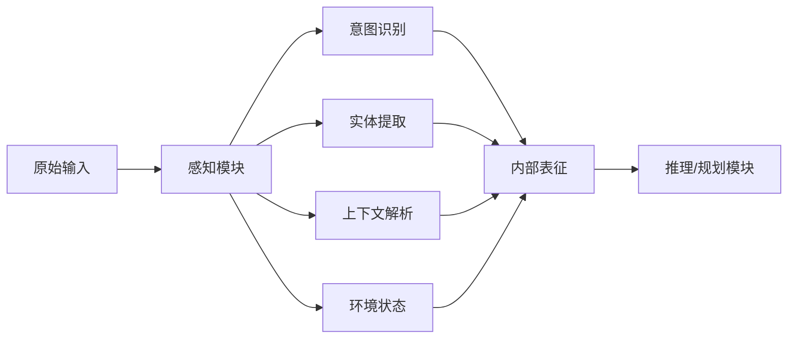
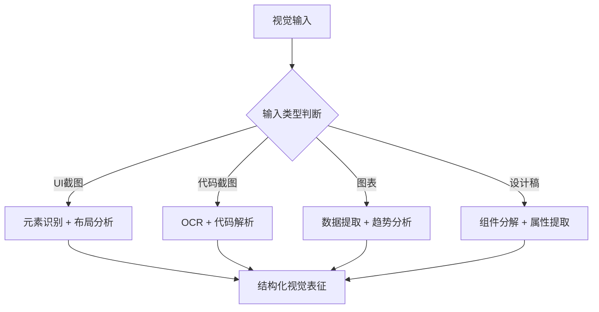
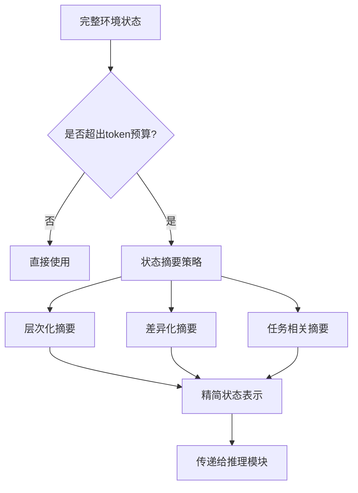

# 感知模块：Agent 如何理解输入

## 概述

感知模块（Perception Module）是 Agent 系统的"感官系统"，负责将外部世界的原始信号转化为 Agent 可理解、可推理的内部表征。正如人类通过视觉、听觉、触觉感知世界，Agent 通过感知模块理解文本、图像、代码、环境状态等多种输入形式。

感知模块的质量直接决定了后续推理和决策的上限——如果 Agent 无法正确理解当前状态，再精妙的规划算法也无法产生正确的行动。



## 文本理解：意图识别与实体提取

### 意图识别（Intent Recognition）

Agent 接收用户指令时，首要任务是理解"用户到底想做什么"。与传统 NLU 系统的分类式意图识别不同，LLM-based Agent 的意图识别更加灵活和开放域：

- **显式意图**：用户明确表达的需求，如"帮我重构这个函数"
- **隐式意图**：需要从上下文推断，如"这段代码好慢"隐含优化需求
- **复合意图**：单次输入包含多个子任务，如"先测试然后部署到生产环境"

### 实体提取（Entity Extraction）

实体提取关注从输入中识别关键信息片段：

```python
class PerceptionResult:
    """感知模块的输出结构"""
    def __init__(self):
        self.intent: str = ""           # 主要意图
        self.entities: dict = {}         # 提取的实体
        self.context_refs: list = []     # 上下文引用
        self.confidence: float = 0.0     # 置信度

def perceive_text(user_input: str, conversation_history: list) -> PerceptionResult:
    """文本感知的核心流程"""
    result = PerceptionResult()
    
    # 1. 意图分类
    result.intent = classify_intent(user_input, conversation_history)
    
    # 2. 实体提取：文件路径、函数名、变量名、URL等
    result.entities = extract_entities(user_input)
    
    # 3. 指代消解：将"它"、"那个文件"等映射到具体实体
    result.context_refs = resolve_references(user_input, conversation_history)
    
    # 4. 置信度评估
    result.confidence = assess_confidence(result)
    
    return result
```

### 上下文解析（Context Parsing）

上下文解析需要考虑多层信息：

- **会话上下文**：之前的对话轮次中提到的文件、变量、决策
- **项目上下文**：当前工作目录、项目结构、技术栈
- **时间上下文**：最近的操作结果、文件修改时间
- **隐含假设**：用户未明确说明但预期 Agent 知晓的信息

## 多模态感知

### 视觉感知（Vision）

随着 GPT-4V、Claude Vision 等多模态模型的出现，Agent 具备了"看"的能力：

- **截图理解**：分析 UI 截图中的元素布局、文字内容、交互状态
- **图表解读**：从数据可视化中提取趋势、异常和关键指标
- **设计稿解析**：将 UI 设计稿转化为结构化的组件描述
- **错误截图诊断**：从报错截图中识别问题根因



### 音频感知

语音交互场景下，Agent 需要处理：

- 语音转文本（ASR）后的文本理解
- 语气和情感信号的捕捉
- 环境音中有用信息的提取（如报警声）

### 结构化数据感知

Agent 经常需要处理结构化输入：

- JSON/XML 配置文件的语义理解
- 数据库查询结果的模式识别
- 日志文件的异常检测
- API 响应的状态判断

## 环境观察（Environment Observation）

### Web Agent 的 DOM 感知

Web Agent 需要理解网页的当前状态：

```python
class WebObservation:
    """Web环境的观察结果"""
    
    def observe_page(self, page) -> dict:
        """观察当前页面状态"""
        observation = {
            "url": page.url,
            "title": page.title,
            "interactive_elements": self._extract_interactive(page),
            "visible_text": self._extract_visible_text(page),
            "page_structure": self._simplify_dom(page),
            "form_state": self._get_form_values(page),
            "error_indicators": self._detect_errors(page),
        }
        return observation
    
    def _simplify_dom(self, page) -> str:
        """将复杂DOM简化为Agent可处理的表示"""
        # 去除装饰性元素，保留语义结构
        # 为交互元素添加唯一标识符
        # 控制输出长度在token预算内
        pass
    
    def _extract_interactive(self, page) -> list:
        """提取可交互元素：按钮、链接、输入框等"""
        elements = page.query_selector_all(
            "button, a, input, select, textarea, [role='button']"
        )
        return [self._describe_element(el) for el in elements]
```

### Code Agent 的文件系统感知

代码 Agent 需要感知项目环境：

- **目录结构**：项目布局、模块组织
- **文件内容**：源代码、配置文件、文档
- **Git 状态**：当前分支、未提交的更改、冲突
- **运行时信息**：终端输出、测试结果、编译错误

### 终端输出感知

Agent 执行命令后需要理解输出：

- 区分成功信息与错误信息
- 从冗长输出中提取关键内容
- 识别需要交互式响应的提示
- 解析结构化输出（表格、JSON）

## 感知过滤与注意力预算

### 信息过载问题

现实环境中，Agent 可能面临海量信息。一个大型项目可能有数千个文件，一个网页可能有数百个 DOM 元素。Agent 必须学会选择性地关注重要信息。

### 注意力预算（Attention Budget）

```python
class AttentionBudget:
    """管理Agent的注意力分配"""
    
    def __init__(self, total_tokens: int = 4000):
        self.total_budget = total_tokens
        self.allocations = {
            "task_description": 0.2,   # 20% 给任务描述
            "current_state": 0.3,      # 30% 给当前状态
            "relevant_history": 0.2,   # 20% 给相关历史
            "tool_results": 0.3,       # 30% 给工具结果
        }
    
    def filter_observation(self, raw_observation: str, category: str) -> str:
        """根据预算过滤观察内容"""
        budget = int(self.total_budget * self.allocations[category])
        
        if count_tokens(raw_observation) <= budget:
            return raw_observation
        
        # 超出预算时进行压缩
        return self._compress(raw_observation, budget)
    
    def _compress(self, content: str, target_tokens: int) -> str:
        """压缩策略：摘要、截断、或选择性保留"""
        strategies = [
            self._summarize,          # 使用LLM摘要
            self._keep_relevant,      # 保留相关部分
            self._truncate_smart,     # 智能截断
        ]
        for strategy in strategies:
            result = strategy(content, target_tokens)
            if count_tokens(result) <= target_tokens:
                return result
        return content[:target_tokens]  # 最后手段：硬截断
```

### 过滤策略

- **相关性过滤**：只关注与当前任务相关的信息
- **新颖性过滤**：优先关注新出现的或变化的信息
- **优先级过滤**：错误信息 > 警告 > 普通输出
- **时效性过滤**：近期信息优先于历史信息

## 接地（Grounding）

### 什么是接地

接地（Grounding）指将语言描述连接到实际状态的过程。Agent 说"文件已创建"时，需要验证文件确实存在；说"测试通过"时，需要确认测试确实全部通过。

### 接地的挑战

- **幻觉风险**：LLM 可能"假装"已经完成了某个操作
- **状态不一致**：环境可能在 Agent 不知情时发生变化
- **语义歧义**："成功"在不同上下文中含义不同

### 接地验证实现

```python
class GroundingVerifier:
    """验证Agent的认知与实际状态是否一致"""
    
    def verify_file_exists(self, path: str) -> bool:
        """验证文件确实存在"""
        return os.path.exists(path)
    
    def verify_command_result(self, expected: str, actual: str) -> dict:
        """验证命令结果是否符合预期"""
        return {
            "matches": expected in actual,
            "actual_output": actual,
            "discrepancy": self._find_discrepancy(expected, actual)
        }
    
    def verify_state_change(self, before: dict, after: dict, 
                           expected_change: str) -> bool:
        """验证状态变化是否如预期发生"""
        diff = compute_diff(before, after)
        return self._change_matches_expectation(diff, expected_change)
```

## 感知模块的实现架构

### 观察格式化（Observation Formatting）

将原始环境数据格式化为 LLM 友好的文本表示：

```python
class ObservationFormatter:
    """将原始观察格式化为Agent可消费的格式"""
    
    def format_observation(self, raw_obs: dict) -> str:
        """生成结构化的观察文本"""
        sections = []
        
        # 环境状态摘要
        sections.append(f"## 当前状态\n{raw_obs.get('state_summary', '')}")
        
        # 最近操作的结果
        if raw_obs.get('last_action_result'):
            sections.append(
                f"## 上一步操作结果\n{raw_obs['last_action_result']}"
            )
        
        # 异常和警告（高优先级）
        if raw_obs.get('errors'):
            sections.append(
                f"## ⚠️ 错误/警告\n{raw_obs['errors']}"
            )
        
        # 可用操作提示
        sections.append(
            f"## 可执行操作\n{raw_obs.get('available_actions', '')}"
        )
        
        return "\n\n".join(sections)
```

### 状态摘要（State Summarization）

当环境状态过于复杂时，需要生成摘要：



## 常见挑战与应对

### 信息过载

当观察内容超出 Agent 处理能力时：

- 采用渐进式观察：先概览，再按需深入
- 使用搜索而非遍历：通过 grep/find 定位而非读取全部文件
- 维护观察缓存：避免重复观察未变化的内容

### 陈旧观察（Stale Observations）

环境可能在 Agent 思考期间发生变化：

- 在关键决策前刷新观察
- 为观察添加时间戳
- 检测观察与操作结果之间的不一致

### 解析失败

某些环境输出可能难以解析：

- 设计容错的解析器，处理非标准输出
- 使用 LLM 作为"通用解析器"处理意外格式
- 建立降级策略：解析失败时请求原始文本

## 本章小结

感知模块是 Agent 与外部世界的桥梁。优秀的感知模块需要在全面性与效率之间取得平衡——既不能遗漏关键信息，也不能被无关噪声淹没。核心设计原则包括：注意力预算管理、接地验证、渐进式观察和容错解析。随着多模态模型的进步，Agent 的感知能力正在从纯文本扩展到视觉、音频等更丰富的通道。

## 延伸阅读

- [Yao et al., 2023] "ReAct: Synergizing Reasoning and Acting in Language Models" — 观察-思考-行动循环
- [Zheng et al., 2024] "SeeAct: GPT-4V(ision) is a Generalist Web Agent" — 视觉感知在 Web Agent 中的应用
- [Zhou et al., 2023] "WebArena: A Realistic Web Environment for Building Autonomous Agents" — 环境观察的标准化
- [Liu et al., 2024] "AgentBench: Evaluating LLMs as Agents" — Agent 感知能力的评估基准
- 相关章节：[记忆模块](./memory.md)、[上下文管理](./context-management.md)
