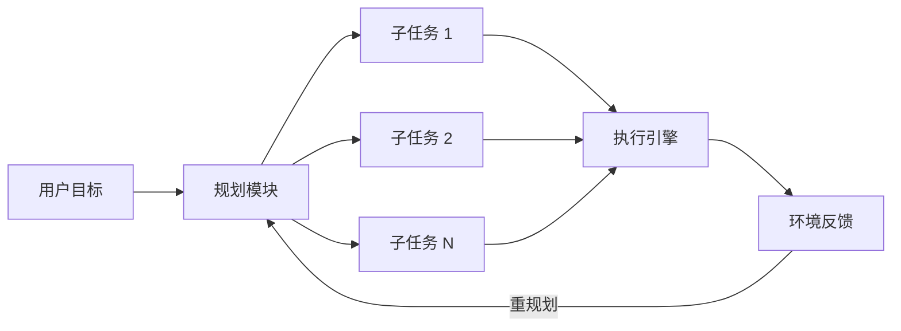
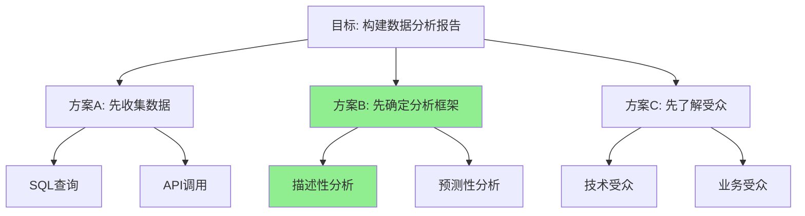
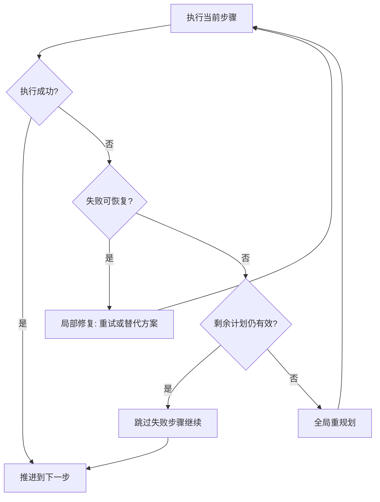
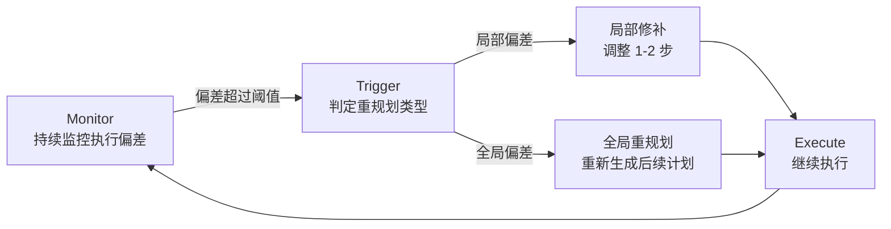
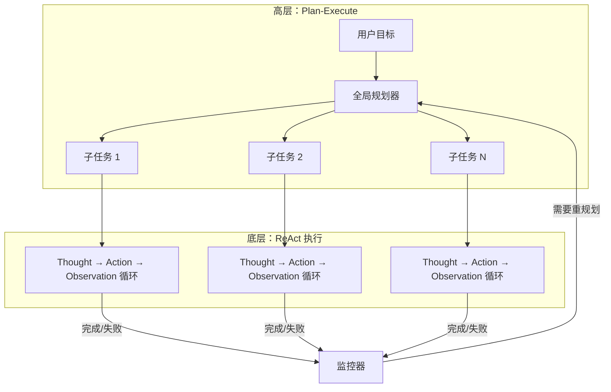

## 概述

规划（Planning）是 Agent 将高层目标转化为可执行动作序列的核心能力。人类在面对复杂任务时，会自然地将其拆解为子步骤——Agent 的规划模块正是模拟这一认知过程。

一个优秀的规划模块需要回答三个关键问题：**做什么**（目标分解）、**怎么做**（策略选择）、**做到哪了**（进度追踪与调整）。本章将从理论框架到工程实现，全面剖析 Agent 规划系统的设计要点。

## 规划在 Agent 中的角色

在经典的 Agent 架构中，规划模块位于感知（Perception）和执行（Execution）之间，承担着"大脑前额叶"的功能：



规划模块的输入是用户的高层意图（如"帮我写一篇技术博客并发布"），输出是结构化的行动计划（如"1. 确定主题 2. 收集资料 3. 撰写草稿 4. 审校修改 5. 发布上线"）。

## Plan-and-Execute 模式

Plan-and-Execute 是当前 Agent 系统中最主流的规划范式 [Wang et al., 2023]。其核心思想是先规划再执行，将"思考"与"行动"分离为两个阶段。

### 基本流程

1. **规划阶段**：LLM 接收用户目标，生成完整的执行计划
2. **执行阶段**：逐步执行计划中的每个子任务
3. **监控阶段**：检查执行结果，必要时触发重规划

与 ReAct 模式（参见 [../05-fundamentals/agentic-patterns.md](../05-fundamentals/agentic-patterns.md)）中每步都交替推理-行动不同，Plan-and-Execute 在开始时就形成全局视图，这使得它更适合需要多步协调的复杂任务。

### 优劣对比

| 特性 | Plan-and-Execute | ReAct |
|------|-----------------|-------|
| 全局视野 | 强：预先规划全局 | 弱：逐步决策 |
| 灵活性 | 中：需要重规划机制 | 强：每步都可调整 |
| Token 效率 | 高：规划一次执行多次 | 低：每步重复上下文 |
| 适用场景 | 多步协调任务 | 探索性任务 |

## 规划策略

### 自顶向下分解（Top-Down Decomposition）

最直觉的规划方法是层次化分解：先将大目标拆为子目标，再将子目标拆为具体动作。

```python
def top_down_plan(goal: str, llm, max_depth: int = 3):
    """自顶向下任务分解"""
    prompt = f"""
    将以下目标分解为 3-7 个有序子任务：
    目标：{goal}
    
    要求：
    - 每个子任务应是可独立执行的
    - 子任务之间有明确的依赖顺序
    - 粒度适中，不要过于笼统也不要过于细碎
    
    输出格式：JSON 列表
    """
    
    subtasks = llm.generate(prompt, format="json")
    
    plan = Plan(goal=goal)
    for task in subtasks:
        if task.complexity > THRESHOLD and max_depth > 0:
            # 递归分解复杂子任务
            sub_plan = top_down_plan(task.description, llm, max_depth - 1)
            plan.add_subtask(sub_plan)
        else:
            plan.add_subtask(task)
    
    return plan
```

### 迭代细化（Iterative Refinement）

与一次性生成完整计划不同，迭代细化策略先产出粗略计划，再逐步精炼：

1. **草案生成**：生成高层计划骨架
2. **可行性评估**：检查每步是否可执行
3. **细化补充**：对模糊步骤进行详细展开
4. **依赖分析**：识别步骤间的前置条件

这种方式的优势在于避免了"规划幻觉"——即 LLM 一次性生成看似合理但实际不可行的计划。

## Tree of Thoughts（思维树）

Tree of Thoughts (ToT) [Yao et al., 2023] 将规划过程建模为树搜索问题。每个节点代表一个"思维状态"（当前的部分计划），每条边代表一个规划决策。



### 核心机制

ToT 包含三个关键组件：

- **思维生成器**（Thought Generator）：在每个节点产生多个候选下一步
- **状态评估器**（State Evaluator）：对每个部分计划评分（用 LLM 自评或启发式函数）
- **搜索算法**：BFS（广度优先）或 DFS（深度优先）遍历思维树

```python
def tree_of_thoughts(goal: str, llm, breadth: int = 3, depth: int = 4):
    """Tree of Thoughts 规划搜索"""
    root = ThoughtNode(state=goal, plan=[])
    queue = [root]  # BFS
    best_plan = None
    best_score = -float('inf')
    
    for level in range(depth):
        next_queue = []
        for node in queue:
            # 生成候选下一步
            candidates = llm.generate_thoughts(
                goal=goal,
                current_plan=node.plan,
                n=breadth
            )
            
            for thought in candidates:
                new_node = ThoughtNode(
                    state=thought,
                    plan=node.plan + [thought]
                )
                # 评估当前规划状态
                score = llm.evaluate_plan(
                    goal=goal,
                    partial_plan=new_node.plan,
                    criteria=["feasibility", "completeness", "efficiency"]
                )
                new_node.score = score
                
                if is_complete(new_node.plan, goal):
                    if score > best_score:
                        best_score = score
                        best_plan = new_node.plan
                else:
                    next_queue.append(new_node)
        
        # 剪枝：只保留得分最高的节点
        queue = sorted(next_queue, key=lambda n: n.score, reverse=True)[:breadth]
    
    return best_plan
```

## LATS：语言 Agent 树搜索

LATS（Language Agent Tree Search）[Zhou et al., 2023] 将蒙特卡洛树搜索（MCTS）引入 Agent 规划，结合了 ToT 的搜索能力和环境反馈的学习能力。

LATS 的创新之处在于：

- **模拟执行**：在搜索过程中模拟执行动作，获得环境反馈
- **价值回传**：将执行结果回传更新祖先节点的价值估计
- **经验复用**：失败的执行路径为后续搜索提供负面指引

这使得 LATS 特别适合需要与环境交互的规划任务（如代码调试、Web 导航），在 HumanEval 和 WebShop 等基准测试中显著优于 ReAct 和 ToT。

## 动态重规划

现实中，计划很少能一成不变地执行到底。动态重规划（Dynamic Replanning）是使 Agent 具备韧性的关键机制。

### 触发重规划的条件

- **执行失败**：某步工具调用返回错误
- **环境变化**：外部状态与预期不符
- **新信息获取**：执行中发现了规划时未知的约束
- **资源不足**：Token 预算或时间不够完成原计划

### 重规划策略



实践中，重规划应遵循"最小修改原则"——尽可能保留已完成的进度，只调整受影响的后续步骤。

## 规划模块的局限性

### 规划幻觉

LLM 可能生成语法正确但事实上不可行的计划。例如调用不存在的 API，或假设不存在的前置条件。缓解方法包括：约束生成（只从已知工具列表中选择）和可行性验证步骤。

### 过度分解

将简单任务过度拆分为过多子步骤，导致执行效率低下和 Token 浪费。解决思路是引入"粒度控制"：对简单任务限制分解深度。

### 难度估计失准

LLM 难以准确评估子任务的实际执行难度和耗时，这使得它无法做出合理的资源分配和优先级决策。

### 长期规划能力不足

当前 LLM 在超过 10-15 步的长期规划上表现急剧下降，这是 Transformer 架构在长程依赖建模上的固有限制。

## 工程实践建议

1. **规划与执行分离**：使用不同的 Prompt（甚至不同的模型）分别处理规划和执行
2. **计划可序列化**：将计划以结构化格式（JSON/YAML）存储，便于断点续传
3. **设置护栏**：限制最大分解深度、最大步骤数和单步最大 Token 预算
4. **人类介入点**：在关键决策节点设置人工确认（Human-in-the-loop）
5. **执行日志**：详细记录每步执行结果，为重规划提供上下文

## 动态重规划的实现模式

前文讨论了重规划的触发条件和策略选择，本节深入探讨 Plan-Execute-Replan 混合架构的具体工程实现。一个成熟的重规划系统需要解决三个核心问题：何时触发、修改多少、如何保护已有成果。

### Monitor-Trigger-Replan 三阶段

动态重规划的运行时行为可以抽象为三个阶段的循环：



Monitor 阶段持续比较预期进度与实际进度的差异；当偏差累积超过预设阈值时，Trigger 阶段判定偏差的影响范围——是局部可修补还是需要全局重规划；最后 Replan 阶段以最小代价生成修正后的计划。

### 实现：DynamicReplanner

```python
from dataclasses import dataclass, field
from enum import Enum
from typing import Optional


class StepStatus(Enum):
    PENDING = "pending"
    IN_PROGRESS = "in_progress"
    COMPLETED = "completed"
    FAILED = "failed"
    SKIPPED = "skipped"


class ReplanScope(Enum):
    LOCAL = "local"      # 仅修改当前步骤的重试策略
    PARTIAL = "partial"  # 修改后续 1-3 步
    GLOBAL = "global"    # 重新生成所有未完成步骤


@dataclass
class PlanStep:
    id: str
    description: str
    status: StepStatus = StepStatus.PENDING
    result: Optional[str] = None
    attempts: int = 0
    max_attempts: int = 3


@dataclass
class DeviationSignal:
    step_id: str
    expected_outcome: str
    actual_outcome: str
    severity: float  # 0.0 ~ 1.0


class DynamicReplanner:
    """Plan-Execute-Replan 混合架构的核心调度器"""

    def __init__(self, llm, tools, config=None):
        self.llm = llm
        self.tools = tools
        self.deviation_threshold_local = 0.3
        self.deviation_threshold_global = 0.7
        self.plan: list[PlanStep] = []
        self.completed_results: dict[str, str] = {}  # 已完成步骤的成果缓存

    def execute_with_replan(self, goal: str, initial_plan: list[PlanStep]):
        """主循环：执行计划并在必要时触发重规划"""
        self.plan = initial_plan

        while (current_step := self._next_pending_step()) is not None:
            current_step.status = StepStatus.IN_PROGRESS
            current_step.attempts += 1

            # Execute
            result = self._execute_step(current_step)

            if result.success:
                current_step.status = StepStatus.COMPLETED
                current_step.result = result.output
                self.completed_results[current_step.id] = result.output
            else:
                # Monitor: 检测偏差
                deviation = self._assess_deviation(current_step, result)
                # Trigger: 决定重规划范围
                scope = self._determine_replan_scope(deviation)
                # Replan: 执行重规划
                self._replan(goal, current_step, deviation, scope)

        return self._collect_final_output()

    def _assess_deviation(self, step: PlanStep, result) -> DeviationSignal:
        """评估执行偏差的严重程度"""
        assessment_prompt = f"""
        评估以下执行偏差的严重程度（0.0-1.0）：
        
        计划步骤：{step.description}
        预期结果：步骤正常完成
        实际结果：{result.error}
        
        已完成的前置步骤：{list(self.completed_results.keys())}
        剩余未执行步骤：{[s.id for s in self.plan if s.status == StepStatus.PENDING]}
        
        评估维度：
        - 该失败是否阻塞后续步骤？
        - 已完成的成果是否仍然有效？
        - 是否存在替代路径？
        
        返回 JSON: {{"severity": float, "blocks_downstream": bool, "alternative_exists": bool}}
        """
        assessment = self.llm.generate(assessment_prompt, format="json")
        return DeviationSignal(
            step_id=step.id,
            expected_outcome=step.description,
            actual_outcome=result.error,
            severity=assessment["severity"]
        )

    def _determine_replan_scope(self, deviation: DeviationSignal) -> ReplanScope:
        """根据偏差严重程度决定重规划范围"""
        if deviation.severity < self.deviation_threshold_local:
            return ReplanScope.LOCAL
        elif deviation.severity < self.deviation_threshold_global:
            return ReplanScope.PARTIAL
        else:
            return ReplanScope.GLOBAL

    def _replan(self, goal: str, failed_step: PlanStep,
                deviation: DeviationSignal, scope: ReplanScope):
        """执行重规划，保护已完成步骤的成果"""
        if scope == ReplanScope.LOCAL:
            # 局部：仅对当前步骤尝试替代方案
            if failed_step.attempts < failed_step.max_attempts:
                failed_step.status = StepStatus.PENDING  # 标记为待重试
            else:
                failed_step.status = StepStatus.FAILED
                self._insert_alternative_step(failed_step)

        elif scope == ReplanScope.PARTIAL:
            # 部分：重新生成紧邻的后续步骤
            affected_steps = self._find_dependent_steps(failed_step)
            new_steps = self._generate_replacement_steps(
                goal, failed_step, affected_steps
            )
            self._replace_steps(affected_steps, new_steps)

        elif scope == ReplanScope.GLOBAL:
            # 全局：保留已完成成果，重新规划所有未完成步骤
            preserved_context = self._build_preserved_context()
            new_plan = self._generate_new_plan(goal, preserved_context)
            self._replace_all_pending(new_plan)

    def _build_preserved_context(self) -> str:
        """构建已完成步骤的上下文摘要，供重规划参考"""
        context_parts = []
        for step in self.plan:
            if step.status == StepStatus.COMPLETED:
                context_parts.append(
                    f"[已完成] {step.description} → 结果: {step.result}"
                )
        return "\n".join(context_parts)

    def _generate_new_plan(self, goal: str, preserved_context: str) -> list[PlanStep]:
        """基于已有成果生成新的后续计划"""
        prompt = f"""
        原始目标：{goal}
        
        以下步骤已经完成，其成果必须被保留和利用：
        {preserved_context}
        
        请基于已有成果，生成完成剩余目标所需的新步骤。
        要求：
        - 不要重复已完成的工作
        - 充分利用已有成果作为输入
        - 规避之前失败的路径
        
        输出格式：JSON 列表 [{{"id": str, "description": str}}]
        """
        raw_steps = self.llm.generate(prompt, format="json")
        return [PlanStep(id=s["id"], description=s["description"]) for s in raw_steps]

    def _find_dependent_steps(self, failed_step: PlanStep) -> list[PlanStep]:
        """找出依赖于失败步骤的后续步骤"""
        pending = [s for s in self.plan if s.status == StepStatus.PENDING]
        # 取紧邻的 1-3 个待执行步骤作为受影响范围
        return pending[:3]

    def _generate_replacement_steps(self, goal: str, failed_step: PlanStep,
                                     affected: list[PlanStep]) -> list[PlanStep]:
        """为受影响的步骤生成替代方案"""
        prompt = f"""
        目标：{goal}
        失败步骤：{failed_step.description}
        需要替换的步骤：{[s.description for s in affected]}
        已有成果：{self._build_preserved_context()}
        可用工具：{[t.name for t in self.tools]}
        
        请生成替代步骤来绕过失败点，完成相同的子目标。
        """
        raw_steps = self.llm.generate(prompt, format="json")
        return [PlanStep(id=s["id"], description=s["description"]) for s in raw_steps]

    def _replace_steps(self, old_steps: list[PlanStep], new_steps: list[PlanStep]):
        """在计划中替换受影响的步骤"""
        old_ids = {s.id for s in old_steps}
        insert_idx = None
        self.plan = [s for i, s in enumerate(self.plan)
                     if s.id not in old_ids or (insert_idx := i) and False]
        if insert_idx is not None:
            for j, new_step in enumerate(new_steps):
                self.plan.insert(insert_idx + j, new_step)

    def _replace_all_pending(self, new_plan: list[PlanStep]):
        """替换所有未完成步骤"""
        self.plan = [s for s in self.plan if s.status == StepStatus.COMPLETED] + new_plan

    def _insert_alternative_step(self, failed_step: PlanStep):
        """为彻底失败的步骤插入一个替代方案步骤"""
        alt_step = PlanStep(
            id=f"{failed_step.id}_alt",
            description=f"[替代方案] 绕过 '{failed_step.description}' 的失败"
        )
        idx = self.plan.index(failed_step)
        self.plan.insert(idx + 1, alt_step)

    def _next_pending_step(self) -> Optional[PlanStep]:
        """获取下一个待执行步骤"""
        for step in self.plan:
            if step.status == StepStatus.PENDING:
                return step
        return None

    def _execute_step(self, step: PlanStep):
        """执行单个步骤（委托给执行引擎）"""
        # 实际实现中会调用工具链
        return self.tools.execute(step.description, context=self.completed_results)

    def _collect_final_output(self):
        """汇总所有已完成步骤的成果"""
        return {
            "completed": [s for s in self.plan if s.status == StepStatus.COMPLETED],
            "failed": [s for s in self.plan if s.status == StepStatus.FAILED],
            "results": self.completed_results
        }
```

## 计划有效性验证

在执行前验证计划的可行性，可以大幅减少运行时失败和不必要的重规划。验证器在计划生成后、执行前介入，充当"预飞检查"的角色。

### 验证维度

一个完整的计划验证需要覆盖以下维度：

- **工具可用性**：计划中引用的每个工具是否已注册且可调用
- **依赖一致性**：步骤间的输入输出是否匹配，是否存在循环依赖
- **资源约束**：总 Token 预算、时间限制、并发限制是否满足
- **前置条件**：每个步骤的执行前提是否能被前序步骤满足

### 实现：PlanValidator

```python
from dataclasses import dataclass


@dataclass
class ValidationIssue:
    step_id: str
    category: str  # "tool", "dependency", "resource", "precondition"
    severity: str  # "error", "warning"
    message: str


@dataclass
class ValidationResult:
    is_valid: bool
    issues: list[ValidationIssue]

    @property
    def errors(self):
        return [i for i in self.issues if i.severity == "error"]

    @property
    def warnings(self):
        return [i for i in self.issues if i.severity == "warning"]


class PlanValidator:
    """计划有效性验证器：在执行前检测潜在问题"""

    def __init__(self, tool_registry, resource_limits: dict):
        self.tool_registry = tool_registry  # 已注册工具的名称和签名
        self.resource_limits = resource_limits  # {"max_tokens": int, "max_time_sec": int}

    def validate(self, plan: list[PlanStep]) -> ValidationResult:
        """对计划执行全维度验证"""
        issues = []
        issues.extend(self._check_tool_availability(plan))
        issues.extend(self._check_dependency_consistency(plan))
        issues.extend(self._check_resource_constraints(plan))
        issues.extend(self._check_preconditions(plan))

        is_valid = not any(i.severity == "error" for i in issues)
        return ValidationResult(is_valid=is_valid, issues=issues)

    def _check_tool_availability(self, plan: list[PlanStep]) -> list[ValidationIssue]:
        """检查计划中引用的工具是否全部可用"""
        issues = []
        available_tools = set(self.tool_registry.list_tools())

        for step in plan:
            required_tools = self._extract_tool_references(step)
            for tool_name in required_tools:
                if tool_name not in available_tools:
                    issues.append(ValidationIssue(
                        step_id=step.id,
                        category="tool",
                        severity="error",
                        message=f"工具 '{tool_name}' 未注册，无法执行该步骤"
                    ))
        return issues

    def _check_dependency_consistency(self, plan: list[PlanStep]) -> list[ValidationIssue]:
        """检查步骤间的依赖关系是否一致（无循环、无悬空引用）"""
        issues = []
        produced_outputs = set()  # 前序步骤能产出的数据

        for step in plan:
            required_inputs = self._extract_required_inputs(step)
            for inp in required_inputs:
                if inp not in produced_outputs:
                    issues.append(ValidationIssue(
                        step_id=step.id,
                        category="dependency",
                        severity="error",
                        message=f"步骤依赖输入 '{inp}'，但前序步骤未产出该数据"
                    ))
            # 将当前步骤的产出加入集合
            produced_outputs.update(self._extract_produced_outputs(step))

        return issues

    def _check_resource_constraints(self, plan: list[PlanStep]) -> list[ValidationIssue]:
        """检查计划的总资源消耗是否在限制范围内"""
        issues = []
        estimated_tokens = sum(self._estimate_step_tokens(s) for s in plan)
        max_tokens = self.resource_limits.get("max_tokens", float("inf"))

        if estimated_tokens > max_tokens:
            issues.append(ValidationIssue(
                step_id="global",
                category="resource",
                severity="warning",
                message=(
                    f"预估总 Token 消耗 ({estimated_tokens}) "
                    f"超过预算 ({max_tokens})，建议精简计划"
                )
            ))

        if len(plan) > 15:
            issues.append(ValidationIssue(
                step_id="global",
                category="resource",
                severity="warning",
                message=f"计划包含 {len(plan)} 步，超过推荐上限 (15)，长程规划准确性可能下降"
            ))

        return issues

    def _check_preconditions(self, plan: list[PlanStep]) -> list[ValidationIssue]:
        """检查每个步骤的前置条件是否可被满足"""
        issues = []
        for i, step in enumerate(plan):
            preconditions = self._extract_preconditions(step)
            for cond in preconditions:
                satisfiable = self._can_satisfy(cond, plan[:i])
                if not satisfiable:
                    issues.append(ValidationIssue(
                        step_id=step.id,
                        category="precondition",
                        severity="error",
                        message=f"前置条件 '{cond}' 无法被前序步骤满足"
                    ))
        return issues

    def _extract_tool_references(self, step: PlanStep) -> list[str]:
        """从步骤描述中提取工具引用（实际实现中可用 LLM 辅助解析）"""
        # 简化实现：基于关键词匹配已知工具名
        tools = []
        for tool_name in self.tool_registry.list_tools():
            if tool_name.lower() in step.description.lower():
                tools.append(tool_name)
        return tools

    def _extract_required_inputs(self, step: PlanStep) -> list[str]:
        """提取步骤所需的输入数据标识"""
        # 实际实现中通过 LLM 解析步骤描述中的输入依赖
        return getattr(step, "required_inputs", [])

    def _extract_produced_outputs(self, step: PlanStep) -> list[str]:
        """提取步骤能产出的数据标识"""
        return getattr(step, "produced_outputs", [])

    def _estimate_step_tokens(self, step: PlanStep) -> int:
        """估算单步的 Token 消耗"""
        base_cost = 500  # 基础 Prompt 开销
        description_cost = len(step.description) // 4  # 粗略估算
        return base_cost + description_cost

    def _can_satisfy(self, condition: str, preceding_steps: list[PlanStep]) -> bool:
        """判断前序步骤是否能满足给定前置条件"""
        for step in preceding_steps:
            if condition.lower() in step.description.lower():
                return True
        return False
```

## ReAct + Plan-Execute 混合模式

在实际 Agent 系统中，纯 Plan-Execute 和纯 ReAct 各有局限。一种被广泛采用的工程实践是将两者结合：高层使用 Plan-Execute 维持全局方向感，每个子任务内部使用 ReAct 保持执行灵活性。

### 分层架构



这种分层设计的优势在于：全局规划器不需要关心每个子任务内部的执行细节（如重试、工具选择），而 ReAct 执行器也不需要承担跨任务协调的责任。

### 升级判断：何时从 ReAct 切换到重规划

ReAct 循环内的失败并不总是需要触发全局重规划。关键在于判断失败的"传播范围"：

```python
class HybridExecutor:
    """ReAct + Plan-Execute 混合执行器"""

    def __init__(self, planner, react_engine, llm):
        self.planner = planner
        self.react_engine = react_engine
        self.llm = llm
        self.max_react_iterations = 10
        self.escalation_conditions = {
            "max_retries_exceeded": 3,
            "output_schema_mismatch": True,
            "critical_tool_unavailable": True,
        }

    def execute_plan(self, goal: str, plan: list[PlanStep]):
        """逐个子任务执行，内部使用 ReAct"""
        for step in plan:
            result = self._execute_with_react(step)

            if result.success:
                step.status = StepStatus.COMPLETED
                step.result = result.output
            else:
                # 判断是否需要升级到全局重规划
                if self._should_escalate(step, result):
                    return self._escalate_to_replan(goal, plan, step, result)
                else:
                    # ReAct 内部已处理，标记跳过并继续
                    step.status = StepStatus.SKIPPED

        return self._collect_results(plan)

    def _execute_with_react(self, step: PlanStep):
        """用 ReAct 循环执行单个子任务"""
        context = f"你的任务是：{step.description}"
        
        for iteration in range(self.max_react_iterations):
            # Thought: 推理下一步行动
            thought = self.react_engine.think(context)
            
            # Action: 选择并执行工具
            action = self.react_engine.select_action(thought)
            observation = self.react_engine.execute_action(action)
            
            # 更新上下文
            context += f"\nThought: {thought}\nAction: {action}\nObservation: {observation}"
            
            # 判断是否完成
            if self.react_engine.is_task_complete(context, step.description):
                return ExecutionResult(success=True, output=observation)
            
            # 判断是否陷入死循环
            if self._detect_loop(context):
                return ExecutionResult(
                    success=False,
                    error="ReAct 循环检测到重复模式，无法继续推进"
                )

        return ExecutionResult(success=False, error="达到最大迭代次数")

    def _should_escalate(self, step: PlanStep, result) -> bool:
        """判断是否需要从 ReAct 级别升级到全局重规划
        
        升级条件：
        1. 失败影响后续步骤的输入（依赖链断裂）
        2. 发现了规划时未知的约束（新信息改变了问题空间）
        3. ReAct 内部多次重试仍然失败（非暂时性错误）
        """
        escalation_prompt = f"""
        子任务执行失败，请判断是否需要触发全局重规划。
        
        失败的子任务：{step.description}
        失败原因：{result.error}
        重试次数：{step.attempts}
        
        判断标准（满足任一即升级）：
        1. 该失败是否导致后续步骤无法获得必要输入？
        2. 失败原因是否揭示了规划阶段未考虑的新约束？
        3. 该错误是否为非暂时性的（非网络超时、非并发冲突）？
        
        返回 JSON: {{"should_escalate": bool, "reason": str}}
        """
        judgment = self.llm.generate(escalation_prompt, format="json")
        return judgment["should_escalate"]

    def _escalate_to_replan(self, goal, plan, failed_step, result):
        """升级到全局重规划"""
        completed_context = "\n".join(
            f"- {s.description}: {s.result}"
            for s in plan if s.status == StepStatus.COMPLETED
        )
        return self.planner.replan(
            goal=goal,
            completed_work=completed_context,
            failure_info=f"{failed_step.description} 失败: {result.error}"
        )

    def _detect_loop(self, context: str, window: int = 3) -> bool:
        """检测 ReAct 循环中的重复模式"""
        lines = context.strip().split("\n")
        if len(lines) < window * 2:
            return False
        recent = lines[-window:]
        previous = lines[-(window * 2):-window]
        # 如果最近的动作序列与之前完全相同，判定为循环
        return recent == previous
```

### 模式选择指南

选择纯 ReAct、纯 Plan-Execute 还是混合模式，取决于任务特征：

| 任务特征 | 推荐模式 | 原因 |
|---------|---------|------|
| 步骤少（≤3）、探索性强 | 纯 ReAct | 规划开销不值得 |
| 步骤多（>5）、依赖关系明确 | 纯 Plan-Execute | 需要全局协调 |
| 步骤多且执行不确定性高 | 混合模式 | 兼顾全局视野和局部灵活性 |
| 需要与环境大量交互 | 混合模式 | ReAct 擅长处理动态反馈 |

混合模式的额外成本在于需要维护两层状态（全局计划状态 + 每个子任务的 ReAct 上下文），以及升级判断逻辑本身的 Token 消耗。对于简单任务，这些开销可能得不偿失。

## 本章小结

规划模块是 Agent 从"被动应答"走向"主动执行"的关键能力。从基础的 Plan-and-Execute 到 Tree of Thoughts 和 LATS 等搜索式规划，再到动态重规划的韧性机制，规划技术正在快速演进。然而，当前规划模块仍面临幻觉、过度分解和长程规划能力不足等挑战，这些既是工程优化的方向，也是学术研究的前沿。

关于规划模块与编排器（Orchestrator）的关系，可进一步参考 [../05-fundamentals/agentic-patterns.md](../05-fundamentals/agentic-patterns.md) 中对 Orchestrator-Worker 模式的详细讨论。

## 延伸阅读

- [Wang et al., 2023] "Plan-and-Solve Prompting: Improving Zero-Shot Chain-of-Thought Reasoning by Large Language Models"
- [Yao et al., 2023] "Tree of Thoughts: Deliberate Problem Solving with Large Language Models"
- [Zhou et al., 2023] "Language Agent Tree Search Unifies Reasoning Acting and Planning in Language Models"
- [Huang et al., 2024] "Understanding the planning of LLM agents: A survey"
- LangGraph Plan-and-Execute 实现：https://langchain-ai.github.io/langgraph/
