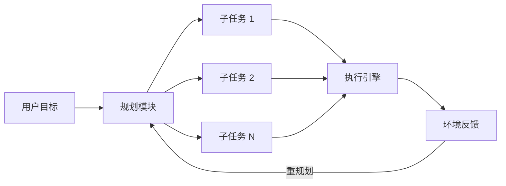
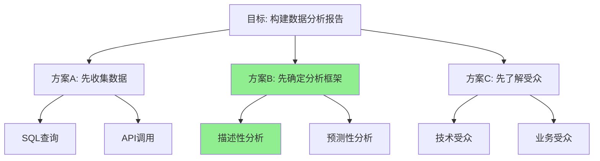
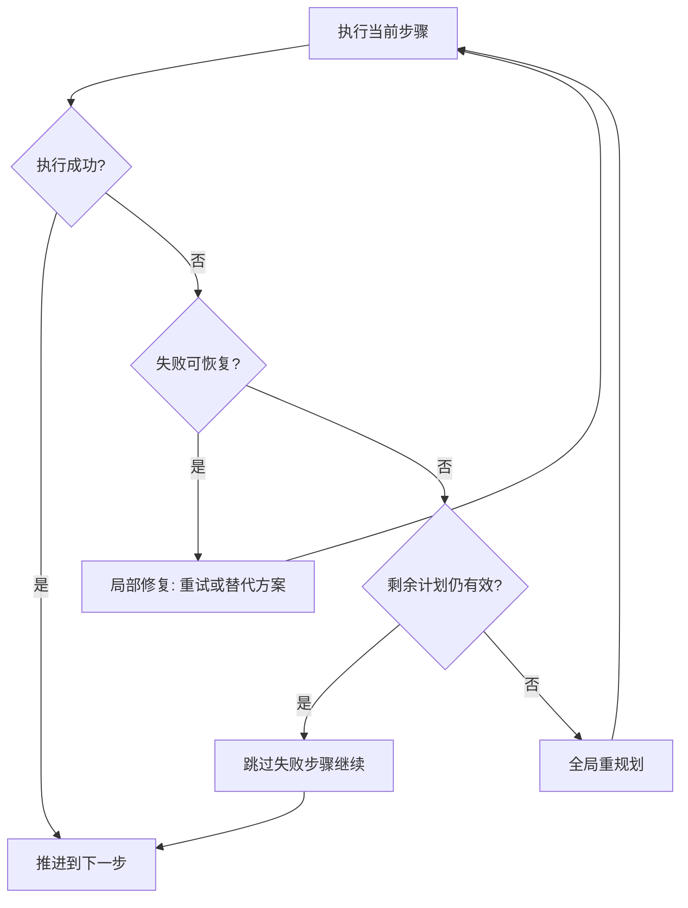

## 概述

规划（Planning）是 Agent 将高层目标转化为可执行动作序列的核心能力。人类在面对复杂任务时，会自然地将其拆解为子步骤——Agent 的规划模块正是模拟这一认知过程。

一个优秀的规划模块需要回答三个关键问题：**做什么**（目标分解）、**怎么做**（策略选择）、**做到哪了**（进度追踪与调整）。本章将从理论框架到工程实现，全面剖析 Agent 规划系统的设计要点。

## 规划在 Agent 中的角色

在经典的 Agent 架构中，规划模块位于感知（Perception）和执行（Execution）之间，承担着"大脑前额叶"的功能：



规划模块的输入是用户的高层意图（如"帮我写一篇技术博客并发布"），输出是结构化的行动计划（如"1. 确定主题 2. 收集资料 3. 撰写草稿 4. 审校修改 5. 发布上线"）。

## Plan-and-Execute 模式

Plan-and-Execute 是当前 Agent 系统中最主流的规划范式 [Wang et al., 2023]。其核心思想是先规划再执行，将"思考"与"行动"分离为两个阶段。

### 基本流程

1. **规划阶段**：LLM 接收用户目标，生成完整的执行计划
2. **执行阶段**：逐步执行计划中的每个子任务
3. **监控阶段**：检查执行结果，必要时触发重规划

与 ReAct 模式（参见 [../05-fundamentals/agentic-patterns.md](../05-fundamentals/agentic-patterns.md)）中每步都交替推理-行动不同，Plan-and-Execute 在开始时就形成全局视图，这使得它更适合需要多步协调的复杂任务。

### 优劣对比

| 特性 | Plan-and-Execute | ReAct |
|------|-----------------|-------|
| 全局视野 | 强：预先规划全局 | 弱：逐步决策 |
| 灵活性 | 中：需要重规划机制 | 强：每步都可调整 |
| Token 效率 | 高：规划一次执行多次 | 低：每步重复上下文 |
| 适用场景 | 多步协调任务 | 探索性任务 |

## 规划策略

### 自顶向下分解（Top-Down Decomposition）

最直觉的规划方法是层次化分解：先将大目标拆为子目标，再将子目标拆为具体动作。

```python
def top_down_plan(goal: str, llm, max_depth: int = 3):
    """自顶向下任务分解"""
    prompt = f"""
    将以下目标分解为 3-7 个有序子任务：
    目标：{goal}
    
    要求：
    - 每个子任务应是可独立执行的
    - 子任务之间有明确的依赖顺序
    - 粒度适中，不要过于笼统也不要过于细碎
    
    输出格式：JSON 列表
    """
    
    subtasks = llm.generate(prompt, format="json")
    
    plan = Plan(goal=goal)
    for task in subtasks:
        if task.complexity > THRESHOLD and max_depth > 0:
            # 递归分解复杂子任务
            sub_plan = top_down_plan(task.description, llm, max_depth - 1)
            plan.add_subtask(sub_plan)
        else:
            plan.add_subtask(task)
    
    return plan
```

### 迭代细化（Iterative Refinement）

与一次性生成完整计划不同，迭代细化策略先产出粗略计划，再逐步精炼：

1. **草案生成**：生成高层计划骨架
2. **可行性评估**：检查每步是否可执行
3. **细化补充**：对模糊步骤进行详细展开
4. **依赖分析**：识别步骤间的前置条件

这种方式的优势在于避免了"规划幻觉"——即 LLM 一次性生成看似合理但实际不可行的计划。

## Tree of Thoughts（思维树）

Tree of Thoughts (ToT) [Yao et al., 2023] 将规划过程建模为树搜索问题。每个节点代表一个"思维状态"（当前的部分计划），每条边代表一个规划决策。



### 核心机制

ToT 包含三个关键组件：

- **思维生成器**（Thought Generator）：在每个节点产生多个候选下一步
- **状态评估器**（State Evaluator）：对每个部分计划评分（用 LLM 自评或启发式函数）
- **搜索算法**：BFS（广度优先）或 DFS（深度优先）遍历思维树

```python
def tree_of_thoughts(goal: str, llm, breadth: int = 3, depth: int = 4):
    """Tree of Thoughts 规划搜索"""
    root = ThoughtNode(state=goal, plan=[])
    queue = [root]  # BFS
    best_plan = None
    best_score = -float('inf')
    
    for level in range(depth):
        next_queue = []
        for node in queue:
            # 生成候选下一步
            candidates = llm.generate_thoughts(
                goal=goal,
                current_plan=node.plan,
                n=breadth
            )
            
            for thought in candidates:
                new_node = ThoughtNode(
                    state=thought,
                    plan=node.plan + [thought]
                )
                # 评估当前规划状态
                score = llm.evaluate_plan(
                    goal=goal,
                    partial_plan=new_node.plan,
                    criteria=["feasibility", "completeness", "efficiency"]
                )
                new_node.score = score
                
                if is_complete(new_node.plan, goal):
                    if score > best_score:
                        best_score = score
                        best_plan = new_node.plan
                else:
                    next_queue.append(new_node)
        
        # 剪枝：只保留得分最高的节点
        queue = sorted(next_queue, key=lambda n: n.score, reverse=True)[:breadth]
    
    return best_plan
```

## LATS：语言 Agent 树搜索

LATS（Language Agent Tree Search）[Zhou et al., 2023] 将蒙特卡洛树搜索（MCTS）引入 Agent 规划，结合了 ToT 的搜索能力和环境反馈的学习能力。

LATS 的创新之处在于：

- **模拟执行**：在搜索过程中模拟执行动作，获得环境反馈
- **价值回传**：将执行结果回传更新祖先节点的价值估计
- **经验复用**：失败的执行路径为后续搜索提供负面指引

这使得 LATS 特别适合需要与环境交互的规划任务（如代码调试、Web 导航），在 HumanEval 和 WebShop 等基准测试中显著优于 ReAct 和 ToT。

## 动态重规划

现实中，计划很少能一成不变地执行到底。动态重规划（Dynamic Replanning）是使 Agent 具备韧性的关键机制。

### 触发重规划的条件

- **执行失败**：某步工具调用返回错误
- **环境变化**：外部状态与预期不符
- **新信息获取**：执行中发现了规划时未知的约束
- **资源不足**：Token 预算或时间不够完成原计划

### 重规划策略



实践中，重规划应遵循"最小修改原则"——尽可能保留已完成的进度，只调整受影响的后续步骤。

## 规划模块的局限性

### 规划幻觉

LLM 可能生成语法正确但事实上不可行的计划。例如调用不存在的 API，或假设不存在的前置条件。缓解方法包括：约束生成（只从已知工具列表中选择）和可行性验证步骤。

### 过度分解

将简单任务过度拆分为过多子步骤，导致执行效率低下和 Token 浪费。解决思路是引入"粒度控制"：对简单任务限制分解深度。

### 难度估计失准

LLM 难以准确评估子任务的实际执行难度和耗时，这使得它无法做出合理的资源分配和优先级决策。

### 长期规划能力不足

当前 LLM 在超过 10-15 步的长期规划上表现急剧下降，这是 Transformer 架构在长程依赖建模上的固有限制。

## 工程实践建议

1. **规划与执行分离**：使用不同的 Prompt（甚至不同的模型）分别处理规划和执行
2. **计划可序列化**：将计划以结构化格式（JSON/YAML）存储，便于断点续传
3. **设置护栏**：限制最大分解深度、最大步骤数和单步最大 Token 预算
4. **人类介入点**：在关键决策节点设置人工确认（Human-in-the-loop）
5. **执行日志**：详细记录每步执行结果，为重规划提供上下文

## 本章小结

规划模块是 Agent 从"被动应答"走向"主动执行"的关键能力。从基础的 Plan-and-Execute 到 Tree of Thoughts 和 LATS 等搜索式规划，再到动态重规划的韧性机制，规划技术正在快速演进。然而，当前规划模块仍面临幻觉、过度分解和长程规划能力不足等挑战，这些既是工程优化的方向，也是学术研究的前沿。

关于规划模块与编排器（Orchestrator）的关系，可进一步参考 [../05-fundamentals/agentic-patterns.md](../05-fundamentals/agentic-patterns.md) 中对 Orchestrator-Worker 模式的详细讨论。

## 延伸阅读

- [Wang et al., 2023] "Plan-and-Solve Prompting: Improving Zero-Shot Chain-of-Thought Reasoning by Large Language Models"
- [Yao et al., 2023] "Tree of Thoughts: Deliberate Problem Solving with Large Language Models"
- [Zhou et al., 2023] "Language Agent Tree Search Unifies Reasoning Acting and Planning in Language Models"
- [Huang et al., 2024] "Understanding the planning of LLM agents: A survey"
- LangGraph Plan-and-Execute 实现：https://langchain-ai.github.io/langgraph/
