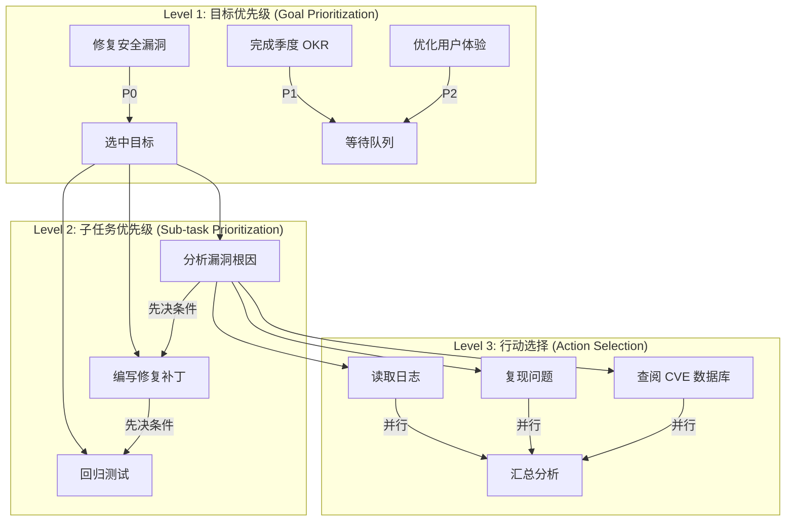
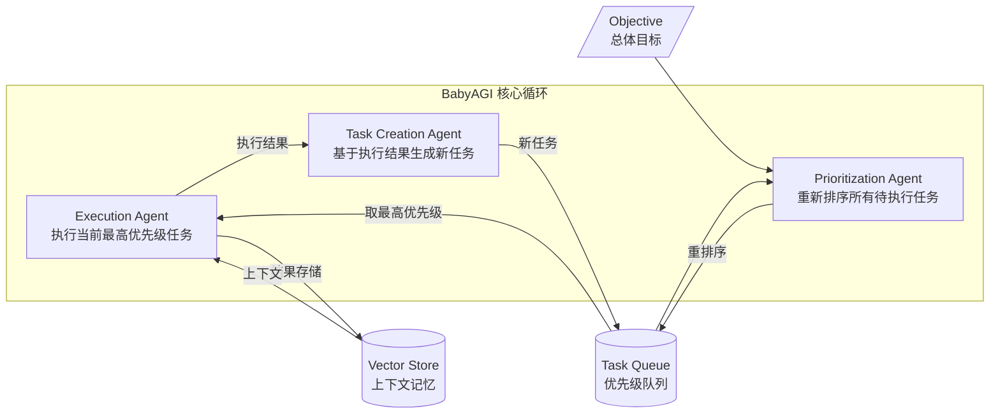

# 任务优先级与动态调度 (Prioritization)

## 概述

在真实场景中，Agent 往往同时面对多个待处理的任务、子目标或可选行动。如果不加区分地按顺序执行，Agent 会在低价值任务上浪费资源，而高紧急度的工作被延误。优先级排序（Prioritization）模式赋予 Agent 动态评估和排列工作项的能力——根据紧急度、影响范围、依赖关系和上下文信息，持续调整执行顺序。

这是生产级 Agent 从"能跑通"到"真正好用"的关键能力。BabyAGI 是最早引入此模式的系统之一（2023），将任务的创建、执行、优先级排序拆分为三个独立 Agent 协作完成。

## 优先级评估的多维模型

### 四维评估矩阵

Agent 进行优先级判断时，通常需要综合考虑以下维度：

```
┌─────────────────────────────────────────────────────┐
│           优先级评估维度 (Priority Dimensions)         │
├──────────┬──────────┬───────────┬──────────────────┤
│ Urgency  │  Impact  │Dependencies│   Context       │
│ 时间紧迫度│ 影响范围  │  前置依赖  │ 当前上下文状态   │
├──────────┼──────────┼───────────┼──────────────────┤
│ 截止时间  │ 受益用户数│ 阻塞关系   │ 可用资源        │
│ 衰减速率  │ 业务价值  │ 关键路径   │ Agent 当前负载  │
│ SLA 要求  │ 不可逆性  │ 并行度    │ 历史成功率      │
└──────────┴──────────┴───────────┴──────────────────┘
```

### 优先级分数计算

```python
from dataclasses import dataclass, field
from enum import IntEnum
from typing import Optional
import time
import heapq

class UrgencyLevel(IntEnum):
    CRITICAL = 4   # 必须立即处理，如安全事件
    HIGH = 3       # 有明确截止时间且临近
    MEDIUM = 2     # 重要但无紧迫时间压力
    LOW = 1        # 可延后处理

class ImpactLevel(IntEnum):
    CATASTROPHIC = 4  # 影响全部用户/系统不可用
    MAJOR = 3         # 影响核心流程
    MODERATE = 2      # 影响部分功能
    MINOR = 1         # 影响极小

@dataclass(order=True)
class PrioritizedTask:
    """支持动态优先级的任务数据结构"""
    priority_score: float = field(compare=True)
    task_id: str = field(compare=False)
    description: str = field(compare=False)
    urgency: UrgencyLevel = field(compare=False)
    impact: ImpactLevel = field(compare=False)
    dependencies: list[str] = field(default_factory=list, compare=False)
    created_at: float = field(default_factory=time.time, compare=False)
    deadline: Optional[float] = field(default=None, compare=False)
    
    def compute_priority(self, context: dict) -> float:
        """
        综合多维度计算优先级分数。
        分数越高，优先级越高（使用负值配合 min-heap）。
        """
        base_score = (self.urgency * 0.35 + self.impact * 0.30)
        
        # 时间衰减：越接近 deadline，优先级越高
        time_pressure = 0.0
        if self.deadline:
            remaining = self.deadline - time.time()
            if remaining <= 0:
                time_pressure = 2.0  # 已过期，最高紧迫度
            else:
                # 指数衰减：剩余时间越少，加权越大
                time_pressure = min(2.0, 1.0 / (remaining / 3600))
        
        # 依赖解除奖励：如果前置依赖已全部完成，提升优先级
        dep_bonus = 0.5 if not self.dependencies else 0.0
        
        # 上下文匹配：当前 Agent 擅长此类任务时加分
        context_bonus = context.get(f"affinity_{self.task_id}", 0.0)
        
        self.priority_score = -(base_score + time_pressure + dep_bonus + context_bonus)
        return self.priority_score
```

## 三层优先级架构

优先级排序可以在不同粒度上发生：



## 动态优先级队列实现

### 基础实现：支持抢占的优先级调度器

```python
import asyncio
import heapq
from typing import Callable, Any
from dataclasses import dataclass, field
import logging

logger = logging.getLogger(__name__)

@dataclass
class TaskResult:
    task_id: str
    success: bool
    output: Any = None
    error: Optional[str] = None

class DynamicPriorityScheduler:
    """
    动态优先级调度器。
    
    特性：
    - 支持运行时优先级重计算
    - 支持抢占式调度（高优先级任务可中断低优先级）
    - 支持依赖图感知
    - 支持并发度控制
    """
    
    def __init__(self, max_concurrency: int = 3, preemptive: bool = False):
        self._queue: list[PrioritizedTask] = []
        self._running: dict[str, asyncio.Task] = {}
        self._completed: set[str] = set()
        self._results: dict[str, TaskResult] = {}
        self._max_concurrency = max_concurrency
        self._preemptive = preemptive
        self._context: dict = {}
        self._lock = asyncio.Lock()
    
    async def submit(self, task: PrioritizedTask) -> None:
        """提交新任务，自动计算优先级并插入队列"""
        task.compute_priority(self._context)
        async with self._lock:
            heapq.heappush(self._queue, task)
        logger.info(f"Task submitted: {task.task_id} (score={-task.priority_score:.2f})")
        await self._maybe_schedule()
    
    async def reprioritize(self) -> None:
        """
        全局重计算优先级。
        适用于上下文发生重大变化时（如新的紧急事件到来）。
        """
        async with self._lock:
            for task in self._queue:
                task.compute_priority(self._context)
            heapq.heapify(self._queue)
        
        # 抢占式模式：检查是否需要中断当前低优先级任务
        if self._preemptive and self._queue:
            await self._check_preemption()
    
    async def _check_preemption(self) -> None:
        """检查队列头部是否优先级高于正在运行的最低优先级任务"""
        if not self._queue or not self._running:
            return
        
        top_waiting = self._queue[0]
        # 找到正在运行的最低优先级任务
        lowest_running = max(
            self._running.items(),
            key=lambda x: x[1].get_name()  # 简化：实际应比较优先级
        )
        # 如果等待的任务优先级显著高于运行中最低的，则抢占
        # 实际实现中需要更精细的阈值控制
    
    async def _maybe_schedule(self) -> None:
        """尝试从队列中取出任务执行"""
        async with self._lock:
            while (
                self._queue 
                and len(self._running) < self._max_concurrency
            ):
                task = heapq.heappop(self._queue)
                
                # 检查依赖是否满足
                unmet = [d for d in task.dependencies if d not in self._completed]
                if unmet:
                    # 依赖未满足，放回队列（降低优先级避免忙等）
                    task.priority_score -= 0.01
                    heapq.heappush(self._queue, task)
                    continue
                
                # 启动执行
                self._running[task.task_id] = asyncio.create_task(
                    self._execute(task)
                )
    
    async def _execute(self, task: PrioritizedTask) -> None:
        """执行单个任务并处理结果"""
        try:
            # 实际执行逻辑（委托给 Agent 的 action layer）
            result = await self._run_task_action(task)
            self._results[task.task_id] = TaskResult(
                task_id=task.task_id, success=True, output=result
            )
            self._completed.add(task.task_id)
            logger.info(f"Task completed: {task.task_id}")
        except Exception as e:
            self._results[task.task_id] = TaskResult(
                task_id=task.task_id, success=False, error=str(e)
            )
            logger.error(f"Task failed: {task.task_id} - {e}")
        finally:
            del self._running[task.task_id]
            # 任务完成后，可能解除了其他任务的依赖
            await self._maybe_schedule()
    
    async def _run_task_action(self, task: PrioritizedTask) -> Any:
        """具体任务执行逻辑的占位符"""
        raise NotImplementedError("Subclass should implement task execution")
```

### LLM 驱动的优先级排序

在很多场景中，优先级的判断本身需要语义理解能力，这时可以让 LLM 参与排序决策：

```python
from openai import AsyncOpenAI
import json

class LLMPrioritizer:
    """
    使用 LLM 进行任务优先级排序。
    适用于任务描述复杂、需要语义理解来判断紧急度的场景。
    """
    
    PRIORITIZATION_PROMPT = """You are a task prioritization expert. 
Given the following tasks and the current objective, reorder them by priority.

Current Objective: {objective}

Current Context:
- Available resources: {resources}
- Completed tasks: {completed}
- Known blockers: {blockers}

Tasks to prioritize:
{tasks}

For each task, evaluate:
1. Urgency (1-4): How time-sensitive is this?
2. Impact (1-4): How much does this contribute to the objective?
3. Dependencies: What must be done first?
4. Effort estimate: How much work is needed?

Return a JSON array sorted by priority (highest first):
[{{"task_id": "...", "urgency": N, "impact": N, "reasoning": "...", "blocked_by": [...]}}]
"""
    
    def __init__(self, client: AsyncOpenAI, model: str = "gpt-4o-mini"):
        self.client = client
        self.model = model
    
    async def prioritize(
        self,
        tasks: list[dict],
        objective: str,
        context: dict
    ) -> list[dict]:
        """让 LLM 根据目标和上下文对任务列表进行优先级排序"""
        
        tasks_text = "\n".join(
            f"- [{t['id']}] {t['description']}" for t in tasks
        )
        
        response = await self.client.chat.completions.create(
            model=self.model,
            messages=[{
                "role": "user",
                "content": self.PRIORITIZATION_PROMPT.format(
                    objective=objective,
                    resources=context.get("resources", "unlimited"),
                    completed=context.get("completed", []),
                    blockers=context.get("blockers", []),
                    tasks=tasks_text
                )
            }],
            response_format={"type": "json_object"},
            temperature=0.1  # 低温度确保稳定的排序结果
        )
        
        result = json.loads(response.choices[0].message.content)
        return result.get("tasks", result) if isinstance(result, dict) else result
```

## BabyAGI 架构：任务驱动的自主优先级排序

BabyAGI（2023，Yohei Nakajima）是最早将优先级排序作为独立能力模块的 Agent 框架，其三 Agent 协作架构至今仍是该领域的经典范式：



关键设计选择：

- **分离式优先级 Agent**：优先级判断不是执行 Agent 的附属功能，而是独立的专职 Agent。这使得排序逻辑可以独立优化和替换
- **每轮重排序**：每次执行完一个任务后，全部待执行任务都会被重新评估。这确保了动态适应性——新信息（执行结果）持续影响后续任务的优先级
- **向量存储辅助上下文**：用 Pinecone/Chroma 存储历史执行结果，为优先级判断提供语义相似的历史参考

## 工程实践中的优先级模式

### 模式 1：基于规则的快速分级

适用于任务类型明确、规则可枚举的场景（如客服工单、DevOps 告警）：

```python
from enum import Enum
from typing import TypedDict

class TaskCategory(Enum):
    SECURITY_INCIDENT = "security"
    DATA_LOSS = "data_loss"
    SERVICE_DEGRADATION = "degradation"
    FEATURE_REQUEST = "feature"
    OPTIMIZATION = "optimization"

# 规则表：不同类型的基础优先级 + 调整因子
PRIORITY_RULES: dict[TaskCategory, dict] = {
    TaskCategory.SECURITY_INCIDENT: {
        "base_priority": 100,
        "auto_escalate_after_minutes": 5,
        "requires_human_approval": False,
    },
    TaskCategory.DATA_LOSS: {
        "base_priority": 90,
        "auto_escalate_after_minutes": 15,
        "requires_human_approval": True,
    },
    TaskCategory.SERVICE_DEGRADATION: {
        "base_priority": 70,
        "auto_escalate_after_minutes": 30,
        "requires_human_approval": False,
    },
    TaskCategory.FEATURE_REQUEST: {
        "base_priority": 30,
        "auto_escalate_after_minutes": None,
        "requires_human_approval": False,
    },
    TaskCategory.OPTIMIZATION: {
        "base_priority": 20,
        "auto_escalate_after_minutes": None,
        "requires_human_approval": False,
    },
}
```

### 模式 2：Bayesian 优先级评分

对于不确定性高的场景，使用贝叶斯方法动态更新优先级信念：

```python
import numpy as np

class BayesianPriorityScorer:
    """
    使用贝叶斯更新进行优先级评分。
    随着更多信息到来，持续修正对任务重要性的估计。
    """
    
    def __init__(self, n_tasks: int):
        # 先验：均匀分布（所有任务等优先）
        self.alpha = np.ones(n_tasks)  # 成功/重要性证据
        self.beta = np.ones(n_tasks)   # 失败/不重要证据
    
    def update(self, task_idx: int, signal: float) -> None:
        """
        根据新观测信号更新信念。
        signal > 0.5 表示任务可能更重要。
        """
        if signal > 0.5:
            self.alpha[task_idx] += signal
        else:
            self.beta[task_idx] += (1 - signal)
    
    def get_priorities(self) -> np.ndarray:
        """返回所有任务的优先级期望值"""
        return self.alpha / (self.alpha + self.beta)
    
    def sample_priority(self, task_idx: int) -> float:
        """Thompson Sampling：用于探索-利用权衡"""
        return np.random.beta(self.alpha[task_idx], self.beta[task_idx])
```

### 模式 3：依赖图感知的拓扑排序

当任务之间存在复杂依赖时，优先级排序必须尊重拓扑约束：

```python
from collections import defaultdict, deque

class DependencyAwarePrioritizer:
    """
    在拓扑排序约束内进行优先级排序。
    确保不会调度依赖未满足的任务。
    """
    
    def __init__(self):
        self.graph: dict[str, set[str]] = defaultdict(set)  # task -> dependencies
        self.reverse_graph: dict[str, set[str]] = defaultdict(set)  # task -> dependents
    
    def add_dependency(self, task: str, depends_on: str) -> None:
        self.graph[task].add(depends_on)
        self.reverse_graph[depends_on].add(task)
    
    def get_ready_tasks(self, completed: set[str]) -> list[str]:
        """返回所有依赖已满足的任务（可调度集合）"""
        ready = []
        for task, deps in self.graph.items():
            if task not in completed and deps.issubset(completed):
                ready.append(task)
        return ready
    
    def prioritized_schedule(
        self, 
        tasks: dict[str, float],  # task_id -> priority_score
        completed: set[str]
    ) -> list[str]:
        """
        返回优先级排序后的可调度任务列表。
        只返回依赖已满足的任务，按优先级降序排列。
        """
        ready = self.get_ready_tasks(completed)
        return sorted(ready, key=lambda t: tasks.get(t, 0), reverse=True)
```

## 实时重排序与事件驱动

在生产环境中，优先级并非静态的。外部事件（新的用户请求、系统告警、依赖完成）会触发实时重排序：

```python
import asyncio
from typing import Callable

class EventDrivenReprioritizer:
    """
    事件驱动的优先级重计算。
    监听外部事件并触发全局或局部的重排序。
    """
    
    def __init__(self, scheduler: DynamicPriorityScheduler):
        self.scheduler = scheduler
        self._handlers: dict[str, list[Callable]] = defaultdict(list)
    
    def on(self, event_type: str, handler: Callable) -> None:
        self._handlers[event_type].append(handler)
    
    async def emit(self, event_type: str, payload: dict) -> None:
        """触发事件，执行注册的处理器"""
        for handler in self._handlers[event_type]:
            await handler(payload)
        
        # 特定事件自动触发重排序
        if event_type in ("new_urgent_task", "deadline_approaching", "resource_freed"):
            await self.scheduler.reprioritize()
    
    async def start_deadline_monitor(self, check_interval: float = 60.0) -> None:
        """定期检查是否有任务接近截止时间，触发优先级提升"""
        while True:
            await asyncio.sleep(check_interval)
            await self.emit("deadline_approaching", {
                "timestamp": time.time()
            })
```

## 与其他模块的协作

优先级模块不是孤立工作的，它与 Agent 的其他核心模块紧密集成：

| 协作模块 | 交互方式 | 示例 |
|---------|---------|------|
| 规划模块 (Planning) | 规划生成子任务列表后，由优先级模块排序执行顺序 | Plan 产出 5 个子任务，Prioritizer 决定先做哪个 |
| 记忆模块 (Memory) | 优先级判断参考历史执行数据（成功率、耗时） | 历史上类似任务的失败率影响其优先级权重 |
| 目标管理 (Goal) | 目标的重要性直接决定其子任务的基准优先级 | P0 目标下的所有子任务自动获得高基准分 |
| 错误恢复 (Error Recovery) | 失败的任务可能被提升优先级重试，或降级放弃 | 重试 3 次失败后降低优先级，人工介入 |
| 资源感知 (Resource) | 可用资源状况影响任务的可调度性和优先级 | GPU 空闲时提升计算密集型任务的优先级 |

## 生产部署注意事项

**避免优先级反转（Priority Inversion）**：高优先级任务被低优先级任务间接阻塞。解决方案：优先级继承协议——当高优先级任务等待低优先级任务持有的资源时，临时提升低优先级任务的优先级。

**避免饥饿（Starvation）**：低优先级任务永远得不到执行。解决方案：老化机制（Aging）——在队列中等待时间越长，优先级逐渐提升。

**避免振荡（Thrashing）**：频繁重排序导致任务不断被切换而无法完成。解决方案：最小执行时间窗口——任务一旦开始执行，至少保证一个最小时间片不被抢占。

```python
class ProductionSafeScheduler(DynamicPriorityScheduler):
    """生产级调度器：解决优先级反转、饥饿和振荡问题"""
    
    def __init__(self, **kwargs):
        super().__init__(**kwargs)
        self._aging_rate = 0.01          # 每秒老化提升
        self._min_execution_window = 30   # 最小执行时间片（秒）
        self._last_switch_time: dict[str, float] = {}
    
    async def _apply_aging(self) -> None:
        """周期性应用老化，防止低优先级任务饥饿"""
        async with self._lock:
            now = time.time()
            for task in self._queue:
                age = now - task.created_at
                aging_bonus = age * self._aging_rate
                task.priority_score -= aging_bonus  # 负值=高优先级
            heapq.heapify(self._queue)
    
    async def _check_preemption(self) -> None:
        """带最小时间窗口保护的抢占检查"""
        now = time.time()
        for task_id, switch_time in self._last_switch_time.items():
            if now - switch_time < self._min_execution_window:
                return  # 还在最小时间窗口内，不抢占
        await super()._check_preemption()
```

## 选型建议

| 场景 | 推荐方案 | 理由 |
|------|---------|------|
| 任务类型固定、规则明确 | 规则表 + 简单加权 | 确定性高、延迟低、可解释 |
| 任务语义复杂、需理解自然语言描述 | LLM Prioritizer | 能处理模糊描述，但有延迟和成本 |
| 存在大量不确定性、需探索 | Bayesian + Thompson Sampling | 平衡利用已知与探索未知 |
| 复杂依赖图 + 实时性要求 | 拓扑排序 + 事件驱动重排序 | 保证正确性的同时支持动态调整 |
| 多 Agent 协作场景 | BabyAGI 式独立 Prioritization Agent | 解耦优先级逻辑，支持独立演化 |

## 参考

- BabyAGI (Yohei Nakajima, 2023) — 首个引入独立优先级排序 Agent 的自主任务系统
- DyLAN (2023) — Dynamic LLM-Powered Agent Network，动态组队与任务路由
- MemRL (2025) — Self-Evolving Agents via Runtime Reinforcement Learning on Episodic Memory
- Urgency-Aware LLM Agents (2025, arXiv:2508.14635) — 紧急度感知的协作优先级研究
- Priority-Based Scheduling with Bayesian Scoring (IJRASET, 2025) — 基于贝叶斯评分的实时多平台 Agent 编排
