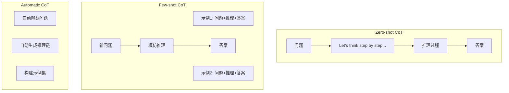
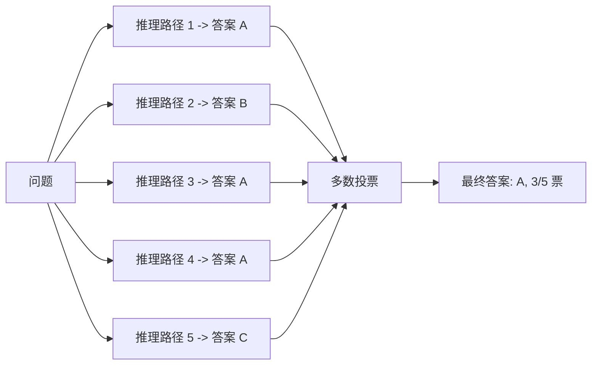

## 概述

推理（Reasoning）是 Agent 的认知内核——它决定了 Agent 如何理解问题、分析信息、做出决策。如果将 Agent 比作一个人，规划是"想做什么"，工具使用是"怎么动手"，那么推理就是贯穿始终的"怎么想"。

LLM 本身的推理能力来源于训练数据中的推理模式，但通过精心设计的提示策略和架构模式，我们可以显著增强和引导 Agent 的推理质量。本章将系统梳理从基础的 Chain-of-Thought 到前沿的"思考模型"（Thinking Models）等推理技术。

## Chain-of-Thought：显式推理链

Chain-of-Thought (CoT) [Wei et al., 2022] 是提升 LLM 推理能力最基础也最有效的技术。其核心洞察是：让模型"说出"中间推理步骤，而非直接跳到最终答案。

### 为什么 CoT 有效

从信息论角度看，CoT 将一个困难的"一步到位"问题分解为多个简单的"一步推导"。每个推理步骤的难度大幅降低，错误累积的风险也相应减少。从注意力机制的角度，中间步骤为后续生成提供了丰富的上下文锚点。

### CoT 的三种形态



**Zero-shot CoT**：只需在 Prompt 末尾添加"Let's think step by step"，即可激活模型的逐步推理能力。简单但对复杂问题效果有限。

**Few-shot CoT**：提供包含完整推理过程的示例，引导模型模仿相同的推理模式。效果更好但需要人工编写示例。

**Automatic CoT**：自动化地构建推理示例，降低人工成本。

## ReAct：推理与行动的交织

ReAct [Yao et al., 2023] 将推理（Reasoning）和行动（Acting）交替进行，形成 Thought-Action-Observation 循环。这是当前 Agent 系统中最广泛使用的推理-执行模式。

```python
def react_loop(question: str, llm, tools, max_steps: int = 10):
    """ReAct 推理-行动循环"""
    context = f"Question: {question}\n"
    
    for step in range(max_steps):
        # 生成推理和行动
        response = llm.generate(
            system="你是一个善于推理的助手。"
                   "每步先用 Thought 分析当前状况，"
                   "再用 Action 决定下一步操作，"
                   "或用 Final Answer 给出最终答案。",
            user=context
        )
        
        # 解析响应
        thought = extract_thought(response)
        context += f"Thought: {thought}\n"
        
        if has_final_answer(response):
            return extract_final_answer(response)
        
        action = extract_action(response)
        context += f"Action: {action}\n"
        
        # 执行行动，获取观察
        observation = tools.execute(action)
        context += f"Observation: {observation}\n"
    
    return "达到最大步数，未能得出结论"
```

ReAct 的关键优势在于"接地"（Grounding）：每次推理之后都通过实际观察来验证或修正，避免了纯推理容易产生的幻觉累积问题。关于 ReAct 模式的更多讨论，参见 [../05-fundamentals/agentic-patterns.md](../05-fundamentals/agentic-patterns.md)。

## 自一致性（Self-Consistency）

Self-Consistency [Wang et al., 2023] 基于一个朴素但强大的直觉：如果多条独立推理路径都指向同一个答案，那这个答案很可能是正确的。

### 工作原理

1. 对同一个问题，通过高温采样生成 N 条不同的推理链
2. 每条推理链得出一个答案
3. 对所有答案进行多数投票（Majority Voting）
4. 最多票的答案作为最终输出



这种方法以增加计算成本（N 倍推理）为代价，显著提升了推理准确性。在数学推理和常识推理任务上，Self-Consistency 通常能带来 5-15% 的准确率提升。

## 结构化输出推理

在 Agent 系统中，推理结果往往需要以结构化格式输出——JSON 用于工具调用参数、结构化决策用于流程控制。

### JSON Mode 与约束生成

现代 LLM API 提供了 JSON Mode 或结构化输出（Structured Output）能力，确保模型输出符合预定义的 Schema。这对推理结果的可靠解析至关重要：

```python
# 结构化推理输出示例
reasoning_schema = {
    "type": "object",
    "properties": {
        "analysis": {
            "type": "string",
            "description": "对问题的分析过程"
        },
        "confidence": {
            "type": "number",
            "minimum": 0,
            "maximum": 1,
            "description": "对结论的置信度"
        },
        "decision": {
            "type": "string",
            "enum": ["proceed", "ask_user", "abort"],
            "description": "下一步决策"
        },
        "reasoning_steps": {
            "type": "array",
            "items": {"type": "string"},
            "description": "关键推理步骤"
        }
    },
    "required": ["analysis", "confidence", "decision"]
}
```

结构化输出使推理过程可被程序化地检查和利用，是 Agent 系统可靠运行的基础。

## 推理失败模式

### 幻觉推理

模型产生看似合理但事实错误的推理链。常见表现：虚构不存在的事实作为推理前提，或在数学计算中"跳步"得出错误中间结果。

### 循环推理

模型在推理过程中陷入循环，反复重申相同的论点而无法推进。这在复杂的多步推理中尤为常见，通常是因为模型缺乏足够的信息来突破当前推理瓶颈。

### 过早结论

模型在信息不充分时就给出确定性结论，跳过了必要的信息收集或验证步骤。在 Agent 场景中，这可能表现为未使用可用工具就直接回答。

### 锚定偏差

模型过度依赖 Prompt 中提到的第一个信息或假设，即使后续信息表明该假设有误，也难以修正推理方向。

## 推理成本的权衡

### 延迟与质量

更长的推理链通常意味着更高的质量，但也意味着更长的响应时间和更高的 Token 消耗。实践中需要根据任务重要性动态调整推理深度：

- **简单查询**：直接回答，无需显式推理
- **中等复杂度**：简短的内部推理即可
- **高复杂度/高风险**：完整的多步推理，可能结合 Self-Consistency

### Token 预算管理

```python
def adaptive_reasoning(query: str, llm, complexity_estimator):
    """根据任务复杂度自适应调整推理策略"""
    complexity = complexity_estimator.assess(query)
    
    if complexity < 0.3:
        # 简单任务：直接回答
        return llm.generate(query, max_tokens=200)
    
    elif complexity < 0.7:
        # 中等任务：标准 CoT
        return llm.generate(
            f"Let's think step by step.\n{query}",
            max_tokens=800
        )
    
    else:
        # 复杂任务：Self-Consistency
        responses = [
            llm.generate(query, temperature=0.7, max_tokens=1500)
            for _ in range(5)
        ]
        return majority_vote(responses)
```

## 思考模型：推理的新范式

OpenAI 的 o1/o3 系列和其他"思考模型"（Thinking Models）代表了推理技术的新方向。与传统的显式 CoT Prompting 不同，这些模型将推理过程内化为模型能力本身。

### 显式 CoT vs 内化推理

**显式 CoT（传统方式）**：通过 Prompt 工程引导模型输出推理步骤，推理质量高度依赖 Prompt 设计。

**内化推理（思考模型）**：模型在生成最终回答前进行内部的"思考"（不一定展示给用户），推理能力通过训练获得而非 Prompt 激发。

### 对 Agent 设计的影响

思考模型的出现正在改变 Agent 的设计思路：推理不再需要显式地编排在 Agent 循环中，而是可以委托给模型内部处理。这简化了 Agent 架构，但也降低了推理过程的可观测性和可控性——这是一个需要在实践中权衡的设计决策。

## 本章小结

推理引擎是 Agent 智能行为的认知基础。从 Chain-of-Thought 的显式推理链，到 ReAct 的推理-行动交织，再到 Self-Consistency 的多路径验证，不同的推理策略适用于不同的场景和需求。理解推理的失败模式（幻觉、循环、过早结论）对于构建可靠的 Agent 至关重要。随着思考模型的兴起，推理正在从"Prompt 工程技巧"演变为"模型原生能力"，但如何在可控性与能力之间取得平衡，仍是 Agent 工程的核心议题。

## 延伸阅读

- [Wei et al., 2022] "Chain-of-Thought Prompting Elicits Reasoning in Large Language Models"
- [Yao et al., 2023] "ReAct: Synergizing Reasoning and Acting in Language Models"
- [Wang et al., 2023] "Self-Consistency Improves Chain of Thought Reasoning in Language Models"
- [Kojima et al., 2022] "Large Language Models are Zero-Shot Reasoners"
- [OpenAI, 2024] "Learning to Reason with LLMs" (o1 System Card)
- [Anthropic, 2025] "Extended Thinking" 技术文档
