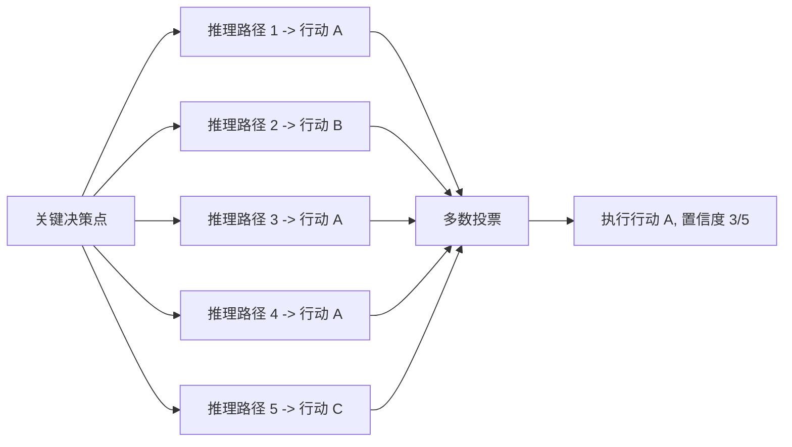

## 概述

推理（Reasoning）是 Agent 的认知内核——它决定了 Agent 如何理解问题、分析信息、做出决策。如果将 Agent 比作一个人，规划是"想做什么"，工具使用是"怎么动手"，那么推理就是贯穿始终的"怎么想"。

### 本章定位：Agent 推理工程，而非 LLM 推理原理

本章专注于 **Agent 工程师的视角**——如何在 Agent 系统中选择、编排和优化推理能力。它回答的核心问题是："我在构建 Agent 时，应该如何利用 LLM 的推理能力来实现可靠的决策？"

这与 LLM 本身的推理能力原理（CoT 如何被发现、训练数据如何构造、向量空间中推理如何发生）是不同层面的问题。后者属于"模型层"知识，详见 [思维链的发现与训练](../../01-history/02-llm-agent-rise/chain-of-thought.md)。两者的关系如下：

| 层面 | 关注点 | 典型问题 | 相关章节 |
|-----|--------|---------|---------|
| **LLM 推理能力**（模型层） | 推理能力从何而来、如何训练 | "CoT 训练数据长什么样？" "o1 的 RL 怎么做的？" | [chain-of-thought.md](../../01-history/02-llm-agent-rise/chain-of-thought.md) |
| **Agent 推理工程**（应用层） | 如何在 Agent 中编排推理 | "什么时候该用深度推理？" "ReAct 循环何时终止？" | 本章 |

一个类比：LLM 推理能力好比"发动机的马力"——它是底层能力；Agent 推理工程好比"变速箱和驾驶策略"——它决定何时加速、何时刹车、何时换挡。一个好的 Agent 不是简单地"把推理能力拉满"，而是根据任务需求动态调配推理资源。

## ReAct：Agent 推理的基础范式

ReAct [Yao et al., 2023] 将推理（Reasoning）和行动（Acting）交替进行，形成 Thought-Action-Observation 循环。这是当前 Agent 系统中最广泛使用的推理-执行模式，也是"Agent 推理"区别于"LLM 推理"的标志性特征。

**为什么 ReAct 属于 Agent 层而非 LLM 层？** 纯 LLM 推理（CoT）是在模型内部完成的——输入一个问题，输出一段推理链，全程不与外部世界交互。ReAct 则引入了**行动**和**观察**——Agent 在推理后会执行工具调用、读取环境反馈，然后基于新信息继续推理。这种"推理-行动-观察"循环是 Agent 独有的，LLM 本身不具备。

```python
def react_loop(question: str, llm, tools, max_steps: int = 10):
    """ReAct 推理-行动循环"""
    context = f"Question: {question}\n"
    
    for step in range(max_steps):
        # 生成推理和行动
        response = llm.generate(
            system="你是一个善于推理的助手。"
                   "每步先用 Thought 分析当前状况，"
                   "再用 Action 决定下一步操作，"
                   "或用 Final Answer 给出最终答案。",
            user=context
        )
        
        # 解析响应
        thought = extract_thought(response)
        context += f"Thought: {thought}\n"
        
        if has_final_answer(response):
            return extract_final_answer(response)
        
        action = extract_action(response)
        context += f"Action: {action}\n"
        
        # 执行行动，获取观察
        observation = tools.execute(action)
        context += f"Observation: {observation}\n"
    
    return "达到最大步数，未能得出结论"
```

ReAct 的关键优势在于"接地"（Grounding）：每次推理之后都通过实际观察来验证或修正，避免了纯推理容易产生的幻觉累积问题。关于 ReAct 模式的更多讨论，参见 [Agent 设计模式](../05-fundamentals/agentic-patterns.md)。

### ReAct 的工程决策点

在实际 Agent 开发中，ReAct 循环涉及多个工程决策：

**循环终止条件**：何时认为推理已经完成？常见策略包括模型显式输出"Final Answer"标记、达到最大步数上限、或连续 N 步未产生新的有效行动。

**上下文管理**：随着循环进行，Thought-Action-Observation 的累积会迅速消耗 Token 窗口。工程实践中需要对历史步骤进行摘要压缩，或采用滑动窗口只保留最近 K 步的完整信息。

**错误恢复**：当工具调用失败（API 超时、参数错误）时，Agent 应能识别失败并调整策略——而不是陷入无意义的重试循环。

## 推理策略的选择与路由

Agent 工程师面临的核心问题不是"推理好不好"，而是"在这个具体场景下，该用什么级别的推理"。不同的推理策略有不同的成本-质量权衡：

### 推理深度的分级

```python
def adaptive_reasoning(query: str, llm, complexity_estimator):
    """根据任务复杂度自适应调整推理策略"""
    complexity = complexity_estimator.assess(query)
    
    if complexity < 0.3:
        # 简单任务：直接回答，无需显式推理
        # 例如："今天天气怎样？" → 直接调用天气工具
        return llm.generate(query, max_tokens=200)
    
    elif complexity < 0.7:
        # 中等任务：标准 CoT，单路径推理
        # 例如："帮我比较这两个方案的优缺点"
        return llm.generate(
            f"Let's think step by step.\n{query}",
            max_tokens=800
        )
    
    else:
        # 复杂任务：多路径推理 + 自一致性验证
        # 例如："设计一个高并发的支付系统架构"
        responses = [
            llm.generate(query, temperature=0.7, max_tokens=1500)
            for _ in range(5)
        ]
        return majority_vote(responses)
```

### 复杂度到底由谁评估？——`complexity_estimator` 的真实机制

上面代码里的 `complexity_estimator.assess(query)` 是一个被刻意抽象的"黑盒"。一个很自然的问题是：这个复杂度分数到底是谁打出来的？是再调一次大模型让它"自评"，还是另有机制？答案是：**工业界存在一整套从重到轻、从启发式到学习型的方法谱系，绝不止"让 LLM 自己判断"这一种**。这件事本质上属于一个已经被系统研究并商业化的领域——**LLM 路由（LLM Routing）/ 查询难度预估（Query Difficulty Estimation）**。

下面按"评估成本由低到高"排列常见机制：

| 机制 | 是否需要调用 LLM | 典型延迟 | 准确性 | 代表性工业/研究实现 |
|------|----------------|---------|--------|-------------------|
| **启发式规则** | 否 | < 1ms | 低（但便宜） | 按 query 长度、关键词（"设计/证明/规划"）、是否含代码块、工具数量等打分 |
| **嵌入相似度** | 仅一次 embedding | 1-10ms | 中 | 把 query 嵌入后，与一批"已知难/易样本"比对相似度（RouteLLM 的 SW ranking 即属此类） |
| **轻量分类器** | 否（独立小模型） | 5-15ms | 中高 | BERT 分类器、矩阵分解（Matrix Factorization），RouteLLM 的核心路由器 |
| **模型不确定性信号** | 是（被路由模型本身） | 与一次推理同量级 | 中高 | 用小模型先答，读取 logprob/熵/自洽性方差，低置信再升级到大模型（cascade） |
| **LLM-as-Judge** | 是（额外一次调用） | 与一次推理同量级 | 高（但最贵） | 显式让一个 LLM 对 query 难度打分，常用于离线生成训练标签 |

**为什么不直接用 LLM-as-Judge？** 因为路由的全部价值就在于"省钱省延迟"。如果每个 query 都先花一次大模型调用去评估难度，再决定要不要用大模型，那评估本身的开销就吃掉了路由收益。所以**真正用于线上实时路由的，几乎都是不需要调用 LLM 的轻量机制（分类器/嵌入/启发式），而 LLM-as-Judge 主要用于离线"造数据"——给训练分类器准备标签**。

#### 工业级实证：RouteLLM（LMSYS, 2024）

最具代表性、且开源可复现的工业方案是 LMSYS 团队的 **RouteLLM**（Ong et al., 2024）。它把"该用强模型还是弱模型"建模为一个二分类/打分问题，并给出了四种 router：

- **相似度加权排序（SW ranking）**：基于 query 嵌入与历史偏好数据的相似度加权；
- **矩阵分解（Matrix Factorization, MF）**：学习 query 与模型的隐式偏好矩阵；
- **BERT 分类器**：用 BERT 直接对 query 做"强/弱模型"分类；
- **因果 LLM 分类器（Causal LLM classifier）**：用一个小的因果语言模型做分类。

这些 router 在约 **8 万条 Chatbot Arena 人类偏好数据**上训练。关键结果：在 MT Bench 上达到 **GPT-4 95% 质量的同时把成本降低 85% 以上**，MMLU 上节省约 45%，GSM8K 上约 35%；其中 MF router 仅用 **26% 的 GPT-4 调用量**就能保住 95% 的 GPT-4 质量（叠加 LLM-judge 增强数据后可降至 14%）。更重要的是，这些 router 训练好后**无需重新训练即可泛化到新的模型对组合**——这正是"复杂度评估"可以做成独立、可复用组件的工程依据。

#### 不止路由模型，还能路由"推理策略"

值得注意的是，上面 `adaptive_reasoning` 代码做的事比"选模型"更进一步——它根据复杂度选择**推理策略**（直接回答 / 单路径 CoT / 多路径自一致性）。这一方向也有研究支撑：**Route-To-Reason（RTR）** 等工作把"模型 + 推理策略（是否 CoT、是否多采样）"作为一个联合的路由空间来优化，在保持准确率的同时显著削减推理 token 开销。换句话说，本节代码里那个看似简单的 `if/elif/else`，在前沿系统中正被替换成一个学习型的"模型 × 策略"联合路由器。

#### 商业化产品

这一能力已经产品化：**Martian** 与 **Unify AI** 等公司提供商用的模型路由服务，按 query 实时选择性价比最优的底层模型；RouteLLM 论文也指出其开源路由器在同等质量下比这些商业方案便宜约 40%。这说明 `complexity_estimator` 不是教学用的占位符，而是一个有真实市场、真实收益的工程组件。

**给 Agent 工程师的实践结论**：不要默认"复杂度只能让 LLM 自评"。线上实时路由优先选**轻量分类器 / 嵌入相似度 / 启发式规则**（毫秒级、零额外 LLM 调用）；把 **LLM-as-Judge 留给离线标注**，用它产出的标签去训练那个轻量分类器。下面给出一个把上述思路落到实处的 `complexity_estimator` 参考实现：

```python
class ComplexityEstimator:
    """生产可用的复杂度评估器：优先零成本启发式，再叠加轻量分类器。

    设计原则（源自 RouteLLM 的工程经验）：
    - 线上路径绝不调用大模型，否则路由收益被评估开销吃掉；
    - 启发式规则提供快速兜底，分类器提供学习型精度；
    - 分类器的训练标签可由离线 LLM-as-Judge 产出。
    """

    def __init__(self, classifier=None):
        # classifier: 可选的轻量分类器（如 BERT/MF），未提供时仅用启发式
        self.classifier = classifier

    def assess(self, query: str) -> float:
        # 1) 零成本启发式信号（< 1ms）
        score = 0.0
        tokens = query.split()
        if len(tokens) > 60:
            score += 0.3                      # 长 query 通常更复杂
        if any(k in query for k in ("设计", "架构", "证明", "规划", "优化", "权衡")):
            score += 0.4                      # 强规划/推理意图关键词
        if "```" in query or "def " in query:
            score += 0.2                      # 含代码，倾向需要深度推理

        # 2) 若有轻量分类器，融合其学习型判断（5-15ms，无需调用大模型）
        if self.classifier is not None:
            score = 0.5 * score + 0.5 * self.classifier.predict_proba(query)

        return min(score, 1.0)
```

### 模型路由：不同推理模型的分工

现代 Agent 系统越来越多地采用"模型路由"架构——为不同的推理需求选择不同的模型：

| 推理需求 | 推荐模型类型 | 典型延迟 | 成本 | 适用场景 |
|---------|------------|---------|------|---------|
| 简单判断/分类 | 轻量模型（Haiku 级） | < 1s | 极低 | 意图识别、参数提取 |
| 标准推理 | 通用模型（Sonnet/GPT-4o 级） | 2-5s | 中等 | 多步工具调用、信息综合 |
| 深度推理/规划 | 推理模型（o1/R1 级） | 10-60s | 较高 | 复杂规划、关键决策、代码生成 |

Agent 工程师的职责是设计路由策略：哪些决策点需要深度推理（高风险、不可逆的操作），哪些可以用快速直觉（日常的信息查询和格式转换）。

## 结构化输出推理

在 Agent 系统中，推理结果往往需要以结构化格式输出——JSON 用于工具调用参数、结构化决策用于流程控制。这是 Agent 推理区别于开放式 LLM 对话的另一个关键特征。

### JSON Mode 与约束生成

现代 LLM API 提供了 JSON Mode 或结构化输出（Structured Output）能力，确保模型输出符合预定义的 Schema。这对推理结果的可靠解析至关重要：

```python
# Agent 决策的结构化推理输出
reasoning_schema = {
    "type": "object",
    "properties": {
        "analysis": {
            "type": "string",
            "description": "对当前状况的分析过程"
        },
        "confidence": {
            "type": "number",
            "minimum": 0,
            "maximum": 1,
            "description": "对决策的置信度"
        },
        "decision": {
            "type": "string",
            "enum": ["proceed", "ask_user", "abort"],
            "description": "下一步决策"
        },
        "tool_call": {
            "type": "object",
            "description": "如果决策是 proceed，具体调用什么工具",
            "properties": {
                "name": {"type": "string"},
                "arguments": {"type": "object"}
            }
        }
    },
    "required": ["analysis", "confidence", "decision"]
}
```

结构化输出使推理过程可被程序化地检查和利用，是 Agent 系统可靠运行的基础。它确保了 Agent 的推理结果能被下游的执行引擎正确解析和执行。

### 技术实现：各厂商 Structured Output 对比

结构化输出在 API 层面有两条技术路线：**约束解码（Constrained Decoding）** 和 **后处理校验（Post-hoc Validation）**。前者从 token 采样阶段就施加约束，保证 100% 格式合规；后者依赖模型"自觉"遵循格式，输出后再验证。

**OpenAI 的实现：**

```python
from openai import OpenAI
client = OpenAI()

# 方式1：json_object 模式（后处理校验，不保证 Schema 合规）
response = client.chat.completions.create(
    model="gpt-4o",
    response_format={"type": "json_object"},
    messages=[{"role": "user", "content": "以JSON格式返回分析结果"}]
)

# 方式2：json_schema 模式（约束解码，100% Schema 合规，推荐）
response = client.chat.completions.create(
    model="gpt-4o-2024-08-06",
    response_format={
        "type": "json_schema",
        "json_schema": {
            "name": "agent_decision",
            "strict": True,  # 启用严格模式，保证输出完全匹配 Schema
            "schema": {
                "type": "object",
                "properties": {
                    "analysis": {"type": "string"},
                    "decision": {"type": "string", "enum": ["proceed", "ask_user", "abort"]},
                    "tool_call": {
                        "type": ["object", "null"],
                        "properties": {
                            "name": {"type": "string"},
                            "arguments": {"type": "object"}
                        }
                    }
                },
                "required": ["analysis", "decision"],
                "additionalProperties": False
            }
        }
    },
    messages=[...]
)
```

`strict: True` 模式下，OpenAI 在首次请求时编译 Schema 为 Context-Free Grammar（CFG），后续的 token 采样严格遵循该语法——每个 token 的 logit 中只保留符合当前语法状态的候选词，从根本上杜绝格式错误。代价是首次请求有 Schema 编译延迟（约 1-10s，之后被缓存），且不支持所有 JSON Schema 特性（如 `pattern`、`minItems` 等动态约束）。

**Anthropic 的实现：**

Anthropic 不提供原生的 `response_format` 参数，而是通过 Tool Use 机制实现结构化输出：

```python
import anthropic
client = anthropic.Anthropic()

# 通过定义一个"虚拟工具"来约束输出格式
response = client.messages.create(
    model="claude-sonnet-4-20250514",
    max_tokens=1024,
    tools=[{
        "name": "agent_decision",
        "description": "输出Agent的决策结果",
        "input_schema": {
            "type": "object",
            "properties": {
                "analysis": {"type": "string", "description": "推理过程"},
                "decision": {"type": "string", "enum": ["proceed", "ask_user", "abort"]},
            },
            "required": ["analysis", "decision"]
        }
    }],
    tool_choice={"type": "tool", "name": "agent_decision"},  # 强制调用该工具
    messages=[...]
)
# 从 tool_use content block 中提取结构化结果
decision = response.content[0].input  # 已是合规的 dict
```

**开源方案——约束解码引擎：**

对于自部署模型（vLLM、SGLang），可使用 Outlines 或 Guidance 实现约束解码：

```python
import outlines

# Outlines 将 JSON Schema 编译为有限状态机（FSM）
# 在 token 采样时，只允许当前 FSM 状态可接受的 token
model = outlines.models.vllm("meta-llama/Llama-3-8B-Instruct")
generator = outlines.generate.json(model, schema=reasoning_schema)
result = generator("分析当前任务并给出决策...")
# result 保证是合规的 Python dict
```

Outlines 的核心原理是将 JSON Schema → 正则表达式 → 确定性有限自动机（DFA）。每生成一个 token，根据 DFA 的当前状态计算合法的下一步 token 集合，将其他 token 的 logit 设为 -∞。这种方法零额外延迟（token 级过滤与采样同步进行），但对复杂嵌套 Schema 会产生较大的 DFA 状态空间。

### 约束解码究竟发生在哪里？——不是模型内部，而是解码循环

一个极易被误解的点：约束解码**不是 LLM 神经网络自己完成的，而是推理引擎的"解码循环"在模型每一步输出之后、采样之前插入的一道工序**。理解这一点，才算真正理解结构化输出。

需要分清两个独立的角色：

- **LLM 模型（神经网络）**：职责只有一个——输入一串 token，输出"下一个 token 的概率分布"（logits，词表里每个 token 一个分数）。模型本身**不知道**什么是 JSON、什么是 Schema，它只会算概率。约束解码**没有修改模型的任何权重**。
- **解码循环（decoding loop，位于推理引擎中，如 vLLM/SGLang/OpenAI 后端）**：它拿到模型吐出的 logits 后，**在采样之前**用状态机算出"此刻哪些 token 合法"，把非法 token 的 logit 设为 `-∞`（mask 掉），然后才采样。

每生成一个 token，都重复这套流程：

```
                  ┌─────────────────────────────────────────────┐
                  │  解码循环（推理引擎，非模型本身）              │
                  │                                              │
  已生成的 token ─┼─→ [LLM 神经网络] ─→ logits（整个词表的分数）  │
                  │                          │                   │
                  │                          ▼                   │
                  │       [状态机查询：当前能接哪些 token?]        │ ← 约束在这一步！
                  │                          │                   │
                  │                          ▼                   │
                  │     [把非法 token 的 logit 设为 -∞（mask）]    │
                  │                          │                   │
                  │                          ▼                   │
                  │            [采样] ─→ 选出下一个 token          │
                  └──────────────────────────┼───────────────────┘
                                             ▼
                                    追加到序列，进入下一轮
```

一句话概括：**模型负责"想说什么"，解码循环负责"不许说违规的"。** 正因为约束完全在模型外部、靠工程代码（状态机 + logit mask）实现，所以 Outlines、Guidance 这类库才能给任意开源模型套上约束解码——它们根本不碰模型权重，只在解码循环里插一个 mask 步骤。

### "此刻哪些 token 合法"——逐 token 走一遍

以 Schema `{"type":"object","properties":{"decision":{"enum":["proceed","abort"]}},"required":["decision"]}` 为例，状态机逐步收窄合法 token 集合（token 切分做了简化）：

| 步骤 | 已生成 | 状态机状态 | 合法 token（保留 logit） | 非法 token（logit→ -∞） |
|------|--------|-----------|------------------------|------------------------|
| 1 | （空） | 期待对象开始 | 只有 `{` | `[`、`"`、任何别的 |
| 2 | `{` | 期待 key（required 非空，不能立刻 `}`） | `"` | `}`、`123`、其他 |
| 3 | `{"` | 拼 key，key 名只能是 `decision` | 只有 `d` | `a`、`x` 等所有其他字母 |
| 4 | `{"d` | 继续拼 `decision` | 只有 `e` | 任何非 `e` 的 token |
| … | `{"decision"` | key 结束，期待冒号 | 只有 `:` | 其余全禁 |
| 5 | `{"decision":` | 期待值，值受 enum 约束 | 只有 `"` | `1`、`t`、`{` |
| 6 | `{"decision":"` | enum 只有两个候选 | 只能 `p`(proceed) 或 `a`(abort) | 其他所有字母 |
| 7 | `{"decision":"p` | 已锁定 proceed 这条路径 | 只能 `r` | 连 `a` 也不行了 |
| … | `{"decision":"proceed` | 期待闭引号 | 只有 `"` | 其他字母 |
| 末 | `{"decision":"proceed"` | required 已满足，可结束 | 只有 `}` | 其余全禁 |

几个关键观察：

- **第 3 步**：因为 key 名固定为 `decision`，状态机直接把每个字母锁死，模型连"选别的 key 名"的机会都没有。
- **第 6→7 步**：这是 enum 的精妙之处。`"` 之后只有 `p`/`a` 合法；一旦选了 `p`，状态机立刻收窄，后续每一步都**唯一确定**（`roceed`），模型即便"想"输出别的也不可能。
- 这正是"100% 合规"的含义——不是事后检查，而是**每一步在物理上就不存在越界的可能**。

也正因为状态机是**有限状态**、没有"计数/记忆"能力，所以 `strict` 模式无法支持 `minItems`（要数到 N）、`pattern` 中的反向引用（要记住前文）这类约束——它们超出了有限状态机的表达力，只能退回后处理校验。

### 解码循环是 Agent 的一个步骤吗？——不是，它在 Agent 之下好几层

这是一个极易混淆的概念边界。系统里其实存在**两个嵌套的"循环"**，名字都带"循环"，但层级完全不同：

- **Agent 循环（Agent Loop）**：最外层，是你写的编排代码。感知 → 推理 → 决策 → 调用工具 → 观察结果 → 再推理……一圈下来可能要发起好几次 LLM 调用、执行好几个工具。它的单位是"**一轮 think-act**"。这才是 Agent 的步骤。
- **解码循环（Decoding Loop）**：最内层，藏在**每一次 LLM 调用内部**。当 Agent 循环里发生"一次 LLM 调用"时，在推理引擎那一侧，模型要一个 token 一个 token 地把回答生成出来——每生成一个 token 就是解码循环转一圈。它的单位是"**一个 token**"。约束解码（logit mask）就发生在这里。

两者是严格嵌套的关系：

```
Agent 循环（你的编排代码，单位：一轮 think-act，跑在你的应用进程里）
  └─ 第 N 轮：发起 1 次 LLM 调用（一次网络请求到模型服务）
       └─ 推理引擎收到请求，进入解码循环（单位：1 个 token，跑在 LLM 服务里）
            ├─ token 1：模型出 logits → [约束 mask] → 采样
            ├─ token 2：模型出 logits → [约束 mask] → 采样
            ├─ token 3：……
            └─ …… 直到生成完整回答（如一个 tool_use 块）
       └─ LLM 调用返回，Agent 拿到结果，执行工具，进入第 N+1 轮
```

它们在三个维度上截然不同：

| 维度 | Agent 循环 | 解码循环 |
|------|-----------|---------|
| **抽象层级** | 应用编排层 | 模型推理层 |
| **迭代单位** | 一轮"思考 + 行动" | 一个 token |
| **运行位置** | 你的应用进程 | LLM 推理服务（OpenAI 服务器 / 自部署 vLLM） |
| **谁控制** | 你显式写 `if/while` 编排 | 你只能通过参数（`response_format`/`temperature`/grammar）**配置**，无法逐 token 介入 |
| **约束解码在哪** | —— | 就在这一层的每次迭代里 |

所以"约束解码是不是 Agent 的一个步骤"的答案是**否定的**：它是 Agent 某个步骤（"调一次 LLM"）**内部、更底层**的实现细节，中间还隔着一次网络请求。打个比方：Agent 循环像是"你打电话问专家"，解码循环像是"专家在电话那头一个字一个字地组织回答"——你不会把"专家吐字"当成你打电话流程里的一步。

一句话记住三者的包含关系：**一次 Agent 步骤 ⊇ 一次 LLM 调用 ⊇ 成百上千次解码循环迭代。**

**技术选型决策：**

| 场景 | 推荐方案 | 理由 |
|------|---------|------|
| 使用 OpenAI API | `json_schema` + `strict: True` | 100% 合规，无需客户端校验 |
| 使用 Anthropic API | Tool Use + `tool_choice` 强制 | 官方推荐路径，合规率 > 99% |
| 自部署开源模型 | vLLM + Outlines | 引擎级约束，性能最优 |
| 需要流式解析 | 后处理校验 + 增量 JSON Parser | 约束解码与流式部分兼容，但需特殊处理 |
| Schema 含动态约束 | 后处理校验 + Pydantic | `strict` 模式不支持 `pattern`/`minItems` |

**容错策略——当结构化输出仍然失败时：**

即使使用约束解码，也存在模型拒绝生成（refusal）或超出 `max_tokens` 导致截断的情况。生产系统需要实现分层容错：

```python
import json
from pydantic import BaseModel, ValidationError

class AgentDecision(BaseModel):
    analysis: str
    decision: str
    tool_call: dict | None = None

def parse_structured_output(raw_output: str, retries: int = 2) -> AgentDecision:
    """分层容错的结构化输出解析"""
    # 第1层：直接解析（约束解码应该在此成功）
    try:
        return AgentDecision.model_validate_json(raw_output)
    except (json.JSONDecodeError, ValidationError):
        pass
    
    # 第2层：修复常见格式错误（截断、多余文本包裹）
    import re
    json_match = re.search(r'\{.*\}', raw_output, re.DOTALL)
    if json_match:
        try:
            return AgentDecision.model_validate_json(json_match.group())
        except (json.JSONDecodeError, ValidationError):
            pass
    
    # 第3层：重试请求（可切换为更强模型）
    if retries > 0:
        new_output = call_llm_with_stricter_prompt(raw_output)
        return parse_structured_output(new_output, retries - 1)
    
    # 第4层：降级为默认安全决策
    return AgentDecision(analysis="解析失败，采用安全默认值", decision="ask_user")
```

### 推理与行动的解耦

一个重要的工程模式是将"推理"和"行动指令"分离在输出的不同字段中：

- `analysis` 字段承载自由格式的推理过程（可供调试和审计）
- `decision` 和 `tool_call` 字段承载结构化的行动指令（可供执行引擎解析）

这种解耦让开发者在不影响执行可靠性的前提下获得推理的可观测性。

## 推理失败模式与防御

Agent 推理失败的后果比纯 LLM 对话严重得多——因为 Agent 会基于推理结果执行真实操作。理解和防御推理失败模式是 Agent 工程的核心课题。

### 幻觉推理

模型产生看似合理但事实错误的推理链。在 Agent 场景中特别危险：Agent 可能基于虚构的 API 接口名发起调用，或基于不存在的文件路径执行操作。防御策略包括工具结果验证、Schema 校验、以及关键操作前的确认机制。

### 循环推理

模型在推理过程中陷入循环，反复重申相同的论点而无法推进。在 ReAct 循环中表现为反复调用同一个工具却不处理返回结果，或在 Thought 中反复重述问题而不推进。防御策略：设置最大步数、检测重复 Action、以及"卡住"时自动升级推理策略。

### 过早结论

模型在信息不充分时就给出确定性结论，跳过了必要的信息收集或验证步骤。在 Agent 场景中，这表现为未使用可用工具就直接回答（明明可以查数据库却凭记忆回答），或在复杂决策中跳过风险评估直接执行。

### 锚定偏差

模型过度依赖 Prompt 中提到的第一个信息或用户最初的表述，即使后续的工具返回结果表明该假设有误，也难以修正推理方向。在 Agent 中，这可能导致 Agent 坚持一个已经被证伪的假设去执行后续操作。

## 自一致性在 Agent 中的应用

Self-Consistency [Wang et al., 2023] 的核心思想——"多路径推理 + 多数投票"——在 Agent 工程中有独特的应用方式，与纯 LLM 场景不同：



**Agent 中的自一致性不是用于"答题"，而是用于"关键决策"。** 典型应用场景包括：不可逆操作前的多路径验证（"真的应该删除这个文件吗？"）、高风险判断的交叉检验（"这个异常是否需要触发告警？"）、以及歧义消解（"用户说的'那个文件'到底指哪个？"）。

与纯 LLM 的 Self-Consistency 不同，Agent 中的多路径推理可以**利用不同的工具组合**来实现：路径1通过搜索引擎验证，路径2通过数据库查询验证，路径3通过文件系统检查验证。如果多条独立验证路径都指向同一个结论，置信度就更高。

## 思考模型对 Agent 架构的影响

OpenAI 的 o1/o3 系列和 DeepSeek-R1 等"思考模型"（Thinking Models）代表了推理技术的新范式。它们对 Agent 架构设计带来了具体的工程影响。

### 显式编排 vs 委托给模型

**传统 Agent（显式推理编排）**：开发者在 System Prompt 中精心设计推理指令，通过 ReAct 循环显式控制推理步骤。推理质量高度依赖 Prompt 设计，但过程完全可观测。

**使用思考模型的 Agent（推理委托）**：模型在生成最终回答前进行内部"思考"（可能展示也可能不展示），推理能力是模型内在的。开发者可以简化 Agent 循环——不再需要反复提示"请一步一步思考"。

### 工程权衡

| 维度 | 显式推理编排 | 委托思考模型 |
|------|-----------|------------|
| 可观测性 | 高（每步可追踪） | 低（内部思考可能不可见） |
| 延迟 | 可控（按需调整） | 较高（模型自主决定思考时长） |
| 成本 | 可预测 | 波动较大 |
| 定制性 | 高（通过 Prompt 精细控制） | 低（模型自主推理） |
| 推理质量上限 | 受限于 Prompt 设计 | 更高（模型内在能力） |

实践中的折中方案是：**在规划层使用思考模型**（需要深度推理、方案探索的阶段），**在执行层使用显式 ReAct 编排**（需要精确控制、可追踪的阶段）。这就是"双速推理"架构——慢思考做规划，快执行做操作。

## 本章小结

Agent 推理工程的核心不是"让模型推理得更好"（那是模型层的问题），而是**如何在 Agent 系统中正确地编排推理能力**。这包括：选择合适的推理范式（ReAct vs 纯推理 vs 多路径验证）、设计推理路由策略（什么任务用什么深度的推理）、确保推理结果可靠地传导到执行层（结构化输出）、以及防御推理失败对真实操作的危害。

随着思考模型的成熟，Agent 推理工程正在从"手工编排推理步骤"转向"选择合适的推理模型 + 设计合适的推理预算"——但核心原则不变：推理是 Agent 最昂贵的认知资源，需要按需分配而非无条件消耗。

## 延伸阅读

- [Yao et al., 2023] "ReAct: Synergizing Reasoning and Acting in Language Models"
- [Wang et al., 2023] "Self-Consistency Improves Chain of Thought Reasoning in Language Models"
- [OpenAI, 2024] "Learning to Reason with LLMs" (o1 System Card)
- [Anthropic, 2025] "Extended Thinking" 技术文档
- [Ong et al., 2024] "RouteLLM: Learning to Route LLMs with Preference Data"（LMSYS，开源模型路由的工业级实证，含 SW/MF/BERT/Causal-LLM 四种 router）
- [Route-To-Reason, 2025] 将"模型 + 推理策略"作为联合路由空间优化的研究方向
- [思维链的发现与训练](../../01-history/02-llm-agent-rise/chain-of-thought.md) — LLM 推理能力的完整技术史
