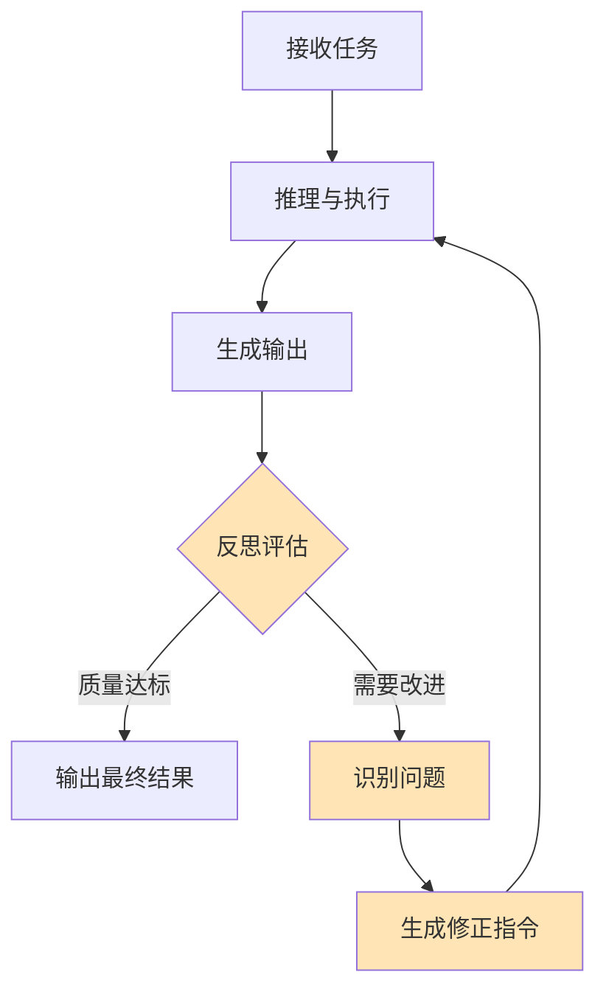
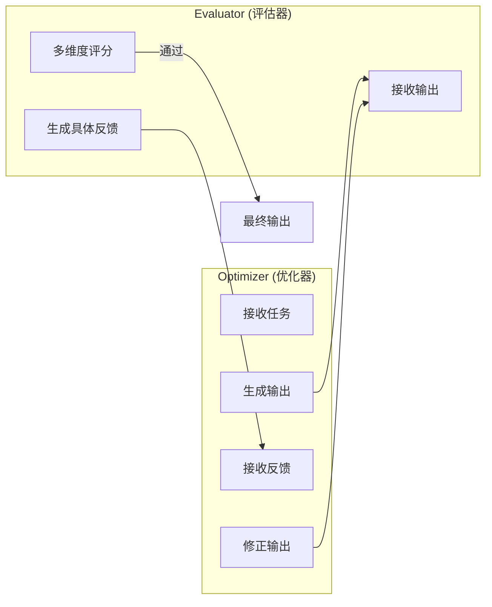

## 概述

反思（Reflection）是 Agent 对自身输出和行为进行自我评估与修正的元认知能力。如果说推理是"想明白问题的答案"，那么反思就是"想明白自己的答案对不对"。

人类专家区别于新手的一个核心特征，正是"知道自己不知道什么"以及"能发现自己的错误"。将这种元认知能力赋予 Agent，是提升其可靠性和输出质量的关键路径。

## 反思在 Agent 中的定位



反思模块通常位于 Agent 执行流程的"输出关卡"，扮演内部质量检查员的角色。它可以在多个层面发挥作用：单次回答的质量把控、工具调用结果的有效性验证、多步执行计划的中期检查。

## Reflexion 框架

Reflexion [Shinn et al., 2023] 是最具影响力的 Agent 反思框架，其核心创新在于将自然语言形式的"反思"作为一种"语义记忆"，跨尝试传递学习经验——本质上是一种"语言强化学习"（Verbal Reinforcement Learning）。

### Reflexion 的三组件

- **Actor（执行者）**：执行任务并生成动作轨迹
- **Evaluator（评估者）**：对执行结果进行评分
- **Self-Reflection（反思者）**：分析失败原因，生成自然语言的反思总结

### 工作流程

```python
def reflexion_loop(task: str, llm, evaluator, max_trials: int = 5):
    """Reflexion 反思循环"""
    reflections = []  # 累积的反思记忆
    
    for trial in range(max_trials):
        # 1. Actor 执行任务（带上历史反思）
        context = f"任务: {task}\n"
        if reflections:
            context += "从之前的尝试中学到的经验:\n"
            for i, ref in enumerate(reflections):
                context += f"  尝试 {i+1} 的反思: {ref}\n"
        
        trajectory = llm.execute_task(context)
        
        # 2. Evaluator 评估结果
        score = evaluator.evaluate(task, trajectory)
        
        if score >= THRESHOLD:
            return trajectory  # 成功
        
        # 3. Self-Reflection 生成反思
        reflection = llm.generate(f"""
        任务: {task}
        执行轨迹: {trajectory}
        评估结果: 失败 (得分: {score})
        
        请分析失败原因，总结经验教训。
        重点关注：
        - 哪一步出了问题？
        - 为什么那样做是错的？
        - 下次应该怎么做不同？
        
        用 2-3 句话简洁总结：
        """)
        
        reflections.append(reflection)
    
    return None  # 所有尝试均失败
```

Reflexion 的关键洞察是：通过自然语言而非梯度来传递学习信号。这使得它可以在不更新模型参数的情况下实现"学习"——每次失败的经验都被编码为文本，供下次尝试参考。

## 自我批评模式（Self-Critique）

自我批评是最常见的反思实现模式，其基本流程是"生成-评估-修正"三步循环：

### Generate-Evaluate-Revise

```python
def self_critique_loop(task: str, llm, max_iterations: int = 3):
    """自我批评循环"""
    # 第一次生成
    output = llm.generate(task)
    
    for iteration in range(max_iterations):
        # 评估当前输出
        critique = llm.generate(f"""
        请严格评估以下输出的质量：
        
        任务要求: {task}
        当前输出: {output}
        
        从以下维度评估：
        1. 准确性：是否有事实错误？
        2. 完整性：是否遗漏了重要内容？
        3. 逻辑性：推理是否连贯？
        4. 格式：是否符合要求的格式？
        
        如果输出已经足够好，回答"PASS"。
        否则，具体指出需要改进的地方。
        """)
        
        if "PASS" in critique:
            return output  # 质量达标
        
        # 基于批评进行修正
        output = llm.generate(f"""
        原始任务: {task}
        当前输出: {output}
        改进建议: {critique}
        
        请根据改进建议修正输出，保留正确的部分，
        只修改需要改进的内容。
        """)
    
    return output  # 返回最后一轮的输出
```

## Evaluator-Optimizer 模式

Anthropic 在其"Building Effective Agents"指南中提出的 Evaluator-Optimizer 模式，是反思机制的一种系统化实现。其核心思想是将"生成者"和"评估者"明确分离为两个独立的角色。

### 架构设计



### 设计要点

**评估标准显式化**：将评估维度以 Rubric 形式明确写入 Evaluator 的 Prompt，避免评估标准模糊或不一致。

**反馈需可操作**：Evaluator 的反馈不应只是"不够好"，而应具体指出"第三段的数据有误，应该是 X 而非 Y"。

**分离关注点**：Optimizer 专注于生成质量，Evaluator 专注于评判标准。两个角色可以使用不同的模型或不同的 Prompt。

这种模式特别适用于参考 [../05-fundamentals/agentic-patterns.md](../05-fundamentals/agentic-patterns.md) 中讨论的 Evaluator-Optimizer 架构模式。

## 何时触发反思

并非每次 Agent 输出都需要反思——过度反思会导致延迟增加和成本膨胀。以下场景适合触发反思：

### 高价值决策

当 Agent 即将执行不可逆操作（如发送邮件、删除文件、提交代码）时，在执行前进行一次反思检查。

### 工具调用失败后

工具返回错误或异常结果时，反思帮助 Agent 理解失败原因并调整策略，而非盲目重试。

### 低置信度输出

当模型自身对输出不确定（可通过 logprob 或显式置信度评估检测）时，触发反思进行二次验证。

### 用户反馈否定后

当用户明确表示"这不对"或"不是我要的"时，Agent 需要反思哪里理解偏差，而非简单重复。

### 多步任务的检查点

在长链任务的关键节点进行阶段性反思，确保整体方向正确。

## 避免无限反思循环

反思机制最大的风险是陷入"反思-修正-再反思"的无限循环。以下策略用于控制这一问题：

### 最大迭代次数

最直接的方法：硬性限制反思轮数（通常 2-3 轮即可）。

### 收益递减检测

```python
def should_continue_reflection(scores: list) -> bool:
    """检测反思是否仍有收益"""
    if len(scores) < 2:
        return True
    
    # 计算最近两轮的改进幅度
    improvement = scores[-1] - scores[-2]
    
    # 改进幅度低于阈值时停止
    if improvement < MIN_IMPROVEMENT_THRESHOLD:
        return False
    
    # 分数已经足够高时停止
    if scores[-1] >= GOOD_ENOUGH_THRESHOLD:
        return False
    
    return True
```

### 多样性约束

如果反思修正后的输出与修正前高度相似（编辑距离很小），说明反思已无法产生实质性改进，应当终止。

### 升级机制

当反思循环达到上限仍未通过评估时，应升级为"请求人类帮助"而非继续空转。

## LLM-as-Judge

LLM-as-Judge 是利用 LLM 本身作为评估器的范式，广泛应用于 Agent 的反思环节。

### 评分维度设计

```python
evaluation_rubric = {
    "accuracy": {
        "description": "事实准确性和信息正确性",
        "scale": "1-5",
        "anchors": {
            5: "所有事实完全正确，无任何错误",
            3: "大部分正确，有 1-2 处小错误",
            1: "存在严重事实错误"
        }
    },
    "completeness": {
        "description": "对任务要求的覆盖程度",
        "scale": "1-5",
        "anchors": {
            5: "完整覆盖所有要求",
            3: "覆盖主要要求，遗漏次要部分",
            1: "严重缺失关键内容"
        }
    },
    "coherence": {
        "description": "逻辑连贯性和表达清晰度",
        "scale": "1-5",
        "anchors": {
            5: "逻辑清晰，论述连贯",
            3: "基本连贯，有少量逻辑跳跃",
            1: "逻辑混乱，难以理解"
        }
    }
}
```

### LLM-as-Judge 的局限

- **自我偏好**：模型倾向于给自己的输出更高评分
- **位置偏差**：在对比评估中倾向于选择第一个选项
- **长度偏差**：倾向于给更长的回答更高分
- **风格偏好**：可能偏好某种特定的表达风格

缓解方法包括：使用不同模型作为 Judge、随机化呈现顺序、设计具体的评分锚点（Anchors）。

## 反思的工程实践

### 反思结果的复用

反思产生的经验不应仅用于当次修正，还应作为长期记忆存储，供未来类似任务参考。这形成了一个"反思-学习-成长"的正循环。

### 分级反思策略

- **轻量反思**：快速的格式和基本事实检查（低成本）
- **标准反思**：多维度质量评估（中等成本）
- **深度反思**：含外部验证（如搜索验证事实）的全面审查（高成本）

根据任务重要性选择合适的反思深度，避免"杀鸡用牛刀"。

### 可观测性

反思过程应被完整记录，包括每轮的评估结果、识别的问题和修正措施。这既用于调试，也用于持续优化反思 Prompt。

## 本章小结

反思与自我修正赋予了 Agent "知错能改"的能力，是从"可用"到"可靠"的关键跃迁。Reflexion 框架展示了如何通过语言化的经验积累实现跨尝试学习，Evaluator-Optimizer 模式提供了系统化的质量保障架构，LLM-as-Judge 则使自动化评估成为可能。在实践中，反思机制的设计重点在于"何时反思"和"何时停止"——过少则质量无保障，过多则效率受损。好的反思系统应像一个有分寸的内部审查员：在关键节点严格把关，在常规流程中轻量通过。

## 延伸阅读

- [Shinn et al., 2023] "Reflexion: Language Agents with Verbal Reinforcement Learning"
- [Madaan et al., 2023] "Self-Refine: Iterative Refinement with Self-Feedback"
- [Anthropic, 2024] "Building Effective Agents" - Evaluator-Optimizer Pattern
- [Zheng et al., 2023] "Judging LLM-as-a-Judge with MT-Bench and Chatbot Arena"
- [Kim et al., 2024] "Language Models can Solve Computer Tasks"
- [Pan et al., 2024] "Automatically Correcting Large Language Models: Surveying the Landscape"
